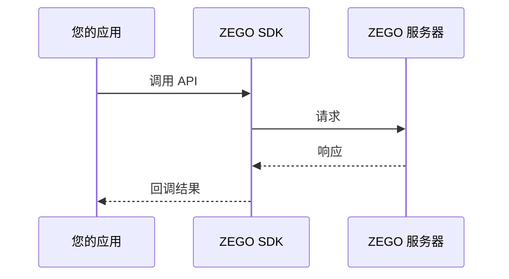

# FunctionGuide（功能指南）结构标准

## 必需章节

| 章节 | 要求 | 内容说明 |
|------|------|----------|
| **功能简介** | 说明该功能是什么，解决什么问题 | 1-2段话清晰描述 |
| **使用场景** | 列举该功能的典型使用场景 | 3-5个真实场景 |
| **功能原理** | 说明影响用户使用的功能原理 | 只讲与使用相关的原理，帮助用户理解 |
| **前提条件** | 说明使用该功能的前置条件 | 如需要先开通某服务、完成某配置 |
| **使用步骤** | 分步骤说明如何使用该功能 | 有序步骤使用 `<Steps>` 组件 |
| **注意事项** | 说明使用该功能时需要注意的事项、限制、坑点 | 列出常见问题 |

## 可选章节

| 章节 | 要求 | 使用场景 |
|------|------|----------|
| **API 说明** | 引用或列出相关的 API 接口 | 需要深入了解 API 时 |
| **最佳实践** | 提供该功能使用的最佳实践建议 | 有优化建议时 |
| **常见问题** | 该功能相关的常见问题 | 问题较多时可单独列出 |

---

## 写作模板

```markdown
# [功能名称]

[一句话说明功能是什么]

## 功能简介

[详细描述功能的作用和解决的问题]

## 使用场景

- **场景1**：[场景描述]
- **场景2**：[场景描述]
- **场景3**：[场景描述]

## 功能原理

[
**写作原则：站在用户角度只讲与用户使用相关的原理**

功能原理不是技术实现细节，而是帮助用户理解"为什么这样用"的背景知识。

**应该包含：**
- 影响使用方式的原理（如：为什么需要先 A 再 B）
- 帮助理解功能边界的工作机制
- 用户需要了解的内部限制原因

**不应该包含：**
- 纯技术实现细节
- 与使用无关的架构说明
- 过于底层的原理
]

### 流程图/时序图

使用 mermaid 绘制：



## 前提条件

在使用此功能前，请确保：

- [前提条件1]
- [前提条件2]

## 使用步骤

[如果是有序步骤，使用 `<Steps>` 组件]

<Steps>
  <Step title="步骤1标题">
    步骤说明

    ```[语言]
    // 代码示例
    ```
  </Step>
  <Step title="步骤2标题">
    步骤说明

    ```[语言]
    // 代码示例
    ```
  </Step>
  <Step title="步骤3标题">
    步骤说明

    ```[语言]
    // 代码示例
    ```
  </Step>
</Steps>

## 注意事项

1. [注意事项1]
2. [注意事项2]
3. [注意事项3]

## 最佳实践（可选）

[最佳实践建议]

## 相关 API

| API | 说明 |
|-----|------|
| [API名称] | [简要说明] |
```

---

## 检查清单

### 内容完整性
- [ ] 功能描述是否清晰
- [ ] 是否有使用场景示例
- [ ] 功能原理是否与使用相关
- [ ] 使用步骤是否有代码示例
- [ ] 注意事项是否覆盖常见坑点
- [ ] 前提条件是否完整

### 格式规范
- [ ] 有序步骤是否使用 `<Steps>` 组件
- [ ] 流程图/时序图是否使用 mermaid
- [ ] 代码示例是否指定语言
- [ ] 是否有必要的注释
