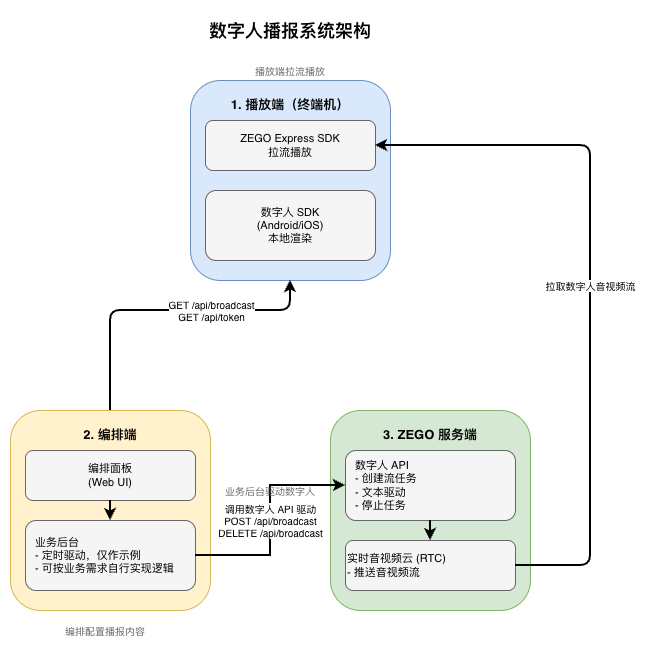
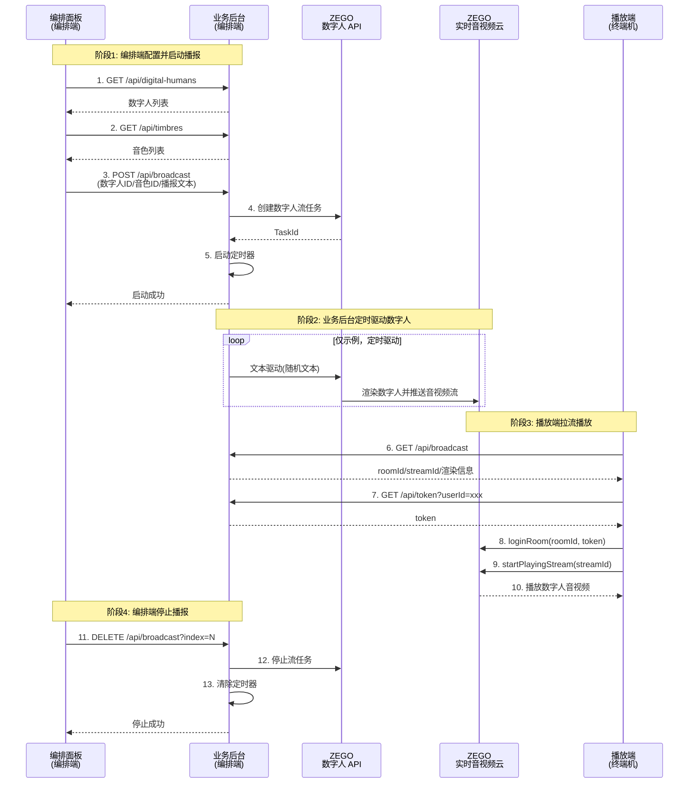

# 数字人播报系统示例

本示例演示数字人播报的**三方架构**：编排端配置播报内容 → 业务后台驱动数字人 → 播放端拉流播放。

## 一、核心架构

数字人播报系统由三个核心角色组成：

### 1. 播放端（终端机）
- **功能**：使用 ZEGO Express SDK 拉取并播放数字人音视频流
- **平台**：
  - Web：直接使用 Express SDK 拉流播放
  - Android/iOS：使用 Express SDK 拉流 + 数字人 SDK 渲染
- **调用接口**：
  - `GET /api/broadcast` - 获取播报信息（roomId/streamId）
  - `GET /api/token` - 获取 RTC Token

### 2. 编排端（编排面板 + 业务服务）
- **编排面板**：Web UI，用于配置数字人播报内容
  - 选择数字人形象和音色
  - 配置播报文本内容
  - 启动/停止播报任务
- **业务服务**（本服务）：接收编排指令，调用 ZEGO 数字人 API 驱动数字人
- **调用接口**：
  - `GET /api/digital-humans` - 获取数字人列表
  - `GET /api/timbres` - 获取音色列表
  - `POST /api/broadcast` - 启动播报任务
  - `DELETE /api/broadcast` - 停止播报任务

### 3. ZEGO 服务端
- **数字人 API**：创建数字人视频流任务、文本驱动数字人、音频驱动数字人、停止数字人视频流任务
- **实时音视频云**：数字人音视频流通过 ZEGO 实时音视频云推送，播放端通过 ZEGO Express SDK 拉取

### 架构图



---

## 二、业务流程时序图



---

## 三、业务后台 API 接口说明

业务后台提供两类接口，分别供编排端和播放端调用：

### 1. 编排端调用接口

编排端（编排面板）调用以下接口配置和管理播报任务：

| 端点 | 方法 | 请求参数 | 说明 |
|------|------|---------|------|
| `/api/digital-humans` | GET | - | 获取数字人列表 |
| `/api/timbres` | GET | `digitalHumanId`（可选） | 获取音色列表 |
| `/api/broadcast` | POST | `digitalHumanId`, `timbreId`, `roomId`, `streamId`, `textPool`, `outputMode` | 启动播报任务 |
| `/api/broadcast?index=N` | DELETE | `index`（查询参数） | 停止指定播报任务 |

**POST /api/broadcast 请求示例：**

其中：
- digitalHumanId, timbreId, roomId, streamId 是 ZEGO 数字人 API 需要的参数
- broadcastIndex 和 textPool 是本业务服务演示用的参数。实际业务应根据需求自行实现。
```json
{
  "broadcastIndex": 0,
  "textPool": ["欢迎光临", "请稍等"],
  "digitalHumanId": "dh_001",
  "timbreId": "timbre_001",
  "roomId": "room_001",
  "streamId": "stream_001",
  "outputMode": 1
}
```


**输出模式说明**

创建播报任务时需要指定 `outputMode`。请根据播放端平台选择合适的模式：

| 模式 | outputMode | 适用播放端 | 说明 |
|------|------------|--------|------|
| Web 模式 | 1 | Web 客户端 | ZEGO Express SDK 直接播放 |
| Mobile 模式 | 2 | Android/iOS 客户端 | ZEGO Express SDK 拉流 + 数字人 SDK 渲染。性能更好。 |


### 2. 播放端调用接口

播放端（终端机）调用以下接口获取播放信息：

| 端点 | 方法 | 请求参数 | 说明 |
|------|------|---------|------|
| `/api/broadcast` | GET | - | 获取播报列表信息（包含 roomId/streamId/渲染信息） |
| `/api/token` | GET | `userId`（查询参数） | 获取 ZEGO 客户端 SDK 用的 Token |

**GET /api/broadcast 响应示例：**

```json
{
  "broadcastList": {
    "0": {
      "taskId": "task_001",
      "roomId": "room_001",
      "streamId": "stream_001",
      "digitalHumanId": "dh_001",
      "clientInferencePackageUrl": "https://...",
      "isSupportSmallImageMode": true
    }
  }
}
```

### 3. 播放端接入示例（Web）

Web 客户端使用 ZEGO Express SDK 拉流播放：

```javascript
// 步骤1: 获取播报信息
const broadcastRes = await fetch('/api/broadcast');
const { broadcastList } = await broadcastRes.json();
const { roomId, streamId } = Object.values(broadcastList)[0];

// 步骤2: 获取 Token
const userId = 'terminal_001';
const tokenRes = await fetch(`/api/token?userId=${userId}`);
const { token } = await tokenRes.json();

// 步骤3: 初始化 Express SDK
const { ZegoExpressEngine } = await import('zego-express-engine-webrtc');
const engine = new ZegoExpressEngine(appId, "");

// 步骤4: 登录 RTC 房间
await engine.loginRoom(roomId, token, {
  userID: userId,
  userName: userId
});

// 步骤5: 拉取数字人音视频流
const remoteStream = await engine.startPlayingStream(streamId);
const remoteView = engine.createRemoteStreamView(remoteStream);
remoteView.play('remote-video'); // 渲染到 DOM 元素
```

### 4. 播放端接入示例（Android/iOS）

移动端需要使用 Express SDK 拉流 + 数字人 SDK 渲染：

```java
// Android 示例

// 步骤1: 获取播报信息（包含渲染信息）
// GET /api/broadcast 返回，取第一个播报任务做示例：
// {
//   "roomId": "room_001",
//   "streamId": "stream_001",
//   "digitalHumanId": "dh_001",
//   "clientInferencePackageUrl": "https://...",
//   "isSupportSmallImageMode": true
// }

// 步骤2: 初始化 Express SDK
ZegoEngineProfile profile = new ZegoEngineProfile();
profile.appID = appId;
profile.scenario = ZegoScenario.HIGH_QUALITY_CHATROOM;
ZegoExpressEngine.createEngine(profile, null);

// 步骤3: 初始化数字人 SDK
IZegoDigitalMobile digitalMobile = ZegoDigitalHuman.create(context);

// 步骤4: 生成 base64Config（使用服务端返回的渲染信息）
String base64Config = generateBase64Config(
    digitalHumanId,
    clientInferencePackageUrl,
    isSupportSmallImageMode
);

// 步骤5: 启动数字人 SDK
digitalMobile.attach(findViewById(R.id.digital_human_view));
digitalMobile.start(base64Config, listener);

// 步骤6: 登录房间并拉流
ZegoExpressEngine.getEngine().loginRoom(roomId, new ZegoUser(userId), token);
ZegoExpressEngine.getEngine().startPlayingStream(streamId);

// 步骤7: 透传视频帧和 SEI 数据给数字人 SDK
ZegoExpressEngine.getEngine().setCustomVideoRenderHandler(new IZegoCustomVideoRenderHandler() {
    @Override
    public void onRemoteVideoFrameRawData(ByteBuffer[] data, int[] dataLength,
                                         ZegoVideoFrameParam param, String streamID) {
        digitalMobile.onRemoteVideoFrameRawData(data, dataLength, convertParam(param), streamID);
    }
});

ZegoExpressEngine.getEngine().setEventHandler(new IZegoEventHandler() {
    @Override
    public void onPlayerSyncRecvSEI(String streamID, byte[] data) {
        digitalMobile.onPlayerSyncRecvSEI(streamID, data);
    }
});
```


```objc
// iOS 示例 (Objective-C)

// 步骤1: 获取播报信息（包含渲染信息）
// GET /api/broadcast 返回，取第一个播报任务做示例：
// {
//   "roomId": "room_001",
//   "streamId": "stream_001",
//   "digitalHumanId": "dh_001",
//   "clientInferencePackageUrl": "https://...",
//   "isSupportSmallImageMode": true
// }

// 步骤2: 初始化 Express SDK
ZegoEngineProfile *profile = [[ZegoEngineProfile alloc] init];
profile.appID = appId;
profile.scenario = ZegoScenarioHighQualityChatroom;
self.expressEngine = [ZegoExpressEngine createEngineWithProfile:profile eventHandler:self];

// 步骤3: 初始化数字人 SDK
self.digitalMobile = [ZegoDigitalHuman create];

// 创建数字人视图并绑定
ZegoDigitalView *digitalHumanView = [[ZegoDigitalView alloc] initWithFrame:view.bounds];
[self.view addSubview:digitalHumanView];
[self.digitalMobile attach:digitalHumanView];

// 步骤4: 生成 base64Config（使用服务端返回的渲染信息）
NSString *base64Config = [self generateBase64Config:digitalHumanId
                                             roomId:roomId
                                          streamId:streamId
                                        packageUrl:clientInferencePackageUrl
                         isSupportSmallImageMode:isSupportSmallImageMode];

// 步骤5: 启动数字人 SDK
[self.digitalMobile start:base64Config delegate:self];

// 步骤6: 登录房间并拉流
ZegoUser *user = [[ZegoUser alloc] init];
user.userID = userId;
user.userName = userId;
ZegoRoomConfig *roomConfig = [[ZegoRoomConfig alloc] init];
roomConfig.token = token;
[self.expressEngine loginRoom:roomId user:user config:roomConfig callback:^(int errorCode, NSDictionary *extendedData) {
    if (errorCode == 0) {
        // 开启自定义渲染
        ZegoCustomVideoRenderConfig *renderConfig = [[ZegoCustomVideoRenderConfig alloc] init];
        renderConfig.bufferType = ZegoVideoBufferTypeRawData;
        renderConfig.frameFormatSeries = ZegoVideoFrameFormatSeriesRGB;
        [self.expressEngine enableCustomVideoRender:YES config:renderConfig];
        [self.expressEngine setCustomVideoRenderHandler:self];

        // 开始拉流
        [self.expressEngine startPlayingStream:streamId];
    }
}];

// 步骤7: 透传视频帧和 SEI 数据给数字人 SDK
// ZegoCustomVideoRenderHandler 实现
- (void)onRemoteVideoFrameRawData:(unsigned char **)data
                       dataLength:(unsigned int *)dataLength
                            param:(ZegoVideoFrameParam *)param
                         streamID:(NSString *)streamID {
    ZDMVideoFrameParam *dmParam = [[ZDMVideoFrameParam alloc] init];
    dmParam.format = (ZDMVideoFrameFormat)param.format;
    dmParam.width = param.size.width;
    dmParam.height = param.size.height;
    [self.digitalMobile onRemoteVideoFrameRawData:data
                                        dataLength:dataLength
                                             param:dmParam
                                          streamID:streamID];
}

// ZegoEventHandler 实现
- (void)onPlayerSyncRecvSEI:(NSData *)data streamID:(NSString *)streamID {
    [self.digitalMobile onPlayerSyncRecvSEI:streamID data:data];
}
```
---

## 四、各端示例代码详细说明

- [业务后台示例代码详细说明](./server/README.md)
- [Web(React) 端示例代码详细说明](./web-react/README.md)
- [Web(Vue) 端示例代码详细说明](./web-vue/README.md)
- [Android 端示例代码详细说明](./android/README.md)
- [iOS(Objective-C) 端示例代码详细说明](./ios-oc/README.md)


## 五、注意事项

- 业务后台需要妥善管理播报任务状态（示例使用全局变量，生产环境建议使用数据库）
- Token 生成需要使用 Token04 算法，确保 `SERVER_SECRET` 安全
- 定时驱动仅为演示，实际业务应根据需求自行实现驱动逻辑
