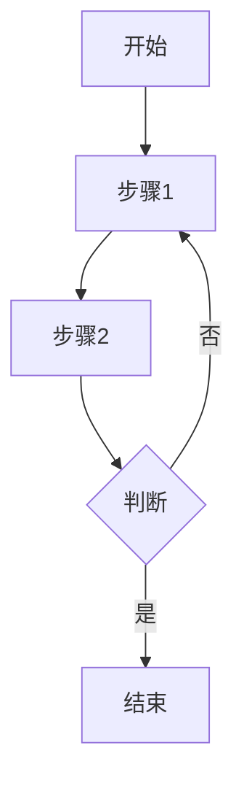
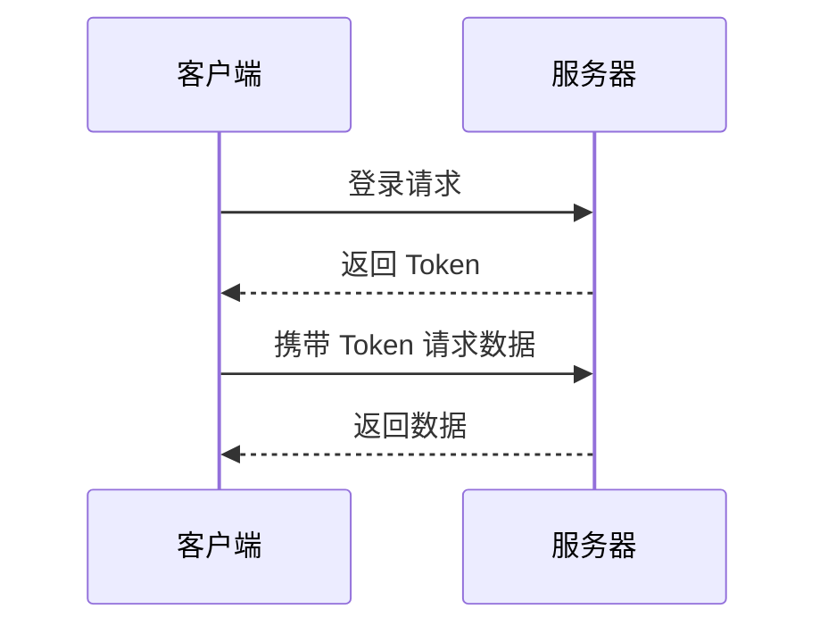

# Code Features

Enhanced code block features based on CodeHike.

## Basic Code Blocks

### With Filename

Add filename after language identifier:

````mdx
```javascript example.js
const sdk = new ZEGO();
sdk.init();
```
````

Or use `title` attribute (useful when filename contains spaces):

````mdx
```javascript title="example file.js"
const sdk = new ZEGO();
sdk.init();
```
````

## Line Highlighting (mark)

### Single Line Highlight

Add `!mark` at end of line:

````mdx
```javascript
function example() {
  const important = true; // !mark
  return important;
}
```
````

### Multi-line Highlight

Use `// !mark(start:end)` comment format:

````mdx
```javascript
function example() {
  // !mark(1:2)
  const a = 1;
  const b = 2;
  const c = 3;
}
```
````

### Regex Pattern Highlight

Highlight lines matching a pattern:

````mdx
```javascript
// !mark[/important/]
const important = "这是重要内容";
const normal = "普通内容";
```
````

### Colored Highlights

Add color after `!mark`:

````mdx
```javascript
const error = true; // !mark red
const warning = true; // !mark yellow
const success = true; // !mark green
```
````

## Code Focus (focus)

Focus on specific lines, dimming others:

````mdx
```javascript
function example() {
  const before = 0;
  const focused = 1; // !focus
  const after = 2;
}
```
````

### Multi-line Focus

````mdx
```javascript
// !focus(2:3)
const a = 1;
const b = 2;
const c = 3;
```
````

## CodeGroup

Group multiple code blocks with tabs:

````mdx
<CodeGroup>
```javascript main.js
console.log("JavaScript");
```

```python main.py
print("Python")
```

```java Main.java
System.out.println("Java");
```
</CodeGroup>
````

## Mermaid Diagrams

Use mermaid language for flowcharts and sequence diagrams.

### Flowchart Example

````mdx

````

### Sequence Diagram Example

````mdx

````

## When to Use Each

| Scenario | Feature |
|----------|---------|
| Single code sample | Basic code block with filename |
| Multi-language samples | `<CodeGroup>` |
| Highlight important lines | `!mark` |
| Focus on specific code | `!focus` |
| Flowcharts/diagrams | Mermaid |
| Sequence diagrams | Mermaid sequenceDiagram |
