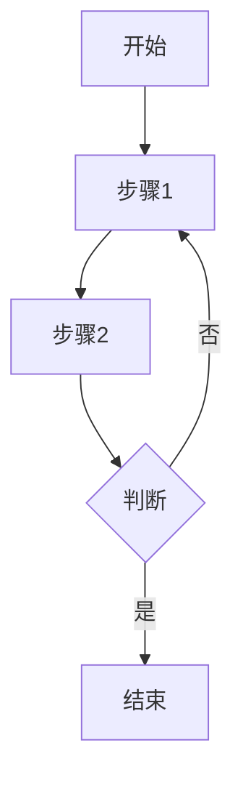
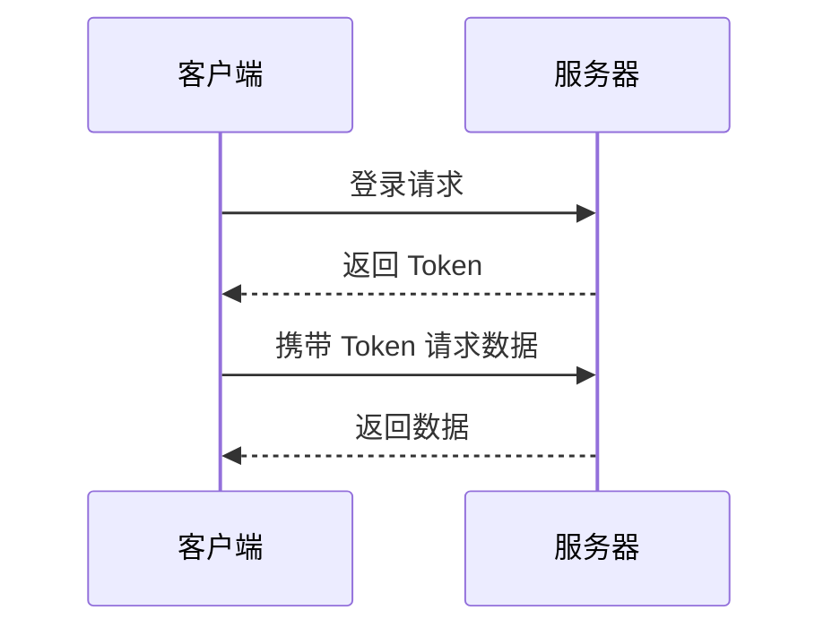

# MDX 组件使用说明书

本文档介绍 ZEGO 文档系统中可用的 MDX 组件及其使用方法。

---

## 本地资源上传

文档中的链接和图片，如果不是以 `http://` 或 `https://` 开头的外部链接，而是本地文件路径，可以通过 VSCode 插件的**上传按钮**将资源上传到 CDN。

支持上传的场景包括：
- Markdown 图片语法：``
- Markdown 链接语法：`[文字](/local/path/file.pdf)`
- HTML img 标签：``
- Frame 组件中的图片
- Video 组件中的视频
- Button/Card 等组件的 icon 属性
- 其他任意组件中引用的本地资源路径

---

## 链接语法

- 相对路径：`[文字](./path/to/file.mdx)`
- 绝对路径：`[文字](https://www.zego.im/some/slug)`
- 站内链接：`[文字](/some/slug)`
- 锚点：`[文字](#anchor)`
- 外部链接：`[文字](https://some-domain.com/some/slug)`

---

## 表格增强语法

VSCode 插件提供了表格增强功能，支持列宽控制、对齐方式和单元格合并。

### 列宽设置

在表头单元格后添加 `-宽度` 设置列宽：

```markdown
| 名称-30% | 描述-50% | 备注-20% |
|----------|----------|----------|
| 内容1    | 内容2    | 内容3    |
```

支持百分比和像素值：
- 百分比：`标题-30%`
- 像素值：`标题-120px`

### 对齐方式

在表头单元格后添加 `-l`、`-c`、`-r` 设置对齐：

```markdown
| 左对齐-l | 居中-c | 右对齐-r |
|----------|--------|----------|
| 左       | 中     | 右       |
```

- `-l`：左对齐（left）
- `-c`：居中（center）
- `-r`：右对齐（right）

### 组合使用

列宽和对齐可以组合使用：

```markdown
| 名称-30%-l | 数值-20%-r | 描述-50%-c |
|------------|------------|------------|
| 苹果       | 100        | 水果       |
```

### 单元格合并

在需要合并的单元格中使用合并标记：

| 标记 | 说明 |
|------|------|
| `!mu` 或 `!m` | 向上合并（与上方单元格合并） |
| `!md` | 向下合并（与下方单元格合并） |
| `!ml` | 向左合并（与左侧单元格合并） |
| `!mr` | 向右合并（与右侧单元格合并） |

**纵向合并示例（向上合并）：**

```markdown
| 类别   | 项目   | 说明   |
|--------|--------|--------|
| 水果   | 苹果   | 红色   |
| !mu    | 香蕉   | 黄色   |
| !mu    | 橙子   | 橙色   |
| 蔬菜   | 白菜   | 绿色   |
```

渲染效果："水果" 单元格会纵向跨越 3 行。

**横向合并示例（向左合并）：**

```markdown
| 姓名   | 联系方式       | !ml    |
|--------|----------------|--------|
| 张三   | 电话           | 邮箱   |
```

渲染效果："联系方式" 表头会横向跨越 2 列。

---

## Callout - 提示框

用于显示不同类型的提示信息。

**属性：**
| 属性 | 类型 | 必填 | 说明 |
|------|------|------|------|
| type | `"check" \| "tips" \| "note" \| "warning" \| "failure"` | 是 | 提示类型 |
| title | `string` | 否 | 标题 |

**示例（不推荐）：**
```mdx
<Callout type="note" title="注意">
  这是一条注意事项。
</Callout>

<Callout type="warning" title="警告">
  这是一条警告信息。
</Callout>

<Callout type="tips" title="提示">
  这是一条提示信息。
</Callout>
```

**快捷组件（推荐）：**
```mdx
<Note title="注意">这是一条注意事项</Note>
<Tip title="提示">这是一条提示信息</Tip>
<Warning title="警告">这是一条警告信息</Warning>
<Error title="错误">这是一条错误信息</Error>
```

---

## Tabs / Tab - 选项卡

用于将内容组织到多个标签页中。

**Tabs 属性：**
| 属性 | 类型 | 默认值 | 说明 |
|------|------|--------|------|
| titleSize | `"p" \| "h2" \| "h3" \| "h4" \| "h5"` | `"p"` | 标题级别，用于 TOC 导航 |

**Tab 属性：**
| 属性 | 类型 | 必填 | 说明 |
|------|------|------|------|
| title | `string` | 是 | 标签页标题 |
| titleSize | `"p" \| "h2" \| "h3" \| "h4" \| "h5"` | 否 | 覆盖父级标题级别 |

**示例：**
```mdx
<Tabs>
  <Tab title="iOS">
    iOS 平台的实现代码
  </Tab>
  <Tab title="Android">
    Android 平台的实现代码
  </Tab>
</Tabs>
```

---

## Steps / Step - 步骤

用于展示有序步骤流程。

**Steps 属性：**
| 属性 | 类型 | 默认值 | 说明 |
|------|------|--------|------|
| titleSize | `"p" \| "h2" \| "h3" \| "h4" \| "h5"` | `"p"` | 步骤标题级别 |

**Step 属性：**
| 属性 | 类型 | 说明 |
|------|------|------|
| title | `string` | 步骤标题 |
| icon | `string \| ReactNode` | 自定义图标（URL或组件） |
| stepNumber | `number` | 自定义步骤序号 |

**示例：**
```mdx
<Steps>
  <Step title="创建项目">
    使用 Xcode 创建一个新的 iOS 项目。
  </Step>
  <Step title="添加依赖">
    通过 CocoaPods 添加 ZEGO SDK。
  </Step>
  <Step title="初始化 SDK">
    在 AppDelegate 中初始化 SDK。
  </Step>
</Steps>
```

---

## Accordion - 折叠面板

用于可折叠展开的内容块。

**属性：**
| 属性 | 类型 | 默认值 | 说明 |
|------|------|--------|------|
| title | `string` | - | 折叠面板标题 |
| defaultOpen | `"true" \| "false"` | `"false"` | 是否默认展开 |

**示例：**
```mdx
<Accordion title="点击展开详情" defaultOpen="false">
  这里是折叠的详细内容。
</Accordion>
```

---

## Card / CardGroup - 卡片

用于展示卡片式内容布局。

**CardGroup 属性：**
| 属性 | 类型 | 默认值 | 说明 |
|------|------|--------|------|
| cols | `number` | `2` | 列数（1-5） |

**Card 属性：**
| 属性 | 类型 | 说明 |
|------|------|------|
| title | `string` | 卡片标题 |
| icon | `string \| ReactNode` | 图标 |
| href | `string` | 点击跳转链接 |
| target | `string` | 链接打开方式 |

**示例：**
```mdx
<CardGroup cols={3}>
  <Card title="快速开始" icon="/icons/start.svg" href="/quick-start">
    5 分钟快速接入 SDK
  </Card>
  <Card title="API 文档" icon="/icons/api.svg" href="/api-reference">
    查看完整 API 参考
  </Card>
  <Card title="示例代码" icon="/icons/code.svg" href="/samples">
    下载示例项目
  </Card>
</CardGroup>
```

---

## Button - 按钮

用于创建可点击的按钮或链接。

**属性：**
| 属性 | 类型 | 说明 |
|------|------|------|
| href | `string` | 跳转链接 |
| target | `"_self" \| "_blank"` | 链接打开方式 |
| primary-color | `string` | 主题色（见下方列表） |
| icon | `string \| ReactNode` | 按钮图标 |
| circular | `boolean` | 是否为圆形按钮 |
| tip | `string` | 悬浮提示文字 |

**主题色：** `DarkGray` `NavyBlue` `Orange` `Tangerine` `Red` `Magenta` `Purple` `LightBlue` `Turquoise` `Green` `Lime` `Gray` `White`

**示例：**
```mdx
<Button href="https://github.com/example" target="_blank" primary-color="NavyBlue">
  下载示例
</Button>
```

---

## Frame - 图片容器

用于包裹图片，提供标题和点击放大功能。

**属性：**
| 属性 | 类型 | 默认值 | 说明 |
|------|------|--------|------|
| width | `string` | `"auto"` | 宽度（像素或百分比） |
| height | `string` | `"auto"` | 高度（像素或百分比） |
| caption | `string` | - | 图片说明文字 |

**示例：**
```mdx
<Frame width="400" height="auto" caption="架构示意图">
  
</Frame>
```

---

## Video - 视频播放器

支持 YouTube、Vimeo、Loom 及本地视频。

**属性：**
| 属性 | 类型 | 默认值 | 说明 |
|------|------|--------|------|
| src | `string` | - | 视频 URL（必填） |
| width | `string` | `"100%"` | 宽度 |
| height | `string` | `"auto"` | 高度 |

**示例：**
```mdx
<!-- YouTube 视频（自动转换为 embed 链接） -->
<Video src="https://www.youtube.com/watch?v=xxxxx" />

<!-- Vimeo 视频 -->
<Video src="https://vimeo.com/123456789" />

<!-- 本地视频 -->
<Video src="/videos/demo.mp4" width="640" height="360" />
```

注意，当视频文件大于5MB时，考虑压缩视频，参考以下命令：
```bash
ffmpeg -i input.mp4 -c:v libx264 -crf 28 -preset slow -c:a copy -vf "scale=trunc(iw/2)*2:trunc(ih/2)*2" output.mp4
```

---

## QRCode - 二维码

动态生成二维码图片。

**属性：**
| 属性 | 类型 | 默认值 | 说明 |
|------|------|--------|------|
| content | `string` | - | 二维码内容（必填） |
| size | `number` | `200` | 尺寸（像素） |
| errorCorrectionLevel | `"L" \| "M" \| "Q" \| "H"` | `"M"` | 容错级别 |
| title | `string` | - | 二维码标题 |
| showTitle | `boolean` | `false` | 是否显示标题 |

**示例：**
```mdx
<QRCode content="https://www.zego.im" size={150} showTitle={true} title="扫码访问官网" />
```

---


## 代码块增强功能

基于 CodeHike 的代码高亮，支持以下特性：

### 基本用法

带文件名的代码块：
````mdx
```javascript example.js
const sdk = new ZEGO();
sdk.init();
```
````

或使用 title 属性（title存在空格时，需要使用 title 属性）：
````mdx
```javascript title="example.js"
const sdk = new ZEGO();
sdk.init();
```
````

### 行高亮 (mark)

**单行高亮** - 在行末添加 `!mark`：
````mdx
```javascript
function example() {
  const important = true; // !mark
  return important;
}
```
````

**多行高亮** - 使用 `// !mark(start:end)` 注释：
````mdx
```javascript
function example() {
  // !mark(1:2)
  const a = 1;
  const b = 2;
  const c = 3;
}
```
````

**正则匹配高亮** - 高亮匹配的文本：
````mdx
```javascript
// !mark[/important/]
const important = "这是重要内容";
const normal = "普通内容";
```
````

**带颜色高亮：**
````mdx
```javascript
const error = true; // !mark red
const warning = true; // !mark yellow
const success = true; // !mark green
```
````

### 代码聚焦 (focus)

聚焦指定行，其他行变暗：
````mdx
```javascript
function example() {
  const before = 0;
  const focused = 1; // !focus
  const after = 2;
}
```
````

**多行聚焦：**
````mdx
```javascript
// !focus(2:3)
const a = 1;
const b = 2;
const c = 3;
```
````

---

## ParamField - API 参数文档

用于展示 API 参数、方法、属性的详细说明。

**属性：**
| 属性 | 类型 | 说明 |
|------|------|------|
| name | `string` | 参数/方法名称（必填） |
| prototype | `string` | 函数原型签名（必填） |
| desc | `string` | 简短描述 |
| prefixes | `string[]` | 前缀标签（如 static, async） |
| suffixes | `string[]` | 后缀标签（如 deprecated） |
| anchor_suffix | `string` | 锚点后缀（用于区分同名方法） |
| parent_file | `string` | 所属文件路径 |
| parent_name | `string` | 父类/接口名称 |
| parent_type | `"class" \| "interface" \| "protocol" \| "enum"` | 父类型 |
| titleSize | `1 \| 2 \| 3 \| 4 \| 5 \| 6` | 标题级别（默认 4） |

**示例：**
```mdx
<ParamField
  name="createEngine"
  prototype="static createEngine(appID: number, server: string): ZegoExpressEngine"
  desc="创建 ZegoExpressEngine 实例"
  prefixes={["static"]}
  parent_name="ZegoExpressEngine"
  parent_type="class"
>
  详细说明和参数表格...
  可以是本文档中任何有效的 MD 语法及 MDX 组件语法。
</ParamField>
```

### 锚点生成逻辑

ParamField 组件会根据参数自动生成多个锚点，方便从不同方式链接到该 API 项。

**参数与锚点的关系**：

| 参数 | 作用 | 锚点示例 |
|------|------|---------|
| `name` | 基础锚点名称 | `name="createEngine"` → `#createengine` |
| `anchor_suffix` | 区分同名方法（方法重载） | `name="init" anchor_suffix="-v2"` → `#init-v2` |
| `parent_name` + `parent_type` | 生成带父类上下文的锚点 | `name="init" parent_name="ZegoEngine" parent_type="class"` → `#init-zegoengine` 和 `#init-zegoengine-class` |

**特殊规则**：

1. **锚点转换**：所有锚点都会转为小写，移除特殊字符，空格转连字符
   - `Quick Start` → `#quick-start`
   - `createEngine` → `#createengine`

2. **OC 冒号方法名**：会额外生成首段锚点
   - `name="createEngineWithProfile:eventHandler:"`
   - 生成主锚点：`#createenginewithprofileeventhandler`
   - 额外生成：`#createenginewithprofile`（首段）

3. **父类上下文**：当设置 `parent_name` 和 `parent_type` 时，会生成 3 个锚点
   - 主锚点：`#methodname`
   - 带父类：`#methodname-classname`
   - 带类型：`#methodname-classname-class`

**使用场景**：

```mdx
<!-- 基础用法 -->
<ParamField name="createEngine" prototype="..." />
<!-- 生成锚点：#createengine -->

<!-- 区分同名方法 -->
<ParamField name="init" anchor_suffix="-v2" prototype="..." />
<!-- 生成锚点：#init-v2 -->

<!-- 带父类上下文（推荐用于类方法） -->
<ParamField
  name="startPreview"
  parent_name="ZegoExpressEngine"
  parent_type="class"
  prototype="..."
/>
<!-- 生成锚点：#startpreview、#startpreview-zegoexpressengine、#startpreview-zegoexpressengine-class -->
```

---

## CodeGroup - 代码组

将多个代码块聚合在一起，可切换显示。

**示例：**
```mdx
<CodeGroup>
```javascript main.js
console.log("JavaScript");
```

```python main.py
print("Python")
```

```java Main.java
System.out.println("Java");
```
</CodeGroup>
```

---

## Mermaid - 流程图

在代码块中使用 mermaid 语言绘制流程图。

**示例：**
````mdx

````

**时序图示例：**
````mdx

````

---

## 条件渲染

根据使用时传递的条件显示或隐藏内容，经常用于多平台文档复用。条件可以是平台、版本、语言任意值，由使用方在把本mdx文件当一个React组件使用时，传递给组件的props。

以下我们以平台（platform）为例：
### 当前平台条件

显示当前平台的内容：
这里undefined是因为自己不会再被自己引用一次所以无法再传递 platform 的值，那么 platform 当然就是 undefined。

```mdx
:::if{props.platform=undefined}
这段内容仅在当前平台显示。
:::
```

### 指定平台条件

显示指定平台的内容：

```mdx
:::if{props.platform="iOS"}
这段内容仅在 iOS 平台显示。
:::

:::if{props.platform="Android"}
这段内容仅在 Android 平台显示。
:::
```

**平台值是随意设置的，只要 import 使用的时候也填写相同值即可：**

### 多条件组合
可以用两个或者多个“或”条件组合，用竖线（|）分隔。不支持“与”条件组合。
```mdx
:::if{props.platform="undefined|iOS|Android|Web"}
本文件、iOS 和 Android 和 Web 专属内容
:::
```


