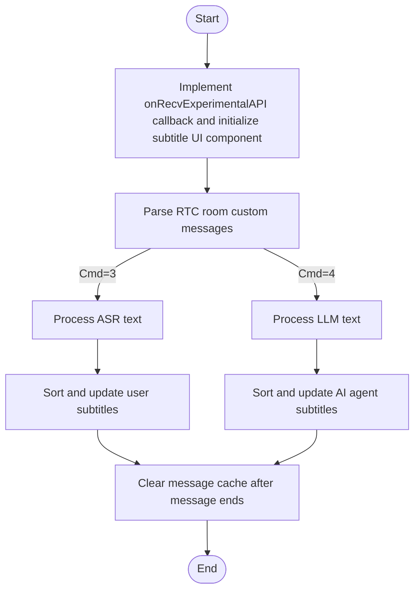

# Display Subtitles

---

This article introduces how to display subtitles during a voice call between a user and an AI agent. As follows:

- User's speech: Stream the user's spoken content as it is being recognized by ASR in real time.
- AI agent's speech: Stream the AI agent's output content as it is being generated by LLM in real time.

<Frame width="auto" height="512" >
  
</Frame>

## Prerequisites

You should have already integrated the ZEGO Express SDK and the ZEGOCLOUD AI Agent, and implemented a basic voice-call feature following the [Quick Start](./../quick-start.mdx) doc.

## Quick Implementation

During voice conversations between users and AI agents, the ZEGOCLOUD AI Agent server sends ASR recognition text and LLM response text via custom messages in the RTC room to the client. By listening for these custom messages, the client can parse the status events and render the UI.

The processing flowchart for RTC room custom messages is as follows:


### Listening to Custom Room Messages

:::if{props.platform=undefined}
By listening to the `onRecvExperimentalAPI` callback, the client can obtain custom room messages with `method` as `liveroom.room.on_recive_room_channel_message`. Below is an example of the listener callback code:

```java {2,4,15}
// WARNING!!!: The data received through custom room messages may be out of order, and sorting needs to be performed based on the SeqId field.
ZegoExpressEngine.getEngine().setEventHandler(new IZegoEventHandler() {
    @Override
    public void onRecvExperimentalAPI(String content) {
        super.onRecvExperimentalAPI(content);
        try {
            // Step 1: Parse the content into a JSONObject
            JSONObject json = new JSONObject(content);

            // Step 2: Check the value of the method field
            if (json.has("method") && json.getString("method")
                .equals("liveroom.room.on_recive_room_channel_message")) {
                // Step 3: Get and parse params
                JSONObject paramsObject = json.getJSONObject("params");
                String msgContent = paramsObject.getString("msg_content");

                // JSON string example: "{\"Timestamp\":1745224717,\"SeqId\":1467995418,\"Round\":2132219714,\"Cmd\":3,\"Data\":{\"MessageId\":\"2135894567\",\"Text\":\"你\",\"EndFlag\":false}}"
                // Parse the JSON string into an AudioChatMessage object
                AudioChatMessage chatMessage = gson.fromJson(msgContent, AudioChatMessage.class);
                if (chatMessage.cmd == 3) {
                    updateASRChatMessage(chatMessage);
                } else if (chatMessage.cmd == 4) {
                    addOrUpdateLLMChatMessage(chatMessage);
                }
            }
        } catch (JSONException e) {
            e.printStackTrace();
        }
    }
});

/**
 * Voice chat UI, structure of chat messages within the room sent by the backend server
 */
public static class AudioChatMessage {
    @SerializedName("Timestamp")
    public long timestamp;
    @SerializedName("SeqId")
    public int seqId;
    @SerializedName("Round")
    public int round;
    @SerializedName("Cmd")
    public int cmd;
    @SerializedName("Data")
    public Data data;
    public static class Data {
        @SerializedName("SpeakStatus")
        public int speakStatus;
        @SerializedName("Text")
        public String text;
        @SerializedName("MessageId")
        public String messageId;
        @SerializedName("EndFlag")
        public boolean endFlag;
    }
}
```
:::
:::if{props.platform="iOS"}
By implementing the `ZegoEventHandler` protocol and listening to the `onRecvExperimentalAPI` callback, the client can obtain room custom messages with `method` as `liveroom.room.on_recive_room_channel_message`. Below is an example of the callback listener code:

<CodeGroup>
```objectivec YourService.h/m
// Implement ZegoEventHandler protocol
@interface YourService () <ZegoEventHandler>
@property (nonatomic, strong) YourViewController *youViewController;
@end

@implementation YourService

// Handle messages received from express onRecvExperimentalAPI
- (void)onRecvExperimentalAPI:(NSString *)content {
    // Forward to view for message content parsing
    [self.youViewController handleExpressExperimentalAPIContent:content];
}

@end // YourService implementation
```

```objectivec YourViewController.h/m
// Implement ZegoEventHandler protocol in the header file
@interface YourViewController ()

@end

@implementation YourViewController

// WARNING!!!: The data received through custom room messages may be out of order, and sorting needs to be performed based on the SeqId field.
// Parse custom signaling messages
- (void)handleExpressExperimentalAPIContent:(NSString *)content {
    // Parse JSON content
    NSError *error;
    NSData *jsonData = [content dataUsingEncoding:NSUTF8StringEncoding];
    NSDictionary *contentDict = [NSJSONSerialization JSONObjectWithData:jsonData
                                                        options:NSJSONReadingMutableContainers
                                                          error:&error];
    if (error || !contentDict) {
        NSLog(@"JSON parsing failed: %@", error);
        return;
    }
    // Check if it's a room message
    NSString *method = contentDict[@"method"];
    if (![method isEqualToString:@"liveroom.room.on_recive_room_channel_message"]) {
        return;
    }
    // Get message parameters
    NSDictionary *params = contentDict[@"params"];
    if (!params) {
        return;
    }
    NSString *msgContent = params[@"msg_content"];
    NSString *sendIdName = params[@"send_idname"];
    NSString *sendNickname = params[@"send_nickname"];
    NSString *roomId = params[@"roomid"];
    if (!msgContent || !sendIdName || !roomId) {
         NSLog(@"parseExperimentalAPIContent Parameters incomplete: msgContent=%@, sendIdName=%@, roomId=%@",
                msgContent, sendIdName, roomId);
        return;
    }

    // JSON string example: "{\"Timestamp\":1745224717,\"SeqId\":1467995418,\"Round\":2132219714,\"Cmd\":3,\"Data\":{\"MessageId\":\"2135894567\",\"Text\":\"你\",\"EndFlag\":false}}"
    // Parse message content
    [self handleMessageContent:msgContent userID:sendIdName userName:sendNickname ?: @""];
}

// Handle message content
- (void)handleMessageContent:(NSString *)command userID:(NSString *)userID userName:(NSString *)userName{
    NSDictionary* msgDict = [self dictFromJson:command];
    if (!msgDict) {
        return;
    }

    // Parse basic information
    int cmd = [msgDict[@"Cmd"] intValue];
    int64_t seqId = [msgDict[@"SeqId"] longLongValue];
    int64_t round = [msgDict[@"Round"] longLongValue];
    int64_t timestamp = [msgDict[@"Timestamp"] longLongValue];
    NSDictionary *data = msgDict[@"Data"];

    // Handle messages based on command type
    switch (cmd) {
        case 3: // ASR text
            [self handleAsrText:data seqId:seqId round:round timestamp:timestamp];
            break;
        case 4: // LLM text
            [self handleLlmText:data seqId:seqId round:round timestamp:timestamp];
            break;
    }
}

@end // YourViewController implementation
```
</CodeGroup>
:::
:::if{props.platform="flutter"}
```dart
import 'dart:convert';

import 'package:flutter/cupertino.dart';
import 'package:zego_express_engine/zego_express_engine.dart';

class YourPage extends StatefulWidget {
  const YourPage({super.key});

  @override
  State<YourPage> createState() => _YourPageState();
}

class _YourPageState extends State<YourPage> {
  @override
  void initState() {
    super.initState();

    ZegoExpressEngine.onRecvExperimentalAPI = onRecvExperimentalAPI;
  }

  @override
  void dispose() {
    super.dispose();

    ZegoExpressEngine.onRecvExperimentalAPI = null;
  }

  @override
  Widget build(BuildContext context) {
    return YourMessageView();
  }

  /// WARNING!!!: The data received through custom room messages may be out of order, and sorting needs to be performed based on the SeqId field.
  void onRecvExperimentalAPI(String content) {
    try {
      /// Check if it is a room message
      final contentMap = jsonDecode(content);
      if (contentMap['method'] !=
          'liveroom.room.on_recive_room_channel_message') {
        return;
      }

      final params = contentMap['params'];
      if (params == null) {
        return;
      }

      final msgContent = params['msg_content'];
      if (msgContent == null) {
        return;
      }

      handleMessageContent(msgContent);
    } catch (e) {}
  }

  /// Handle message content
  void handleMessageContent(String msgContent) {
    final Map<String, dynamic> json = jsonDecode(msgContent);

    /// 解析基本信息
    final int timestamp = json['Timestamp'] ?? 0;
    final int seqId = json['SeqId'] ?? 0;
    final int round = json['Round'] ?? 0;
    final int cmdType = json['Cmd'] ?? 0;
    final Map<String, dynamic> data =
        json['Data'] != null ? Map<String, dynamic>.from(json['Data']) : {};

    // Handle messages based on command type
    switch (cmdType) {
      case 3:

        /// ASR text
        handleRecvAsrMessage(data, seqId, round, timestamp);
        break;
      case 4:

        /// LLM text
        handleRecvLLMMessage(data, seqId, round, timestamp);
        break;
    }
  }
}
```
:::
:::if{props.platform="Web"}
By listening to the `recvExperimentalAPI` callback, the client can obtain room custom messages with `method` as `onRecvRoomChannelMessage`. Below is an example of the callback listener code:
```javascript {2,4,15}
// WARNING!!!: The data received through custom room messages may be out of order, and sorting needs to be performed based on the SeqId field.
zg.on("recvExperimentalAPI", (result) => {
  const { method, content } = result;
  if (method === "onRecvRoomChannelMessage") {
    try {
      // Parse the message
      const recvMsg = JSON.parse(content.msgContent);
      const { Cmd, SeqId, Data, Round } = recvMsg;
    } catch (error) {
      console.error("Failed to parse the message:", error);
    }
  }
});
// Enable the experimental API for onRecvRoomChannelMessage
zg.callExperimentalAPI({ method: "onRecvRoomChannelMessage", params: {} });
```
:::
### Room Custom Message Protocol

The fields of the room custom message are described as follows:

| Field | Type | Description |
| --- | --- | --- |
| Timestamp | Number | Timestamp, at the second level |
| SeqId | Number | Packet sequence number, may be out of order. Please sort the messages according to the sequence number. In extreme cases, the Id may not be continuous. |
| Round | Number | Dialogue round, increases each time the user starts speaking |
| Cmd | Number | <ul><li>3: ASR text.</li><li>4: LLM text.</li></ul> |
| Data | Object | Specific content, different Cmds correspond to different Data |

Data varies depending on the Cmd as follows:

<Tabs>
<Tab title="Cmd is 3">

| Field | Type | Description |
| --- | --- | --- |
| Text | String |  ASR text of user speech.<br />Each issuance is the full text, supporting text correction. |
| MessageId | String | Message ID. It is unique for each round of ASR text message. |
| EndFlag | Bool | End flag, true indicates that the ASR text of this round has been processed. |

</Tab>
<Tab title="Cmd is 4">

| Field | Type | Description |
| --- | --- | --- |
| Text | String | LLM text.<br/>Each issuance is incremental text. |
| MessageId | String | Message ID. It is unique for each round of LLM text message. |
| EndFlag | Bool | End flag, true indicates that the LLM text of this round has been processed. |

</Tab>
</Tabs>
### Processing Logic

Determine the message type based on the Cmd field, and obtain the message content from the Data field.
<Tabs>
<Tab title="Cmd is 3, ASR Text">

:::if{props.platform="Web"}
```javascript
 // Handle user message
 function handleUserMessage(data, seqId, round) {
    if (data.EndFlag) {
      // User has finished speaking
    }
    const content = data.Text;
    if (content) {
      // Use the ASR text corresponding to the latest seqId as the latest speech recognition result and update the UI
    }
 }
```
:::
:::if{props.platform="iOS"}
```objectivec
- (void)handleAsrText:(NSDictionary *)data seqId:(int64_t)seqId round:(int64_t)round timestamp:(int64_t)timestamp {
    NSString *content = data[@"Text"];
    NSString *messageId = data[@"MessageId"];
    BOOL endFlag = [data[@"EndFlag"] boolValue];

    if (content && content.length > 0) {
        // Process ASR message and update UI
    }
}
```
:::
:::if{props.platform="flutter"}
```dart
  void handleRecvAsrMessage(
    Map<String, dynamic> data,
    int seqId,
    int round,
    int timestamp,
  ) {
    String text = '';
    String messageId = '';
    bool endFlag = false;
    if (data.containsKey('Text')) {
      text = data['Text'] ?? '';
    }
    if (data.containsKey('MessageId')) {
      messageId = data['MessageId'] ?? '';
    }
    if (data.containsKey('EndFlag')) {
      var val = data['EndFlag'];
      if (val is bool) {
        endFlag = val;
      } else if (val is int) {
        endFlag = val != 0;
      } else if (val is String) {
        endFlag = val == 'true' || val == '1';
      }
    }

    /// Process ASR message and update UI
  }
```
:::

The corresponding message processing flow is shown in the figure below:

<Frame width="auto" height="auto" >
  
</Frame>

</Tab>
<Tab title="Cmd is 4, LLM Text">
:::if{props.platform="Web"}
```javascript
// Handle agent message
function handleAgentMessage(data, seqId, round) {
  const llmEndFlag = data.EndFlag;
  if (llmEndFlag) {
    // Agent has finished responding
  }
  const llmText = data.Text;
  if (llmText) {
      // Process agent message
  }
}
```
:::
:::if{props.platform="iOS"}
```objectivec
- (void)handleLlmText:(NSDictionary *)data seqId:(int64_t)seqId round:(int64_t)round timestamp:(int64_t)timestamp {
    NSString *content = data[@"Text"];
    NSString *messageId = data[@"MessageId"];
    BOOL endFlag = [data[@"EndFlag"] boolValue];

    if (content && content.length > 0) {
        // Process LLM message and update UI
    }
}
```
:::
:::if{props.platform="flutter"}
```dart
  void handleRecvLLMMessage(
    Map<String, dynamic> data,
    int seqId,
    int round,
    int timestamp,
  ) {
    String text = '';
    String messageId = '';
    bool endFlag = false;
    if (data.containsKey('Text')) {
      text = data['Text'] ?? '';
    }
    if (data.containsKey('MessageId')) {
      messageId = data['MessageId'] ?? '';
    }
    if (data.containsKey('EndFlag')) {
      var val = data['EndFlag'];
      if (val is bool) {
        endFlag = val;
      } else if (val is int) {
        endFlag = val != 0;
      } else if (val is String) {
        endFlag = val == 'true' || val == '1';
      }
    }

    /// 处理LLM消息并更新UI
  }
```
:::


The corresponding message processing flow is shown in the figure below. Among them:
- AI message cache: A HashMap, with key as MessageId and value as the new message.
- UI message list: An array containing user messages and AI messages, storing all messages displayed on the UI.

<Frame width="auto" height="auto" >
  
</Frame>

</Tab>
</Tabs>


### Use the subtitle component

:::if{props.platform=undefined}
You can also download the [subtitle component source code](https://github.com/ZEGOCLOUD/ai_agent_quick_start/blob/master/android/QuickStart/app/src/main/java/im/zego/aiagent/express/quickstart/voice/AudioChatMessageParser.java) to your project for use.
<Accordion title="Subtitle Component Usage Example" defaultOpen="false">
```java
private AudioChatMessageParser audioChatMessageParser = new AudioChatMessageParser();

ZegoExpressEngine.getEngine().setEventHandler(new IZegoEventHandler() {
    @Override
    public void onRecvExperimentalAPI(String content) {
        super.onRecvExperimentalAPI(content);
        try {
            // Step 1: Parse content into a JSONObject
            JSONObject json = new JSONObject(content);

            // Step 2: Check the value of the method field
            if (json.has("method") && json.getString("method")
                .equals("liveroom.room.on_recive_room_channel_message")) {
                // Step 3: Get params and parse them
                JSONObject paramsObject = json.getJSONObject("params");
                String msgContent = paramsObject.getString("msg_content");

                // AudioChatTextMessage will parse the JSON string
                audioChatMessageParser.parseAudioChatMessage(msgContent);
            }
        } catch (JSONException e) {
            e.printStackTrace();
        }
    }
});

audioChatMessageParser.setAudioChatMessageListListener(new AudioChatMessageListListener() {
    @Override
    public void onMessageListUpdated(List<AudioChatMessage> messagesList) {
        // Update the UI list
        binding.messageList.onMessageListUpdated(messagesList);
    }
});

```
</Accordion>
:::
:::if{props.platform="iOS"}
You can also download the [subtitle component source code](https://github.com/ZEGOCLOUD/ai_agent_quick_start/tree/master/ios/ai_agent_quickstart/aiagent/audio/subtitles) to your project for use.
<Accordion title="Subtitle Component Usage Example" defaultOpen="false">
<CodeGroup>
```objectivec YourView.h
#import <UIKit/UIKit.h>
#import "ZegoAIAgentSubtitlesEventHandler.h"

NS_ASSUME_NONNULL_BEGIN

@interface YourView : UIView <ZegoAIAgentSubtitlesEventHandler>

@end
```

```objectivec YourView.m
#import "YourView.h"

#import <Masonry/Masonry.h>

#import "ZegoAIAgentSubtitlesTableView.h"
#import "ZegoAIAgentSubtitlesMessageDispatcher.h"

@interface YourView()<ZegoEventHandler, ZegoAIAgentSubtitlesEventHandler>
// AI Agent Subtitles
@property (nonatomic, strong, readwrite) ZegoAIAgentSubtitlesTableView *subtitlesTableView;

@end

@implementation YourView

- (instancetype)initWithFrame:(CGRect)frame {
    self = [super initWithFrame:frame];
    if (self) {
        // Register events
        [self registerEventHandler];

        [self setupSubtitles];
    }
    return self;
}

- (void)dealloc {
    // Unregister events
    [self unregisterEventHandler];
}

- (void)setupSubtitles {
    // Add chat view - occupies the lower half of the screen
    CGRect chatFrame = CGRectMake(0,
                                 self.bounds.size.height / 2,
                                 self.bounds.size.width,
                                 self.bounds.size.height / 2);
    self.subtitlesTableView = [[ZegoAIAgentSubtitlesTableView alloc] initWithFrame:chatFrame style:UITableViewStylePlain];

    [self addSubview:self.subtitlesTableView];

    // Use Masonry to add constraints
}
    [self.subtitlesTableView mas_makeConstraints:^(MASConstraintMaker *make) {
        make.left.right.bottom.equalTo(self);
        make.height.equalTo(self.mas_height).multipliedBy(0.5);
    }];
}
#pragma mark - ZegoEventHandler
- (void)onRecvExperimentalAPI:(NSString *)content{
    [[ZegoAIAgentSubtitlesMessageDispatcher sharedInstance] handleExpressExperimentalAPIContent:content];
}

#pragma mark - ZegoAIAgentSubtitlesEventHandler

- (void)registerEventHandler {
    [[ZegoAIAgentSubtitlesMessageDispatcher sharedInstance] registerEventHandler:self];
}

- (void)unregisterEventHandler {
    [[ZegoAIAgentSubtitlesMessageDispatcher sharedInstance] unregisterEventHandler:self];
}

- (void)onRecvAsrChatMsg:(ZegoAIAgentAudioSubtitlesMessage *)message {
    [self.subtitlesTableView handleRecvAsrMessage:message];
}

- (void)onRecvLLMChatMsg:(ZegoAIAgentAudioSubtitlesMessage *)message {
    [self.subtitlesTableView handleRecvLLMMessage:message];
}

@end
```
</CodeGroup>
</Accordion>
:::
:::if{props.platform="flutter"}
You can also download the [subtitle component source code](https://github.com/ZEGOCLOUD/ai_agent_quick_start/tree/master/flutter/lib/audio/subtitles) to your project for use directly.
<Accordion title="Subtitle Component Usage Example" defaultOpen="false">
<CodeGroup>
```dart
import 'package:flutter/material.dart';

import 'subtitles/view/view.dart';
import 'subtitles/view/model.dart';
import 'subtitles/protocol/message_protocol.dart';
import 'subtitles/protocol/message_dispatcher.dart';
import 'package:zego_express_engine/zego_express_engine.dart';

class ZegoAudioPage extends StatefulWidget {
  const ZegoAudioPage({super.key});

  @override
  State<ZegoAudioPage> createState() => _ZegoAudioPageState();
}

class _ZegoAudioPageState extends State<ZegoAudioPage>
    implements ZegoSubtitlesEventHandler {
  late ZegoSubtitlesViewModel subtitlesModel;

  @override
  void initState() {
    super.initState();

    subtitlesModel = ZegoSubtitlesViewModel();

    ZegoExpressEngine.onRecvExperimentalAPI = _onRecvExperimentalAPI;
    ZegoSubtitlesMessageDispatcher().registerEventHandler(this);
  }

  @override
  void dispose() {
    ZegoExpressEngine.onRecvExperimentalAPI = null;
    ZegoSubtitlesMessageDispatcher().unregisterEventHandler(this);

    super.dispose();
  }

  @override
  Widget build(BuildContext context) {
    return SafeArea(
      child: ZegoSubtitlesView(model: subtitlesModel),
    );
  }

  @override
  void onRecvAsrChatMsg(ZegoSubtitlesMessageProtocol message) {
    subtitlesModel.handleRecvAsrMessage(message);
  }

  @override
  void onRecvLLMChatMsg(ZegoSubtitlesMessageProtocol message) {
    subtitlesModel.handleRecvLLMMessage(message);
  }

  void _onRecvExperimentalAPI(String content) {
    ZegoSubtitlesMessageDispatcher.handleExpressExperimentalAPIContent(content);
  }
}

```
</CodeGroup>
</Accordion>
:::
:::if{props.platform="Web"}
If you are working on a Vue project, you can download the [subtitle component](https://github.com/ZEGOCLOUD/ai_agent_quick_start/blob/master/web/src/hooks/useChat.ts) to your project and use it directly.
<Accordion title="Vue Project Subtitle Component Usage Example" defaultOpen="false">
```javascript
// Example code for using the subtitle component
// Import the chatHook in your page
import { useChat } from "useChat";
import { onMounted, onBeforeUnmount } from 'vue';

// Call the useChat method, pass in the Express SDK instance. The messages will be rendered in your subtitle component.
const { messages, setupEventListeners, clearMessages } = useChat(zg);

onMounted(() => {
  // Register event listeners when the page loads
  setupEventListeners()
})

onBeforeUnmount(() => {
  // Clear messages when the page is destroyed
  clearMessages()
})```

```
</Accordion>
:::

## Precautions

- Message Sorting Processing: The data received through custom room messages may be out of order, and sorting needs to be performed based on the SeqId field.
- Streaming Text Processing:
> - Each ASR text sent is the full text. Messages with the same MessageId should completely replace the previous content.
> - Each LLM text sent is incremental. Messages with the same MessageId need to be cumulatively displayed after sorting.
- Memory Management: Please clear the cache of completed messages in time, especially when users engage in long conversations.