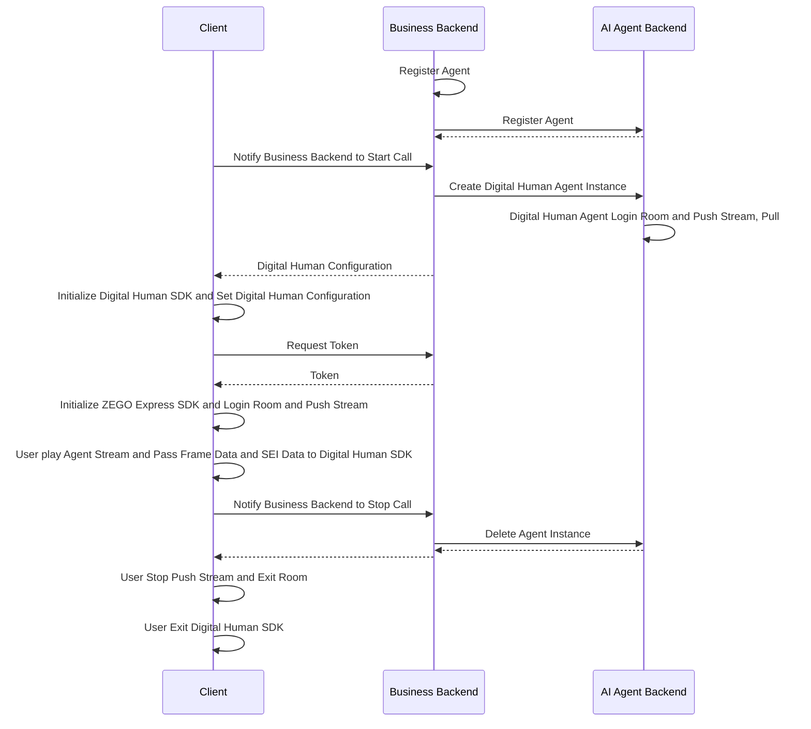

import {getPlatformData} from "/snippets/utils-content-parser.js"


export const expressSDKMap = {
  'Android': <a href='https://www.zegocloud.com/docs/voice-call/quick-start?platform=android&language=java#3' target='_blank'>ZEGO Express SDK</a>,
  'iOS': <a href='https://www.zegocloud.com/article/4121' target='_blank'>ZEGO Express SDK</a>,
  'Web': <a href='https://www.zegocloud.com/article/14138' target='_blank'>ZEGO Express SDK</a>,
}

# Quick Start Digital Human Video Call

This document explains how to quickly integrate the client SDK (ZEGO Express SDK and Digital Human SDK) and achieve video interaction with an AI Agent.

## Digital Human Introduction

With just a photo or image of a real person or anime character from the waist up, you can obtain a 1080P digital human with accurate lip-sync and realistic appearance. When used with the AI Agent product, you can quickly achieve video interaction chat with AI digital humans within 2 seconds overall, suitable for various scenarios such as digital human 1V1 interactive video, digital human customer service, and digital human live streaming.

- More natural driving effects: Supports subtle body movements, natural facial expressions without distortion, providing more realistic and immersive interaction compared to voice calls;
- Multi-language accurate lip-sync: Natural and accurate lip movements, especially optimized for Chinese and English;
- Ultra-low interaction latency: Digital human driving latency < 500ms, combined with AI Agent interaction latency < 2s;
- Higher clarity: True 1080P effect, 20%+ improvement in clarity compared to traditional image-based digital humans


<Video src="https://media-resource.spreading.io/docuo/workspace564/27e54a759d23575969552654cb45bf89/9f0143abe9.mp4" />


## Prerequisites

- Create a project in the [ZEGOCLOUD Console](https://console.zegocloud.com/), and get its valid AppID and AppSign. For more details, please refer to Admin Console doc [How to view project info](https://www.zegocloud.com/docs/admin-console/view-project-information?platform=all&language=all).
- You have contacted ZEGOCLOUD Technical Support to enable Digital Human PaaS service and related interface permissions.
- You have contacted ZEGOCLOUD Technical Support to create a digital human.
:::if{props.platform="undefined|iOS"}
- You have contacted ZEGOCLOUD Technical Support to obtain the {getPlatformData(props,expressSDKMap)} that supports AI echo cancellation and integrated it into your project.
:::
:::if{props.platform="Web"}
- You have contacted ZEGOCLOUD Technical Support to obtain the {getPlatformData(props,expressSDKMap)} that supports AI noise reduction and integrated it into your project.
:::
- You have integrated AI Agent related server APIs according to the [Business Backend Quick Start Guide](/aiagent-server/quick-start-with-digital-human).

## Sample Code
Below are client sample codes. You can refer to the sample code to implement your own business logic.

<CardGroup cols={2}>
:::if{props.platform=undefined}
<Card title="Android Client Sample Code" href="https://github.com/ZEGOCLOUD/ai_agent_quick_start/tree/master/android" target="_blank">
Includes basic capabilities such as login, publishing, subscribing, displaying digital human, and exiting room.
</Card>
:::
:::if{props.platform="iOS"}
<Card title="iOS Client Sample Code" href="https://github.com/ZEGOCLOUD/ai_agent_quick_start/tree/master/ios" target="_blank">
Includes basic capabilities such as login, publishing, subscribing, displaying digital human, and exiting room.
</Card>
:::
:::if{props.platform="flutter"}
<Card title="Flutter Client Sample Code" href="https://github.com/ZEGOCLOUD/ai_agent_quick_start/tree/master/flutter" target="_blank">
Includes basic capabilities such as login, publishing, subscribing, displaying digital human, and exiting room.
</Card>
:::
:::if{props.platform="Web"}
<Card title="Web Client Sample Code" href="https://github.com/ZEGOCLOUD/ai_agent_quick_start/tree/master/web" target="_blank">
Includes basic capabilities such as login, publishing, subscribing, and exiting room.
</Card>
:::
</CardGroup>

The following video demonstrates how to run the server and client (Web) sample code and interact with the digital human agent via video.
<Video src="https://media-resource.spreading.io/docuo/workspace564/27e54a759d23575969552654cb45bf89/4b68fbedda.mp4" />

## Overall Business Process

1. Server, deploy the business backend sample code according to the [Business Backend Quick Start Guide](/aiagent-server/quick-start).
    - Integrate the AI Agent API management of the AI Agent.
:::if{props.platform="Web"}
2. Client, run the sample code.
    - Create and manage agents through the business backend.
    - Integrate ZEGO Express SDK to complete real-time communication.
:::
:::if{props.platform="undefined|iOS"}
2. Client, run the sample code.
    - Create and manage agents through the business backend.
    - Integrate ZEGO Express SDK and Digital Human SDK to complete real-time communication.
:::


After completing the above two steps, you can achieve real-time interaction with the AI Agent in the room and with the real user.



## Core Capabilities Implementation

### Integrate ZEGO Express SDK

:::if{props.platform=undefined}

Please refer to [Integrate SDK > 2.2 > Method 2](https://www.zegocloud.com/docs/video-call/sdk-integration?platform=android&language=java#2) to manually integrate the SDK. After integrating the SDK, follow the steps below to initialize ZegoExpressEngine.

<div>
<Steps>
<Step title="Add Permission Declaration">
Enter the "app/src/main" directory, open the "AndroidManifest.xml" file, and add permissions.
```xml AndroidManifest.xml
<uses-permission android:name="android.permission.ACCESS_NETWORK_STATE" />
<uses-permission android:name="android.permission.INTERNET" />
<uses-permission android:name="android.permission.RECORD_AUDIO" /> 
```
</Step>
<Step title="Request Microphone Permission at Runtime">
```java
private final ActivityResultLauncher<String> requestPermissionLauncher = registerForActivityResult(
    new ActivityResultContracts.RequestPermission(), new ActivityResultCallback<Boolean>() {
        @Override
        public void onActivityResult(Boolean isGranted) {
            if (isGranted) {
                // Grant permission
            }
        }
    });
// Initiate request
requestPermissionLauncher.launch(Manifest.permission.RECORD_AUDIO);
```
</Step>
<Step title="Create and Initialize ZegoExpressEngine">
```java {3}
ZegoEngineProfile zegoEngineProfile = new ZegoEngineProfile();
zegoEngineProfile.appID = ; // Get appId from ZEGO Console
zegoEngineProfile.scenario = ZegoScenario.HIGH_QUALITY_CHATROOM;
zegoEngineProfile.application = getApplication();
ZegoExpressEngine.createEngine(zegoEngineProfile, null);
```
</Step>
</Steps>
</div>
:::

:::if{props.platform="iOS"}

Please refer to [Import the SDK > 2.2 > Method 3](https://www.zegocloud.com/docs/video-call/sdk-integration?platform=ios&language=objective-c)  to manually integrate the SDK. After integrating the SDK, follow the steps below to initialize ZegoExpressEngine.

<div>
<Steps>
<Step title="Declare Necessary Permissions in Info.plist File">
```xml Info.plist
<?xml version="1.0" encoding="UTF-8"?>
<!DOCTYPE plist PUBLIC "-//Apple//DTD PLIST 1.0//EN" "http://www.apple.com/DTDs/PropertyList-1.0.dtd">
<plist version="1.0">
<dict>
    ...
    <key>UIBackgroundModes</key>
    <array>
        <string>audio</string>
    </array>
    <key>NSMicrophoneUsageDescription</key>
    <string>需要访问麦克风以进行语音聊天</string>
</dict>
</plist>
```
</Step>
<Step title="Request Microphone Permission at Runtime">
```objectivec
- (void)requestAudioPermission:(void(^)(BOOL granted))completion {
    /// Add a description of microphone permission usage in the Info.plist file of the project
    AVAudioSession *audioSession = [AVAudioSession sharedInstance];
    [audioSession requestRecordPermission:^(BOOL granted) {
        dispatch_async(dispatch_get_main_queue(), ^{
            completion(granted);
        });
    }];
}
```
</Step>
<Step title="Create and Initialize ZegoExpressEngine">

```objectivec {4}
-(void)initZegoExpressEngine{
    ZegoEngineProfile* profile = [[ZegoEngineProfile alloc]init];
    profile.appID = kZegoPassAppId;
    profile.scenario = ZegoScenarioHighQualityChatroom; // Set this scenario to avoid applying for camera permission, and the business side should set the specific value according to its own business scenario
    
    [ZegoExpressEngine createEngineWithProfile:profile eventHandler:self];
}
```
</Step>
</Steps>
</div>

:::

:::if{props.platform="flutter"}

Please refer to [Integrate the SDK > 2.2 > Method 1](https://www.zegocloud.com/docs/video-call/quickstart?platform=flutter&language=dart#2) to manually integrate the SDK. After integrating the SDK, follow these steps to initialize ZegoExpressEngine.
> If including web platform, please refer to [Import the SDK for Flutter Web projects](https://www.zegocloud.com/docs/video-call/quickstart?platform=flutter&language=dart#4_3) to manually import JS files.

<div>
<Steps>
<Step title="Enter the android/app/src/main directory, open the AndroidManifest.xml file, and add permissions">
```xml AndroidManifest.xml
<uses-permission android:name="android.permission.RECORD_AUDIO" />
<uses-permission android:name="android.permission.MODIFY_AUDIO_SETTINGS" />
<uses-permission android:name="android.permission.INTERNET" />
<uses-permission android:name="android.permission.BLUETOOTH" />
<uses-permission android:name="android.permission.ACCESS_WIFI_STATE" />
<uses-permission android:name="android.permission.ACCESS_NETWORK_STATE" />
```
</Step>
<Step title="Enter the ios/Runner directory, open the Info.plist file, and add permissions">
```xml Info.plist
<?xml version="1.0" encoding="UTF-8"?>
<!DOCTYPE plist PUBLIC "-//Apple//DTD PLIST 1.0//EN" "http://www.apple.com/DTDs/PropertyList-1.0.dtd">
<plist version="1.0">
<dict>
    ...
    <key>UIBackgroundModes</key>
    <array>
        <string>audio</string>
    </array>
    <key>NSMicrophoneUsageDescription</key>
    <string>Need to access the microphone to chat</string>
</dict>
</plist>
```
</Step>
<Step title="Enter the ios directory, open the Podfile file, and add permissions">
```xml Podfile {5-12}
post_install do |installer|
  installer.pods_project.targets.each do |target|
    flutter_additional_ios_build_settings(target)

    # Start of the permission_handler configuration
    target.build_configurations.each do |config|
      config.build_settings['GCC_PREPROCESSOR_DEFINITIONS'] ||= [
        '$(inherited)',
        'PERMISSION_MICROPHONE=1',
      ]
    end
    # End of the permission_handler configuration
  end
end
```
</Step>
<Step title="Request Microphone Permission at Runtime">
```dart
import 'package:permission_handler/permission_handler.dart';

void main() {
  WidgetsFlutterBinding.ensureInitialized();

  Permission.microphone.request().then((status) {
    runApp(const MyApp());
  });
}
```
</Step>
<Step title="Create and Initialize ZegoExpressEngine">
```dart {3}
await ZegoExpressEngine.createEngineWithProfile(
  /// Set this scenario to avoid applying for camera permission, and the business side should set the specific value according to its own business scenario
  ZegoEngineProfile(ZegoKey.appId, ZegoScenario.HighQualityChatroom),
);
```
</Step>
</Steps>
</div>

:::

:::if{props.platform="Web"}

Please refer to [Import the SDK > Method 2](https://www.zegocloud.com/docs/video-call/sdk-integration?platform=web&language=javascript#2_1) to manually integrate the SDK. After integrating the SDK, follow these steps to initialize ZegoExpressEngine.

1. Load the AI noise reduction module
2. Instantiate ZegoExpressEngine  
3. Check system requirements (WebRTC support and microphone permissions)

```javascript {7,9,11}
import { ZegoExpressEngine } from "zego-express-engine-webrtc";
import { VoiceChanger } from "zego-express-engine-webrtc/voice-changer";

const appID = 1234567 // Get appId from ZEGO Console
const server = 'xxx' // Get server from ZEGO Console
// Load AI noise reduction module
ZegoExpressEngine.use(VoiceChanger);
// Instantiate ZegoExpressEngine with appId and server configurations
const zg = new ZegoExpressEngine(appID, server);
// Check system requirements
const checkSystemRequirements = async () => {
    // Detect whether WebRTC is supported
    const rtc_sup = await zg.checkSystemRequirements("webRTC");
    if (!rtc_sup.result) {
      // Browser does not support WebRTC
  }
    // Detect whether microphone permission is enabled
    const mic_sup = await zg.checkSystemRequirements("microphone");
    if (!mic_sup.result) {
      // Microphone permission is not enabled
  }
}
checkSystemRequirements()
```
:::

:::if{props.platform="undefined"}

### Integrate Digital Human SDK

<div>
The Digital Human SDK is already published in the maven repository, and you can refer to the following code to integrate the SDK into your project.
<Steps>
<Step title="Add `maven` Configuration">
Select the corresponding implementation steps based on your Android Gradle plugin version.

<Tabs>
<Tab title="7.1.0 or higher">
Enter the root directory of the project, open the `settings.gradle` file, and add the maven repository in `dependencyResolutionManagement` > `repositories`. The example code is as follows:
``` groovy {6}
dependencyResolutionManagement {
  repositoriesMode.set(RepositoriesMode.FAIL_ON_PROJECT_REPOS)
  repositories {
      google()
      mavenCentral()
      maven { url 'https://storage.zego.im/maven' }   // <- Add this line.
  }
}
```
</Tab>
<Tab title="Version lower than 7.1.0">
Enter the root directory of the project, open the `build.gradle` file, and add the maven repository in `allprojects`->`repositories`. The example code is as follows:
```groovy
allprojects {
    repositories {
        google()
        mavenCentral()
        maven { url 'https://storage.zego.im/maven' }   // <- Add this line.
    }
}
```
</Tab>
</Tabs>
</Step>
<Step title="Modify your app-level `build.gradle` file">
```groovy
dependencies {
    ...
    // Digital Human SDK dependency
    implementation 'im.zego:digitalmobile:+'   

    // Third-party library dependencies used by Digital Human SDK
    implementation 'com.squareup.okhttp3:okhttp:4.9.3'
    implementation "com.google.code.gson:gson:2.9.1"
    implementation 'com.liulishuo.okdownload:okdownload:1.0.7'
    implementation 'com.liulishuo.okdownload:sqlite:1.0.7'
    implementation 'com.liulishuo.okdownload:okhttp:1.0.7'
}
```  
</Step>
</Steps>
</div>

:::

:::if{props.platform="iOS"}

### Integrate Digital Human SDK

<div>
<Steps>
  <Step title="Download the Latest Version of SDK">
    Please download the latest version of the [SDK](https://storage.zego.im/AIEffect/DigitalHuman/sdk/ios/ZegoDigitalMobile_1.0.1.0.xcframework.zip).
  </Step>
  <Step title="Unzip the SDK">
    Unzip the SDK package to the project directory, for example, the "libs" folder.
    <Frame width="512" height="auto" caption="">
      
    </Frame>
  </Step>
  <Step>
    Select the “TARGETS > General > Frameworks,Libraries,and Embedded Content” menu, add “ZegoDigitalMobile.xcframework”, and set “Embed” to “Embed & Sign”.
    <Frame width="512" height="auto" caption="">
      
    </Frame>
  </Step>
</Steps>
</div>

:::


### Notify Business Backend to Start Call

You can notify the business backend to start the call immediately after the real user enters the room. The asynchronous call can reduce the call connection time. After the business backend receives the start call notification, it creates a digital human agent instance using the same roomID and associated userID and streamID as the client, so that the digital human agent can interact with the real user in the same room through mutual push and pull streams.

When requesting the business backend, you need to include the digital human parameters, which include **digital_human_id** and **config_id**.
- **digital_human_id** is the digital human ID, please contact ZEGO technical support to obtain it.
- **config_id** is the configuration ID of the digital human, different platforms use different digital human configurations, and the digital human service will optimize the performance and effect on different platforms according to the config_id. For Android/iOS, please fill in **mobile**, and for Web, please fill in **web**.

<Accordion title="Example Code for Notifying the Business Backend to Start Call" defaultOpen="false">

<Note title="Note">The following example does not pass roomID, userID, streamID, etc. when notifying the business backend to start the call, because the client in this example has a fixed value with the business backend. When using it in practice, please pass the corresponding parameters according to the business requirements.</Note>

:::if{props.platform=undefined}
```java
// Notify the business backend to start the call
private void start() {
    String jsonContent;
    try {
        JSONObject jsonObject = new JSONObject();
        jsonObject.put("digital_human_id", Constant.digital_human_id); // Replace with the actual digital human ID
        jsonObject.put("config_id", "mobile"); 
        jsonContent = jsonObject.toString();
    } catch (JSONException e) {
        return;
    }

    RequestBody body = RequestBody.create(jsonContent, MediaType.parse("application/json; charset=utf-8"));
    Request request = new Request.Builder().url(Constant.BASE_URL + "/api/start-digital-human").post(body).build();
    new OkHttpClient.Builder().build().newCall(request).enqueue(new Callback() {
        @Override
        public void onFailure(@NonNull Call call, @NonNull IOException e) {
        }

        @Override
        public void onResponse(@NonNull Call call, @NonNull Response response) throws IOException {
            if (response.isSuccessful()) {
                String responseBody = response.body().string();
                try {
                    JSONObject json = new JSONObject(responseBody);
                    int errorCode = (int) json.get("code");
                    String digitalHumanConfig = (String) json.get("digital_human_config");   // Initialize the digital human SDK
                    if (errorCode == 0) {
                        // Initialize the digital human SDK...
                    }
                } catch (JSONException e) {
                }
            }
        }
    });
}
```
:::
:::if{props.platform="iOS"}
```objectivec
// Notify the business backend to start the call
/**
 * Start the call with the AI agent
 * 
 * @param completion Completion callback, return the operation result
 * @discussion This method will send a request to start the call, which is used to initialize the AI agent instance
 */
- (void)doStartCallWithCompletion:(void (^)(NSInteger code, NSString *message, NSDictionary *data))completion {
    // Build the request URL
    NSString *url = [NSString stringWithFormat:@"%@/api/start-digital-human", self.currentBaseURL];
    NSURL *requestURL = [NSURL URLWithString:url];
    
    // Create the request
    NSMutableURLRequest *request = [[NSMutableURLRequest alloc] initWithURL:requestURL];
    request.HTTPMethod = @"POST";
    
    // Set the request header
    [request setValue:@"application/json" forHTTPHeaderField:@"Content-Type"];
    
    // Create the request parameters
    NSMutableDictionary *params = [NSMutableDictionary dictionary];
    NSData *jsonData = [NSJSONSerialization dataWithJSONObject:params options:0 error:nil];
    request.HTTPBody = jsonData;
    
    // Create the session
    NSURLSession *session = [NSURLSession sharedSession];
    
    // Send the request
    NSURLSessionDataTask *task = [session dataTaskWithRequest:request
                                           completionHandler:^(NSData * _Nullable data,
                                                            NSURLResponse * _Nullable response,
                                                            NSError * _Nullable error) {
        dispatch_async(dispatch_get_main_queue(), ^{
            if (error) {
                if (completion) {
                    completion(-1, @"Network request failed", nil);
                }
                return;
            }
            
            NSHTTPURLResponse *httpUrlResponse = (NSHTTPURLResponse *)response;
            if (httpUrlResponse.statusCode != 200) {
                if (completion) {
                    completion(httpUrlResponse.statusCode, 
                             [NSString stringWithFormat:@"Server error: %ld", (long)httpUrlResponse.statusCode],
                             nil);
                }
                return;
            }
            
            NSError *jsonError;
            NSDictionary *dict = [NSJSONSerialization JSONObjectWithData:data options:0 error:&jsonError];
            if (jsonError) {
                if (completion) {
                    completion(-2, @"Failed to parse the response data", nil);
                }
                return;
            }
            
            // Parse the response data
            NSInteger code = [dict[@"code"] integerValue];
            NSString *message = dict[@"message"];
            NSDictionary *responseData = dict[@"data"];
            
            if (completion) {
                completion(code, message, responseData);
            }
        });
    }];
    
    [task resume];
}
```
:::
:::if{props.platform="flutter"}
```dart
// Notify the business backend to start the call
Future<Map<String, dynamic>> startCall() async {
  try {
    final response = await http.post(
      Uri.parse('$_currentBaseUrl/api/start-digital-human'),
      headers: {'Content-Type': 'application/json'},
    );
    
    if (response.statusCode == 200) { 
      final json = jsonDecode(response.body);
      return json;
    }
    return {'code': -1, 'message': 'Request failed'};
  } catch (e) {
    return {'code': -1, 'message': e.toString()};
  }
}
```
:::
:::if{props.platform="Web"}
```javascript
// Notify the business backend to start the call
async function startCall() {
  try {
    const response = await fetch(`${YOUR_SERVER_URL}/api/start-digital-human`, { // YOUR_SERVER_URL is your business backend address
      method: 'POST',
      headers: {
        'Content-Type': 'application/json',
      }
    });

    const data = await response.json();
    console.log('Start call result:', data);
    return data;
  } catch (error) {
    console.error('Start call failed:', error);
    throw error;
  }
}
```
:::
</Accordion>


:::if{props.platform="undefined"}

### Initialize the Digital Human SDK Instance

First, add a digital human preview view in the android layout file, and the digital human image will be rendered to this view.

```xml
<im.zego.digitalmobile.ZegoPreviewView
    android:id="@+id/preview_view"
    android:layout_width="match_parent"
    android:layout_height="match_parent" />
```

```java
String digitalHumanConfig = xxx; // Digital human configuration, get it from the DigitalHumanConfig returned by the interface for creating the digital human agent instance from the business backend
IZegoDigitalMobile digitalMobile = ZegoDigitalMobileFactory.create(this);   // Create the digital human SDK instance, you can create multiple instances to display different digital humans
digitalMobile.start(digitalHumanConfig, null);   // Initialize the digital human SDK instance, pass in the digital human configuration
digitalMobile.attach(previewView);   // Bind the preview view created above, the digital human will be rendered to this view
```
:::
:::if{props.platform="iOS"}

### Initialize the Digital Human SDK Instance

First, add a digital human preview view in the View, and the digital human will be rendered to this view.

<div>
<Steps>
<Step title="Declare the Digital Human Instance and View">
```objectivec
#import <ZegoDigitalMobile/ZegoDigitalMobile.h>

// Digital Human SDK Instance, you can create multiple instances to display different digital humans
@property (nonatomic, strong) id<IZegoDigitalMobile> digitalMobile;
// Digital Human Preview View, the digital human will be rendered to this view
@property (nonatomic, strong) ZegoPreviewView *previewView;
```
</Step>
<Step title="Create and Add previewView">
```objectivec
- (void)setupPreviewView {
    self.previewView = [[ZegoPreviewView alloc] init];
    self.previewView.backgroundColor = [UIColor whiteColor];

    [self.view addSubview:self.previewView];
    [self.previewView mas_makeConstraints:^(MASConstraintMaker *make) {
        make.edges.equalTo(self.view);
    }];
}
```
</Step>
<Step title="Initialize the Digital Human SDK Instance and Bind the Rendering View">
```objectivec
// Create the digital human SDK instance
self.digitalMobile = [ZegoDigitalMobileFactory create];
// Digital human configuration, get it from the DigitalHumanConfig returned by the interface for creating the digital human agent instance from the business backend
NSString *digitalHumanEncodeConfig = @"";
// Initialize the digital human SDK instance, pass in the digital human configuration
[self.digitalMobile start:digitalHumanEncodeConfig delegate:self];
// Bind the preview view created above, the digital human will be rendered to this view
[self.digitalMobile attach:self.previewView];
```
</Step>
</Steps>
</div>
:::


:::if{props.platform="undefined|iOS"}

### Synchronize Express Data to the Digital Human SDK

The digital human SDK relies on the video frames and SEI data of ZEGO Express SDK when rendering the image, so you need to enable the custom video rendering capability of ZEGO Express SDK and synchronize the video frames and SEI data of ZEGO Express SDK to the digital human SDK.

<Warning title="Note">
- Enabling the custom video rendering capability of ZEGO Express SDK requires setting it before calling the ZEGO Express SDK `startPublishingStream`、`startPlayingStream` interface, otherwise it will be invalid.
</Warning>

:::

:::if{props.platform=undefined}

```java Express Enable Custom Rendering
// Enable Express custom rendering
ZegoCustomVideoRenderConfig renderConfig = new ZegoCustomVideoRenderConfig();
renderConfig.bufferType = ZegoVideoBufferType.RAW_DATA;
renderConfig.frameFormatSeries = ZegoVideoFrameFormatSeries.RGB;
renderConfig.enableEngineRender = false;
ZegoExpressEngine.getEngine().enableCustomVideoRender(true, renderConfig);
// Listen for video frame callbacks
ZegoExpressEngine.getEngine().setCustomVideoRenderHandler(new IZegoCustomVideoRenderHandler() {
    @Override
    public void onRemoteVideoFrameRawData(ByteBuffer[] data, int[] dataLength, ZegoVideoFrameParam param,
                                            String streamID) {
        IZegoDigitalMobile.ZegoVideoFrameParam digitalParam = new IZegoDigitalMobile.ZegoVideoFrameParam();
        digitalParam.format = IZegoDigitalMobile.ZegoVideoFrameFormat.getZegoVideoFrameFormat(param.format.value());
        digitalParam.height = param.height;
        digitalParam.width = param.width;
        digitalParam.rotation = param.rotation;
        for (int i = 0; i < 4; i++) {
            digitalParam.strides[i] = param.strides[i];
        }
        // Pass the Express video frame data to the digital human SDK
        digitalMobile.onRemoteVideoFrameRawData(data, dataLength, digitalParam, streamID);
    }
});

// Listen for Express SEI data
ZegoExpressEngine.getEngine().setEventHandler(new IZegoEventHandler() {
    @Override
    public void onPlayerSyncRecvSEI(String streamID, byte[] data) {
        // Pass the Express SEI data to the digital human SDK
        digitalMobile.onPlayerSyncRecvSEI(streamID, data);
    }
});
```
:::

:::if{props.platform="iOS"}

```objectivec Express Enable Custom Rendering
- (BOOL)enableCustomVideoRender {
    // Custom rendering
    ZegoCustomVideoRenderConfig *renderConfig =
    [[ZegoCustomVideoRenderConfig alloc] init];
    // Select RawData type video frame data
    renderConfig.bufferType = ZegoVideoBufferTypeRawData;
    // Select RGB color system data format
    renderConfig.frameFormatSeries = ZegoVideoFrameFormatSeriesRGB;
    // Specify that the engine also renders during custom video rendering
    renderConfig.enableEngineRender = NO;
    
    ZegoExpressEngine *engine = [ZegoExpressEngine sharedEngine];
    if (!engine) {
        return NO;
    }
    
    [engine enableCustomVideoRender:YES config:renderConfig];
    [engine setCustomVideoRenderHandler:self];
    
    return YES;
}

#pragma mark - ZegoEventHandler

- (void)onRemoteVideoFrameRawData:(unsigned char **)data
                       dataLength:(unsigned int *)dataLength
                            param:(ZegoVideoFrameParam *)param
                         streamID:(NSString *)streamID {
    // Convert parameter format
    ZDMVideoFrameParam *digitalParam = [[ZDMVideoFrameParam alloc] init];
    digitalParam.format = (ZDMVideoFrameFormat)param.format;
    digitalParam.width = param.size.width;
    digitalParam.height = param.size.height;
    digitalParam.rotation = param.rotation;
    
    for (int i = 0; i < 4; i++) {
        [digitalParam setStride: param.strides[i] atIndex:i];
    }
    
    // Traverse all digital human APIs for data callbacks
    for (id<IZegoDigitalMobile> digitalMobile in self.digitalMobileArray) {
        [digitalMobile onRemoteVideoFrameRawData:data dataLength:dataLength param:digitalParam streamID:streamID];
    }
}

- (void)onPlayerSyncRecvSEI:(NSData *)data streamID:(NSString *)streamID{
    // Traverse all digital human APIs for SEI data callbacks
    for (id<IZegoDigitalMobile> digitalMobile in self.digitalMobileArray) {
        [digitalMobile onPlayerSyncRecvSEI:streamID data:data];
    }
}
```

:::


### User logs in a RTC room and starts publishing a stream

After a real user logs into the room, they start publishing streams.

:::if{props.platform="undefined|iOS"}
<Note title="Note">
In this scenario, AI echo cancellation should be enabled for better effects.
</Note>
:::
:::if{props.platform="Web"}
<Note title="Note">
In this scenario, AI noise reduction should be enabled to achieve better results.
</Note>
:::

The token used for login needs to be obtained from your server; please refer to the complete sample code.

<Note title="Note">
Please ensure that the roomID, userID, and streamID are unique under one ZEGOCLOUD APPID.
- roomID: Generated by the user according to their own rules, it will be used to log into the Express SDK room. Only numbers, English characters, and '~', '!', '@', '#', '$', '%', '^', '&', '*', '(', ')', '_', '+', '=', '-', '`', ';', ''', ',', '.', '\<', '\>', '\' are supported. If interoperability with the Web SDK is required, do not use '%'.
- userID: Length should not exceed 32 bytes. Only numbers, English characters, and '~', '!', '@', '#', '$', '%', '^', '&', '*', '(', ')', '_', '+', '=', '-', '`', ';', ''', ',', '.', '\<', '\>', '\' are supported. If interoperability with the Web SDK is required, do not use '%'.
- streamID: Length should not exceed 256 bytes. Only numbers, English characters, and '-', '_' are supported.
</Note>

:::if{props.platform=undefined}
```java title="Client login to room and publish a stream" {5,6,12-17,25,30}
private void loginRoom(String userId, String userName, String userName, String token,
    IZegoRoomLoginCallback callback) {
    ZegoEngineConfig config = new ZegoEngineConfig();
    HashMap<String, String> advanceConfig = new HashMap<String, String>();
    advanceConfig.put("set_audio_volume_ducking_mode", "1");
    advanceConfig.put("enable_rnd_volume_adaptive", "true");
    config.advancedConfig = advanceConfig;
    ZegoExpressEngine.setEngineConfig(config);
    ZegoExpressEngine.getEngine().setRoomScenario(ZegoScenario.HIGH_QUALITY_CHATROOM);
    ZegoExpressEngine.getEngine().setAudioDeviceMode(ZegoAudioDeviceMode.GENERAL);

    ZegoExpressEngine.getEngine().enableAEC(true);
    // Please note: To enable AI echo cancellation, please contact ZEGOCLOUD technical support to obtain the corresponding version of ZEGOExpress SDK
    ZegoExpressEngine.getEngine().setAECMode(ZegoAECMode.AI_AGGRESSIVE2);
    ZegoExpressEngine.getEngine().enableAGC(true);
    ZegoExpressEngine.getEngine().enableANS(true);
    ZegoExpressEngine.getEngine().setANSMode(ZegoANSMode.MEDIUM);

    ZegoRoomConfig roomConfig = new ZegoRoomConfig();
    roomConfig.isUserStatusNotify = true;
    roomConfig.token = token;  // Token authentication is required, obtain it from your server, and refer to ZEGOCLOUD documentation for generation method

    String roomId ;   // Custom room ID for login, please refer to the format description
    String userSteamID // Custom stream ID for publishing, please refer to the format description
    ZegoExpressEngine.getEngine()
        .loginRoom(roomId, new ZegoUser(userId, userName), roomConfig, (errorCode, extendedData) -> {
            Timber.d(
                "loginRoom() called with: errorCode = [" + errorCode + "], extendedData = [" + extendedData + "]");
            if (errorCode == 0) {
                // Start publishing stream after successful login
                ZegoExpressEngine.getEngine().startPublishingStream(userSteamID);
                // Set microphone mute status, false means unmuted, true means muted
                ZegoExpressEngine.getEngine().muteMicrophone(false);
            }
            if (callback != null) {
                callback.onRoomLoginResult(errorCode, extendedData);
            }

        });
}
```
:::
:::if{props.platform="iOS"}
```objectivec title="Client request to login to room and publish a stream" {6-7,9,16-20,23}
// Record the agent
self.streamToPlay = [self getAgentStreamID];

ZegoEngineConfig* engineConfig = [[ZegoEngineConfig alloc] init];
engineConfig.advancedConfig = @{
    @"set_audio_volume_ducking_mode":@1,/** This configuration is used for volume ducking **/
    @"enable_rnd_volume_adaptive":@"true",/** This configuration is used for adaptive playback volume **/
};
[ZegoExpressEngine setEngineConfig:engineConfig];

// This setting only affects AEC (echo cancellation). Here we set it to ModeGeneral, which uses our proprietary echo cancellation algorithm, giving us more control.
// If other options are selected, it might use the system's echo cancellation, which may work better on iPhones but could be less effective on some Android devices.
[[ZegoExpressEngine sharedEngine] setAudioDeviceMode:ZegoAudioDeviceModeGeneral];

// Note: Enabling AI echo cancellation requires contacting ZEGOCLOUD technical support to obtain the corresponding ZegoExpressionEngine.xcframework, as versions with these capabilities have not yet been released.
[[ZegoExpressEngine sharedEngine] enableAGC:TRUE];
[[ZegoExpressEngine sharedEngine] enableAEC:TRUE];
[[ZegoExpressEngine sharedEngine] setAECMode:ZegoAECModeAIAggressive2];
[[ZegoExpressEngine sharedEngine] enableANS:TRUE];
[[ZegoExpressEngine sharedEngine] setANSMode:ZegoANSModeMedium];

// Login to room
[self loginRoom:^(int errorCode, NSDictionary *extendedData) {
    if (errorCode!=0) {
        NSString* errorMsg =[NSString stringWithFormat:@"Failed to enter voice room:%d", errorCode];
        completion(NO, errorMsg);
        return;
    }
    
    // Start publishing stream after entering room
    [self startPushlishStream];
}];
```
:::

:::if{props.platform="flutter"}
```dart title="Client request to login to room and publish a stream" {11-21,25-27,30-33,40}
final String _userId = 'user_id_1';
final String _roomId = 'room_id_1';
final String _userStreamId = 'user_stream_id_1';

/// Generate RTC Token [Reference Documentation]（https://www.zegocloud.com/docs/video-call/token?platform=flutter&language=dart）
final token = await getToken();
if (token.isEmpty) {
  return false;
}

/// The following is used for answering delay optimization, you need to integrate the corresponding version of ZegoExpressEngine sdk, please contact ZEGOCLOUD technical support
ZegoExpressEngine.setEngineConfig(
  ZegoEngineConfig(
    advancedConfig: {
      /**This configuration is used for volume ducking**/
      'set_audio_volume_ducking_mode': '1',
      /**This configuration is used for adaptive playback volume**/
      'enable_rnd_volume_adaptive': 'true'
    },
  ),
);


/// Enable 3A
ZegoExpressEngine.instance.enableAGC(true);
ZegoExpressEngine.instance.enableAEC(true);
if (!kIsWeb) {
  ZegoExpressEngine.instance.setAECMode(ZegoANSMode.AIAGGRESSIVE2);

  /// This setting only affects AEC (echo cancellation). Here we set it to ModeGeneral, which uses our proprietary echo cancellation, which is more controllable.
  /// If other options are selected, it might use the system's echo cancellation, which may work better on iPhones but could be less effective on some Android devices.
  ZegoExpressEngine.instance.setAudioDeviceMode(
    ZegoAudioDeviceMode.General,
  );
}
ZegoExpressEngine.instance.enableANS(true);
ZegoExpressEngine.instance.setANSMode(ZegoANSMode.Medium);

/// Login to room
final user = ZegoUser(_userId, _userId);
final roomConfig = ZegoRoomConfig.defaultConfig()
  ..isUserStatusNotify = true
  ..token = token;
final loginResult = await ZegoExpressEngine.instance.loginRoom(
  _roomId,
  user,
  config: roomConfig,
);
if (0 != loginResult.errorCode && 1002001 != loginResult.errorCode) {
  return false;
}

/// Start publishing stream (open microphone)
await ZegoExpressEngine.instance.muteMicrophone(false);
await ZegoExpressEngine.instance.startPublishingStream(_userStreamId);
```
:::

:::if{props.platform="Web"}

```javascript title="Client login to room and publish a stream" {22-25}
const userId = "" // User ID for logging into the Express SDK room
const roomId = "" // RTC Room ID
const userStreamId = "" // User stream push ID
async function enterRoom() {
  try {
    // Generate RTC Token [Reference Documentation] (https://www.zegocloud.com/docs/video-call/token?platform=web&language=javascript)
    const token = await Api.getToken();
    // Login to room
    await zg.loginRoom(roomId, token, {
      userID: userId,
      userName: "",
    });

    // Create local audio stream
    const localStream = await zg.createZegoStream({
      camera: {
        video: false,
        audio: true,
      },
    });
    if (localStream) {
      // Push local stream
      await zg.startPublishingStream(userStreamId, localStream);
      // Enable AI noise reduction (requires specially packaged ZEGO Express SDK)
      const enableResult = await zg.enableAiDenoise(localStream, true);
      if (enableResult.errorCode === 0) {
        return zg.setAiDenoiseMode(localStream, 1);
      }
    }
  } catch (error) {
    console.error("Failed to enter room:", error);
    throw error;
  }
}
enterRoom()
```
:::

### Play the AI Agent Stream

By default, there is only one real user and one AI agent in the same room, so any new stream added is assumed to be the AI agent stream.

:::if{props.platform=undefined}

```java Client request to play the AI agent stream {9-12}
// Set up the event handler
ZegoExpressEngine.getEngine().setEventHandler(new IZegoEventHandler() {
    @Override
    // When other users in the room start/stop publishing streams, you can receive notifications about the corresponding user's audio/video stream changes here
    public void onRoomStreamUpdate(String roomID, ZegoUpdateType updateType, ArrayList<ZegoStream> streamList, JSONObject extendedData) {
        super.onRoomStreamUpdate(roomID, updateType, streamList, extendedData);
        // When updateType is ZegoUpdateType.ADD, it means there is a new audio/video stream, at this time we can call the startPlayingStream interface to pull this audio/video stream
        if (updateType == ZegoUpdateType.ADD) {
            ZegoStream stream = streamList.get(0);
            // By default, new streams are from the AI agent, so play directly
            ZegoExpressEngine.getEngine().setPlayStreamBufferIntervalRange(stream.streamID, 100, 2000);  // 设置 buffer 优化体验
            ZegoExpressEngine.getEngine().startPlayingStream(stream.streamID);
        }
    }
});
```
:::
:::if{props.platform="iOS"}

```objectivec Client request to play the AI agent stream {10}
// Listen for room stream information update status, pull the AI agent stream playback
- (void)onRoomStreamUpdate:(ZegoUpdateType)updateType
                streamList:(NSArray<ZegoStream *> *)streamList
              extendedData:(nullable NSDictionary *)extendedData
                    roomID:(NSString *)roomID{    
    if (updateType == ZegoUpdateTypeAdd) {
        for (int i=0; i<streamList.count; i++) {
            ZegoStream* item = [streamList objectAtIndex:i];
            
            [self startPlayStream:item.streamID];
        }
    } else if(updateType == ZegoUpdateTypeDelete) {
        for (int i=0; i<streamList.count; i++) {
            ZegoStream* item = [streamList objectAtIndex:i];
            [[ZegoExpressEngine sharedEngine] stopPlayingStream:item.streamID];
        }
    }
}
```
:::
:::if{props.platform="flutter"}
```dart Client request to play the AI agent stream
  ZegoExpressEngine.onRoomStreamUpdate = _onRoomStreamUpdate;

  void _onRoomStreamUpdate(
    String roomID,
    ZegoUpdateType updateType,
    List<ZegoStream> streamList,
    Map<String, dynamic> extendedData,
  ) {
    if (updateType == ZegoUpdateType.Add) {
      for (var stream in streamList) {
        ZegoExpressEngine.instance.startPlayingStream(stream.streamID);
      }
    } else if (updateType == ZegoUpdateType.Delete) {
      for (var stream in streamList) {
        ZegoExpressEngine.instance.stopPlayingStream(stream.streamID);
      }
    }
  }
```
:::
:::if{props.platform="Web"}

```javascript Client request to play the AI agent stream {9}
// Listen for remote stream update events
function setupEvent() {
  zg.on("roomStreamUpdate",
    async (roomID, updateType, streamList) => {
      if (updateType === "ADD" && streamList.length > 0) {
        try {
          for (const stream of streamList) {
            // Pull the AI agent stream
            const mediaStream = await zg.startPlayingStream(stream.streamID);
            if (!mediaStream) return;
            const remoteView = await zg.createRemoteStreamView(mediaStream);
            if (remoteView) {
             // Here you need to have a container with an id of remoteSteamView to receive the AI agent stream [Reference Documentation]（https://docs.zegocloud.com/article/api?doc=Express_Video_SDK_API~javascript_web~class~ZegoStreamView）
              remoteView.play("remoteSteamView", {
                enableAutoplayDialog: false,
              });
            }
          }
        } catch (error) {
          console.error("Pull stream failed:", error);
        }
      }
    }
  );
}
```
:::


Congratulations🎉! After completing this step, you can now ask the AI agent any questions, and the AI agent will answer your questions!

### Exit the Room and End the Call

The client calls the logout interface to exit the room and stop the push and pull streams. At the same time, it notifies the business backend that the call has ended. After the business backend receives the end call notification, it will delete the AI agent instance, and the AI agent instance will automatically exit the room and stop the push and pull streams. Finally, call the digital human SDK exit interface, so that a complete interactive session is completed.

:::if{props.platform=undefined}
```java {4,16}
// Notify the business backend to end the call
private void stop() {
    RequestBody body = RequestBody.create("", MediaType.parse("application/json; charset=utf-8"));
    Request request = new Request.Builder().url(YOUR_SERVER_URL + "/api/stop").post(body).build();

    new OkHttpClient.Builder().build().newCall(request).enqueue(new Callback() {
        @Override
        public void onFailure(@NonNull Call call, @NonNull IOException e) {

        }

        @Override
        public void onResponse(@NonNull Call call, @NonNull Response response) throws IOException {
            if (response.isSuccessful()) {
                // Exit the room
                ZegoExpressEngine.getEngine().logoutRoom();
                // Exit the digital human SDK
                digitalMobile.stop();
            }
        }
    });
}

```
:::
:::if{props.platform="iOS"}
```objectivec {9,69}
/**
 * Notify the business backend to end the call
 * 
 * @param completion Completion callback, return the operation result
 * @discussion This method will send a request to end the call, which is used to release the AI agent instance
 */
- (void)doStopCallWithCompletion:(void (^)(NSInteger code, NSString *message, NSDictionary *data))completion {
    // Build the request URL
    NSString *url = [NSString stringWithFormat:@"%@/api/stop", self.currentBaseURL];
    NSURL *requestURL = [NSURL URLWithString:url];
    
    // Create the request
    NSMutableURLRequest *request = [[NSMutableURLRequest alloc] initWithURL:requestURL];
    request.HTTPMethod = @"POST";
    
    // Set the request header
    [request setValue:@"application/json" forHTTPHeaderField:@"Content-Type"];
    
    // Create the request parameters
    NSMutableDictionary *params = [NSMutableDictionary dictionary];
    NSData *jsonData = [NSJSONSerialization dataWithJSONObject:params options:0 error:nil];
    request.HTTPBody = jsonData;
    
    // Create the session
    NSURLSession *session = [NSURLSession sharedSession];
    
    // Send the request
    NSURLSessionDataTask *task = [session dataTaskWithRequest:request
                                           completionHandler:^(NSData * _Nullable data,
                                                            NSURLResponse * _Nullable response,
                                                            NSError * _Nullable error) {
        dispatch_async(dispatch_get_main_queue(), ^{
            if (error) {
                if (completion) {
                    completion(-1, @"Network request failed", nil);
                }
                return;
            }
            
            NSHTTPURLResponse *httpUrlResponse = (NSHTTPURLResponse *)response;
            if (httpUrlResponse.statusCode != 200) {
                if (completion) {
                    completion(httpUrlResponse.statusCode, 
                             [NSString stringWithFormat:@"Server error: %ld", (long)httpUrlResponse.statusCode],
                             nil);
                }
                return;
            }
            
            NSError *jsonError;
            NSDictionary *dict = [NSJSONSerialization JSONObjectWithData:data options:0 error:&jsonError];
            if (jsonError) {
                if (completion) {
                    completion(-2, @"Failed to parse the response data", nil);
                }
                return;
            }
            
            // Parse the response data
            NSInteger code = [dict[@"code"] integerValue];
            NSString *message = dict[@"message"];
            NSDictionary *responseData = dict[@"data"];
            
            if (completion) {
                completion(code, message, responseData);
            }

            // Exit the room
            [[ZegoExpressEngine sharedEngine] logoutRoom];
        });
    }];
    
    [task resume];
}
```
:::
:::if{props.platform="flutter"}
```dart
// Notify the business backend to end the call
Future<Map<String, dynamic>> stopCall() async {
  try {
    final response = await http.post(
      Uri.parse('$_currentBaseUrl/api/stop'),
      headers: {'Content-Type': 'application/json'},
    );
    
    if (response.statusCode == 200) {
      final json = jsonDecode(response.body);
      return json;
    }
    return {'code': -1, 'message': 'Request failed'};
  } catch (e) {
    return {'code': -1, 'message': e.toString()};
  }
}

/// Stop the conversation with the AI agent
Future<bool> stop() async {
  stopCall();

  final String _roomId = 'room_id_1';

  final engine = ZegoExpressEngine.instance;

  /// Stop the push stream
  await engine.stopPublishingStream();

  /// Log out the room
  await engine.logoutRoom(_roomId);

  return true;
}
```
:::
:::if{props.platform="Web"}
```javascript {4,21}
// Exit the room
async function stopCall() {
  try {
    const response = await fetch(`${YOUR_SERVER_URL}/api/stop`, { // YOUR_SERVER_URL is your business backend address
      method: 'POST',
      headers: {
        'Content-Type': 'application/json',
      }
    });

    const data = await response.json();
    console.log('End call result:', data);
    return data;
  } catch (error) {
    console.error('End call failed:', error);
    throw error;
  }
}
stopCall();
zg.destroyLocalStream(localStream);
zg.logoutRoom();
```
:::


This is the complete core process for you to implement real-time interaction with the digital human agent.

## Best Practices for ZEGO Express SDK Configuration

To achieve the best audio call experience, it is recommended to configure the ZEGO Express SDK according to the following best practices. These configurations can significantly improve the quality of AI agent voice interactions.

:::if{props.platform="undefined|iOS"}

**Before join room Settings:**
<div>
- Enable traditional audio 3A processing (Acoustic Echo Cancellation AEC, Automatic Gain Control AGC, and Noise Suppression ANS)
- Set the room usage scenario to High Quality Chatroom, as the SDK will adopt different optimization strategies for different scenarios
- Set the audio device mode to default mode
- Enable AI echo cancellation to improve echo cancellation effect (this feature requires contacting ZEGO technical support to obtain the corresponding version of ZEGOExpress SDK)
- Configure volume ducking to avoid sound conflicts
- Enable adaptive playback volume to enhance user experience
- Enable AI noise reduction and set appropriate noise suppression level
</div>
:::

:::if{props.platform=undefined}
```java
ZegoEngineConfig config = new ZegoEngineConfig();
HashMap<String, String> advanceConfig = new HashMap<String, String>();
// Configure volume ducking to avoid sound conflicts
advanceConfig.put("set_audio_volume_ducking_mode", "1");
// Enable adaptive playback volume
advanceConfig.put("enable_rnd_volume_adaptive", "true");
config.advancedConfig = advanceConfig;
ZegoExpressEngine.setEngineConfig(config);
// Set room usage scenario to High Quality Chatroom
ZegoExpressEngine.getEngine().setRoomScenario(ZegoScenario.HIGH_QUALITY_CHATROOM);
// Set audio device mode to default mode
ZegoExpressEngine.getEngine().setAudioDeviceMode(ZegoAudioDeviceMode.GENERAL);
// Enable traditional audio 3A processing
ZegoExpressEngine.getEngine().enableAEC(true);
ZegoExpressEngine.getEngine().enableAGC(true);
ZegoExpressEngine.getEngine().enableANS(true);
// Enable AI echo cancellation, please note: enabling AI echo cancellation requires contacting ZEGO technical support to obtain the corresponding version of ZEGOExpress SDK
ZegoExpressEngine.getEngine().setAECMode(ZegoAECMode.AI_AGGRESSIVE2);
// Enable AI noise reduction with moderate noise suppression
ZegoExpressEngine.getEngine().setANSMode(ZegoANSMode.MEDIUM);
```
:::

:::if{props.platform="iOS"}

```objectivec
ZegoEngineProfile* profile = [[ZegoEngineProfile alloc]init];
profile.appID = kZegoAppId;
profile.scenario = ZegoScenarioHighQualityChatroom; // High Quality Chatroom scenario, setting this scenario can avoid requesting camera permissions, integrators should set specific values according to their business scenarios
ZegoEngineConfig* engineConfig = [[ZegoEngineConfig alloc] init];
engineConfig.advancedConfig = @{
    @"set_audio_volume_ducking_mode":@1,/** Configure volume ducking to avoid sound conflicts **/
    @"enable_rnd_volume_adaptive":@"true",/** Enable adaptive playback volume **/
};
[ZegoExpressEngine setEngineConfig:engineConfig];
[ZegoExpressEngine createEngineWithProfile:profile eventHandler:self];
// Enable traditional audio 3A processing
[[ZegoExpressEngine sharedEngine] enableAGC:TRUE];
[[ZegoExpressEngine sharedEngine] enableAEC:TRUE];
[[ZegoExpressEngine sharedEngine] enableANS:TRUE];
// Enable AI echo cancellation, please note: enabling AI echo cancellation requires contacting ZEGO technical support to obtain the corresponding version of ZEGOExpress SDK
[[ZegoExpressEngine sharedEngine] setAECMode:ZegoAECModeAIAggressive2];
// Enable AI noise reduction with moderate noise suppression
[[ZegoExpressEngine sharedEngine] setANSMode:ZegoANSModeMedium];
```
:::

:::if{props.platform="Web"}

<div>
- Enable traditional audio 3A processing (Acoustic Echo Cancellation AEC, Automatic Gain Control AGC, and Noise Suppression ANS)
- Set the room usage scenario to High Quality Chatroom, as the SDK will adopt different optimization strategies for different scenarios
- Load the [AI Noise Reduction](https://www.zegocloud.com/article/17931) module and set balanced mode (this feature requires contacting ZEGO technical support to obtain the corresponding version of ZEGOExpress SDK)
- When pushing streams, configure the push parameters to automatically switch to available `videoCodec`
</div>

```javascript
// Import necessary modules
import { ZegoExpressEngine } from "zego-express-engine-webrtc";
import { VoiceChanger } from "zego-express-engine-webrtc/voice-changer";

// Load audio processing module, must be called before new ZegoExpressEngine
ZegoExpressEngine.use(VoiceChanger);

// Instantiate ZegoExpressEngine, set room usage scenario to High Quality Chatroom
const zg = new ZegoExpressEngine(appid, server, { scenario: 7 })

// Traditional audio 3A processing is enabled by default in SDK

// Create local media stream
const localStream = await zg.createZegoStream();

// Enable AI noise reduction after creating local media stream
await zg.enableAiDenoise(localstream, true);
// Set to AIBalanced
await zg.setAiDenoiseMode(localstream, 1);

// Push local media stream, need to set automatic switching to available videoCodec
await zg.startPublishingStream(userStreamId, localStream, {
  enableAutoSwitchVideoCodec: true,
});

// Check system requirements
async function checkSystemRequirements() {
  // Check WebRTC support
  const rtcSupport = await zg.checkSystemRequirements("webRTC");
  if (!rtcSupport.result) {
    console.error("Browser does not support WebRTC");
    return false;
  }
  
  // Check microphone permission
  const micSupport = await zg.checkSystemRequirements("microphone");
  if (!micSupport.result) {
    console.error("Microphone permission not granted");
    return false;
  }
  
  return true;
}
```

## Additional Optimization Recommendations
<div>
- **Browser Compatibility**: Recommended to use the latest versions of modern browsers such as Chrome, Firefox, Safari
- **Network Environment**: Ensure stable network connection, recommend using wired network or Wi-Fi with good signal
- **Audio Equipment**: Use high-quality microphones and speakers
- **Page Optimization**: Avoid running too many JavaScript tasks on the same page, which may affect audio processing performance
- **HTTPS Environment**: Use HTTPS protocol in production environment to ensure microphone permission access
</div>
:::
