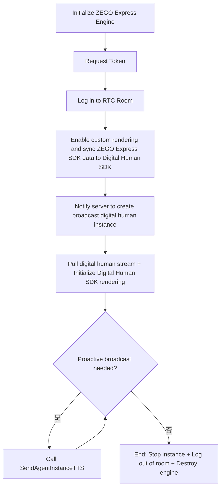
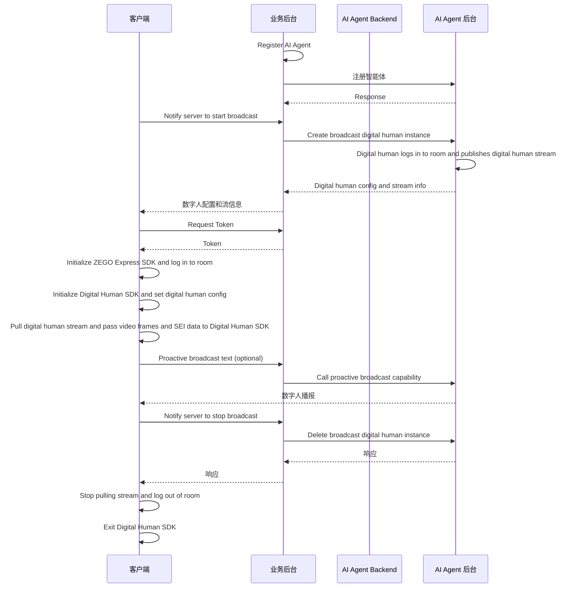
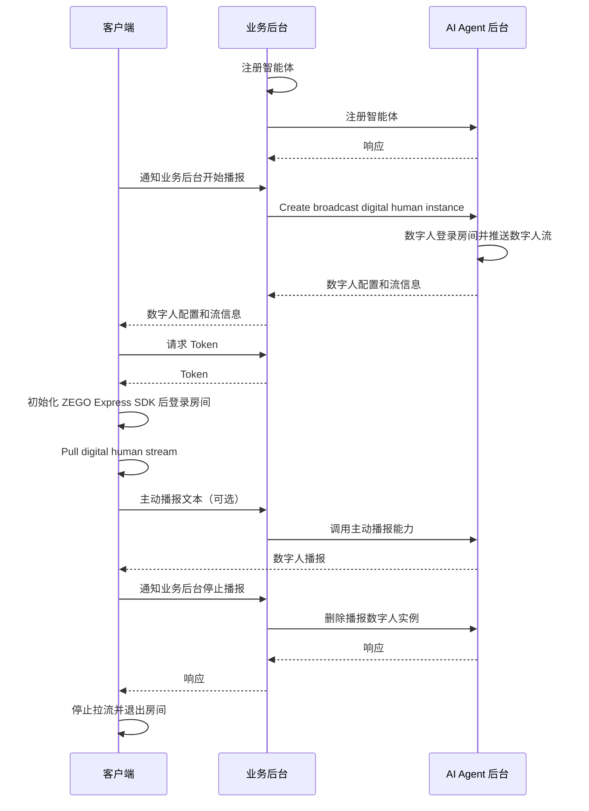

import {getPlatformData} from "/snippets/utils-content-parser.js"


export const expressSDKMap = {
  'Android': <a href='/real-time-voice-android/quick-start/integrating-sdk' target='_blank'>ZEGO Express SDK</a>,
  'iOS': <a href='/real-time-voice-ios/quick-start/integrating-sdk' target='_blank'>ZEGO Express SDK</a>,
  'Web': <a href='/real-time-voice-web/quick-start/integrating-sdk' target='_blank'>ZEGO Express SDK</a>,
}

# Implement Digital Human Live Broadcast

:::if{props.platform="undefined|iOS"}
This document explains how to quickly integrate the client SDK (ZEGO Express SDK and Digital Human SDK) to implement digital human live broadcast.<br/>
Unlike digital human video calls, digital human broadcasting is a one-way viewing scenario—users do not interact with the digital human, but only watch the broadcast content.<br/>
The client only needs to log in to the [RTC room](/glossary/term-explanation#rtc-room-) and [pull streams](/glossary/term-explanation#pull-stream); it does not need to capture or [publish streams](/glossary/term-explanation#publish-stream) of the user's audio and video.After creating a broadcast instance, the server can proactively make the digital human broadcast specified text via the TTS API.<br/>
Suitable for scenarios such as digital human live streaming, news broadcasting, event hosting, and scripted broadcast.
:::
:::if{props.platform="Web"}
This document explains how to quickly integrate the client SDK (ZEGO Express SDK) to implement digital human live broadcast.<br/>
与Digital Human Video Call不同，Digital human broadcast是单向观看场景——即用户不和数字人进行互动，只是拉数字人播报内容进行观看。<br/>
Client只需要登录 [RTC 房间](/glossary/term-explanation#rtc-房间-)并[拉流](/glossary/term-explanation#拉流)，不需要采集或[推流](/glossary/term-explanation#推流)用户的音视频流。创建播报实例后，服务端可以通过 TTS 接口主动让数字人播报指定文本。<br/>
适用于Digital human live streaming, news broadcasting、活动主持和固定话术播报等场景。
:::

## Differences from Digital Human Video Calls

| 对比项 | 数字人视频通话 | Digital Human Live Broadcast |
| --- | --- | --- |
| Interaction Mode | Two-way; the digital human responds after the user speaks | One-way; users only watch the broadcast content |
| Use Cases | AI interaction, AI customer service, digital human tutor | 数字人直播、新闻播报 |
| Client Requires User Audio Capture | 是 | 否 |
| Digital Human Driving Mechanism | After receiving user audio, the LLM generates a response and drives the digital human via TTS | Broadcast content is fully controlled by the server; the digital human is driven via TTS |
| Instance Creation API | [CreateDigitalHumanAgentInstance](/aiagent-server/api-reference/agent-instance-management/create-digital-human-agent-instance) | [CreateLiveDigitalHumanAgentInstance](/aiagent-server/api-reference/agent-instance-management/create-live-digital-human-agent-instance) |
| Requires user_id and user_stream_id | 是 | 否 |

## Prerequisites

- A project has been created in the [ZEGO Console](https://console.zegocloud.com/){/* 英文控制台链接：https://console.zegocloud.com/ */} , and valid AppID and ServerSecret have been obtained (used for server API signing and RTC Token04 generation). For details, see [Console - Project Info](/console/project-info).
- ZEGO technical support has been contacted to enable the Digital Human PaaS service and related API permissions.
- A valid `digital_human_id` has been obtained (for testing, you can use the public ID: c4b56d5c-db98-4d91-86d4-5a97b507da97).
- The broadcast digital human server APIs have been integrated following the [Server Quick Start Guide](/aiagent-server/quick-start-with-live-digital-human).
:::if{props.platform="undefined|iOS"}
- The AI Agent-optimized ZEGO Express SDK has been downloaded from the [Download page](./introduction/download.mdx) and integrated into the project.
:::
:::if{props.platform="Web"}
- ZEGO technical support has been contacted to obtain the AI Agent-optimized ZEGO Express SDK, and it has been integrated into the project.
:::

<Warning title="注意">
Digital human broadcasting does not require recording permissions and will not publish local streams. If the same application also includes voice call or digital human video call entries, those entries still need to apply for recording permissions as per the corresponding documentation.
</Warning>

## Sample Code

Below is the server sample code for integrating the Real-time Interactive AI Agent API. You can refer to the sample code to implement your own business logic.

<CardGroup cols={2}>
<Card title="Server示例代码" href="https://github.com/ZEGOCLOUD/ai_agent_quick_start_server" target="_blank">
Includes capabilities such as obtaining ZEGO Tokens, registering AI agents, creating broadcast digital human instances, proactively invoking TTS, and stopping instances.
</Card>
</CardGroup>

Below is the client sample code. You can refer to the sample code to implement your own business logic.

<CardGroup cols={2}>
:::if{props.platform=undefined}
<Card title="Android 客户端示例代码" href="https://github.com/ZEGOCLOUD/ai_agent_quick_start/tree/master/android" target="_blank">
The entry point is `StartLiveDigitalHumanCall`, corresponding to `video.LiveDigitalHumanActivity`. It includes login, stream pulling, digital human rendering, proactive TTS, and room exit.
</Card>
:::
:::if{props.platform="iOS"}
<Card title="iOS 客户端示例代码" href="https://github.com/ZEGOCLOUD/ai_agent_quick_start/tree/master/ios" target="_blank">
The entry point is `StartLiveDigitalHuman`, which completes login, stream pulling, digital human rendering, proactive TTS, and room exit via the broadcast mode on the digital human page.
</Card>
:::
:::if{props.platform="Web"}
<Card title="Web 客户端示例代码" href="https://github.com/ZEGOCLOUD/ai_agent_quick_start/tree/master/web" target="_blank">
The entry point is `Start Live Digital Human`. It includes login, stream pulling, proactive TTS, and room exit.
</Card>
:::
</CardGroup>

:::if{props.platform="undefined|Web"}
The following video demonstrates how to run through the server and client (Web) sample code and interact with the AI agent via voice.
<Video src="https://doc-media.zego.im/docuo/557a014d7c.mp4" />
:::
:::if{props.platform="iOS"}
The following video demonstrates how to run through the server and client (iOS) sample code and interact with the AI agent via voice.
<Video src="https://doc-media.zego.im/docuo/aaaa65c2d4.mp4" />
:::

## Overall Business Flow

1. Server: Follow the [Server Quick Start Guide](/aiagent-server/quick-start-with-live-digital-human) to run through the server sample code and deploy the server.
    - Integrate the Real-time Interactive AI Agent API to manage AI agents.
:::if{props.platform="Web"}
2. Client: Run through the sample code.
    - Create and manage AI agents via the server.
    - Integrate {getPlatformData(props,expressSDKMap)} for real-time communication.
:::
:::if{props.platform="undefined|iOS"}
2. 客户端，跑通示例代码
    - 通过业务后台创建和管理智能体。
    - Integrate {getPlatformData(props,expressSDKMap)} and the Digital Human SDK for real-time communication.
:::

After completing the above steps, you can watch the digital human broadcast.

:::if{props.platform=undefined}

:::
:::if{props.platform="iOS"}

:::
:::if{props.platform="Web"}

:::

## Core Capabilities Implementation

### Integrate ZEGO Express SDK

:::if{props.platform=undefined}

Please refer to [Integrate SDK > 2.2 > Method 2](/real-time-voice-android/quick-start/integrating-sdk) to manually integrate the SDK. The sample project uses `ZegoExpressEngine` and `ZegoDigitalMobile`.

Add the Digital Human SDK in `app/build.gradle`:

```groovy app/build.gradle
dependencies {
    implementation 'im.zego:digitalmobile:1.3.0.43'
}
```

Declare network permissions in `AndroidManifest.xml`. The broadcast digital human scenario does not require declaring or requesting `RECORD_AUDIO`:

```xml AndroidManifest.xml
<uses-permission android:name="android.permission.ACCESS_NETWORK_STATE" />
<uses-permission android:name="android.permission.INTERNET" />
```

<Warning title="Difference from Video Call">
The Android quickstart retains `RECORD_AUDIO` in the Manifest to support both voice calls and digital human video calls; when entering `LiveDigitalHumanActivity`, this permission is not requested and no local audio stream is created. If only the broadcast entry is kept, this permission can be removed.
</Warning>

The broadcast scenario does not require runtime recording permission. You can initialize the ZEGO Express SDK directly when entering the page:

```java {3}
ZegoEngineProfile profile = new ZegoEngineProfile();
profile.appID = appID; // Obtained from the ZEGO Console
profile.scenario = ZegoScenario.HIGH_QUALITY_CHATROOM;
profile.application = getApplication();
ZegoExpressEngine.createEngine(profile, null);
```

<Note title="Emulator Compatibility Note">
If running on an Android emulator, some audio/video capabilities and digital human rendering depend on hardware decoding and GPU acceleration of real devices, and the display may not work properly or show a black screen. It is recommended to debug and verify digital human broadcasting effects on a real device.
</Note>

:::

:::if{props.platform="iOS"}

The iOS quickstart integrates the SDK via CocoaPods:

```ruby Podfile
target 'ai_agent_quickstart' do
  use_frameworks! :linkage => :static
  use_modular_headers!

  pod 'ZegoExpressEngine', :path => 'libs/Express'
  pod 'Masonry', '1.1.0'
  pod 'ZegoDigitalMobile', '>= 1.3.0'
end
```

Digital human broadcasting is a one-way viewing scenario. You do not need to add `NSMicrophoneUsageDescription` in `Info.plist` or call `requestRecordPermission:`. If the same application also supports digital human video calls, you can keep the microphone permission declaration required for video calls.

When initializing the broadcast page, call `ZegoExpressEngine` directly without requesting microphone permission:

```objc
- (void)initZegoExpressEngine {
    ZegoEngineProfile *profile = [[ZegoEngineProfile alloc] init];
    profile.appID = appID; // Obtained from the ZEGO Console
    profile.scenario = ZegoScenarioHighQualityChatroom;
    [ZegoExpressEngine createEngineWithProfile:profile eventHandler:self];
}
```

:::

:::if{props.platform="Web"}

The Web quickstart uses `zego-express-engine-webrtc`. The broadcast entry does not create audio streams or call `startPublishingStream`, so no microphone permission is required:

```bash
npm install zego-express-engine-webrtc
```

```ts
import { ZegoExpressEngine } from "zego-express-engine-webrtc";

// appID: number，从 ZEGO 控制台项目信息获取
// server: Signaling server address. If using ZEGO Express SDK 3.7.0 or later, you can fill in the Server address obtained from the console or leave it as an empty string
const zg = new ZegoExpressEngine(appID, "");
```

以下是 Web 端常用的变量声明/配置示例：

```ts
// 从 ZEGO 控制台获取
const APP_ID = 1234567890; // AppID，数字类型
const SERVER = ""; // Signaling server address, 3.7.0+ can be left as an empty string
// 从业务后台获取
const BASE_URL = "http://your-server-host:3000"; // Server address
const ROOM_ID = "room_xxx"; // RTC room ID
const USER_ID = "user_xxx"; // User ID
const DIGITAL_HUMAN_ID = "c4b56d5c-db98-4d91-86d4-5a97b507da97"; // Digital Human ID
const CONFIG_ID = "web"; // Use `web` for Web

// Module-level variables, used by roomStreamUpdate / remoteCameraStatusUpdate / logout
let agentStreamId = "";
let agentInstanceId = "";
```

```ts
const loginResult = await zg.loginRoom(roomID, token, {
    userID,
    userName,
});

if (!loginResult) {
  throw new Error("Failed to log in to RTC room");
}
```

The current quickstart's shared initialization logic still calls `checkSystemRequirements` to check WebRTC and microphone capabilities for compatibility with the voice call entry. If your Web application only implements digital human broadcasting, you can remove the microphone check.

:::

:::if{props.platform="undefined"}

### Integrate Digital Human SDK

<div>
The Digital Human SDK has been published to the Maven repository. Follow the steps below to integrate it into your project.
<Steps>
<Step title="Add `maven` configuration">
Choose the appropriate steps based on your Android Gradle plugin version.

<Tabs>
<Tab title="7.1.0 or later">
Go to the project root directory, open the `settings.gradle` file, and add the Maven repository under `dependencyResolutionManagement` > `repositories`. Example code:
```groovy {6}
dependencyResolutionManagement {
  repositoriesMode.set(RepositoriesMode.FAIL_ON_PROJECT_REPOS)
  repositories {
      google()
      mavenCentral()
      maven { url 'https://maven.zego.im' }   // <- 添加这行。
  }
}
```
</Tab>
<Tab title="Below 7.1.0">
Go to the project root directory, open the `build.gradle` file, and add the Maven repository under `allprojects`->`repositories`. Example code:
```groovy
allprojects {
    repositories {
        google()
        mavenCentral()
        maven { url 'https://maven.zego.im' }   // <- 添加这行。
    }
}
```
</Tab>
</Tabs>
</Step>
<Step title="Modify your app-level build.gradle file">
```groovy
dependencies {
    ...
    // Digital Human SDK dependency
    implementation "im.zego:digitalmobile:1.3.0.43"
}
```
<Warning title="注意">Supports Android 6.0 (API 23) and above.</Warning>
</Step>
</Steps>
</div>

:::

:::if{props.platform="iOS"}

### 集成数字人 SDK

<div>

<Warning title="注意">Supports iOS 12 and above.</Warning>

<Tabs>
<Tab title="Integrate via CocoaPods">
<Steps>
  <Step title="Add dependency in Podfile">
    ```ruby
    pod 'ZegoDigitalMobile', '>= 1.3.0'
    ```
  </Step>
  <Step title="Install SDK">
    Run in the project root directory:
    ```bash
    pod repo update && pod install
    ```
  </Step>
</Steps>
</Tab>
<Tab title="Manual Integration">
<Steps>
  <Step title="Download the latest version of the SDK">
    Please download the latest version of the [SDK](https://artifact-node.zego.cloud/generic/digithuman/public/ZegoDigitalMobile/release/ios/ZegoDigitalMobile.zip?version=1.3.0.53).
  </Step>
  <Step title="Extract the SDK">
    将 SDK 包解压至项目目录下，例如“libs”文件夹下。
    <Frame width="512" height="auto" caption="">
      
    </Frame>
  </Step>
  <Step>
    选择“TARGETS > General > Frameworks, Libraries, and Embedded Content”菜单，添加 ZegoDigitalMobile.xcframework，将“Embed”设置为“Embed & Sign”。
    <Frame width="512" height="auto" caption="">
      
    </Frame>
  </Step>
</Steps>
</Tab>
</Tabs>

</div>

:::

### Notify the Server to Create a Broadcast Digital Human Instance

The client calls the server's `POST /api/start-live-digital-human`. Upon receiving the request, the server calls ZEGO's `CreateLiveDigitalHumanAgentInstance` API to create a broadcast digital human instance. For detailed parameters, see [Create Broadcast Digital Human Instance](/aiagent-server/api-reference/agent-instance-management/create-live-digital-human-agent-instance). In RTC mode, the request body must at least contain `room_id`, `digital_human_id`, and `config_id`; `user_id` and `user_stream_id` are not required.

```json
{
  "room_id": "room_xxxxxxxx",
  "digital_human_id": "digital_human_xxxxxxxx",
  "config_id": "mobile"
}
```

`digital_human_id` corresponds to the server `DigitalHuman` structure. Its core fields are as follows:

| 字段 | 说明 |
| --- | --- |
| `digital_human_id` | Digital human ID, used to specify the digital human appearance. |
| `encode_code` | Encoding type. Only `mobile` (Android/iOS) and `web` (Web) are supported. Android and iOS use `mobile`, Web uses `web`. |

The `config_id` for Android and iOS is `mobile`, and for Web it is `web`. Valid values for `DigitalHumanConfig.EncodeCode` are only `mobile` and `web`.

When calling the ZEGO API, the server needs to construct the `DigitalHuman` object using `digital_human_id` and `config_id`:

```json
{
    "DigitalHumanId": "c4b56d5c-db98-4d91-86d4-5a97b507da97",
    "ConfigId": "mobile",
    "EncodeCode": "H264"
}
```

The following information needs to be returned to the client in a successful server response:

| 字段 | 用途 |
| --- | --- |
| `agent_instance_id` | For calling proactive TTS and stop instance APIs |
| `agent_stream_id` | The digital human stream ID in the RTC room |
| `agent_user_id` | The digital human's user ID in the RTC room |
| `digital_human_config` | Config for initializing the Android/iOS Digital Human SDK |

:::if{props.platform=undefined}

Android uses `OkHttp` to directly request the server:

```java
private void startLiveDigitalHuman(String baseUrl, String digitalHumanId,
                                   String configId, String roomId) {
    JSONObject bodyJson = new JSONObject();
    bodyJson.put("digital_human_id", digitalHumanId);
    bodyJson.put("config_id", configId);
    bodyJson.put("room_id", roomId);

    RequestBody body = RequestBody.create(
        bodyJson.toString(), MediaType.parse("application/json; charset=utf-8"));
    Request request = new Request.Builder()
        .url(baseUrl + "/api/start-live-digital-human")
        .post(body)
        .build();

    new OkHttpClient().newCall(request).enqueue(new Callback() {
        @Override
        public void onFailure(@NonNull Call call, @NonNull IOException e) {
            // Handle network error
        }

        @Override
        public void onResponse(@NonNull Call call, @NonNull Response response)
            throws IOException {
            JSONObject result = new JSONObject(response.body().string());
            if (result.getInt("code") == 0) {
                String agentInstanceId = result.getString("agent_instance_id");
                String agentStreamId = result.getString("agent_stream_id");
                String digitalHumanConfig = result.getString("digital_human_config");
                // Save agentInstanceId for subsequent TTS and stop
                startPlayingStream(agentStreamId);
                initDigitalMobileSDK(digitalHumanConfig);
            }
        }
    });
}
```

:::

:::if{props.platform="iOS"}

iOS uses `NSURLSession` to directly request the server and saves the instance ID, stream ID, and digital human config from the response:

```objc
- (void)startLiveDigitalHuman {
    NSURL *url = [NSURL URLWithString:
        [baseURL stringByAppendingString:@"/api/start-live-digital-human"]];
    NSMutableURLRequest *request = [NSMutableURLRequest requestWithURL:url];
    request.HTTPMethod = @"POST";
    [request setValue:@"application/json" forHTTPHeaderField:@"Content-Type"];

    NSDictionary *params = @{
        @"digital_human_id": digitalHumanId,
        @"config_id": @"mobile",
        @"room_id": roomID,
    };
    request.HTTPBody = [NSJSONSerialization dataWithJSONObject:params options:0 error:nil];

    [[[NSURLSession sharedSession] dataTaskWithRequest:request
        completionHandler:^(NSData *data, NSURLResponse *response, NSError *error) {
        NSDictionary *result = [NSJSONSerialization JSONObjectWithData:data options:0 error:nil];
        if (error == nil && [result[@"code"] integerValue] == 0) {
            agentInstanceId = result[@"agent_instance_id"];
            agentStreamId = result[@"agent_stream_id"];
            NSString *config = result[@"digital_human_config"];
            [self initDigitalMobileSDK:config];
        }
    }] resume];
}
```

:::

:::if{props.platform="Web"}

Web uses `fetch` to directly request the server. The example only passes the RTC room ID, so no local user or local stream info is sent:

```ts
async function startLiveDigitalHuman(roomId: string) {
  const response = await fetch(`${baseURL}/api/start-live-digital-human`, {
    method: "POST",
    headers: { "Content-Type": "application/json" },
    body: JSON.stringify({
    digital_human_id: config.digitalHuman.id,
    config_id: config.digitalHuman.configId,
    room_id: roomId,
    }),
  });
  const result = await response.json();
  if (result.code !== 0) throw new Error(result.message);
  return result;
}
```

:::

### User Joins the Room (No Publishing)

Broadcast digital human only requires logging in to the RTC room and receiving the digital human stream. The client does not need to create local streams or call `startPublishingStream`.

:::if{props.platform=undefined}

Android needs to first obtain a Token from the server using `OkHttp`, then call the ZEGO Express SDK to log in to the room. After successful login, enable custom video rendering, then create a broadcast digital human instance:

```java
String tokenUrl = baseUrl + "/api/zego-token?userId=" + userId;
Request tokenRequest = new Request.Builder().url(tokenUrl).get().build();
new OkHttpClient().newCall(tokenRequest).enqueue(new Callback() {
    @Override
    public void onResponse(@NonNull Call call, @NonNull Response response)
        throws IOException {
        String token = new JSONObject(response.body().string()).getString("token");

        ZegoEngineConfig engineConfig = new ZegoEngineConfig();
        engineConfig.advancedConfig = new HashMap<String, String>() {{
            //===== Digital human specific ====//
            put("set_audio_volume_ducking_mode", "1");           // Volume ducking toggle, enabled by default
            put("enable_rnd_volume_adaptive", "true");           // Playback volume adaptive toggle, enabled by default
            put("sideinfo_callback_version", "3");               // Make SEI and frame one-to-one corresponding, for ZEGO Express SDK 3.17
            put("sideinfo_bound_to_video_decoder", "true");      // Make SEI and frame one-to-one corresponding, for ZEGO Express SDK 3.18
        }};
        ZegoExpressEngine.setEngineConfig(engineConfig);

        ZegoRoomConfig roomConfig = new ZegoRoomConfig();
        roomConfig.isUserStatusNotify = true;
        roomConfig.token = token;
        ZegoExpressEngine.getEngine().loginRoom(
            roomId, new ZegoUser(userId, userId), roomConfig,
            (errorCode, extendedData) -> {
                if (errorCode == 0) {
                    openExpressCustomRender();
                    startLiveDigitalHuman(baseUrl, digitalHumanId, "mobile", roomId);
                }
            });
    }

    @Override
    public void onFailure(@NonNull Call call, @NonNull IOException e) {
        // Handle Token retrieval failure
    }
});
```

:::

:::if{props.platform="iOS"}

iOS uses `NSURLSession` to obtain a Token, then calls `loginRoom` directly. The broadcast scenario does not call `startPublishingStream`:

```objc
- (void)loginRoomForBroadcast:(NSString *)token {
    ZegoRoomConfig *roomConfig = [[ZegoRoomConfig alloc] init];
    roomConfig.isUserStatusNotify = YES;
    roomConfig.token = token;

    ZegoUser *user = [[ZegoUser alloc] initWithUserID:userID userName:userID];
    [[ZegoExpressEngine sharedEngine] loginRoom:roomID
                                           user:user
                                         config:roomConfig
                                        callback:^(int errorCode, NSDictionary *extendedData) {
        if (errorCode == 0) {
            [self enableCustomVideoRender];
            [self startLiveDigitalHuman];
        }
    }];
}
```

:::

:::if{props.platform="Web"}

Web logs in to the room directly. The broadcast scenario does not create audio streams or publish local streams:

```ts
// 1. Obtain Token from server
const tokenRes = await fetch(`${BASE_URL}/api/zego-token?userId=${USER_ID}&roomId=${ROOM_ID}`);
const { token } = await tokenRes.json();

// 2. 登录 RTC 房间
await zg.loginRoom(ROOM_ID, token, { userID: USER_ID, userName: USER_ID });

// 3. 创建播报数字人实例
const result = await startLiveDigitalHuman(ROOM_ID);
// 4. Extract and save agent_stream_id and agent_instance_id for subsequent stream pulling, TTS, and logout
agentStreamId = result.agent_stream_id;
agentInstanceId = result.agent_instance_id;
```

:::

### Initialize Digital Human SDK and Custom Rendering

Android and iOS need to pass the raw video frames and SEI data received by the ZEGO Express SDK to the Digital Human SDK, which then renders the digital human. Custom video rendering must be enabled before calling `startPlayingStream`.

:::if{props.platform=undefined}

Android initializes the Digital Human SDK. The example involves three view member variables that need to be declared and initialized in the layout beforehand:

- `digitalView`：Container for the Digital Human SDK rendering. The digital human image is ultimately drawn on this View. It is passed to the Digital Human SDK via `attach` during initialization.
- `loadingView`：Loading placeholder view, displayed before the first frame of the digital human is rendered, and hidden in the first frame draw callback.
- `digitalPic`：Static cover placeholder image, similar to `loadingView`, hidden in the first frame draw callback to prevent the display from staying on a static image.

```java
private void initDigitalMobileSDK(String digitalHumanConfig) {
    digitalMobileSDK = ZegoDigitalHuman.create(this);
    digitalMobileSDK.start(digitalHumanConfig,
        new IZegoDigitalMobile.ZegoDigitalMobileListener() {
            @Override
            public void onSurfaceFirstFrameDraw() {
                loadingView.setVisibility(View.GONE);
                digitalPic.setVisibility(View.GONE);
            }
        });
    digitalMobileSDK.attach(digitalView);
}
```

In `openExpressCustomRender`, configure RAW_DATA and forward callback data to the Digital Human SDK. `onPlayerSyncRecvSEI` is used to receive the SEI (Supplemental Enhancement Information) data parsed by the ZEGO Express SDK and forward it to the Digital Human SDK. SEI carries additional information such as lip sync and expressions needed for digital human driving, and is key to accurate lip movements. For more details on SEI, see [SEI Advanced Features](/real-time-voice-android/communication/sei).

```java
private void openExpressCustomRender() {
    ZegoCustomVideoRenderConfig renderConfig = new ZegoCustomVideoRenderConfig();
    renderConfig.bufferType = ZegoVideoBufferType.RAW_DATA;
    renderConfig.frameFormatSeries = ZegoVideoFrameFormatSeries.RGB;
    renderConfig.enableEngineRender = false;
    ZegoExpressEngine.getEngine().enableCustomVideoRender(true, renderConfig);

    ZegoExpressEngine.getEngine().setCustomVideoRenderHandler(
        new IZegoCustomVideoRenderHandler() {
            @Override
            public void onRemoteVideoFrameRawData(
                ByteBuffer[] data, int[] dataLength, ZegoVideoFrameParam param,
                String streamID) {
                IZegoDigitalMobile.ZegoVideoFrameParam digitalParam =
                    new IZegoDigitalMobile.ZegoVideoFrameParam();
                digitalParam.format =
                    IZegoDigitalMobile.ZegoVideoFrameFormat.getZegoVideoFrameFormat(
                        param.format.value());
                digitalParam.height = param.height;
                digitalParam.width = param.width;
                digitalParam.rotation = param.rotation;
                for (int i = 0; i < 4; i++) {
                    digitalParam.strides[i] = param.strides[i];
                }

                if (digitalMobileSDK != null) {
                    digitalMobileSDK.onRemoteVideoFrameRawData(
                        data, dataLength, digitalParam, streamID);
                }
            }
        });

    ZegoExpressEngine.getEngine().setEventHandler(new IZegoEventHandler() {
        @Override
        public void onPlayerSyncRecvSEI(String streamID, byte[] data) {
            if (digitalMobileSDK != null) {
                digitalMobileSDK.onPlayerSyncRecvSEI(streamID, data);
            }
        }
    });
}
```

:::

:::if{props.platform="iOS"}

iOS calls `enableCustomVideoRender` before `startPlayingStream`, and forwards video frames and SEI in the digital human event handler:

```objc
- (BOOL)enableCustomVideoRender {
    ZegoCustomVideoRenderConfig *renderConfig =
        [[ZegoCustomVideoRenderConfig alloc] init];
    renderConfig.bufferType = ZegoVideoBufferTypeRawData;
    renderConfig.frameFormatSeries = ZegoVideoFrameFormatSeriesRGB;
    renderConfig.enableEngineRender = NO;

    ZegoExpressEngine *engine = [ZegoExpressEngine sharedEngine];
    if (!engine) {
        return NO;
    }

    [engine enableCustomVideoRender:YES config:renderConfig];
    [engine setCustomVideoRenderHandler:self];
    return YES;
}

- (void)onRemoteVideoFrameRawData:(unsigned char **)data
                       dataLength:(unsigned int *)dataLength
                            param:(ZegoVideoFrameParam *)param
                         streamID:(NSString *)streamID {
    ZDMVideoFrameParam *digitalParam = [[ZDMVideoFrameParam alloc] init];
    digitalParam.format = (ZDMVideoFrameFormat)param.format;
    digitalParam.width = param.size.width;
    digitalParam.height = param.size.height;
    digitalParam.rotation = param.rotation;

    for (int i = 0; i < 4; i++) {
        [digitalParam setStride:param.strides[i] atIndex:i];
    }

    if (self.digitalMobile) {
        [self.digitalMobile onRemoteVideoFrameRawData:data
                                           dataLength:dataLength
                                                param:digitalParam
                                             streamID:streamID];
    }
}

- (void)onPlayerSyncRecvSEI:(NSData *)data streamID:(NSString *)streamID {
    if (self.digitalMobile) {
        [self.digitalMobile onPlayerSyncRecvSEI:streamID data:data];
    }
}
```

:::

:::if{props.platform="Web"}

The Web client does not integrate the Digital Human SDK and does not require custom rendering configuration. Use the ZEGO Express SDK directly to play the digital human video stream.

:::

### Pull the Digital Human Stream

After creating the instance, the client uses the `agent_stream_id` returned by the server to pull the digital human stream. The timing for pulling streams varies slightly across platforms: Android pulls the stream directly after the instance creation API succeeds; iOS and Web use the room stream update callback to match the target stream before pulling.

:::if{props.platform=undefined}

The Android quickstart pulls `agent_stream_id` directly after successfully creating the broadcast digital human instance, without using `onRoomStreamUpdate`:

```java
// Set the stream buffering range to alleviate stuttering caused by network jitter; min is the initial buffer (ms), max is the maximum buffer (ms)
ZegoExpressEngine.getEngine()
    .setPlayStreamBufferIntervalRange(agent_stream_id, 100, 2000);
ZegoExpressEngine.getEngine().startPlayingStream(agent_stream_id);
```

:::

:::if{props.platform="iOS"}

Listen to `onRoomStreamUpdate` and start pulling the stream only when the `agentStreamId` returned by the server appears in the room:

```objc
- (void)startPlayStream:(NSString *)streamId {
    [[ZegoExpressEngine sharedEngine]
        setPlayStreamBufferIntervalRange:streamId min:0 max:2000];
    [[ZegoExpressEngine sharedEngine] startPlayingStream:streamId];
}

- (void)onRoomStreamUpdate:(ZegoUpdateType)updateType
                streamList:(NSArray<ZegoStream *> *)streamList
              extendedData:(nullable NSDictionary *)extendedData
                    roomID:(NSString *)roomID {
    if (updateType == ZegoUpdateTypeAdd) {
        for (ZegoStream *stream in streamList) {
            if ([stream.streamID isEqualToString:self.agentStreamId]) {
                [self startPlayStream:self.agentStreamId];
                break;
            }
        }
    } else if (updateType == ZegoUpdateTypeDelete) {
        for (ZegoStream *stream in streamList) {
            if ([stream.streamID isEqualToString:self.agentStreamId]) {
                [[ZegoExpressEngine sharedEngine] stopPlayingStream:stream.streamID];
            }
        }
    }
}
```

:::

:::if{props.platform="Web"}

Listen to `roomStreamUpdate` and create a remote stream view after matching the `agentStreamId` returned by the server. The `agentStreamId` comes from the `agent_stream_id` returned by the instance creation API, which has been extracted from the response after logging in to the room:

```ts
let remoteView: any = null;

zg.on(
  "roomStreamUpdate",
  async (
    roomID: string,
    updateType: "DELETE" | "ADD",
    streamList: ZegoStreamList[],
  ) => {
    if (updateType === "ADD" && streamList.length > 0) {
      for (const stream of streamList) {
        // Only pull the digital human stream, filter out other streams in the room
        if (stream.streamID !== agentStreamId) continue;
        const mediaStream = await zg.startPlayingStream(stream.streamID);
        remoteView = await zg.createRemoteStreamView(mediaStream);
        remoteView?.playAudio();
        break;
      }
    }
  },
);

// The digital human video stream is pushed by the server. The camera status changing to OPEN indicates the video stream is ready; play the video at this point
zg.on(
  "remoteCameraStatusUpdate",
  (streamID: string, status: "OPEN" | "MUTE") => {
    if (streamID === agentStreamId && status === "OPEN") {
      remoteView?.playVideo("remoteStreamView");
    }
  }
);
```

:::

<Note title="CDN 模式拉流">
The above is the RTC mode stream pulling method. If using CDN mode, the client does not need to log in to the RTC room or follow the above flow to pull RTC streams. Instead, it can directly use a generic player (such as an HLS/FLV player) to pull the `cdn_url` returned by the server to watch the digital human broadcast. CDN mode does not require integrating the Digital Human SDK.
</Note>

### Proactively Trigger Digital Human Text Broadcast

After the digital human instance is successfully created, the client calls the server's `POST /api/send-agent-instance-tts`, passing in the instance ID and text:

```json
{
  "agent_instance_id": "2075416950128779264",
  "text": "Hello developer, welcome to ZEGO AI Agent."
}
```

`text` The maximum length of `text` is 300 characters. You can also pass parameters such as `add_history`, `priority`, and `same_priority_option` as needed. For details, see [Proactive Invocation of LLM and TTS](/aiagent-server/guides/proactive-invocation-of-llm-and-tts).

<Note title="实例生命周期">
The broadcast digital human instance is automatically destroyed after being idle (no broadcast tasks) for more than 900 seconds. The business side can adjust this idle timeout via `MaxIdleTime`. For long-lived broadcasts, periodically call proactive TTS or increase `MaxIdleTime`.
</Note>

:::if{props.platform=undefined}

Android uses `OkHttp` to directly call the TTS API:

```java
JSONObject bodyJson = new JSONObject();
bodyJson.put("agent_instance_id", agentInstanceId);
bodyJson.put("text", text);

Request request = new Request.Builder()
    .url(baseUrl + "/api/send-agent-instance-tts")
    .post(RequestBody.create(bodyJson.toString(),
        MediaType.parse("application/json; charset=utf-8")))
    .build();
new OkHttpClient().newCall(request).enqueue(new Callback() {
    @Override
    public void onResponse(@NonNull Call call, @NonNull Response response)
        throws IOException {
        JSONObject result = new JSONObject(response.body().string());
        if (result.getInt("code") != 0) {
            // Handle TTS request failure
        }
    }

    @Override
    public void onFailure(@NonNull Call call, @NonNull IOException e) {
        // 处理网络错误
    }
});
```

:::

:::if{props.platform="iOS"}

```objc
NSDictionary *params = @{
    @"agent_instance_id": agentInstanceId,
    @"text": text,
};
NSURL *url = [NSURL URLWithString:
    [baseURL stringByAppendingString:@"/api/send-agent-instance-tts"]];
NSMutableURLRequest *request = [NSMutableURLRequest requestWithURL:url];
request.HTTPMethod = @"POST";
[request setValue:@"application/json" forHTTPHeaderField:@"Content-Type"];
request.HTTPBody = [NSJSONSerialization dataWithJSONObject:params options:0 error:nil];

[[NSURLSession.sharedSession dataTaskWithRequest:request
    completionHandler:^(NSData *data, NSURLResponse *response, NSError *error) {
    NSDictionary *result = [NSJSONSerialization JSONObjectWithData:data options:0 error:nil];
    if (error == nil && [result[@"code"] integerValue] == 0) {
        NSLog(@"Broadcast sent successfully");
    }
}] resume];
```

:::

:::if{props.platform="Web"}

```ts
const response = await fetch(`${baseURL}/api/send-agent-instance-tts`, {
  method: "POST",
  headers: { "Content-Type": "application/json" },
  body: JSON.stringify({
    agent_instance_id: agentInstanceId,
    text,
  }),
});
const result = await response.json();
if (result.code !== 0) throw new Error(result.message);
```

The Web quickstart displays a TTS input box in broadcast mode and saves the `agent_instance_id` returned by the server in the page state.

:::

### Leave the Room and End the Broadcast

When exiting, you need to stop the Agent instance, stop pulling streams, log out of the RTC room, and destroy the client SDK. Whether the stop API succeeds or not, you should release RTC resources to avoid residual rooms and engines.

:::if{props.platform=undefined}

```java
@Override
protected void onDestroy() {
    super.onDestroy();
    JSONObject bodyJson = new JSONObject();
    bodyJson.put("agent_instance_id", agentInstanceId);
    Request request = new Request.Builder()
        .url(baseUrl + "/api/stop")
        .post(RequestBody.create(bodyJson.toString(),
            MediaType.parse("application/json; charset=utf-8")))
        .build();
    new OkHttpClient().newCall(request).enqueue(new Callback() {
        @Override
        public void onResponse(@NonNull Call call, @NonNull Response response) {
            ZegoExpressEngine.getEngine().stopPlayingStream(agentStreamId);
            ZegoExpressEngine.getEngine().logoutRoom();
            digitalMobile.stop();
            ZegoExpressEngine.destroyEngine(null);
        }

        @Override
        public void onFailure(@NonNull Call call, @NonNull IOException e) {
            // Even if the request fails, local RTC and Digital Human SDK resources should be released
            ZegoExpressEngine.getEngine().logoutRoom();
            digitalMobile.stop();
            ZegoExpressEngine.destroyEngine(null);
        }
    });
}
```

:::

:::if{props.platform="iOS"}

```objc
- (void)stopLiveDigitalHuman {
    NSDictionary *params = @{ @"agent_instance_id": agentInstanceId };
    NSURL *url = [NSURL URLWithString:
        [baseURL stringByAppendingString:@"/api/stop"]];
    NSMutableURLRequest *request = [NSMutableURLRequest requestWithURL:url];
    request.HTTPMethod = @"POST";
    [request setValue:@"application/json" forHTTPHeaderField:@"Content-Type"];
    request.HTTPBody = [NSJSONSerialization dataWithJSONObject:params options:0 error:nil];

    [[[NSURLSession sharedSession] dataTaskWithRequest:request
        completionHandler:^(NSData *data, NSURLResponse *response, NSError *error) {
        [[ZegoExpressEngine sharedEngine] stopPlayingStream:agentStreamId];
        [[ZegoExpressEngine sharedEngine] logoutRoom];
        [digitalMobile stop];
        [ZegoExpressEngine destroyEngine:nil];
    }] resume];
}
```

:::

:::if{props.platform="Web"}

```ts
async function logoutRoom() {
  await fetch(`${baseURL}/api/stop`, {
    method: "POST",
    headers: { "Content-Type": "application/json" },
    body: JSON.stringify({ agent_instance_id: agentInstanceId }),
  });
  zg.stopPlayingStream(agentStreamId);
  zg.logoutRoom(roomID);
  agentInstanceId = "";
}
```

The broadcast scenario has no local audio stream, so there is no need to destroy the audio capture stream.

:::

## RTC and CDN Modes

This document uses RTC mode as an example: the client logs in to the room and pulls `agent_stream_id`. For large-scale live streaming, you can use CDN mode:

| 模式 | Instance Creation Parameter | Client Playback Method | 适用场景 |
| --- | --- | --- | --- |
| RTC | `room_id` | Pull RTC stream via ZEGO Express SDK | Low latency, small-scale interaction |
| CDN | `cdn_url` | Pull CDN stream via player | Large-scale live streaming |

Both RTC and CDN modes use `agent_instance_id` to call the proactive TTS and stop instance APIs. CDN mode does not require the client to log in to the RTC room or integrate the Digital Human SDK. For CDN stream pulling: any CDN-compatible playback method can be used without special instructions.

:::if{props.platform="Web"}

Digital human supports both RTC and CDN stream pulling. If you need a large number of users to watch digital human broadcasts, such as in e-commerce live streaming or live classrooms, you can use CDN live mode. In CDN mode, the Web client does not need to integrate the ZEGO Express SDK; any Web player that supports HLS/FLV (such as hls.js or video.js) can be used to pull the `cdn_url`.
:::

## Listen for Callbacks

Please listen for ZEGO Express SDK room login, stream pulling status, and error callbacks, and log `agent_instance_id`, `agent_stream_id`, `request_id`, and error information on the server to help locate the cause of instance creation, stream pulling, or TTS failures. `request_id` is returned by the ZEGO server and is a key identifier for troubleshooting server-side issues. Please provide this information along with the above details to ZEGO technical support when an issue occurs.

During integration testing, it is strongly recommended to listen for server callbacks (events where Event is `Exception`) to quickly locate LLM/TTS parameter configuration issues via `Data.Code` and `Data.Message`. For callback and error code details, see [Receive Callbacks](/aiagent-server/callbacks/receiving-callback) and [Exception Event Error Codes](/aiagent-server/callbacks/exception-codes).

<Warning title="注意">
If the digital human display stays on a static image, please check: whether the digital human config is valid, whether `agent_stream_id` is correct, whether custom video rendering was enabled before `startPlayingStream`, and whether video frames and SEI data are being passed to the Digital Human SDK.
</Warning>

## Troubleshooting Checklist

If you encounter issues during integration, check against the following list item by item.

:::if{props.platform=undefined}

**Android 排查清单**

| 现象 | Troubleshooting Direction |
| --- | --- |
| Failed to log in to room | Check if the Token is valid, if `AppID` matches, and if the network can reach ZEGO services. |
| Instance creation failed | Confirm `digital_human_id`, `config_id` (Android uses `mobile`), and `room_id` are correct, and the server signature is valid. |
| Cannot pull stream / No video | Confirm `agent_stream_id` matches the server response; check if `enableCustomVideoRender` was called before `startPlayingStream`. |
| Display stays on static image | Check if `digitalView`/`loadingView`/`digitalPic` are correctly `attach`-ed; confirm video frames and SEI have been forwarded to `digitalMobileSDK`; run on a real device, not an emulator. |
| Inaccurate lip sync | Confirm SEI data has been forwarded via `onPlayerSyncRecvSEI`; confirm SEI-related parameters in `advanceConfig` match the ZEGO Express SDK version. |
| TTS not broadcasting | Confirm `agent_instance_id` is correct, `text` ≤ 300 characters, and the instance has not been destroyed due to 900 seconds of idleness. |

:::
:::if{props.platform="iOS"}

**iOS 排查清单**

| 现象 | 排查方向 |
| --- | --- |
| 登录房间失败 | 检查 Token 是否有效、`AppID` 是否匹配、网络是否可达 ZEGO 服务。 |
| 创建实例返回失败 | Confirm `digital_human_id`, `config_id` (iOS uses `mobile`), and `room_id` are correct, and the server signature is valid. |
| 拉不到流 / 无画面 | Match `agentStreamId` in `onRoomStreamUpdate` before pulling the stream; confirm `enableCustomVideoRender` is called before `startPlayingStream`. |
| 画面停留在静态图 | Confirm video frames and SEI have been forwarded to `digitalMobile`; Info.plist does not need microphone permission but must ensure network permission. |
| TTS 不播报 | 确认 `agent_instance_id` 正确、`text` ≤ 300 字符、实例未因 900 秒空闲被销毁。 |

:::
:::if{props.platform="Web"}

**Web 排查清单**

| 现象 | 排查方向 |
| --- | --- |
| 登录房间失败 | Check if the Token is valid, if `AppID` matches; for SDK 3.7.0 and later, `server` can be left as an empty string. |
| 创建实例返回失败 | Confirm `digital_human_id`, `config_id` (Web uses `web`), and `room_id` are correct, and the server signature is valid. |
| No video / No audio | Filter by `agentStreamId` in `roomStreamUpdate` before calling `startPlayingStream`; wait for `remoteCameraStatusUpdate` to be `OPEN` before calling `playVideo`. |
| Video container not displaying | Confirm the container ID passed to `playVideo` is `remoteStreamView` (check the spelling). |
| TTS 不播报 | 确认 `agent_instance_id` 正确、`text` ≤ 300 字符、实例未因 900 秒空闲被销毁。 |

:::

For more error codes, see [Exception Event Error Codes](/aiagent-server/callbacks/exception-codes). For callback monitoring, see [Receive Callbacks](/aiagent-server/callbacks/receiving-callback).
