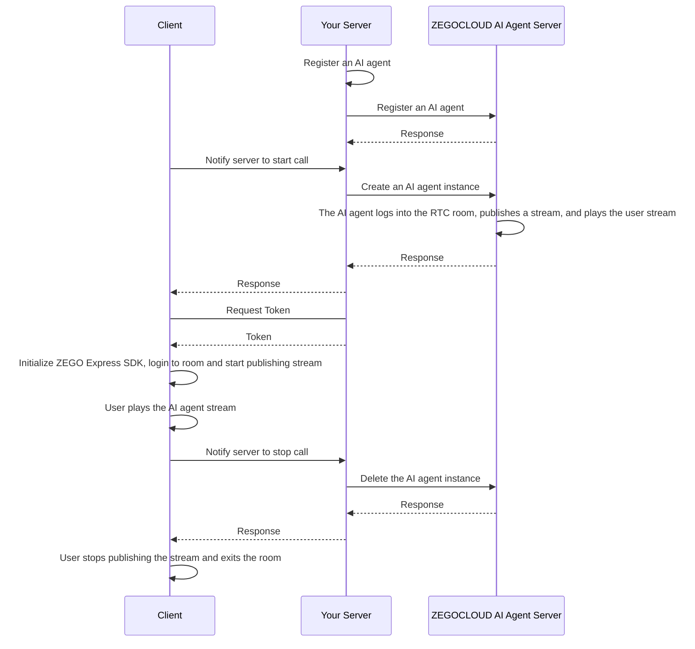

import {getPlatformData} from "/snippets/utils-content-parser.js"


export const expressSDKMap = {
  'Android': <a href='/real-time-voice-android/quick-start/integrating-sdk' target='_blank'>ZEGO Express SDK</a>,
  'iOS': <a href='/real-time-voice-ios/quick-start/integrating-sdk' target='_blank'>ZEGO Express SDK</a>,
  'Web': <a href='/real-time-voice-web/quick-start/integrating-sdk' target='_blank'>ZEGO Express SDK</a>,
  'Flutter': <a href='/real-time-voice-flutter/quick-start/integrating-sdk' target='_blank'>ZEGO Express SDK</a>,
}


# Quick Start Voice Call

This document explains how to quickly integrate the client SDK (ZEGO Express SDK) and achieve voice interaction with an AI Agent.

## Prerequisites

- Create a project in the [ZEGOCLOUD Console](https://console.zegocloud.com/), and get its valid AppID and AppSign. For more details, please refer to Admin Console doc [How to view project info](https://www.zegocloud.com/docs/admin-console/view-project-information?platform=all&language=all).
:::if{props.platform="undefined|iOS|Flutter"}
- You have downloaded the ZEGO Express SDK optimized for AI Agent from the [download page](./introduction/download.mdx) and integrated it into your project.
:::
:::if{props.platform="Web"}
- You have contacted ZEGOCLOUD Technical Support to obtain the ZEGO Express SDK optimized for AI Agent and integrated it into your project.
:::
- Deploy your server to call [ZEGOCLOUD AI Agent server APIs](/aiagent-server/api-reference/accessing-server-apis) (you can refer to the server example code).

## Sample Codes
The following is the example code for the business backend that integrates the real-time interactive AI Agent API. You can refer to the example code to implement your own business logic.

<CardGroup cols={2}>
<Card title="Business Backend Example Code"  href="https://github.com/ZEGOCLOUD/ai_agent_quick_start_server" target="_blank">
Includes the basic capabilities of obtaining ZEGOCLOUD Token, registering AI Agent, creating AI Agent instances, and deleting AI Agent instances.
</Card>
</CardGroup>

Below are the client sample codes, you can refer to these sample codes to implement your own business logic.

<CardGroup cols={2}>
:::if{props.platform=undefined}
<Card title="Android Client Sample Code" href="https://github.com/ZEGOCLOUD/ai_agent_quick_start/tree/master/android" target="_blank">
Android client sample code. It includes basic capabilities such as logging into and out of RTC rooms, and publishing and playing streams.
</Card>
:::
:::if{props.platform="iOS"}
<Card title="iOS Client Sample Code" href="https://github.com/ZEGOCLOUD/ai_agent_quick_start/tree/master/ios" target="_blank">
iOS client sample code. It includes basic capabilities such as logging into and out of RTC rooms, and publishing and playing streams.
</Card>
:::
:::if{props.platform="flutter"}
<Card title="Flutter Client Sample Code" href="https://github.com/ZEGOCLOUD/ai_agent_quick_start/tree/master/flutter" target="_blank">
Flutter client sample code. It includes basic capabilities such as logging into and out of RTC rooms, and publishing and playing streams.
</Card>
:::
:::if{props.platform="Web"}
<Card title="Web Client Sample Code" href="https://github.com/ZEGOCLOUD/ai_agent_quick_start/tree/master/web" target="_blank">
Web client sample code. It includes basic capabilities such as logging into and out of RTC rooms, and publishing and playing streams.
</Card>
:::
</CardGroup>

{/* TODO: 视频未翻译英文
:::if{props.platform="undefined|flutter|Web"}
The following video demonstrates how to run the server and client (Web) sample code and interact with an AI agent by voice.
<Video src="https://media-resource.spreading.io/docuo/workspace564/27e54a759d23575969552654cb45bf89/557a014d7c.mp4" />
:::
:::if{props.platform="iOS"}
The following video demonstrates how to run the server and client (iOS) sample code and interact with an AI agent by voice.
<Video src="https://media-resource.spreading.io/docuo/workspace564/27e54a759d23575969552654cb45bf89/aaaa65c2d4.mp4" />
:::
*/}

## Overall Business Process

1. Server side: Follow the [Server Quick Start](/aiagent-server/quick-start) guide to run the server sample code and deploy your server
    - Integrate ZEGOCLOUD AI Agent APIs to manage AI agents.
2. Client side: Run the sample code
    - Create and manage AI agents through your server.
    - Integrate  {getPlatformData(props,expressSDKMap)} for real-time communication.

After completing these two steps, you can add an AI agent to a room for real-time interaction with real users.



## Core Capability Implementation

### Integrate ZEGO Express SDK

:::if{props.platform=undefined}

Please refer to [Integrate the SDK > 2.2 > Method 2](https://www.zegocloud.com/docs/video-call/sdk-integration?platform=android&language=java#2) to manually integrate the SDK. After integrating the SDK, follow these steps to initialize ZegoExpressEngine.

<div>
<Steps>
<Step title="Add Permission Declaration">
Navigate to the "app/src/main" directory, open the "AndroidManifest.xml" file, and add permissions.
```xml AndroidManifest.xml
<uses-permission android:name="android.permission.ACCESS_NETWORK_STATE" />
<uses-permission android:name="android.permission.INTERNET" />
<uses-permission android:name="android.permission.RECORD_AUDIO" />
```
</Step>
<Step title="Request Recording Permission at Runtime">
```java
private final ActivityResultLauncher<String> requestPermissionLauncher = registerForActivityResult(
    new ActivityResultContracts.RequestPermission(), new ActivityResultCallback<Boolean>() {
        @Override
        public void onActivityResult(Boolean isGranted) {
            if (isGranted) {
                // Permission granted
            }
        }
    });
// Initiate request
requestPermissionLauncher.launch(Manifest.permission.RECORD_AUDIO);
```
</Step>
<Step title="Create and Initialize ZegoExpressEngine">
```java {3}
ZegoEngineProfile zegoEngineProfile = new ZegoEngineProfile();
zegoEngineProfile.appID = ; // Obtain from ZEGOCLOUD Console
zegoEngineProfile.scenario = ZegoScenario.HIGH_QUALITY_CHATROOM; // Setting this scenario can avoid requesting camera permissions, and the integrator should set specific values according to their own business scenarios
zegoEngineProfile.application = getApplication();
ZegoExpressEngine.createEngine(zegoEngineProfile, null);
```
</Step>
</Steps>
</div>
:::

:::if{props.platform="iOS"}

Please refer to [Import the SDK > 2.2 > Method 3](https://www.zegocloud.com/docs/video-call/sdk-integration?platform=ios&language=objective-c) to manually integrate the SDK. After integrating the SDK, follow these steps to initialize ZegoExpressEngine.

<div>
<Steps>
<Step title="Declare Required Permissions in Info.plist">
```xml Info.plist
<?xml version="1.0" encoding="UTF-8"?>
<!DOCTYPE plist PUBLIC "-//Apple//DTD PLIST 1.0//EN" "http://www.apple.com/DTDs/PropertyList-1.0.dtd">
<plist version="1.0">
<dict>
    ...
    <key>UIBackgroundModes</key>
    <array>
        <string>audio</string>
    </array>
    <key>NSMicrophoneUsageDescription</key>
    <string>Need microphone access for voice chat</string>
</dict>
</plist>
```
</Step>
<Step title="Request Recording Permission at Runtime">
```oc
- (void)requestAudioPermission:(void(^)(BOOL granted))completion {
    /// Need to add a description of microphone usage in the project's Info.plist file
    AVAudioSession *audioSession = [AVAudioSession sharedInstance];
    [audioSession requestRecordPermission:^(BOOL granted) {
        dispatch_async(dispatch_get_main_queue(), ^{
            completion(granted);
        });
    }];
}
```
</Step>
<Step title="Create and Initialize ZegoExpressEngine">

```oc {4}
-(void)initZegoExpressEngine{
    ZegoEngineProfile* profile = [[ZegoEngineProfile alloc]init];
    profile.appID = kZegoPassAppId;
    profile.scenario = ZegoScenarioHighQualityChatroom; // Setting this scenario can avoid requesting camera permissions, and the integrator should set specific values according to their own business scenarios

    [ZegoExpressEngine createEngineWithProfile:profile eventHandler:self];
}
```
</Step>
</Steps>
</div>

:::

:::if{props.platform="flutter"}

Please refer to [Integrate the SDK > 2.2 > Method 1](https://www.zegocloud.com/docs/video-call/quickstart?platform=flutter&language=dart#2) to manually integrate the SDK. After integrating the SDK, follow these steps to initialize ZegoExpressEngine.
> If including web platform, please refer to [Import the SDK for Flutter Web projects](https://www.zegocloud.com/docs/video-call/quickstart?platform=flutter&language=dart#4_3) to manually import JS files.

<div>
<Steps>
<Step title="Go to android/app/src/main directory, open AndroidManifest.xml file, and add permissions">
```xml AndroidManifest.xml
<uses-permission android:name="android.permission.RECORD_AUDIO" />
<uses-permission android:name="android.permission.MODIFY_AUDIO_SETTINGS" />
<uses-permission android:name="android.permission.INTERNET" />
<uses-permission android:name="android.permission.BLUETOOTH" />
<uses-permission android:name="android.permission.ACCESS_WIFI_STATE" />
<uses-permission android:name="android.permission.ACCESS_NETWORK_STATE" />
```
</Step>
<Step title="Go to ios/Runner directory, open Info.plist file, and add permissions">
```xml Info.plist
<?xml version="1.0" encoding="UTF-8"?>
<!DOCTYPE plist PUBLIC "-//Apple//DTD PLIST 1.0//EN" "http://www.apple.com/DTDs/PropertyList-1.0.dtd">
<plist version="1.0">
<dict>
    ...
    <key>UIBackgroundModes</key>
    <array>
        <string>audio</string>
    </array>
    <key>NSMicrophoneUsageDescription</key>
    <string>Need to access microphone to chat</string>
</dict>
</plist>
```
</Step>
<Step title="Go to ios directory, open Podfile file, and add permissions">
```xml Podfile {5-12}
post_install do |installer|
  installer.pods_project.targets.each do |target|
    flutter_additional_ios_build_settings(target)

    # Start of the permission_handler configuration
    target.build_configurations.each do |config|
      config.build_settings['GCC_PREPROCESSOR_DEFINITIONS'] ||= [
        '$(inherited)',
        'PERMISSION_MICROPHONE=1',
      ]
    end
    # End of the permission_handler configuration
  end
end
```
</Step>
<Step title="Request microphone permission at runtime">
```dart
import 'package:permission_handler/permission_handler.dart';

void main() {
  WidgetsFlutterBinding.ensureInitialized();

  Permission.microphone.request().then((status) {
    runApp(const MyApp());
  });
}
```
</Step>
<Step title="Create and initialize ZegoExpressEngine">
```dart {3}
await ZegoExpressEngine.createEngineWithProfile(
  /// Set this scenario to avoid requesting camera permissions, and the integrator should set specific values according to their own business scenarios
  ZegoEngineProfile(ZegoKey.appId, ZegoScenario.HighQualityChatroom),
);
```
</Step>
</Steps>
</div>

:::

:::if{props.platform="Web"}

Please refer to [Integrate SDK > Method 2](https://www.zegocloud.com/docs/video-call/sdk-integration?platform=web&language=javascript#2_2) to use npm to integrate SDK v3.9.123 or above. After integrating the SDK, initialize ZegoExpressEngine as follows.

1. Instantiate ZegoExpressEngine
2. Check system requirements (WebRTC support and microphone permissions)

```javascript {7,9}
import { ZegoExpressEngine } from "zego-express-engine-webrtc";

const appID = 1234567 // Obtain from ZEGOCLOUD Console
const server = 'xxx' // Obtain from ZEGOCLOUD Console

// Instantiate ZegoExpressEngine with appId and server configurations
const zg = new ZegoExpressEngine(appID, server);
// Check system requirements
const checkSystemRequirements = async () => {
    // Detect WebRTC support
    const rtc_sup = await zg.checkSystemRequirements("webRTC");
    if (!rtc_sup.result) {
      // Browser does not support WebRTC
  }
    // Detect microphone permission status
    const mic_sup = await zg.checkSystemRequirements("microphone");
    if (!mic_sup.result) {
      // Microphone permission is not enabled
  }
}
checkSystemRequirements()
```
:::

### Notify Your Server to Start Call

You can notify your server to start the call immediately after the real user enters the room on the client side. Asynchronous calls can help reduce call connection time. After receiving the start call notification, your server creates an AI agent instance using the same roomID and associated userID and streamID [create an AI agent instance](/aiagent-server/quick-start#create-agent-instance) , so that the AI agent can interact with real users in the same room through mutual stream publishing and playing.

<Warning title="Note">By default, each account can have at most 10 AI agent instances. If the limit is exceeded, the creation of an AI agent instance will fail. If you need to adjust this limit, please contact ZEGOCLOUD Technical Support.</Warning>

<Accordion title="Sample Code for Notifying Your Server" defaultOpen="false">

<Note title="Note">In the following examples, roomID, userID, streamID and other parameters are not passed when notifying your server to start the call because fixed values have been agreed between the client and your server in this example. In actual use, please pass the real parameters according to your business requirements.</Note>

:::if{props.platform=undefined}
```java
// Notify your server to start call
private void start() {
    RequestBody body = RequestBody.create("", MediaType.parse("application/json; charset=utf-8"));
    // The server calls the createAgentInstance interface in the /api/startn interface
    // !mark
    Request request = new Request.Builder().url(YOUR_SERVER_URL + "/api/start").post(body).build();

    new OkHttpClient.Builder().build().newCall(request).enqueue(new Callback() {
        @Override
        public void onFailure(@NonNull Call call, @NonNull IOException e) {

        }

        @Override
        public void onResponse(@NonNull Call call, @NonNull Response response) throws IOException {

        }
    });
}
```
:::
:::if{props.platform="iOS"}
```oc
// Notify your server to start call
/**
 * Start a call with the AI agent
 *
 * @param completion Completion callback, returns operation result
 * @discussion This method sends a request to the server to start the call, used to initialize the AI agent instance
 */
- (void)doStartCallWithCompletion:(void (^)(NSInteger code, NSString *message, NSDictionary *data))completion {
    // The server calls the createAgentInstance interface in the /api/startn interface
    // !mark
    NSString *url = [NSString stringWithFormat:@"%@/api/start", self.currentBaseURL];
    NSURL *requestURL = [NSURL URLWithString:url];

    // Create request
    NSMutableURLRequest *request = [[NSMutableURLRequest alloc] initWithURL:requestURL];
    request.HTTPMethod = @"POST";

    // Set request headers
    [request setValue:@"application/json" forHTTPHeaderField:@"Content-Type"];

    // Create request parameters
    NSMutableDictionary *params = [NSMutableDictionary dictionary];
    NSData *jsonData = [NSJSONSerialization dataWithJSONObject:params options:0 error:nil];
    request.HTTPBody = jsonData;

    // Create session
    NSURLSession *session = [NSURLSession sharedSession];

    // Send request
    NSURLSessionDataTask *task = [session dataTaskWithRequest:request
                                           completionHandler:^(NSData * _Nullable data,
                                                            NSURLResponse * _Nullable response,
                                                            NSError * _Nullable error) {
        dispatch_async(dispatch_get_main_queue(), ^{
            if (error) {
                if (completion) {
                    completion(-1, @"Network request failed", nil);
                }
                return;
            }

            NSHTTPURLResponse *httpUrlResponse = (NSHTTPURLResponse *)response;
            if (httpUrlResponse.statusCode != 200) {
                if (completion) {
                    completion(httpUrlResponse.statusCode,
                             [NSString stringWithFormat:@"Server error: %ld", (long)httpUrlResponse.statusCode],
                             nil);
                }
                return;
            }

            NSError *jsonError;
            NSDictionary *dict = [NSJSONSerialization JSONObjectWithData:data options:0 error:&jsonError];
            if (jsonError) {
                if (completion) {
                    completion(-2, @"Failed to parse response data", nil);
                }
                return;
            }

            // Parse response data
            NSInteger code = [dict[@"code"] integerValue];
            NSString *message = dict[@"message"];
            NSDictionary *responseData = dict[@"data"];

            if (completion) {
                completion(code, message, responseData);
            }
        });
    }];

    [task resume];
}
```
:::
:::if{props.platform="flutter"}
```dart
// Notify your server to start call
Future<Map<String, dynamic>> startCall() async {
  try {
    // The server calls the createAgentInstance interface in the /api/startn interface
    // !mark(2:2)
    final response = await http.post(
      Uri.parse('$_currentBaseUrl/api/start'),
      headers: {'Content-Type': 'application/json'},
    );

    if (response.statusCode == 200) {
      final json = jsonDecode(response.body);
      return json;
    }
    return {'code': -1, 'message': 'Request failed'};
  } catch (e) {
    return {'code': -1, 'message': e.toString()};
  }
}
```
:::
:::if{props.platform="Web"}
```javascript
// Notify your server to start call
async function startCall() {
  try {
    // The server calls the createAgentInstance interface in the /api/startn interface
    // !mark
    const response = await fetch(`${YOUR_SERVER_URL}/api/start`, { // YOUR_SERVER_URL is the address of your Your Server
      method: 'POST',
      headers: {
        'Content-Type': 'application/json',
      }
    });

    const data = await response.json();
    console.log('Start call result:', data);
    return data;
  } catch (error) {
    console.error('Failed to start call:', error);
    throw error;
  }
}
```
:::
</Accordion>

### User logs in a RTC room and starts publishing a stream

After a real user logs into the room, they start publishing streams.

:::if{props.platform="undefined|iOS"}
<Note title="Note">
In this scenario, AI echo cancellation should be enabled for better effects.
</Note>
:::

The token used for login needs to be obtained from your server; please refer to the complete sample code.

<Note title="Note">
Please ensure that the roomID, userID, and streamID are unique under one ZEGOCLOUD APPID.
- roomID: Generated by the user according to their own rules, it will be used to log into the Express SDK room. Only numbers, English characters, and '~', '!', '@', '#', '$', '%', '^', '&', '*', '(', ')', '_', '+', '=', '-', '`', ';', ''', ',', '.', '\<', '\>', '\' are supported. If interoperability with the Web SDK is required, do not use '%'.
- userID: Length should not exceed 32 bytes. Only numbers, English characters, and '~', '!', '@', '#', '$', '%', '^', '&', '*', '(', ')', '_', '+', '=', '-', '`', ';', ''', ',', '.', '\<', '\>', '\' are supported. If interoperability with the Web SDK is required, do not use '%'.
- streamID: Length should not exceed 256 bytes. Only numbers, English characters, and '-', '_' are supported.
</Note>

:::if{props.platform=undefined}
```java title="Client login to room and publish a stream" {5,6,12-17,25,30}
private void loginRoom(String userId, String userName, String userName, String token,
    IZegoRoomLoginCallback callback) {
    ZegoEngineConfig config = new ZegoEngineConfig();
    HashMap<String, String> advanceConfig = new HashMap<String, String>();
    advanceConfig.put("set_audio_volume_ducking_mode", "1");
    advanceConfig.put("enable_rnd_volume_adaptive", "true");
    config.advancedConfig = advanceConfig;
    ZegoExpressEngine.setEngineConfig(config);
    ZegoExpressEngine.getEngine().setRoomScenario(ZegoScenario.HIGH_QUALITY_CHATROOM);
    ZegoExpressEngine.getEngine().setAudioDeviceMode(ZegoAudioDeviceMode.GENERAL);

    ZegoExpressEngine.getEngine().enableAEC(true);
    // Enable AI echo cancellation
    ZegoExpressEngine.getEngine().setAECMode(ZegoAECMode.AI_BALANCED);
    ZegoExpressEngine.getEngine().enableAGC(true);
    ZegoExpressEngine.getEngine().enableANS(true);
    ZegoExpressEngine.getEngine().setANSMode(ZegoANSMode.MEDIUM);

    ZegoRoomConfig roomConfig = new ZegoRoomConfig();
    roomConfig.isUserStatusNotify = true;
    roomConfig.token = token;  // Token authentication is required, obtain it from your server, and refer to ZEGOCLOUD documentation for generation method

    String roomId ;   // Custom room ID for login, please refer to the format description
    String userSteamID // Custom stream ID for publishing, please refer to the format description
    ZegoExpressEngine.getEngine()
        .loginRoom(roomId, new ZegoUser(userId, userName), roomConfig, (errorCode, extendedData) -> {
            Timber.d(
                "loginRoom() called with: errorCode = [" + errorCode + "], extendedData = [" + extendedData + "]");
            if (errorCode == 0) {
                // Start publishing stream after successful login
                ZegoExpressEngine.getEngine().startPublishingStream(userSteamID);
                // Set microphone mute status, false means unmuted, true means muted
                ZegoExpressEngine.getEngine().muteMicrophone(false);
            }
            if (callback != null) {
                callback.onRoomLoginResult(errorCode, extendedData);
            }

        });
}
```
:::
:::if{props.platform="iOS"}
```oc title="Client request to login to room and publish a stream" {6-7,9,16-20,23}
// Record the agent
self.streamToPlay = [self getAgentStreamID];

ZegoEngineConfig* engineConfig = [[ZegoEngineConfig alloc] init];
engineConfig.advancedConfig = @{
    @"set_audio_volume_ducking_mode":@1,/** This configuration is used for volume ducking **/
    @"enable_rnd_volume_adaptive":@"true",/** This configuration is used for adaptive playback volume **/
};
[ZegoExpressEngine setEngineConfig:engineConfig];

// This setting only affects AEC (echo cancellation). Here we set it to ModeGeneral, which uses our proprietary echo cancellation algorithm, giving us more control.
// If other options are selected, it might use the system's echo cancellation, which may work better on iPhones but could be less effective on some Android devices.
[[ZegoExpressEngine sharedEngine] setAudioDeviceMode:ZegoAudioDeviceModeGeneral];

// Enable AI echo cancellation
[[ZegoExpressEngine sharedEngine] enableAGC:TRUE];
[[ZegoExpressEngine sharedEngine] enableAEC:TRUE];
[[ZegoExpressEngine sharedEngine] setAECMode:ZegoAECModeAIBalanced];
[[ZegoExpressEngine sharedEngine] enableANS:TRUE];
[[ZegoExpressEngine sharedEngine] setANSMode:ZegoANSModeMedium];

// Login to room
[self loginRoom:^(int errorCode, NSDictionary *extendedData) {
    if (errorCode!=0) {
        NSString* errorMsg =[NSString stringWithFormat:@"Failed to enter voice room:%d", errorCode];
        completion(NO, errorMsg);
        return;
    }

    // Start publishing stream after entering room
    [self startPushlishStream];
}];
```
:::

:::if{props.platform="flutter"}
```dart title="Client request to login to room and publish a stream" {11-21,25-27,30-33,40}
final String _userId = 'user_id_1';
final String _roomId = 'room_id_1';
final String _userStreamId = 'user_stream_id_1';

/// Generate RTC Token [Reference Documentation]（https://www.zegocloud.com/docs/video-call/token?platform=flutter&language=dart）
final token = await getToken();
if (token.isEmpty) {
  return false;
}

/// The following is used for answering delay optimization, you need to integrate the corresponding version of ZegoExpressEngine sdk, please contact ZEGOCLOUD technical support
ZegoExpressEngine.setEngineConfig(
  ZegoEngineConfig(
    advancedConfig: {
      /**This configuration is used for volume ducking**/
      'set_audio_volume_ducking_mode': '1',
      /**This configuration is used for adaptive playback volume**/
      'enable_rnd_volume_adaptive': 'true'
    },
  ),
);


/// Enable 3A
ZegoExpressEngine.instance.enableAGC(true);
ZegoExpressEngine.instance.enableAEC(true);
if (!kIsWeb) {
  ZegoExpressEngine.instance.setAECMode(ZegoANSMode.AIAGGRESSIVE2);

  /// This setting only affects AEC (echo cancellation). Here we set it to ModeGeneral, which uses our proprietary echo cancellation, which is more controllable.
  /// If other options are selected, it might use the system's echo cancellation, which may work better on iPhones but could be less effective on some Android devices.
  ZegoExpressEngine.instance.setAudioDeviceMode(
    ZegoAudioDeviceMode.General,
  );
}
ZegoExpressEngine.instance.enableANS(true);
ZegoExpressEngine.instance.setANSMode(ZegoANSMode.Medium);

/// Login to room
final user = ZegoUser(_userId, _userId);
final roomConfig = ZegoRoomConfig.defaultConfig()
  ..isUserStatusNotify = true
  ..token = token;
final loginResult = await ZegoExpressEngine.instance.loginRoom(
  _roomId,
  user,
  config: roomConfig,
);
if (0 != loginResult.errorCode && 1002001 != loginResult.errorCode) {
  return false;
}

/// Start publishing stream (open microphone)
await ZegoExpressEngine.instance.muteMicrophone(false);
await ZegoExpressEngine.instance.startPublishingStream(_userStreamId);
```
:::

:::if{props.platform="Web"}

```javascript title="Client login to room and publish a stream" {22-23}
const userId = "" // User ID for logging into the Express SDK room
const roomId = "" // RTC Room ID
const userStreamId = "" // User stream push ID
async function enterRoom() {
  try {
    // Generate RTC Token [Reference Documentation] (https://www.zegocloud.com/docs/video-call/token?platform=web&language=javascript)
    const token = await Api.getToken();
    // Login to room
    await zg.loginRoom(roomId, token, {
      userID: userId,
      userName: "",
    });

    // Create local audio stream
    const localStream = await zg.createZegoStream({
      camera: {
        video: false,
        audio: true,
      },
    });
    if (localStream) {
      // Push local stream
      await zg.startPublishingStream(userStreamId, localStream);
    }
  } catch (error) {
    console.error("Failed to enter room:", error);
    throw error;
  }
}
enterRoom()
```
:::

### Play the AI Agent Stream

By default, there is only one real user and one AI agent in the same room, so any new stream added is assumed to be the AI agent stream.

:::if{props.platform=undefined}

```java title="Client request to play the AI agent stream" {9-16}
// Set up the event handler
void setEventHandler() {
    ZegoExpressEngine.getEngine().setEventHandler(new IZegoEventHandler() {
        @Override
        // When other users in the room start/stop publishing streams, you can receive notifications about the corresponding user's audio/video stream changes here
        public void onRoomStreamUpdate(String roomID, ZegoUpdateType updateType, ArrayList<ZegoStream> streamList, JSONObject extendedData) {
            super.onRoomStreamUpdate(roomID, updateType, streamList, extendedData);
            // When updateType is ZegoUpdateType.ADD, it means there is a new audio/video stream, at this time we can call the startPlayingStream interface to pull this audio/video stream
            if (updateType == ZegoUpdateType.ADD) {
                ZegoStream stream = streamList.get(0);
                // By default, new streams are from the AI agent, so play directly
                ZegoExpressEngine.getEngine().startPlayingStream(stream.streamID);
            }
        }
    });
}
```
:::
:::if{props.platform="iOS"}

```oc title="Client request to play the AI agent stream" {10}
// Listen for room stream information update status, and play the AI agent stream
- (void)onRoomStreamUpdate:(ZegoUpdateType)updateType
                streamList:(NSArray<ZegoStream *> *)streamList
              extendedData:(nullable NSDictionary *)extendedData
                    roomID:(NSString *)roomID{
    if (updateType == ZegoUpdateTypeAdd) {
        for (int i=0; i<streamList.count; i++) {
            ZegoStream* item = [streamList objectAtIndex:i];

            [self startPlayStream:item.streamID];
        }
    } else if(updateType == ZegoUpdateTypeDelete) {
        for (int i=0; i<streamList.count; i++) {
            ZegoStream* item = [streamList objectAtIndex:i];
            [[ZegoExpressEngine sharedEngine] stopPlayingStream:item.streamID];
        }
    }
}
```
:::

:::if{props.platform="flutter"}
```dart title="Client request to play the AI agent stream"
  ZegoExpressEngine.onRoomStreamUpdate = _onRoomStreamUpdate;

  void _onRoomStreamUpdate(
    String roomID,
    ZegoUpdateType updateType,
    List<ZegoStream> streamList,
    Map<String, dynamic> extendedData,
  ) {
    if (updateType == ZegoUpdateType.Add) {
      for (var stream in streamList) {
        ZegoExpressEngine.instance.startPlayingStream(stream.streamID);
      }
    } else if (updateType == ZegoUpdateType.Delete) {
      for (var stream in streamList) {
        ZegoExpressEngine.instance.stopPlayingStream(stream.streamID);
      }
    }
  }
```
:::

:::if{props.platform="Web"}

```javascript title="Client request to play the AI agent stream" {9}
// Listen to remote stream update events
function setupEvent() {
  zg.on("roomStreamUpdate",
    async (roomID, updateType, streamList) => {
      if (updateType === "ADD" && streamList.length > 0) {
        try {
          for (const stream of streamList) {
            // Play the AI agent stream
            const mediaStream = await zg.startPlayingStream(stream.streamID);
            if (!mediaStream) return;
            const remoteView = await zg.createRemoteStreamView(mediaStream);
            if (remoteView) {
             // A container with the id 'remoteSteamView' is required on the page to receive the AI agent stream [Reference Documentation]（https://www.zegocloud.com/article/api?doc=Express_Video_SDK_API~javascript_web~class~ZegoStreamView）
              remoteView.play("remoteSteamView", {
                enableAutoplayDialog: false,
              });
            }
          }
        } catch (error) {
          console.error("Failed to pull stream:", error);
        }
      }
    }
  );
}
```
:::


Congratulations🎉! After completing this step, you can ask the AI agent any question by voice, and the AI agent will answer your questions by voice!

### Delete the agent instance and the user exits the room

The client calls the logout interface to exit the room and stops publishing and playing streams. At the same time, it notifies your server to end the call. After receiving the end call notification, your server will delete the AI agent instance, and the AI agent instance will automatically exit the room and stop publishing and playing streams. This completes a full interaction.

:::if{props.platform=undefined}
```java {4,16}
// Notify your server to end the call
private void stop() {
    RequestBody body = RequestBody.create("", MediaType.parse("application/json; charset=utf-8"));
    Request request = new Request.Builder().url(YOUR_SERVER_URL + "/api/stop").post(body).build();

    new OkHttpClient.Builder().build().newCall(request).enqueue(new Callback() {
        @Override
        public void onFailure(@NonNull Call call, @NonNull IOException e) {

        }

        @Override
        public void onResponse(@NonNull Call call, @NonNull Response response) throws IOException {
            if (response.isSuccessful()) {
                // Exit room
                ZegoExpressEngine.getEngine().logoutRoom();
            }
        }
    });
}

```
:::
:::if{props.platform="iOS"}
```oc {9,69}
/**
 * Notify your server to end the call
 *
 * @param completion Completion callback, returns operation result
 * @discussion This method sends a request to the server to end the call, used to release the AI agent instance
 */
- (void)doStopCallWithCompletion:(void (^)(NSInteger code, NSString *message, NSDictionary *data))completion {
    // Build request URL
    NSString *url = [NSString stringWithFormat:@"%@/api/stop", self.currentBaseURL];
    NSURL *requestURL = [NSURL URLWithString:url];

    // Create request
    NSMutableURLRequest *request = [[NSMutableURLRequest alloc] initWithURL:requestURL];
    request.HTTPMethod = @"POST";

    // Set request headers
    [request setValue:@"application/json" forHTTPHeaderField:@"Content-Type"];

    // Create request parameters
    NSMutableDictionary *params = [NSMutableDictionary dictionary];
    NSData *jsonData = [NSJSONSerialization dataWithJSONObject:params options:0 error:nil];
    request.HTTPBody = jsonData;

    // Create session
    NSURLSession *session = [NSURLSession sharedSession];

    // Send request
    NSURLSessionDataTask *task = [session dataTaskWithRequest:request
                                           completionHandler:^(NSData * _Nullable data,
                                                            NSURLResponse * _Nullable response,
                                                            NSError * _Nullable error) {
        dispatch_async(dispatch_get_main_queue(), ^{
            if (error) {
                if (completion) {
                    completion(-1, @"Network request failed", nil);
                }
                return;
            }

            NSHTTPURLResponse *httpUrlResponse = (NSHTTPURLResponse *)response;
            if (httpUrlResponse.statusCode != 200) {
                if (completion) {
                    completion(httpUrlResponse.statusCode,
                             [NSString stringWithFormat:@"Server error: %ld", (long)httpUrlResponse.statusCode],
                             nil);
                }
                return;
            }

            NSError *jsonError;
            NSDictionary *dict = [NSJSONSerialization JSONObjectWithData:data options:0 error:&jsonError];
            if (jsonError) {
                if (completion) {
                    completion(-2, @"Failed to parse response data", nil);
                }
                return;
            }

            // Parse response data
            NSInteger code = [dict[@"code"] integerValue];
            NSString *message = dict[@"message"];
            NSDictionary *responseData = dict[@"data"];

            if (completion) {
                completion(code, message, responseData);
            }

            // Exit room
            [[ZegoExpressEngine sharedEngine] logoutRoom];
        });
    }];

    [task resume];
}
```
:::
:::if{props.platform="flutter"}
```dart
// Notify your server to end the call
Future<Map<String, dynamic>> stopCall() async {
  try {
    final response = await http.post(
      Uri.parse('$_currentBaseUrl/api/stop'),
      headers: {'Content-Type': 'application/json'},
    );

    if (response.statusCode == 200) {
      final json = jsonDecode(response.body);
      return json;
    }
    return {'code': -1, 'message': 'Request failed'};
  } catch (e) {
    return {'code': -1, 'message': e.toString()};
  }
}

/// Stop the conversation with the AI agent
Future<bool> stop() async {
  stopCall();

  final String _roomId = 'room_id_1';

  final engine = ZegoExpressEngine.instance;

  /// Stop publishing stream
  await engine.stopPublishingStream();

  /// Log out of the room
  await engine.logoutRoom(_roomId);

  return true;
}
```
:::
:::if{props.platform="Web"}
```javascript {4,21}
// Exit room
async function stopCall() {
  try {
    const response = await fetch(`${YOUR_SERVER_URL}/api/stop`, { // YOUR_SERVER_URL is the address of your Your Server
      method: 'POST',
      headers: {
        'Content-Type': 'application/json',
      }
    });

    const data = await response.json();
    console.log('End call result:', data);
    return data;
  } catch (error) {
    console.error('Failed to end call:', error);
    throw error;
  }
}
stopCall();
zg.destroyLocalStream(localStream);
zg.logoutRoom();
```
:::


This is the complete core process for you to achieve real-time voice interaction with an AI agent.

## Best Practices for ZEGO Express SDK Configuration

To achieve the best audio call experience, it is recommended to configure the ZEGO Express SDK according to the following best practices. These configurations can significantly improve the quality of AI agent voice interactions.

:::if{props.platform="undefined|iOS"}

**Settings Before Join Room:**
<div>
- Enable traditional audio 3A processing (Acoustic Echo Cancellation AEC, Automatic Gain Control AGC, and Noise Suppression ANS)
- Set the room usage scenario to High Quality Chatroom, as the SDK will adopt different optimization strategies for different scenarios
- Set the audio device mode to default mode
- Enable AI echo cancellation to improve echo cancellation effect (this feature requires contacting ZEGO technical support to obtain the corresponding version of ZEGOExpress SDK)
- Configure volume ducking to avoid sound conflicts
- Enable adaptive playback volume to enhance user experience
- Enable AI noise reduction and set appropriate noise suppression level
</div>
:::

:::if{props.platform=undefined}
```java
ZegoEngineConfig config = new ZegoEngineConfig();
HashMap<String, String> advanceConfig = new HashMap<String, String>();
// Configure volume ducking to avoid sound conflicts
advanceConfig.put("set_audio_volume_ducking_mode", "1");
// Enable adaptive playback volume
advanceConfig.put("enable_rnd_volume_adaptive", "true");
config.advancedConfig = advanceConfig;
ZegoExpressEngine.setEngineConfig(config);
// Set room usage scenario to High Quality Chatroom
ZegoExpressEngine.getEngine().setRoomScenario(ZegoScenario.HIGH_QUALITY_CHATROOM);
// Set audio device mode to default mode
ZegoExpressEngine.getEngine().setAudioDeviceMode(ZegoAudioDeviceMode.GENERAL);
// Enable traditional audio 3A processing
ZegoExpressEngine.getEngine().enableAEC(true);
ZegoExpressEngine.getEngine().enableAGC(true);
ZegoExpressEngine.getEngine().enableANS(true);
// Enable AI echo cancellation
ZegoExpressEngine.getEngine().setAECMode(ZegoAECMode.AI_BALANCED);
// Enable AI noise reduction with moderate noise suppression
ZegoExpressEngine.getEngine().setANSMode(ZegoANSMode.MEDIUM);
```
:::

:::if{props.platform="iOS"}

```oc
ZegoEngineProfile* profile = [[ZegoEngineProfile alloc]init];
profile.appID = kZegoAppId;
profile.scenario = ZegoScenarioHighQualityChatroom; // High Quality Chatroom scenario, setting this scenario can avoid requesting camera permissions, integrators should set specific values according to their business scenarios
ZegoEngineConfig* engineConfig = [[ZegoEngineConfig alloc] init];
engineConfig.advancedConfig = @{
    @"set_audio_volume_ducking_mode":@1,/** Configure volume ducking to avoid sound conflicts **/
    @"enable_rnd_volume_adaptive":@"true",/** Enable adaptive playback volume **/
};
[ZegoExpressEngine setEngineConfig:engineConfig];
[ZegoExpressEngine createEngineWithProfile:profile eventHandler:self];
// Enable traditional audio 3A processing
[[ZegoExpressEngine sharedEngine] enableAGC:TRUE];
[[ZegoExpressEngine sharedEngine] enableAEC:TRUE];
[[ZegoExpressEngine sharedEngine] enableANS:TRUE];
// Enable AI echo cancellation
[[ZegoExpressEngine sharedEngine] setAECMode:ZegoAECModeAIBalanced];
// Enable AI noise reduction with moderate noise suppression
[[ZegoExpressEngine sharedEngine] setANSMode:ZegoANSModeMedium];
```
:::

:::if{props.platform="Web"}

<div>
- Enable traditional audio 3A processing (Acoustic Echo Cancellation AEC, Automatic Gain Control AGC, and Noise Suppression ANS)
- Set the room usage scenario to High Quality Chatroom, as the SDK will adopt different optimization strategies for different scenarios
- Configure volume ducking to avoid sound conflicts
- When pushing streams, configure the push parameters to automatically switch to available `videoCodec`
</div>

```javascript
// Import necessary modules
import { ZegoExpressEngine } from "zego-express-engine-webrtc";
import { VoiceChanger } from "zego-express-engine-webrtc/voice-changer";

// Import the volume ducking plugin package. Please contact technical support to obtain the plugin package.
import { AudioRendererManager } from "/AudioRendererManager/AudioRendererManager";
import { MediaElementRenderer } from "/AudioRendererManager/mediaElementRenderer";

// Load audio processing module, must be called before new ZegoExpressEngine
ZegoExpressEngine.use(VoiceChanger);

// Instantiate ZegoExpressEngine, set room usage scenario to High Quality Chatroom
const zg = new ZegoExpressEngine(appid, server, { scenario: 7 })

// Traditional audio 3A processing is enabled by default in SDK

// Create local media stream
const localStream = await zg.createZegoStream();

// Configure volume ducking
zg.callExperimentalAPI({
  method: "enableVolumeDucking",
  params: {
    localStream,
    enable: true
  }
});

// Pass the player into the volume ducking plugin package
let renderer;
zg.callExperimentalAPI({ method: "getAudioContext" }).then((ac) => {
  const audioMgr = AudioRendererManager.create(ac);
  // Get the audio element
  const audio = document.querySelector("audio");
  renderer = audioMgr.getMediaElementRenderer(audio);
});

// Register volume ducking update callback
zg.callExperimentalAPI({ method: "onVolumeDuckingUpdate", params: {} });
zg.on("recvExperimentalAPI", (result) => {
 const { method, content } = result;
 if (method === "onVolumeDuckingUpdate") {
  console.warn("onVolumeDuckingUpdate", content.gain);
  // Set the agent stream volume to content.gain returned by the callback. Assume remoteView is the remoteView you created in the step of pulling the agent stream.
  remoteView.setVolume(content.gain * 100); // volume range [0,100]
  // Set the player volume to content.gain returned by the callback
  renderer.setVolume(content.gain * 100); // volume range [0,100]
 }
});

// Push local media stream, need to set automatic switching to available videoCodec
await zg.startPublishingStream(userStreamId, localStream, {
  enableAutoSwitchVideoCodec: true,
});

// Check system requirements
async function checkSystemRequirements() {
  // Check WebRTC support
  const rtcSupport = await zg.checkSystemRequirements("webRTC");
  if (!rtcSupport.result) {
    console.error("Browser does not support WebRTC");
    return false;
  }

  // Check microphone permission
  const micSupport = await zg.checkSystemRequirements("microphone");
  if (!micSupport.result) {
    console.error("Microphone permission not granted");
    return false;
  }

  return true;
}
```

## Additional Optimization Recommendations
<div>
- **Browser Compatibility**: Recommended to use the latest versions of modern browsers such as Chrome, Firefox, Safari
- **Network Environment**: Ensure stable network connection, recommend using wired network or Wi-Fi with good signal
- **Audio Equipment**: Use high-quality microphones and speakers
- **Page Optimization**: Avoid running too many JavaScript tasks on the same page, which may affect audio processing performance
- **HTTPS Environment**: Use HTTPS protocol in production environment to ensure microphone permission access
</div>
:::

## Listen for Exception Callback

<Warning title="Note">Due to the large number of parameters for LLM and TTS, it is easy to cause various abnormal problems such as the AI agent not answering or not speaking during the test process due to parameter configuration errors. We strongly recommend that you listen for exception callbacks during the test process and quickly troubleshoot problems based on the callback information.</Warning>

<Card title="Receive Callback" href="/aiagent-server/callbacks/receiving-callback" target="_blank">
Click to view the guide for listening to exception callbacks. The event with Event as Exception can be quickly located through Data.Code and Data.Message.
</Card>