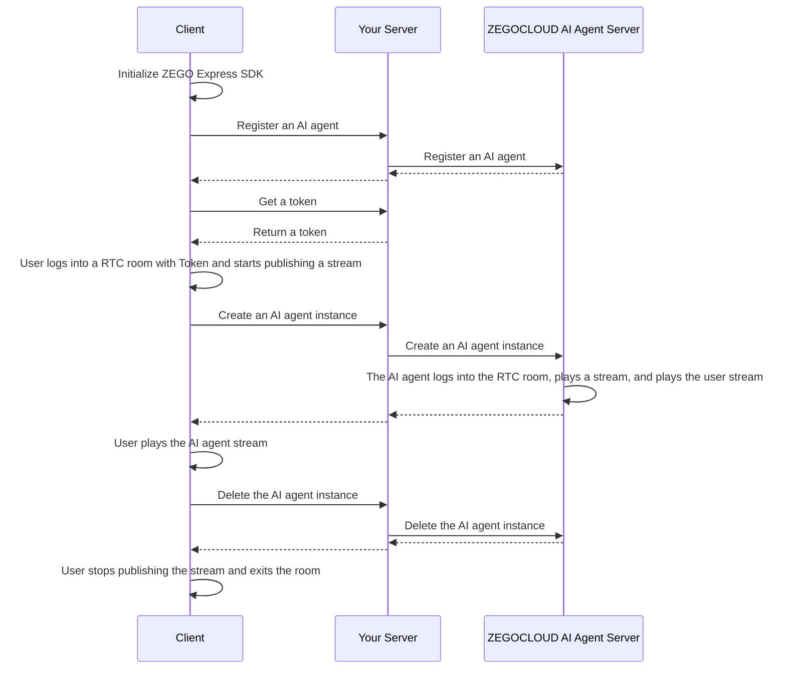

import {getPlatformData} from "/snippets/utils-content-parser.js"


export const expressSDKMap = {
  'Android': <a href='https://www.zegocloud.com/docs/voice-call/quick-start?platform=android&language=java#3' target='_blank'>ZEGO Express SDK</a>,
  'iOS': <a href='https://www.zegocloud.com/article/4121' target='_blank'>ZEGO Express SDK</a>,
  'Web': <a href='https://www.zegocloud.com/article/14138' target='_blank'>ZEGO Express SDK</a>,
}

# Quick Start
---

This document explains how to quickly integrate the client SDK (ZEGO Express SDK) and call ZEGOCLOUD AI Agent server API in your server to achieve voice interaction with an AI Agent.

## Prerequisites

- Create a project in the [ZEGOCLOUD Console](https://console.zegocloud.com/), and get its valid AppID and AppSign. For more details, please refer to Admin Console doc [How to view project info](https://www.zegocloud.com/docs/admin-console/view-project-information?platform=all&language=all).
- Contact ZEGOCLOUD technical support to activate the AI Agent service and obtain LLM and TTS configuration information.

:::if{props.platform="undefined|iOS"}
<div>
- Contact ZEGOCLOUD technical support to get the version of {getPlatformData(props,expressSDKMap)} that supports AI noise reduction and AI echo cancellation and integrate it.
</div>
:::
:::if{props.platform="Web"}
<div>
- Contact ZEGOCLOUD technical support to get the version of {getPlatformData(props,expressSDKMap)} that supports AI noise reduction and integrate it.
</div>
:::
- Deploy your server to call [ZEGOCLOUD AI Agent server APIs](/aiagent-server/accessing-server-apis) (you can refer to the server example code).
<Note title="Note">
Text-to-speech (TTS) service provider options:
- Bytedance: Volcano Engine.

For more details, please refer to the [TTS Parameters](/aiagent-server/common-parameter-description#tts).
</Note>

## Sample Codes

Listed below are the sample codes of core functionalities. You can refer to these sample codes to implement your own business logic.

<CardGroup cols={2}>
:::if{props.platform=undefined}
<Card title="Android Client Sample Code" href="https://github.com/ZEGOCLOUD/ai_agent_quick_start/tree/master/android" target="_blank">
Android client sample code. It includes basic capabilities such as such as logging into and out of RTC rooms, and publishing and playing streams.
</Card>
:::
:::if{props.platform="iOS"}
<Card title="iOS Client Sample Code" href="https://github.com/ZEGOCLOUD/ai_agent_quick_start/tree/master/ios" target="_blank">
iOS client sample code. It includes basic capabilities such as such as logging into and out of RTC rooms, and publishing and playing streams.
</Card>
:::
:::if{props.platform="Web"}
<Card title="Web Client Sample Code" href="https://github.com/ZEGOCLOUD/ai_agent_quick_start/tree/master/web" target="_blank">
Web client sample code. It includes basic capabilities such as such as logging into and out of RTC rooms, and publishing and playing streams.
</Card>
:::
<Card title="Server Sample Code"  href="https://github.com/ZEGOCLOUD/ai_agent_quick_start_server" target="_blank">
Server sample code. It encompasses core functionalities, including ZEGOCLOUD Token generation, AI agent registration, and instance management (creation and deletion).
</Card>
</CardGroup>

## Overall Business Process Diagram

You need to use the ZEGO Express SDK on the client side to implement real users entering the room and streaming. Then call the server API interface provided by AI Agent to implement adding the AI agent to the room and interacting in real-time with real users.


## Core Capability Implementation

<Steps>
<Step title="Initialize ZEGO Express SDK on the client side">

Here are the key steps to initialize the ZEGO Express SDK:

:::if{props.platform=undefined}
<div>
1. Open the file `app/src/main/AndroidManifest.xml`, and add the following code:
    ```xml AndroidManifest.xml
    <uses-permission android:name="android.permission.ACCESS_NETWORK_STATE" />
    <uses-permission android:name="android.permission.INTERNET" />
    <uses-permission android:name="android.permission.RECORD_AUDIO" /> 
    ```

2. Request the recording permission at runtime as follows:
    ```java
    private final ActivityResultLauncher<String> requestPermissionLauncher = registerForActivityResult(
        new ActivityResultContracts.RequestPermission(), new ActivityResultCallback<Boolean>() {
            @Override
            public void onActivityResult(Boolean isGranted) {
                if (isGranted) {
                    // Permission granted
                }
            }
        });
    // Initiate the request
    requestPermissionLauncher.launch(Manifest.permission.RECORD_AUDIO);
    ```
3. Create and initialize ZegoExpressEngine.
    ```java {3}
    ZegoEngineProfile zegoEngineProfile = new ZegoEngineProfile();
    zegoEngineProfile.appID = KeyCenter.appID;
    zegoEngineProfile.scenario = ZegoScenario.HIGH_QUALITY_CHATROOM; // Setting this scenario can avoid requesting camera permissions, and the integrator should set specific values according to their own business scenarios
    zegoEngineProfile.application = getApplication();
    ZegoExpressEngine.createEngine(zegoEngineProfile, null);
    ```

For more detailed instructions, please refer to [Import the SDK](https://www.zegocloud.com/docs/voice-call/quick-start?platform=android&language=java#3) and [Implement voice Call](https://www.zegocloud.com/docs/voice-call/quick-start?platform=android&language=java#4).
</div>
:::

:::if{props.platform="iOS"}
<div>
1. Declare necessary permissions in the file `Info.plist`:
    ```xml Info.plist
    <?xml version="1.0" encoding="UTF-8"?>
    <!DOCTYPE plist PUBLIC "-//Apple//DTD PLIST 1.0//EN" "http://www.apple.com/DTDs/PropertyList-1.0.dtd">
    <plist version="1.0">
    <dict>
        ...
        <key>UIBackgroundModes</key>
        <array>
            <string>audio</string>
        </array>
        <key>NSMicrophoneUsageDescription</key>
        <string>Need microphone access for voice chat</string>
    </dict>
    </plist>
    ```
2. Request the recording permission at runtime as follows:

    ```objectivec
    - (void)requestAudioPermission:(void(^)(BOOL granted))completion {
        /// Need to add a description of microphone usage in the project's Info.plist file
        AVAudioSession *audioSession = [AVAudioSession sharedInstance];
        [audioSession requestRecordPermission:^(BOOL granted) {
            dispatch_async(dispatch_get_main_queue(), ^{
                completion(granted);
            });
        }];
    }
    ```

3. Create and initialize ZegoExpressEngine.

    ```objectivec {4}
    -(void)initZegoExpressEngine{
        ZegoEngineProfile* profile = [[ZegoEngineProfile alloc]init];
        profile.appID = kZegoPassAppId;
        profile.scenario = ZegoScenarioHighQualityChatroom; // Setting this scenario can avoid requesting camera permissions, and the integrator should set specific values according to their own business scenarios
        
        [ZegoExpressEngine createEngineWithProfile:profile eventHandler:self];
    }
    ```
For more detailed instructions, please refer to [Integrating the SDK](https://www.zegocloud.com/article/4121) and [Implementing a basic voice call](https://www.zegocloud.com/docs/voice-call/implement-voice-call?platform=ios&language=objective-c).
</div>
:::

:::if{props.platform="Web"}
<div>
1. Load the AI noise reduction module.
2. Instantiate ZegoExpressEngine.
3. Check system requirements (WebRTC support and microphone permissions).
```javascript {7,9,11}
import { ZegoExpressEngine } from "zego-express-engine-webrtc";
import { VoiceChanger } from "zego-express-engine-webrtc/voice-changer";

const appID = 1234567 // Obtain from Zego Console
const server = 'xxx' // Obtain from Zego Console
// Load AI noise reduction module
ZegoExpressEngine.use(VoiceChanger);
// Instantiate ZegoExpressEngine with appId and server configurations
const zg = new ZegoExpressEngine(appID, server);
// Check system requirements
const checkSystemRequirements = async () => {
    // Detect WebRTC support
    const rtc_sup = await zg.checkSystemRequirements("webRTC");
    if (!rtc_sup.result) {
      // Browser does not support WebRTC
  }
    // Detect microphone permission status
    const mic_sup = await zg.checkSystemRequirements("microphone");
    if (!mic_sup.result) {
      // Microphone permission is not enabled
  }
}
checkSystemRequirements()
```

For more detailed instructions, please refer to [Integrating the SDK](https://www.zegocloud.com/article/14138) and [Implement a basic voice call](https://www.zegocloud.com/docs/voice-call/implement-voice-call?platform=web&language=javascript).
</div>
:::

</Step>

<Step title="Register an AI Agent">
[The registration of an AI agent](/aiagent-server/agent-configuration-management/register-agent) is to set up the basic configuration of the AI agent, including the AI agent name, LLM, TTS, ASR, etc. After registration, the AI agent can be used as a template to create multiple instances for interaction with multiple real users.

Generally, AI agents are fixed. Once the configuration is set, it will not change frequently. Therefore, it is recommended to register an AI agent when initializing the application or during other steps according to your needs.

<Note title="Note">An AI agent can only be registered once (with the same ID); if the same ID is registered twice, you will get the error code 410001008.</Note>

Below is an example of calling the **your server API** to register an AI agent:

:::if{props.platform=undefined}
<CodeGroup>
```java title="Client request to register an AI agent" {6-10}
public static void registerAgent(String agentId, String agentName) throws IOException {
    JSONObject json = new JSONObject();
    json.put("agent_id", agentId);
    json.put("agent_name", agentName);
    
    RequestBody body = RequestBody.create(json.toString(), JSON);
    Request request = new Request.Builder()
            .url(YOUR_SERVER_URL + "/api/agent/register") // YOUR_SERVER_URL is the address of your Your Server
            .post(body)
            .build();
    
    try (Response response = client.newCall(request).execute()) {
        System.out.println(response.body().string());
    }
}
```
```javascript title="Server implementation of agent registration"
// Note: process.env. reads values from environment variables. Please refer to the .env.example file in the server sample code.
async registerAgent(agentId: string, agentName: string) {
    if (!process.env.LLM_BASE_URL || !process.env.LLM_API_KEY || !process.env.LLM_MODEL) {
        throw new Error('LLM_BASE_URL, LLM_API_KEY and LLM_MODEL environment variables must be set');
    }
    // API request: https://aigc-aiagent-api.zegotech.cn?Action=RegisterAgent
    // Documentation: https://www.zegocloud.com/docs/aiagent-server/agent-configuration-management/register-agent
    const action = 'RegisterAgent';
    const body = {
        AgentId: agentId,
        Name: agentName,
        LLM: {
            Url: process.env.LLM_BASE_URL || "",
            ApiKey: process.env.LLM_API_KEY || "",
            Model: process.env.LLM_MODEL || "",
            // SystemPrompt: SYSTEM_PROMPT
        },
        TTS: {
            Vendor: "Bytedance",
            Params: {
                "app": {
                    "appid": process.env.TTS_BYTEDANCE_APP_ID || "",
                    "token": process.env.TTS_BYTEDANCE_TOKEN || "",
                    "cluster": process.env.TTS_BYTEDANCE_CLUSTER || ""
                },
                "audio": {
                    "voice_type": process.env.TTS_BYTEDANCE_VOICE_TYPE || ""
                }
            }
        }
    };
    // The sendRequest method encapsulates the URL and common parameters for requests. For details, see: https://www.zegocloud.com/docs/aiagent-server/accessing-server-apis
    return this.sendRequest<any>(action, body);
}
```
</CodeGroup>
:::

:::if{props.platform="iOS"}
<CodeGroup>
```swift title="Client request to register an AI agent" {2,7,8}
+ (void)registerAgentWithId:(NSString *)agentId name:(NSString *)agentName {
    NSURL *url = [NSURL URLWithString:[kBaseUrl stringByAppendingString:@"/api/agent/register"]]; // kBaseUrl is your Your Server address
    NSMutableURLRequest *request = [NSMutableURLRequest requestWithURL:url];
    [request setHTTPMethod:@"POST"];
    [request setValue:@"application/json" forHTTPHeaderField:@"Content-Type"];
    NSDictionary *body = @{
        @"agent_id": agentId,
        @"agent_name": agentName
    };
    NSError *error;
    NSData *bodyData = [NSJSONSerialization dataWithJSONObject:body 
                                                       options:0 
                                                         error:&error];
    if (error) {
        NSLog(@"JSON serialization error: %@", error);
        return;
    }
    [request setHTTPBody:bodyData];
    NSURLSession *session = [NSURLSession sharedSession];
    NSURLSessionDataTask *task = [session dataTaskWithRequest:request 
                                            completionHandler:^(NSData *data, NSURLResponse *response, NSError *error) {
        if (error) {
            NSLog(@"Error: %@", error);
            return;
        }
        NSHTTPURLResponse *httpResponse = (NSHTTPURLResponse *)response;
        if (httpResponse.statusCode == 200) {
            NSError *jsonError;
            NSDictionary *json = [NSJSONSerialization JSONObjectWithData:data 
                                                                 options:0 
                                                                   error:&jsonError];
            if (jsonError) {
                NSLog(@"JSON parsing error: %@", jsonError);
                return;
            }
            
            NSLog(@"Agent registration successful: %@", json);
        } else {
            NSLog(@"Request failed, status code: %ld", (long)httpResponse.statusCode);
        }
    }];
    
    [task resume];
}
```
```javascript title="Server implementation of agent registration"
// Note: process.env. reads values from environment variables. Please refer to the .env.example file in the server example code.
async registerAgent(agentId: string, agentName: string) {
    if (!process.env.LLM_BASE_URL || !process.env.LLM_API_KEY || !process.env.LLM_MODEL) {
        throw new Error('LLM_BASE_URL, LLM_API_KEY and LLM_MODEL environment variables must be set');
    }
    // Request interface: https://aigc-aiagent-api.zegotech.cn?Action=RegisterAgent
    // Documentation: https://www.zegocloud.com/docs/aiagent-server/agent-configuration-management/register-agent
    const action = 'RegisterAgent';
    const body = {
        AgentId: agentId,
        Name: agentName,
        LLM: {
            Url: process.env.LLM_BASE_URL || "",
            ApiKey: process.env.LLM_API_KEY || "",
            Model: process.env.LLM_MODEL || "",
            // SystemPrompt: SYSTEM_PROMPT
        },
        TTS: {
            Vendor: "Bytedance",
            Params: {
                "app": {
                    "appid": process.env.TTS_BYTEDANCE_APP_ID || "",
                    "token": process.env.TTS_BYTEDANCE_TOKEN || "",
                    "cluster": process.env.TTS_BYTEDANCE_CLUSTER || ""
                },
                "audio": {
                    "voice_type": process.env.TTS_BYTEDANCE_VOICE_TYPE || ""
                }
            }
        }
    };
    // The sendRequest method encapsulates the URL and common parameters for requests. For details, see: https://www.zegocloud.com/docs/aiagent-server/accessing-server-apis
    return this.sendRequest<any>(action, body);
}
```
</CodeGroup>
:::

:::if{props.platform="Web"}
<CodeGroup>
```javascript title="Client request to register an AI agent" {3,8-11}
async function registerAgent(agentId, agentName) {
  try {
    const response = await fetch(`${YOUR_SERVER_URL}/api/agent/register`, { // YOUR_SERVER_URL is the address of your Your Server
      method: 'POST',
      headers: {
        'Content-Type': 'application/json',
      },
      body: JSON.stringify({
        agent_id: agentId,
        agent_name: agentName
      }),
    });
    
    const data = await response.json();
    console.log('Register AI Agent result:', data);
    return data;
  } catch (error) {
    console.error('Failed to register AI Agent:', error);
    throw error;
  }
}
```
```javascript title="Server implementation of agent registration"
// Note: process.env. reads values from environment variables. Please refer to the .env.example file in the server example code.
async registerAgent(agentId: string, agentName: string) {
    if (!process.env.LLM_BASE_URL || !process.env.LLM_API_KEY || !process.env.LLM_MODEL) {
        throw new Error('LLM_BASE_URL, LLM_API_KEY and LLM_MODEL environment variables must be set');
    }
    // Request interface: https://aigc-aiagent-api.zegotech.cn?Action=RegisterAgent
    // Documentation: https://www.zegocloud.com/docs/aiagent-server/agent-configuration-management/register-agent
    const action = 'RegisterAgent';
    const body = {
        AgentId: agentId,
        Name: agentName,
        LLM: {
            Url: process.env.LLM_BASE_URL || "",
            ApiKey: process.env.LLM_API_KEY || "",
            Model: process.env.LLM_MODEL || "",
            // SystemPrompt: SYSTEM_PROMPT
        },
        TTS: {
            Vendor: "Bytedance",
            Params: {
                "app": {
                    "appid": process.env.TTS_BYTEDANCE_APP_ID || "",
                    "token": process.env.TTS_BYTEDANCE_TOKEN || "",
                    "cluster": process.env.TTS_BYTEDANCE_CLUSTER || ""
                },
                "audio": {
                    "voice_type": process.env.TTS_BYTEDANCE_VOICE_TYPE || ""
                }
            }
        }
    };
    // The sendRequest method encapsulates the Request endpoint and common parameters. For details, see: https://www.zegocloud.com/docs/aiagent-server/accessing-server-apis
    return this.sendRequest<any>(action, body);
}
```
</CodeGroup>
:::
<Note title="Note">
- Please ensure all TTS parameters are correctly filled according to the TTS service provider's official documentation, otherwise you may not hear the AI agent's voice output.
- If the AI agent cannot output voice, first check if the TTS parameter configuration is completely correct, or refer to [Get AI Agent Status - Listen for Server Exception Events](./Guides/Get%20AI%20Agent%20status.mdx#listen-for-server-exception-events) to identify the specific issue.
</Note>
</Step>
<Step title="User logs in a RTC room and starts publishing a stream">
After a real user logs into the room, they start publishing streams. 

:::if{props.platform="undefined|iOS"}
<Note title="Note">
In this scenario, AI noise reduction and AI echo cancellation should be enabled to achieve better results.
</Note>
:::
:::if{props.platform="Web"}
<Note title="Note">
In this scenario, AI noise reduction should be enabled to achieve better results.
</Note>
:::

The token used for login needs to be obtained from the your server; please refer to the complete sample code.

<Note title="Note">
Please ensure that the roomID, userID, and streamID are unique under one ZEGOCLOUD APPID.
- roomID: Generated by the user according to their own rules, it will be used to log into the Express SDK room. Only numbers, English characters, and '~', '!', '@', '#', '$', '%', '^', '&', '*', '(', ')', '_', '+', '=', '-', '`', ';', '’', ',', '.', '\<', '\>', '\' are supported. If interoperability with the Web SDK is required, do not use '%'.
- userID: Length should not exceed 32 bytes. Only numbers, English characters, and '~', '!', '@', '#', '$', '%', '^', '&', '*', '(', ')', '_', '+', '=', '-', '`', ';', '’', ',', '.', '\<', '\>', '\' are supported. If interoperability with the Web SDK is required, do not use '%'.
- streamID: Length should not exceed 256 bytes. Only numbers, English characters, and '-', '_' are supported.
</Note>

:::if{props.platform=undefined}
```java title="Client request to login to room and publish a stream" {5,6,12-17,25,30}
private void loginRoom(String agentId, String userId, String userName, String token,
    IZegoRoomLoginCallback callback) {
    ZegoEngineConfig config = new ZegoEngineConfig();
    HashMap<String, String> advanceConfig = new HashMap<String, String>();
    advanceConfig.put("set_audio_volume_ducking_mode", "1");
    advanceConfig.put("enable_rnd_volume_adaptive", "true");
    config.advancedConfig = advanceConfig;
    ZegoExpressEngine.setEngineConfig(config);
    ZegoExpressEngine.getEngine().setRoomScenario(ZegoScenario.HIGH_QUALITY_CHATROOM);
    ZegoExpressEngine.getEngine().setAudioDeviceMode(ZegoAudioDeviceMode.GENERAL);

    // Enable AI noise suppression and AI echo cancellation
    ZegoExpressEngine.getEngine().enableAEC(true);
    ZegoExpressEngine.getEngine().setAECMode(ZegoAECMode.AI_AGGRESSIVE);
    ZegoExpressEngine.getEngine().enableAGC(true);
    ZegoExpressEngine.getEngine().enableANS(true);
    ZegoExpressEngine.getEngine().setANSMode(ZegoANSMode.AI_BALANCED);

    ZegoRoomConfig roomConfig = new ZegoRoomConfig();
    roomConfig.isUserStatusNotify = true;
    roomConfig.token = token;

    String roomId = generateRoomID(agentId);
    ZegoExpressEngine.getEngine()
        .loginRoom(roomId, new ZegoUser(userId, userName), roomConfig, (errorCode, extendedData) -> {
            Timber.d(
                "loginRoom() called with: errorCode = [" + errorCode + "], extendedData = [" + extendedData + "]");
            if (errorCode == 0) {
                String userSteamID = generateUserStreamID(agentId, userId);
                ZegoExpressEngine.getEngine().startPublishingStream(userSteamID);
                ZegoExpressEngine.getEngine().muteMicrophone(false);
            }
            if (callback != null) {
                callback.onRoomLoginResult(errorCode, extendedData);
            }

        });
}
```
:::
:::if{props.platform="iOS"}
```swift title="Client request to login to the room and publish a stream" {9-11,17,20-24,35}
// Record the agent
self.streamToPlay = [self getAgentStreamID];

ZegoEngineConfig* engineConfig = [[ZegoEngineConfig alloc] init];
engineConfig.advancedConfig = @{
    @"set_audio_dump_mode":@1,// Cancel the file size limit for recording
    @"notify_remote_device_unknown_status": @"true",
    @"notify_remote_device_init_status":@"true",
    @"enforce_audio_loopback_in_sync": @"true", /** This configuration is used for response delay optimization and requires the corresponding version of ZegoExpressEngine SDK. Please contact ZEGOCLOUD support **/
    @"set_audio_volume_ducking_mode":@1,/** This configuration is used for volume ducking **/
    @"enable_rnd_volume_adaptive":@"true",/** This configuration is used for adaptive playback volume **/
};
[ZegoExpressEngine setEngineConfig:engineConfig];

// This setting only affects AEC (echo cancellation). Here we set it to ModeGeneral, which uses our proprietary echo cancellation algorithm, giving us more control.
// If other options are selected, it might use the system's echo cancellation, which may work better on iPhones but could be less effective on some Android devices.
[[ZegoExpressEngine sharedEngine] setAudioDeviceMode:ZegoAudioDeviceModeGeneral];

// Note: Enabling AI noise reduction and AI echo cancellation requires contacting ZEGOCLOUD technical support to obtain the corresponding ZegoExpressionEngine.xcframework, as versions with these capabilities have not yet been released.
[[ZegoExpressEngine sharedEngine] enableAGC:TRUE];
[[ZegoExpressEngine sharedEngine] enableAEC:TRUE];
[[ZegoExpressEngine sharedEngine] setAECMode:ZegoAECModeAIAggressive];
[[ZegoExpressEngine sharedEngine] enableANS:TRUE];
[[ZegoExpressEngine sharedEngine] setANSMode:ZegoANSModeAIBalanced];

// Login to the room
[self loginRoom:^(int errorCode, NSDictionary *extendedData) {
    if (errorCode!=0) {
        NSString* errorMsg =[NSString stringWithFormat:@"Failed to enter voice room:%d", errorCode];
        completion(NO, errorMsg);
        return;
    }
    
    // Start publishing stream after entering the room
    [self startPushlishStream];
}];
```
:::
:::if{props.platform="Web"}
```javascript title="Client request to login to the room and publish a stream" {22-25}
const userId = "" // User ID for logging into the Express SDK room
const roomId = "" // RTC Room ID
const userStreamId = "" // User stream push ID
async function enterRoom() {
  try {
    // Generate RTC Token [Reference Documentation] (https://www.zegocloud.com/docs/video-call/token?platform=web&language=javascript)
    const token = await Api.getToken();
    // Login to the room
    await zg.loginRoom(roomId, token, {
      userID: userId,
      userName: "",
    });

    // Create a local audio stream
    const localStream = await zg.createZegoStream({
      camera: {
        video: false,
        audio: true,
      },
    });
    if (localStream) {
      // Push the local stream
      await zg.startPublishingStream(userStreamId, localStream);
      // Enable AI noise reduction (requires a specially packaged ZEGO Express SDK)
      const enableResult = await zg.enableAiDenoise(localStream, true);
      if (enableResult.errorCode === 0) {
        return zg.setAiDenoiseMode(localStream, 1);
      }
    }
  } catch (error) {
    console.error("Failed to enter the room:", error);
    throw error;
  }
}
enterRoom()
```
:::
</Step>
<Step title="Create an AI agent instance">
You can [create multiple AI agent instances](/aiagent-server/agent-instance-management/create-agent-instance) based on the previously registered AI agent. AI agent instances can join different rooms and interact in real-time with different users.

After creation, an AI agent instance will automatically log into a RTC room and publish a stream, while also playing the real user stream.

After successfully an AI agent instance is created, real users can listen for stream change events and play the remote stream to interact in real-time with the AI agent.

Below is an example of calling the **your server method** to create an AI agent instance:
:::if{props.platform=undefined}
<CodeGroup>
```java title="Client request to create an AI agent instance interface" {12-15}
public static void createAgentInstance(String agentId, String roomId, String userId, String userStreamId, 
                             String agentStreamId, String agentUserId) throws IOException {
    JSONObject json = new JSONObject();
    json.put("agent_id", agentId);
    json.put("room_id", roomId);
    json.put("user_id", userId);
    json.put("user_stream_id", userStreamId);
    json.put("agent_stream_id", agentStreamId);
    json.put("agent_user_id", agentUserId);
    
    RequestBody body = RequestBody.create(json.toString(), JSON);
    Request request = new Request.Builder()
            .url(YOUR_SERVER_URL + "/api/agent/create") // YOUR_SERVER_URL is the address of your Your Server
            .post(body)
            .build();
    
    try (Response response = client.newCall(request).execute()) {
        // Example of returned data: {code: 0, agent_instance_id: "new_instance_id", message: 'create agent instance success'}
        // agent_instance_id is used to delete the agent instance
        System.out.println(response.body().string());
    }
}
```
```java title="Client request to play the AI agent stream" {12-19}
// Set up the event handler
void setEventHandler() {
        engine.setEventHandler(new IZegoEventHandler() {
            @Override
            // When other users in the room start/stop publishing streams, you can receive notifications about the corresponding user's audio/video stream changes here
            public void onRoomStreamUpdate(String roomID, ZegoUpdateType updateType, ArrayList<ZegoStream> streamList, JSONObject extendedData) {
                super.onRoomStreamUpdate(roomID, updateType, streamList, extendedData);
                // When updateType is ZegoUpdateType.ADD, it means there is a new audio/video stream, at this time you can call the startPlayingStream interface to play this audio/video stream
                if (updateType == ZegoUpdateType.ADD) {
                    // Start playing the stream, set the remote stream rendering view, using the SDK's default view mode, proportionally scaled to fill the entire View
                    ZegoStream stream = streamList.get(0);
                    // Check if it's the AI agent stream
                    if (stream.streamID.equals(agentStreamID)) {
                        // remoteUserView below is the TextureView on the UI interface
                        ZegoCanvas playCanvas = new ZegoCanvas(findViewById(R.id.remoteUserView));
                        ZegoExpressEngine.getEngine().startPlayingStream(agentStreamID, playCanvas);
                    }
                }
            }
        });
}
```
</CodeGroup>
:::
:::if{props.platform="iOS"}
<CodeGroup>
```swift title="Client call to create an agent instance interface" {7,12-19}
+ (void)createAgentWithId:(NSString *)agentId
                   roomId:(NSString *)roomId
                   userId:(NSString *)userId
             userStreamId:(NSString *)userStreamId
           agentStreamId:(NSString *)agentStreamId
             agentUserId:(NSString *)agentUserId {
    NSURL *url = [NSURL URLWithString:[kBaseUrl stringByAppendingString:@"/api/agent/create"]]; // kBaseUrl is the address of your Your Server
    NSMutableURLRequest *request = [NSMutableURLRequest requestWithURL:url];
    [request setHTTPMethod:@"POST"];
    [request setValue:@"application/json" forHTTPHeaderField:@"Content-Type"];
    
    NSDictionary *body = @{
        @"agent_id": agentId,
        @"room_id": roomId,
        @"user_id": userId,
        @"user_stream_id": userStreamId,
        @"agent_stream_id": agentStreamId,
        @"agent_user_id": agentUserId
    };
    
    NSError *error;
    NSData *bodyData = [NSJSONSerialization dataWithJSONObject:body 
                                                       options:0 
                                                         error:&error];
    if (error) {
        NSLog(@"JSON serialization error: %@", error);
        return;
    }
    
    [request setHTTPBody:bodyData];
    
    NSURLSession *session = [NSURLSession sharedSession];
    NSURLSessionDataTask *task = [session dataTaskWithRequest:request 
                                            completionHandler:^(NSData *data, NSURLResponse *response, NSError *error) {
        if (error) {
            NSLog(@"Error: %@", error);
            return;
        }
        
        NSHTTPURLResponse *httpResponse = (NSHTTPURLResponse *)response;
        if (httpResponse.statusCode == 200) {
            NSError *jsonError;
            NSDictionary *json = [NSJSONSerialization JSONObjectWithData:data 
                                                                 options:0 
                                                                   error:&jsonError];
            if (jsonError) {
                NSLog(@"JSON parsing error: %@", jsonError);
                return;
            }
            
            NSLog(@"Agent instance created successfully: %@", json);
        } else {
            NSLog(@"Request failed, status code: %ld", (long)httpResponse.statusCode);
        }
    }];
    
    [task resume];
}
```
```objectivec title="Client request to play the AI agent stream" {12}
// Listen for room stream information update status, and play the AI agent's stream
- (void)onRoomStreamUpdate:(ZegoUpdateType)updateType
                streamList:(NSArray<ZegoStream *> *)streamList
              extendedData:(nullable NSDictionary *)extendedData
                    roomID:(NSString *)roomID{    
    if (updateType == ZegoUpdateTypeAdd) {
        for (int i=0; i<streamList.count; i++) {
            ZegoStream* item = [streamList objectAtIndex:i];
            
            if ([item.streamID isEqualToString: self.streamToPlay]) {
                NSLog(@"Matched the target stream, preparing to play: streamID=%@", self.streamToPlay);
                [self startPlayStream:self.streamToPlay];
                break;
            }
        }
    } else if(updateType == ZegoUpdateTypeDelete) {
        for (int i=0; i<streamList.count; i++) {
            ZegoStream* item = [streamList objectAtIndex:i];
            [[ZegoExpressEngine sharedEngine] stopPlayingStream:item.streamID];
        }
    }
}
```
</CodeGroup>
:::
:::if{props.platform="Web"}
<CodeGroup>
```javascript title="Client-side call to create an agent instance interface" {3,8-16}
async function createAgentInstance(agentId, roomId, userId, userStreamId, agentStreamId, agentUserId, messages = []) {
  try {
    const response = await fetch(`${YOUR_SERVER_URL}/api/agent/create`, { // YOUR_SERVER_URL is the address of your Your Server
      method: 'POST',
      headers: {
        'Content-Type': 'application/json',
      },
      body: JSON.stringify({
        agent_id: agentId,
        room_id: roomId,
        user_id: userId,
        user_stream_id: userStreamId,
        agent_stream_id: agentStreamId,
        agent_user_id: agentUserId,
        messages: messages
      }),
    });
    
    const data = await response.json();
    console.log('Create AI Agent instance result:', data);
    return data;
  } catch (error) {
    console.error('Failed to create AI Agent instance:', error);
    throw error;
  }
}

```
```javascript title="Client request to play the AI agent stream" {9}
// Listen to remote stream update events
function setupEvent() {
  zg.on("roomStreamUpdate",
    async (roomID, updateType, streamList) => {
      if (updateType === "ADD" && streamList.length > 0) {
        try {
          for (const stream of streamList) {
            // Play the AI agent stream
            const mediaStream = await zg.startPlayingStream(stream.streamID);
            if (!mediaStream) return;
            const remoteView = await zg.createRemoteStreamView(mediaStream);
            if (remoteView) {
             // A container with the id 'remoteSteamView' is required on the page to receive the AI agent stream [Reference Documentation]（https://www.zegocloud.com/article/api?doc=Express_Video_SDK_API~javascript_web~class~ZegoStreamView）
              remoteView.play("remoteSteamView", {
                enableAutoplayDialog: false,
              });
            }
          }
        } catch (error) {
          console.error("Failed to pull stream:", error);
        }
      }
    }
  );
}
```
</CodeGroup>
:::
```javascript title="Server-side implementation of agent instance creation"
async createAgentInstance(agentId: string, userId: string, rtcInfo: RtcInfo, messages?: any[]) {
    // Request interface: https://aigc-aiagent-api.zegotech.cn?Action=CreateAgentInstance
    // Documentation: https://www.zegocloud.com/docs/aiagent-server/agent-instance-management/create-agent-instance
    const action = 'CreateAgentInstance';
    const body = {
        AgentId: agentId,
        UserId: userId,
        RTC: rtcInfo,
        MessageHistory: {
            SyncMode: 1, // Change to 0 to use history messages from ZIM
            Messages: messages && messages.length > 0 ? messages : [],
            WindowSize: 10
        }
    };
    // The sendRequest method encapsulates the Request endpoint and common parameters. For more details, refer to: https://www.zegocloud.com/docs/aiagent-server/accessing-server-apis
    const result = await this.sendRequest<any>(action, body);
    console.log("create agent instance result", result);
    return result.AgentInstanceId;
}
```

**Congratulations**🎉! 

After completing this step, you have successfully created an instance of an agent that can interact in real-time with real users. You can ask the agent any question by voice, and the agent will answer your questions by voice!
</Step>
<Step title="Delete the agent instance and the user exits the room">

If you [delete the agent instance](/aiagent-server/agent-instance-management/delete-agent-instance), the agent instance will automatically exit the room and stop stream publishing. After the user stops stream publishing and exits the room, a complete interaction ends.

Below is an example of calling the Your Server interface to delete the agent instance:
:::if{props.platform=undefined}
<CodeGroup>
```java title="Client call to delete agent instance interface" {6-10,14,15}
// agentInstanceId is returned by the create agent instance interface
public static void deleteAgentInstance(String agentInstanceId) throws IOException {
    JSONObject json = new JSONObject();
    json.put("agent_instance_id", agentInstanceId);
    
    RequestBody body = RequestBody.create(json.toString(), JSON);
    Request request = new Request.Builder()
            .url(YOUR_SERVER_URL + "/api/agent/delete") // YOUR_SERVER_URL is your Your Server address
            .post(body)
            .build();
    
    try (Response response = client.newCall(request).execute()) {
        System.out.println(response.body().string());
        ZegoExpressEngine.getEngine().logoutRoom();
        ZegoExpressEngine.destroyEngine(null);
    }
}
```
```javascript title="Server-side implementation of agent instance deletion"
async deleteAgentInstance(agentInstanceId: string) {
    // Request interface: https://aigc-aiagent-api.zegotech.cn?Action=DeleteAgentInstance
    // Documentation: https://www.zegocloud.com/docs/aiagent-server/agent-instance-management/delete-agent-instance
    const action = 'DeleteAgentInstance';
    const body = {
        AgentInstanceId: agentInstanceId
    };
    // The sendRequest method encapsulates the Request endpoint and common parameters. For more details, refer to: https://www.zegocloud.com/docs/aiagent-server/accessing-server-apis
    return this.sendRequest(action, body);
}
```
</CodeGroup>
:::
:::if{props.platform="iOS"}
<CodeGroup>
```swift title="Client call to delete AI agent instance interface" {4,8-10,43-46}
// agentInstanceId is returned from the create AI agent instance interface
// Delete AI Agent instance
+ (void)deleteAgentWithInstanceId:(NSString *)agentInstanceId {
    NSURL *url = [NSURL URLWithString:[kBaseUrl stringByAppendingString:@"/api/agent/delete"]]; // kBaseUrl is your Your Server address
    NSMutableURLRequest *request = [NSMutableURLRequest requestWithURL:url];
    [request setHTTPMethod:@"POST"];
    [request setValue:@"application/json" forHTTPHeaderField:@"Content-Type"];
    NSDictionary *body = @{
        @"agent_instance_id": agentInstanceId
    };
    NSError *error;
    NSData *bodyData = [NSJSONSerialization dataWithJSONObject:body 
                                                       options:0 
                                                         error:&error];
    if (error) {
        NSLog(@"JSON serialization error: %@", error);
        return;
    }
    [request setHTTPBody:bodyData];
    NSURLSession *session = [NSURLSession sharedSession];
    NSURLSessionDataTask *task = [session dataTaskWithRequest:request 
                                            completionHandler:^(NSData *data, NSURLResponse *response, NSError *error) {
        if (error) {
            NSLog(@"Error: %@", error);
            return;
        }
        NSHTTPURLResponse *httpResponse = (NSHTTPURLResponse *)response;
        if (httpResponse.statusCode == 200) {
            NSError *jsonError;
            NSDictionary *json = [NSJSONSerialization JSONObjectWithData:data 
                                                                 options:0 
                                                                   error:&jsonError];
            if (jsonError) {
                NSLog(@"JSON parsing error: %@", jsonError);
                return;
            }
            
            NSLog(@"Delete Agent instance successful: %@", json);
            if ([ZegoExpressEngine sharedEngine] == nil) {
                return;
            }
    
            [[ZegoExpressEngine sharedEngine] stopPlayingStream:self.streamToPlay];
            [[ZegoExpressEngine sharedEngine] stopPublishingStream];
            [[ZegoExpressEngine sharedEngine] logoutRoomWithCallback:nil];
            [ZegoExpressEngine destroyEngine:nil];
        } else {
            NSLog(@"Request failed, status code: %ld", (long)httpResponse.statusCode);
        }
    }];
    
    [task resume];
}
```
```javascript Server-side implementation of agent instance deletion
async deleteAgentInstance(agentInstanceId: string) {
    // Request interface: https://aigc-aiagent-api.zegotech.cn?Action=DeleteAgentInstance
    // Documentation: https://www.zegocloud.com/docs/aiagent-server/agent-instance-management/delete-agent-instance
    const action = 'DeleteAgentInstance';
    const body = {
        AgentInstanceId: agentInstanceId
    };
    // The sendRequest method encapsulates the Request endpoint and common parameters. For more details, refer to: https://www.zegocloud.com/docs/aiagent-server/accessing-server-apis
    return this.sendRequest(action, body);
}
```
</CodeGroup>
:::
:::if{props.platform="Web"}
<CodeGroup>
```javascript title="Client-side call to delete an agent instance interface" {4,10,17-22}
// agentInstanceId is returned from the create agent instance interface
async function deleteAgentInstance(agentInstanceId) {
  try {
    const response = await fetch(`${YOUR_SERVER_URL}/api/agent/delete`, { // YOUR_SERVER_URL is your Your Server address
      method: 'POST',
      headers: {
        'Content-Type': 'application/json',
      },
      body: JSON.stringify({
        agent_instance_id: agentInstanceId
      }),
    });
    
    const data = await response.json();
    console.log('Delete AI Agent instance result:', data);

    // Destroy local stream
    await zg.destroyStream(localStream);
    // Exit room
    await zg.logoutRoom(roomId);
    // Destroy Express engine
    zg.destroyEngine();
  } catch (error) {
    console.error('Failed to delete AI Agent instance:', error);
    throw error;
  }
}
```
```javascript title="Server-side implementation of agent instance deletion"
async deleteAgentInstance(agentInstanceId: string) {
    // Request interface: https://aigc-aiagent-api.zegotech.cn?Action=DeleteAgentInstance
    // Documentation: https://www.zegocloud.com/docs/aiagent-server/agent-instance-management/delete-agent-instance
    const action = 'DeleteAgentInstance';
    const body = {
        AgentInstanceId: agentInstanceId
    };
    // The sendRequest method encapsulates the Request endpoint and common parameters. For details, refer to: https://www.zegocloud.com/docs/aiagent-server/accessing-server-apis
    return this.sendRequest(action, body);
}
```
</CodeGroup>
:::
</Step>
</Steps>

This is the complete core process for you to achieve real-time voice interaction with an AI agent.