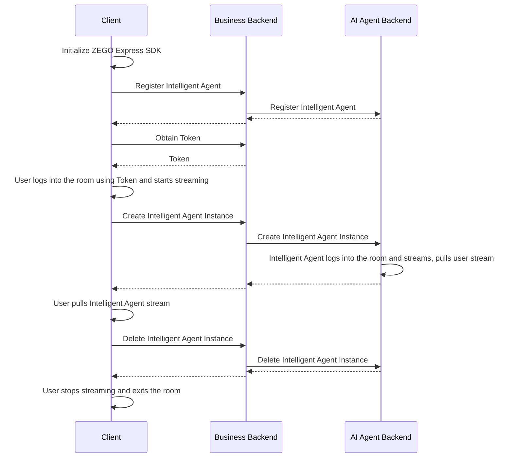

import {getPlatformData} from "/snippets/utils-content-parser.js"


export const expressSDKMap = {
  'Android': <a href='https://www.zegocloud.com/docs/voice-call/quick-start?platform=android&language=java#3' target='_blank'>ZEGO Express SDK</a>,
  'iOS': <a href='https://www.zegocloud.com/article/4121' target='_blank'>ZEGO Express SDK</a>,
  'Web': <a href='https://www.zegocloud.com/article/14138' target='_blank'>ZEGO Express SDK</a>,
}

# Quick Start
---

This document explains how to quickly integrate the client-side SDK (ZEGO Express SDK) and call AI Agent-related backend interfaces in your business backend to achieve voice interaction with the AI Agent.

## Prerequisites

- A project has been created in the [ZEGOCLOUD Console](https://console.zegocloud.com/) and a valid AppID and AppSign have been applied for. For more details, please refer to [CHow to view project info - Admin Console ](https://www.zegocloud.com/docs/admin-console/view-project-information?platform=all&language=all).
- Contact ZEGOCLOUD technical support to activate AI Agent-related services and obtain LLM and TTS configuration information.
- {getPlatformData(props,expressSDKMap)} that supports AI noise reduction and AI echo cancellation has already been integrated.
- The business backend has been deployed and implemented to call AI Agent-related server APIs (you can refer to the server example code).
<Note title="Note">
Text-to-speech (TTS) service provider. Options: Bytedance: Volcano Engine.

For more details, please refer to the [TTS Parameters](/en/aiagent-server/common-parameter-description#tts) documentation.
</Note>
<Warning title="Attention">Please contact ZEGOCLOUD technical support to get the version of ZEGO Express SDK that supports AI noise reduction and AI echo cancellation, and enable AI noise reduction and AI echo cancellation during integration for better voice interaction results.</Warning>

## Example Code
Below is the example code required to implement core functionalities. You can refer to this example code to implement your own business logic.

<CardGroup cols={2}>
:::if{props.platform=undefined}
<Card title="Android Client Example Code" href="https://github.com/ZEGOCLOUD/ai_agent_quick_start/tree/master/android" target="_blank">
Android client example code. It includes the most basic capabilities such as login, streaming, pulling streams, and exiting the room.
</Card>
:::
:::if{props.platform="iOS"}
<Card title="iOS Client Example Code" href="https://github.com/ZEGOCLOUD/ai_agent_quick_start/tree/master/ios" target="_blank">
iOS client example code. It includes the most basic capabilities such as login, streaming, pulling streams, and exiting the room.
</Card>
:::
:::if{props.platform="Web"}
<Card title="Web Client Example Code" href="https://github.com/ZEGOCLOUD/ai_agent_quick_start/tree/master/web" target="_blank">
Web client example code. It includes the most basic capabilities such as login, streaming, pulling streams, and exiting the room.
</Card>
:::
<Card title="Server Example Code"  href="https://github.com/ZEGOCLOUD/ai_agent_quick_start_server" target="_blank">
Server example code. It includes the most basic capabilities such as obtaining ZEGOCLOUD Token, registering an intelligent agent, creating an intelligent agent instance, and deleting an intelligent agent instance.
</Card>
</CardGroup>

## Overall Business Process Diagram

You need to use the ZEGO Express SDK on the client side to implement real users entering the room and streaming. Then call the server API interface provided by AI Agent to implement adding the intelligent agent to the room and interacting in real-time with real users.


## Core Competency Implementation


<Steps>
<Step title="Initialize ZEGO Express SDK on the client side">

Here are the key steps to initialize the ZEGO Express SDK:

:::if{props.platform=undefined}
1 Add permission declaration

Enter the “app/src/main” directory, open the “AndroidManifest.xml” file, and add permissions.
```xml AndroidManifest.xml
<uses-permission android:name="android.permission.ACCESS_NETWORK_STATE" />
<uses-permission android:name="android.permission.INTERNET" />
<uses-permission android:name="android.permission.RECORD_AUDIO" /> 
```
2 Request recording permission at runtime
```java
private final ActivityResultLauncher<String> requestPermissionLauncher = registerForActivityResult(
    new ActivityResultContracts.RequestPermission(), new ActivityResultCallback<Boolean>() {
        @Override
        public void onActivityResult(Boolean isGranted) {
            if (isGranted) {
                // Permission granted
            }
        }
    });
// Initiate request
requestPermissionLauncher.launch(Manifest.permission.RECORD_AUDIO);
```
3 Create and initialize ZegoExpressEngine
```java {3}
ZegoEngineProfile zegoEngineProfile = new ZegoEngineProfile();
zegoEngineProfile.appID = KeyCenter.appID;
zegoEngineProfile.scenario = ZegoScenario.HIGH_QUALITY_CHATROOM;
zegoEngineProfile.application = getApplication();
ZegoExpressEngine.createEngine(zegoEngineProfile, null);
```

For more detailed instructions, please refer to [Import the SDK](https://www.zegocloud.com/docs/voice-call/quick-start?platform=android&language=java#3) and [Implement voice Call](https://www.zegocloud.com/docs/voice-call/quick-start?platform=android&language=java#4).
:::

:::if{props.platform="iOS"}
1 Declare necessary permissions in the Info.plist file

```xml Info.plist
<?xml version="1.0" encoding="UTF-8"?>
<!DOCTYPE plist PUBLIC "-//Apple//DTD PLIST 1.0//EN" "http://www.apple.com/DTDs/PropertyList-1.0.dtd">
<plist version="1.0">
<dict>
    ...
    <key>UIBackgroundModes</key>
    <array>
        <string>audio</string>
    </array>
    <key>NSMicrophoneUsageDescription</key>
    <string>Need microphone access for voice chat</string>
</dict>
</plist>
```
2 Request recording permission at runtime

```objectivec
- (void)requestAudioPermission:(void(^)(BOOL granted))completion {
    /// Need to add a description of microphone usage in the project's Info.plist file
    AVAudioSession *audioSession = [AVAudioSession sharedInstance];
    [audioSession requestRecordPermission:^(BOOL granted) {
        dispatch_async(dispatch_get_main_queue(), ^{
            completion(granted);
        });
    }];
}
```

3 Create and initialize ZegoExpressEngine

```objectivec {4}
-(void)initZegoExpressEngine{
    ZegoEngineProfile* profile = [[ZegoEngineProfile alloc]init];
    profile.appID = kZegoPassAppId;
    profile.scenario = ZegoScenarioHighQualityChatroom; // Setting this scenario can avoid requesting camera permissions, and the integrator should set specific values according to their own business scenarios
    
    [ZegoExpressEngine createEngineWithProfile:profile eventHandler:self];
}
```
For more detailed instructions, please refer to [Integrating the SDK](https://www.zegocloud.com/article/4121) and [Implementing a basic voice call](https://www.zegocloud.com/docs/voice-call/implement-voice-call?platform=ios&language=objective-c).
:::

:::if{props.platform="Web"}
1 Load the AI noise reduction module

2 Instantiate ZegoExpressEngine

3 Check system requirements (WebRTC support and microphone permissions)
```javascript {7,9,11}
import { ZegoExpressEngine } from "zego-express-engine-webrtc";
import { VoiceChanger } from "zego-express-engine-webrtc/voice-changer";

const appID = 1234567 // Obtain from Zego Console
const server = 'xxx' // Obtain from Zego Console
// Load AI noise reduction module
ZegoExpressEngine.use(VoiceChanger);
// Instantiate ZegoExpressEngine with appId and server configurations
const zg = new ZegoExpressEngine(appID, server);
// Check system requirements
const checkSystemRequirements = async () => {
    // Detect WebRTC support
    const rtc_sup = await zg.checkSystemRequirements("webRTC");
    if (!rtc_sup.result) {
      // Browser does not support WebRTC
  }
    // Detect microphone permission status
    const mic_sup = await zg.checkSystemRequirements("microphone");
    if (!mic_sup.result) {
      // Microphone permission is not enabled
  }
}
checkSystemRequirements()
```
For more detailed instructions, please refer to [Integrating the SDK](https://www.zegocloud.com/article/14138) and [Implementing Audio Call](https://www.zegocloud.com/docs/voice-call/implement-voice-call?platform=web&language=javascript).

:::

</Step>

<Step title="Register Intelligent Agent">
The registration of an intelligent agent is used to set up the basic configuration of the agent, including configurations related to the agent name, LLM, TTS, ASR, etc. After registration, the agent can be used as a template to create multiple instances for interaction with multiple real users.

Intelligent agents are usually relatively fixed; once the relevant parameters (persona image) of the agent are set, they will not be changed frequently. Therefore, it is recommended to register the agent when initializing the application or during other steps according to the needs of the business process.

<Note title="Note">An intelligent agent can only be registered once (with the same ID); if registered repeatedly, error code 410001008 will be returned.</Note>

Below is an example of calling the business backend interface to register an intelligent agent:

```plaintext
[Your original code or API call example here]
``` 

Let me know if you need further translation for the code or additional parts!

:::if{props.platform=undefined}
<CodeGroup>
```java title="Client call to register agent interface" {6-10}
public static void registerAgent(String agentId, String agentName) throws IOException {
    JSONObject json = new JSONObject();
    json.put("agent_id", agentId);
    json.put("agent_name", agentName);
    
    RequestBody body = RequestBody.create(json.toString(), JSON);
    Request request = new Request.Builder()
            .url(YOUR_SERVER_URL + "/api/agent/register") // YOUR_SERVER_URL is the address of your business backend
            .post(body)
            .build();
    
    try (Response response = client.newCall(request).execute()) {
        System.out.println(response.body().string());
    }
}
```
```javascript title="Server-side implementation of agent registration logic"
// Note: process.env. reads values from environment variables. Please refer to the .env.example file in the server example code.
async registerAgent(agentId: string, agentName: string) {
    if (!process.env.LLM_BASE_URL || !process.env.LLM_API_KEY || !process.env.LLM_MODEL) {
        throw new Error('LLM_BASE_URL, LLM_API_KEY and LLM_MODEL environment variables must be set');
    }
    // API request: https://aigc-aiagent-api.zegotech.cn?Action=RegisterAgent
    // Documentation: https://doc-zh.zego.im/aiagent-server/agent-configuration-management/register-agent
    const action = 'RegisterAgent';
    const body = {
        AgentId: agentId,
        Name: agentName,
        LLM: {
            Url: process.env.LLM_BASE_URL || "",
            ApiKey: process.env.LLM_API_KEY || "",
            Model: process.env.LLM_MODEL || "",
            // SystemPrompt: SYSTEM_PROMPT
        },
        TTS: {
            Vendor: "Bytedance",
            Params: {
                "app": {
                    "appid": process.env.TTS_BYTEDANCE_APP_ID || "",
                    "token": process.env.TTS_BYTEDANCE_TOKEN || "",
                    "cluster": process.env.TTS_BYTEDANCE_CLUSTER || ""
                },
                "speed_ratio": 1,
                "volume_ratio": 1,
                "pitch_ratio": 1,
                "emotion": "happy",
                "audio": {
                    "rate": 24000,
                    "voice_type": process.env.TTS_BYTEDANCE_VOICE_TYPE || ""
                }
            },
            FilterText: [{ BeginCharacters: "(", EndCharacters: ")" }, { BeginCharacters: "（", EndCharacters: "）" }, { BeginCharacters: "{", EndCharacters: "}" }],
        }
    };
    // The sendRequest method encapsulates the URL and common parameters for requests. For details, see: https://doc-zh.zego.im/aiagent-server/accessing-server-apis
    return this.sendRequest<any>(action, body);
}
```
</CodeGroup>
:::

:::if{props.platform="iOS"}
<CodeGroup>
```swift title="Client call to register agent interface" {2,7,8}
+ (void)registerAgentWithId:(NSString *)agentId name:(NSString *)agentName {
    NSURL *url = [NSURL URLWithString:[kBaseUrl stringByAppendingString:@"/api/agent/register"]]; // kBaseUrl is your business backend address
    NSMutableURLRequest *request = [NSMutableURLRequest requestWithURL:url];
    [request setHTTPMethod:@"POST"];
    [request setValue:@"application/json" forHTTPHeaderField:@"Content-Type"];
    NSDictionary *body = @{
        @"agent_id": agentId,
        @"agent_name": agentName
    };
    NSError *error;
    NSData *bodyData = [NSJSONSerialization dataWithJSONObject:body 
                                                       options:0 
                                                         error:&error];
    if (error) {
        NSLog(@"JSON serialization error: %@", error);
        return;
    }
    [request setHTTPBody:bodyData];
    NSURLSession *session = [NSURLSession sharedSession];
    NSURLSessionDataTask *task = [session dataTaskWithRequest:request 
                                            completionHandler:^(NSData *data, NSURLResponse *response, NSError *error) {
        if (error) {
            NSLog(@"Error: %@", error);
            return;
        }
        NSHTTPURLResponse *httpResponse = (NSHTTPURLResponse *)response;
        if (httpResponse.statusCode == 200) {
            NSError *jsonError;
            NSDictionary *json = [NSJSONSerialization JSONObjectWithData:data 
                                                                 options:0 
                                                                   error:&jsonError];
            if (jsonError) {
                NSLog(@"JSON parsing error: %@", jsonError);
                return;
            }
            
            NSLog(@"Agent registration successful: %@", json);
        } else {
            NSLog(@"Request failed, status code: %ld", (long)httpResponse.statusCode);
        }
    }];
    
    [task resume];
}
```
```javascript title="Server-side implementation of register agent logic"
// Note: process.env. reads values from environment variables. Please refer to the .env.example file in the server example code.
async registerAgent(agentId: string, agentName: string) {
    if (!process.env.LLM_BASE_URL || !process.env.LLM_API_KEY || !process.env.LLM_MODEL) {
        throw new Error('LLM_BASE_URL, LLM_API_KEY and LLM_MODEL environment variables must be set');
    }
    // Request interface: https://aigc-aiagent-api.zegotech.cn?Action=RegisterAgent
    // Documentation: https://doc-zh.zego.im/aiagent-server/agent-configuration-management/register-agent
    const action = 'RegisterAgent';
    const body = {
        AgentId: agentId,
        Name: agentName,
        LLM: {
            Url: process.env.LLM_BASE_URL || "",
            ApiKey: process.env.LLM_API_KEY || "",
            Model: process.env.LLM_MODEL || "",
            // SystemPrompt: SYSTEM_PROMPT
        },
        TTS: {
            Vendor: "Bytedance",
            Params: {
                "app": {
                    "appid": process.env.TTS_BYTEDANCE_APP_ID || "",
                    "token": process.env.TTS_BYTEDANCE_TOKEN || "",
                    "cluster": process.env.TTS_BYTEDANCE_CLUSTER || ""
                },
                "speed_ratio": 1,
                "volume_ratio": 1,
                "pitch_ratio": 1,
                "emotion": "happy",
                "audio": {
                    "rate": 24000,
                    "voice_type": process.env.TTS_BYTEDANCE_VOICE_TYPE || ""
                }
            },
            FilterText: [{ BeginCharacters: "(", EndCharacters: ")" }, { BeginCharacters: "（", EndCharacters: "）" }, { BeginCharacters: "{", EndCharacters: "}" }],
        }
    };
    // The sendRequest method encapsulates the URL and common parameters for requests. For details, see: https://doc-zh.zego.im/aiagent-server/accessing-server-apis
    return this.sendRequest<any>(action, body);
}
```
</CodeGroup>
:::

:::if{props.platform="Web"}
<CodeGroup>
```javascript title="Client-side call to the agent registration interface" {3,8-11}
async function registerAgent(agentId, agentName) {
  try {
    const response = await fetch(`${YOUR_SERVER_URL}/api/agent/register`, { // YOUR_SERVER_URL is the address of your business backend
      method: 'POST',
      headers: {
        'Content-Type': 'application/json',
      },
      body: JSON.stringify({
        agent_id: agentId,
        agent_name: agentName
      }),
    });
    
    const data = await response.json();
    console.log('Register AI Agent result:', data);
    return data;
  } catch (error) {
    console.error('Failed to register AI Agent:', error);
    throw error;
  }
}
```
```javascript title="Server-side implementation of agent registration logic"
// Note: process.env. reads values from environment variables. Please refer to the .env.example file in the server example code.
async registerAgent(agentId: string, agentName: string) {
    if (!process.env.LLM_BASE_URL || !process.env.LLM_API_KEY || !process.env.LLM_MODEL) {
        throw new Error('LLM_BASE_URL, LLM_API_KEY and LLM_MODEL environment variables must be set');
    }
    // Request interface: https://aigc-aiagent-api.zegotech.cn?Action=RegisterAgent
    // Documentation: https://doc-zh.zego.im/aiagent-server/agent-configuration-management/register-agent
    const action = 'RegisterAgent';
    const body = {
        AgentId: agentId,
        Name: agentName,
        LLM: {
            Url: process.env.LLM_BASE_URL || "",
            ApiKey: process.env.LLM_API_KEY || "",
            Model: process.env.LLM_MODEL || "",
            // SystemPrompt: SYSTEM_PROMPT
        },
        TTS: {
            Vendor: "Bytedance",
            Params: {
                "app": {
                    "appid": process.env.TTS_BYTEDANCE_APP_ID || "",
                    "token": process.env.TTS_BYTEDANCE_TOKEN || "",
                    "cluster": process.env.TTS_BYTEDANCE_CLUSTER || ""
                },
                "speed_ratio": 1,
                "volume_ratio": 1,
                "pitch_ratio": 1,
                "emotion": "happy",
                "audio": {
                    "rate": 24000,
                    "voice_type": process.env.TTS_BYTEDANCE_VOICE_TYPE || ""
                }
            },
            FilterText: [{ BeginCharacters: "(", EndCharacters: ")" }, { BeginCharacters: "（", EndCharacters: "）" }, { BeginCharacters: "{", EndCharacters: "}" }],
        }
    };
    // The sendRequest method encapsulates the request URL and common parameters. For details, see: https://doc-zh.zego.im/aiagent-server/accessing-server-apis
    return this.sendRequest<any>(action, body);
}
```
</CodeGroup>
:::

</Step>
<Step title="User enters the room and starts streaming">
After a real user logs into the room, they start streaming. Note that in this scenario, AI noise reduction and AI echo cancellation should be enabled to achieve better results.
The token used for login needs to be obtained from the business backend; please refer to the complete example code.

<Note title="Note">
Please ensure that the roomID, userID, and streamID are unique under one ZEGOCLOUD APPID.
- roomID: Generated by the user according to their own rules, it will be used to log into the Express SDK room. Only numbers, English characters, and '~', '!', '@', '#', '$', '%', '^', '&', '*', '(', ')', '_', '+', '=', '-', '`', ';', '’', ',', '.', '\<', '\>', '\' are supported. If interoperability with the Web SDK is required, do not use '%'.
- userID: Length should not exceed 32 bytes. Only numbers, English characters, and '~', '!', '@', '#', '$', '%', '^', '&', '*', '(', ')', '_', '+', '=', '-', '`', ';', '’', ',', '.', '\<', '\>', '\' are supported. If interoperability with the Web SDK is required, do not use '%'.
- streamID: Length should not exceed 256 bytes. Only numbers, English characters, and '-', '_' are supported.
</Note>

:::if{props.platform=undefined}
```java title="Client login to room and publish stream" {5,6,12-17,25,30}
private void loginRoom(String agentId, String userId, String userName, String token,
    IZegoRoomLoginCallback callback) {
    ZegoEngineConfig config = new ZegoEngineConfig();
    HashMap<String, String> advanceConfig = new HashMap<String, String>();
    advanceConfig.put("set_audio_volume_ducking_mode", "1");
    advanceConfig.put("enable_rnd_volume_adaptive", "true");
    config.advancedConfig = advanceConfig;
    ZegoExpressEngine.setEngineConfig(config);
    ZegoExpressEngine.getEngine().setRoomScenario(ZegoScenario.HIGH_QUALITY_CHATROOM);
    ZegoExpressEngine.getEngine().setAudioDeviceMode(ZegoAudioDeviceMode.GENERAL);

    // Enable AI noise suppression and AI echo cancellation
    ZegoExpressEngine.getEngine().enableAEC(true);
    ZegoExpressEngine.getEngine().setAECMode(ZegoAECMode.AI_AGGRESSIVE);
    ZegoExpressEngine.getEngine().enableAGC(true);
    ZegoExpressEngine.getEngine().enableANS(true);
    ZegoExpressEngine.getEngine().setANSMode(ZegoANSMode.AI_BALANCED);

    ZegoRoomConfig roomConfig = new ZegoRoomConfig();
    roomConfig.isUserStatusNotify = true;
    roomConfig.token = token;

    String roomId = generateRoomID(agentId);
    ZegoExpressEngine.getEngine()
        .loginRoom(roomId, new ZegoUser(userId, userName), roomConfig, (errorCode, extendedData) -> {
            Timber.d(
                "loginRoom() called with: errorCode = [" + errorCode + "], extendedData = [" + extendedData + "]");
            if (errorCode == 0) {
                String userSteamID = generateUserStreamID(agentId, userId);
                ZegoExpressEngine.getEngine().startPublishingStream(userSteamID);
                ZegoExpressEngine.getEngine().muteMicrophone(false);
            }
            if (callback != null) {
                callback.onRoomLoginResult(errorCode, extendedData);
            }

        });
}
```
:::
:::if{props.platform="iOS"}
```swift title="Client login to the room and publish stream" {9-11,17,20-24,35}
// Record the agent
self.streamToPlay = [self getAgentStreamID];

ZegoEngineConfig* engineConfig = [[ZegoEngineConfig alloc] init];
engineConfig.advancedConfig = @{
    @"set_audio_dump_mode":@1,// Cancel the file size limit for recording
    @"notify_remote_device_unknown_status": @"true",
    @"notify_remote_device_init_status":@"true",
    @"enforce_audio_loopback_in_sync": @"true", /** This configuration is used for response delay optimization and requires the corresponding version of ZegoExpressEngine SDK. Please contact ZEGOCLOUD support **/
    @"set_audio_volume_ducking_mode":@1,/** This configuration is used for volume ducking **/
    @"enable_rnd_volume_adaptive":@"true",/** This configuration is used for adaptive playback volume **/
};
[ZegoExpressEngine setEngineConfig:engineConfig];

// This setting only affects AEC (echo cancellation). Here we set it to ModeGeneral, which uses our proprietary echo cancellation algorithm, giving us more control.
// If other options are selected, it might use the system's echo cancellation, which may work better on iPhones but could be less effective on some Android devices.
[[ZegoExpressEngine sharedEngine] setAudioDeviceMode:ZegoAudioDeviceModeGeneral];

// Note: Enabling AI noise reduction and AI echo cancellation requires contacting ZEGOCLOUD technical support to obtain the corresponding ZegoExpressionEngine.xcframework, as versions with these capabilities have not yet been released.
[[ZegoExpressEngine sharedEngine] enableAGC:TRUE];
[[ZegoExpressEngine sharedEngine] enableAEC:TRUE];
[[ZegoExpressEngine sharedEngine] setAECMode:ZegoAECModeAIAggressive];
[[ZegoExpressEngine sharedEngine] enableANS:TRUE];
[[ZegoExpressEngine sharedEngine] setANSMode:ZegoANSModeAIBalanced];

// Login to the room
[self loginRoom:^(int errorCode, NSDictionary *extendedData) {
    if (errorCode!=0) {
        NSString* errorMsg =[NSString stringWithFormat:@"Failed to enter voice room:%d", errorCode];
        completion(NO, errorMsg);
        return;
    }
    
    // Start publishing stream after entering the room
    [self startPushlishStream];
}];
```
:::
:::if{props.platform="Web"}
```javascript title="Client login to the room and push stream" {22-25}
const userId = "" // User ID for logging into the Express SDK room
const roomId = "" // RTC Room ID
const userStreamId = "" // User stream push ID
async function enterRoom() {
  try {
    // Generate RTC Token [Reference Documentation] (https://doc-zh.zego.im/article/7646)
    const token = await Api.getToken();
    // Login to the room
    await zg.loginRoom(roomId, token, {
      userID: userId,
      userName: "",
    });

    // Create a local audio stream
    const localStream = await zg.createZegoStream({
      camera: {
        video: false,
        audio: true,
      },
    });
    if (localStream) {
      // Push the local stream
      await zg.startPublishingStream(userStreamId, localStream);
      // Enable AI noise reduction (requires a specially packaged ZEGO Express SDK)
      const enableResult = await zg.enableAiDenoise(localStream, true);
      if (enableResult.errorCode === 0) {
        return zg.setAiDenoiseMode(localStream, 1);
      }
    }
  } catch (error) {
    console.error("Failed to enter the room:", error);
    throw error;
  }
}
enterRoom()
```
:::
</Step>
<Step title="Create an agent instance">
Multiple agent instances can be created using a registered agent as a template to join different rooms and interact in real-time with different users. After creating an agent instance, it will automatically log into the room and push streams, while also pulling streams from real users.

After successfully creating an agent instance, real users can listen for stream change events and pull streams to interact in real-time with the agent.

Below is an example of calling the business backend interface to create an agent instance:
:::if{props.platform=undefined}
<CodeGroup>
```java title="Client call to create an agent instance interface" {12-15}
public static void createAgentInstance(String agentId, String roomId, String userId, String userStreamId, 
                             String agentStreamId, String agentUserId) throws IOException {
    JSONObject json = new JSONObject();
    json.put("agent_id", agentId);
    json.put("room_id", roomId);
    json.put("user_id", userId);
    json.put("user_stream_id", userStreamId);
    json.put("agent_stream_id", agentStreamId);
    json.put("agent_user_id", agentUserId);
    
    RequestBody body = RequestBody.create(json.toString(), JSON);
    Request request = new Request.Builder()
            .url(YOUR_SERVER_URL + "/api/agent/create") // YOUR_SERVER_URL is the address of your business backend
            .post(body)
            .build();
    
    try (Response response = client.newCall(request).execute()) {
        // Example of returned data: {code: 0, agent_instance_id: "new_instance_id", message: 'create agent instance success'}
        // agent_instance_id is used to delete the agent instance
        System.out.println(response.body().string());
    }
}
``````java 客户端拉智能体的流 {12-19}
// 监听回调
void setEventHandler() {
        engine.setEventHandler(new IZegoEventHandler() {
            @Override
            // 房间内其他用户推流/停止推流时，我们会在这里收到相应用户的音视频流增减的通知
            public void onRoomStreamUpdate(String roomID, ZegoUpdateType updateType, ArrayList<ZegoStream> streamList, JSONObject extendedData) {
                super.onRoomStreamUpdate(roomID, updateType, streamList, extendedData);
                //当 updateType 为 ZegoUpdateType.ADD 时，代表有音视频流新增，此时我们可以调用 startPlayingStream 接口拉取播放该音视频流
                if (updateType == ZegoUpdateType.ADD) {
                    // 开始拉流，设置远端拉流渲染视图，视图模式采用 SDK 默认的模式，等比缩放填充整个 View
                    ZegoStream stream = streamList.get(0);
                    // 判断是否是智能体流
                    if (stream.streamID.equals(agentStreamID)) {
                        // 如下 remoteUserView 为 UI 界面上的 TextureView.
                        ZegoCanvas playCanvas = new ZegoCanvas(findViewById(R.id.remoteUserView));
                        ZegoExpressEngine.getEngine().startPlayingStream(agentStreamID, playCanvas);
                    }
                }
            }
        });
}
```
```javascript title="Server-side implementation of creating an agent instance logic"
async createAgentInstance(agentId: string, userId: string, rtcInfo: RtcInfo, messages?: any[]) {
    // Request interface: https://aigc-aiagent-api.zegotech.cn?Action=CreateAgentInstance
    // Documentation: https://doc-zh.zego.im/aiagent-server/agent-instance-management/create-agent-instance
    const action = 'CreateAgentInstance';
    const body = {
        AgentId: agentId,
        UserId: userId,
        RTC: rtcInfo,
        MessageHistory: {
            SyncMode: 1, // Change to 0 to use history messages from ZIM
            Messages: messages && messages.length > 0 ? messages : [],
            WindowSize: 10
        }
    };
    // The sendRequest method encapsulates the request URL and common parameters. For more details, refer to: https://doc-zh.zego.im/aiagent-server/accessing-server-apis
    const result = await this.sendRequest<any>(action, body);
    console.log("create agent instance result", result);
    return result.AgentInstanceId;
}
```
</CodeGroup>
:::
:::if{props.platform="iOS"}
<CodeGroup>
```swift title="Client call to create an agent instance interface" {7,12-19}
+ (void)createAgentWithId:(NSString *)agentId
                   roomId:(NSString *)roomId
                   userId:(NSString *)userId
             userStreamId:(NSString *)userStreamId
           agentStreamId:(NSString *)agentStreamId
             agentUserId:(NSString *)agentUserId {
    NSURL *url = [NSURL URLWithString:[kBaseUrl stringByAppendingString:@"/api/agent/create"]]; // kBaseUrl is the address of your business backend
    NSMutableURLRequest *request = [NSMutableURLRequest requestWithURL:url];
    [request setHTTPMethod:@"POST"];
    [request setValue:@"application/json" forHTTPHeaderField:@"Content-Type"];
    
    NSDictionary *body = @{
        @"agent_id": agentId,
        @"room_id": roomId,
        @"user_id": userId,
        @"user_stream_id": userStreamId,
        @"agent_stream_id": agentStreamId,
        @"agent_user_id": agentUserId
    };
    
    NSError *error;
    NSData *bodyData = [NSJSONSerialization dataWithJSONObject:body 
                                                       options:0 
                                                         error:&error];
    if (error) {
        NSLog(@"JSON serialization error: %@", error);
        return;
    }
    
    [request setHTTPBody:bodyData];
    
    NSURLSession *session = [NSURLSession sharedSession];
    NSURLSessionDataTask *task = [session dataTaskWithRequest:request 
                                            completionHandler:^(NSData *data, NSURLResponse *response, NSError *error) {
        if (error) {
            NSLog(@"Error: %@", error);
            return;
        }
        
        NSHTTPURLResponse *httpResponse = (NSHTTPURLResponse *)response;
        if (httpResponse.statusCode == 200) {
            NSError *jsonError;
            NSDictionary *json = [NSJSONSerialization JSONObjectWithData:data 
                                                                 options:0 
                                                                   error:&jsonError];
            if (jsonError) {
                NSLog(@"JSON parsing error: %@", jsonError);
                return;
            }
            
            NSLog(@"Agent instance created successfully: %@", json);
        } else {
            NSLog(@"Request failed, status code: %ld", (long)httpResponse.statusCode);
        }
    }];
    
    [task resume];
}
```

```objectivec Client pulls the intelligent agent's stream {12}
// Listen for room stream information update status, pull and play the intelligent agent's stream
- (void)onRoomStreamUpdate:(ZegoUpdateType)updateType
                streamList:(NSArray<ZegoStream *> *)streamList
              extendedData:(nullable NSDictionary *)extendedData
                    roomID:(NSString *)roomID{    
    if (updateType == ZegoUpdateTypeAdd) {
        for (int i=0; i<streamList.count; i++) {
            ZegoStream* item = [streamList objectAtIndex:i];
            
            if ([item.streamID isEqualToString: self.streamToPlay]) {
                NSLog(@"Matched the target stream, preparing to play: streamID=%@", self.streamToPlay);
                [self startPlayStream:self.streamToPlay];
                break;
            }
        }
    } else if(updateType == ZegoUpdateTypeDelete) {
        for (int i=0; i<streamList.count; i++) {
            ZegoStream* item = [streamList objectAtIndex:i];
            [[ZegoExpressEngine sharedEngine] stopPlayingStream:item.streamID];
        }
    }
}
```
```javascript Server-side implementation of creating an agent instance logic
async createAgentInstance(agentId: string, userId: string, rtcInfo: RtcInfo, messages?: any[]) {
    // Request interface: https://aigc-aiagent-api.zegotech.cn?Action=CreateAgentInstance
    // Documentation: https://doc-zh.zego.im/aiagent-server/agent-instance-management/create-agent-instance
    const action = 'CreateAgentInstance';
    const body = {
        AgentId: agentId,
        UserId: userId,
        RTC: rtcInfo,
        MessageHistory: {
            SyncMode: 1, // Change to 0 to use history messages from ZIM
            Messages: messages && messages.length > 0 ? messages : [],
            WindowSize: 10
        }
    };
    // The sendRequest method encapsulates the request URL and common parameters. For more details, refer to: https://doc-zh.zego.im/aiagent-server/accessing-server-apis
    const result = await this.sendRequest<any>(action, body);
    console.log("create agent instance result", result);
    return result.AgentInstanceId;
}
```
</CodeGroup>
:::
:::if{props.platform="Web"}
<CodeGroup>
```javascript title="Client-side call to create an agent instance interface" {3,8-16}
async function createAgentInstance(agentId, roomId, userId, userStreamId, agentStreamId, agentUserId, messages = []) {
  try {
    const response = await fetch(`${YOUR_SERVER_URL}/api/agent/create`, { // YOUR_SERVER_URL is the address of your business backend
      method: 'POST',
      headers: {
        'Content-Type': 'application/json',
      },
      body: JSON.stringify({
        agent_id: agentId,
        room_id: roomId,
        user_id: userId,
        user_stream_id: userStreamId,
        agent_stream_id: agentStreamId,
        agent_user_id: agentUserId,
        messages: messages
      }),
    });
    
    const data = await response.json();
    console.log('Create AI Agent instance result:', data);
    return data;
  } catch (error) {
    console.error('Failed to create AI Agent instance:', error);
    throw error;
  }
}

```
```javascript title="Client pulls the intelligent agent stream" {9}
// Listen to remote stream update events
function setupEvent() {
  zg.on("roomStreamUpdate",
    async (roomID, updateType, streamList) => {
      if (updateType === "ADD" && streamList.length > 0) {
        try {
          for (const stream of streamList) {
            // Pull the intelligent agent stream
            const mediaStream = await zg.startPlayingStream(stream.streamID);
            if (!mediaStream) return;
            const remoteView = await zg.createRemoteStreamView(mediaStream);
            if (remoteView) {
             // A container with the id 'remoteSteamView' is required on the page to receive the intelligent agent stream [Reference Documentation]（https://doc-zh.zego.im/article/api?doc=Express_Video_SDK_API~javascript_web~class~ZegoStreamView）
              remoteView.play("remoteSteamView", {
                enableAutoplayDialog: false,
              });
            }
          }
        } catch (error) {
          console.error("Failed to pull stream:", error);
        }
      }
    }
  );
}
```
```javascript title="Server-side implementation of creating an agent instance logic"
async createAgentInstance(agentId: string, userId: string, rtcInfo: RtcInfo, messages?: any[]) {
    // Request interface: https://aigc-aiagent-api.zegotech.cn?Action=CreateAgentInstance
    // Documentation: https://doc-zh.zego.im/aiagent-server/agent-instance-management/create-agent-instance
    const action = 'CreateAgentInstance';
    const body = {
        AgentId: agentId,
        UserId: userId,
        RTC: rtcInfo,
        MessageHistory: {
            SyncMode: 1, // Change to 0 to use history messages from ZIM
            Messages: messages && messages.length > 0 ? messages : [],
            WindowSize: 10
        }
    };
    // The sendRequest method encapsulates the request URL and common parameters. For more details, refer to: https://doc-zh.zego.im/aiagent-server/accessing-server-apis
    const result = await this.sendRequest<any>(action, body);
    console.log("create agent instance result", result);
    return result.AgentInstanceId;
}
```
</CodeGroup>
:::
Congratulations 🎉! After completing this step, you have successfully created an instance of an agent that can interact in real-time with real users. You can ask the agent any question by voice, and the agent will answer your questions by voice!
</Step>
<Step title="User exits the room and deletes the agent instance">
After deleting the agent instance, the agent instance will automatically exit the room and stop streaming. After the user stops streaming and exits the room, a complete interaction ends.

Below is an example of calling the business backend interface to delete the agent instance:
:::if{props.platform=undefined}
<CodeGroup>
```java title="Client call to delete agent instance interface" {6-10,14,15}
// agentInstanceId is returned by the create agent instance interface
public static void deleteAgentInstance(String agentInstanceId) throws IOException {
    JSONObject json = new JSONObject();
    json.put("agent_instance_id", agentInstanceId);
    
    RequestBody body = RequestBody.create(json.toString(), JSON);
    Request request = new Request.Builder()
            .url(YOUR_SERVER_URL + "/api/agent/delete") // YOUR_SERVER_URL is your business backend address
            .post(body)
            .build();
    
    try (Response response = client.newCall(request).execute()) {
        System.out.println(response.body().string());
        ZegoExpressEngine.getEngine().logoutRoom();
        ZegoExpressEngine.destroyEngine(null);
    }
}
```
```javascript title="Server-side implementation of deleting an agent instance logic"
async deleteAgentInstance(agentInstanceId: string) {
    // Request interface: https://aigc-aiagent-api.zegotech.cn?Action=DeleteAgentInstance
    // Documentation: https://doc-zh.zego.im/aiagent-server/agent-instance-management/delete-agent-instance
    const action = 'DeleteAgentInstance';
    const body = {
        AgentInstanceId: agentInstanceId
    };
    // The sendRequest method encapsulates the request URL and common parameters. For more details, refer to: https://doc-zh.zego.im/aiagent-server/accessing-server-apis
    return this.sendRequest(action, body);
}
```
</CodeGroup>
:::
:::if{props.platform="iOS"}
<CodeGroup>
```swift title="Client call to delete AI agent instance interface" {4,8-10,43-46}
// agentInstanceId is returned from the create AI agent instance interface
// 3. Delete AI Agent instance
+ (void)deleteAgentWithInstanceId:(NSString *)agentInstanceId {
    NSURL *url = [NSURL URLWithString:[kBaseUrl stringByAppendingString:@"/api/agent/delete"]]; // kBaseUrl is your business backend address
    NSMutableURLRequest *request = [NSMutableURLRequest requestWithURL:url];
    [request setHTTPMethod:@"POST"];
    [request setValue:@"application/json" forHTTPHeaderField:@"Content-Type"];
    NSDictionary *body = @{
        @"agent_instance_id": agentInstanceId
    };
    NSError *error;
    NSData *bodyData = [NSJSONSerialization dataWithJSONObject:body 
                                                       options:0 
                                                         error:&error];
    if (error) {
        NSLog(@"JSON serialization error: %@", error);
        return;
    }
    [request setHTTPBody:bodyData];
    NSURLSession *session = [NSURLSession sharedSession];
    NSURLSessionDataTask *task = [session dataTaskWithRequest:request 
                                            completionHandler:^(NSData *data, NSURLResponse *response, NSError *error) {
        if (error) {
            NSLog(@"Error: %@", error);
            return;
        }
        NSHTTPURLResponse *httpResponse = (NSHTTPURLResponse *)response;
        if (httpResponse.statusCode == 200) {
            NSError *jsonError;
            NSDictionary *json = [NSJSONSerialization JSONObjectWithData:data 
                                                                 options:0 
                                                                   error:&jsonError];
            if (jsonError) {
                NSLog(@"JSON parsing error: %@", jsonError);
                return;
            }
            
            NSLog(@"Delete Agent instance successful: %@", json);
            if ([ZegoExpressEngine sharedEngine] == nil) {
                return;
            }
    
            [[ZegoExpressEngine sharedEngine] stopPlayingStream:self.streamToPlay];
            [[ZegoExpressEngine sharedEngine] stopPublishingStream];
            [[ZegoExpressEngine sharedEngine] logoutRoomWithCallback:nil];
            [ZegoExpressEngine destroyEngine:nil];
        } else {
            NSLog(@"Request failed, status code: %ld", (long)httpResponse.statusCode);
        }
    }];
    
    [task resume];
}
```
```javascript Server-side implementation of deleting an agent instance logic
async deleteAgentInstance(agentInstanceId: string) {
    // Request interface: https://aigc-aiagent-api.zegotech.cn?Action=DeleteAgentInstance
    // Documentation: https://doc-zh.zego.im/aiagent-server/agent-instance-management/delete-agent-instance
    const action = 'DeleteAgentInstance';
    const body = {
        AgentInstanceId: agentInstanceId
    };
    // The sendRequest method encapsulates the request URL and common parameters. For more details, refer to: https://doc-zh.zego.im/aiagent-server/accessing-server-apis
    return this.sendRequest(action, body);
}
```
</CodeGroup>
:::
:::if{props.platform="Web"}
<CodeGroup>
```javascript title="Client-side call to delete an agent instance interface" {4,10,17-22}
// agentInstanceId is returned from the create agent instance interface
async function deleteAgentInstance(agentInstanceId) {
  try {
    const response = await fetch(`${YOUR_SERVER_URL}/api/agent/delete`, { // YOUR_SERVER_URL is your business backend address
      method: 'POST',
      headers: {
        'Content-Type': 'application/json',
      },
      body: JSON.stringify({
        agent_instance_id: agentInstanceId
      }),
    });
    
    const data = await response.json();
    console.log('Delete AI Agent instance result:', data);

    // Destroy local stream
    await zg.destroyStream(localStream);
    // Exit room
    await zg.logoutRoom(roomId);
    // Destroy Express engine
    zg.destroyEngine();
  } catch (error) {
    console.error('Failed to delete AI Agent instance:', error);
    throw error;
  }
}
```
```javascript title="Server-side implementation of deleting an agent instance logic"
async deleteAgentInstance(agentInstanceId: string) {
    // Request interface: https://aigc-aiagent-api.zegotech.cn?Action=DeleteAgentInstance
    // Documentation: https://doc-zh.zego.im/aiagent-server/agent-instance-management/delete-agent-instance
    const action = 'DeleteAgentInstance';
    const body = {
        AgentInstanceId: agentInstanceId
    };
    // The sendRequest method encapsulates the request URL and common parameters. For details, refer to: https://doc-zh.zego.im/aiagent-server/accessing-server-apis
    return this.sendRequest(action, body);
}
```
</CodeGroup>
:::
</Step>
</Steps>

This is the complete core process for you to achieve real-time voice interaction with an agent.