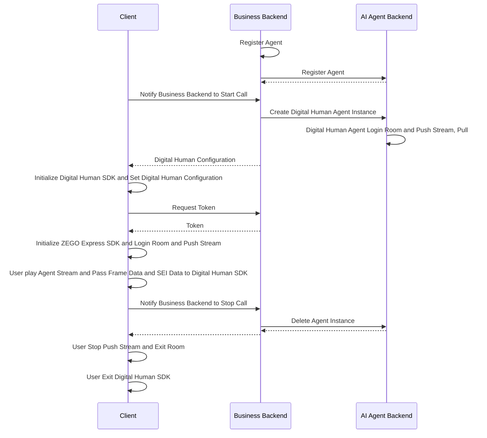

# Quick Start Digital Human Video Call

This document explains how to quickly integrate the client SDK (ZEGO Express SDK and Digital Human SDK) and achieve video interaction with an AI Agent.


## Digital Human Introduction

With just a photo or image of a real person or anime character from the waist up, you can obtain a 1080P digital human with accurate lip-sync and realistic appearance. When used with the AI Agent product, you can quickly achieve video interaction chat with AI digital humans within 2 seconds overall, suitable for various scenarios such as digital human 1V1 interactive video, digital human customer service, and digital human live streaming.

- More natural driving effects: Supports subtle body movements, natural facial expressions without distortion, providing more realistic and immersive interaction compared to voice calls;
- Multi-language accurate lip-sync: Natural and accurate lip movements, especially optimized for Chinese and English;
- Ultra-low interaction latency: Digital human driving latency < 500ms, combined with AI Agent interaction latency < 2s;
- Higher clarity: True 1080P effect, 20%+ improvement in clarity compared to traditional image-based digital humans


<Video src="https://media-resource.spreading.io/docuo/workspace564/27e54a759d23575969552654cb45bf89/9f0143abe9.mp4" />

## Prerequisites

- You have create a project in the [ZEGOCLOUD Console](https://console.zegocloud.com/) and obtain a valid AppID and AppSign. For details, see [Console - Project Management](https://www.zegocloud.com/docs/admin-console/view-project-information?platform=all&language=all).
- You have contacted ZEGOCLOUd Technical Support to enable Digital Human PaaS service and related interface permissions.
- You have contacted ZEGOCLOUD Technical Support to create a digital human.
- You have contacted ZEGOCLOUD Technical Support to enable AI Agent related services and obtain LLM and TTS related configuration information.
<Note title="Note">During the test period (within 2 weeks after the AI Agent service is enabled), you can set the LLM and TTS authentication parameters to "zego_test" to use the related services. For details, see [Agent Parameter Description](/aiagent-server/api-reference/common-parameter-description).</Note>

## Example Code
The following is the example code for the business backend that integrates the real-time interactive AI Agent API. You can refer to the example code to implement your own business logic.

<CardGroup cols={2}>
<Card title="Business Backend Example Code"  href="https://github.com/ZEGOCLOUD/ai_agent_quick_start_server" target="_blank">
Includes the basic capabilities of obtaining ZEGOCLOUD Token, registering AI Agent, creating AI Agent instances, and deleting AI Agent instances.
</Card>
</CardGroup>

The following video demonstrates how to run the service backend and client (Web) example code and interact with the digital human agent.
<Video src="https://media-resource.spreading.io/docuo/workspace564/27e54a759d23575969552654cb45bf89/4b68fbedda.mp4" />


## Overall Business Process

1. Service backend, run the business backend example code, deploy the business backend
    - Integrate the real-time interactive AI Agent API to manage the AI Agent.
2. Client, run the client example code, refer to the [Android Quick Start](/aiagent-android/quick-start-with-digital-human), [iOS Quick Start](/aiagent-ios/quick-start-with-digital-human), or [Web Quick Start](/aiagent-web/quick-start-with-digital-human) documentation to run the client example code
    - Create and manage AI Agent through the business backend.
    - Integrate ZEGO Express SDK to complete real-time communication.
    - Integrate Digital Human SDK to complete digital human rendering.

After completing the above three steps, you can implement the AI Agent joining the room and interacting with the real user in real-time video.



## Service Backend Core Capabilities Implementation


<Steps>
<Step title="Register AI Agent">
[Register AI Agent](./api-reference/agent-configuration-management/register-agent.mdx) is used to set the basic configuration of the AI Agent, including the AI Agent name, LLM, TTS, ASR, and other related configurations. After registration, you can create multiple instances with multiple real users as templates.

Usually, the AI Agent is relatively fixed, and once the related parameters (personality) are set, they will not be changed frequently. Therefore, it is recommended to register the AI Agent at the appropriate time according to the business process. The AI Agent registration will not automatically destroy and recycle, and after creating the AI Agent instance, you can interact

<Note title="Note">An AI Agent can only be registered once (the same ID), and if it is registered again, it will return error code 410001008.</Note>

The following is an example of calling the register AI Agent interface:

```javascript Server(NodeJS)
// Please replace the LLM and TTS authentication parameters (ApiKey, appid, token, etc.) in the following example with your actual authentication parameters.
async registerAgent(agentId: string, agentName: string) {
    // Request interface: https://aigc-aiagent-api.zegotech.cn?Action=RegisterAgent
    const action = 'RegisterAgent';
    const body = {
        AgentId: agentId,
        Name: agentName,
        LLM: {
            Url: "https://ark.cn-beijing.volces.com/api/v3/chat/completions",
            ApiKey: "zego_test",
            Model: "doubao-lite-32k-240828",
            SystemPrompt: "You are an AI agent, please answer the user's question."
        },
        TTS: {
            Vendor: "ByteDance",
            Params: {
                "app": {
                    "appid": "zego_test",
                    "token": "zego_test",
                    "cluster": "volcano_tts"
                },
                "audio": {
                    "voice_type": "zh_female_wanwanxiaohe_moon_bigtts"
                }
            }
        }
    };
    // sendRequest method encapsulates the request URL and public parameters. For details, see: https://www.zegocloud.com/docs/aiagent-server/api-reference/accessing-server-apis
    return this.sendRequest<any>(action, body);
}
```

<Warning title="Note">
- Please ensure that all LLM parameters are filled in correctly according to the official documentation of the LLM service provider, otherwise you may not be able to see the text content of the AI agent's answer and cannot hear the AI agent's output voice.
- Please ensure that all TTS parameters are filled in correctly according to the official documentation of the TTS service provider, otherwise you may be able to see the text content of the AI agent's answer but cannot hear the AI agent's output voice.
- If the AI agent cannot output text content or voice, please first check if the LLM and TTS parameter configuration is completely correct, or refer to [Get AI Agent Status - Listen for Service-Side Exception Events](./guides/get-ai-agent-status.mdx#listen-for-server-exception-events) to determine the specific problem.  
</Warning>

</Step>
<Step title="Create Digital Human Agent Instance">
You can create multiple digital human agent instances [Create Digital Human Agent Instance](./api-reference/agent-instance-management/create-digital-human-agent-instance.mdx) with the registered AI Agent as a template to join different rooms and interact with different users in real time. After creating the digital human agent instance, the digital human agent instance will automatically login the room and push the stream, and will also pull the real user's stream.

After creating the digital human agent instance successfully, you need to return the digital human configuration to the client, and the client initializes the digital human SDK according to the digital human configuration, and then you can interact with the digital human in real time.

The following is an example of calling the create digital human agent instance interface:

```javascript  Server(NodeJS)
async createDigitalHumanAgentInstance(agentId: string, userId: string, rtcInfo: RtcInfo, digitalHuman: DigitalHumanInfo, messages?: any[]) {
    // Request interface: https://aigc-aiagent-api.zegotech.cn?Action=CreateDigitalHumanAgentInstance
    const action = 'CreateDigitalHumanAgentInstance';
    const body = {
        AgentId: agentId,
        UserId: userId,
        RTC: rtcInfo,
        DigitalHuman: digitalHuman,
        MessageHistory: {
            SyncMode: 1, // Change to 0 to use history messages from ZIM
            Messages: messages && messages.length > 0 ? messages : [],
            WindowSize: 10
        }
    };
    // sendRequest method encapsulates the request URL and public parameters. For details, see: https://www.zegocloud.com/docs/aiagent-server/api-reference/accessing-server-apis
    const result = await this.sendRequest<any>(action, body);
    console.log("create agent instance result", result);
    // The returned DigitalHumanConfig is the digital human configuration, and the client initializes the digital human SDK according to the digital human configuration, and then you can interact with the digital human in real time.
    return result.AgentInstanceId, result.DigitalHumanConfig;
}
```

Congratulations🎉! After completing this step, you have successfully created a digital human agent instance and can interact with the real user in real-time video. You can ask the digital human any question, and the digital human will answer your question!
</Step>
<Step title="Delete AI Agent Instance">
After [Delete AI Agent Instance](./api-reference/agent-instance-management/delete-agent-instance.mdx), the AI agent instance will automatically exit the room and stop the push stream. The real user will stop the push stream and exit the room after the client, and a complete interactive session will end.

The following is an example of calling the delete AI agent instance interface:

```javascript Server(NodeJS)
async deleteAgentInstance(agentInstanceId: string) {
    // Request interface: https://aigc-aiagent-api.zegotech.cn?Action=DeleteAgentInstance
    const action = 'DeleteAgentInstance';
    const body = {
        AgentInstanceId: agentInstanceId
    };
    // sendRequest method encapsulates the request URL and public parameters. For details, see: https://www.zegocloud.com/docs/aiagent-server/api-reference/accessing-server-apis
    return this.sendRequest(action, body);
}
```
</Step>
</Steps>

This is the complete core process for you to implement real-time interaction with the digital human agent.

## Client Quick Start Reference

<Button primary-color="DarkGray" target="_blank" href="/aiagent-android/quick-start-with-digital-human">Android Quick Start</Button>
<Button primary-color="DarkGray" target="_blank" href="/aiagent-ios/quick-start-with-digital-human">iOS Quick Start</Button>
<Button primary-color="DarkGray" target="_blank" href="/aiagent-web/quick-start-with-digital-human">Web Quick Start</Button>