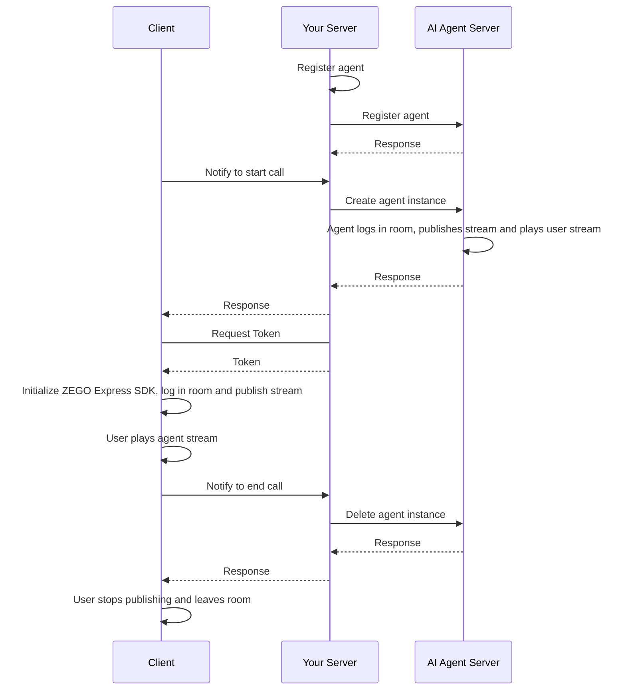
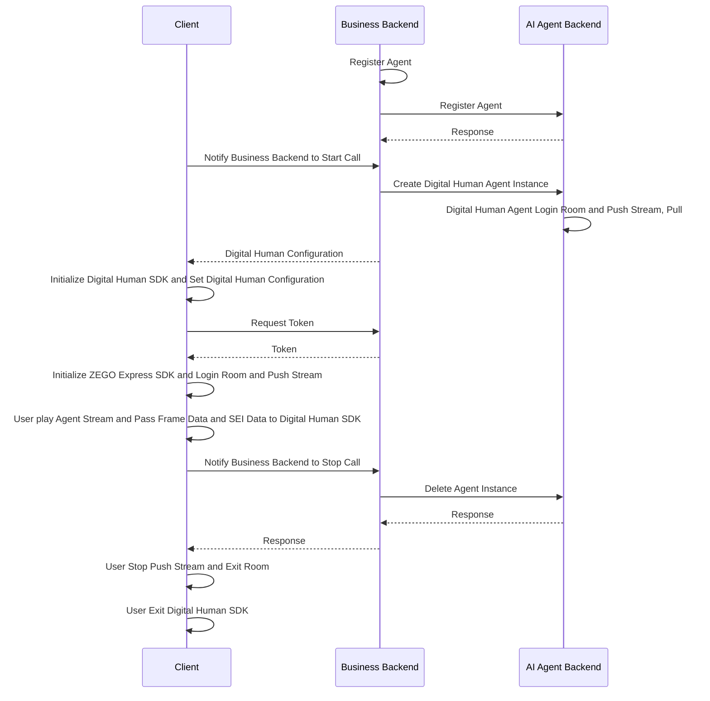

# Quick Start Voice Call

This document explains how to quickly integrate the AI Agent server APIs to enable voice interaction with AI agents.

## Prerequisites

- Create a project in the [ZEGOCLOUD Console](https://console.zegocloud.com/) and obtain a valid AppID and AppSign. For details, see [Console - Project Management](https://www.zegocloud.com/docs/admin-console/view-project-information?platform=all&language=all).
- Contact ZEGOCLOUD technical support to activate AI Agent services and obtain LLM and TTS configuration information.
<Note title="Note">During the testing period (within 2 weeks of AI Agent service activation), you can set the LLM and TTS authentication parameters to "zego_test" to use the service. For specific parameter configuration, please refer to [Agent Parameter Description](/aiagent-server/api-reference/common-parameter-description).</Note>

## Sample Code
The following server sample code demonstrates how to integrate the AI Agent APIs. You can refer to it to implement your own business logic.

<CardGroup cols={2}>
<Card title="Server Sample Code"  href="https://github.com/ZEGOCLOUD/ai_agent_quick_start_server" target="_blank">
Includes basic capabilities such as obtaining ZEGOCLOUD Token, registering agents, creating and deleting agent instances.
</Card>
</CardGroup>


Below are the client sample codes, you can refer to these sample codes to implement your own business logic.

<CardGroup cols={2}>
<Card title="Android Client Sample Code" href="https://github.com/ZEGOCLOUD/ai_agent_quick_start/tree/master/android" target="_blank">
Android client sample code. It includes basic capabilities such as logging into and out of RTC rooms, and publishing and playing streams.
</Card>
<Card title="iOS Client Sample Code" href="https://github.com/ZEGOCLOUD/ai_agent_quick_start/tree/master/ios" target="_blank">
iOS client sample code. It includes basic capabilities such as logging into and out of RTC rooms, and publishing and playing streams.
</Card>
<Card title="Web Client Sample Code" href="https://github.com/ZEGOCLOUD/ai_agent_quick_start/tree/master/web" target="_blank">
Web client sample code. It includes basic capabilities such as logging into and out of RTC rooms, and publishing and playing streams.
</Card>
<Card title="Flutter Client Sample Code" href="https://github.com/ZEGOCLOUD/ai_agent_quick_start/tree/master/flutter" target="_blank">
Flutter client sample code. It includes basic capabilities such as logging into and out of RTC rooms, and publishing and playing streams.
</Card>
</CardGroup>

The following video demonstrates how to run the server and client (Web) sample code and interact with an AI agent by voice.
<Video src="https://media-resource.spreading.io/docuo/workspace564/27e54a759d23575969552654cb45bf89/557a014d7c.mp4" />

## Overall Business Process

1. Server side: Run and deploy the server sample code
    - Integrate AI Agent APIs to manage AI agents.
2. Client side: Follow the [Android Quick Start](/aiagent-android/quick-start), [iOS Quick Start](/aiagent-ios/quick-start) or [Web Quick Start](/aiagent-web/quick-start) guide to run the client sample code
    - Create and manage AI agents through your server.
    - Integrate ZEGO Express SDK for real-time communication.

After completing these two steps, you can add an AI agent to a room for real-time interaction with real users.



## Core Server Capabilities

<Steps titleSize="h3">
<Step title="Register Agent">
[Register Agent](./api-reference/agent-configuration-management/register-agent.mdx) is used to set basic agent configurations, including agent name, LLM, TTS, ASR and other related settings. After registration, you can use this agent as a template to create multiple instances for interaction with multiple real users.

Usually, the agent's configuration (such as persona and appearance) is relatively fixed and does not need to be changed frequently once set. **Therefore, it is recommended to register the agent at the appropriate time according to your business process.** After registration, the agent will not be automatically destroyed or recycled. Once an agent instance is created, you can interact with the agent via voice.

<Note title="Note">An agent (with the same ID) can only be registered once. Duplicate registration will return error code 410001008.</Note>

Here's an example of calling the Register Agent API:

```javascript Server(NodeJS)
// Please replace the LLM and TTS authentication parameters (ApiKey, appid, token, etc.) in the following example with your actual authentication parameters.
async registerAgent(agentId: string, agentName: string) {
    // API endpoint: https://aigc-aiagent-api.zegotech.cn?Action=RegisterAgent
    const action = 'RegisterAgent';
    const body = {
        AgentId: agentId,
        Name: agentName,
        LLM: {
            Url: "https://ark.cn-beijing.volces.com/api/v3/chat/completions",
            ApiKey: "zego_test",
            Model: "doubao-lite-32k-240828",
            SystemPrompt: "You are a smart agent, please answer the user's question."
        },
        TTS: {
            Vendor: "ByteDance",
            Params: {
                "app": {
                    "appid": "zego_test",
                    "token": "zego_test",
                    "cluster": "volcano_tts"
                },
                "audio": {
                    "voice_type": "zh_female_wanwanxiaohe_moon_bigtts"
                }
            }
        }
    };
    // sendRequest method encapsulates the request URL and common parameters. For details, see: https://zegocloud.com/docs/aiagent-server/api-reference/accessing-server-apis
    return this.sendRequest<any>(action, body);
}
```

<Warning title="Warning">
- Ensure all LLM parameters are correctly set according to the LLM service provider's official documentation. Otherwise, you may not see the agent's text responses or hear its voice output.
- Ensure all TTS parameters are correctly set according to the TTS service provider's official documentation. Otherwise, you may see the agent's text responses but not hear its voice output.
- If the agent fails to output text or voice, first check if the LLM and TTS parameter configurations are completely correct, or refer to [Get AI Agent Status - Listen for Server Exception Events](./guides/get-ai-agent-status.mdx#listen-for-server-exception-events) to identify the specific issue.
</Warning>

</Step>
<Step title="Create Agent Instance">
You can use a registered agent as a template to [create multiple agent instances](./api-reference/agent-instance-management/create-agent-instance.mdx) that join different rooms to interact with different users in real-time. After an agent instance is created, it automatically logs into the room, publishes its stream, and plays the real user's stream.

Once the agent instance is successfully created, real users can monitor stream change events and play the agent's stream on the client side to start real-time interaction.

<Note title="说明">在客户端进房成功后应立即调用该接口以便让智能体实例加入房间并开始推拉流</Note>
<Warning title="Warning">By default, each account can have at most 10 AI agent instances. If the limit is exceeded, the creation of an AI agent instance will fail. If you need to adjust this limit, please contact ZEGOCLOUD Technical Support.</Warning>

Here's an example of calling the Create Agent Instance API:

```javascript Server(NodeJS)
async createAgentInstance(agentId: string, userId: string, rtcInfo: RtcInfo, messages?: any[]) {
    // API endpoint: https://aigc-aiagent-api.zegotech.cn?Action=CreateAgentInstance
    const action = 'CreateAgentInstance';
    const body = {
        AgentId: agentId,
        UserId: userId,
        RTC: rtcInfo,
        MessageHistory: {
            SyncMode: 1, // Change to 0 to use history messages from In-app chat
            Messages: messages && messages.length > 0 ? messages : [],
            WindowSize: 10
        }
    };
    // sendRequest method encapsulates the request URL and common parameters. For details, see: https://zegocloud.com/docs/aiagent-server/api-reference/accessing-server-apis
    const result = await this.sendRequest<any>(action, body);
    console.log("create agent instance result", result);
    // In the client, you need to save the returned AgentInstanceId for subsequent deletion of the agent instance.
    return result.AgentInstanceId;
}
```

After completing this step, you can create an agent instance. Once the client is integrated, you can interact with the agent instance via voice.

</Step>
<Step title="Integrate Client SDK">
Please refer to the following documents to complete the client integration development:

<CardGroup cols={2}>
<Card title="Android" href="/aiagent-android/quick-start" target="_blank">
Quick Start
</Card>
<Card title="iOS"  href="/aiagent-ios/quick-start" target="_blank">
Quick Start
</Card>
<Card title="Web"  href="/aiagent-web/quick-start" target="_blank">
Quick Start
</Card>
<Card title="Flutter"  href="/aiagent-flutter/quick-start" target="_blank">
Quick Start
</Card>
</CardGroup>
</Step>

Congratulations! 🎉 After completing this step, you have successfully integrated the client SDK and can interact with the agent instance in real-time voice. You can ask the agent any questions, and it will answer your questions!

<Step title="Delete Agent Instance">
After [deleting an agent instance](./api-reference/agent-instance-management/delete-agent-instance.mdx), the instance automatically leaves the room and stops publishing its stream. When the real user stops publishing and leaves the room on the client side, one complete interaction session ends.

Here's an example of calling the Delete Agent Instance API:

```javascript Server(NodeJS)
async deleteAgentInstance(agentInstanceId: string) {
    // API endpoint: https://aigc-aiagent-api.zegotech.cn?Action=DeleteAgentInstance
    const action = 'DeleteAgentInstance';
    const body = {
        AgentInstanceId: agentInstanceId
    };
    // sendRequest method encapsulates the request URL and common parameters. For details, see: https://zegocloud.com/docs/aiagent-server/api-reference/accessing-server-apis
    return this.sendRequest(action, body);
}
```
</Step>
</Steps>

This completes the core process for implementing real-time voice interaction with AI agents.

## Listen for Exception Callback

<Warning title="Note">Due to the large number of parameters for LLM and TTS, it is easy to cause various abnormal problems such as the AI agent not answering or not speaking during the test process due to parameter configuration errors. We strongly recommend that you listen for exception callbacks during the test process and quickly troubleshoot problems based on the callback information.</Warning>

<Card title="Receive Callback" href="/aiagent-server/callbacks/receiving-callback" target="_blank">
Click to view the guide for listening to exception callbacks. The event with Event as Exception can be quickly located through Data.Code and Data.Message.
</Card>


:::if{props.type=undefined}
# Quick Start Voice Call

This document explains how to quickly call AI Agent related backend APIs to achieve voice interaction with AI Agent.
:::

:::if{props.type="digital-human"}
# Quick Start Digital Human Video Call
This document explains how to quickly call AI Agent related backend APIs to achieve video interaction with AI Agent.


## Digital Human Introduction

With just a photo or image of a real person or anime character from the waist up, you can obtain a 1080P digital human with accurate lip-sync and realistic appearance. When used with the AI Agent product, you can quickly achieve video interaction chat with AI digital humans within 1.5 seconds overall, suitable for various scenarios such as digital human 1V1 interactive video, digital human customer service, and digital human live streaming.

- More natural driving effects: Supports subtle body movements, natural facial expressions without distortion, providing more realistic and immersive interaction compared to voice calls;
- Multi-language accurate lip-sync: Natural and accurate lip movements, especially optimized for Chinese and English;
- Ultra-low interaction latency: Digital human driving latency < 200ms, combined with AI Agent interaction latency < 1.5s;
- Higher clarity: True 1080P effect, 20%+ improvement in clarity compared to traditional image-based digital humans

You can jump to the [download page](./introduction/download.mdx) to download and experience.

<Video src="https://media-resource.spreading.io/docuo/workspace564/27e54a759d23575969552654cb45bf89/9f0143abe9.mp4" />

:::

## Prerequisites

- You have created a project in the [ZEGOCLOUD Console](https://console.zegocloud.com/) and obtained a valid AppID and AppSign.
- You have contacted ZEGOCLOUd Technical Support to enable AI Agent related services and obtain LLM and TTS related configuration information.
:::if{props.type="digital-human"}
- You have contacted ZEGOCLOUD Technical Support to create a digital human.
- You have contacted ZEGOCLOUD Technical Support to enable AI Agent related services and obtain LLM and TTS related configuration information.
:::
<Note title="Note">During the test period (within 2 weeks after the AI Agent service is enabled), you can set the LLM and TTS authentication parameters to "zego_test" to use the related services. For details, see [Agent Parameter Description](/aiagent-server/api-reference/common-parameter-description).</Note>

## Example Code
The following is the example code for the business backend that integrates the real-time interactive AI Agent API. You can refer to the example code to implement your own business logic.

<CardGroup cols={2}>
<Card title="Business Backend Example Code"  href="https://github.com/ZEGOCLOUD/ai_agent_quick_start_server" target="_blank">
Includes the basic capabilities of obtaining ZEGO Token, registering AI Agent, creating AI Agent instances, and deleting AI Agent instances.
</Card>
</CardGroup>

The following is the client sample code, you can refer to the example code to implement your own business logic.
<CardGroup cols={2}>
<Card title="Android Client Sample Code" href="https://github.com/ZEGOCLOUD/ai_agent_quick_start/tree/master/android" target="_blank">
Includes the basic capabilities of logging in, publishing streams, playing streams, and exiting rooms.
</Card>
<Card title="iOS Client Sample Code" href="https://github.com/ZEGOCLOUD/ai_agent_quick_start/tree/master/ios" target="_blank">
Includes the basic capabilities of logging in, publishing streams, playing streams, and exiting rooms.
</Card>
<Card title="Web Client Sample Code" href="https://github.com/ZEGOCLOUD/ai_agent_quick_start/tree/master/web" target="_blank">
Includes the basic capabilities of logging in, publishing streams, playing streams, and exiting rooms.
</Card>
<Card title="Flutter Client Sample Code" href="https://github.com/ZEGOCLOUD/ai_agent_quick_start/tree/master/flutter" target="_blank">
Includes the basic capabilities of logging in, publishing streams, playing streams, and exiting rooms.
</Card>
</CardGroup>

:::if{props.type=undefined}
The following video demonstrates how to run the service backend and client (Web) example code and interact with the AI Agent.
<Video src="https://media-resource.spreading.io/docuo/workspace564/27e54a759d23575969552654cb45bf89/557a014d7c.mp4" />
:::
:::if{props.type="digital-human"}
The following video demonstrates how to run the service backend and client (Web) example code and interact with the digital human agent.
<Video src="https://media-resource.spreading.io/docuo/workspace564/27e54a759d23575969552654cb45bf89/4b68fbedda.mp4" />
:::


## Overall Business Process

1. Service backend, run the business backend example code, deploy the business backend
    - Integrate the real-time interactive AI Agent API to manage the AI Agent.
:::if{props.type=undefined}
2. Client, refer to the [Android Quick Start](/aiagent-android/quick-start) , [iOS Quick Start](/aiagent-ios/quick-start) or [Web Quick Start](/aiagent-web/quick-start) document to run the client example code
    - Create and manage AI Agent through the business backend.
    - Integrate ZEGO Express SDK to complete real-time communication.

After completing the above two steps, you can achieve real-time interaction between the AI agent and real users by joining the room.


:::
:::if{props.type="digital-human"}
2. Client, refer to the [Android Quick Start](/aiagent-android/quick-start-with-digital-human) , [iOS Quick Start](/aiagent-ios/quick-start-with-digital-human) or [Web Quick Start](/aiagent-web/quick-start-with-digital-human) document to run the client example code
    - Create and manage AI Agent through the business backend.
    - Integrate ZEGO Express SDK to complete real-time communication.
    - Integrate Digital Human SDK to complete digital human rendering.

After completing the above three steps, you can achieve real-time interaction between the AI agent and real users by joining the room.


:::


## Core Capabilities Implementation


<Steps titleSize="h3">
<Step title="Register AI Agent">
[Register AI Agent](./api-reference/agent-configuration-management/register-agent.mdx) is used to set the basic configuration of the AI Agent, including the AI Agent name, LLM, TTS, ASR, and other related configurations. After registration, you can create multiple instances with multiple real users as templates.

Usually the AI Agent is relatively fixed, once the related parameters (personality and image) of the AI Agent are set, they will not be changed frequently. **So it is recommended to register the AI Agent at the appropriate time according to the business process.** The AI Agent will not be automatically destroyed and recycled after registration. After creating an AI Agent instance, you can interact with the AI Agent via voice.

<Note title="Note">An AI Agent can only be registered once (the same ID), if it is registered again, it will return error code 410001008.</Note>

The following is an example of calling the Register AI Agent interface:

```javascript Server(NodeJS)
// Please replace the authentication parameters such as ApiKey, appid, token of LLM and TTS in the following example with your actual authentication parameters.
async registerAgent(agentId: string, agentName: string) {
    // Request interface: https://aigc-aiagent-api.zegotech.cn?Action=RegisterAgent
    const action = 'RegisterAgent';
    const body = {
        AgentId: agentId,
        Name: agentName,
        LLM: {
            Url: "https://ark.cn-beijing.volces.com/api/v3/chat/completions",
            ApiKey: "zego_test",
            Model: "doubao-lite-32k-240828",
            SystemPrompt: "You are an AI Agent, please answer the user's question."
        },
        TTS: {
            Vendor: "ByteDance",
            Params: {
                "app": {
                    "appid": "zego_test",
                    "token": "zego_test",
                    "cluster": "volcano_tts"
                },
                "audio": {
                    "voice_type": "zh_female_wanwanxiaohe_moon_bigtts"
                }
            }
        }
    };
    // sendRequest method encapsulates the request URL and common parameters. For details, see: https://zegocloud.com/docs/aiagent-server/api-reference/accessing-server-apis
    return this.sendRequest<any>(action, body);
}
```

<Warning title="Note">
- Please ensure that all parameters of LLM are filled in correctly according to the official documentation of the LLM service provider, otherwise you may not be able to see the text content of the AI Agent's answer and cannot hear the AI Agent's output voice.
- Please ensure that all parameters of TTS are filled in correctly according to the official documentation of the TTS service provider, otherwise you may be able to see the text content of the AI Agent's answer but cannot hear the AI Agent's output voice.
- If the AI Agent cannot output text content or voice, please first check if the LLM and TTS parameter configurations are completely correct, or refer to [Get AI Agent Status - Listen for Service-Side Exception Events](./guides/get-ai-agent-status.mdx#listen-for-server-exception-events) to determine the specific problem.
</Warning>

</Step>
:::if{props.type=undefined}
<Step title="Create AI Agent Instance">
Use the registered AI Agent as a template to [create multiple AI Agent instances](./api-reference/agent-instance-management/create-agent-instance.mdx) to join different rooms and interact with different users in real time. After creating the AI Agent instance, the AI Agent instance will automatically login the room and push the stream, at the same time, it will also pull the real user's stream.

Create AI Agent Instance successfully, the real user can interact with the AI Agent in real time by listening to the stream change event and pulling the stream in the client.

<Note title="Note">In the client, after successfully entering the room, you should immediately call this interface to allow the AI Agent instance to join the room and start pushing and pulling streams</Note>
<Warning title="Note">By default, each account can have at most 10 AI Agent instances. If the limit is exceeded, the creation of an AI Agent instance will fail. If you need to adjust this limit, please contact ZEGOCLOUD Technical Support.</Warning>

The following is an example of calling the Create AI Agent Instance interface:

```javascript Server(NodeJS)
async createAgentInstance(agentId: string, userId: string, rtcInfo: RtcInfo, messages?: any[]) {
    // Request interface: https://aigc-aiagent-api.zegotech.cn?Action=CreateAgentInstance
    // const rtcInfo = {
    //   RoomId: room_id,
    //   AgentStreamId: agent_stream_id,
    //   AgentUserId: agent_user_id,
    //   UserStreamId: user_stream_id,
    // };
    const action = 'CreateAgentInstance';
    const body = {
        AgentId: agentId,
        UserId: userId, // The ID of the real user that interacts with this AI Agent instance
        RTC: rtcInfo,
        MessageHistory: {
            SyncMode: 1, // Change to 0 to use history messages from ZIM
            Messages: messages && messages.length > 0 ? messages : [],
            WindowSize: 10
        }
    };
    // sendRequest method encapsulates the request URL and common parameters. For details, see: https://zegocloud.com/docs/aiagent-server/api-reference/accessing-server-apis
    const result = await this.sendRequest<any>(action, body);
    console.log("create agent instance result", result);
    // In the client, you need to save the returned AgentInstanceId, which is used for subsequent deletion of the AI Agent instance.
    return result.AgentInstanceId;
}
```

After completing this step, you can create an AI Agent instance. Once the client is integrated, you can interact with the AI Agent instance via voice.
</Step>
:::
:::if{props.type="digital-human"}
<Step title="Create Digital Human Agent Instance">
Use the registered AI Agent as a template to [create multiple digital human agent instances](./api-reference/agent-instance-management/create-digital-human-agent-instance.mdx) to join different rooms and interact with different users in real time. After creating the digital human agent instance, the digital human agent instance will automatically login the room and push the stream, at the same time, it will also pull the real user's stream.

Create Digital Human Agent Instance successfully, you need to return the digital human configuration to the client, and the client initializes the digital human SDK according to the digital human configuration, and then you can interact with the digital human in real time.

<Note title="Note">In the client, after successfully entering the room, you should immediately call this interface to allow the digital human agent instance to join the room and start pushing and pulling streams</Note>
<Warning title="Note">By default, each account can have at most 10 digital human agent instances. If the limit is exceeded, the creation of a digital human agent instance will fail. If you need to adjust this limit, please contact ZEGOCLOUD Technical Support.</Warning>

The following is an example of calling the Create Digital Human Agent Instance interface:

```javascript  Server(NodeJS)
async createDigitalHumanAgentInstance(agentId: string, userId: string, rtcInfo: RtcInfo, digitalHuman: DigitalHumanInfo, messages?: any[]) {
    // Request interface: https://aigc-aiagent-api.zegotech.cn?Action=CreateDigitalHumanAgentInstance
    // const rtcInfo = {
    //   RoomId: room_id,
    //   AgentStreamId: agent_stream_id,
    //   AgentUserId: agent_user_id,
    //   UserStreamId: user_stream_id,
    // };
    const action = 'CreateDigitalHumanAgentInstance';
    const body = {
        AgentId: agentId,
        UserId: userId, // The ID of the real user that interacts with this AI Agent instance
        RTC: rtcInfo,
        DigitalHuman: digitalHuman, // You can use the public ID: c4b56d5c-db98-4d91-86d4-5a97b507da97 for testing.
        MessageHistory: {
            SyncMode: 1, // Change to 0 to use history messages from ZIM
            Messages: messages && messages.length > 0 ? messages : [],
            WindowSize: 10
        }
    };
    // sendRequest method encapsulates the request URL and common parameters. For details, see: https://zegocloud.com/docs/aiagent-server/api-reference/accessing-server-apis
    const result = await this.sendRequest<any>(action, body);
    console.log("create agent instance result", result);
    // The returned DigitalHumanConfig is the digital human configuration, and the client initializes the digital human SDK according to the digital human configuration, and then you can interact with the digital human in real time.
    return result.AgentInstanceId, result.DigitalHumanConfig;
}
```
After completing this step, you can create a digital human agent instance. After integrating the client, you can interact with the digital human agent instance in real-time video.
</Step>
:::
<Step title="Integrate Client SDK">

Please refer to the following documents to complete the client integration development:

:::if{props.type=undefined}
<CardGroup cols={2}>
<Card title="Android" href="/aiagent-android/quick-start" target="_blank">
Quick Start
</Card>
<Card title="iOS"  href="/aiagent-ios/quick-start" target="_blank">
Quick Start
</Card>
<Card title="Web"  href="/aiagent-web/quick-start" target="_blank">
Quick Start
</Card>
<Card title="Flutter"  href="/aiagent-flutter/quick-start" target="_blank">
Quick Start
</Card>
</CardGroup>
:::
:::if{props.type="digital-human"}
<CardGroup cols={3}>
<Card title="Android" href="/aiagent-android/quick-start-with-digital-human" target="_blank">
Quick Start
</Card>
<Card title="iOS"  href="/aiagent-ios/quick-start-with-digital-human" target="_blank">
Quick Start
</Card>
<Card title="Web"  href="/aiagent-web/quick-start-with-digital-human" target="_blank">
Quick Start
</Card>
</CardGroup>
:::

Congratulations! 🎉 After completing this step, you have successfully integrated the client SDK and can interact with the AI Agent instance in real-time voice. You can ask the AI Agent any questions, and it will answer your questions!
</Step>
<Step title="Delete AI Agent Instance">
After [Delete AI Agent Instance](./api-reference/agent-instance-management/delete-agent-instance.mdx), the AI Agent instance will automatically exit the room and stop the push stream. The real user will stop the push stream and exit the room after the client, and a complete interactive session will end.

The following is an example of calling the delete AI Agent Instance interface:

```javascript  Server(NodeJS)
async deleteAgentInstance(agentInstanceId: string) {
    // Request interface: https://aigc-aiagent-api.zegotech.cn?Action=DeleteAgentInstance
    const action = 'DeleteAgentInstance';
    const body = {
        AgentInstanceId: agentInstanceId
    };
    // sendRequest method encapsulates the request URL and common parameters. For details, see: https://zegocloud.com/docs/aiagent-server/api-reference/accessing-server-apis
    return this.sendRequest(action, body);
}
```
</Step>
</Steps>

This is the complete core process for you to implement real-time interaction with the AI Agent.

## Listen for Exception Callback

<Warning title="Note">Since there are many and complex parameters such as LLM and TTS, it is easy to cause various abnormal problems such as the AI Agent not answering or not speaking due to parameter configuration errors during the test. We strongly recommend that you listen for exception callbacks during the test and quickly troubleshoot problems based on the callback information.</Warning>

<Card title="Receive Callback" href="/aiagent-server/callbacks/receiving-callback" target="_blank">
Click to view the guide for listening to exception callbacks. The event with Event as Exception in the listening callback can be quickly located through Data.Code and Data.Message.
</Card>