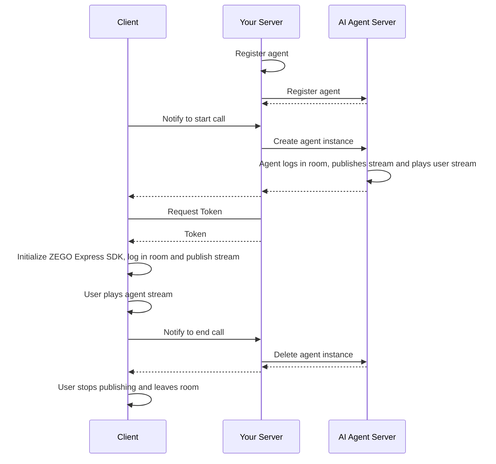

# Quick Start Voice Call

This document explains how to quickly integrate the AI Agent server APIs to enable voice interaction with AI agents.

## Prerequisites

- Create a project in the [ZEGOCLOUD Console](https://console.zegocloud.com/) and obtain a valid AppID and AppSign. For details, see [Console - Project Management](https://www.zegocloud.com/docs/admin-console/view-project-information?platform=all&language=all).
- Contact ZEGOCLOUD technical support to activate AI Agent services and obtain LLM and TTS configuration information.
<Note title="Note">During the testing period (within 2 weeks of AI Agent service activation), you can set the LLM and TTS authentication parameters to "zego_test" to use the service. For specific parameter configuration, please refer to [Agent Parameter Description](/aiagent-server/api-reference/common-parameter-description).</Note>

## Sample Code
The following server sample code demonstrates how to integrate the AI Agent APIs. You can refer to it to implement your own business logic.

<CardGroup cols={2}>
<Card title="Server Sample Code"  href="https://github.com/ZEGOCLOUD/ai_agent_quick_start_server" target="_blank">
Includes basic capabilities such as obtaining ZEGOCLOUD Token, registering agents, creating and deleting agent instances.
</Card>
</CardGroup>

The following video demonstrates how to run the server and client (Web) sample code and interact with an AI agent by voice.
<Video src="https://media-resource.spreading.io/docuo/workspace564/27e54a759d23575969552654cb45bf89/557a014d7c.mp4" />

## Overall Business Process

1. Server side: Run and deploy the server sample code
    - Integrate AI Agent APIs to manage AI agents.
2. Client side: Follow the [Android Quick Start](/aiagent-android/quick-start), [iOS Quick Start](/aiagent-ios/quick-start) or [Web Quick Start](/aiagent-web/quick-start) guide to run the client sample code
    - Create and manage AI agents through your server.
    - Integrate ZEGO Express SDK for real-time communication.

After completing these two steps, you can add an AI agent to a room for real-time interaction with real users.



## Core Server Capabilities

<Steps>
<Step title="Register Agent">
[Register Agent](./api-reference/agent-configuration-management/register-agent.mdx) is used to set basic agent configurations, including agent name, LLM, TTS, ASR and other related settings. After registration, you can use this agent as a template to create multiple instances for interaction with multiple real users.

Agents are relatively static - once the agent parameters (personality and characteristics) are set, they don't change frequently. Therefore, it's recommended to register agents at appropriate times according to your business flow. Registered agents will not be automatically destroyed or recycled. After creating an agent instance, you can start voice interaction with that agent.

<Note title="Note">An agent (with the same ID) can only be registered once. Duplicate registration will return error code 410001008.</Note>

Here's an example of calling the Register Agent API:

```javascript Server(NodeJS)
// Please replace the LLM and TTS authentication parameters (ApiKey, appid, token, etc.) in the following example with your actual authentication parameters.
async registerAgent(agentId: string, agentName: string) {
    // API endpoint: https://aigc-aiagent-api.zegotech.cn?Action=RegisterAgent
    const action = 'RegisterAgent';
    const body = {
        AgentId: agentId,
        Name: agentName,
        LLM: {
            Url: "https://ark.cn-beijing.volces.com/api/v3/chat/completions",
            ApiKey: "zego_test",
            Model: "doubao-lite-32k-240828",
            SystemPrompt: "You are a smart agent, please answer the user's question."
        },
        TTS: {
            Vendor: "ByteDance",
            Params: {
                "app": {
                    "appid": "zego_test",
                    "token": "zego_test",
                    "cluster": "volcano_tts"
                },
                "audio": {
                    "voice_type": "zh_female_wanwanxiaohe_moon_bigtts"
                }
            }
        }
    };
    // sendRequest method encapsulates the request URL and common parameters. For details, see: https://zegocloud.com/docs/aiagent-server/api-reference/accessing-server-apis
    return this.sendRequest<any>(action, body);
}
```

<Warning title="Warning">
- Ensure all LLM parameters are correctly set according to the LLM service provider's official documentation. Otherwise, you may not see the agent's text responses or hear its voice output.
- Ensure all TTS parameters are correctly set according to the TTS service provider's official documentation. Otherwise, you may see the agent's text responses but not hear its voice output.
- If the agent fails to output text or voice, first check if the LLM and TTS parameter configurations are completely correct, or refer to [Get AI Agent Status - Listen for Server Exception Events](./guides/get-ai-agent-status.mdx#listen-for-server-exception-events) to identify the specific issue.
</Warning>

</Step>
<Step title="Create Agent Instance">
You can use a registered agent as a template to [create multiple agent instances](./api-reference/agent-instance-management/create-agent-instance.mdx) that join different rooms to interact with different users in real-time. After an agent instance is created, it automatically logs into the room, publishes its stream, and plays the real user's stream.

Once the agent instance is successfully created, real users can monitor stream change events and play the agent's stream on the client side to start real-time interaction.

Here's an example of calling the Create Agent Instance API:

```javascript Server(NodeJS)
async createAgentInstance(agentId: string, userId: string, rtcInfo: RtcInfo, messages?: any[]) {
    // API endpoint: https://aigc-aiagent-api.zegotech.cn?Action=CreateAgentInstance
    const action = 'CreateAgentInstance';
    const body = {
        AgentId: agentId,
        UserId: userId,
        RTC: rtcInfo,
        MessageHistory: {
            SyncMode: 1, // Change to 0 to use history messages from In-app chat
            Messages: messages && messages.length > 0 ? messages : [],
            WindowSize: 10
        }
    };
    // sendRequest method encapsulates the request URL and common parameters. For details, see: https://zegocloud.com/docs/aiagent-server/api-reference/accessing-server-apis
    const result = await this.sendRequest<any>(action, body);
    console.log("create agent instance result", result);
    // In the client, you need to save the returned AgentInstanceId for subsequent deletion of the agent instance.
    return result.AgentInstanceId;
}
```

Congratulations! 🎉 After completing this step, you have successfully created an agent instance that can interact with real users in real-time. You can ask the agent any questions by voice, and it will respond with voice answers!
</Step>
<Step title="Delete Agent Instance">
After [deleting an agent instance](./api-reference/agent-instance-management/delete-agent-instance.mdx), the instance automatically leaves the room and stops publishing its stream. When the real user stops publishing and leaves the room on the client side, one complete interaction session ends.

Here's an example of calling the Delete Agent Instance API:

```javascript Server(NodeJS)
async deleteAgentInstance(agentInstanceId: string) {
    // API endpoint: https://aigc-aiagent-api.zegotech.cn?Action=DeleteAgentInstance
    const action = 'DeleteAgentInstance';
    const body = {
        AgentInstanceId: agentInstanceId
    };
    // sendRequest method encapsulates the request URL and common parameters. For details, see: https://zegocloud.com/docs/aiagent-server/api-reference/accessing-server-apis
    return this.sendRequest(action, body);
}
```
</Step>
</Steps>

This completes the core process for implementing real-time voice interaction with AI agents.

## Client Quick Start References

<Button primary-color="DarkGray" target="_blank" href="/aiagent-android/quick-start">Android Quick Start</Button>
<Button primary-color="DarkGray" target="_blank" href="/aiagent-ios/quick-start">iOS Quick Start</Button>
<Button primary-color="DarkGray" target="_blank" href="/aiagent-web/quick-start">Web Quick Start</Button>