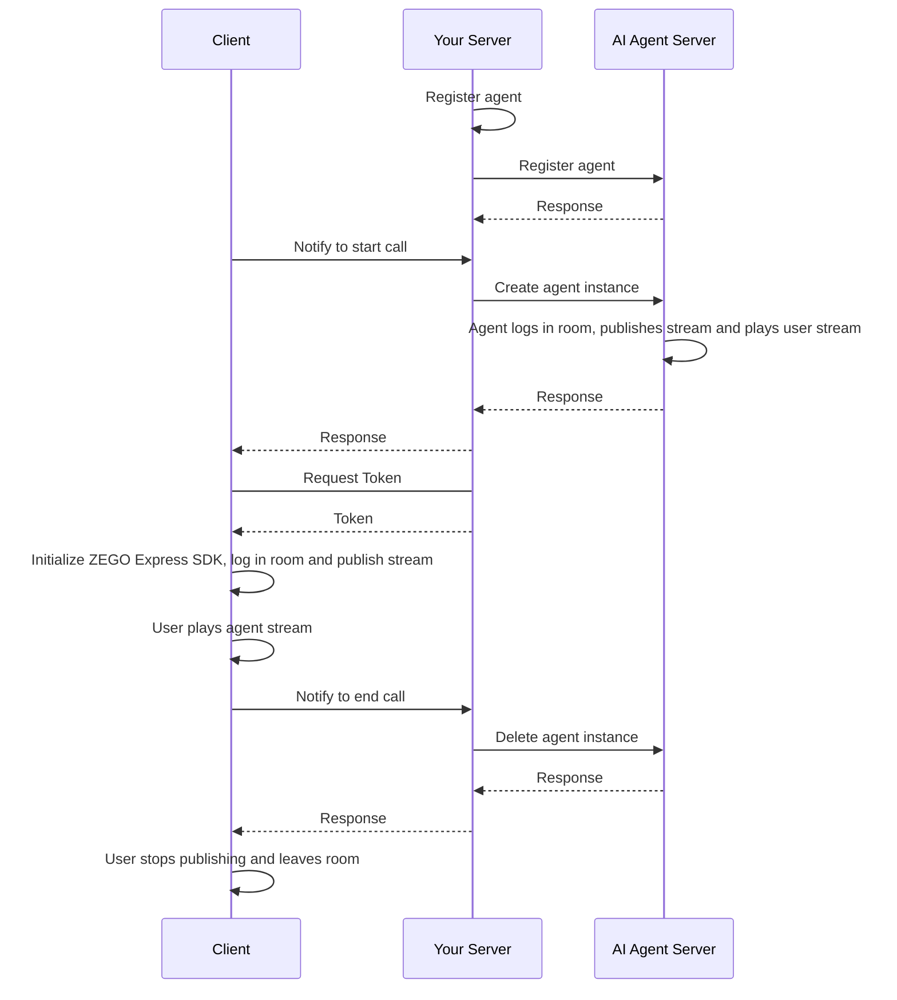
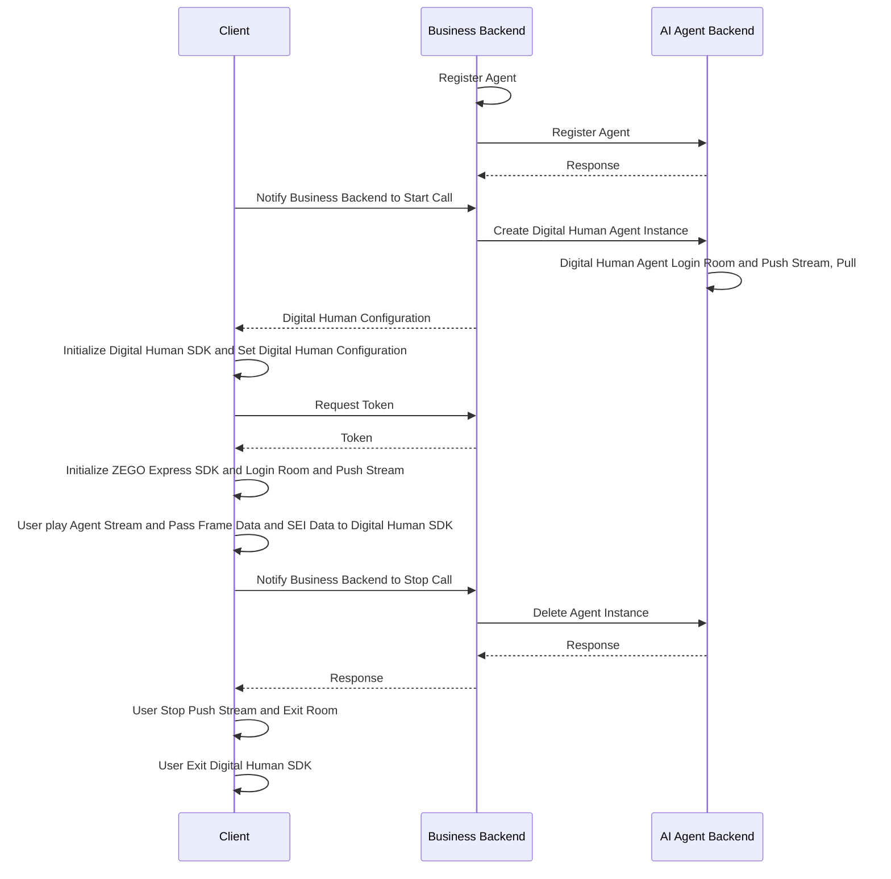
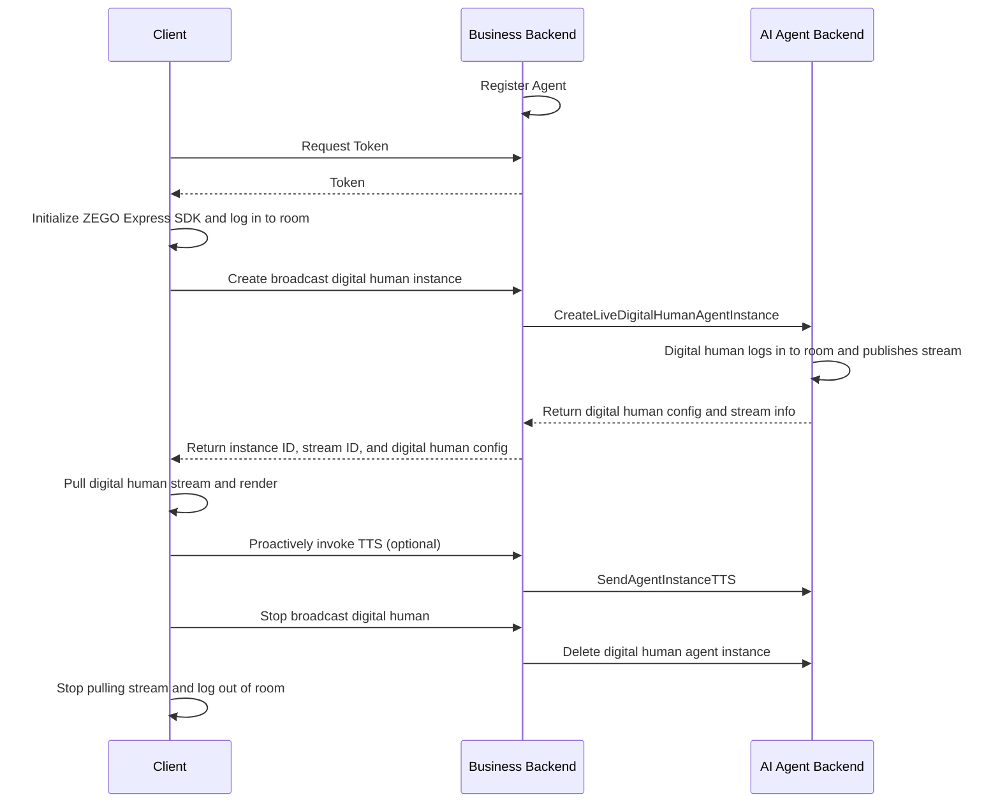

:::if{props.type=undefined}
# Quick Start Voice Call

This document explains how to quickly call AI Agent related backend APIs to achieve voice interaction with AI Agent.
:::

:::if{props.type="digital-human"}
# Quick Start Digital Human Video Call
This document explains how to quickly call AI Agent related backend APIs to achieve video interaction with AI Agent.


## Digital Human Introduction

With just a photo or image of a real person or anime character from the waist up, you can obtain a 1080P digital human with accurate lip-sync and realistic appearance. When used with the AI Agent product, you can quickly achieve video interaction chat with AI digital humans within 1.5 seconds overall, suitable for various scenarios such as digital human 1V1 interactive video, digital human customer service, and digital human live streaming.

- More natural driving effects: Supports subtle body movements, natural facial expressions without distortion, providing more realistic and immersive interaction compared to voice calls;
- Multi-language accurate lip-sync: Natural and accurate lip movements, especially optimized for Chinese and English;
- Ultra-low interaction latency: Digital human driving latency < 200ms, combined with AI Agent interaction latency < 1.5s;
- Higher clarity: True 1080P effect, 20%+ improvement in clarity compared to traditional image-based digital humans

You can jump to the [download page](./introduction/download.mdx) to download and experience.

{/* TODO: 视频未翻译英文
<Video src="https://doc-media.zego.im/docuo/9f0143abe9.mp4" />
*/}

:::

:::if{props.type="live-digital-human"}
# Quick Start Digital Human Live Broadcast

This document explains how to call AI Agent related backend APIs to implement digital human live broadcast.

Unlike digital human video calls, digital human broadcasting is a one-way viewing scenario—users do not interact with the digital human, but only watch the broadcast content.
The client only needs to log in to the [RTC room](/glossary/term-explanation#rtc-room-) and [pull streams](/glossary/term-explanation#pull-stream); it does not need to capture or [publish streams](/glossary/term-explanation#publish-stream) of the user's audio and video. After creating a broadcast instance, the server can proactively make the digital human broadcast specified text via the TTS API.

Suitable for scenarios such as digital human live streaming, news broadcasting, event hosting, and scripted broadcast.

### Differences from Digital Human Video Calls

| Item | Digital Human Video Call | Digital Human Live Broadcast |
| --- | --- | --- |
| Interaction Mode | Two-way; the digital human responds after the user speaks | One-way; users only watch the broadcast content |
| Use Cases | AI interaction, AI customer service, digital human tutor | Digital human live streaming, news broadcasting |
| Client Requires User Audio Capture | Yes | No |
| Digital Human Driving Mechanism | After receiving user audio, the LLM generates a response and drives the digital human via TTS | Broadcast content is fully controlled by the server; the digital human is driven via TTS |
| Instance Creation API | [CreateDigitalHumanAgentInstance](/aiagent-server/api-reference/agent-instance-management/create-digital-human-agent-instance) | [CreateLiveDigitalHumanAgentInstance](/aiagent-server/api-reference/agent-instance-management/create-live-digital-human-agent-instance) |
| Requires user_id and user_stream_id | Yes | No |
:::

## Prerequisites

- You have created a project in the [ZEGOCLOUD Console](https://console.zegocloud.com/) and obtained a valid AppID and ServerSecret (for server API signing and RTC Token04 generation). For details, see [Console - Project Info](/console/project-info).
- You have contacted ZEGOCLOUD Technical Support to enable the Digital Human PaaS service and related API permissions.
- You have obtained a valid `digital_human_id` (for testing, you can use the public ID: c4b56d5c-db98-4d91-86d4-5a97b507da97).
:::
:::if{props.type="undefined|digital-human"}
## Prerequisites

- You have created a project in the [ZEGOCLOUD Console](https://console.zegocloud.com/) and obtained a valid AppID and AppSign.
- You have contacted ZEGOCLOUD Technical Support to enable AI Agent related services and obtain LLM and TTS related configuration information.
:::if{props.type="digital-human"}
- You have contacted ZEGOCLOUD Technical Support to create a digital human.
- You have contacted ZEGOCLOUD Technical Support to enable AI Agent related services and obtain LLM and TTS related configuration information.
:::
<Note title="Note">During the test period (within 2 weeks after the AI Agent service is enabled), you can set the LLM and TTS authentication parameters to "zego_test" to use the related services. For details, see [Register Agent > BODY Parameter Description](/aiagent-server/api-reference/agent-configuration-management/register-agent).</Note>

## Example Code
The following is the example code for the business backend that integrates the real-time interactive AI Agent API. You can refer to the example code to implement your own business logic.

<CardGroup cols={2}>
<Card title="Business Backend Example Code"  href="https://github.com/ZEGOCLOUD/ai_agent_quick_start_server" target="_blank">
Includes the basic capabilities of obtaining ZEGO Token, registering AI Agent, creating AI Agent instances, and deleting AI Agent instances.
</Card>
</CardGroup>

The following is the client sample code, you can refer to the example code to implement your own business logic.
<CardGroup cols={2}>
<Card title="Android Client Sample Code" href="https://github.com/ZEGOCLOUD/ai_agent_quick_start/tree/master/android" target="_blank">
Includes the basic capabilities of logging in, publishing streams, playing streams, and exiting rooms.
</Card>
<Card title="iOS Client Sample Code" href="https://github.com/ZEGOCLOUD/ai_agent_quick_start/tree/master/ios" target="_blank">
Includes the basic capabilities of logging in, publishing streams, playing streams, and exiting rooms.
</Card>
<Card title="Web Client Sample Code" href="https://github.com/ZEGOCLOUD/ai_agent_quick_start/tree/master/web" target="_blank">
Includes the basic capabilities of logging in, publishing streams, playing streams, and exiting rooms.
</Card>
<Card title="Flutter Client Sample Code" href="https://github.com/ZEGOCLOUD/ai_agent_quick_start/tree/master/flutter" target="_blank">
Includes the basic capabilities of logging in, publishing streams, playing streams, and exiting rooms.
</Card>
</CardGroup>

{/* TODO: 视频未翻译英文
:::if{props.type=undefined}
The following video demonstrates how to run the service backend and client (Web) example code and interact with the AI Agent.
<Video src="https://doc-media.zego.im/docuo/557a014d7c.mp4" />
:::
:::if{props.type="digital-human"}
The following video demonstrates how to run the service backend and client (Web) example code and interact with the digital human agent.
<Video src="https://doc-media.zego.im/docuo/4b68fbedda.mp4" />
*/}
:::


## Overall Business Process

1. Service backend, run the business backend example code, deploy the business backend
    - Integrate the real-time interactive AI Agent API to manage the AI Agent.
:::if{props.type=undefined}
2. Client, refer to the [Android Quick Start](/aiagent-android/quick-start) , [iOS Quick Start](/aiagent-ios/quick-start) or [Web Quick Start](/aiagent-web/quick-start) document to run the client example code
    - Create and manage AI Agent through the business backend.
    - Integrate ZEGO Express SDK to complete real-time communication.

After completing the above two steps, you can achieve real-time interaction between the AI agent and real users by joining the room.


```mermaid
sequenceDiagram
    participant Client
    participant Your Server
    participant AI Agent Server

    Your Server->>Your Server: Register agent
    Your Server->>AI Agent Server: Register agent
    AI Agent Server-->>Your Server: Response

    Client->>Your Server: Notify to start call
    Your Server->>AI Agent Server: Create agent instance
    AI Agent Server->>AI Agent Server: Agent logs in room, publishes stream and plays user stream
    AI Agent Server-->>Your Server: Response
    Your Server-->>Client: Response

    Client->Your Server: Request Token
    Your Server-->>Client: Token

    Client->>Client: Initialize ZEGO Express SDK, log in room and publish stream

    Client->>Client: User plays agent stream

    Client->>Your Server: Notify to end call
    Your Server->>AI Agent Server: Delete agent instance
    AI Agent Server-->>Your Server: Response
    Your Server-->>Client: Response

    Client->>Client: User stops publishing and leaves room
```
:::
:::if{props.type="digital-human"}
2. Client, refer to the [Android Quick Start](/aiagent-android/quick-start-with-digital-human) , [iOS Quick Start](/aiagent-ios/quick-start-with-digital-human) or [Web Quick Start](/aiagent-web/quick-start-with-digital-human) document to run the client example code
    - Create and manage AI Agent through the business backend.
    - Integrate ZEGO Express SDK to complete real-time communication.
    - Integrate Digital Human SDK to complete digital human rendering.

After completing the above three steps, you can achieve real-time interaction between the AI agent and real users by joining the room.


```mermaid
sequenceDiagram
    participant Client
    participant Business Backend
    participant AI Agent Backend

    Business Backend->>Business Backend: Register Agent
    Business Backend->>AI Agent Backend: Register Agent
    AI Agent Backend-->>Business Backend: Response

    Client->>Business Backend: Notify Business Backend to Start Call
    Business Backend->>AI Agent Backend: Create Digital Human Agent Instance
    AI Agent Backend->>AI Agent Backend: Digital Human Agent Login Room and Push Stream, Pull
    Business Backend-->>Client: Digital Human Configuration

    Client->>Client: Initialize Digital Human SDK and Set Digital Human Configuration

    Client->>Business Backend: Request Token
    Business Backend-->>Client: Token

    Client->>Client: Initialize ZEGO Express SDK and Login Room and Push Stream

    Client->>Client: User play Agent Stream and Pass Frame Data and SEI Data to Digital Human SDK

    Client->>Business Backend: Notify Business Backend to Stop Call
    Business Backend->>AI Agent Backend: Delete Agent Instance
    AI Agent Backend-->>Business Backend: Response
    Business Backend-->>Client: Response

    Client->>Client: User Stop Push Stream and Exit Room
    Client->>Client: User Exit Digital Human SDK
```
:::
:::if{props.type="live-digital-human"}
2. Client, refer to the [Android Quick Start](/aiagent-android/quick-start-with-live-digital-human), [iOS Quick Start](/aiagent-ios/quick-start-with-live-digital-human) or [Web Quick Start](/aiagent-web/quick-start-with-live-digital-human) document to run the client example code
    - Create and manage broadcast digital human instances via the server.
    - Integrate ZEGO Express SDK for room login and stream pulling.
    - Android/iOS: Integrate Digital Human SDK for digital human rendering.
    - Proactively invoke the TTS API to make the digital human broadcast.

After completing the above two steps, you can watch the digital human broadcast.


```mermaid
sequenceDiagram
    participant Client
    participant Business Backend
    participant AI Agent Backend

    Business Backend->>Business Backend: Register Agent
    Client->>Business Backend: Request Token
    Business Backend-->>Client: Token
    Client->>Client: Initialize ZEGO Express SDK and log in to room
    Client->>Business Backend: Create broadcast digital human instance
    Business Backend->>AI Agent Backend: CreateLiveDigitalHumanAgentInstance
    AI Agent Backend->>AI Agent Backend: Digital human logs in to room and publishes stream
    AI Agent Backend-->>Business Backend: Return digital human config and stream info
    Business Backend-->>Client: Return instance ID, stream ID, and digital human config
    Client->>Client: Pull digital human stream and render
    Client->>Business Backend: Proactively invoke TTS (optional)
    Business Backend->>AI Agent Backend: SendAgentInstanceTTS
    Client->>Business Backend: Stop broadcast digital human
    Business Backend->>AI Agent Backend: Delete digital human agent instance
    Client->>Client: Stop pulling stream and log out of room
```
:::


## Core Capabilities Implementation


<Steps titleSize="h3">
<Step title="Register AI Agent">
[Register AI Agent](./api-reference/agent-configuration-management/register-agent.mdx) is used to set the basic configuration of the AI Agent, including the AI Agent name, LLM, TTS, ASR, and other related configurations. After registration, you can create multiple instances with multiple real users as templates.

Usually the AI Agent is relatively fixed, once the related parameters (personality and image) of the AI Agent are set, they will not be changed frequently. **So it is recommended to register the AI Agent at the appropriate time according to the business process.** The AI Agent will not be automatically destroyed and recycled after registration. After creating an AI Agent instance, you can interact with the AI Agent via voice.

<Note title="Note">An AI Agent can only be registered once (the same ID), if it is registered again, it will return error code 410001008.</Note>

The following is an example of calling the Register AI Agent interface:

```javascript Server(NodeJS)
// Please replace the authentication parameters such as ApiKey, appid, token of LLM and TTS in the following example with your actual authentication parameters.
async registerAgent(agentId: string, agentName: string) {
    // Request interface: https://aigc-aiagent-api.zegotech.cn?Action=RegisterAgent
    const action = 'RegisterAgent';
    const body = {
        AgentId: agentId,
        Name: agentName,
        LLM: {
            Url: "https://ark.cn-beijing.volces.com/api/v3/chat/completions",
            ApiKey: "zego_test",
            Model: "doubao-1-5-pro-32k-250115",
            SystemPrompt: "You are an AI Agent, please answer the user's question."
        },
        TTS: {
            Vendor: "ByteDance",
            Params: {
                "app": {
                    "appid": "zego_test",
                    "token": "zego_test",
                    "cluster": "volcano_tts"
                },
                "audio": {
                    "voice_type": "zh_female_wanwanxiaohe_moon_bigtts"
                }
            }
        }
    };
    // sendRequest method encapsulates the request URL and common parameters. For details, see: https://www.zegocloud.com/docs/aiagent-server/api-reference/accessing-server-apis
    return this.sendRequest<any>(action, body);
}
```

<Warning title="Note">
- Please ensure that all parameters of LLM are filled in correctly according to the official documentation of the LLM service provider, otherwise you may not be able to see the text content of the AI Agent's answer and cannot hear the AI Agent's output voice.
- Please ensure that all parameters of TTS are filled in correctly according to the official documentation of the TTS service provider, otherwise you may be able to see the text content of the AI Agent's answer but cannot hear the AI Agent's output voice.
- If the AI Agent cannot output text content or voice, please first check if the LLM and TTS parameter configurations are completely correct, or refer to [Get AI Agent Status - Listen for Service-Side Exception Events](./guides/get-ai-agent-status.mdx#listen-for-server-exception-events) to determine the specific problem.
</Warning>

</Step>
:::if{props.type=undefined}
<Step title="Create AI Agent Instance">
Use the registered AI Agent as a template to [create multiple AI Agent instances](/aiagent-server/api-reference/agent-instance-management/create-agent-instance) to join different rooms and interact with different users in real time. After creating the AI Agent instance, the AI Agent instance will automatically login the room and push the stream, at the same time, it will also pull the real user's stream.

Create AI Agent Instance successfully, the real user can interact with the AI Agent in real time by listening to the stream change event and pulling the stream in the client.

<Note title="Note">In the client, after successfully entering the room, you should immediately call this interface to allow the AI Agent instance to join the room and start pushing and pulling streams</Note>
<Warning title="Note">By default, each account can have at most 10 AI Agent instances. If the limit is exceeded, the creation of an AI Agent instance will fail. If you need to adjust this limit, please contact ZEGOCLOUD Technical Support.</Warning>

The following is an example of calling the Create AI Agent Instance interface:

```javascript Server(NodeJS)
async createAgentInstance(agentId: string, userId: string, rtcInfo: RtcInfo, messages?: any[]) {
    // Request interface: https://aigc-aiagent-api.zegotech.cn?Action=CreateAgentInstance
    // const rtcInfo = {
    //   RoomId: room_id,
    //   AgentStreamId: agent_stream_id,
    //   AgentUserId: agent_user_id,
    //   UserStreamId: user_stream_id,
    // };
    const action = 'CreateAgentInstance';
    const body = {
        AgentId: agentId,
        UserId: userId, // The ID of the real user that interacts with this AI Agent instance
        RTC: rtcInfo,
        MessageHistory: {
            SyncMode: 1, // Change to 0 to use history messages from ZIM
            Messages: messages && messages.length > 0 ? messages : [],
            WindowSize: 10
        }
    };
    // sendRequest method encapsulates the request URL and common parameters. For details, see: https://www.zegocloud.com/docs/aiagent-server/api-reference/accessing-server-apis
    const result = await this.sendRequest<any>(action, body);
    console.log("create agent instance result", result);
    // In the client, you need to save the returned AgentInstanceId, which is used for subsequent deletion of the AI Agent instance.
    return result.AgentInstanceId;
}
```

After completing this step, you can create an AI Agent instance. Once the client is integrated, you can interact with the AI Agent instance via voice.
</Step>
:::
:::if{props.type="digital-human"}
<Step title="Create Digital Human Agent Instance">
Use the registered AI Agent as a template to [create multiple digital human agent instances](./api-reference/agent-instance-management/create-digital-human-agent-instance.mdx) to join different rooms and interact with different users in real time. After creating the digital human agent instance, the digital human agent instance will automatically login the room and push the stream, at the same time, it will also pull the real user's stream.

Create Digital Human Agent Instance successfully, you need to return the digital human configuration to the client, and the client initializes the digital human SDK according to the digital human configuration, and then you can interact with the digital human in real time.

<Note title="Note">In the client, after successfully entering the room, you should immediately call this interface to allow the digital human agent instance to join the room and start pushing and pulling streams</Note>
<Warning title="Note">By default, each account can have at most 10 digital human agent instances. If the limit is exceeded, the creation of a digital human agent instance will fail. If you need to adjust this limit, please contact ZEGOCLOUD Technical Support.</Warning>

The following is an example of calling the Create Digital Human Agent Instance interface:

```javascript  Server(NodeJS)
async createDigitalHumanAgentInstance(agentId: string, userId: string, rtcInfo: RtcInfo, digitalHuman: DigitalHumanInfo, messages?: any[]) {
    // Request interface: https://aigc-aiagent-api.zegotech.cn?Action=CreateDigitalHumanAgentInstance
    // const rtcInfo = {
    //   RoomId: room_id,
    //   AgentStreamId: agent_stream_id,
    //   AgentUserId: agent_user_id,
    //   UserStreamId: user_stream_id,
    // };
    const action = 'CreateDigitalHumanAgentInstance';
    const body = {
        AgentId: agentId,
        UserId: userId, // The ID of the real user that interacts with this AI Agent instance
        RTC: rtcInfo,
        DigitalHuman: digitalHuman, // You can use the public ID: c4b56d5c-db98-4d91-86d4-5a97b507da97 for testing.
        MessageHistory: {
            SyncMode: 1, // Change to 0 to use history messages from ZIM
            Messages: messages && messages.length > 0 ? messages : [],
            WindowSize: 10
        }
    };
    // sendRequest method encapsulates the request URL and common parameters. For details, see: https://www.zegocloud.com/docs/aiagent-server/api-reference/accessing-server-apis
    const result = await this.sendRequest<any>(action, body);
    console.log("create agent instance result", result);
    // The returned DigitalHumanConfig is the digital human configuration, and the client initializes the digital human SDK according to the digital human configuration, and then you can interact with the digital human in real time.
    return result.AgentInstanceId, result.DigitalHumanConfig;
}
```
After completing this step, you can create a digital human agent instance. After integrating the client, you can interact with the digital human agent instance in real-time video.
</Step>
:::
:::if{props.type="live-digital-human"}
<Step title="Obtain RTC Token">

The client needs a Token to log in to the RTC room. The server can generate Token04 based on AppID and ServerSecret.

```http
GET /api/zego-token?user_id=<user_id>
```

Response example:

```json
{
  "code": 0,
  "token": "eyJhbGciOi..."
}
```

</Step>
<Step title="Create Broadcast Digital Human Agent Instance">

Use the registered AI Agent as a template to create a broadcast digital human agent instance. Unlike digital human video calls, broadcast digital human only needs to join the RTC room and publish the digital human stream, without receiving the real user's stream. Therefore, `UserId` and `UserStreamId` are not required when calling the creation API.

The client calls the server's `POST /api/start-live-digital-human`. In RTC mode, the request body example is:

```json
{
    "digital_human_id": "digital_human_id",
    "config_id": "mobile",
    "room_id": "room_id"
}
```

Upon receiving the request, the server calls `CreateLiveDigitalHumanAgentInstance` to create the instance, and returns `AgentInstanceId`, `AgentStreamId`, `AgentUserId`, and `DigitalHumanConfig` to the client. The client saves `AgentInstanceId` for subsequent [SendAgentInstanceTTS](/aiagent-server/api-reference/agent-instance-control/send-agent-instance-tts) and instance deletion.

<Note title="Note">RTC and CDN parameters are mutually exclusive; if both are set, CDN takes precedence.</Note>

<CodeGroup>
```javascript Server(NodeJS) — RTC Mode
async createLiveDigitalHumanAgentInstance(agentId: string, rtcInfo: RtcInfo, digitalHuman: DigitalHumanInfo) {
    const action = 'CreateLiveDigitalHumanAgentInstance';
    const body = {
        AgentId: agentId,
        RTC: rtcInfo,
        DigitalHuman: digitalHuman, // You can use the public ID: c4b56d5c-db98-4d91-86d4-5a97b507da97 for testing.
    };
    const result = await this.sendRequest<any>(action, body);
    return {
        code: 0,
        message: 'success',
        agent_instance_id: result.AgentInstanceId,
        agent_stream_id: result.AgentStreamId,
        agent_user_id: result.AgentUserId,
        digital_human_config: result.DigitalHumanConfig
    };
}
```

```javascript Server(NodeJS) — CDN Mode
async createLiveDigitalHumanAgentInstance(agentId: string, cdnInfo: CdnInfo, digitalHuman: DigitalHumanInfo) {
    const action = 'CreateLiveDigitalHumanAgentInstance';
    const body = {
        AgentId: agentId,
        CDN: cdnInfo,
        DigitalHuman: digitalHuman, // You can use the public ID: c4b56d5c-db98-4d91-86d4-5a97b507da97 for testing.
    };
    const result = await this.sendRequest<any>(action, body);
    return {
        code: 0,
        message: 'success',
        agent_instance_id: result.AgentInstanceId,
        agent_stream_id: result.AgentStreamId,
        agent_user_id: result.AgentUserId,
        digital_human_config: result.DigitalHumanConfig
    };
}
```
</CodeGroup>

<Warning title="Note">By default, each account can have at most 10 digital human agent instances. If the limit is exceeded, the creation will fail. If you need to adjust this limit, please contact ZEGOCLOUD Sales.</Warning>

</Step>
<Step title="Proactively Invoke TTS">

After creating the broadcast digital human instance, the server can call `SendAgentInstanceTTS` to proactively send broadcast text.

```javascript Server(NodeJS)
async sendAgentInstanceTTS(agentInstanceId: string, text: string) {
    const action = 'SendAgentInstanceTTS';
    const body = {
        AgentInstanceId: agentInstanceId,
        Text: text
    };
    return this.sendRequest<any>(action, body);
}
```

If the server exposes a quick-start server API, you can use:

`POST /api/send-agent-instance-tts`

```http
Content-Type: application/json
```

Request example:

```json
{
  "agent_instance_id": "1912124734317838336",
  "text": "Hello developer, welcome to ZEGO RTC. Let's build the real-time interactive world together."
}
```

<Note title="Note">
- `Text` has a maximum length of 300 characters.
- Optional parameters: `AddHistory`, `Priority`, `SamePriorityOption`. For details, see [Proactive Invocation of LLM and TTS](/aiagent-server/guides/proactive-invocation-of-llm-and-tts) and [SendAgentInstanceTTS](/aiagent-server/api-reference/agent-instance-control/send-agent-instance-tts).
- The instance is automatically destroyed after 900 seconds of idleness without `SendAgentInstanceTTS` calls. For long broadcasts, adjust via `AdvancedConfig.MaxIdleTime` (30~86400 seconds).
</Note>

</Step>

<Step title="Stop Broadcast and Delete Instance">

After the broadcast ends, the server calls `POST /api/stop` to stop and delete the broadcast instance, passing in `agent_instance_id`. After deletion, the digital human automatically exits the room and stops publishing streams.

```json
{
  "agent_instance_id": "1912124734317838336"
}
```

<Note title="Note">For the general delete agent instance API, see [Delete AI Agent Instance](#delete-ai-agent-instance) below.</Note>

</Step>

<Step title="Display User and Agent Status">

To view user and agent status, see [Display User and Agent Status](/aiagent-server/guides/display-user-and-agent-status).

Broadcast digital human status descriptions:

- **Idle**: The digital human instance has been successfully created and is waiting for the server to input driving content.
- **Speaking**: The digital human has received driving content from the server and is broadcasting in real time. It automatically switches back to "Idle" after the broadcast ends.


</Step>


:::
<Step title="Integrate Client SDK">

Please refer to the following documents to complete the client integration development:

:::if{props.type=undefined}
<CardGroup cols={2}>
<Card title="Android" href="/aiagent-android/quick-start" target="_blank">
Quick Start
</Card>
<Card title="iOS"  href="/aiagent-ios/quick-start" target="_blank">
Quick Start
</Card>
<Card title="Web"  href="/aiagent-web/quick-start" target="_blank">
Quick Start
</Card>
<Card title="Flutter"  href="/aiagent-flutter/quick-start" target="_blank">
Quick Start
</Card>
</CardGroup>
:::
:::if{props.type="digital-human"}
<CardGroup cols={3}>
<Card title="Android" href="/aiagent-android/quick-start-with-digital-human" target="_blank">
Quick Start
</Card>
<Card title="iOS"  href="/aiagent-ios/quick-start-with-digital-human" target="_blank">
Quick Start
</Card>
<Card title="Web"  href="/aiagent-web/quick-start-with-digital-human" target="_blank">
Quick Start
</Card>
</CardGroup>
:::
:::if{props.type="live-digital-human"}
<CardGroup cols={3}>
<Card title="Android" href="/aiagent-android/quick-start-with-live-digital-human" target="_blank">
Quick Start
</Card>
<Card title="iOS" href="/aiagent-ios/quick-start-with-live-digital-human" target="_blank">
Quick Start
</Card>
<Card title="Web" href="/aiagent-web/quick-start-with-live-digital-human" target="_blank">
Quick Start
</Card>
</CardGroup>
:::

:::if{props.type="live-digital-human"}
Congratulations! 🎉 After completing this step, you have successfully integrated the client SDK and can watch the digital human broadcast, as well as proactively trigger digital human broadcasts via the TTS API.
:::
:::if{props.type="undefined|digital-human"}
Congratulations! 🎉 After completing this step, you have successfully integrated the client SDK and can interact with the AI Agent instance in real-time voice. You can ask the AI Agent any questions, and it will answer your questions!
:::
</Step>
<Step title="Delete AI Agent Instance">
:::if{props.type="live-digital-human"}
After [Delete AI Agent Instance](./api-reference/agent-instance-management/delete-agent-instance.mdx), the broadcast digital human will automatically exit the room and stop publishing streams. After the client stops pulling streams and exits the room, a complete broadcast session ends.
:::
:::if{props.type="undefined|digital-human"}
After [Delete AI Agent Instance](./api-reference/agent-instance-management/delete-agent-instance.mdx), the AI Agent instance will automatically exit the room and stop the push stream. The real user will stop the push stream and exit the room after the client, and a complete interactive session will end.
:::

The following is an example of calling the delete AI Agent Instance interface:

```javascript  Server(NodeJS)
async deleteAgentInstance(agentInstanceId: string) {
    // Request interface: https://aigc-aiagent-api.zegotech.cn?Action=DeleteAgentInstance
    const action = 'DeleteAgentInstance';
    const body = {
        AgentInstanceId: agentInstanceId
    };
    // sendRequest method encapsulates the request URL and common parameters. For details, see: https://www.zegocloud.com/docs/aiagent-server/api-reference/accessing-server-apis
    return this.sendRequest(action, body);
}
```
</Step>
</Steps>

:::if{props.type="live-digital-human"}
This is the complete core process for you to implement digital human live broadcast.
:::
:::if{props.type="undefined|digital-human"}
This is the complete core process for you to implement real-time interaction with the AI Agent.
:::

## Listen for Callbacks

<Warning title="Note">Since there are many and complex parameters such as LLM and TTS, it is easy to cause various abnormal problems such as the AI Agent not answering or not speaking due to parameter configuration errors during the test. We strongly recommend that you listen for callbacks during the test and quickly troubleshoot problems based on the callback information.</Warning>

<Card title="Receive Callback" href="/aiagent-server/callbacks/receiving-callback" target="_blank">
Click to view the guide for listening to callbacks. The event with Event as Exception in the listening callback can be quickly located through Data.Code and Data.Message.
</Card>

<Card title="Exception Error Codes" href="/aiagent-server/callbacks/exception-codes" target="_blank">
Click to view the exception error code list.
</Card>

:::if{props.type="live-digital-human"}

### Broadcast Troubleshooting Checklist

<Warning title="Troubleshooting Guide">

- **Static display**: Check if `digital_human_config` is valid, if `agent_stream_id` is correct, if custom rendering is enabled before `startPlayingStream` (Android/iOS), and if video frames and SEI data are passed to the Digital Human SDK (Android/iOS).
- **TTS not broadcasting**: Check if `SendAgentInstanceTTS` returns Code 0, if `MaxIdleTime` has expired, and if `DisableTTS` is set.
- **Instance creation failed**: Check if `digital_human_id` is valid, and if `AppID` and `ServerSecret` are correct.
</Warning>
:::