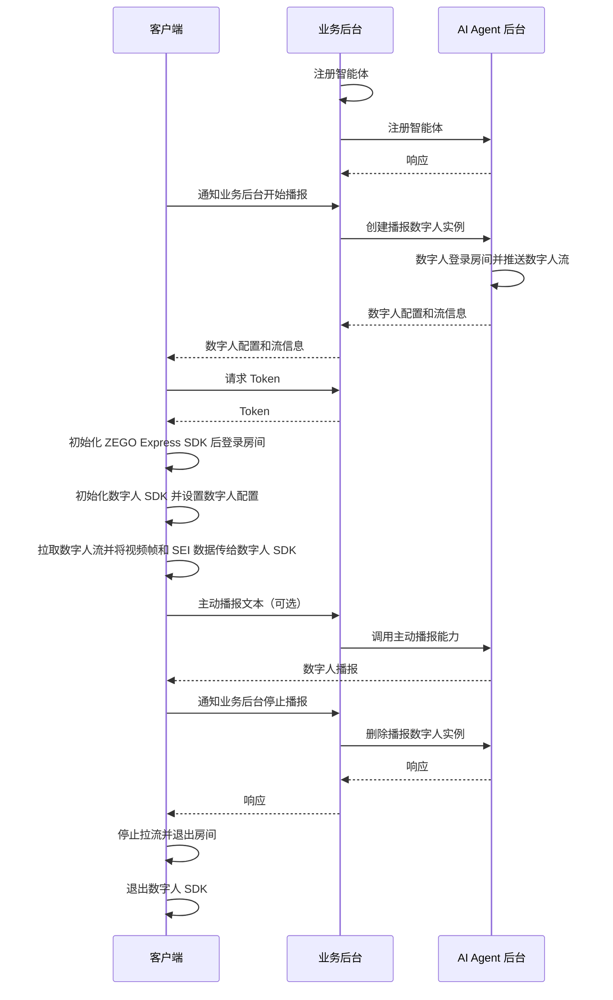
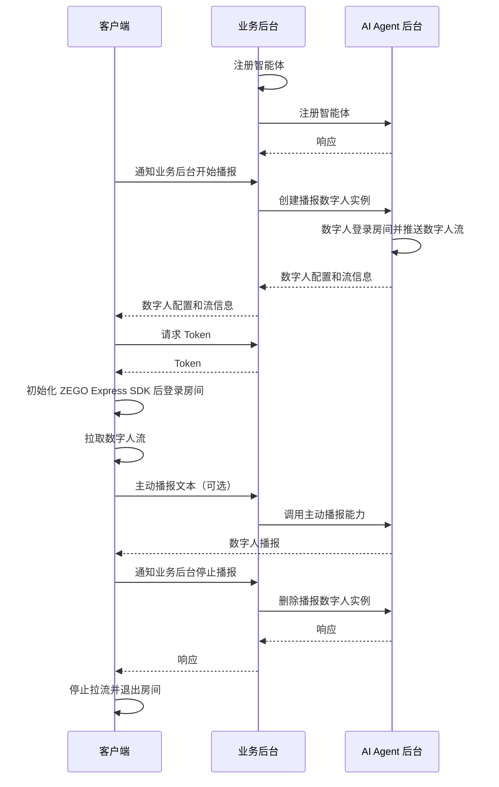

import {getPlatformData} from "/snippets/utils-content-parser.js"


export const expressSDKMap = {
  'Android': <a href='/real-time-voice-android/quick-start/integrating-sdk' target='_blank'>ZEGO Express SDK</a>,
  'iOS': <a href='/real-time-voice-ios/quick-start/integrating-sdk' target='_blank'>ZEGO Express SDK</a>,
  'Web': <a href='/real-time-voice-web/quick-start/integrating-sdk' target='_blank'>ZEGO Express SDK</a>,
}

# 实现数字人播报

本文档用于说明如何快速集成客户端 SDK（ZEGO Express SDK 和数字人 SDK）并实现数字人播报。

与数字人视频通话不同，数字人播报是单向观看场景：客户端只需要登录 RTC 房间并拉取数字人流，不需要采集或推送用户的音视频流。创建播报实例后，还可以通过 TTS 接口主动让数字人播报指定文本。

## 播报数字人介绍

仅需一张上半身的真人或二次元照片或图片，即可获得 1080P、口型准确、形象逼真的数字人。播报数字人适用于数字人直播、新闻播报、活动主持、固定话术播报等场景。

- 更自然的驱动效果：支持轻微的身体动作，面部表情自然不变形；
- 多语种口型准确：唇形准确自然，尤其针对中英文效果更佳；
- 互动超低延迟：数字人驱动延迟 < 200ms；
- 更高清晰度：真实 1080P 效果。

可跳转至[下载页面](./introduction/download.mdx)下载体验。

<Video src="https://doc-media.zego.im/docuo/9f0143abe9.mp4" />

### 与数字人视频通话的区别

| 对比项 | 数字人视频通话 | 数字人播报 |
| --- | --- | --- |
| 交互方式 | 双向，用户说话后数字人回答 | 单向，用户观看数字人播报 |
| 是否推本地流 | 是 | 否 |
| 是否需要麦克风权限 | 是 | 否 |
| 创建实例接口 | `/api/start-digital-human` | `/api/start-live-digital-human` |
| 是否需要 `user_id`、`user_stream_id` | 是 | 否 |
| 主动播报 | 可选 | 通过 `/api/send-agent-instance-tts` 实现 |

## 前提条件

- 已在 [ZEGO 控制台](https://console.zego.im/) 创建项目，并申请有效的 AppID 和 AppSign，详情请参考 [控制台 - 项目信息](/console/project-info)。
- 已联系 ZEGO 技术支持开通数字人 PaaS 服务和相关接口的权限。
- 已联系 ZEGO 技术支持创建数字人，并获取有效的 `digital_human_id`。
- 已按 [业务后台快速开始指引](/aiagent-server/quick-start-with-live-digital-human) 集成播报数字人相关服务端 API。
:::if{props.platform="undefined|iOS"}
- 已从[下载页面](./introduction/download.mdx)下载针对 AI Agent 优化的 ZEGO Express SDK，并集成到项目中。
:::
:::if{props.platform="Web"}
- 已联系 ZEGO 技术支持获取针对 AI Agent 优化的 ZEGO Express SDK，并集成到项目中。
:::

<Warning title="注意">
数字人播报不需要录音权限，也不会推送本地流。若同一个应用还包含语音通话或数字人视频通话入口，其他入口仍需要按对应文档申请录音权限。
</Warning>

## 示例代码

以下是接入实时互动 AI Agent API 的业务后台示例代码，您可以参考示例代码来实现自己的业务逻辑。

<CardGroup cols={2}>
<Card title="业务后台示例代码" href="https://github.com/ZEGOCLOUD/ai_agent_quick_start_server" target="_blank">
包含获取 ZEGO Token、注册智能体、创建播报数字人实例、主动调用 TTS 和停止实例等能力。
</Card>
</CardGroup>

以下是客户端示例代码，您可以参考示例代码来实现自己的业务逻辑。

<CardGroup cols={2}>
:::if{props.platform=undefined}
<Card title="Android 客户端示例代码" href="https://github.com/ZEGOCLOUD/ai_agent_quick_start/tree/master/android" target="_blank">
入口为 `StartLiveDigitalHumanCall`，对应 `video.LiveDigitalHumanActivity`，包含登录、拉流、数字人渲染、主动 TTS 和退出房间等能力。
</Card>
:::
:::if{props.platform="iOS"}
<Card title="iOS 客户端示例代码" href="https://github.com/ZEGOCLOUD/ai_agent_quick_start/tree/master/ios" target="_blank">
入口为 `StartLiveDigitalHuman`，通过数字人页面的播报模式完成登录、拉流、数字人渲染、主动 TTS 和退出房间。
</Card>
:::
:::if{props.platform="Web"}
<Card title="Web 客户端示例代码" href="https://github.com/ZEGOCLOUD/ai_agent_quick_start/tree/master/web" target="_blank">
入口为 `Start Live Digital Human`，包含登录、拉流、主动 TTS 和退出房间等能力。
</Card>
:::
</CardGroup>

:::if{props.platform="undefined|Web"}
以下视频演示了如何跑通服务端和客户端（Web）示例代码并跟智能体进行语音互动。
<Video src="https://doc-media.zego.im/docuo/557a014d7c.mp4" />
:::
:::if{props.platform="iOS"}
以下视频演示了如何跑通服务端和客户端（iOS）示例代码并跟智能体进行语音互动。
<Video src="https://doc-media.zego.im/docuo/aaaa65c2d4.mp4" />
:::

## 整体业务流程

1. 服务端，参考[业务后台快速开始](/aiagent-server/quick-start)文档跑通业务后台示例代码，部署好业务后台
    - 接入实时互动 AI Agent API 管理智能体。
:::if{props.platform="Web"}
2. 客户端，跑通示例代码
    - 通过业务后台创建和管理智能体。
    - 集成  {getPlatformData(props,expressSDKMap)} 完成实时通信。
:::
:::if{props.platform="undefined|iOS"}
2. 客户端，跑通示例代码
    - 通过业务后台创建和管理智能体。
    - 集成  {getPlatformData(props,expressSDKMap)} 和数字人 SDK 完成实时通信。
:::

完成以上两个步骤后即可实现观看数字人播报。

:::if{props.platform="undefined|iOS"}

:::
:::if{props.platform="Web"}

:::

## 核心能力实现

### 集成 ZEGO Express SDK

:::if{props.platform=undefined}

请参考 [集成 SDK > 2.2 > 方式 2](https://doc-zh.zego.im/real-time-voice-android/quick-start/integrating-sdk) 手动集成 SDK。示例工程使用 `ZegoExpressEngine` 和 `ZegoDigitalMobile`。

在 `app/build.gradle` 中添加数字人 SDK：

```groovy app/build.gradle
dependencies {
    implementation fileTree(dir: 'libs', include: ['*.jar'])
    implementation 'im.zego:digitalmobile:1.3.0.43'
}
```

在 `AndroidManifest.xml` 中声明网络权限。播报数字人场景不需要声明或申请 `RECORD_AUDIO`：

```xml AndroidManifest.xml
<uses-permission android:name="android.permission.ACCESS_NETWORK_STATE" />
<uses-permission android:name="android.permission.INTERNET" />
```

<Warning title="与视频通话的差异">
Android quickstart 为了同时支持语音通话和数字人视频通话，Manifest 中仍保留了 `RECORD_AUDIO`；进入 `LiveDigitalHumanActivity` 时不会申请该权限，也不会创建本地音频流。只保留播报入口时可以移除该权限。
</Warning>

播报场景无需运行时申请录音权限，进入页面后可直接初始化 Express SDK：

```java {3}
ZegoEngineProfile profile = new ZegoEngineProfile();
profile.appID = appID; // 从 ZEGO 控制台获取
profile.scenario = ZegoScenario.HIGH_QUALITY_CHATROOM;
profile.application = getApplication();
ZegoExpressEngine.createEngine(profile, null);
```

:::

:::if{props.platform="iOS"}

iOS quickstart 通过 CocoaPods 集成 SDK：

```ruby Podfile
target 'ai_agent_quickstart' do
  use_frameworks! :linkage => :static
  use_modular_headers!

  pod 'ZegoExpressEngine', :path => 'libs/Express'
  pod 'Masonry', '1.1.0'
  pod 'ZegoDigitalMobile', '>= 1.3.0'
end
```

播报数字人是单向观看场景，不需要在 `Info.plist` 中添加 `NSMicrophoneUsageDescription`，也不需要调用 `requestRecordPermission:`。如果同一个应用还支持数字人视频通话，可以保留视频通话所需的麦克风权限声明。

初始化播报页面时直接调用 `ZegoExpressEngine`，不申请麦克风权限：

```objc
- (void)initZegoExpressEngine {
    ZegoEngineProfile *profile = [[ZegoEngineProfile alloc] init];
    profile.appID = appID; // 从 ZEGO 控制台获取
    profile.scenario = ZegoScenarioHighQualityChatroom;
    [ZegoExpressEngine createEngineWithProfile:profile eventHandler:self];
}
```

:::

:::if{props.platform="Web"}

Web quickstart 使用 `zego-express-engine-webrtc`。播报入口不创建音频流、不调用 `startPublishingStream`，因此不需要麦克风权限：

```ts
const zg = new ZegoExpressEngine(appID, server);
const loginResult = await zg.loginRoom(roomID, token, {
    userID,
    userName,
});

if (!loginResult) {
  throw new Error("登录 RTC 房间失败");
}
```

当前 quickstart 的公共初始化逻辑仍会调用 `checkSystemRequirements` 检查 WebRTC 和麦克风能力，以兼容语音通话入口；如果您的 Web 应用只实现数字人播报，可以移除麦克风检查。

:::

:::if{props.platform="undefined"}

### 集成数字人 SDK

<div>
数字人 SDK 已经发布在 Maven 仓库，可参考以下步骤将 SDK 集成到项目中。
<Steps>
<Step title="添加 `maven` 配置">
根据您的 Android Gradle 插件版本，选择对应的实现步骤。

<Tabs>
<Tab title="7.1.0 或更高版本">
进入项目根目录，打开 `settings.gradle` 文件，在 `dependencyResolutionManagement` > `repositories` 中添加 Maven 仓库，示例代码如下：
```groovy {6}
dependencyResolutionManagement {
  repositoriesMode.set(RepositoriesMode.FAIL_ON_PROJECT_REPOS)
  repositories {
      google()
      mavenCentral()
      maven { url 'https://maven.zego.im' }   // <- 添加这行。
  }
}
```
</Tab>
<Tab title="低于 7.1.0 的版本">
进入项目根目录，打开 `build.gradle` 文件，在 `allprojects`->`repositories` 中添加 Maven 仓库，示例代码如下：
```groovy
allprojects {
    repositories {
        google()
        mavenCentral()
        maven { url 'https://maven.zego.im' }   // <- 添加这行。
    }
}
```
</Tab>
</Tabs>
</Step>
<Step title="修改您的 app 级别的 build.gradle 文件">
```groovy
dependencies {
    ...
    // 数字人 SDK 依赖
    implementation "im.zego:digitalmobile:1.3.0.43"
}
```
<Warning title="注意">支持 Android 6.0 (API 23) 及以上版本系统。</Warning>
</Step>
</Steps>
</div>

:::

:::if{props.platform="iOS"}

### 集成数字人 SDK

<div>

<Warning title="注意">支持 iOS 12 及以上版本系统。</Warning>

<Tabs>
<Tab title="使用 Cocoapods 集成">
<Steps>
  <Step title="在 Podfile 中添加依赖">
    ```ruby
    pod 'ZegoDigitalMobile', '>= 1.3.0'
    ```
  </Step>
  <Step title="安装 SDK">
    在项目根目录下执行：
    ```bash
    pod repo update && pod install
    ```
  </Step>
</Steps>
</Tab>
<Tab title="手动集成">
<Steps>
  <Step title="下载最新版本的 SDK">
    请下载最新版本的 [SDK](https://artifact-node.zego.cloud/generic/digithuman/public/ZegoDigitalMobile/release/ios/ZegoDigitalMobile.zip?version=1.3.0.53)。
  </Step>
  <Step title="解压 SDK">
    将 SDK 包解压至项目目录下，例如“libs”文件夹下。
    <Frame width="512" height="auto" caption="">
      
    </Frame>
  </Step>
  <Step>
    选择“TARGETS > General > Frameworks, Libraries, and Embedded Content”菜单，添加 ZegoDigitalMobile.xcframework，将“Embed”设置为“Embed & Sign”。
    <Frame width="512" height="auto" caption="">
      
    </Frame>
  </Step>
</Steps>
</Tab>
</Tabs>

</div>

:::

### 通知业务后台创建播报数字人实例

客户端调用业务后台的 `POST /api/start-live-digital-human`。RTC 模式下请求体至少包含 `room_id`、`digital_human_id` 和 `config_id`，不需要传 `user_id` 或 `user_stream_id`。

```json
{
  "room_id": "room_xxxxxxxx",
  "digital_human_id": "digital_human_xxxxxxxx",
  "config_id": "mobile"
}
```

其中 Android 和 iOS 的 `config_id` 使用 `mobile`，Web 使用 `web`。服务端成功响应中需要将以下信息返回给客户端：

| 字段 | 用途 |
| --- | --- |
| `agent_instance_id` | 调用主动 TTS 和停止实例接口 |
| `agent_stream_id` | RTC 房间内数字人流的 ID |
| `agent_user_id` | 数字人在 RTC 房间内的用户 ID |
| `digital_human_config` | 初始化 Android/iOS 数字人 SDK 的配置 |

:::if{props.platform=undefined}

Android 使用 `OkHttp` 直接请求业务后台：

```java
private void startLiveDigitalHuman(String baseUrl, String digitalHumanId,
                                   String configId, String roomId) {
    JSONObject bodyJson = new JSONObject();
    bodyJson.put("digital_human_id", digitalHumanId);
    bodyJson.put("config_id", configId);
    bodyJson.put("room_id", roomId);

    RequestBody body = RequestBody.create(
        bodyJson.toString(), MediaType.parse("application/json; charset=utf-8"));
    Request request = new Request.Builder()
        .url(baseUrl + "/api/start-live-digital-human")
        .post(body)
        .build();

    new OkHttpClient().newCall(request).enqueue(new Callback() {
        @Override
        public void onFailure(@NonNull Call call, @NonNull IOException e) {
            // 处理网络错误
        }

        @Override
        public void onResponse(@NonNull Call call, @NonNull Response response)
            throws IOException {
            JSONObject result = new JSONObject(response.body().string());
            if (result.getInt("code") == 0) {
                String agentInstanceId = result.getString("agent_instance_id");
                String agentStreamId = result.getString("agent_stream_id");
                String digitalHumanConfig = result.getString("digital_human_config");
                // 保存 agentInstanceId，后续用于 TTS 和 stop
                startPlayingStream(agentStreamId);
                initDigitalMobileSDK(digitalHumanConfig);
            }
        }
    });
}
```

:::

:::if{props.platform="iOS"}

iOS 使用 `NSURLSession` 直接请求业务后台，并保存响应中的实例 ID、流 ID 和数字人配置：

```objc
- (void)startLiveDigitalHuman {
    NSURL *url = [NSURL URLWithString:
        [baseURL stringByAppendingString:@"/api/start-live-digital-human"]];
    NSMutableURLRequest *request = [NSMutableURLRequest requestWithURL:url];
    request.HTTPMethod = @"POST";
    [request setValue:@"application/json" forHTTPHeaderField:@"Content-Type"];

    NSDictionary *params = @{
        @"digital_human_id": digitalHumanId,
        @"config_id": @"mobile",
        @"room_id": roomID,
    };
    request.HTTPBody = [NSJSONSerialization dataWithJSONObject:params options:0 error:nil];

    [[[NSURLSession sharedSession] dataTaskWithRequest:request
        completionHandler:^(NSData *data, NSURLResponse *response, NSError *error) {
        NSDictionary *result = [NSJSONSerialization JSONObjectWithData:data options:0 error:nil];
        if (error == nil && [result[@"code"] integerValue] == 0) {
            agentInstanceId = result[@"agent_instance_id"];
            agentStreamId = result[@"agent_stream_id"];
            NSString *config = result[@"digital_human_config"];
            [self initDigitalMobileSDK:config];
        }
    }] resume];
}
```

:::

:::if{props.platform="Web"}

Web 使用 `fetch` 直接请求业务后台。示例只传 RTC 房间 ID，因此不会传本地用户或本地流信息：

```ts
async function startLiveDigitalHuman(roomId: string) {
  const response = await fetch(`${baseURL}/api/start-live-digital-human`, {
    method: "POST",
    headers: { "Content-Type": "application/json" },
    body: JSON.stringify({
    digital_human_id: config.digitalHuman.id,
    config_id: config.digitalHuman.configId,
    room_id: roomId,
    }),
  });
  const result = await response.json();
  if (result.code !== 0) throw new Error(result.message);
  return result;
}
```

:::

### 用户进入房间（不推流）

播报数字人只需要登录 RTC 房间并接收数字人流，客户端不需要创建本地流或调用 `startPublishingStream`。

:::if{props.platform=undefined}

Android 需要先用 `OkHttp` 从业务后台获取 Token，再直接调用 Express SDK 登录房间。登录成功后开启自定义视频渲染，再创建播报数字人实例：

```java
String tokenUrl = baseUrl + "/api/zego-token?userId=" + userId;
Request tokenRequest = new Request.Builder().url(tokenUrl).get().build();
new OkHttpClient().newCall(tokenRequest).enqueue(new Callback() {
    @Override
    public void onResponse(@NonNull Call call, @NonNull Response response)
        throws IOException {
        String token = new JSONObject(response.body().string()).getString("token");

        ZegoEngineConfig engineConfig = new ZegoEngineConfig();
        engineConfig.advancedConfig = new HashMap<String, String>() {{
            put("set_audio_volume_ducking_mode", "1");
            put("enable_rnd_volume_adaptive", "true");
            put("sideinfo_callback_version", "3");
            put("sideinfo_bound_to_video_decoder", "true");
        }};
        ZegoExpressEngine.setEngineConfig(engineConfig);

        ZegoRoomConfig roomConfig = new ZegoRoomConfig();
        roomConfig.isUserStatusNotify = true;
        roomConfig.token = token;
        ZegoExpressEngine.getEngine().loginRoom(
            roomId, new ZegoUser(userId, userId), roomConfig,
            (errorCode, extendedData) -> {
                if (errorCode == 0) {
                    openExpressCustomRender();
                    startLiveDigitalHuman(baseUrl, digitalHumanId, "mobile", roomId);
                }
            });
    }

    @Override
    public void onFailure(@NonNull Call call, @NonNull IOException e) {
        // 处理获取 Token 失败
    }
});
```

:::

:::if{props.platform="iOS"}

iOS 使用 `NSURLSession` 获取 Token，再直接调用 `loginRoom`。播报场景不调用 `startPublishingStream`：

```objc
- (void)loginRoomForBroadcast:(NSString *)token {
    ZegoRoomConfig *roomConfig = [[ZegoRoomConfig alloc] init];
    roomConfig.isUserStatusNotify = YES;
    roomConfig.token = token;

    ZegoUser *user = [[ZegoUser alloc] initWithUserID:userID userName:userID];
    [[ZegoExpressEngine sharedEngine] loginRoom:roomID
                                           user:user
                                         config:roomConfig
                                        callback:^(int errorCode, NSDictionary *extendedData) {
        if (errorCode == 0) {
            [self enableCustomVideoRender];
            [self startLiveDigitalHuman];
        }
    }];
}
```

:::

:::if{props.platform="Web"}

Web 直接登录房间，播报场景不创建音频流或推送本地流：

```ts
await zg.loginRoom(roomID, token, { userID, userName });
const result = await startLiveDigitalHuman(roomID);
const agentStreamId = result.agent_stream_id;
```

:::

### 初始化数字人 SDK 和自定义渲染

Android 和 iOS 需要将 Express 收到的原始视频帧与 SEI 数据传递给数字人 SDK，再由数字人 SDK 渲染数字人画面。必须在调用 `startPlayingStream` 之前开启自定义视频渲染。

:::if{props.platform=undefined}

Android 初始化数字人 SDK：

```java
private void initDigitalMobileSDK(String digitalHumanConfig) {
    digitalMobileSDK = ZegoDigitalHuman.create(this);
    digitalMobileSDK.start(digitalHumanConfig,
        new IZegoDigitalMobile.ZegoDigitalMobileListener() {
            @Override
            public void onSurfaceFirstFrameDraw() {
                loadingView.setVisibility(View.GONE);
                digitalPic.setVisibility(View.GONE);
            }
        });
    digitalMobileSDK.attach(digitalView);
}
```

在 `openExpressCustomRender` 中配置 RAW_DATA，并将回调数据转发给数字人 SDK：

```java
private void openExpressCustomRender() {
    ZegoCustomVideoRenderConfig renderConfig = new ZegoCustomVideoRenderConfig();
    renderConfig.bufferType = ZegoVideoBufferType.RAW_DATA;
    renderConfig.frameFormatSeries = ZegoVideoFrameFormatSeries.RGB;
    renderConfig.enableEngineRender = false;
    ZegoExpressEngine.getEngine().enableCustomVideoRender(true, renderConfig);

    ZegoExpressEngine.getEngine().setCustomVideoRenderHandler(
        new IZegoCustomVideoRenderHandler() {
            @Override
            public void onRemoteVideoFrameRawData(
                ByteBuffer[] data, int[] dataLength, ZegoVideoFrameParam param,
                String streamID) {
                IZegoDigitalMobile.ZegoVideoFrameParam digitalParam =
                    new IZegoDigitalMobile.ZegoVideoFrameParam();
                digitalParam.format =
                    IZegoDigitalMobile.ZegoVideoFrameFormat.getZegoVideoFrameFormat(
                        param.format.value());
                digitalParam.height = param.height;
                digitalParam.width = param.width;
                digitalParam.rotation = param.rotation;
                for (int i = 0; i < 4; i++) {
                    digitalParam.strides[i] = param.strides[i];
                }

                if (digitalMobileSDK != null) {
                    digitalMobileSDK.onRemoteVideoFrameRawData(
                        data, dataLength, digitalParam, streamID);
                }
            }
        });

    ZegoExpressEngine.getEngine().setEventHandler(new IZegoEventHandler() {
        @Override
        public void onPlayerSyncRecvSEI(String streamID, byte[] data) {
            if (digitalMobileSDK != null) {
                digitalMobileSDK.onPlayerSyncRecvSEI(streamID, data);
            }
        }
    });
}
```

:::

:::if{props.platform="iOS"}

iOS 在 `startPlayingStream` 前调用 `enableCustomVideoRender`，并在数字人事件处理器中转发视频帧和 SEI：

```objc
- (BOOL)enableCustomVideoRender {
    ZegoCustomVideoRenderConfig *renderConfig =
        [[ZegoCustomVideoRenderConfig alloc] init];
    renderConfig.bufferType = ZegoVideoBufferTypeRawData;
    renderConfig.frameFormatSeries = ZegoVideoFrameFormatSeriesRGB;
    renderConfig.enableEngineRender = NO;

    ZegoExpressEngine *engine = [ZegoExpressEngine sharedEngine];
    if (!engine) {
        return NO;
    }

    [engine enableCustomVideoRender:YES config:renderConfig];
    [engine setCustomVideoRenderHandler:self];
    return YES;
}

- (void)onRemoteVideoFrameRawData:(unsigned char **)data
                       dataLength:(unsigned int *)dataLength
                            param:(ZegoVideoFrameParam *)param
                         streamID:(NSString *)streamID {
    ZDMVideoFrameParam *digitalParam = [[ZDMVideoFrameParam alloc] init];
    digitalParam.format = (ZDMVideoFrameFormat)param.format;
    digitalParam.width = param.size.width;
    digitalParam.height = param.size.height;
    digitalParam.rotation = param.rotation;

    for (int i = 0; i < 4; i++) {
        [digitalParam setStride:param.strides[i] atIndex:i];
    }

    if (self.digitalMobile) {
        [self.digitalMobile onRemoteVideoFrameRawData:data
                                           dataLength:dataLength
                                                param:digitalParam
                                             streamID:streamID];
    }
}

- (void)onPlayerSyncRecvSEI:(NSData *)data streamID:(NSString *)streamID {
    if (self.digitalMobile) {
        [self.digitalMobile onPlayerSyncRecvSEI:streamID data:data];
    }
}
```

:::

:::if{props.platform="Web"}

Web quickstart 不集成 `ZegoDigitalMobile`，直接使用 Express 创建远程流视图并播放音视频：

```ts
const mediaStream = await zg.startPlayingStream(stream.streamID);
const remoteView = await zg.createRemoteStreamView(mediaStream);
remoteView?.playAudio();
remoteView?.playVideo("remoteSteamView");
```

:::

### 拉取数字人流

创建实例后，客户端使用服务端返回的 `agent_stream_id` 拉取数字人流。不同平台 quickstart 的拉流时机略有不同：Android 在创建实例接口成功后直接拉流；iOS 和 Web 通过房间流更新回调，匹配目标流后再拉流。

:::if{props.platform=undefined}

Android quickstart 在创建播报数字人实例成功后直接拉取 `agent_stream_id`，不使用 `onRoomStreamUpdate`：

```java
ZegoExpressEngine.getEngine()
    .setPlayStreamBufferIntervalRange(agent_stream_id, 100, 2000);
ZegoExpressEngine.getEngine().startPlayingStream(agent_stream_id);
```

:::

:::if{props.platform="iOS"}

监听 `onRoomStreamUpdate`，仅在房间内出现服务端返回的 `agentStreamId` 时开始拉流：

```objc
- (void)startPlayStream:(NSString *)streamId {
    [[ZegoExpressEngine sharedEngine]
        setPlayStreamBufferIntervalRange:streamId min:0 max:2000];
    [[ZegoExpressEngine sharedEngine] startPlayingStream:streamId];
}

- (void)onRoomStreamUpdate:(ZegoUpdateType)updateType
                streamList:(NSArray<ZegoStream *> *)streamList
              extendedData:(nullable NSDictionary *)extendedData
                    roomID:(NSString *)roomID {
    if (updateType == ZegoUpdateTypeAdd) {
        for (ZegoStream *stream in streamList) {
            if ([stream.streamID isEqualToString:self.agentStreamId]) {
                [self startPlayStream:self.agentStreamId];
                break;
            }
        }
    } else if (updateType == ZegoUpdateTypeDelete) {
        for (ZegoStream *stream in streamList) {
            if ([stream.streamID isEqualToString:self.agentStreamId]) {
                [[ZegoExpressEngine sharedEngine] stopPlayingStream:stream.streamID];
            }
        }
    }
}
```

:::

:::if{props.platform="Web"}

监听 `roomStreamUpdate`，匹配 `agentStreamId` 后创建远程流视图。Web quickstart 还通过 `remoteCameraStatusUpdate` 监听视频状态并开始播放画面：

```ts
let remoteView: any = null;

zg.on(
  "roomStreamUpdate",
  async (
    roomID: string,
    updateType: "DELETE" | "ADD",
    streamList: ZegoStreamList[],
  ) => {
    if (updateType === "ADD" && streamList.length > 0) {
      for (const stream of streamList) {
        const mediaStream = await zg.startPlayingStream(stream.streamID);
        remoteView = await zg.createRemoteStreamView(mediaStream);
        remoteView?.playAudio();
        break;
      }
    }
  },
);

zg.on(
  "remoteCameraStatusUpdate",
  (streamID: string, status: "OPEN" | "MUTE") => {
    if (streamID === agentStreamId && status === "OPEN") {
      remoteView?.playVideo("remoteSteamView");
    }
  }
);
```

:::

### 主动让数字人播报文本

数字人实例创建成功后，客户端调用业务后台 `POST /api/send-agent-instance-tts`，传入实例 ID 和文本：

```json
{
  "agent_instance_id": "2075416950128779264",
  "text": "尊敬的开发者你好，欢迎使用 ZEGO AI Agent。"
}
```

`text` 最大长度不超过 300 个字符。还可以按业务需要传入 `add_history`、`interrupt_mode`、`priority`、`same_priority_option` 和 `enqueue_user_speech` 等参数。详细说明请参考[主动调用 TTS](/aiagent-server/guides/proactive-invocation-of-llm-and-tts)。

:::if{props.platform=undefined}

Android 使用 `OkHttp` 直接调用 TTS 接口：

```java
JSONObject bodyJson = new JSONObject();
bodyJson.put("agent_instance_id", agentInstanceId);
bodyJson.put("text", text);

Request request = new Request.Builder()
    .url(baseUrl + "/api/send-agent-instance-tts")
    .post(RequestBody.create(bodyJson.toString(),
        MediaType.parse("application/json; charset=utf-8")))
    .build();
new OkHttpClient().newCall(request).enqueue(new Callback() {
    @Override
    public void onResponse(@NonNull Call call, @NonNull Response response)
        throws IOException {
        JSONObject result = new JSONObject(response.body().string());
        if (result.getInt("code") != 0) {
            // 处理 TTS 请求失败
        }
    }

    @Override
    public void onFailure(@NonNull Call call, @NonNull IOException e) {
        // 处理网络错误
    }
});
```

:::

:::if{props.platform="iOS"}

```objc
NSDictionary *params = @{
    @"agent_instance_id": agentInstanceId,
    @"text": text,
};
NSURL *url = [NSURL URLWithString:
    [baseURL stringByAppendingString:@"/api/send-agent-instance-tts"]];
NSMutableURLRequest *request = [NSMutableURLRequest requestWithURL:url];
request.HTTPMethod = @"POST";
[request setValue:@"application/json" forHTTPHeaderField:@"Content-Type"];
request.HTTPBody = [NSJSONSerialization dataWithJSONObject:params options:0 error:nil];

[[NSURLSession.sharedSession dataTaskWithRequest:request
    completionHandler:^(NSData *data, NSURLResponse *response, NSError *error) {
    NSDictionary *result = [NSJSONSerialization JSONObjectWithData:data options:0 error:nil];
    if (error == nil && [result[@"code"] integerValue] == 0) {
        NSLog(@"播报发送成功");
    }
}] resume];
```

:::

:::if{props.platform="Web"}

```ts
const response = await fetch(`${baseURL}/api/send-agent-instance-tts`, {
  method: "POST",
  headers: { "Content-Type": "application/json" },
  body: JSON.stringify({
    agent_instance_id: agentInstanceId,
    text,
  }),
});
const result = await response.json();
if (result.code !== 0) throw new Error(result.message);
```

Web quickstart 会在播报模式下显示 TTS 输入框，并将服务端返回的 `agent_instance_id` 保存到页面状态。

:::

### 退出房间结束播报

退出时需要停止 Agent 实例、停止拉流、退出 RTC 房间并销毁客户端 SDK。无论停止接口是否成功，都应释放 RTC 资源，避免房间和引擎残留。

:::if{props.platform=undefined}

```java
@Override
protected void onDestroy() {
    super.onDestroy();
    JSONObject bodyJson = new JSONObject();
    bodyJson.put("agent_instance_id", agentInstanceId);
    Request request = new Request.Builder()
        .url(baseUrl + "/api/stop")
        .post(RequestBody.create(bodyJson.toString(),
            MediaType.parse("application/json; charset=utf-8")))
        .build();
    new OkHttpClient().newCall(request).enqueue(new Callback() {
        @Override
        public void onResponse(@NonNull Call call, @NonNull Response response) {
            ZegoExpressEngine.getEngine().stopPlayingStream(agentStreamId);
            ZegoExpressEngine.getEngine().logoutRoom();
            digitalMobile.stop();
            ZegoExpressEngine.destroyEngine(null);
        }

        @Override
        public void onFailure(@NonNull Call call, @NonNull IOException e) {
            // 即使请求失败，也应释放本地 RTC 和数字人 SDK 资源
            ZegoExpressEngine.getEngine().logoutRoom();
            digitalMobile.stop();
            ZegoExpressEngine.destroyEngine(null);
        }
    });
}
```

:::

:::if{props.platform="iOS"}

```objc
- (void)stopLiveDigitalHuman {
    NSDictionary *params = @{ @"agent_instance_id": agentInstanceId };
    NSURL *url = [NSURL URLWithString:
        [baseURL stringByAppendingString:@"/api/stop"]];
    NSMutableURLRequest *request = [NSMutableURLRequest requestWithURL:url];
    request.HTTPMethod = @"POST";
    [request setValue:@"application/json" forHTTPHeaderField:@"Content-Type"];
    request.HTTPBody = [NSJSONSerialization dataWithJSONObject:params options:0 error:nil];

    [[[NSURLSession sharedSession] dataTaskWithRequest:request
        completionHandler:^(NSData *data, NSURLResponse *response, NSError *error) {
        [[ZegoExpressEngine sharedEngine] stopPlayingStream:agentStreamId];
        [[ZegoExpressEngine sharedEngine] logoutRoom];
        [digitalMobile stop];
        [ZegoExpressEngine destroyEngine:nil];
    }] resume];
}
```

:::

:::if{props.platform="Web"}

```ts
async function logoutRoom() {
  await fetch(`${baseURL}/api/stop`, {
    method: "POST",
    headers: { "Content-Type": "application/json" },
    body: JSON.stringify({ agent_instance_id: agentInstanceId }),
  });
  zg.stopPlayingStream(agentStreamId);
  zg.logoutRoom(roomID);
  agentInstanceId = "";
}
```

播报场景没有本地音频流，不需要销毁音频采集流。

:::

## RTC 和 CDN 模式

本文以 RTC 模式为例：客户端登录房间并拉取 `agent_stream_id`。如果需要大规模直播，可以使用 CDN 模式：

| 模式 | 创建实例参数 | 客户端播放方式 | 适用场景 |
| --- | --- | --- | --- |
| RTC | `room_id` | Express SDK 拉取 RTC 流 | 低延迟、小范围互动 |
| CDN | `cdn_url` | 使用播放器拉取 CDN 流 | 大规模直播 |

RTC 和 CDN 模式都使用 `agent_instance_id` 调用主动 TTS 和停止实例接口。CDN 模式不需要客户端登录 RTC 房间，也不需要集成数字人 SDK。

## 监听异常回调

请监听 Express SDK 的房间登录、拉流状态和错误回调，并在业务后台记录 `agent_instance_id`、`agent_stream_id`、`request_id` 和错误信息，便于定位创建实例、拉流或 TTS 失败原因。

<Warning title="注意">
如果数字人画面停留在静态图，请重点检查：数字人配置是否有效、`agent_stream_id` 是否正确、是否在 `startPlayingStream` 前开启了自定义视频渲染，以及是否将视频帧和 SEI 数据传给了数字人 SDK。
</Warning>
