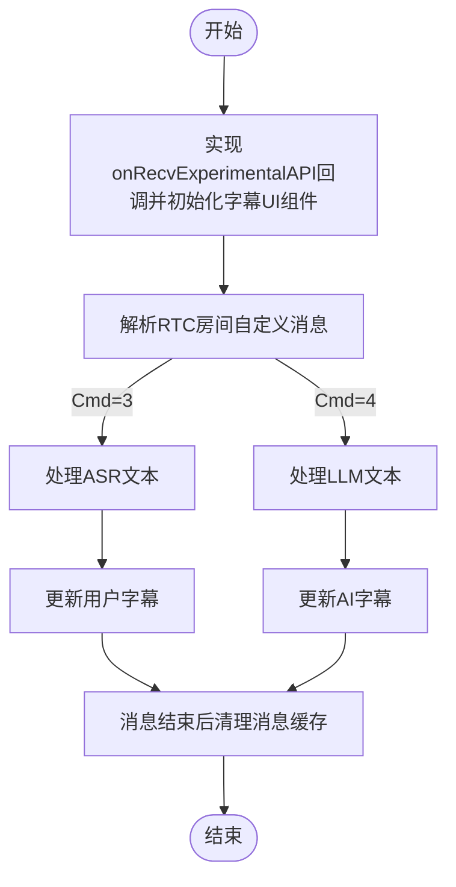
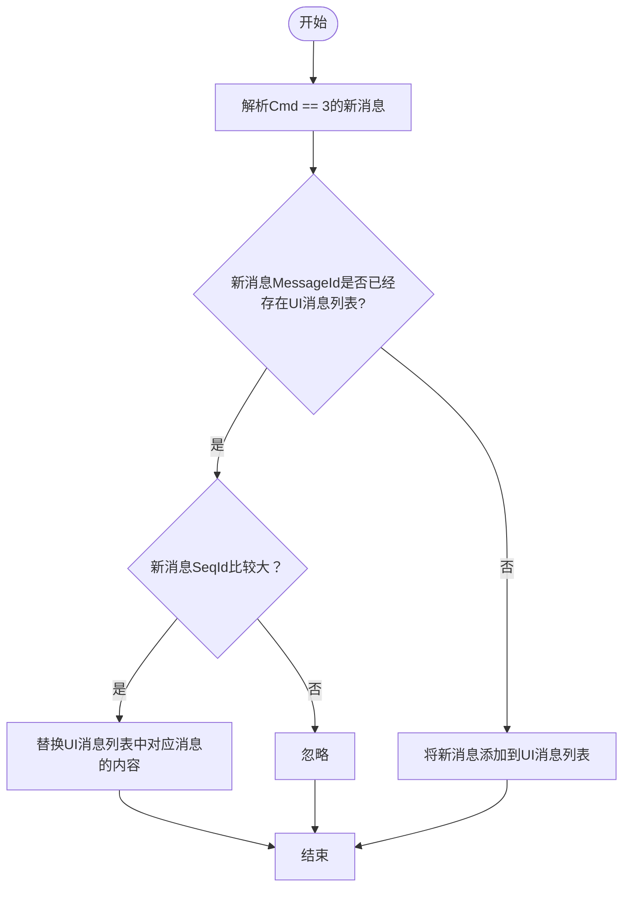
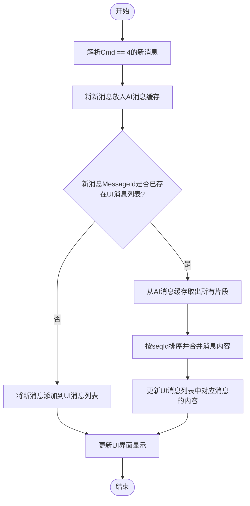

# 展示字幕

---

本文介绍如何展示用户在与 AI 进行语音通话的过程中的字幕。如下：

- 用户说话内容：流式展示用户正在说的话（语音识别（ASR）的实时结果）
- AI 说话内容：流式展示 AI 输出的内容（大语言模型（LLM）实时的输出结果）

<Frame width="auto" height="512" caption="">
  
</Frame>

## 前提条件

已按照 [快速开始](./../Quick%20start.mdx) 文档集成 ZEGO Express SDK 和 AI Agent 并实现基本的语音通话功能。

## 快速实现

用户与 AI 进行语音对话期间，AI Agent 服务端通过 RTC 房间自定义消息下发 ASR 识别文本和 LLM 回答的文本。客户端可以监听房间自定义消息，解析对应的状态事件来渲染 UI 。

RTC 房间自定义消息的处理流程如下：



### 监听房间自定义消息

:::if{props.platform=undefined}
客户端可通过监听 `onRecvExperimentalAPI` 回调获取 `method` 为 `liveroom.room.on_recive_room_channel_message` 的房间自定义消息。以下是监听回调的示例代码：

```java {1,3,14}
ZegoExpressEngine.getEngine().setEventHandler(new IZegoEventHandler() {
    @Override
    public void onRecvExperimentalAPI(String content) {
        super.onRecvExperimentalAPI(content);
        try {
            // 第一步：将 content 解析为 JSONObject
            JSONObject json = new JSONObject(content);

            // 第二步：检查 method 字段的值
            if (json.has("method") && json.getString("method")
                .equals("liveroom.room.on_recive_room_channel_message")) {
                // 第三步：获取 params 并解析
                JSONObject paramsObject = json.getJSONObject("params");
                String msgContent = paramsObject.getString("msg_content");

                // JSON 字符串示例："{\"Timestamp\":1745224717,\"SeqId\":1467995418,\"Round\":2132219714,\"Cmd\":3,\"Data\":{\"MessageId\":\"2135894567\",\"Text\":\"你\",\"EndFlag\":false}}"
                // 假设 AudioChatTextMessage 有构造函数或方法来解析 JSON 字符串
                audioChatMessageParser.parseAudioChatMessage(msgContent);
            }
        } catch (JSONException e) {
            e.printStackTrace();
        }
    }
});
```
:::
:::if{props.platform="iOS"}
客户端可以通过实现ZegoEventHandler协议，监听 `onRecvExperimentalAPI` 回调获取 `method` 为 `liveroom.room.on_recive_room_channel_message` 的房间自定义消息。以下是监听回调的示例代码：
<CodeGroup>
```swift YourViewController.h
// 实现ZegoEventHandler协议
@interface YourService () <ZegoEventHandler>
@property (nonatomic, strong) YourViewController *youViewController;
@end

@implementation YourService

// 处理express onRecvExperimentalAPI接收到的消息
- (void)onRecvExperimentalAPI:(NSString *)content {
    // 转发给view解析消息内容
    [self.youViewController handleExpressExperimentalAPIContent:content];
}

@end // YourService implementation
```

```swift YourViewController.m
// 在头文件中实现ZegoEventHandler协议
@interface YourViewController () <ZegoEventHandler>

@end

@implementation YourViewController

// 解析自定义信令消息
- (void)handleExpressExperimentalAPIContent:(NSString *)content {
    // 解析JSON内容
    NSError *error;
    NSData *jsonData = [content dataUsingEncoding:NSUTF8StringEncoding];
    NSDictionary *contentDict = [NSJSONSerialization JSONObjectWithData:jsonData 
                                                        options:NSJSONReadingMutableContainers 
                                                          error:&error];
    if (error || !contentDict) {
        NSLog(@"JSON解析失败: %@", error);
        return;
    }
    // 检查是否为房间消息
    NSString *method = contentDict[@"method"];
    if (![method isEqualToString:@"liveroom.room.on_recive_room_channel_message"]) {
        return;
    }
    // 获取消息参数
    NSDictionary *params = contentDict[@"params"];
    if (!params) {
        return;
    }
    NSString *msgContent = params[@"msg_content"];
    NSString *sendIdName = params[@"send_idname"];
    NSString *sendNickname = params[@"send_nickname"];
    NSString *roomId = params[@"roomid"];
    if (!msgContent || !sendIdName || !roomId) {
         NSLog(@"parseExperimentalAPIContent 参数不完整: msgContent=%@, sendIdName=%@, roomId=%@",
                msgContent, sendIdName, roomId);
        return;
    }
    
    // JSON 字符串示例："{\"Timestamp\":1745224717,\"SeqId\":1467995418,\"Round\":2132219714,\"Cmd\":3,\"Data\":{\"MessageId\":\"2135894567\",\"Text\":\"你\",\"EndFlag\":false}}"
    // 解析消息内容
    [self handleMessageContent:msgContent userID:sendIdName userName:sendNickname ?: @""];
}

// 处理消息内容
- (void)handleMessageContent:(NSString *)command userID:(NSString *)userID userName:(NSString *)userName{
    NSDictionary* msgDict = [self dictFromJson:command];
    if (!msgDict) {
        return;
    }
  
    // 解析基本信息
    int cmd = [msgDict[@"Cmd"] intValue];
    int64_t seqId = [msgDict[@"SeqId"] longLongValue];
    int64_t round = [msgDict[@"Round"] longLongValue];
    int64_t timestamp = [msgDict[@"Timestamp"] longLongValue];
    NSDictionary *data = msgDict[@"Data"];
  
    // 根据命令类型处理消息
    switch (cmd) {
        case 3: // ASR文本
            [self handleAsrText:data seqId:seqId round:round timestamp:timestamp];
            break;
        case 4: // LLM文本
            [self handleLlmText:data seqId:seqId round:round timestamp:timestamp];
            break;
    }
}

@end // YourViewController implementation
```
</CodeGroup>
:::
:::if{props.platform="Web"}
客户端可通过监听 `recvExperimentalAPI` 回调获取 `method` 为 `onRecvRoomChannelMessage` 的房间自定义消息。以下是监听回调的示例代码：

```javascript {1,3,14}
zg.on("recvExperimentalAPI", (result) => {
  const { method, content } = result;
  if (method === "onRecvRoomChannelMessage") {
    try {
      // 解析消息
      const recvMsg = JSON.parse(content.msgContent);
      const { Cmd, SeqId, Data, Round } = recvMsg;
    } catch (error) {
      console.error("解析消息失败:", error);
    }
  }
});
// 启用 onRecvRoomChannelMessage 实验性 API
zg.callExperimentalAPI({ method: "onRecvRoomChannelMessage", params: {} });
:::

### 房间自定义消息协议

房间自定义消息的各字段说明如下：

| 字段 | 类型 | 描述 |
| --- | --- | --- |
| Timestamp | int64 | 时间戳，秒级别 |
| SeqId | int64 | 包序列号，可能乱序，请根据序列号对消息进行排序。极端情况下 Id 可能不连续。 |
| Round | int64 | 对话轮次，每次用户主动说话轮次增加 |
| Cmd | int | 3: 语音识别（ASR）的文本<br/>4: LLM 文本 |
| Data | Object | 具体内容，各Cmd对应不同Data |

Cmd 不同对应的 Data 也不同，具体如下：

<Tabs>
<Tab title="Cmd 为 3">

| 字段 | 类型 | 描述 |
| --- | --- | --- |
| Text | string | 用户语音识别（ASR）的文本<br/>每次下发的是全量文本，支持文本修正 |
| MessageId | string | 消息 id，每轮 ASR 文本消息 id 唯一 |
| EndFlag | bool | 结束标识，true 表示本轮 ASR 文本已处理完成 |

</Tab>
<Tab title="Cmd 为 4">

| 字段 | 类型 | 描述 |
| --- | --- | --- |
| Text | string | LLM 文本<br/>每次下发增量文本 |
| MessageId | string | 消息 id，每轮 LLM 文本消息 id 唯一 |
| EndFlag | bool | 结束标识，true 表示本轮 LLM 文本已处理完成 |

</Tab>
</Tabs>

### 处理逻辑

根据 Cmd 字段判断消息类型，并根据 Data 字段获取消息内容。

<Tabs>
<Tab title="Cmd 为 3，ASR 文本">

:::if{props.platform=undefined}

```java
 // 处理用户消息
 private void handleUserMessage(JSONObject data, long seqId, long round) {
    try {
        boolean endFlag = data.getBoolean("EndFlag");
        if (endFlag) {
            // 用户说话完毕
        }
        String content = data.getString("Text");
        if (content != null && !content.isEmpty()) {
            // 用最新的 seqId 对应的 ASR 文本作为最新语音识别结果并更新UI
        }
    } catch (JSONException e) {
        e.printStackTrace();
    }
 }
```
:::
:::if{props.platform="Web"}
```javascript
 // 处理用户消息
 function handleUserMessage(data, seqId, round) {
    if (data.EndFlag) {
      // 用户说话完毕
    }
    const content = data.Text;
    if (conetent) {
      // 用最新的 seqId 对应的 ASR 文本作为最新语音识别结果并更新UI
    }
 }
```
:::
:::if{props.platform="iOS"}
```swift
- (void)handleAsrText:(NSDictionary *)data seqId:(int64_t)seqId round:(int64_t)round timestamp:(int64_t)timestamp {
    NSString *content = data[@"Text"];
    NSString *messageId = data[@"MessageId"];
    BOOL endFlag = [data[@"EndFlag"] boolValue];
  
    if (content && content.length > 0) {
        // 处理ASR消息并更新UI
    }
}
```
:::

对应消息处理流程如下图所示：


</Tab>
<Tab title="Cmd 为 4，LLM 文本">
:::if{props.platform=undefined}
```javascript
// 处理智能体消息
private void handleAgentMessage(JSONObject data, long seqId, long round) {
    try {
        boolean llmEndFlag = data.getBoolean("EndFlag");
        if (llmEndFlag) {
            // 智能体回答完毕
        }
        String llmText = data.getString("Text");
        if (llmText != null && !llmText.isEmpty()) {
            // 处理智能体消息
        }
    } catch (JSONException e) {
        e.printStackTrace();
    }
}
```
:::
:::if{props.platform="Web"}
```javascript
// 处理智能体消息
function handleAgentMessage(data, seqId, round) {
  const llmEndFlag = data.EndFlag;
  if (llmEndFlag) {
    // 智能体回答完毕
  }
  const llmText = data.Text;
  if (llmText) {
      // 处理智能体消息
  }
}
```
:::
:::if{props.platform="iOS"}
```swift
- (void)handleLlmText:(NSDictionary *)data seqId:(int64_t)seqId round:(int64_t)round timestamp:(int64_t)timestamp {
    NSString *content = data[@"Text"];
    NSString *messageId = data[@"MessageId"];
    BOOL endFlag = [data[@"EndFlag"] boolValue];
  
    if (content && content.length > 0) {
        // 处理LLM消息并更新UI
    }
}
```
:::


对应消息处理流程如下图所示。其中：
- AI 消息缓存：一个HashMap，key 为 MessageId，value 为新消息。
- UI 消息列表：包含用户消息和 AI 消息的数组，存储所有在 UI 上展示的消息。



</Tab>
</Tabs>

### 使用字幕组件

:::if{props.platform=undefined}
您还可以直接下载[字幕处理类源码](https://github.com/ZEGOCLOUD/ai_agent_quick_start/blob/master/android/QuickStart/app/src/main/java/im/zego/aiagent/express/quickstart/AudioChatMessageParser.java)到您的项目中直接使用。
<Accordion title="字幕处理类使用示例" defaultOpen="false">
```java
private AudioChatMessageParser audioChatMessageParser = new AudioChatMessageParser();

ZegoExpressEngine.getEngine().setEventHandler(new IZegoEventHandler() {
    @Override
    public void onRecvExperimentalAPI(String content) {
        super.onRecvExperimentalAPI(content);
        try {
            // 第一步：将 content 解析为 JSONObject
            JSONObject json = new JSONObject(content);

            // 第二步：检查 method 字段的值
            if (json.has("method") && json.getString("method")
                .equals("liveroom.room.on_recive_room_channel_message")) {
                // 第三步：获取 params 并解析
                JSONObject paramsObject = json.getJSONObject("params");
                String msgContent = paramsObject.getString("msg_content");

                // AudioChatTextMessage 会解析 JSON 字符串
                audioChatMessageParser.parseAudioChatMessage(msgContent);
            }
        } catch (JSONException e) {
            e.printStackTrace();
        }
    }
});

audioChatMessageParser.setAudioChatMessageListListener(new AudioChatMessageListListener() {
    @Override
    public void onMessageListUpdated(List<AudioChatMessage> messagesList) {
        // 更新 UI 列表
        binding.messageList.onMessageListUpdated(messagesList);
    }
});

```
</Accordion>

:::
:::if{props.platform="iOS"}
您还可以直接下载[字幕组件源码](https://github.com/ZEGOCLOUD/ai_agent_quick_start/tree/master/ios/ai_agent_quickstart/aiagent/audio/subtitles)到您的项目中直接使用。
<Accordion title="字幕组使用示例" defaultOpen="false">
<CodeGroup>
```swift YourView.h
#import <UIKit/UIKit.h>
#import "ZegoAIAgentSubtitlesEventHandler.h"

NS_ASSUME_NONNULL_BEGIN

@interface YourView : UIView <ZegoAIAgentSubtitlesEventHandler>

@end
```

```swift YourView.m
#import "YourView.h"

#import <Masonry/Masonry.h>

#import "ZegoAIAgentSubtitlesTableView.h"
#import "ZegoAIAgentSubtitlesMessageDispatcher.h"

@interface YourView()<ZegoAIAgentSubtitlesEventHandler>

// 智能体字幕
@property (nonatomic, strong, readwrite) ZegoAIAgentSubtitlesTableView *chatView;

@end

@implementation YourView

- (instancetype)initWithFrame:(CGRect)frame {
    self = [super initWithFrame:frame];
    if (self) {
        // 注册事件
        [self registerEventHandler];
        
        [self setupSubtitles];
    }
    return self;
}

- (void)dealloc {
    // 反注册事件
    [self unregisterEventHandler];
}

- (void)setupSubtitles {
    // 添加聊天视图 - 占据屏幕下半部分
    CGRect chatFrame = CGRectMake(0,
                                 self.bounds.size.height / 2,
                                 self.bounds.size.width,
                                 self.bounds.size.height / 2);
    self.chatView = [[ZegoAIAgentSubtitlesTableView alloc] initWithFrame:chatFrame style:UITableViewStylePlain];
    
    [self addSubview:self.chatView];
    
    // 使用Masonry添加约束
    [self.chatView mas_makeConstraints:^(MASConstraintMaker *make) {
        make.left.right.bottom.equalTo(self);
        make.height.equalTo(self.mas_height).multipliedBy(0.5);
    }];
}

#pragma mark - ZegoAIAgentSubtitlesEventHandler

- (void)registerEventHandler {
    [[ZegoAIAgentSubtitlesMessageDispatcher sharedInstance] registerEventHandler:self];
}

- (void)unregisterEventHandler {
    [[ZegoAIAgentSubtitlesMessageDispatcher sharedInstance] unregisterEventHandler:self];
}

- (void)onRecvAsrChatMsg:(ZegoAIAgentAudioSubtitlesMessage *)message {
    [self.chatView handleRecvAsrMessage:message];
}

- (void)onRecvLLMChatMsg:(ZegoAIAgentAudioSubtitlesMessage *)message {
    [self.chatView handleRecvLLMMessage:message];
}

@end 
```
</CodeGroup>
</Accordion>
:::
:::if{props.platform="Web"}
如果您是 Vue 项目，可以直接下载[字幕处理hook](https://github.com/ZEGOCLOUD/ai_agent_quick_start/blob/master/web/src/hooks/useChat.ts)到您的项目中直接使用。
<Accordion title="Vue 项目字幕处理hook使用示例" defaultOpen="false">
```javascript
// 使用字幕组件示例代码
// 在页面中引入chatHook
import { useChat } from "useChat";
import { onMounted, onBeforeUnmount } from 'vue';

// 调用useChat方法，传入 Express SDK 实例，messages为消息列表，放入你的字幕组件中进行渲染
const { messages, setupEventListeners, clearMessages } = useChat(zg);

onMounted(() => {
  // 页面加载时，注册事件监听
  setupEventListeners()
})

onBeforeUnmount(() => {
 // 页面销毁时，清空消息
 clearMessages()
})

```
</Accordion>
:::

## 注意事项

- 消息排序处理：通过房间自定义消息收到的数据可能会乱序，需要根据 SeqId 字段进行排序。
- 流式文本处理：
> - ASR 文本每次下发的是全量文本，同一个 MessageId 的消息需要完全替换之前的内容。
> - LLM 文本每次下发的是增量文本，同一个 MessageId 的消息需要在排序后累加显示。
- 内存管理：请及时清理已完成的消息缓存，特别是当用户进行长时间对话时。