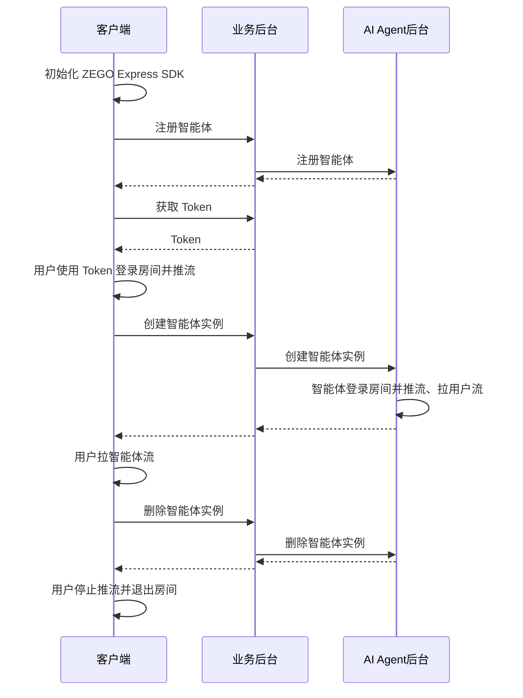

import {getPlatformData} from "/snippets/utils-content-parser.js"


export const expressSDKMap = {
  'Android': <a href='https://doc-zh.zego.im/article/3575' target='_blank'>ZEGO Express SDK</a>,
  'iOS': <a href='https://doc-zh.zego.im/article/3574' target='_blank'>ZEGO Express SDK</a>,
  'Web': <a href='https://doc-zh.zego.im/article/6839' target='_blank'>ZEGO Express SDK</a>,
}

# 快速开始

本文档用于说明如何快速集成客户端 SDK （ZEGO Express SDK）并在您的业务后台调用 AI Agent 相关后台接口实现与 AI Agent 的语音互动。

## 前提条件

- 已在 [ZEGO 控制台](https://console.zego.im/) 创建项目，并申请有效的 AppID 和 AppSign，详情请参考 [控制台 - 项目信息](https://doc-zh.zego.im/article/12107)。
- 联系 ZEGO 技术支持开通 AI Agent 相关服务并获取 LLM 和 TTS 相关配置信息。
- 已经集成了支持 AI 降噪和 AI 回声消除的 {getPlatformData(props,expressSDKMap)}。
- 已部署业务后台并实现调用 AI Agent 相关服务端 API（可参考服务端示例代码）。
<Note title="说明">
文本转语音（TTS）服务供应商。可选：Aliyun：阿里云、Bytedance：火山引擎、Minimax：MiniMax。

详情请参考 [TTS 参数](/aiagent-server/common-parameter-description#tts)说明文档。
</Note>
<Warning title="注意">请联系 ZEGO 技术支持获取支持 AI 降噪和 AI 回声消除的 ZEGO Express SDK 版本，并在集成使用时开启  AI 降噪和 AI 回声消除以获得更好的语音交互效果。</Warning>

## 示例代码
以下是实现核心能力所需要的示例代码，您可以参考示例代码来实现自己的业务逻辑。

<CardGroup cols={2}>
:::if{props.platform=undefined}
<Card title="Android 客户端示例代码" href="https://github.com/ZEGOCLOUD/ai_agent_quick_start/tree/master/android" target="_blank">
Android 客户端示例代码。包含最基本的登录、推流、拉流、退出房间等能力。
</Card>
:::
:::if{props.platform="iOS"}
<Card title="iOS 客户端示例代码" href="https://github.com/ZEGOCLOUD/ai_agent_quick_start/tree/master/ios" target="_blank">
iOS 客户端示例代码。包含最基本的登录、推流、拉流、退出房间等能力。
</Card>
:::
:::if{props.platform="Web"}
<Card title="Web 客户端示例代码" href="https://github.com/ZEGOCLOUD/ai_agent_quick_start/tree/master/web" target="_blank">
Web 客户端示例代码。包含最基本的登录、推流、拉流、退出房间等能力。
</Card>
:::
<Card title="服务端示例代码"  href="https://github.com/ZEGOCLOUD/ai_agent_quick_start_server" target="_blank">
服务端示例代码。包含最基本的获取 ZEGO Token、注册智能体、创建智能体实例、删除智能体实例等能力。
</Card>
</CardGroup>

## 整体业务流程图

您需要在客户端使用 ZEGO Express SDK 实现真实用户进入房间并推流。然后调用 AI Agent 提供的服务端 API 接口，实现将智能体加入房间并与真实用户进行实时互动。



## 核心能力实现


<Steps>
<Step title="在客户端初始化 ZEGO Express SDK">

以下是初始化 ZEGO Express SDK 的关键步骤：
:::if{props.platform=undefined}
1 添加权限声明

进入 “app/src/main” 目录，打开 “AndroidManifest.xml” 文件，添加权限。
```xml AndroidManifest.xml
<uses-permission android:name="android.permission.ACCESS_NETWORK_STATE" />
<uses-permission android:name="android.permission.INTERNET" />
<uses-permission android:name="android.permission.RECORD_AUDIO" /> 
```
2 运行时申请录音权限
```java
private final ActivityResultLauncher<String> requestPermissionLauncher = registerForActivityResult(
    new ActivityResultContracts.RequestPermission(), new ActivityResultCallback<Boolean>() {
        @Override
        public void onActivityResult(Boolean isGranted) {
            if (isGranted) {
                // 同意权限
            }
        }
    });
//发起请求
requestPermissionLauncher.launch(Manifest.permission.RECORD_AUDIO);
```
3 创建并初始化 ZegoExpressEngine
```java {3}
ZegoEngineProfile zegoEngineProfile = new ZegoEngineProfile();
zegoEngineProfile.appID = KeyCenter.appID;
zegoEngineProfile.scenario = ZegoScenario.HIGH_QUALITY_CHATROOM;
zegoEngineProfile.application = getApplication();
ZegoExpressEngine.createEngine(zegoEngineProfile, null);
```

更详细说明请参考 [集成 SDK](https://doc-zh.zego.im/article/3575) 和 [实现音频通话](https://doc-zh.zego.im/article/7636)。
:::
:::if{props.platform="iOS"}
1 在 Info.plist 文件声明必要的权限

```xml Info.plist
<?xml version="1.0" encoding="UTF-8"?>
<!DOCTYPE plist PUBLIC "-//Apple//DTD PLIST 1.0//EN" "http://www.apple.com/DTDs/PropertyList-1.0.dtd">
<plist version="1.0">
<dict>
    ...
    <key>UIBackgroundModes</key>
    <array>
        <string>audio</string>
    </array>
    <key>NSMicrophoneUsageDescription</key>
    <string>需要访问麦克风以进行语音聊天</string>
</dict>
</plist>
```
2 运行时申请录音权限

```objectivec
- (void)requestAudioPermission:(void(^)(BOOL granted))completion {
    /// 需要在项目的 Info.plist 文件中添加麦克风权限的使用说明
    AVAudioSession *audioSession = [AVAudioSession sharedInstance];
    [audioSession requestRecordPermission:^(BOOL granted) {
        dispatch_async(dispatch_get_main_queue(), ^{
            completion(granted);
        });
    }];
}
```

3 创建并初始化 ZegoExpressEngine

```objectivec {4}
-(void)initZegoExpressEngine{
    ZegoEngineProfile* profile = [[ZegoEngineProfile alloc]init];
    profile.appID = kZegoPassAppId;
    profile.scenario = ZegoScenarioHighQualityChatroom; //设置该场景可以避免申请相机权限，接入方应按自己的业务场景设置具体值
    
    [ZegoExpressEngine createEngineWithProfile:profile eventHandler:self];
}
```

更详细说明请参考 [集成 SDK](https://doc-zh.zego.im/article/3574) 和 [实现音频通话](https://doc-zh.zego.im/article/7631)。
:::
:::if{props.platform="Web"}
1 加载AI降噪模块

2 实例化 ZegoExpressEngine

3 检查系统要求（WebRTC 支持和麦克风权限）
```javascript {7,9,11}
import { ZegoExpressEngine } from "zego-express-engine-webrtc";
import { VoiceChanger } from "zego-express-engine-webrtc/voice-changer";

const appID = 1234567 // 从即构控制台获取
const server = 'xxx' // 从即构控制台获取
// 加载AI降噪模块
ZegoExpressEngine.use(VoiceChanger);
// 实例化 ZegoExpressEngine传入appId和server等配置
const zg = new ZegoExpressEngine(appID, server);
// 检查系统要求
const checkSystemRequirements = async () => {
    // 检测是否支持webRTC
    const rtc_sup = await zg.checkSystemRequirements("webRTC");
    if (!rtc_sup.result) {
      // 浏览器不支持webrtc
  }
    // 检测是否开启麦克风权限
    const mic_sup = await zg.checkSystemRequirements("microphone");
    if (!mic_sup.result) {
      // 未开启麦克风权限
  }
}
checkSystemRequirements()
```

更详细说明请参考 [集成 SDK](https://doc-zh.zego.im/article/6839) 和 [实现音频通话](https://doc-zh.zego.im/article/9540)。
:::

</Step>
<Step title="注册智能体">
注册智能体用于设定智能体基础配置，包括智能体名称、LLM、TTS、ASR等相关配置。注册后可以该智能体作为模板创建多个实例与多个真实用户进行互动。

通常智能体是相对比较固定的，一旦设定好智能体的相关参数（人设形象）就不会经常改动。所以建议按照业务流程需要在初始化应用时或者其他其他步骤注册智能体即可。

<Note title="说明">一个智能体只能注册一次（同一个ID），如果重复注册会返回错误码 410001008。</Note>

以下是调用业务后台接口实现注册智能体的示例：

:::if{props.platform=undefined}
<CodeGroup>
```java 客户端调用注册智能体接口 {6-10}
public static void registerAgent(String agentId, String agentName) throws IOException {
    JSONObject json = new JSONObject();
    json.put("agent_id", agentId);
    json.put("agent_name", agentName);
    
    RequestBody body = RequestBody.create(json.toString(), JSON);
    Request request = new Request.Builder()
            .url(YOUR_SERVER_URL + "/api/agent/register") // YOUR_SERVER_URL 为您的业务后台地址
            .post(body)
            .build();
    
    try (Response response = client.newCall(request).execute()) {
        System.out.println(response.body().string());
    }
}
```
```javascript 服务端实现注册智能体逻辑
// 注意：process.env. 为从环境变量读取的值。请参考服务端示例代码的 .env.example 文件。
async registerAgent(agentId: string, agentName: string) {
    if (!process.env.LLM_BASE_URL || !process.env.LLM_API_KEY || !process.env.LLM_MODEL) {
        throw new Error('LLM_BASE_URL, LLM_API_KEY and LLM_MODEL environment variables must be set');
    }
    // 请求接口：https://aigc-aiagent-api.zegotech.cn?Action=RegisterAgent
    // 文档说明：https://doc-zh.zego.im/aiagent-server/agent-configuration-management/register-agent
    const action = 'RegisterAgent';
    const body = {
        AgentId: agentId,
        Name: agentName,
        LLM: {
            Url: process.env.LLM_BASE_URL || "",
            ApiKey: process.env.LLM_API_KEY || "",
            Model: process.env.LLM_MODEL || "",
            // SystemPrompt: SYSTEM_PROMPT
        },
        TTS: {
            Vendor: "Bytedance",
            Params: {
                "app": {
                    "appid": process.env.TTS_BYTEDANCE_APP_ID || "",
                    "token": process.env.TTS_BYTEDANCE_TOKEN || "",
                    "cluster": process.env.TTS_BYTEDANCE_CLUSTER || ""
                },
                "speed_ratio": 1,
                "volume_ratio": 1,
                "pitch_ratio": 1,
                "emotion": "happy",
                "audio": {
                    "rate": 24000,
                    "voice_type": process.env.TTS_BYTEDANCE_VOICE_TYPE || ""
                }
            },
            FilterText: [{ BeginCharacters: "(", EndCharacters: ")" }, { BeginCharacters: "（", EndCharacters: "）" }, { BeginCharacters: "{", EndCharacters: "}" }],
        }
    };
    // sendRequest 方法封装了请求的 URL 和公共参数。详情参考：https://doc-zh.zego.im/aiagent-server/accessing-server-apis
    return this.sendRequest<any>(action, body);
}
```
</CodeGroup>
:::

:::if{props.platform="iOS"}
<CodeGroup>
```swift 客户端调用注册智能体接口 {2,7,8}
+ (void)registerAgentWithId:(NSString *)agentId name:(NSString *)agentName {
    NSURL *url = [NSURL URLWithString:[kBaseUrl stringByAppendingString:@"/api/agent/register"]]; // kBaseUrl 为您的业务后台地址
    NSMutableURLRequest *request = [NSMutableURLRequest requestWithURL:url];
    [request setHTTPMethod:@"POST"];
    [request setValue:@"application/json" forHTTPHeaderField:@"Content-Type"];
    NSDictionary *body = @{
        @"agent_id": agentId,
        @"agent_name": agentName
    };
    NSError *error;
    NSData *bodyData = [NSJSONSerialization dataWithJSONObject:body 
                                                       options:0 
                                                         error:&error];
    if (error) {
        NSLog(@"JSON序列化错误: %@", error);
        return;
    }
    [request setHTTPBody:bodyData];
    NSURLSession *session = [NSURLSession sharedSession];
    NSURLSessionDataTask *task = [session dataTaskWithRequest:request 
                                            completionHandler:^(NSData *data, NSURLResponse *response, NSError *error) {
        if (error) {
            NSLog(@"Error: %@", error);
            return;
        }
        NSHTTPURLResponse *httpResponse = (NSHTTPURLResponse *)response;
        if (httpResponse.statusCode == 200) {
            NSError *jsonError;
            NSDictionary *json = [NSJSONSerialization JSONObjectWithData:data 
                                                                 options:0 
                                                                   error:&jsonError];
            if (jsonError) {
                NSLog(@"JSON解析错误: %@", jsonError);
                return;
            }
            
            NSLog(@"注册Agent成功: %@", json);
        } else {
            NSLog(@"请求失败，状态码: %ld", (long)httpResponse.statusCode);
        }
    }];
    
    [task resume];
}
```
```javascript 服务端实现注册智能体逻辑
// 注意：process.env. 为从环境变量读取的值。请参考服务端示例代码的 .env.example 文件。
async registerAgent(agentId: string, agentName: string) {
    if (!process.env.LLM_BASE_URL || !process.env.LLM_API_KEY || !process.env.LLM_MODEL) {
        throw new Error('LLM_BASE_URL, LLM_API_KEY and LLM_MODEL environment variables must be set');
    }
    // 请求接口：https://aigc-aiagent-api.zegotech.cn?Action=RegisterAgent
    // 文档说明：https://doc-zh.zego.im/aiagent-server/agent-configuration-management/register-agent
    const action = 'RegisterAgent';
    const body = {
        AgentId: agentId,
        Name: agentName,
        LLM: {
            Url: process.env.LLM_BASE_URL || "",
            ApiKey: process.env.LLM_API_KEY || "",
            Model: process.env.LLM_MODEL || "",
            // SystemPrompt: SYSTEM_PROMPT
        },
        TTS: {
            Vendor: "Bytedance",
            Params: {
                "app": {
                    "appid": process.env.TTS_BYTEDANCE_APP_ID || "",
                    "token": process.env.TTS_BYTEDANCE_TOKEN || "",
                    "cluster": process.env.TTS_BYTEDANCE_CLUSTER || ""
                },
                "speed_ratio": 1,
                "volume_ratio": 1,
                "pitch_ratio": 1,
                "emotion": "happy",
                "audio": {
                    "rate": 24000,
                    "voice_type": process.env.TTS_BYTEDANCE_VOICE_TYPE || ""
                }
            },
            FilterText: [{ BeginCharacters: "(", EndCharacters: ")" }, { BeginCharacters: "（", EndCharacters: "）" }, { BeginCharacters: "{", EndCharacters: "}" }],
        }
    };
    // sendRequest 方法封装了请求的 URL 和公共参数。详情参考：https://doc-zh.zego.im/aiagent-server/accessing-server-apis
    return this.sendRequest<any>(action, body);
}
```
</CodeGroup>
:::

:::if{props.platform="Web"}
<CodeGroup>
```javascript 客户端调用注册智能体接口 {3,8-11}
async function registerAgent(agentId, agentName) {
  try {
    const response = await fetch(`${YOUR_SERVER_URL}/api/agent/register`, { // YOUR_SERVER_URL 为您的业务后台地址
      method: 'POST',
      headers: {
        'Content-Type': 'application/json',
      },
      body: JSON.stringify({
        agent_id: agentId,
        agent_name: agentName
      }),
    });
    
    const data = await response.json();
    console.log('注册AI Agent结果:', data);
    return data;
  } catch (error) {
    console.error('注册AI Agent失败:', error);
    throw error;
  }
}
```
```javascript 服务端实现注册智能体逻辑
// 注意：process.env. 为从环境变量读取的值。请参考服务端示例代码的 .env.example 文件。
async registerAgent(agentId: string, agentName: string) {
    if (!process.env.LLM_BASE_URL || !process.env.LLM_API_KEY || !process.env.LLM_MODEL) {
        throw new Error('LLM_BASE_URL, LLM_API_KEY and LLM_MODEL environment variables must be set');
    }
    // 请求接口：https://aigc-aiagent-api.zegotech.cn?Action=RegisterAgent
    // 文档说明：https://doc-zh.zego.im/aiagent-server/agent-configuration-management/register-agent
    const action = 'RegisterAgent';
    const body = {
        AgentId: agentId,
        Name: agentName,
        LLM: {
            Url: process.env.LLM_BASE_URL || "",
            ApiKey: process.env.LLM_API_KEY || "",
            Model: process.env.LLM_MODEL || "",
            // SystemPrompt: SYSTEM_PROMPT
        },
        TTS: {
            Vendor: "Bytedance",
            Params: {
                "app": {
                    "appid": process.env.TTS_BYTEDANCE_APP_ID || "",
                    "token": process.env.TTS_BYTEDANCE_TOKEN || "",
                    "cluster": process.env.TTS_BYTEDANCE_CLUSTER || ""
                },
                "speed_ratio": 1,
                "volume_ratio": 1,
                "pitch_ratio": 1,
                "emotion": "happy",
                "audio": {
                    "rate": 24000,
                    "voice_type": process.env.TTS_BYTEDANCE_VOICE_TYPE || ""
                }
            },
            FilterText: [{ BeginCharacters: "(", EndCharacters: ")" }, { BeginCharacters: "（", EndCharacters: "）" }, { BeginCharacters: "{", EndCharacters: "}" }],
        }
    };
    // sendRequest 方法封装了请求的 URL 和公共参数。详情参考：https://doc-zh.zego.im/aiagent-server/accessing-server-apis
    return this.sendRequest<any>(action, body);
}
```
</CodeGroup>
:::

</Step>
<Step title="用户进入房间并推流">
真实用户登录房间后推流。注意在此场景下需要开启 AI 降噪和 AI 回声消除以获得更好的效果。
登录用的 token 需要从业务后台获取，请参考完整示例代码。

<Note title="说明">
请确保 roomID、userID、streamID 在一个 ZEGO APPID 下是唯一的。
- roomID: 由用户自己定义生成规则,会用来登录 Express SDK 的房间。仅支持数字，英文字符 和 '~', '!', '@', '#', '$', '%', '^', '&', '*', '(', ')', '_', '+', '=', '-', '`', ';', '’', ',', '.', '\<', '\>', ''。如果需要与 Web SDK 互通，请不要使用 '%'。
- userID: 长度不超过32字节。仅支持数字，英文字符 和 '~', '!', '@', '#', '$', '%', '^', '&', '*', '(', ')', '_', '+', '=', '-', '`', ';', '’', ',', '.', '\<', '\>', '\'。如果需要与 Web SDK 互通，请不要使用 '%'。
- streamID: 长度不超过256字节。仅支持数字，英文字符 和 '-', '_'。
</Note>

:::if{props.platform=undefined}
```java 客户端登录房间并推流 {5,6,12-17,25,30}
private void loginRoom(String agentId, String userId, String userName, String token,
    IZegoRoomLoginCallback callback) {
    ZegoEngineConfig config = new ZegoEngineConfig();
    HashMap<String, String> advanceConfig = new HashMap<String, String>();
    advanceConfig.put("set_audio_volume_ducking_mode", "1");
    advanceConfig.put("enable_rnd_volume_adaptive", "true");
    config.advancedConfig = advanceConfig;
    ZegoExpressEngine.setEngineConfig(config);
    ZegoExpressEngine.getEngine().setRoomScenario(ZegoScenario.HIGH_QUALITY_CHATROOM);
    ZegoExpressEngine.getEngine().setAudioDeviceMode(ZegoAudioDeviceMode.GENERAL);

    // 开启 AI 降噪和 AI 回声消除
    ZegoExpressEngine.getEngine().enableAEC(true);
    ZegoExpressEngine.getEngine().setAECMode(ZegoAECMode.AI_AGGRESSIVE);
    ZegoExpressEngine.getEngine().enableAGC(true);
    ZegoExpressEngine.getEngine().enableANS(true);
    ZegoExpressEngine.getEngine().setANSMode(ZegoANSMode.AI_BALANCED);

    ZegoRoomConfig roomConfig = new ZegoRoomConfig();
    roomConfig.isUserStatusNotify = true;
    roomConfig.token = token;

    String roomId = generateRoomID(agentId);
    ZegoExpressEngine.getEngine()
        .loginRoom(roomId, new ZegoUser(userId, userName), roomConfig, (errorCode, extendedData) -> {
            Timber.d(
                "loginRoom() called with: errorCode = [" + errorCode + "], extendedData = [" + extendedData + "]");
            if (errorCode == 0) {
                String userSteamID = generateUserStreamID(agentId, userId);
                ZegoExpressEngine.getEngine().startPublishingStream(userSteamID);
                ZegoExpressEngine.getEngine().muteMicrophone(false);
            }
            if (callback != null) {
                callback.onRoomLoginResult(errorCode, extendedData);
            }

        });
}
```
:::
:::if{props.platform="iOS"}
```swift 客户端登录房间并推流 {9-11,17,20-24,35}
// 记录智能体
self.streamToPlay = [self getAgentStreamID];

ZegoEngineConfig* engineConfig = [[ZegoEngineConfig alloc] init];
engineConfig.advancedConfig = @{
    @"set_audio_dump_mode":@1,//取消录制文件大小限制
    @"notify_remote_device_unknown_status": @"true",
    @"notify_remote_device_init_status":@"true",
    @"enforce_audio_loopback_in_sync": @"true", /**该配置用来做应答延迟优化的，需要集成对应版本的ZegoExpressEngine sdk，请联系即构同学**/
    @"set_audio_volume_ducking_mode":@1,/**该配置是用来做音量闪避的**/
    @"enable_rnd_volume_adaptive":@"true",/**该配置是用来做播放音量自适用**/
};
[ZegoExpressEngine setEngineConfig:engineConfig];

//这个设置只影响AEC（回声消除），我们这里设置为ModeGeneral，是会走我们自研的回声消除，这比较可控，
//如果其他选项，可能会走系统的回声消除，这在iphone手机上效果可能会更好，但如果在一些android机上效果可能不好
[[ZegoExpressEngine sharedEngine] setAudioDeviceMode:ZegoAudioDeviceModeGeneral];

//请注意：开启 AI 降噪和 AI 回声消除需要联系 ZEGO 技术支持获取对应的ZegoExpressionEngine.xcframework，具备该能力的版本还未发布
[[ZegoExpressEngine sharedEngine] enableAGC:TRUE];
[[ZegoExpressEngine sharedEngine] enableAEC:TRUE];
[[ZegoExpressEngine sharedEngine] setAECMode:ZegoAECModeAIAggressive];
[[ZegoExpressEngine sharedEngine] enableANS:TRUE];
[[ZegoExpressEngine sharedEngine] setANSMode:ZegoANSModeAIBalanced];

// 登录房间
[self loginRoom:^(int errorCode, NSDictionary *extendedData) {
    if (errorCode!=0) {
        NSString* errorMsg =[NSString stringWithFormat:@"进入语音房间失败:%d", errorCode];
        completion(NO, errorMsg);
        return;
    }
    
    //进房后开始推流
    [self startPushlishStream];
}];
```
:::
:::if{props.platform="Web"}
```javascript 客户端登录房间并推流 {22-25}
const userId = "" // 登录 Express SDK房间用户ID
const roomId = "" // RTC 房间 ID
const userStreamId = "" // 用户推流 ID
async function enterRoom() {
  try {
    // 生成 RTC Token [参考文档]（https://doc-zh.zego.im/article/7646）
    const token = await Api.getToken();
    // 登录房间
    await zg.loginRoom(roomId, token, {
      userID: userId,
      userName: "",
    });

    // 创建本地音频流
    const localStream = await zg.createZegoStream({
      camera: {
        video: false,
        audio: true,
      },
    });
    if (localStream) {
      // 推送本地流
      await zg.startPublishingStream(userStreamId, localStream);
      // 开启Ai降噪（需要特殊编包的 ZEGO Express SDK）
      const enableResult = await zg.enableAiDenoise(localStream, true);
      if (enableResult.errorCode === 0) {
        return zg.setAiDenoiseMode(localStream, 1);
      }
    }
  } catch (error) {
    console.error("进入房间失败:", error);
    throw error;
  }
}
enterRoom()
```
:::
</Step>
<Step title="创建智能体实例">
可以用已注册的智能体为模板创建多个智能体实例加入不同房间与不同用户进行实时互动。创建智能体实例后，智能体实例会自动登录房间并推流，同时也会拉真实用户的流。

创建智能体实例成功后，真实用户监听流变化事件并拉流就可以与智能体进行实时互动了。

以下是调用业务后台接口实现创建智能体实例的示例：
:::if{props.platform=undefined}
<CodeGroup>
```java 客户端调用创建智能体实例接口 {12-15}
public static void createAgentInstance(String agentId, String roomId, String userId, String userStreamId, 
                             String agentStreamId, String agentUserId) throws IOException {
    JSONObject json = new JSONObject();
    json.put("agent_id", agentId);
    json.put("room_id", roomId);
    json.put("user_id", userId);
    json.put("user_stream_id", userStreamId);
    json.put("agent_stream_id", agentStreamId);
    json.put("agent_user_id", agentUserId);
    
    RequestBody body = RequestBody.create(json.toString(), JSON);
    Request request = new Request.Builder()
            .url(YOUR_SERVER_URL + "/api/agent/create") // YOUR_SERVER_URL 为您的业务后台地址
            .post(body)
            .build();
    
    try (Response response = client.newCall(request).execute()) {
        // 请求返回数据示例：{code: 0, agent_instance_id: "new_instance_id", message: 'create agent instance success'}
        // agent_instance_id 用于删除智能体实例
        System.out.println(response.body().string());
    }
}
```
```java 客户端拉智能体的流 {12-19}
// 监听回调
void setEventHandler() {
        engine.setEventHandler(new IZegoEventHandler() {
            @Override
            // 房间内其他用户推流/停止推流时，我们会在这里收到相应用户的音视频流增减的通知
            public void onRoomStreamUpdate(String roomID, ZegoUpdateType updateType, ArrayList<ZegoStream> streamList, JSONObject extendedData) {
                super.onRoomStreamUpdate(roomID, updateType, streamList, extendedData);
                //当 updateType 为 ZegoUpdateType.ADD 时，代表有音视频流新增，此时我们可以调用 startPlayingStream 接口拉取播放该音视频流
                if (updateType == ZegoUpdateType.ADD) {
                    // 开始拉流，设置远端拉流渲染视图，视图模式采用 SDK 默认的模式，等比缩放填充整个 View
                    ZegoStream stream = streamList.get(0);
                    // 判断是否是智能体流
                    if (stream.streamID.equals(agentStreamID)) {
                        // 如下 remoteUserView 为 UI 界面上的 TextureView.
                        ZegoCanvas playCanvas = new ZegoCanvas(findViewById(R.id.remoteUserView));
                        ZegoExpressEngine.getEngine().startPlayingStream(agentStreamID, playCanvas);
                    }
                }
            }
        });
}
```
```javascript 服务端实现创建智能体实例逻辑
async createAgentInstance(agentId: string, userId: string, rtcInfo: RtcInfo, messages?: any[]) {
    // 请求接口：https://aigc-aiagent-api.zegotech.cn?Action=CreateAgentInstance
    // 文档说明：https://doc-zh.zego.im/aiagent-server/agent-instance-management/create-agent-instance
    const action = 'CreateAgentInstance';
    const body = {
        AgentId: agentId,
        UserId: userId,
        RTC: rtcInfo,
        MessageHistory: {
            SyncMode: 1, // Change to 0 to use history messages from ZIM
            Messages: messages && messages.length > 0 ? messages : [],
            WindowSize: 10
        }
    };
    // sendRequest 方法封装了请求的 URL 和公共参数。详情参考：https://doc-zh.zego.im/aiagent-server/accessing-server-apis
    const result = await this.sendRequest<any>(action, body);
    console.log("create agent instance result", result);
    return result.AgentInstanceId;
}
```
</CodeGroup>
:::
:::if{props.platform="iOS"}
<CodeGroup>
```swift 客户端调用创建智能体实例接口 {7,12-19}
+ (void)createAgentWithId:(NSString *)agentId
                   roomId:(NSString *)roomId
                   userId:(NSString *)userId
             userStreamId:(NSString *)userStreamId
           agentStreamId:(NSString *)agentStreamId
             agentUserId:(NSString *)agentUserId {
    NSURL *url = [NSURL URLWithString:[kBaseUrl stringByAppendingString:@"/api/agent/create"]]; // kBaseUrl 为您的业务后台地址
    NSMutableURLRequest *request = [NSMutableURLRequest requestWithURL:url];
    [request setHTTPMethod:@"POST"];
    [request setValue:@"application/json" forHTTPHeaderField:@"Content-Type"];
    
    NSDictionary *body = @{
        @"agent_id": agentId,
        @"room_id": roomId,
        @"user_id": userId,
        @"user_stream_id": userStreamId,
        @"agent_stream_id": agentStreamId,
        @"agent_user_id": agentUserId
    };
    
    NSError *error;
    NSData *bodyData = [NSJSONSerialization dataWithJSONObject:body 
                                                       options:0 
                                                         error:&error];
    if (error) {
        NSLog(@"JSON序列化错误: %@", error);
        return;
    }
    
    [request setHTTPBody:bodyData];
    
    NSURLSession *session = [NSURLSession sharedSession];
    NSURLSessionDataTask *task = [session dataTaskWithRequest:request 
                                            completionHandler:^(NSData *data, NSURLResponse *response, NSError *error) {
        if (error) {
            NSLog(@"Error: %@", error);
            return;
        }
        
        NSHTTPURLResponse *httpResponse = (NSHTTPURLResponse *)response;
        if (httpResponse.statusCode == 200) {
            NSError *jsonError;
            NSDictionary *json = [NSJSONSerialization JSONObjectWithData:data 
                                                                 options:0 
                                                                   error:&jsonError];
            if (jsonError) {
                NSLog(@"JSON解析错误: %@", jsonError);
                return;
            }
            
            NSLog(@"创建Agent实例成功: %@", json);
        } else {
            NSLog(@"请求失败，状态码: %ld", (long)httpResponse.statusCode);
        }
    }];
    
    [task resume];
}
```

```objectivec 客户端拉智能体的流 {12}
//监听房间流信息更新状态，拉取智能体流播放
- (void)onRoomStreamUpdate:(ZegoUpdateType)updateType
                streamList:(NSArray<ZegoStream *> *)streamList
              extendedData:(nullable NSDictionary *)extendedData
                    roomID:(NSString *)roomID{    
    if (updateType == ZegoUpdateTypeAdd) {
        for (int i=0; i<streamList.count; i++) {
            ZegoStream* item = [streamList objectAtIndex:i];
            
            if ([item.streamID isEqualToString: self.streamToPlay]) {
                NSLog(@"匹配到目标流，准备播放: streamID=%@", self.streamToPlay);
                [self startPlayStream:self.streamToPlay];
                break;
            }
        }
    } else if(updateType == ZegoUpdateTypeDelete) {
        for (int i=0; i<streamList.count; i++) {
            ZegoStream* item = [streamList objectAtIndex:i];
            [[ZegoExpressEngine sharedEngine] stopPlayingStream:item.streamID];
        }
    }
}
```
```javascript 服务端实现创建智能体实例逻辑
async createAgentInstance(agentId: string, userId: string, rtcInfo: RtcInfo, messages?: any[]) {
    // 请求接口：https://aigc-aiagent-api.zegotech.cn?Action=CreateAgentInstance
    // 文档说明：https://doc-zh.zego.im/aiagent-server/agent-instance-management/create-agent-instance
    const action = 'CreateAgentInstance';
    const body = {
        AgentId: agentId,
        UserId: userId,
        RTC: rtcInfo,
        MessageHistory: {
            SyncMode: 1, // Change to 0 to use history messages from ZIM
            Messages: messages && messages.length > 0 ? messages : [],
            WindowSize: 10
        }
    };
    // sendRequest 方法封装了请求的 URL 和公共参数。详情参考：https://doc-zh.zego.im/aiagent-server/accessing-server-apis
    const result = await this.sendRequest<any>(action, body);
    console.log("create agent instance result", result);
    return result.AgentInstanceId;
}
```
</CodeGroup>
:::
:::if{props.platform="Web"}
<CodeGroup>

```javascript 客户端调用创建智能体实例接口 {3,8-16}
async function createAgentInstance(agentId, roomId, userId, userStreamId, agentStreamId, agentUserId, messages = []) {
  try {
    const response = await fetch(`${YOUR_SERVER_URL}/api/agent/create`, { // YOUR_SERVER_URL 为您的业务后台地址
      method: 'POST',
      headers: {
        'Content-Type': 'application/json',
      },
      body: JSON.stringify({
        agent_id: agentId,
        room_id: roomId,
        user_id: userId,
        user_stream_id: userStreamId,
        agent_stream_id: agentStreamId,
        agent_user_id: agentUserId,
        messages: messages
      }),
    });
    
    const data = await response.json();
    console.log('创建AI Agent实例结果:', data);
    return data;
  } catch (error) {
    console.error('创建AI Agent实例失败:', error);
    throw error;
  }
}

```
```javascript 客户端拉智能体的流 {9}
// 监听远端流更新事件
function setupEvent() {
  zg.on("roomStreamUpdate",
    async (roomID, updateType, streamList) => {
      if (updateType === "ADD" && streamList.length > 0) {
        try {
          for (const stream of streamList) {
            // 拉智能体流
            const mediaStream = await zg.startPlayingStream(stream.streamID);
            if (!mediaStream) return;
            const remoteView = await zg.createRemoteStreamView(mediaStream);
            if (remoteView) {
             // 这里需要页面上有个id为remoteSteamView的容器接收智能体流 [参考文档]（https://doc-zh.zego.im/article/api?doc=Express_Video_SDK_API~javascript_web~class~ZegoStreamView）
              remoteView.play("remoteSteamView", {
                enableAutoplayDialog: false,
              });
            }
          }
        } catch (error) {
          console.error("拉流失败:", error);
        }
      }
    }
  );
}
```
```javascript 服务端实现创建智能体实例逻辑
async createAgentInstance(agentId: string, userId: string, rtcInfo: RtcInfo, messages?: any[]) {
    // 请求接口：https://aigc-aiagent-api.zegotech.cn?Action=CreateAgentInstance
    // 文档说明：https://doc-zh.zego.im/aiagent-server/agent-instance-management/create-agent-instance
    const action = 'CreateAgentInstance';
    const body = {
        AgentId: agentId,
        UserId: userId,
        RTC: rtcInfo,
        MessageHistory: {
            SyncMode: 1, // Change to 0 to use history messages from ZIM
            Messages: messages && messages.length > 0 ? messages : [],
            WindowSize: 10
        }
    };
    // sendRequest 方法封装了请求的 URL 和公共参数。详情参考：https://doc-zh.zego.im/aiagent-server/accessing-server-apis
    const result = await this.sendRequest<any>(action, body);
    console.log("create agent instance result", result);
    return result.AgentInstanceId;
}
```
</CodeGroup>
:::
恭喜你🎉！完成这一步骤后，您已经成功创建了一个智能体实例，并可以与真实用户进行实时互动了。您可以用语音问智能体任何问题，智能体都会用语音回答您的问题！
</Step>
<Step title="用户退出房间并删除智能体实例">
删除智能体实例后，智能体实例会自动退出房间并停止推流。用户再停止推流和退出房间后，一次完整的互动就结束了。

以下是调用业务后台接口实现删除智能体实例的示例：
:::if{props.platform=undefined}
<CodeGroup>
```java 客户端调用删除智能体实例接口 {6-10,14,15}
// agentInstanceId 在创建智能体实例接口返回
public static void deleteAgentInstance(String agentInstanceId) throws IOException {
    JSONObject json = new JSONObject();
    json.put("agent_instance_id", agentInstanceId);
    
    RequestBody body = RequestBody.create(json.toString(), JSON);
    Request request = new Request.Builder()
            .url(YOUR_SERVER_URL + "/api/agent/delete") // YOUR_SERVER_URL 为您的业务后台地址
            .post(body)
            .build();
    
    try (Response response = client.newCall(request).execute()) {
        System.out.println(response.body().string());
        ZegoExpressEngine.getEngine().logoutRoom();
        ZegoExpressEngine.destroyEngine(null);
    }
}
```
```javascript 服务端实现删除智能体实例逻辑
async deleteAgentInstance(agentInstanceId: string) {
    // 请求接口：https://aigc-aiagent-api.zegotech.cn?Action=DeleteAgentInstance
    // 文档说明：https://doc-zh.zego.im/aiagent-server/agent-instance-management/delete-agent-instance
    const action = 'DeleteAgentInstance';
    const body = {
        AgentInstanceId: agentInstanceId
    };
    // sendRequest 方法封装了请求的 URL 和公共参数。详情参考：https://doc-zh.zego.im/aiagent-server/accessing-server-apis
    return this.sendRequest(action, body);
}
```
</CodeGroup>
:::
:::if{props.platform="iOS"}
<CodeGroup>
```swift 客户端调用删除智能体实例接口 {4,8-10,43-46}
// agentInstanceId 在创建智能体实例接口返回
// 3. 删除AI Agent实例
+ (void)deleteAgentWithInstanceId:(NSString *)agentInstanceId {
    NSURL *url = [NSURL URLWithString:[kBaseUrl stringByAppendingString:@"/api/agent/delete"]]; // kBaseUrl 为您的业务后台地址
    NSMutableURLRequest *request = [NSMutableURLRequest requestWithURL:url];
    [request setHTTPMethod:@"POST"];
    [request setValue:@"application/json" forHTTPHeaderField:@"Content-Type"];
    NSDictionary *body = @{
        @"agent_instance_id": agentInstanceId
    };
    NSError *error;
    NSData *bodyData = [NSJSONSerialization dataWithJSONObject:body 
                                                       options:0 
                                                         error:&error];
    if (error) {
        NSLog(@"JSON序列化错误: %@", error);
        return;
    }
    [request setHTTPBody:bodyData];
    NSURLSession *session = [NSURLSession sharedSession];
    NSURLSessionDataTask *task = [session dataTaskWithRequest:request 
                                            completionHandler:^(NSData *data, NSURLResponse *response, NSError *error) {
        if (error) {
            NSLog(@"Error: %@", error);
            return;
        }
        NSHTTPURLResponse *httpResponse = (NSHTTPURLResponse *)response;
        if (httpResponse.statusCode == 200) {
            NSError *jsonError;
            NSDictionary *json = [NSJSONSerialization JSONObjectWithData:data 
                                                                 options:0 
                                                                   error:&jsonError];
            if (jsonError) {
                NSLog(@"JSON解析错误: %@", jsonError);
                return;
            }
            
            NSLog(@"删除Agent实例成功: %@", json);
            if ([ZegoExpressEngine sharedEngine] == nil) {
                return;
            }
    
            [[ZegoExpressEngine sharedEngine] stopPlayingStream:self.streamToPlay];
            [[ZegoExpressEngine sharedEngine] stopPublishingStream];
            [[ZegoExpressEngine sharedEngine] logoutRoomWithCallback:nil];
            [ZegoExpressEngine destroyEngine:nil];
        } else {
            NSLog(@"请求失败，状态码: %ld", (long)httpResponse.statusCode);
        }
    }];
    
    [task resume];
}
```
```javascript 服务端实现删除智能体实例逻辑
async deleteAgentInstance(agentInstanceId: string) {
    // 请求接口：https://aigc-aiagent-api.zegotech.cn?Action=DeleteAgentInstance
    // 文档说明：https://doc-zh.zego.im/aiagent-server/agent-instance-management/delete-agent-instance
    const action = 'DeleteAgentInstance';
    const body = {
        AgentInstanceId: agentInstanceId
    };
    // sendRequest 方法封装了请求的 URL 和公共参数。详情参考：https://doc-zh.zego.im/aiagent-server/accessing-server-apis
    return this.sendRequest(action, body);
}
```
</CodeGroup>
:::
:::if{props.platform="Web"}
<CodeGroup>
```javascript 客户端调用删除智能体实例接口 {4,10,17-22}
// agentInstanceId 在创建智能体实例接口返回
async function deleteAgentInstance(agentInstanceId) {
  try {
    const response = await fetch(`${YOUR_SERVER_URL}/api/agent/delete`, { // YOUR_SERVER_URL 为您的业务后台地址
      method: 'POST',
      headers: {
        'Content-Type': 'application/json',
      },
      body: JSON.stringify({
        agent_instance_id: agentInstanceId
      }),
    });
    
    const data = await response.json();
    console.log('删除AI Agent实例结果:', data);

    // 销毁本地流
    await zg.destroyStream(localStream);
    // 退出房间
    await zg.logoutRoom(roomId);
    // 销毁Express引擎
    zg.destroyEngine();
  } catch (error) {
    console.error('删除AI Agent实例失败:', error);
    throw error;
  }
}
```
```javascript 服务端实现删除智能体实例逻辑
async deleteAgentInstance(agentInstanceId: string) {
    // 请求接口：https://aigc-aiagent-api.zegotech.cn?Action=DeleteAgentInstance
    // 文档说明：https://doc-zh.zego.im/aiagent-server/agent-instance-management/delete-agent-instance
    const action = 'DeleteAgentInstance';
    const body = {
        AgentInstanceId: agentInstanceId
    };
    // sendRequest 方法封装了请求的 URL 和公共参数。详情参考：https://doc-zh.zego.im/aiagent-server/accessing-server-apis
    return this.sendRequest(action, body);
}
```
</CodeGroup>
:::
</Step>
</Steps>

以上就是您实现与智能体进行实时语音互动的完整核心流程。
