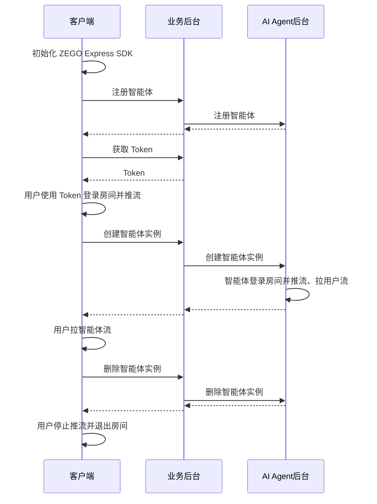

# 快速开始

本文档用于说明如何快速实现与 AI Agent 的语音互动。

## 前提条件

- 已在 [ZEGO 控制台](https://console.zego.im/) 创建项目，并申请有效的 AppID 和 AppSign，详情请参考 [控制台 - 项目信息](https://doc-zh.zego.im/article/12107)。
- 联系 ZEGO 技术支持开通 AI Agent 相关服务并获取 LLM 和 TTS 相关配置信息。
- 已经集成了支持 AI 降噪和 AI 回声消除的 [ZEGO Express SDK](https://doc-zh.zego.im/article/3575)。
- 已部署业务后台并实现调用 AI Agent 相关接口（可参考服务端示例代码）。
<Note title="说明">
文本转语音（TTS）服务供应商。可选：Aliyun：阿里云、Bytedance：火山引擎、Minimax：MiniMax。

详情请参考 [TTS 参数](/aiagent-server/common-parameter-description#tts)说明文档。
</Note>
<Warning title="注意">请联系 ZEGO 技术支持获取支持 AI 降噪和 AI 回声消除的 ZEGO Express SDK 版本，并在集成使用时开启  AI 降噪和 AI 回声消除以获得更好的语音交互效果。</Warning>

## 示例代码
以下是实现核心能力所需要的示例代码，您可以参考示例代码来实现自己的业务逻辑。

<CardGroup cols={2}>
<Card title="Android 客户端示例代码" href="https://github.com/ZEGOCLOUD/ai_agent_quick_start/tree/master/android" target="_blank">
Android 客户端示例代码。包含最基本的登录、推流、拉流、退出房间等能力。
</Card>
<Card title="服务端示例代码"  href="https://github.com/ZEGOCLOUD/ai_agent_quick_start_server" target="_blank">
服务端示例代码。包含最基本的获取 ZEGO Token、注册智能体、创建智能体实例、删除智能体实例等能力。
</Card>
</CardGroup>

## 整体业务流程图

您需要使用 ZEGO Express SDK 实现真实用户进入房间并推流。然后使用 AI Agent 提供的服务端 API 接口，实现将智能体加入房间并与真实用户进行实时互动。



## 核心能力实现


<Steps>
<Step title="初始化 ZEGO Express SDK">

以下是初始化 ZEGO Express SDK 的关键步骤：

1. 添加权限声明

进入 “app/src/main” 目录，打开 “AndroidManifest.xml” 文件，添加权限。
```xml AndroidManifest.xml
<uses-permission android:name="android.permission.ACCESS_NETWORK_STATE" />
<uses-permission android:name="android.permission.INTERNET" />
<uses-permission android:name="android.permission.RECORD_AUDIO" /> 
```
2. 运行时申请录音权限
```java
private final ActivityResultLauncher<String> requestPermissionLauncher = registerForActivityResult(
    new ActivityResultContracts.RequestPermission(), new ActivityResultCallback<Boolean>() {
        @Override
        public void onActivityResult(Boolean isGranted) {
            if (isGranted) {
                // 同意权限
            }
        }
    });
//发起请求
requestPermissionLauncher.launch(Manifest.permission.RECORD_AUDIO);
```
3. 创建并初始化 ZegoExpressEngine
```java {3}
ZegoEngineProfile zegoEngineProfile = new ZegoEngineProfile();
zegoEngineProfile.appID = KeyCenter.appID;
zegoEngineProfile.scenario = ZegoScenario.HIGH_QUALITY_CHATROOM;
zegoEngineProfile.application = getApplication();
ZegoExpressEngine.createEngine(zegoEngineProfile, null);
```

更详细说明请参考 [集成 SDK](https://doc-zh.zego.im/article/3575) 和 [实现音频通话](https://doc-zh.zego.im/article/7636)。

</Step>
<Step title="注册智能体">
注册智能体用于设定智能体基础配置，包括智能体名称、LLM、TTS、ASR等相关配置。注册后可以该智能体作为模板创建多个实例与多个真实用户进行互动。

通常智能体是相对比较固定的，一旦设定好智能体的相关参数（人设形象）就不会经常改动。所以建议按照业务流程需要在初始化应用时或者其他其他步骤注册智能体即可。

<Note title="说明">一个智能体只能注册一次（同一个ID），如果重复注册会返回错误码 410001008。</Note>

以下是调用业务后台接口实现注册智能体的示例：
```java {6-10}
public static void registerAgent(String agentId, String agentName) throws IOException {
    JSONObject json = new JSONObject();
    json.put("agent_id", agentId);
    json.put("agent_name", agentName);
    
    RequestBody body = RequestBody.create(json.toString(), JSON);
    Request request = new Request.Builder()
            .url(BASE_URL + "/api/agent/register") // BASE_URL 为您的业务
            .post(body)
            .build();
    
    try (Response response = client.newCall(request).execute()) {
        System.out.println(response.body().string());
    }
}
```
</Step>
<Step title="用户进入房间并推流">
用户登录房间后推流。注意在此场景下需要开启 AI 降噪和 AI 回声消除以获得更好的效果。
登录用的 token 需要从业务后台获取，请参考完整示例代码。

<Note title="说明">
请确保 roomID、userID、streamID 在一个 ZEGO APPID 下是唯一的。
- roomID: 由用户自己定义生成规则,会用来登录 Express SDK 的房间。仅支持数字，英文字符 和 '~', '!', '@', '#', '$', '%', '^', '&', '*', '(', ')', '_', '+', '=', '-', '`', ';', '’', ',', '.', '\<', '\>', ''。如果需要与 Web SDK 互通，请不要使用 '%'。
- userID: 长度不超过32字节。仅支持数字，英文字符 和 '~', '!', '@', '#', '$', '%', '^', '&', '*', '(', ')', '_', '+', '=', '-', '`', ';', '’', ',', '.', '\<', '\>', '\'。如果需要与 Web SDK 互通，请不要使用 '%'。
- streamID: 长度不超过256字节。仅支持数字，英文字符 和 '-', '_'。
</Note>

```java {5,6,12-17,25,30}
private void loginRoom(String agentId, String userId, String userName, String token,
    IZegoRoomLoginCallback callback) {
    ZegoEngineConfig config = new ZegoEngineConfig();
    HashMap<String, String> advanceConfig = new HashMap<String, String>();
    advanceConfig.put("set_audio_volume_ducking_mode", "1");
    advanceConfig.put("enable_rnd_volume_adaptive", "true");
    config.advancedConfig = advanceConfig;
    ZegoExpressEngine.setEngineConfig(config);
    ZegoExpressEngine.getEngine().setRoomScenario(ZegoScenario.HIGH_QUALITY_CHATROOM);
    ZegoExpressEngine.getEngine().setAudioDeviceMode(ZegoAudioDeviceMode.GENERAL);

    // 开启 AI 降噪和 AI 回声消除
    ZegoExpressEngine.getEngine().enableAEC(true);
    ZegoExpressEngine.getEngine().setAECMode(ZegoAECMode.AI_AGGRESSIVE);
    ZegoExpressEngine.getEngine().enableAGC(true);
    ZegoExpressEngine.getEngine().enableANS(true);
    ZegoExpressEngine.getEngine().setANSMode(ZegoANSMode.AI_BALANCED);

    ZegoRoomConfig roomConfig = new ZegoRoomConfig();
    roomConfig.isUserStatusNotify = true;
    roomConfig.token = token;

    String roomId = generateRoomID(agentId);
    ZegoExpressEngine.getEngine()
        .loginRoom(roomId, new ZegoUser(userId, userName), roomConfig, (errorCode, extendedData) -> {
            Timber.d(
                "loginRoom() called with: errorCode = [" + errorCode + "], extendedData = [" + extendedData + "]");
            if (errorCode == 0) {
                String userSteamID = generateUserStreamID(agentId, userId);
                ZegoExpressEngine.getEngine().startPublishingStream(userSteamID);
                ZegoExpressEngine.getEngine().muteMicrophone(false);
            }
            if (callback != null) {
                callback.onRoomLoginResult(errorCode, extendedData);
            }

        });
}
```
</Step>
<Step title="创建智能体实例">
可以用已注册的智能体为模板创建多个智能体实例加入不同房间与不同用户进行实时互动。创建智能体实例后，智能体实例会自动登录房间并推流，同时也会拉真实用户的流。

创建智能体实例成功后，真实用户监听流变化事件并拉流就可以与智能体进行实时互动了。

以下是调用业务后台接口实现创建智能体实例的示例：
<CodeGroup>
```java 创建智能体示例 {12-15,19}
public static void createAgentInstance(String agentId, String roomId, String userId, String userStreamId, 
                             String agentStreamId, String agentUserId) throws IOException {
    JSONObject json = new JSONObject();
    json.put("agent_id", agentId);
    json.put("room_id", roomId);
    json.put("user_id", userId);
    json.put("user_stream_id", userStreamId);
    json.put("agent_stream_id", agentStreamId);
    json.put("agent_user_id", agentUserId);
    
    RequestBody body = RequestBody.create(json.toString(), JSON);
    Request request = new Request.Builder()
            .url(BASE_URL + "/api/agent/create") // BASE_URL 为您的业务后台地址
            .post(body)
            .build();
    
    try (Response response = client.newCall(request).execute()) {
        System.out.println(response.body().string());
    }
}
```
```java 拉流示例 {12-19}
// 监听回调
void setEventHandler() {
        engine.setEventHandler(new IZegoEventHandler() {
            @Override
            // 房间内其他用户推流/停止推流时，我们会在这里收到相应用户的音视频流增减的通知
            public void onRoomStreamUpdate(String roomID, ZegoUpdateType updateType, ArrayList<ZegoStream> streamList, JSONObject extendedData) {
                super.onRoomStreamUpdate(roomID, updateType, streamList, extendedData);
                //当 updateType 为 ZegoUpdateType.ADD 时，代表有音视频流新增，此时我们可以调用 startPlayingStream 接口拉取播放该音视频流
                if (updateType == ZegoUpdateType.ADD) {
                    // 开始拉流，设置远端拉流渲染视图，视图模式采用 SDK 默认的模式，等比缩放填充整个 View
                    ZegoStream stream = streamList.get(0);
                    // 判断是否是智能体流
                    if (stream.streamID.equals(agentStreamID)) {
                        // 如下 remoteUserView 为 UI 界面上的 TextureView.
                        ZegoCanvas playCanvas = new ZegoCanvas(findViewById(R.id.remoteUserView));
                        ZegoExpressEngine.getEngine().startPlayingStream(agentStreamID, playCanvas);
                    }
                }
            }
        });
}
```
</CodeGroup>

</Step>
<Step title="用户退出房间并删除智能体实例">
删除智能体实例后，智能体实例会自动退出房间并停止推流。用户再停止推流和退出房间后，一次完整的互动就结束了。

以下是调用业务后台接口实现删除智能体实例的示例：
```java Some.java {6-10,14,15}
// agentInstanceId 在创建智能体实例接口返回
public static void deleteAgentInstance(String agentInstanceId) throws IOException {
    JSONObject json = new JSONObject();
    json.put("agent_instance_id", agentInstanceId);
    
    RequestBody body = RequestBody.create(json.toString(), JSON);
    Request request = new Request.Builder()
            .url(BASE_URL + "/api/agent/delete") // BASE_URL 为您的业务
            .post(body)
            .build();
    
    try (Response response = client.newCall(request).execute()) {
        System.out.println(response.body().string());
        ZegoExpressEngine.getEngine().logoutRoom();
        ZegoExpressEngine.destroyEngine(null);
    }
}
```

</Step>
</Steps>
