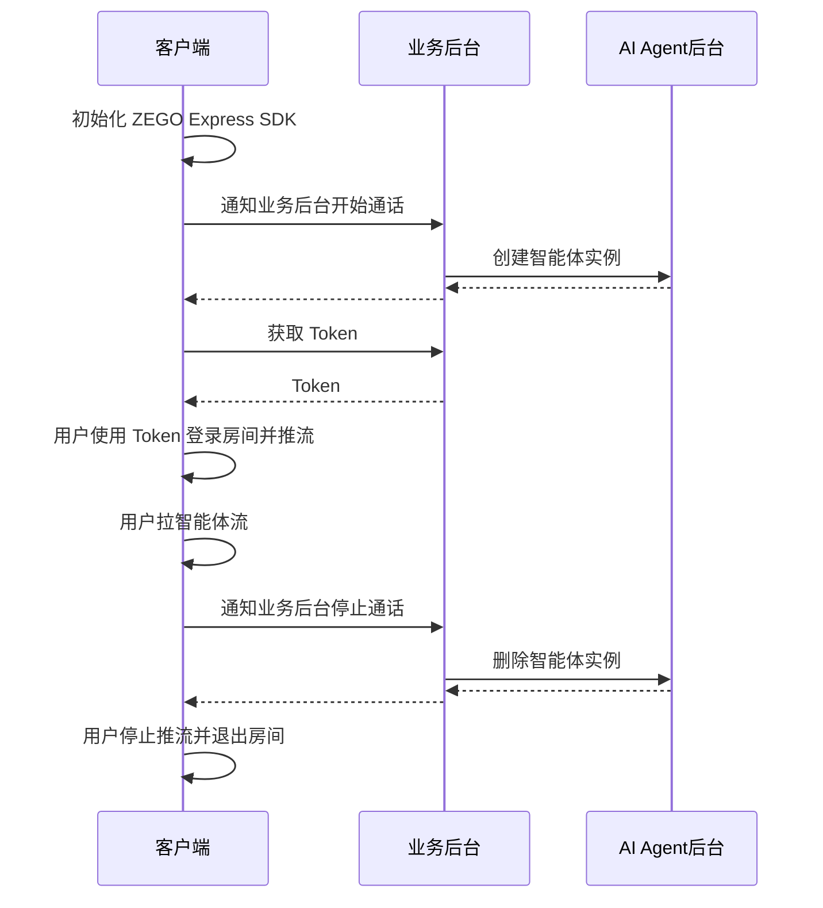

import {getPlatformData} from "/snippets/utils-content-parser.js"


export const expressSDKMap = {
  'Android': <a href='https://doc-zh.zego.im/article/3575' target='_blank'>ZEGO Express SDK</a>,
  'iOS': <a href='https://doc-zh.zego.im/article/3574' target='_blank'>ZEGO Express SDK</a>,
  'Web': <a href='https://doc-zh.zego.im/article/6839' target='_blank'>ZEGO Express SDK</a>,
}

# 快速开始

本文档用于说明如何快速集成客户端 SDK （ZEGO Express SDK）并实现与智能体进行语音互动。

## 前提条件

- 已在 [ZEGO 控制台](https://console.zego.im/) 创建项目，并申请有效的 AppID 和 AppSign，详情请参考 [控制台 - 项目信息](https://doc-zh.zego.im/article/12107)。
:::if{props.platform="undefined|iOS"}
<div>
- 已联系 ZEGO 技术支持获取支持 AI 降噪和 AI 回声消除的 {getPlatformData(props,expressSDKMap)}。并集成到您的项目中。
</div>
:::
:::if{props.platform="Web"}
<div>
- 已联系 ZEGO 技术支持获取支持 AI 降噪的 {getPlatformData(props,expressSDKMap)}。并集成到您的项目中。
</div>
:::
- 已按 [业务后台快速开始指引](/aiagent-server/quick-start) 集成了 AI Agent 相关服务端 API。

## 示例代码
以下是实现核心能力所需要的示例代码，您可以参考示例代码来实现自己的业务逻辑。

<CardGroup cols={2}>
:::if{props.platform=undefined}
<Card title="Android 客户端示例代码" href="https://github.com/ZEGOCLOUD/ai_agent_quick_start/tree/master/android" target="_blank">
Android 客户端示例代码。包含最基本的登录、推流、拉流、退出房间等能力。
</Card>
:::
:::if{props.platform="iOS"}
<Card title="iOS 客户端示例代码" href="https://github.com/ZEGOCLOUD/ai_agent_quick_start/tree/master/ios" target="_blank">
iOS 客户端示例代码。包含最基本的登录、推流、拉流、退出房间等能力。
</Card>
:::
:::if{props.platform="Web"}
<Card title="Web 客户端示例代码" href="https://github.com/ZEGOCLOUD/ai_agent_quick_start/tree/master/web" target="_blank">
Web 客户端示例代码。包含最基本的登录、推流、拉流、退出房间等能力。
</Card>
:::
</CardGroup>

## 整体业务流程图

您需要在客户端使用 ZEGO Express SDK 实现真实用户进入房间并推流。然后通知业务后台调用 AI Agent 相关服务端 API，实现将智能体加入房间并与真实用户进行实时互动。



## 核心能力实现

### 集成 ZEGO Express SDK

:::if{props.platform=undefined}

请参考 [集成 SDK > 2.2 > 方式2](https://doc-zh.zego.im/article/3575#2) 手动集成 SDK。集成 SDK 后按以下步骤初始化 ZegoExpressEngine。

<div>
<Steps>
<Step title="添加权限声明">
进入 “app/src/main” 目录，打开 “AndroidManifest.xml” 文件，添加权限。
```xml AndroidManifest.xml
<uses-permission android:name="android.permission.ACCESS_NETWORK_STATE" />
<uses-permission android:name="android.permission.INTERNET" />
<uses-permission android:name="android.permission.RECORD_AUDIO" /> 
```
</Step>
<Step title="运行时申请录音权限">
```java
private final ActivityResultLauncher<String> requestPermissionLauncher = registerForActivityResult(
    new ActivityResultContracts.RequestPermission(), new ActivityResultCallback<Boolean>() {
        @Override
        public void onActivityResult(Boolean isGranted) {
            if (isGranted) {
                // 同意权限
            }
        }
    });
//发起请求
requestPermissionLauncher.launch(Manifest.permission.RECORD_AUDIO);
```
</Step>
<Step title="创建并初始化 ZegoExpressEngine">
```java {3}
ZegoEngineProfile zegoEngineProfile = new ZegoEngineProfile();
zegoEngineProfile.appID = KeyCenter.appID;
zegoEngineProfile.scenario = ZegoScenario.HIGH_QUALITY_CHATROOM;
zegoEngineProfile.application = getApplication();
ZegoExpressEngine.createEngine(zegoEngineProfile, null);
```
</Step>
</Steps>
</div>
:::

:::if{props.platform="iOS"}

请参考 [集成 SDK > 2.2 > 方式三](https://doc-zh.zego.im/article/3574#2_2) 手动集成 SDK。集成 SDK 后按以下步骤初始化 ZegoExpressEngine。

<div>
<Steps>
<Step title="在 Info.plist 文件声明必要的权限">
```xml Info.plist
<?xml version="1.0" encoding="UTF-8"?>
<!DOCTYPE plist PUBLIC "-//Apple//DTD PLIST 1.0//EN" "http://www.apple.com/DTDs/PropertyList-1.0.dtd">
<plist version="1.0">
<dict>
    ...
    <key>UIBackgroundModes</key>
    <array>
        <string>audio</string>
    </array>
    <key>NSMicrophoneUsageDescription</key>
    <string>需要访问麦克风以进行语音聊天</string>
</dict>
</plist>
```
</Step>
<Step title="运行时申请录音权限">
```objectivec
- (void)requestAudioPermission:(void(^)(BOOL granted))completion {
    /// 需要在项目的 Info.plist 文件中添加麦克风权限的使用说明
    AVAudioSession *audioSession = [AVAudioSession sharedInstance];
    [audioSession requestRecordPermission:^(BOOL granted) {
        dispatch_async(dispatch_get_main_queue(), ^{
            completion(granted);
        });
    }];
}
```
</Step>
<Step title="创建并初始化 ZegoExpressEngine">

```objectivec {4}
-(void)initZegoExpressEngine{
    ZegoEngineProfile* profile = [[ZegoEngineProfile alloc]init];
    profile.appID = kZegoPassAppId;
    profile.scenario = ZegoScenarioHighQualityChatroom; //设置该场景可以避免申请相机权限，接入方应按自己的业务场景设置具体值
    
    [ZegoExpressEngine createEngineWithProfile:profile eventHandler:self];
}
```
</Step>
</Steps>
</div>

:::

:::if{props.platform="Web"}

请参考 [集成 SDK > 方式 2](https://doc-zh.zego.im/article/6839#2_2) 手动集成 SDK。集成 SDK 后按以下步骤初始化 ZegoExpressEngine。

1 加载AI降噪模块

2 实例化 ZegoExpressEngine

3 检查系统要求（WebRTC 支持和麦克风权限）

```javascript {7,9,11}
import { ZegoExpressEngine } from "zego-express-engine-webrtc";
import { VoiceChanger } from "zego-express-engine-webrtc/voice-changer";

const appID = 1234567 // 从即构控制台获取
const server = 'xxx' // 从即构控制台获取
// 加载AI降噪模块
ZegoExpressEngine.use(VoiceChanger);
// 实例化 ZegoExpressEngine传入appId和server等配置
const zg = new ZegoExpressEngine(appID, server);
// 检查系统要求
const checkSystemRequirements = async () => {
    // 检测是否支持webRTC
    const rtc_sup = await zg.checkSystemRequirements("webRTC");
    if (!rtc_sup.result) {
      // 浏览器不支持webrtc
  }
    // 检测是否开启麦克风权限
    const mic_sup = await zg.checkSystemRequirements("microphone");
    if (!mic_sup.result) {
      // 未开启麦克风权限
  }
}
checkSystemRequirements()
```
:::

### 通知业务后台开始通话

建议客户端在真实用户进入房间前，通知业务后台开始通话。业务后台收到开始通话通知后，使用与客户端相同的 roomID 及关联的 userID 和 streamID 创建智能体实例，这样智能体就能与真实用户在同一个房间内进行相互推拉流实现语音互动。

<Accordion title="通知业务后台的示例代码" defaultOpen="false">
:::if{props.platform=undefined}
```java
// 通知业务后台开始通话
// TODO 安卓加示例
```
:::
:::if{props.platform="iOS"}
```objectivec
// 通知业务后台开始通话
// TODO iOS加示例
```
:::
:::if{props.platform="Web"}
```javascript
// 通知业务后台开始通话
async function startCall() {
  try {
    const response = await fetch(`${YOUR_SERVER_URL}/api/start`, { // YOUR_SERVER_URL 为您的业务后台地址
      method: 'POST',
      headers: {
        'Content-Type': 'application/json',
      }
    });

    const data = await response.json();
    console.log('开始通话结果:', data);
    return data;
  } catch (error) {
    console.error('开始通话失败:', error);
    throw error;
  }
}
```
:::
</Accordion>

### 用户进入房间并推拉流

真实用户登录房间后推流。

:::if{props.platform="undefined|iOS"}
<Note title="注意">
在此场景下需要开启 AI 降噪和 AI 回声消除以获得更好的效果。
</Note>
:::
:::if{props.platform="Web"}
<Note title="注意">
在此场景下需要开启 AI 降噪以获得更好的效果。
</Note>
:::

登录用的 token 需要从您的业务后台获取，请参考完整示例代码。

<Note title="说明">
请确保 roomID、userID、streamID 在一个 ZEGO APPID 下是唯一的。
- roomID: 由用户自己定义生成规则,会用来登录 Express SDK 的房间。仅支持数字，英文字符 和 '~', '!', '@', '#', '$', '%', '^', '&', '*', '(', ')', '_', '+', '=', '-', '`', ';', '’', ',', '.', '\<', '\>', ''。如果需要与 Web SDK 互通，请不要使用 '%'。
- userID: 长度不超过32字节。仅支持数字，英文字符 和 '~', '!', '@', '#', '$', '%', '^', '&', '*', '(', ')', '_', '+', '=', '-', '`', ';', '’', ',', '.', '\<', '\>', '\'。如果需要与 Web SDK 互通，请不要使用 '%'。
- streamID: 长度不超过256字节。仅支持数字，英文字符 和 '-', '_'。
</Note>

:::if{props.platform=undefined}
<CodeGroup>
```java 客户端登录房间并推流 {5,6,12-17,25,30}
private void loginRoom(String agentId, String userId, String userName, String token,
    IZegoRoomLoginCallback callback) {
    ZegoEngineConfig config = new ZegoEngineConfig();
    HashMap<String, String> advanceConfig = new HashMap<String, String>();
    advanceConfig.put("set_audio_volume_ducking_mode", "1");
    advanceConfig.put("enable_rnd_volume_adaptive", "true");
    config.advancedConfig = advanceConfig;
    ZegoExpressEngine.setEngineConfig(config);
    ZegoExpressEngine.getEngine().setRoomScenario(ZegoScenario.HIGH_QUALITY_CHATROOM);
    ZegoExpressEngine.getEngine().setAudioDeviceMode(ZegoAudioDeviceMode.GENERAL);

    // 开启 AI 降噪和 AI 回声消除
    ZegoExpressEngine.getEngine().enableAEC(true);
    ZegoExpressEngine.getEngine().setAECMode(ZegoAECMode.AI_AGGRESSIVE);
    ZegoExpressEngine.getEngine().enableAGC(true);
    ZegoExpressEngine.getEngine().enableANS(true);
    ZegoExpressEngine.getEngine().setANSMode(ZegoANSMode.AI_BALANCED);

    ZegoRoomConfig roomConfig = new ZegoRoomConfig();
    roomConfig.isUserStatusNotify = true;
    roomConfig.token = token;

    String roomId = generateRoomID(agentId);
    ZegoExpressEngine.getEngine()
        .loginRoom(roomId, new ZegoUser(userId, userName), roomConfig, (errorCode, extendedData) -> {
            Timber.d(
                "loginRoom() called with: errorCode = [" + errorCode + "], extendedData = [" + extendedData + "]");
            if (errorCode == 0) {
                String userSteamID = generateUserStreamID(agentId, userId);
                ZegoExpressEngine.getEngine().startPublishingStream(userSteamID);
                ZegoExpressEngine.getEngine().muteMicrophone(false);
            }
            if (callback != null) {
                callback.onRoomLoginResult(errorCode, extendedData);
            }

        });
}
```

```java 客户端拉智能体的流 {12-19}
// 监听回调
void setEventHandler() {
        engine.setEventHandler(new IZegoEventHandler() {
            @Override
            // 房间内其他用户推流/停止推流时，我们会在这里收到相应用户的音视频流增减的通知
            public void onRoomStreamUpdate(String roomID, ZegoUpdateType updateType, ArrayList<ZegoStream> streamList, JSONObject extendedData) {
                super.onRoomStreamUpdate(roomID, updateType, streamList, extendedData);
                //当 updateType 为 ZegoUpdateType.ADD 时，代表有音视频流新增，此时我们可以调用 startPlayingStream 接口拉取播放该音视频流
                if (updateType == ZegoUpdateType.ADD) {
                    // 开始拉流，设置远端拉流渲染视图，视图模式采用 SDK 默认的模式，等比缩放填充整个 View
                    ZegoStream stream = streamList.get(0);
                    // 判断是否是智能体流
                    if (stream.streamID.equals(agentStreamID)) {
                        // 如下 remoteUserView 为 UI 界面上的 TextureView.
                        ZegoCanvas playCanvas = new ZegoCanvas(findViewById(R.id.remoteUserView));
                        ZegoExpressEngine.getEngine().startPlayingStream(agentStreamID, playCanvas);
                    }
                }
            }
        });
}
```
</CodeGroup>
:::
:::if{props.platform="iOS"}
<CodeGroup>
```swift 客户端登录房间并推流 {9-11,17,20-24,35}
// 记录智能体
self.streamToPlay = [self getAgentStreamID];

ZegoEngineConfig* engineConfig = [[ZegoEngineConfig alloc] init];
engineConfig.advancedConfig = @{
    @"set_audio_dump_mode":@1,//取消录制文件大小限制
    @"notify_remote_device_unknown_status": @"true",
    @"notify_remote_device_init_status":@"true",
    @"enforce_audio_loopback_in_sync": @"true", /**该配置用来做应答延迟优化的，需要集成对应版本的ZegoExpressEngine sdk，请联系即构同学**/
    @"set_audio_volume_ducking_mode":@1,/**该配置是用来做音量闪避的**/
    @"enable_rnd_volume_adaptive":@"true",/**该配置是用来做播放音量自适用**/
};
[ZegoExpressEngine setEngineConfig:engineConfig];

//这个设置只影响AEC（回声消除），我们这里设置为ModeGeneral，是会走我们自研的回声消除，这比较可控，
//如果其他选项，可能会走系统的回声消除，这在iphone手机上效果可能会更好，但如果在一些android机上效果可能不好
[[ZegoExpressEngine sharedEngine] setAudioDeviceMode:ZegoAudioDeviceModeGeneral];

//请注意：开启 AI 降噪和 AI 回声消除需要联系 ZEGO 技术支持获取对应的ZegoExpressionEngine.xcframework，具备该能力的版本还未发布
[[ZegoExpressEngine sharedEngine] enableAGC:TRUE];
[[ZegoExpressEngine sharedEngine] enableAEC:TRUE];
[[ZegoExpressEngine sharedEngine] setAECMode:ZegoAECModeAIAggressive];
[[ZegoExpressEngine sharedEngine] enableANS:TRUE];
[[ZegoExpressEngine sharedEngine] setANSMode:ZegoANSModeAIBalanced];

// 登录房间
[self loginRoom:^(int errorCode, NSDictionary *extendedData) {
    if (errorCode!=0) {
        NSString* errorMsg =[NSString stringWithFormat:@"进入语音房间失败:%d", errorCode];
        completion(NO, errorMsg);
        return;
    }
    
    //进房后开始推流
    [self startPushlishStream];
}];
```

```objectivec 客户端拉智能体的流 {12}
//监听房间流信息更新状态，拉取智能体流播放
- (void)onRoomStreamUpdate:(ZegoUpdateType)updateType
                streamList:(NSArray<ZegoStream *> *)streamList
              extendedData:(nullable NSDictionary *)extendedData
                    roomID:(NSString *)roomID{    
    if (updateType == ZegoUpdateTypeAdd) {
        for (int i=0; i<streamList.count; i++) {
            ZegoStream* item = [streamList objectAtIndex:i];
            
            if ([item.streamID isEqualToString: self.streamToPlay]) {
                NSLog(@"匹配到目标流，准备播放: streamID=%@", self.streamToPlay);
                [self startPlayStream:self.streamToPlay];
                break;
            }
        }
    } else if(updateType == ZegoUpdateTypeDelete) {
        for (int i=0; i<streamList.count; i++) {
            ZegoStream* item = [streamList objectAtIndex:i];
            [[ZegoExpressEngine sharedEngine] stopPlayingStream:item.streamID];
        }
    }
}
```
</CodeGroup>

:::
:::if{props.platform="Web"}
<CodeGroup>
```javascript 客户端登录房间并推流 {22-25}
const userId = "" // 登录 Express SDK房间用户ID
const roomId = "" // RTC 房间 ID
const userStreamId = "" // 用户推流 ID
async function enterRoom() {
  try {
    // 生成 RTC Token [参考文档]（https://doc-zh.zego.im/article/7646）
    const token = await Api.getToken();
    // 登录房间
    await zg.loginRoom(roomId, token, {
      userID: userId,
      userName: "",
    });

    // 创建本地音频流
    const localStream = await zg.createZegoStream({
      camera: {
        video: false,
        audio: true,
      },
    });
    if (localStream) {
      // 推送本地流
      await zg.startPublishingStream(userStreamId, localStream);
      // 开启Ai降噪（需要特殊编包的 ZEGO Express SDK）
      const enableResult = await zg.enableAiDenoise(localStream, true);
      if (enableResult.errorCode === 0) {
        return zg.setAiDenoiseMode(localStream, 1);
      }
    }
  } catch (error) {
    console.error("进入房间失败:", error);
    throw error;
  }
}
enterRoom()
```

```javascript 客户端拉智能体的流 {9}
// 监听远端流更新事件
function setupEvent() {
  zg.on("roomStreamUpdate",
    async (roomID, updateType, streamList) => {
      if (updateType === "ADD" && streamList.length > 0) {
        try {
          for (const stream of streamList) {
            // 拉智能体流
            const mediaStream = await zg.startPlayingStream(stream.streamID);
            if (!mediaStream) return;
            const remoteView = await zg.createRemoteStreamView(mediaStream);
            if (remoteView) {
             // 这里需要页面上有个id为remoteSteamView的容器接收智能体流 [参考文档]（https://doc-zh.zego.im/article/api?doc=Express_Video_SDK_API~javascript_web~class~ZegoStreamView）
              remoteView.play("remoteSteamView", {
                enableAutoplayDialog: false,
              });
            }
          }
        } catch (error) {
          console.error("拉流失败:", error);
        }
      }
    }
  );
}
```
</CodeGroup>
:::

恭喜你🎉！完成这一步骤后，您已经成功创建了一个智能体实例，并可以与真实用户进行实时互动了。您可以用语音问智能体任何问题，智能体都会用语音回答您的问题！

### 退出房间结束通话

客户端调用退出登录接口退出房间，并停止推拉流。同时通知业务后台本次通话结束。业务后台收到结束通话通知后会删除智能体实例，智能体实例会自动退出房间并停止推拉流。这样一次完整的互动就结束了。

:::if{props.platform=undefined}
```java
// 退出房间
ZegoExpressEngine.getEngine().logoutRoom();
```
:::
:::if{props.platform="iOS"}
```objectivec
// 退出房间
[[ZegoExpressEngine sharedEngine] logoutRoom];
```
:::
:::if{props.platform="Web"}
```javascript
// 退出房间
async function stopCall() {
  try {
    const response = await fetch(`${YOUR_SERVER_URL}/api/stop`, { // YOUR_SERVER_URL 为您的业务后台地址
      method: 'POST',
      headers: {
        'Content-Type': 'application/json',
      }
    });

    const data = await response.json();
    console.log('结束通话结果:', data);
    return data;
  } catch (error) {
    console.error('结束通话失败:', error);
    throw error;
  }
}
stopCall();
zg.destroyLocalStream(localStream);
zg.logoutRoom();
```
:::


以上就是您实现与智能体进行实时语音互动的完整核心流程。
