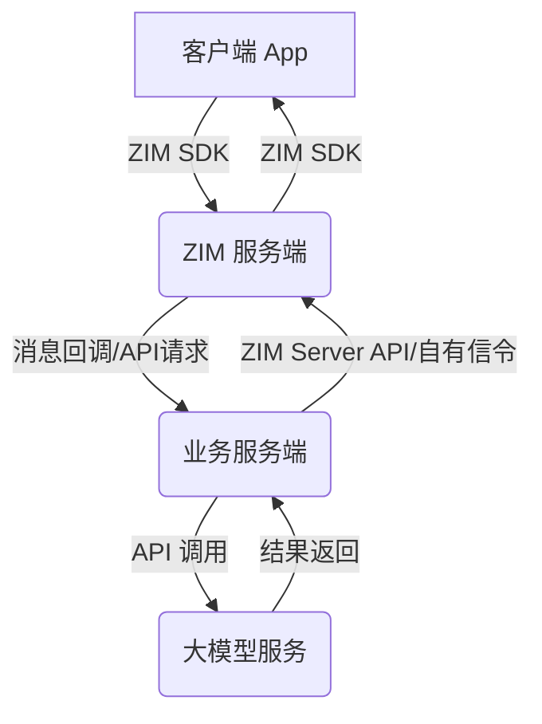

# 如何实现IM互动以及与RTC互动联动

本文档旨在指导开发者如何利用 ZIM (ZEGO In-app Messaging) 的实时通讯能力与大模型的自然语言处理能力，构建一个强大且智能的文字互动解决方案，从而提升应用的交互体验。

## 核心概念

在深入实现细节之前，我们先明确几个核心概念：

-   **ZIM (ZEGO In-app Messaging)**: ZEGO 提供的应用内即时通讯服务。它支持文本、图片、文件等多种消息类型，并具备房间管理、用户状态通知等功能，为应用内互动提供坚实基础。
-   **大模型 (Large Language Model, LLM)**: 经过海量文本数据训练的深度学习模型。LLM 能够理解和生成自然语言文本，广泛应用于问答系统、智能对话、文本创作等多种场景。
-   **文字互动**: 指用户在集成 ZIM 服务通过输入文字与大模型进行交互。大模型需能准确理解用户意图，并给出相关的文字回复，实现流畅的对话体验。

## 解决方案架构

典型的 ZIM 与大模型结合的文字互动解决方案架构如下所示：



**数据流说明:**

1.  **客户端 App**: 用户在应用内通过集成的 ZIM SDK 发送文字消息。
2.  **ZIM 服务端**: 接收并处理来自客户端的消息。随后，通过消息回调或 API 请求的方式，将用户消息安全、可靠地传递给业务服务端。
3.  **业务服务端**: 作为核心处理中枢，负责：
    *   接收 ZIM 服务端传递的用户消息。
    *   对消息进行必要的预处理，如敏感词过滤、意图初步识别等。
    *   调用选定的大模型服务接口，将处理后的用户消息发送给大模型进行深度分析和内容生成。
    *   接收大模型返回的处理结果。
    *   对大模型结果进行后处理，如格式化输出、内容安全二次校验等。
    *   通过 ZIM Server API 或其他自定义信令通道，将最终的回复消息发送回 ZIM 服务端，再由 ZIM 服务端推送给目标客户端。
4.  **大模型服务**: 接收业务服务端的请求，利用其强大的自然语言处理能力生成恰当的回复内容。

## 快速实现指南

以下步骤将引导您快速搭建一个基础的文字互动解决方案：

### 1. 集成 ZIM SDK 到客户端

首先，在您的客户端应用中集成 ZIM SDK。请根据您的目标平台选择相应的官方文档进行集成：

-   [ZIM Android SDK 集成](https://doc-zh.zego.im/article/13591)
-   [ZIM iOS SDK 集成](https://doc-zh.zego.im/article/13592)
-   [ZIM Web SDK 集成](https://doc-zh.zego.im/zim-web/send-and-receive-messages)

### 2. 搭建业务服务端

业务服务端是连接 ZIM 和大模型的桥梁。您可以使用 Node.js, Python, Java, Go 等任何您熟悉的后端技术栈进行搭建。

#### 2.1 接收 ZIM 消息回调

配置 ZIM 服务端，使其能够将消息事件通过回调机制通知到您的业务服务端。详细配置方法请参考：

-   [ZIM 服务端回调](https://doc-zh.zego.im/article/13600)

您的业务服务端需要实现一个 HTTP 接口来接收这些回调。例如，用户发送单聊消息时的回调数据结构可能如下：

```json title="ZIM 消息回调示例 (单聊文本消息)"
{
    "app_id": 12345,
    "event": "zim_send_peer_message", // 事件类型
    "nonce": "abcdefg",
    "signature": "xxxxxxxxxxxxxxxxxxxxxxxxxxxxxxxx", // 安全签名
    "timestamp": 1678886400,
    "message_id": "unique_message_id", // 消息唯一ID
    "from_user_id": "user_A", // 发送方用户ID
    "to_user_id": "user_B",   // 接收方用户ID (或群组ID)
    "type": 1, // 消息类型，1 通常表示文本消息
    "message": "你好，大模型！", // 消息内容
    "extended_data": "" // 扩展数据字段
}
```

#### 2.2 调用大模型服务

收到用户消息后，业务服务端需调用您选定的大模型服务。市面上有多种选择，如 OpenAI (GPT 系列), Anthropic (Claude 系列), Google (Gemini 系列)，或自部署的开源模型。

调用通常通过 HTTP API 完成。请务必查阅相应大模型提供商的 API 文档，了解请求构造、认证方式及响应解析。

以下是使用 Node.js 调用 xxx 系列模型的伪代码示例：

```javascript title="Node.js 调用 xxx大模型 API 示例"
```

**重要提示**: 严禁将 API Key 硬编码到客户端代码或提交到公开代码仓库。推荐使用环境变量或安全的密钥管理服务。

#### 2.3 将回复通过 ZIM 发送回客户端

获取到大模型的回复后，业务服务端需使用 ZIM Server API 将此回复消息发送给原始用户。

具体接口使用请参考 ZIM Server API 文档中的“发送单聊消息”或“发送群组消息”部分：

-   [ZIM Server API 文档](https://doc-zh.zego.im/article/13601)

以下是使用 Node.js 和 `axios` 通过 ZIM Server API 发送消息的示例：

```javascript title="Node.js"
```

### 3. 客户端处理逻辑

客户端的 ZIM SDK 会监听并接收来自业务服务端（经由 ZIM 服务端转发）的 AI 回复消息。您需要在客户端实现消息接收逻辑，并将内容展示在用户界面上。

#### 3.1 获取历史消息

```javascript title="Web"

```
```objctive-c title="iOS"
@interface ZegoAIAgentIMChatViewController () <ZIMEventHandler>

// zim对象
@property (nonatomic, strong) ZIM *zim;

@end

@implementation ZegoAIAgentIMChatViewController

- (void)fetchHistoryMessagesIfNeeded {
    if (!self.zim) {
        return;
    }

    ZIMMessageQueryConfig *config = [[ZIMMessageQueryConfig alloc] init];
    config.count = 50; // 拉取50条
    config.nextMessage = nil; // 从最新消息开始
    config.reverse = YES; // 从最后一页开始拉取

    [self.zim queryHistoryMessageByConversationID:@"your rotbot id"
                                 conversationType:ZIMConversationTypePeer
                                           config:config
                                         callback:^(NSString * _Nonnull conversationID, ZIMConversationType conversationType, NSArray<ZIMMessage *> * _Nonnull messageList, ZIMError * _Nonnull errorInfo) {
        if (errorInfo.code == 0) {
            dispatch_async(dispatch_get_main_queue(), ^{
             // 更新数据
             // 根据orderKey对所有消息进行排序
             // 刷新界面
            });
        } else {
            NSLog(@"拉取历史消息失败: %@", errorInfo.message);
        }
    }];
}

@end
```

#### 3.2 发送消息

```javascript title="Web"

```
```objctive-c title="iOS"
@interface ZegoAIAgentIMChatViewController () <ZIMEventHandler>

// zim对象
@property (nonatomic, strong) ZIM *zim;

@end

@implementation ZegoAIAgentIMChatViewController

- (void)sendMessage {
    if (!self.zim) {
      return;
    }

    // 创建文本消息
    ZIMTextMessage *zimMessage = [[ZIMTextMessage alloc] init];
    zimMessage.message = @"your message text";

    // 消息发送配置
    ZIMMessageSendConfig *config = [[ZIMMessageSendConfig alloc] init];
    config.priority = ZIMMessagePriorityMedium;

    // 消息发送通知
    ZIMMessageSendNotification *notification = [[ZIMMessageSendNotification alloc] init];
    notification.onMessageAttached = ^(ZIMMessage * _Nonnull message) {
        // 发送前的回调，可以在这里提前展示UI
        dispatch_async(dispatch_get_main_queue(), ^{
            // 更新数据，刷新界面
        });
    };


    // 发送消息
    [self.zim sendMessage:zimMessage
        toConversationID:@"your rotbot id"
        conversationType:ZIMConversationTypePeer
                  config:config
            notification:notification
               callback:^(ZIMMessage * _Nonnull message, ZIMError * _Nonnull errorInfo) {
        if (errorInfo.code == 0) {
            NSLog(@"消息发送成功");
        } else {
            NSLog(@"消息发送失败：%@", errorInfo.message);
        }
    }];
}

@end
```

#### 3.3 接收消息

```javascript title="Web"
// 假设 zim 实例已初始化并登录
zim.on("peerMessageReceived", (zim, { messageList }) => {
    console.log("收到新消息:", messageList);
    // 处理消息并更新 UI界面
});
```
```objctive-c title="iOS"
// 实现ZIMEventHandler
@interface ZegoAIAgentIMChatViewController () <ZIMEventHandler>

@end

@implementation ZegoAIAgentIMChatViewController

#pragma mark - ZIMEventHandler

- (void)zim:(ZIM *)zim peerMessageReceived:(NSArray<ZIMMessage *> *)messageList info:(ZIMMessageReceivedInfo *)info fromUserID:(NSString *)fromUserID {
    NSLog(@"收到单聊消息 - 发送者ID: %@, 消息数量: %lu, 消息详情:", fromUserID, (unsigned long)messageList.count);
    for (ZIMMessage *message in messageList) {
        if ([message isKindOfClass:[ZIMTextMessage class]]) {
            ZIMTextMessage *textMessage = (ZIMTextMessage *)message;
            NSLog(@"消息ID: %lld, 发送时间: %llu, 消息内容: %@", textMessage.messageID, textMessage.timestamp, textMessage.message);
        }
    }

    dispatch_async(dispatch_get_main_queue(), ^{
         // 更新数据

        // 根据orderKey对所有消息进行排序

        // 刷新界面
    });
}

@end
```

## 进阶功能与优化

构建基础的文字互动功能后，您可以考虑以下进阶功能和优化点，以提升用户体验：

### 如何在语音互动中保持文字互动的上下文连续性

在实际应用场景中，用户可能会在文字互动和语音互动之间切换。为了保持对话的连贯性和上下文的完整性，您可以通过以下方式将文字互动的上下文关联到语音互动中：

-   **实现方法**:
    1. 在创建智能体实例并开始语音互动时，配置 MessageHistory 参数：
       - 将 `MessageHistory.SyncMode`（消息同步模式）设置为 `0`，表示从 ZIM 同步历史消息
       - 在 `MessageHistory.ZIM` 中补充完整的 ZIM 相关信息，包括：
         - `RobotId`：即调用 ZIM 注册机器人接口对应的UserInfo.UserId
         - `LoadMessageCount`：创建智能体实例时，从 ZIM 服务获取多少条消息作为上下文。默认为 WindowSize 的值（取值上限）。
    2. 完成以上配置后，创建的智能体实例在语音互动中将自动继承文字互动的上下文
    3. 也可以传入自定义消息列表，通过 `MessageHistory.Messages` 参数：
       - 支持传入自定义的历史消息列表
       - 消息需要按时间顺序排列
       - 每条消息需要包含消息发送者角色和消息内容

-   **注意事项**：
    - 如果使用自定义消息列表，注意消息的时序性和完整性

-   **API 参考**：
    - 详细的参数配置请参考 [创建智能体实例 API](https://doc-zh.zego.im/aiagent-server/api-reference/agent-instance-management/create-agent-instance)

### 异步处理与用户反馈

-   **目的**: 避免因大模型处理耗时较长导致的用户界面卡顿或无响应。
-   **方法**:
    -   客户端发送消息后，可立即在界面上显示“AI 正在思考中…”或类似的等待提示。
    -   业务服务端接收到用户消息后，先快速响应客户端已收到，然后异步调用大模型服务。待大模型返回结果后，再通过 ZIM 将实际回复推送给客户端更新界面。

