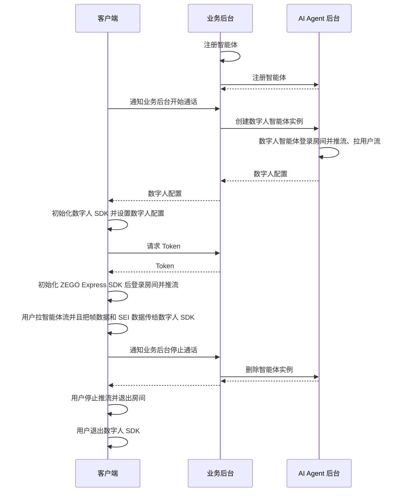

# 实现数字人视频通话

本文档用于说明如何快速调用 AI Agent 相关后台接口实现与 AI Agent 的视频互动。


## 数字人介绍

仅需一张上半身的真人或二次元的照片或图片，即可获得1080P、口型准确、形象逼真的数字人。通过搭配AI Agent产品使用，即可快速实现整体2s内的与AI数字人的视频互动聊天,适用于数字人 1V1 互动视频、数字人客服、数字人直播等多种场景。

- 更自然的驱动效果：支持轻微的身体动作，面部表情自然不变形，相较语音通话互动更真实沉浸；
- 多语种口型准确：唇形准确自然，尤其针对中英文效果更佳；
- 互动超低延迟：数字人驱动延迟 < 500ms，结合 AI Agent 互动延迟 < 2s；
- 更高清晰度：真实 1080P 效果，比传统图片数字人清晰度提高20%+

可跳转至[体验 Demo](./introduction/demo.mdx)下载体验。

<Video src="https://media-resource.spreading.io/docuo/workspace564/27e54a759d23575969552654cb45bf89/9f0143abe9.mp4" />

## 前提条件

- 已在 [ZEGO 控制台](https://console.zego.im/) 创建项目，并申请有效的 AppID 和 AppSign，详情请参考 [控制台 - 项目信息](https://doc-zh.zego.im/article/12107)。
- 已联系 ZEGO 技术支持开通数字人 PaaS 服务和相关接口的权限。
- 已联系 ZEGO 技术支持创建数字人。
- 已联系 ZEGO 技术支持开通 AI Agent 相关服务并获取 LLM 和 TTS 相关配置信息。
<Note title="说明">在接入测试期间(AI Agent 服务开通 2 周内)，可以将 LLM 和 TTS 的鉴权参数设置为 "zego_test" 即可使用相关服务。具体鉴权参数配置请参考[智能体参数说明](/aiagent-server/api-reference/common-parameter-description)。</Note>

## 示例代码
以下是接入实时互动 AI Agent API 的业务后台示例代码，您可以参考示例代码来实现自己的业务逻辑。

<CardGroup cols={2}>
<Card title="业务后台示例代码"  href="https://github.com/ZEGOCLOUD/ai_agent_quick_start_server" target="_blank">
包含最基本的获取 ZEGO Token、注册智能体、创建智能体实例、删除智能体实例等能力。
</Card>
</CardGroup>

以下视频演示了如何跑通服务端和客户端（Web）示例代码并跟数字人智能体进行互动。
<Video src="https://media-resource.spreading.io/docuo/workspace564/27e54a759d23575969552654cb45bf89/4b68fbedda.mp4" />


## 整体业务流程

1. 服务端，跑通业务后台示例代码，部署好业务后台
    - 接入实时互动 AI Agent API 管理智能体。
2. 客户端，参考 [Android 端快速开始](/aiagent-android/quick-start-with-digital-human) 、 [iOS 端快速开始](/aiagent-ios/quick-start-with-digital-human) 或 [Web 端快速开始](/aiagent-web/quick-start-with-digital-human) 文档跑通客户端示例代码
    - 通过业务后台创建和管理智能体。
    - 集成 ZEGO Express SDK 完成实时通信。
    - 集成数字人 SDK 完成数字人渲染。

完成以上三个步骤后即可实现将智能体加入房间并与真实用户进行实时视频互动。



## 服务端核心能力实现


<Steps>
<Step title="注册智能体">
[注册智能体](./api-reference/agent-configuration-management/register-agent.mdx) 用于设定智能体基础配置，包括智能体名称、LLM、TTS、ASR等相关配置。注册后可以将该智能体作为模板创建多个实例与多个真实用户进行互动。

通常智能体是相对比较固定的，一旦设定好智能体的相关参数（人设形象）就不会经常改动。所以建议按照业务流程需要在适当时机注册智能体即可。智能体注册后不会自动销毁和回收，创建智能体实例后即可与该智能体进行语音交互。

<Note title="说明">一个智能体只能注册一次（同一个ID），如果重复注册会返回错误码 410001008。</Note>

以下是调用注册智能体接口的示例：

```javascript Server(NodeJS)
// 请将以下示例中的 LLM 和 TTS 的 ApiKey、appid、token 等鉴权参数换成你实际的鉴权参数。
async registerAgent(agentId: string, agentName: string) {
    // 请求接口：https://aigc-aiagent-api.zegotech.cn?Action=RegisterAgent
    const action = 'RegisterAgent';
    const body = {
        AgentId: agentId,
        Name: agentName,
        LLM: {
            Url: "https://ark.cn-beijing.volces.com/api/v3/chat/completions",
            ApiKey: "zego_test",
            Model: "doubao-lite-32k-240828",
            SystemPrompt: "你是一个智能体，请根据用户的问题回答。"
        },
        TTS: {
            Vendor: "ByteDance",
            Params: {
                "app": {
                    "appid": "zego_test",
                    "token": "zego_test",
                    "cluster": "volcano_tts"
                },
                "audio": {
                    "voice_type": "zh_female_wanwanxiaohe_moon_bigtts"
                }
            }
        }
    };
    // sendRequest 方法封装了请求的 URL 和公共参数。详情参考：https://doc-zh.zego.im/aiagent-server/api-reference/accessing-server-apis
    return this.sendRequest<any>(action, body);
}
```

<Warning title="注意">
- 请确保 LLM 所有参数都按照 LLM 服务提供商官方文档填写正确，否则您可能无法看到智能体回答的文本内容也无法听到智能体输出语音。
- 请确保 TTS 所有参数都按照 TTS 服务提供商官方文档填写正确，否则您可能可以看到智能体回答的文本内容却无法听到智能体输出语音。
- 如遇智能体无法输出文本内容或语音，请先检查 LLM 和 TTS 参数配置是否完全正确，或参考 [获取智能体服务状态 - 监听服务端异常事件](./guides/get-ai-agent-status.mdx#监听服务端异常事件) 确定具体的问题。
</Warning>

</Step>
<Step title="创建数字人智能体实例">
可以用已注册的智能体为模板 [创建多个数字人智能体实例](./api-reference/agent-instance-management/create-digital-human-agent-instance.mdx) 加入不同房间与不同用户进行实时互动。创建数字人智能体实例后，数字人智能体实例会自动登录房间并推流，同时也会拉真实用户的流。

创建数字人智能体实例成功后，需要返回数字人配置给客户端，客户端根据数字人配置初始化数字人 SDK ，然后即可与数字人进行实时互动。

以下是调用创建数字人智能体实例接口的示例：

```javascript  Server(NodeJS)
async createDigitalHumanAgentInstance(agentId: string, userId: string, rtcInfo: RtcInfo, digitalHuman: DigitalHumanInfo, messages?: any[]) {
    // 请求接口：https://aigc-aiagent-api.zegotech.cn?Action=CreateDigitalHumanAgentInstance
    const action = 'CreateDigitalHumanAgentInstance';
    const body = {
        AgentId: agentId,
        UserId: userId,
        RTC: rtcInfo,
        DigitalHuman: digitalHuman,
        MessageHistory: {
            SyncMode: 1, // Change to 0 to use history messages from ZIM
            Messages: messages && messages.length > 0 ? messages : [],
            WindowSize: 10
        }
    };
    // sendRequest 方法封装了请求的 URL 和公共参数。详情参考：https://doc-zh.zego.im/aiagent-server/api-reference/accessing-server-apis
    const result = await this.sendRequest<any>(action, body);
    console.log("create agent instance result", result);
    // 返回的 DigitalHumanConfig 是数字人配置，客户端根据数字人配置初始化数字人 SDK ，然后即可与数字人进行实时互动。
    return result.AgentInstanceId, result.DigitalHumanConfig;
}
```

恭喜你🎉！完成这一步骤后，您已经成功创建了一个数字人智能体实例，并可以与真实用户进行实时视频互动了。您可以用语音问数字人任何问题，数字人都会回答您的问题！
</Step>
<Step title="删除智能体实例">
[删除智能体实例](./api-reference/agent-instance-management/delete-agent-instance.mdx)后，智能体实例会自动退出房间并停止推流。真实用户在客户端停止推流和退出房间后，一次完整的互动就结束了。

以下是调用删除智能体实例接口的示例：

```javascript Server(NodeJS)
async deleteAgentInstance(agentInstanceId: string) {
    // 请求接口：https://aigc-aiagent-api.zegotech.cn?Action=DeleteAgentInstance
    const action = 'DeleteAgentInstance';
    const body = {
        AgentInstanceId: agentInstanceId
    };
    // sendRequest 方法封装了请求的 URL 和公共参数。详情参考：https://doc-zh.zego.im/aiagent-server/api-reference/accessing-server-apis
    return this.sendRequest(action, body);
}
```
</Step>
</Steps>

以上就是您实现与数字人智能体进行实时互动的完整核心流程。

## 客户端快速开始参考

<Button primary-color="DarkGray" target="_blank" href="/aiagent-android/quick-start-with-digital-human">Android 端快速开始</Button>
<Button primary-color="DarkGray" target="_blank" href="/aiagent-ios/quick-start-with-digital-human">iOS 端快速开始</Button>
<Button primary-color="DarkGray" target="_blank" href="/aiagent-web/quick-start-with-digital-human">Web 端快速开始</Button>