# 快速发起语音通话

本文档用于说明如何快速调用 AI Agent 相关后台接口实现与 AI Agent 的语音互动。

## 前提条件

- 已在 [ZEGO 控制台](https://console.zego.im/) 创建项目，并申请有效的 AppID 和 AppSign，详情请参考 [控制台 - 项目信息](https://doc-zh.zego.im/article/12107)。
- 联系 ZEGO 技术支持开通 AI Agent 相关服务并获取 LLM 和 TTS 相关配置信息。
<Note title="说明">在接入测试期间(AI Agent 服务开通 2 周内)，可以将 LLM 和 TTS 的鉴权参数设置为 "zego_test" 即可使用相关服务。具体鉴权参数配置请参考[智能体参数说明](/aiagent-server/api-reference/common-parameter-description)。</Note>

## 示例代码
以下是接入实时互动 AI Agent API 的业务后台示例代码，您可以参考示例代码来实现自己的业务逻辑。

<CardGroup cols={2}>
<Card title="业务后台示例代码"  href="https://github.com/ZEGOCLOUD/ai_agent_quick_start_server" target="_blank">
包含最基本的获取 ZEGO Token、注册智能体、创建智能体实例、删除智能体实例等能力。
</Card>
</CardGroup>

以下视频演示了如何跑通服务端和客户端（Web）示例代码并跟智能体进行语音互动。
<Video src="https://media-resource.spreading.io/docuo/workspace564/27e54a759d23575969552654cb45bf89/557a014d7c.mp4" />


## 整体业务流程

1. 服务端，跑通业务后台示例代码，部署好业务后台
    - 接入实时互动 AI Agent API 管理智能体。
2. 客户端，参考 [Android 端快速开始](/aiagent-android/quick-start) 、 [iOS 端快速开始](/aiagent-ios/quick-start) 或 [Web 端快速开始](/aiagent-web/quick-start) 文档跑通客户端示例代码
    - 通过业务后台创建和管理智能体。
    - 集成 ZEGO Express SDK 完成实时通信。

完成以上两个步骤后即可实现将智能体加入房间并与真实用户进行实时互动。

```mermaid
sequenceDiagram
    participant 客户端
    participant 业务后台
    participant AI Agent 后台

    业务后台->>业务后台: 注册智能体
    业务后台->>AI Agent 后台: 注册智能体
    AI Agent 后台-->>业务后台:

    客户端->>业务后台: 通知业务后台开始通话
    业务后台->>AI Agent 后台: 创建智能体实例
    AI Agent 后台->>AI Agent 后台: 智能体登录房间并推流、拉用户流
    AI Agent 后台-->>业务后台:
    业务后台-->>客户端:

    客户端->业务后台: 请求 Token
    业务后台-->>客户端: Token

    客户端->>客户端: 初始化 ZEGO Express SDK 后登录房间并推流

    客户端->>客户端: 用户拉智能体流

    客户端->>业务后台: 通知业务后台停止通话
    业务后台->>AI Agent 后台: 删除智能体实例
    AI Agent 后台-->>业务后台:
    业务后台-->>客户端:

    客户端->>客户端: 用户停止推流并退出房间
```



## 服务端核心能力实现


<Steps>
<Step title="注册智能体">
[注册智能体](./api-reference/agent-configuration-management/register-agent.mdx) 用于设定智能体基础配置，包括智能体名称、LLM、TTS、ASR等相关配置。注册后可以将该智能体作为模板创建多个实例与多个真实用户进行互动。

通常智能体是相对比较固定的，一旦设定好智能体的相关参数（人设形象）就不会经常改动。所以建议按照业务流程需要在适当时机注册智能体即可。智能体注册后不会自动销毁和回收，创建智能体实例后即可与该智能体进行语音交互。

<Note title="说明">一个智能体只能注册一次（同一个ID），如果重复注册会返回错误码 410001008。</Note>

以下是调用注册智能体接口的示例：

```javascript Server(NodeJS)
// 请将以下示例中的 LLM 和 TTS 的 ApiKey、appid、token 等鉴权参数换成你实际的鉴权参数。
async registerAgent(agentId: string, agentName: string) {
    // 请求接口：https://aigc-aiagent-api.zegotech.cn?Action=RegisterAgent
    const action = 'RegisterAgent';
    const body = {
        AgentId: agentId,
        Name: agentName,
        LLM: {
            Url: "https://ark.cn-beijing.volces.com/api/v3/chat/completions",
            ApiKey: "zego_test",
            Model: "doubao-lite-32k-240828",
            SystemPrompt: "你是一个智能体，请根据用户的问题回答。"
        },
        TTS: {
            Vendor: "ByteDance",
            Params: {
                "app": {
                    "appid": "zego_test",
                    "token": "zego_test",
                    "cluster": "volcano_tts"
                },
                "audio": {
                    "voice_type": "zh_female_wanwanxiaohe_moon_bigtts"
                }
            }
        }
    };
    // sendRequest 方法封装了请求的 URL 和公共参数。详情参考：https://doc-zh.zego.im/aiagent-server/api-reference/accessing-server-apis
    return this.sendRequest<any>(action, body);
}
```

<Warning title="注意">
- 请确保 LLM 所有参数都按照 LLM 服务提供商官方文档填写正确，否则您可能无法看到智能体回答的文本内容也无法听到智能体输出语音。
- 请确保 TTS 所有参数都按照 TTS 服务提供商官方文档填写正确，否则您可能可以看到智能体回答的文本内容却无法听到智能体输出语音。
- 如遇智能体无法输出文本内容或语音，请先检查 LLM 和 TTS 参数配置是否完全正确，或参考 [获取智能体服务状态 - 监听服务端异常事件](./guides/get-ai-agent-status.mdx#监听服务端异常事件) 确定具体的问题。
</Warning>

</Step>
<Step title="创建智能体实例">
可以用已注册的智能体为模板 [创建多个智能体实例](./api-reference/agent-instance-management/create-agent-instance.mdx) 加入不同房间与不同用户进行实时互动。创建智能体实例后，智能体实例会自动登录房间并推流，同时也会拉真实用户的流。

创建智能体实例成功后，真实用户在客户端监听流变化事件并拉流就可以与智能体进行实时互动了。

以下是调用创建智能体实例接口的示例：

```javascript Server(NodeJS)
async createAgentInstance(agentId: string, userId: string, rtcInfo: RtcInfo, messages?: any[]) {
    // 请求接口：https://aigc-aiagent-api.zegotech.cn?Action=CreateAgentInstance
    const action = 'CreateAgentInstance';
    const body = {
        AgentId: agentId,
        UserId: userId,
        RTC: rtcInfo,
        MessageHistory: {
            SyncMode: 1, // Change to 0 to use history messages from ZIM
            Messages: messages && messages.length > 0 ? messages : [],
            WindowSize: 10
        }
    };
    // sendRequest 方法封装了请求的 URL 和公共参数。详情参考：https://doc-zh.zego.im/aiagent-server/api-reference/accessing-server-apis
    const result = await this.sendRequest<any>(action, body);
    console.log("create agent instance result", result);
    // 在客户端要保存返回的 AgentInstanceId ，用于后续删除智能体实例。
    return result.AgentInstanceId;
}
```

恭喜你🎉！完成这一步骤后，您已经成功创建了一个智能体实例，并可以与真实用户进行实时互动了。您可以用语音问智能体任何问题，智能体都会用语音回答您的问题！
</Step>
<Step title="删除智能体实例">
[删除智能体实例](./api-reference/agent-instance-management/delete-agent-instance.mdx)后，智能体实例会自动退出房间并停止推流。真实用户在客户端停止推流和退出房间后，一次完整的互动就结束了。

以下是调用删除智能体实例接口的示例：

```javascript  Server(NodeJS)
async deleteAgentInstance(agentInstanceId: string) {
    // 请求接口：https://aigc-aiagent-api.zegotech.cn?Action=DeleteAgentInstance
    const action = 'DeleteAgentInstance';
    const body = {
        AgentInstanceId: agentInstanceId
    };
    // sendRequest 方法封装了请求的 URL 和公共参数。详情参考：https://doc-zh.zego.im/aiagent-server/api-reference/accessing-server-apis
    return this.sendRequest(action, body);
}
```
</Step>
</Steps>

以上就是您实现与智能体进行实时语音互动的完整核心流程。

## 客户端快速开始参考

<Button primary-color="DarkGray" target="_blank" href="/aiagent-android/quick-start">Android 端快速开始</Button>
<Button primary-color="DarkGray" target="_blank" href="/aiagent-ios/quick-start">iOS 端快速开始</Button>
<Button primary-color="DarkGray" target="_blank" href="/aiagent-web/quick-start">Web 端快速开始</Button>