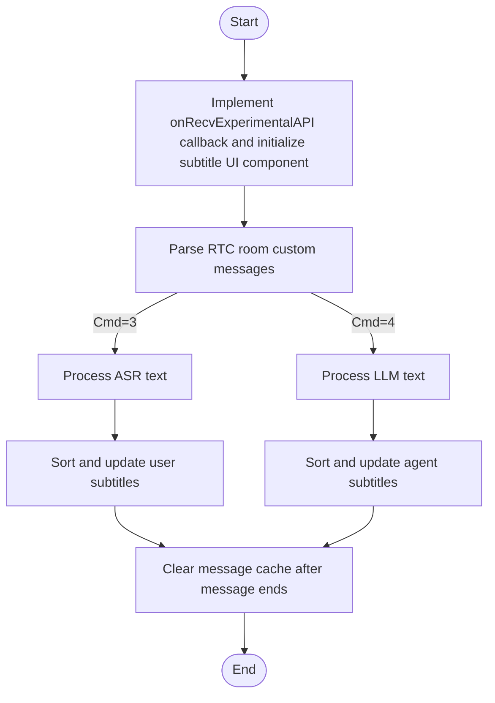

# Display Subtitles

---

This article introduces how to display subtitles during voice conversations between users and AI agents. As follows:

- User speech content: Stream display of what the user is saying (real-time results from Automatic Speech Recognition (ASR))
- Agent speech content: Stream display of agent output content (real-time output results from Large Language Model (LLM))

<Frame width="auto" height="512" caption="">
  
</Frame>

## Prerequisites

Have integrated ZEGO Express SDK and AI Agent following the [Quick Start](./../quick-start.mdx) documentation and implemented basic voice call functionality.

### Use Subtitle Component

:::if{props.platform=undefined}
You can directly download the [Subtitle Processing Class Source Code](https://github.com/ZEGOCLOUD/ai_agent_quick_start/blob/master/android/QuickStart/app/src/main/java/im/zego/aiagent/express/quickstart/voice/AudioChatMessageParser.java) to your project for direct use.
<Accordion title="Subtitle Processing Class Usage Example" defaultOpen="true">
```java
private AudioChatMessageParser audioChatMessageParser = new AudioChatMessageParser();

ZegoExpressEngine.getEngine().setEventHandler(new IZegoEventHandler() {
    @Override
    public void onRecvExperimentalAPI(String content) {
        super.onRecvExperimentalAPI(content);
        try {
            // Step 1: Parse content to JSONObject
            JSONObject json = new JSONObject(content);

            // Step 2: Check the value of method field
            if (json.has("method") && json.getString("method")
                .equals("liveroom.room.on_recive_room_channel_message")) {
                // Step 3: Get params and parse
                JSONObject paramsObject = json.getJSONObject("params");
                String msgContent = paramsObject.getString("msg_content");

                // AudioChatTextMessage will parse the JSON string
                audioChatMessageParser.parseAudioChatMessage(msgContent);
            }
        } catch (JSONException e) {
            e.printStackTrace();
        }
    }
});

audioChatMessageParser.setAudioChatMessageListListener(new AudioChatMessageListListener() {
    @Override
    public void onMessageListUpdated(List<AudioChatMessage> messagesList) {
        // Update UI list
        binding.messageList.onMessageListUpdated(messagesList);
    }
});

```
</Accordion>

:::
:::if{props.platform="iOS"}
You can directly download the [Subtitle Component Source Code](https://github.com/ZEGOCLOUD/ai_agent_quick_start/tree/master/ios/ai_agent_quickstart/aiagent/audio/subtitles) to your project for direct use.
<Accordion title="Subtitle Component Usage Example" defaultOpen="true">
<CodeGroup>
```objectivec YourView.h
#import <UIKit/UIKit.h>
#import "ZegoAIAgentSubtitlesEventHandler.h"

NS_ASSUME_NONNULL_BEGIN

@interface YourView : UIView <ZegoAIAgentSubtitlesEventHandler>

@end
```

```objectivec YourView.m
#import "YourView.h"

#import <Masonry/Masonry.h>

#import "ZegoAIAgentSubtitlesTableView.h"
#import "ZegoAIAgentSubtitlesMessageDispatcher.h"

@interface YourView() <ZegoEventHandler, ZegoAIAgentSubtitlesEventHandler>

// Agent subtitles
@property (nonatomic, strong, readwrite) ZegoAIAgentSubtitlesTableView *subtitlesTableView;

@end

@implementation YourView

- (instancetype)initWithFrame:(CGRect)frame {
    self = [super initWithFrame:frame];
    if (self) {
        // Register events
        [self registerEventHandler];

        [self setupSubtitles];
    }
    return self;
}

- (void)dealloc {
    // Unregister events
    [self unregisterEventHandler];
}

- (void)setupSubtitles {
    // Add chat view - occupy bottom half of screen
    CGRect chatFrame = CGRectMake(0,
                                 self.bounds.size.height / 2,
                                 self.bounds.size.width,
                                 self.bounds.size.height / 2);
    self.subtitlesTableView = [[ZegoAIAgentSubtitlesTableView alloc] initWithFrame:chatFrame style:UITableViewStylePlain];

    [self addSubview:self.subtitlesTableView];

    // Use Masonry to add constraints
    [self.subtitlesTableView mas_makeConstraints:^(MASConstraintMaker *make) {
        make.left.right.bottom.equalTo(self);
        make.height.equalTo(self.mas_height).multipliedBy(0.5);
    }];
}

#pragma mark - ZegoEventHandler
- (void)onRecvExperimentalAPI:(NSString *)content{
    [[ZegoAIAgentSubtitlesMessageDispatcher sharedInstance] handleExpressExperimentalAPIContent:content];
}

#pragma mark - ZegoAIAgentSubtitlesEventHandler

- (void)registerEventHandler {
    [[ZegoAIAgentSubtitlesMessageDispatcher sharedInstance] registerEventHandler:self];
}

- (void)unregisterEventHandler {
    [[ZegoAIAgentSubtitlesMessageDispatcher sharedInstance] unregisterEventHandler:self];
}

- (void)onRecvAsrChatMsg:(ZegoAIAgentAudioSubtitlesMessage *)message {
    [self.subtitlesTableView handleRecvAsrMessage:message];
}

- (void)onRecvLLMChatMsg:(ZegoAIAgentAudioSubtitlesMessage *)message {
    [self.subtitlesTableView handleRecvLLMMessage:message];
}

@end
```
</CodeGroup>
</Accordion>
:::
:::if{props.platform="flutter"}
You can directly download the [Subtitle Component Source Code](https://github.com/ZEGOCLOUD/ai_agent_quick_start/tree/master/flutter/lib/audio/subtitles) to your project for direct use.
<Accordion title="Subtitle Component Usage Example" defaultOpen="true">
<CodeGroup>
```dart
import 'package:flutter/material.dart';

import 'subtitles/view/view.dart';
import 'subtitles/view/model.dart';
import 'subtitles/protocol/message_protocol.dart';
import 'subtitles/protocol/message_dispatcher.dart';
import 'package:zego_express_engine/zego_express_engine.dart';

class ZegoAudioPage extends StatefulWidget {
  const ZegoAudioPage({super.key});

  @override
  State<ZegoAudioPage> createState() => _ZegoAudioPageState();
}

class _ZegoAudioPageState extends State<ZegoAudioPage>
    implements ZegoSubtitlesEventHandler {
  late ZegoSubtitlesViewModel subtitlesModel;

  @override
  void initState() {
    super.initState();

    subtitlesModel = ZegoSubtitlesViewModel();

    ZegoExpressEngine.onRecvExperimentalAPI = _onRecvExperimentalAPI;
    ZegoSubtitlesMessageDispatcher().registerEventHandler(this);
  }

  @override
  void dispose() {
    ZegoExpressEngine.onRecvExperimentalAPI = null;
    ZegoSubtitlesMessageDispatcher().unregisterEventHandler(this);

    super.dispose();
  }

  @override
  Widget build(BuildContext context) {
    return SafeArea(
      child: ZegoSubtitlesView(model: subtitlesModel),
    );
  }

  @override
  void onRecvAsrChatMsg(ZegoSubtitlesMessageProtocol message) {
    subtitlesModel.handleRecvAsrMessage(message);
  }

  @override
  void onRecvLLMChatMsg(ZegoSubtitlesMessageProtocol message) {
    subtitlesModel.handleRecvLLMMessage(message);
  }

  void _onRecvExperimentalAPI(String content) {
    ZegoSubtitlesMessageDispatcher.handleExpressExperimentalAPIContent(content);
  }
}

```
</CodeGroup>
</Accordion>
:::
:::if{props.platform="Web"}
If you have a Vue project, you can directly download the [Subtitle Processing Hook](https://github.com/ZEGOCLOUD/ai_agent_quick_start/blob/master/web/src/hooks/useChat.ts) to your project for direct use.
<Accordion title="Vue Project Subtitle Processing Hook Usage Example" defaultOpen="true">
```javascript
// Subtitle component sample code
// Import chatHook in the page
import { useChat } from "useChat";
import { onMounted, onBeforeUnmount } from 'vue';

// Call useChat method, pass Express SDK instance, messages is the message list, put into your subtitle component for rendering
const { messages, setupEventListeners, clearMessages } = useChat(zg);

onMounted(() => {
  // Register event listeners when page loads
  setupEventListeners()
})

onBeforeUnmount(() => {
 // Clear messages when page is destroyed
 clearMessages()
})

```
</Accordion>
:::

## Quick Implementation

If you don't want to use the subtitle component, you can also implement the subtitle component functionality yourself. Details are as follows:

During voice conversations between users and AI agents, the AI Agent server sends ASR recognized text and LLM response text through RTC room custom messages. The client can listen to room custom messages and parse corresponding status events to render the UI.

The RTC room custom message processing flow is as follows:



### Listen to Room Custom Messages

:::if{props.platform=undefined}
The client can listen to the `onRecvExperimentalAPI` callback to get room custom messages with `method` as `liveroom.room.on_recive_room_channel_message`. The following is sample code for listening to the callback ([click to view complete sample code](https://github.com/ZEGOCLOUD/ai_agent_quick_start/blob/master/android/QuickStart/app/src/main/java/im/zego/aiagent/express/quickstart/voice/VoiceChatActivity.java#L299)):
```java {2,4,15}
// Note!!!: Data received through room custom messages may be out of order, need to sort by SeqId field.
ZegoExpressEngine.getEngine().setEventHandler(new IZegoEventHandler() {
    @Override
    public void onRecvExperimentalAPI(String content) {
        super.onRecvExperimentalAPI(content);
        try {
            // Step 1: Parse content to JSONObject
            JSONObject json = new JSONObject(content);

            // Step 2: Check the value of method field
            if (json.has("method") && json.getString("method")
                .equals("liveroom.room.on_recive_room_channel_message")) {
                // Step 3: Get params and parse
                JSONObject paramsObject = json.getJSONObject("params");
                String msgContent = paramsObject.getString("msg_content");

                // JSON string example: "{\"Timestamp\":1745224717,\"SeqId\":1467995418,\"Round\":2132219714,\"Cmd\":3,\"Data\":{\"MessageId\":\"2135894567\",\"Text\":\"你\",\"EndFlag\":false}}"
                // Parse JSON string to AudioChatMessage object
                AudioChatMessage chatMessage = gson.fromJson(msgContent, AudioChatMessage.class);
                if (chatMessage.cmd == 3) {
                    updateASRChatMessage(chatMessage);
                } else if (chatMessage.cmd == 4) {
                    addOrUpdateLLMChatMessage(chatMessage);
                }
            }
        } catch (JSONException e) {
            e.printStackTrace();
        }
    }
});

/**
 * Voice chat interface, structure of chat messages received from backend server in the room
 */
  public static class AudioChatMessage {

        @SerializedName(value = "Timestamp", alternate = "timestamp")
        public long timestamp;
        @SerializedName(value = "SeqId", alternate = "seq_id")
        public long seqId;
        @SerializedName(value = "Round", alternate = "round")
        public long round;
        @SerializedName(value = "Cmd", alternate = "cmd")
        public int cmd;
        @SerializedName(value = "Data", alternate = "data")
        public Data data;

        public static class Data {

            @SerializedName(value = "SpeakStatus", alternate = "speak_status")
            public int speakStatus;
            @SerializedName(value = "Text", alternate = "text")
            public String text;
            @SerializedName(value = "MessageId", alternate = "message_id")
            public String messageId;
            @SerializedName(value = "EndFlag", alternate = "end_flag")
            public boolean endFlag;
            @SerializedName(value = "UserId", alternate = "user_id")
            public String userId;
        }
    }
```
:::
:::if{props.platform="iOS"}
The client can implement the ZegoEventHandler protocol and listen to the `onRecvExperimentalAPI` callback to get room custom messages with `method` as `liveroom.room.on_recive_room_channel_message`. The following is sample code for listening to the callback ([click to view complete sample code](https://github.com/ZEGOCLOUD/ai_agent_quick_start/tree/f4a5b30b42a6fe9e1a3b5b9dc0c4f8c6860cfc85/ios/ai_agent_quickstart/aiagent/audio/subtitles)):
<CodeGroup>
```objectivec YourService.h/m
// Implement ZegoEventHandler protocol
@interface YourService () <ZegoEventHandler>
@property (nonatomic, strong) YourViewController *youViewController;
@end

@implementation YourService

// Note!!!: Data received through room custom messages may be out of order, need to sort by SeqId field.
// Handle messages received from express onRecvExperimentalAPI
- (void)onRecvExperimentalAPI:(NSString *)content {
    // Forward to view to parse message content
    [self.youViewController handleExpressExperimentalAPIContent:content];
}

@end // YourService implementation
```

```objectivec YourViewController.h/m
// Implement ZegoEventHandler protocol in header file
@interface YourViewController ()

@end

@implementation YourViewController

// Parse custom signaling messages
- (void)handleExpressExperimentalAPIContent:(NSString *)content {
    // Parse JSON content
    NSError *error;
    NSData *jsonData = [content dataUsingEncoding:NSUTF8StringEncoding];
    NSDictionary *contentDict = [NSJSONSerialization JSONObjectWithData:jsonData
                                                        options:NSJSONReadingMutableContainers
                                                          error:&error];
    if (error || !contentDict) {
        NSLog(@"JSON parsing failed: %@", error);
        return;
    }
    // Check if it's a room message
    NSString *method = contentDict[@"method"];
    if (![method isEqualToString:@"liveroom.room.on_recive_room_channel_message"]) {
        return;
    }
    // Get message parameters
    NSDictionary *params = contentDict[@"params"];
    if (!params) {
        return;
    }
    NSString *msgContent = params[@"msg_content"];
    NSString *sendIdName = params[@"send_idname"];
    NSString *sendNickname = params[@"send_nickname"];
    NSString *roomId = params[@"roomid"];
    if (!msgContent || !sendIdName || !roomId) {
         NSLog(@"parseExperimentalAPIContent incomplete parameters: msgContent=%@, sendIdName=%@, roomId=%@",
                msgContent, sendIdName, roomId);
        return;
    }

    // JSON string example: "{\"Timestamp\":1745224717,\"SeqId\":1467995418,\"Round\":2132219714,\"Cmd\":3,\"Data\":{\"MessageId\":\"2135894567\",\"Text\":\"你\",\"EndFlag\":false}}"
    // Parse message content
    [self handleMessageContent:msgContent userID:sendIdName userName:sendNickname ?: @""];
}

// Handle message content
- (void)handleMessageContent:(NSString *)command userID:(NSString *)userID userName:(NSString *)userName{
    NSDictionary* msgDict = [self dictFromJson:command];
    if (!msgDict) {
        return;
    }

    // Parse basic information
    Number cmd = [msgDict[@"Cmd"] intValue];
    int64_t seqId = [msgDict[@"SeqId"] longLongValue];
    int64_t round = [msgDict[@"Round"] longLongValue];
    int64_t timestamp = [msgDict[@"Timestamp"] longLongValue];
    NSDictionary *data = msgDict[@"Data"];

    // Handle message based on command type
    switch (cmd) {
        case 3: // ASR text
            [self handleAsrText:data seqId:seqId round:round timestamp:timestamp];
            break;
        case 4: // LLM text
            [self handleLlmText:data seqId:seqId round:round timestamp:timestamp];
            break;
    }
}

@end // YourViewController implementation
```
</CodeGroup>
:::
:::if{props.platform="flutter"}
The client can listen to the `onRecvExperimentalAPI` callback to get room custom messages with `method` as `liveroom.room.on_recive_room_channel_message`. The following is sample code for listening to the callback ([click to view complete sample code](https://github.com/ZEGOCLOUD/ai_agent_quick_start/tree/master/flutter/lib/audio/subtitles)):
```dart
import 'dart:convert';

import 'package:flutter/cupertino.dart';
import 'package:zego_express_engine/zego_express_engine.dart';

class YourPage extends StatefulWidget {
  const YourPage({super.key});

  @override
  State<YourPage> createState() => _YourPageState();
}

class _YourPageState extends State<YourPage> {
  @override
  void initState() {
    super.initState();

    ZegoExpressEngine.onRecvExperimentalAPI = onRecvExperimentalAPI;
  }

  @override
  void dispose() {
    super.dispose();

    ZegoExpressEngine.onRecvExperimentalAPI = null;
  }

  @override
  Widget build(BuildContext context) {
    return YourMessageView();
  }

  /// Note!!!: Data received through room custom messages may be out of order, need to sort by SeqId field.
  void onRecvExperimentalAPI(String content) {
    try {
      /// Check if it's a room message
      final contentMap = jsonDecode(content);
      if (contentMap['method'] !=
          'liveroom.room.on_recive_room_channel_message') {
        return;
      }

      final params = contentMap['params'];
      if (params == null) {
        return;
      }

      final msgContent = params['msg_content'];
      if (msgContent == null) {
        return;
      }

      handleMessageContent(msgContent);
    } catch (e) {}
  }

  /// Handle message content
  void handleMessageContent(String msgContent) {
    final Map<String, dynamic> json = jsonDecode(msgContent);

    /// Parse basic information
    final int timestamp = json['Timestamp'] ?? 0;
    final int seqId = json['SeqId'] ?? 0;
    final int round = json['Round'] ?? 0;
    final int cmdType = json['Cmd'] ?? 0;
    final Map<String, dynamic> data =
        json['Data'] != null ? Map<String, dynamic>.from(json['Data']) : {};

    // Handle message based on command type
    switch (cmdType) {
      case 3:

        /// ASR text
        handleRecvAsrMessage(data, seqId, round, timestamp);
        break;
      case 4:

        /// LLM text
        handleRecvLLMMessage(data, seqId, round, timestamp);
        break;
    }
  }
}
```
:::
:::if{props.platform="Web"}
The client can listen to the `recvExperimentalAPI` callback to get room custom messages with `method` as `onRecvRoomChannelMessage`. The following is sample code for listening to the callback ([click to view complete sample code](https://github.com/ZEGOCLOUD/ai_agent_quick_start/blob/master/web/src/hooks/useChat.ts)):

```javascript {2,4,15}
// Note!!!: Data received through room custom messages may be out of order, need to sort by SeqId field.
zg.on("recvExperimentalAPI", (result) => {
  const { method, content } = result;
  if (method === "onRecvRoomChannelMessage") {
    try {
      // Parse message
      const recvMsg = JSON.parse(content.msgContent);
      const { Cmd, SeqId, Data, Round } = recvMsg;
    } catch (error) {
      console.error("Message parsing failed:", error);
    }
  }
});
// Enable onRecvRoomChannelMessage experimental API
zg.callExperimentalAPI({ method: "onRecvRoomChannelMessage", params: {} });

```
:::
### Room Custom Message Protocol

The field descriptions for room custom messages are as follows:

| Field | Type | Description |
| --- | --- | --- |
| Timestamp | Number | Timestamp, in seconds |
| SeqId | Number | Packet sequence number, may be out of order, please sort messages by sequence number. In extreme cases, IDs may not be consecutive. |
| Round | Number | Conversation round, increases each time user speaks actively |
| Cmd | Number | 3: Automatic Speech Recognition (ASR) text<br/>4: LLM text |
| Data | Object | Specific content, different Cmd corresponds to different Data |

Different Cmd values correspond to different Data, as follows:

<Tabs>
<Tab title="Cmd is 3">

| Field | Type | Description |
| --- | --- | --- |
| Text | string | User Automatic Speech Recognition (ASR) text<br/>Each delivery is full text, supports text correction |
| MessageId | string | Message ID, unique for each round of ASR text messages |
| EndFlag | bool | End flag, true indicates this round of ASR text processing is complete |

</Tab>
<Tab title="Cmd is 4">

| Field | Type | Description |
| --- | --- | --- |
| Text | string | LLM text<br/>Each delivery is incremental text |
| MessageId | string | Message ID, unique for each round of LLM text messages |
| EndFlag | bool | End flag, true indicates this round of LLM text processing is complete |

</Tab>
</Tabs>

### Processing Logic

Determine message type based on Cmd field, and get message content based on Data field.

<Tabs>
<Tab title="Cmd is 3, ASR text">

:::if{props.platform="Web"}
```javascript
 // Handle user message
 function handleUserMessage(data, seqId, round) {
    if (data.EndFlag) {
      // User finished speaking
    }
    const content = data.Text;
    if (conetent) {
      // Use ASR text corresponding to the latest seqId as the latest speech recognition result and update UI
    }
 }
```
:::
:::if{props.platform="iOS"}
```objectivec
- (void)handleAsrText:(NSDictionary *)data seqId:(int64_t)seqId round:(int64_t)round timestamp:(int64_t)timestamp {
    NSString *content = data[@"Text"];
    NSString *messageId = data[@"MessageId"];
    BOOL endFlag = [data[@"EndFlag"] boolValue];

    if (content && content.length > 0) {
        // Process ASR message and update UI
    }
}
```
:::
:::if{props.platform="flutter"}
```dart
  void handleRecvAsrMessage(
    Map<String, dynamic> data,
    int seqId,
    int round,
    int timestamp,
  ) {
    String text = '';
    String messageId = '';
    bool endFlag = false;
    if (data.containsKey('Text')) {
      text = data['Text'] ?? '';
    }
    if (data.containsKey('MessageId')) {
      messageId = data['MessageId'] ?? '';
    }
    if (data.containsKey('EndFlag')) {
      var val = data['EndFlag'];
      if (val is bool) {
        endFlag = val;
      } else if (val is int) {
        endFlag = val != 0;
      } else if (val is String) {
        endFlag = val == 'true' || val == '1';
      }
    }

    /// Process ASR message and update UI
  }
```
:::

The corresponding message processing flow is shown in the following figure:
<Frame width="512" height="auto" caption="">
  
</Frame>

</Tab>
<Tab title="Cmd is 4, LLM text">
:::if{props.platform="Web"}
```javascript
// Handle agent message
function handleAgentMessage(data, seqId, round) {
  const llmEndFlag = data.EndFlag;
  if (llmEndFlag) {
    // Agent finished answering
  }
  const llmText = data.Text;
  if (llmText) {
      // Process agent message
  }
}
```
:::
:::if{props.platform="iOS"}
```objectivec
- (void)handleLlmText:(NSDictionary *)data seqId:(int64_t)seqId round:(int64_t)round timestamp:(int64_t)timestamp {
    NSString *content = data[@"Text"];
    NSString *messageId = data[@"MessageId"];
    BOOL endFlag = [data[@"EndFlag"] boolValue];

    if (content && content.length > 0) {
        // Process LLM message and update UI
    }
}
```
:::
:::if{props.platform="flutter"}
```dart
  void handleRecvLLMMessage(
    Map<String, dynamic> data,
    int seqId,
    int round,
    int timestamp,
  ) {
    String text = '';
    String messageId = '';
    bool endFlag = false;
    if (data.containsKey('Text')) {
      text = data['Text'] ?? '';
    }
    if (data.containsKey('MessageId')) {
      messageId = data['MessageId'] ?? '';
    }
    if (data.containsKey('EndFlag')) {
      var val = data['EndFlag'];
      if (val is bool) {
        endFlag = val;
      } else if (val is int) {
        endFlag = val != 0;
      } else if (val is String) {
        endFlag = val == 'true' || val == '1';
      }
    }

    /// Process LLM message and update UI
  }
```
:::


The corresponding message processing flow is shown in the following figure. Where:
- AI Message Cache: A HashMap where key is MessageId and value is the new message.
- UI Message List: An array containing user messages and AI messages, storing all messages displayed on the UI.
<Frame width="512" height="auto" caption="">
  
</Frame>
</Tab>
</Tabs>


## Notes

- Message sorting processing: Data received through room custom messages may be out of order, need to sort by SeqId field.
- Streaming text processing:
> - ASR text is delivered as full text each time, messages with the same MessageId need to completely replace previous content.
> - LLM text is delivered as incremental text each time, messages with the same MessageId need to be accumulated for display after sorting.
- Memory management: Please clean up completed message caches in a timely manner, especially when users engage in long conversations.