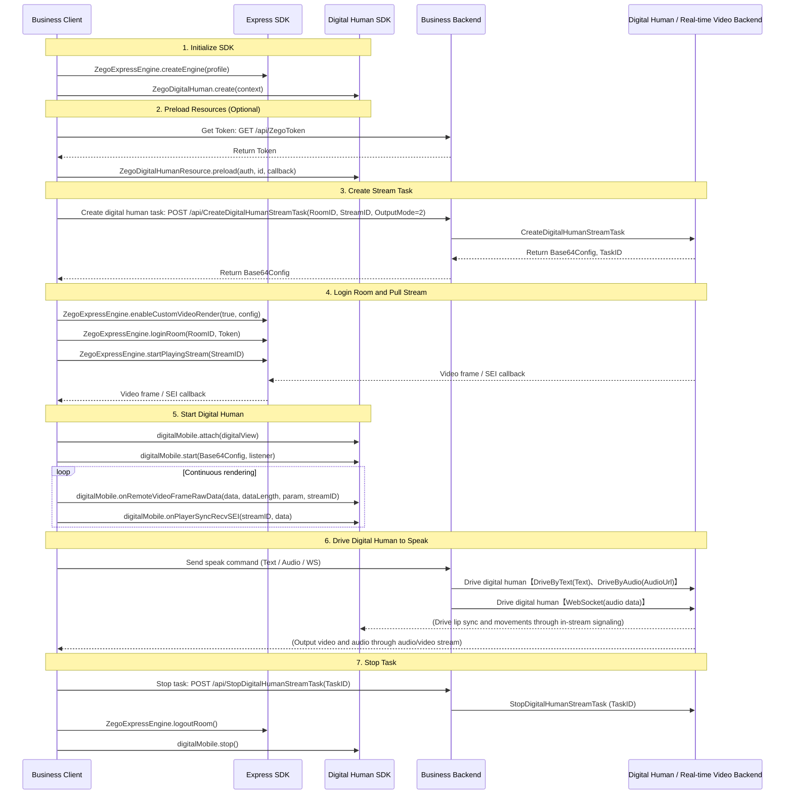
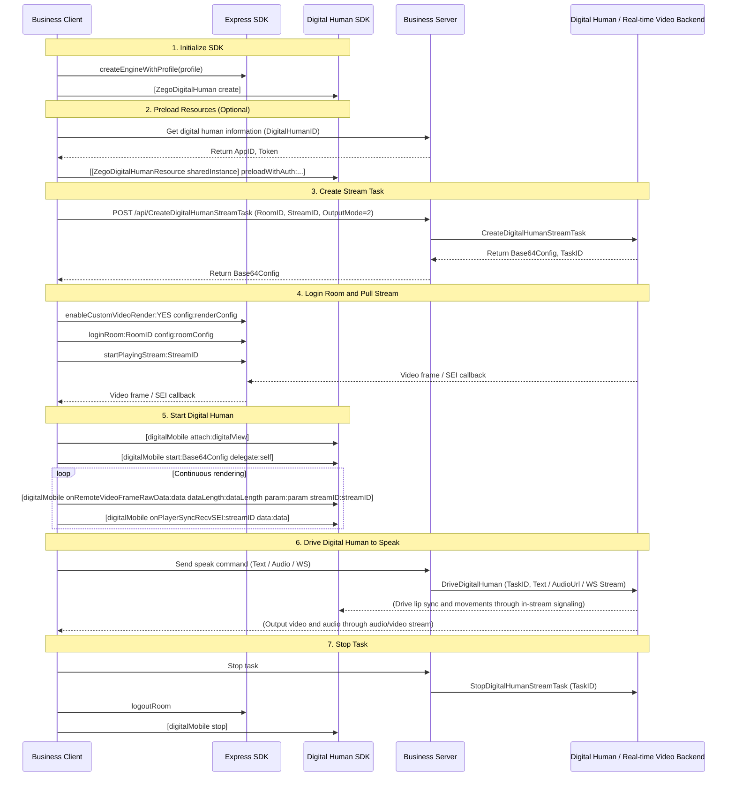
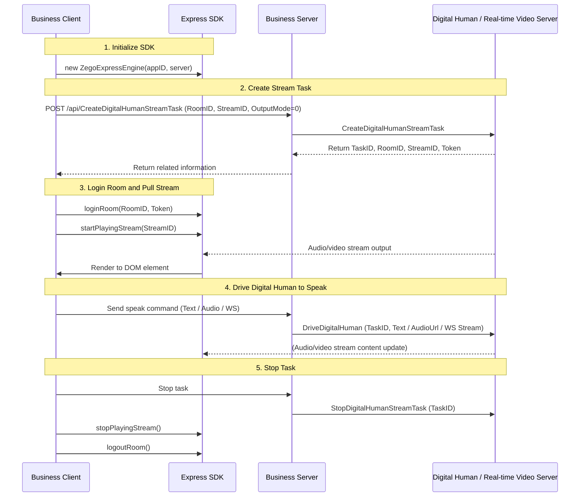

# Implement Digital Human Video Stream Broadcasting

---

This article introduces how to quickly implement digital human video stream broadcasting using ZEGO related SDKs.

## Feature Overview

Digital human video stream broadcasting refers to the process where, after creating a digital human video stream task through the digital human backend API and driving the digital human to speak, the client pulls the video stream for rendering and display using ZEGO Express SDK.

<Note title="Description">
- On mobile platforms (Android/iOS), rendering is done through the digital human SDK.
- On Web platform, rendering is done through ZEGO Express SDK.
</Note>

## Prerequisites

Before implementing the digital human feature, please ensure:
- A business backend integrated with digital human backend API has been deployed. For details, refer to the business backend [Run Sample Source Code](/aigc-digital-human-server/quick-start/run-example-code), and ensure the business backend API is accessible.
- Contact ZEGOCLOUD Technical Support to enable digital human service and related API permissions.
:::if{props.platform="undefined|iOS"}
- Complete SDK integration and permission configuration according to [Integrate SDK](./integrating-sdk.mdx).
:::
:::if{props.platform="Web"}
- Complete ZEGO Express SDK integration following [Integrate SDK](/real-time-voice-web/quick-start/integrating-sdk).
:::
## Concept Explanation

Before starting integration, please understand the following core concepts:

- **Custom Video Rendering**: An advanced feature provided by ZEGO Express SDK. In digital human scenarios, the client enables this feature to obtain raw video frame data, which is transparently passed to the digital human SDK for secondary processing and rendering.
- **RTC Room**: Refers to the audio/video space service provided by ZEGO, used to organize user groups. Users in the same room can send and receive real-time audio/video and messages to each other. For details, refer to [Login to Real-time Video Room](/real-time-video-android-java/quick-start/implementing-video-call#createroom).
- **Base64Config**: The core configuration string required to start the digital human SDK. Obtained by the business backend when calling the [Create Digital Human Video Stream Task](/aigc-digital-human-server/streaming-apis/digital-human-streaming/create-digital-human-stream-task) API.
- **SEI**: Video Supplemental Enhancement Information. The digital human SDK relies on SEI data carried in the video stream to achieve precise synchronization of digital human movements, lip sync, and audio.

## Sample Code

We provide client and business backend sample code for implementing the basic process of digital human video stream broadcasting. You can refer to its implementation logic to implement your own business logic:

<CardGroup cols={2}>
:::if{props.platform=undefined}
<Card title="Android Sample Source Code" href="https://github.com/ZEGOCLOUD/digital_human_paas_quick_start/tree/master/Android" target="_blank">
Includes core logic for initialization, custom rendering processing, calling business backend to create digital human video stream tasks, driving digital human, etc.
</Card>
:::
:::if{props.platform="iOS"}
<Card title="iOS Sample Source Code" href="https://github.com/ZEGOCLOUD/digital_human_paas_quick_start/tree/master/iOS" target="_blank">
Includes core logic for initialization, custom rendering processing, calling business backend to create digital human video stream tasks, driving digital human, etc.
</Card>
:::
:::if{props.platform="Web"}
<Card title="Web Sample Source Code" href="https://github.com/ZEGOCLOUD/digital_human_paas_quick_start/tree/master/Web" target="_blank">
Includes core logic for initialization, stream pulling and rendering, calling business backend to create digital human video stream tasks, driving digital human, etc.
</Card>
:::
<Card title="Business Backend Sample Source Code" href="https://github.com/ZEGOCLOUD/digital_human_paas_quick_start/tree/master/Server" target="_blank">
Includes server-side logic for creating digital human video stream tasks, driving digital human, stopping tasks, etc.
</Card>
</CardGroup>

## Overall Process Description

To implement digital human video stream broadcasting, complete the following steps:

:::if{props.platform="undefined|iOS"}
1. **Initialize SDK**: Initialize ZEGO Express SDK and Digital Human SDK respectively.
2. **Create Digital Human Video Stream Task**: Send a request to the business backend to call the digital human backend API to create a digital human video stream task and obtain `Base64Config`.
3. **Login to Room and Pull Stream**: Enable **Custom Video Rendering** mode, login to RTC room and pull the digital human video stream.
4. **Start Digital Human Rendering Engine**: Call the digital human SDK's `start` method, passing in `Base64Config` to start the digital human client rendering engine.
5. **Drive Digital Human to Speak**: Business backend uses text or audio data to drive the digital human to speak.
6. **Stop Task**: Stop pulling stream, logout from room and destroy related SDK instances.
:::
:::if{props.platform="Web"}
1. **Initialize SDK**: Initialize ZEGO Express SDK.
2. **Create Digital Human Video Stream Task**: Send a request to the business backend to call the digital human backend API to create a digital human video stream task.
3. **Login to Room and Pull Stream**: Login to RTC room and pull the digital human video stream.
4. **Drive Digital Human to Speak**: Business backend uses text or audio data to drive the digital human to speak.
5. **Stop Task**: Stop pulling stream, logout from room and destroy related SDK instances.
:::

## Implementation Process

The following flowchart shows the detailed interaction and API call parameters for the above steps:

:::if{props.platform=undefined}

:::

:::if{props.platform="iOS"}

:::

:::if{props.platform="Web"}

:::

## Implementation Steps

### 1 Initialize SDK

:::if{props.platform=undefined}
```java
// Initialize Express SDK
ZegoEngineProfile profile = new ZegoEngineProfile();
profile.appID = appId;
profile.scenario = ZegoScenario.HIGH_QUALITY_CHATROOM;
ZegoExpressEngine.createEngine(profile, null);

// Initialize SDK
IZegoDigitalMobile digitalMobile = ZegoDigitalHuman.create(context);
```
:::

:::if{props.platform="iOS"}
```oc
// Initialize Express SDK
ZegoEngineProfile *profile = [[ZegoEngineProfile alloc] init];
profile.appID = (unsigned int)appId;
profile.scenario = ZegoScenarioHighQualityChatroom;
[ZegoExpressEngine createEngineWithProfile:profile eventHandler:self];

// Initialize SDK
self.digitalMobile = [ZegoDigitalHuman create];
```
:::

:::if{props.platform="Web"}
```javascript
// Instantiate ZegoExpressEngine
const zg = new ZegoExpressEngine(appID, server);
```
:::

:::if{props.platform=undefined}
### 2 Preload Resources (Optional)

To improve digital human startup speed and reduce waiting time after pulling stream, it is recommended to preload digital human resources before creating a task.


<Note title="Description">
- You need to call the business backend first to get the Token for preloading digital human resources. Refer to [GET /api/ZegoToken](https://github.com/ZEGOCLOUD/digital_human_paas_quick_start/blob/90d895e93d16bf8bddf7effe8034ed19d7a724ad/Server/internal/handler/token.go#L16) for implementation.
- Usually, once a digital human ID is selected, it will not change. Here we assume that the digital human backend API [Query Digital Human Avatar List](/aigc-digital-human-server/streaming-apis/digital-human-management/get-digital-human-list) has been called to select a specific digital human ID.
</Note>

```java
// Preload digital human resources
ZegoDigitalMobileAuth auth = new ZegoDigitalMobileAuth(appId, userId, token);
ZegoDigitalHumanResource.INSTANCE.preload(context, auth, digitalHumanId, new ZegoDigitalHumanResource.PreloadCallback() {
    @Override
    public void onSuccess() {
        // Preload successful
    }

    @Override
    public void onProgress(int progress) {
        // Preload progress
    }

    @Override
    public void onError(int code, String msg) {
        // Preload failed
    }
});
```
:::

:::if{props.platform="iOS"}
### 2 Preload Resources (Optional)

To improve digital human startup speed and reduce waiting time after pulling stream, it is recommended to preload digital human resources before creating a task.

```oc
// Preload digital human resources
ZegoDigitalHumanAuth *auth = [[ZegoDigitalHumanAuth alloc] initWithAppID:(unsigned int)appId
                                                                  userID:userId
                                                                   token:token];
[[ZegoDigitalHumanResource sharedInstance] preloadWithAuth:auth
                                           digitalHumanId:digitalHumanId
                                                 delegate:self];
```
:::

:::if{props.platform="undefined|iOS"}
### 3 Create Digital Human Video Stream Task
:::
:::if{props.platform="Web"}
### 2 Create Digital Human Video Stream Task
:::

The business client needs to send a request to the business server, which calls the digital human backend API [Create Digital Human Video Stream Task](/aigc-digital-human-server/streaming-apis/digital-human-streaming/create-digital-human-stream-task). In this step, the **business server** will obtain key information including `RoomID`, `Token`, `StreamID`, and `Base64Config`.


#### Return Field Usage Description

| Field | Usage Description |
| :--- | :--- |
| **RoomID** | The RTC room ID where the digital human is located. The client logs into this room to pull the digital human's audio/video stream. |
| **Token** | The authentication token required to login to the RTC room, used to ensure call security. |
| **StreamID** | The unique identifier for the digital human's published stream. The client identifies and pulls the corresponding digital human video stream based on this ID. |
| **Base64Config** | **(Required for mobile)** Startup configuration string, used to call the digital human SDK's `start` interface. |

:::if{props.platform="undefined|iOS"}
<Warning title="Note">
When creating a task on mobile platforms (Android/iOS), you must set `OutputMode` to `2` to save bandwidth.
</Warning>
:::


:::if{props.platform="undefined|iOS"}
### 4 Login Room and Pull Stream for Rendering
:::
:::if{props.platform="Web"}
### 3 Login Room and Pull Stream for Rendering
:::

After obtaining the task information, the client needs to login to the RTC room and pull the digital human video stream.

:::if{props.platform=undefined}
The mobile digital human SDK takes over video rendering to achieve better interaction effects. After successful login, enable **Custom Video Rendering** mode, and transparently pass video frame data to the digital human SDK in the callback.

```java
// 1. Login to room
ZegoUser user = new ZegoUser(userId, userName);
ZegoRoomConfig config = new ZegoRoomConfig();
config.token = token; // Token obtained from business backend
ZegoExpressEngine.getEngine().loginRoom(roomId, user, config, (errorCode, extendedData) -> {
    if (errorCode == 0) {
        // 2. After successful login, enable custom rendering
        ZegoCustomVideoRenderConfig renderConfig = new ZegoCustomVideoRenderConfig();
        renderConfig.bufferType = ZegoVideoBufferType.RAW_DATA;
        renderConfig.frameFormatSeries = ZegoVideoFrameFormatSeries.RGB;
        ZegoExpressEngine.getEngine().enableCustomVideoRender(true, renderConfig);

        // 3. Start pulling stream
        ZegoExpressEngine.getEngine().startPlayingStream(streamID);
    }
});

// 4. Transparently pass video frames and SEI in custom rendering callback
ZegoExpressEngine.getEngine().setCustomVideoRenderHandler(new IZegoCustomVideoRenderHandler() {
    @Override
    public void onRemoteVideoFrameRawData(ByteBuffer[] data, int[] dataLength,
                                         ZegoVideoFrameParam param, String streamID) {
        // Convert Express video frame to digital human SDK required format and transparently pass
        IZegoDigitalMobile.ZegoVideoFrameParam dmParam = new IZegoDigitalMobile.ZegoVideoFrameParam();
        dmParam.width = param.width;
        dmParam.height = param.height;
        dmParam.format = IZegoDigitalMobile.ZegoVideoFrameFormat.getZegoVideoFrameFormat(param.format.value());
        for (int i = 0; i < 4; i++) {
            dmParam.strides[i] = param.strides[i];
        }
        digitalMobile.onRemoteVideoFrameRawData(data, dataLength, dmParam, streamID);
    }

    @Override
    public void onPlayerSyncRecvSEI(String streamID, byte[] data) {
        // Transparently pass SEI data to ensure audio-video synchronization
        digitalMobile.onPlayerSyncRecvSEI(streamID, data);
    }
});
```
:::

:::if{props.platform="iOS"}
The mobile digital human SDK takes over video rendering to achieve better interaction effects. After successful login, enable **Custom Video Rendering** mode, and transparently pass video frame data to the digital human SDK in the callback.

```oc
// 1. Login to room
ZegoUser *user = [ZegoUser userWithUserID:userID userName:userName];
ZegoRoomConfig *config = [[ZegoRoomConfig alloc] init];
config.token = token; // Token obtained from business backend
[[ZegoExpressEngine sharedEngine] loginRoom:roomID user:user config:config callback:^(int errorCode, NSDictionary *extendedData) {
    if (errorCode == 0) {
        // 2. After successful login, enable custom rendering
        ZegoCustomVideoRenderConfig *renderConfig = [[ZegoCustomVideoRenderConfig alloc] init];
        renderConfig.bufferType = ZegoVideoBufferTypeRawData;
        renderConfig.frameFormatSeries = ZegoVideoFrameFormatSeriesRGB;
        [[ZegoExpressEngine sharedEngine] enableCustomVideoRender:YES config:renderConfig];

        // 3. Start pulling stream
        [[ZegoExpressEngine sharedEngine] startPlayingStream:streamID];
    }
}];

// 4. Transparently pass video frames and SEI in custom rendering callback
- (void)onRemoteVideoFrameRawData:(unsigned char **)data dataLength:(unsigned int *)dataLength param:(ZegoVideoFrameParam *)param streamID:(NSString *)streamID {
    // Convert Express video frame to digital human SDK required format and transparently pass
    ZDMVideoFrameParam *dmParam = [[ZDMVideoFrameParam alloc] init];
    dmParam.format = (ZDMVideoFrameFormat)param.format;
    dmParam.width = param.size.width;
    dmParam.height = param.size.height;
    for (int i = 0; i < 4; i++) {
        [dmParam setStride:param.strides[i] atIndex:i];
    }
    [self.digitalMobile onRemoteVideoFrameRawData:data dataLength:dataLength param:dmParam streamID:streamID];
}

- (void)onPlayerSyncRecvSEI:(NSData *)data streamID:(NSString *)streamID {
    // Transparently pass SEI data to ensure audio-video synchronization
    [self.digitalMobile onPlayerSyncRecvSEI:streamID data:data];
}
```
:::

:::if{props.platform="Web"}
Web platform directly uses Express SDK's login and pull stream interfaces to render the stream to the specified DOM element.

```javascript
// 1. Login to room
await zg.loginRoom(roomID, token, { userID, userName });

// 2. Start pulling stream
const remoteStream = await zg.startPlayingStream(streamID);

// 3. Render to specified View
const remoteView = zg.createRemoteStreamView(remoteStream);
remoteView.play("remote-video-container-id");
```
:::

:::if{props.platform="undefined|iOS"}
### 5 Start Digital Human

The client needs to bind the rendering view and start the digital human to process SEI data to ensure audio-video synchronization.
:::

:::if{props.platform=undefined}
Call the `attach` interface to bind the view, and call the `start` interface passing in `Base64Config` to start the digital human.

```java
// 1. Bind view
digitalMobile.attach(findViewById(R.id.digital_human_view));
// 2. Start digital human
digitalMobile.start(base64Config, listener);
```
:::

:::if{props.platform="iOS"}
Call the `attach` interface to bind the view, and call the `start` interface passing in `Base64Config` to start the digital human. Also, handle SEI callback:

```oc
// 1. Bind view
[self.digitalMobile attach:self.digitalView];
// 2. Start digital human
[self.digitalMobile start:base64Config delegate:self];

// SEI handling
- (void)onPlayerSyncRecvSEI:(NSData *)data streamID:(NSString *)streamID {
    [self.digitalMobile onPlayerSyncRecvSEI:streamID data:data];
}
```
:::

:::if{props.platform="undefined|iOS"}
### 6 Drive Digital Human
:::
:::if{props.platform="Web"}
### 4 Drive Digital Human
:::

After the task is successfully created, you need to drive the digital human to speak through the business server calling PaaS API. The following driving methods are supported:

|Driving Method|Business Backend API|Digital Human Backend API|Description|
|:---|:---|:---|:---|
|Text Drive|POST /api/DriveByText|DriveByText(Text)|[Text Drive Digital Human](/aigc-digital-human-server/streaming-apis/digital-human-streaming/drive-by-text)|Client sends text, business backend calls digital human backend API to drive digital human to speak.|
|Audio Drive|POST /api/DriveByAudio|DriveByAudio(AudioUrl)|[Audio Drive Digital Human](/aigc-digital-human-server/streaming-apis/digital-human-streaming/drive-by-audio)|Client sends audio file URL, business backend calls digital human backend API to drive digital human to speak.|
|WebSocket Drive|POST /api/DriveByWsStream|DriveByWsStream(Audio data)|[WebSocket Audio Stream Drive Digital Human](/aigc-digital-human-server/streaming-apis/digital-human-streaming/drive-by-ws-stream)|Client transmits audio data in real-time via WebSocket, business backend calls digital human backend API to drive digital human to speak.|

:::if{props.platform=undefined}
```java
// 1. Text drive
apiService.driveByText(taskId, new DriveCallback() {
    @Override
    public void onSuccess() {
        // Drive successful
    }
});

// 2. Audio file drive
apiService.driveByAudio(taskId, new DriveCallback() {
    @Override
    public void onSuccess() {
        // Drive successful
    }
});

// 3. WebSocket drive
apiService.driveByWsStreamWithTTS(taskId, new DriveCallback() {
    @Override
    public void onSuccess() {
        // Drive successful
    }
});
```
:::

:::if{props.platform="iOS"}
```oc
// 1. Text drive
[[ZegoAPIService sharedService] driveByText:taskId success:^(NSDictionary *data) {
    // Drive successful
} failure:nil];

// 2. Audio file drive
[[ZegoAPIService sharedService] driveByAudio:taskId success:^(NSDictionary *data) {
    // Drive successful
} failure:nil];

// 3. WebSocket drive
[[ZegoAPIService sharedService] driveByWsStreamWithTTS:taskId success:^(NSDictionary *data) {
    // Drive successful
} failure:nil];
```
:::

:::if{props.platform="Web"}
```javascript
// 1. Text drive
await driveAPI.driveByText(taskId);

// 2. Audio file drive
await driveAPI.driveByAudio(taskId);

// 3. WebSocket drive
await driveAPI.driveByWsStreamWithTTS(taskId);
```
:::

:::if{props.platform="undefined|iOS"}
### 7 Stop Task
:::
:::if{props.platform="Web"}
### 5 Stop Task
:::

:::if{props.platform=undefined}
```java
ZegoExpressEngine.getEngine().stopPlayingStream(streamId);
ZegoExpressEngine.getEngine().logoutRoom(roomId);
digitalMobile.stop();
ZegoExpressEngine.destroyEngine(null);
```
:::

:::if{props.platform="iOS"}
```oc
[[ZegoExpressEngine sharedEngine] stopPlayingStream:streamId];
[[ZegoExpressEngine sharedEngine] logoutRoom];
[self.digitalMobile stop];
[ZegoExpressEngine destroyEngine:nil];
```
:::

:::if{props.platform="Web"}
```javascript
zg.stopPlayingStream(streamId);
zg.logoutRoom();
```
:::

## Related Documentation

:::if{props.platform=undefined}
- [Integrate SDK](/aigc-digital-human-android/integrating-sdk)
:::
:::if{props.platform="iOS"}
- [Integrate SDK](/aigc-digital-human-ios/integrating-sdk)
:::
:::if{props.platform="Web"}
- [Integrate SDK](/real-time-voice-web/quick-start/integrating-sdk)
:::
- [Server API - Create Digital Human Video Stream Task](/aigc-digital-human-server/streaming-apis/digital-human-streaming/create-digital-human-stream-task)
- [Error Code Query](/aigc-digital-human-android/client-sdk/error-code)
