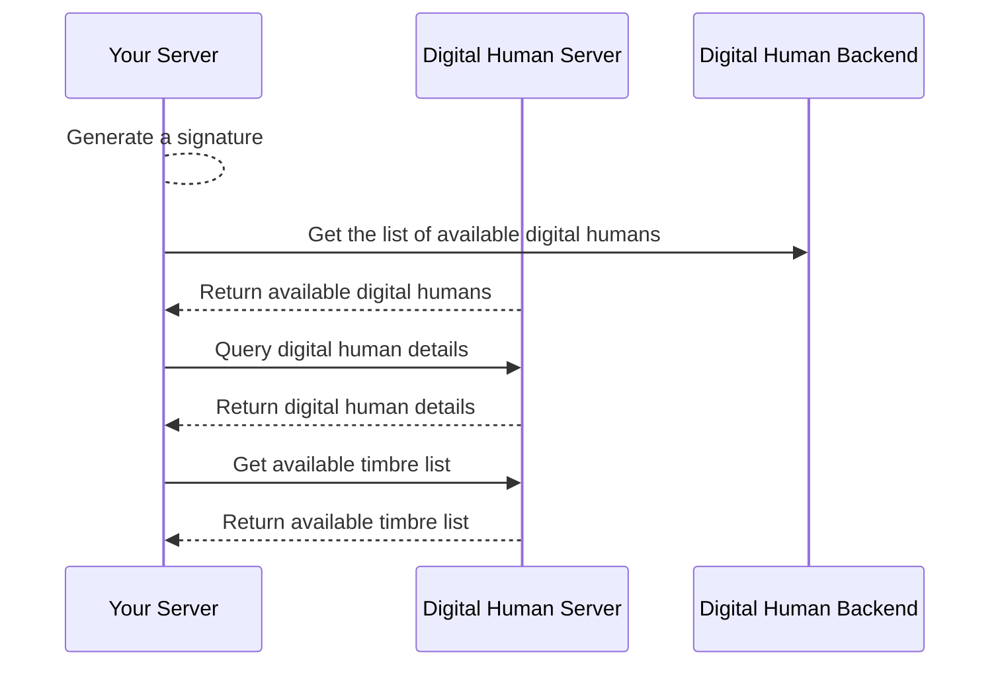

# Query Digital Human Assets

- - -

## Introduction

Digital human assets refer to digital humans and timbres that can be used to [synthesize real-time streaming digital human videos](./digital-human-livestreaming.mdx).

These include:
- Digital humans: Digital humans available to you on ZEGOCLOUD, including public digital humans provided by ZEGOCLOUD and exclusive digital humans customized by you on ZEGOCLOUD.
- Timbres: Digital human timbres available to you on ZEGOCLOUD, including public timbres provided by ZEGOCLOUD and exclusive timbres customized by you on ZEGOCLOUD.

This document describes how to quickly query digital human assets based on server APIs.

<Note title="Note">
To learn about pricing for custom digital humans and voices, please contact ZEGOCLOUD sales representatives.
</Note>

## Prerequisites

Before querying digital human assets, ensure that:
- You have created a project in the [ZEGOCLOUD Console](https://console.zegocloud.com/), and get its valid AppID and AppSign. For more details, please refer to Admin Console doc [How to view project info](https://www.zegocloud.com/docs/admin-console/view-project-information?platform=all&language=all).
- You have contacted ZEGOCLOUD technical support to enable the Digital Human AI platform service and related interface permissions.

## Implementation Process

### 1 Generate a signature

Generate a signature according to the signature mechanism described in [Accessing Server APIs](./../server-apis/accessing-server-apis.mdx#signing-the-requests). The signature needs to be set in the common parameters of the following requests. The ZEGOCLOUD server will verify the signature after receiving the request to validate the legitimacy of the requester.

### 2 Query the Digital Human List

Call the [GetDigitalHumanList](./../server-apis/digital-human-management/get-digital-human-list.mdx) interface to obtain the information list of available digital humans under the AppID, and select the required digital human ID (`DigitalHumanId`) from it.

### 3 Query Digital Human Details

Call the [GetDigitalHumanInfo](./../server-apis/digital-human-management/get-digital-human-info.mdx) interface, pass in the obtained `DigitalHumanId`, and query the detailed information of the digital human, including the action list supported by the digital human, for subsequent use in [Action-Driven Digital Human](./../server-apis/digital-human-streaming/do-action.mdx).

### 4 Query Timbre List

Call the [GetTimbreList](./../server-apis/digital-human-management/get-timbre-list.mdx) interface, pass in the obtained `DigitalHumanId`, and query the timbre information list associated with the digital human avatar, and select the required timbre ID (`TimbreId`) from it, for subsequent use in [Synthesize Real-time Streaming Digital Human Video](./digital-human-livestreaming.mdx).

## Next Steps

After obtaining the digital human avatar ID and timbre ID from the above process, you can start [Synthesizing Real-time Streaming Digital Human Video](./digital-human-livestreaming.mdx).
