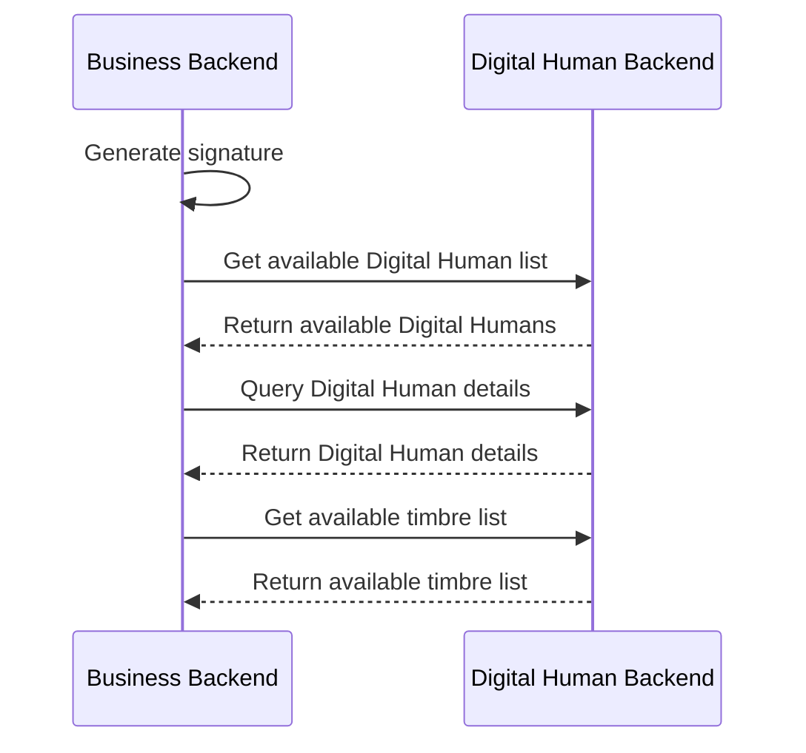

# Query Digital Human Assets

- - -

## Introduction

Digital Human assets refer to Digital Humans and timbres, which can be used for [synthesizing real-time streaming Digital Human videos](./digital-human-livestreaming.mdx).

Where:
- Digital Human: The Digital Humans you can use on ZEGOCLOUD, including public Digital Humans provided by ZEGOCLOUD and exclusive Digital Humans you have customized on ZEGOCLOUD.
- Timbre: The Digital Human timbres you can use on ZEGOCLOUD, including public timbres provided by ZEGOCLOUD and exclusive timbres you have customized on ZEGOCLOUD.

This document describes how to quickly query Digital Human assets using server APIs.

<Note title="Note">
For pricing information on customizing Digital Humans and voices, please contact ZEGOCLOUD sales.
</Note>

## Prerequisites

Before querying Digital Human assets, please ensure:
- You have created a project in the [ZEGOCLOUD Console](https://console.zegocloud.com) and obtained a valid AppID. For details, refer to [Console - Project Management - Project Information](/console/project-info).
- You have contacted ZEGOCLOUD Technical Support to enable the Digital Human API service and related API permissions.

## Implementation Process

```mermaid
sequenceDiagram
    participant Business Backend
    participant Digital Human Backend

    Business Backend->>Business Backend: Generate signature
    Business Backend->>Digital Human Backend: Get available Digital Human list
    Digital Human Backend-->>Business Backend: Return available Digital Humans
    Business Backend->>Digital Human Backend: Query Digital Human details
    Digital Human Backend-->>Business Backend: Return Digital Human details
    Business Backend->>Digital Human Backend: Get available timbre list
    Digital Human Backend-->>Business Backend: Return available timbre list
```

### 1 Generate Signature

Generate a signature according to the signature mechanism described in [API Calling Methods](../streaming-apis/accessing-server-apis.mdx#signature-mechanism). The signature needs to be set in the common parameters of the requests below. The ZEGOCLOUD server will verify the signature upon receiving the request to validate the requester's legitimacy.

### 2 Query Digital Human Avatar List

Call the [Query Digital Human List](../streaming-apis/digital-human-management/get-digital-human-list.mdx) API to get the list of available Digital Humans under your AppID, and select the desired Digital Human ID (`DigitalHumanId`).

### 3 Query Digital Human Details

Call the [Query Digital Human Info](../streaming-apis/digital-human-management/get-digital-human-info.mdx) API, passing the obtained `DigitalHumanId` to query the detailed information of the Digital Human, including the list of actions supported by the Digital Human, for subsequent use in [Driving Digital Human with Actions](../streaming-apis/digital-human-streaming/do-action.mdx).

### 4 Query Timbre List

Call the [Query Timbre List](../streaming-apis/timbre-management/get-timbre-list.mdx) API, passing the obtained `DigitalHumanId` to query the list of timbres associated with the Digital Human avatar, and select the desired timbre ID (`TimbreId`) for subsequent use in [Synthesizing Real-Time Streaming Digital Human Video](./digital-human-livestreaming.mdx).

## Next Steps

After obtaining the Digital Human avatar ID and timbre ID from the above process, you can proceed to [Synthesize Real-Time Streaming Digital Human Video](./digital-human-livestreaming.mdx).
