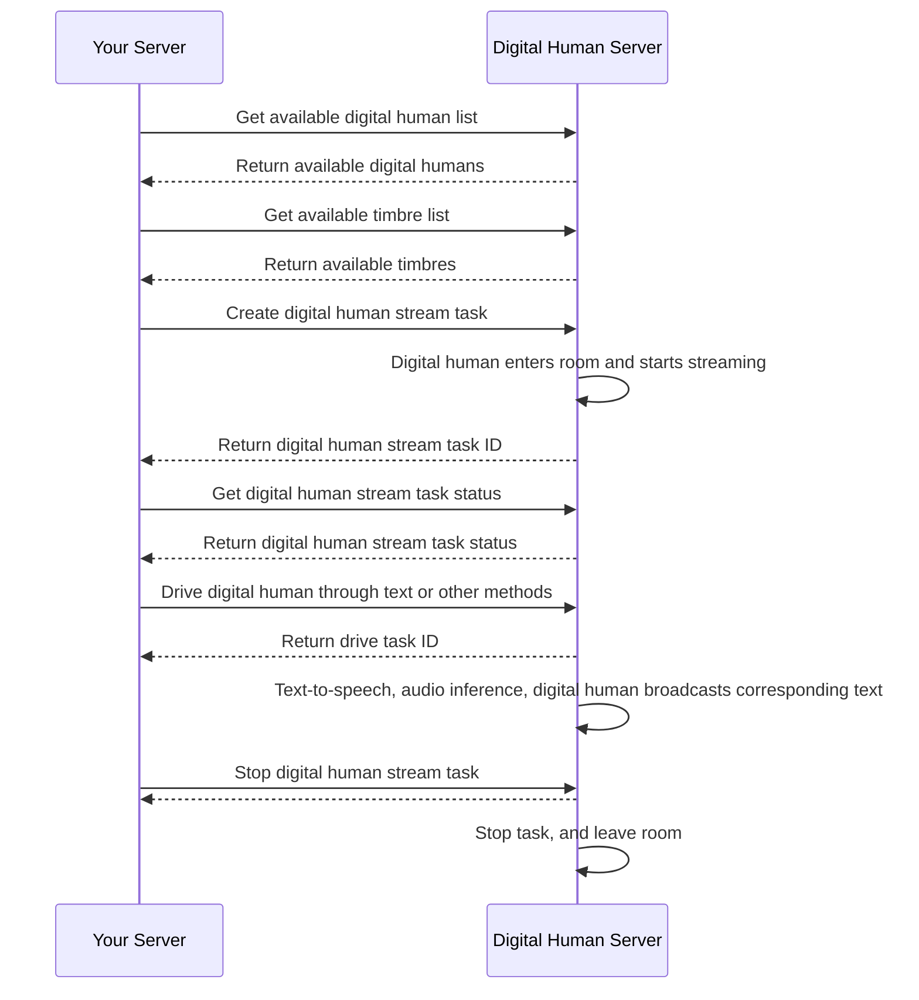

# Synthesize Real-Time Streaming Digital Human Video

- - -

## Introduction

This document describes how to quickly implement real-time streaming video synthesis based on server APIs.

<Note title="Note">
Real-time streaming digital human video generation and push streaming require use of [Express Video](https://www.zegocloud.com/docs/video-call/overview?platform=android&language=java).
</Note>

## Prerequisites

Before synthesizing real-time streaming digital human videos, ensure that:
- You have created a project in the [ZEGOCLOUD Console](https://console.zegocloud.com/), and get its valid AppID and AppSign. For more details, please refer to Admin Console doc [How to view project info](https://www.zegocloud.com/docs/admin-console/view-project-information?platform=all&language=all).
- You have contacted ZEGOCLOUD technical support to enable the Digital Human API platform service and related interface permissions.
- You have obtained the digital human ID and timbre ID. For details, please refer to [Query Digital Human Assets](./describe-assets.mdx).
- Your project has integrated the [Express Video SDK](https://www.zegocloud.com/docs/video-call/overview?platform=android&language=java).

## 实现流程

### 1 Generate a signature

Generate a signature according to the signature mechanism described in [Accessing Server APIs](./../server-apis/accessing-server-apis.mdx#signing-the-requests). The signature needs to be set in the common parameters of the following requests. The ZEGOCLOUD server will verify the signature after receiving the request to validate the legitimacy of the requester.

### 2 Get the list of available digital humans

Call the [GetDigitalHumanList](./../server-apis/digital-human-management/get-digital-human-list.mdx) interface to get the list of available digital humans.

### 3 Get the list of available timbres

Call the [GetTimbreList](./../server-apis/digital-human-management/get-timbre-list.mdx) interface to get the list of available timbres.

### 4 Create a digital human video stream task

Call the [CreateDigitalHumanStreamTask](./../server-apis/digital-human-streaming/create-digital-human-stream-task.mdx) interface to create a digital human video stream task, and generate the real-time digital human video.

### 5 Get the status of the digital human video stream task

Call the [GetDigitalHumanStreamTaskStatus](./../server-apis/digital-human-streaming/get-digital-human-stream-task-status.mdx) interface to get the status of the digital human video stream task. If the status is `3: Streaming`, it means that the task is running, and the client can enter the room to pull the digital human video stream.

### 6 Drive the digital human to speak

Use [Text](./../server-apis/digital-human-streaming/drive-by-text.mdx), [Audio](./../server-apis/digital-human-streaming/drive-by-audio.mdx), [RTC Audio Stream](./../server-apis/digital-human-streaming/drive-by-rtc-stream.mdx), or [Web Socket Interface](./digital-human-ws-drive.mdx) to drive the digital human to speak.

### 7 Stop the digital human video stream task

Call the [StopDigitalHumanStreamTask](./../server-apis/digital-human-streaming/stop-digital-human-stream-task.mdx) interface to stop the digital human video stream task.
