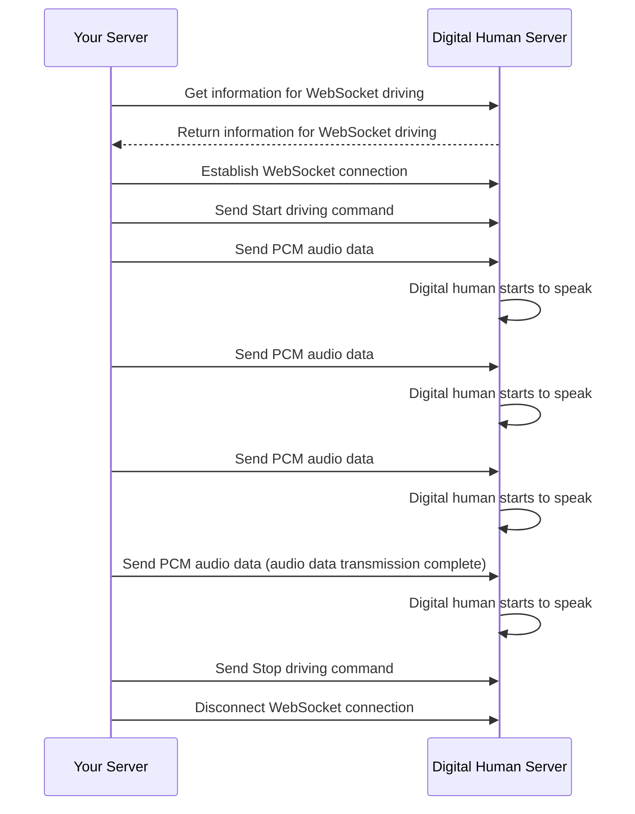

export const DriveIdNote = () => (
  <Note title="Note">Please call the `DriveByWsStream` interface to get a new `DriveId` every time you drive the digital human by WebSocket.</Note>
);

# Drive Digital Human Speech via WebSocket

- - -

## Introduction

This document describes how to use WebSocket to transmit PCM audio data to drive digital human speech.

## Prerequisites

Before using WebSocket drive, ensure that:
- You have [created a digital human video stream task](./../server-apis/digital-human-streaming/create-digital-human-stream-task.mdx).

## Implementation Process



### 1 Get information for WebSocket driving

Call the [DriveByWsStream](./../server-apis/digital-human-streaming/drive-by-ws-stream.mdx) interface to get information for WebSocket driving. The interface returns WebSocket driving information, including the WebSocket address (including authentication information) and driving task ID.

### 2 Establish WebSocket Connection

<Note title="Note">
* For the same digital human video stream task, please do not establish multiple connections simultaneously and send data in parallel on different connections.
* When establishing a WebSocket connection, please skip certificate verification.
</Note>
Establish a WebSocket connection through the WebSocket address (including authentication information).

### 3 Send a Start Command

After the WebSocket connection is established, send the start driving command through this connection. The protocol is as follows:

#### Request Parameters
| Parameter               | Type   | Required | Description             |
|------------------|------|------|-------------------------|
| Action      | String | Yes    | Fixed value: `Start`  |
| Payload      | Object | Yes    | Request body.         |
| └DriveId      | String   | Yes    | Obtained from the response parameters of the [Get WebSocket Driving Information](./../server-apis/digital-human-streaming/drive-by-ws-stream.mdx) interface.<DriveIdNote /> |
| └SampleRate      | Number  | No   | Audio sampling rate, currently supports the following two sampling rates:<ul><li>`16000`</li><li>`24000`</li></ul> If not filled, the default value is `16000`. |

#### Request Example
```json
{
    "Action": "Start",
    "Payload": {
        "DriveId": "xxxxxxxxxxx",
        "SampleRate": 16000
    }
}
```

### 4 Send PCM Audio Data

Send the original PCM binary audio data to the digital human API platform service through the WebSocket connection.

### 5 Send a Stop Command

After the PCM audio data is sent, please send the `Stop` command in time to avoid causing digital human stuttering. The protocol is as follows:

<Note title="Note">
If the `Stop` command is not sent in time, the digital human backend will mistakenly judge that there is still remaining PCM data to be received, and will continue to wait, causing the data to be insufficient to complete the inference, and then causing the digital human to stutter.
</Note>

#### Request Parameters

| Parameter               | Type   | Required | Description             |
|------------------|------|------|-------------------------|
| Action      | String | Yes    | Fixed value: `Stop`  |
| Payload      | Object | Yes    | Request body.         |
| └DriveId      | String   | Yes    | Obtained from the response parameters of the [Get WebSocket Driving Information](./../server-apis/digital-human-streaming/drive-by-ws-stream.mdx) interface.<DriveIdNote /> |

#### Request Example
```json
{
    "Action": "Stop",
    "Payload": {
        "DriveId": "xxxxxxxxxxx"
    }
}
```

### 6 Disconnect WebSocket Connection

If there are no subsequent WebSocket driving requests, please disconnect the connection in time.


## Sample Code

The following is the sample code for driving the digital human to speak by transmitting PCM audio data through WebSocket. You can refer to the sample code to implement your own business logic.

<CodeGroup>
```go title="Go"
package main

import (
	"bytes"
	"crypto/md5"
	"crypto/tls"
	"encoding/hex"
	"encoding/json"
	"fmt"
	"io"
	"io/ioutil"
	"math/rand"
	"net/http"
	"net/url"
	"os"
	"strconv"
	"time"

	"github.com/gorilla/websocket"
)

// Configuration
const (
	AppID        = 123456               // Replace with your AppID
	ServerSecret = "your_server_secret" // Replace with your ServerSecret
	TaskID       = "your_task_id"       // Replace with your digital human video stream task ID
	APIHost      = "aigc-digitalhuman-api.zegotech.cn"
	PCMFilePath  = "./audio.pcm" // Replace with your PCM audio file path
)

// DriveByWsStreamResponse Response for getting WebSocket driving information
type DriveByWsStreamResponse struct {
	Code      int    `json:"Code"`
	Message   string `json:"Message"`
	RequestID string `json:"RequestId"`
	Data      struct {
		DriveID    string `json:"DriveId"`
		WssAddress string `json:"WssAddress"`
	} `json:"Data"`
}

// The command to start
type StartCommand struct {
	Action  string `json:"Action"`
	Payload struct {
		DriveID    string `json:"DriveId"`
		SampleRate int    `json:"SampleRate"`
	} `json:"Payload"`
}

// The command to stop
type StopCommand struct {
	Action  string `json:"Action"`
	Payload struct {
		DriveID string `json:"DriveId"`
	} `json:"Payload"`
}

func generateSignature(appId uint32, signatureNonce string, serverSecret string, timestamp int64) (Signature string) {
	data := fmt.Sprintf("%d%s%s%d", appId, signatureNonce, serverSecret, timestamp)
	h := md5.New()
	h.Write([]byte(data))
	return hex.EncodeToString(h.Sum(nil))
}

// Get information for WebSocket driving
func getDriveByWsStreamInfo() (*DriveByWsStreamResponse, error) {
	// Construct request parameters
	signatureNonce := strconv.FormatInt(rand.Int63(), 10)
	timestamp := time.Now().Unix()
	params := map[string]string{
		"Action":           "DriveByWsStream",
		"AppId":            strconv.FormatInt(AppID, 10),
		"SignatureNonce":   signatureNonce,
		"SignatureVersion": "2.0",
		"Timestamp":        strconv.FormatInt(timestamp, 10),
	}

	// Generate signature
	signature := generateSignature(AppID, signatureNonce, ServerSecret, timestamp)
	params["Signature"] = signature

	// Construct request URL
	baseURL := fmt.Sprintf("https://%s/", APIHost)
	reqURL, err := url.Parse(baseURL)
	if err != nil {
		return nil, err
	}

	// Add query parameters
	query := reqURL.Query()
	for k, v := range params {
		query.Set(k, v)
	}
	reqURL.RawQuery = query.Encode()

	// Construct request body
	reqBody := map[string]string{
		"TaskId": TaskID,
	}
	reqBodyBytes, err := json.Marshal(reqBody)
	if err != nil {
		return nil, err
	}

	// Send HTTP request
	req, err := http.NewRequest("POST", reqURL.String(), bytes.NewBuffer(reqBodyBytes))
	if err != nil {
		return nil, err
	}
	req.Header.Set("Content-Type", "application/json")

	client := &http.Client{}
	resp, err := client.Do(req)
	if err != nil {
		return nil, err
	}
	defer resp.Body.Close()

	// Parse response
	body, err := ioutil.ReadAll(resp.Body)
	if err != nil {
		return nil, err
	}

	var response DriveByWsStreamResponse
	err = json.Unmarshal(body, &response)
	if err != nil {
		return nil, err
	}

	if response.Code != 0 {
		return nil, fmt.Errorf("API error: %d - %s", response.Code, response.Message)
	}

	return &response, nil
}

// Drive the digital human to speak via WebSocket
func driveDigitalHumanWithWebSocket(wssAddress, driveID string, pcmFilePath string) error {
	// 1. Establish a WebSocket connection
	dialer := websocket.DefaultDialer
	dialer.TLSClientConfig = &tls.Config{
		InsecureSkipVerify: true, // Ignore certificate verification
	}
	c, _, err := dialer.Dial(wssAddress, nil)
	if err != nil {
		return fmt.Errorf("failed to connect to WebSocket: %v", err)
	}
	defer c.Close()

	// 2. Send the Start command
	startCmd := StartCommand{
		Action: "Start",
		Payload: struct {
			DriveID    string `json:"DriveId"`
			SampleRate int    `json:"SampleRate"`
		}{
			DriveID:    driveID,
			SampleRate: 16000, // Use 16000Hz sampling rate
		},
	}

	startCmdBytes, err := json.Marshal(startCmd)
	if err != nil {
		return fmt.Errorf("failed to serialize the Start command: %v", err)
	}

	err = c.WriteMessage(websocket.TextMessage, startCmdBytes)
	if err != nil {
		return fmt.Errorf("failed to send the Start command: %v", err)
	}

	// 3. Read the PCM file and send audio data
	pcmFile, err := os.Open(pcmFilePath)
	if err != nil {
		return fmt.Errorf("failed to open the PCM file: %v", err)
	}
	defer pcmFile.Close()

	// Read and send 4KB of PCM data each time
	buffer := make([]byte, 4096)
	for {
		n, err := pcmFile.Read(buffer)
		if err == io.EOF {
			break
		}
		if err != nil {
			return fmt.Errorf("failed to read the PCM file: %v", err)
		}

		// Send PCM binary data
		err = c.WriteMessage(websocket.BinaryMessage, buffer[:n])
		if err != nil {
			return fmt.Errorf("failed to send PCM data: %v", err)
		}

		// Control the sending rate to avoid sending too fast
		time.Sleep(100 * time.Millisecond)
	}

	// 4. Send the Stop command
	stopCmd := StopCommand{
		Action: "Stop",
		Payload: struct {
			DriveID string `json:"DriveId"`
		}{
			DriveID: driveID,
		},
	}

	stopCmdBytes, err := json.Marshal(stopCmd)
	if err != nil {
		return fmt.Errorf("failed to serialize the Stop command: %v", err)
	}

	err = c.WriteMessage(websocket.TextMessage, stopCmdBytes)
	if err != nil {
		return fmt.Errorf("failed to send the Stop command: %v", err)
	}

	return nil
}

func main() {
	// 1. Get information for WebSocket driving
	fmt.Println("Getting WebSocket driving information...")
	response, err := getDriveByWsStreamInfo()
	if err != nil {
		fmt.Printf("Failed to get WebSocket driving information: %v\n", err)
		return
	}

	fmt.Printf("Successfully got WebSocket driving information:\n")
	fmt.Printf("DriveId: %s\n", response.Data.DriveID)
	fmt.Printf("WssAddress: %s\n", response.Data.WssAddress)

	// 2. Drive the digital human to speak via WebSocket
	fmt.Println("Driving the digital human to speak via WebSocket...")
	err = driveDigitalHumanWithWebSocket(response.Data.WssAddress, response.Data.DriveID, PCMFilePath)
	if err != nil {
		fmt.Printf("Failed to drive the digital human to speak via WebSocket: %v\n", err)
		return
	}

	fmt.Println("Successfully drove the digital human to speak via WebSocket!")
}
```

```js title="Node.js"
const crypto = require('crypto');
const fs = require('fs');
const WebSocket = require('ws');
const axios = require('axios');

// Configuration
const CONFIG = {
    APP_ID: 123456,
    SERVER_SECRET: 'your_server_secret',
    TASK_ID: 'your_task_id',
    API_HOST: 'aigc-digitalhuman-api.zegotech.cn',
    PCM_FILE_PATH: './audio.pcm'
};

// Generate signature
function generateSignature(appId, signatureNonce, serverSecret, timestamp) {
    const data = `${appId}${signatureNonce}${serverSecret}${timestamp}`;
    return crypto.createHash('md5').update(data).digest('hex');
}

// Get information for WebSocket driving
async function getDriveByWsStreamInfo() {
    const signatureNonce = Math.random().toString();
    const timestamp = Math.floor(Date.now() / 1000);
    const signature = generateSignature(CONFIG.APP_ID, signatureNonce, CONFIG.SERVER_SECRET, timestamp);

    const params = new URLSearchParams({
        Action: 'DriveByWsStream',
        AppId: CONFIG.APP_ID.toString(),
        SignatureNonce: signatureNonce,
        SignatureVersion: '2.0',
        Timestamp: timestamp.toString(),
        Signature: signature
    });

    try {
        const response = await axios({
            method: 'post',
            url: `https://${CONFIG.API_HOST}/?${params.toString()}`,
            headers: { 'Content-Type': 'application/json' },
            data: { TaskId: CONFIG.TASK_ID }
        });

        if (response.data.Code !== 0) {
            throw new Error(`API error: ${response.data.Code} - ${response.data.Message}`);
        }

        return response.data.Data;
    } catch (error) {
        throw new Error(`Failed to get WebSocket driving information: ${error.message}`);
    }
}

// Drive the digital human to speak via WebSocket
async function driveDigitalHumanWithWebSocket(wssAddress, driveId, pcmFilePath) {
    return new Promise((resolve, reject) => {
        const ws = new WebSocket(wssAddress, {
            rejectUnauthorized: false
        });

        ws.on('open', async () => {
            try {
                // Send the Start command
                ws.send(JSON.stringify({
                    Action: 'Start',
                    Payload: {
                        DriveId: driveId,
                        SampleRate: 16000
                    }
                }));

                // Read and send audio data
                const stream = fs.createReadStream(pcmFilePath, { highWaterMark: 4096 });
                for await (const chunk of stream) {
                    ws.send(chunk);
                    await new Promise(resolve => setTimeout(resolve, 100));
                }

                // Send the Stop command
                ws.send(JSON.stringify({
                    Action: 'Stop',
                    Payload: { DriveId: driveId }
                }));

                ws.close();
                resolve();
            } catch (error) {
                reject(error);
            }
        });

        ws.on('error', reject);
    });
}

// Main function
async function main() {
    try {
        console.log('Getting WebSocket driving information...');
        const driveInfo = await getDriveByWsStreamInfo();
        console.log('Successfully got WebSocket driving information:');
        console.log(`DriveId: ${driveInfo.DriveId}`);
        console.log(`WssAddress: ${driveInfo.WssAddress}`);

        console.log('Driving the digital human to speak via WebSocket...');
        await driveDigitalHumanWithWebSocket(driveInfo.WssAddress, driveInfo.DriveId, CONFIG.PCM_FILE_PATH);
        console.log('Successfully drove the digital human to speak via WebSocket!');
    } catch (error) {
        console.error(`Failed: ${error.message}`);
    }
}

main();
```
</CodeGroup>
