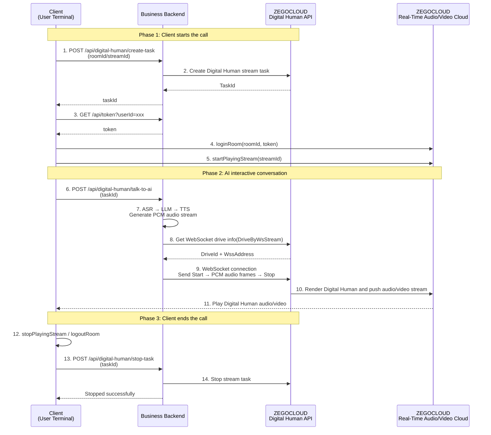

# Implement AI Interactive Chat with Digital Human

## Introduction

This document describes how to integrate ZEGOCLOUD Digital Human and combine it with your LLM, ASR, TTS, and other modules to implement AI interactive conversations between users and Digital Humans.

<Note title="Note">
If you have not yet implemented an AI interactive conversation business, it is highly recommended to directly refer to [Implement Digital Human Video Call](/aiagent-ios/quick-start-with-digital-human) for a quick implementation of the interactive conversation scenario.
</Note>

Digital Human AI interactive conversation — compared to regular user-AI Agent conversations, Digital Humans can provide more immersive, warmer, and more personalized interactions, delivering a low-latency, high-emotion AI conversation experience for users.

Recommended scenarios for Digital Human AI interactive conversations:
- AI teaching assistant & personalized tutoring: In K12 education, vocational training, language learning, and other scenarios, Digital Humans serve as intelligent teaching assistants, interacting with students in real-time, answering knowledge questions, simulating oral conversations, and providing scalable, personalized teaching guidance to improve learning efficiency and experience.
- Emotional companionship & virtual friend chat: Digital Humans serve as virtual friends in social apps and companion mini programs, chatting with users in real-time, listening to their thoughts, sharing daily life, satisfying users' emotional expression and companionship needs, alleviating loneliness, and providing stress-free, personalized virtual social experiences.
- Murder mystery / escape room intelligent hosting & interaction: In scenario games such as murder mystery, lateral thinking puzzles, and escape rooms, Digital Humans serve as DMs (hosts) or NPCs, interacting with players in real-time, explaining rules, advancing the plot, and answering questions to help players quickly enter the game and control the game pace, enhancing the player experience.
- Intelligent consultant & after-sales consultation: In e-commerce, finance, telecom, government services, and other fields, AI Digital Humans replace real staff to respond to user inquiries 7×24 hours, answering questions about product features, order logistics, business processes, policy interpretation, etc., improving consultation response efficiency and user satisfaction while achieving scalable, round-the-clock standardized service.
- Enterprise intelligent assistant & employee service: Digital Humans serve as enterprise intelligent assistants or employees, introducing enterprise products and services through official websites, public accounts, and mini programs, and interacting with users in real-time to answer questions and guide user behavior, improving service efficiency while enabling intelligent and self-service operations.
- Tourism scenic spots / museum intelligent guided tours & interactive explanations: In scenic areas, museums, ancient towns, and theme parks, AI Digital Humans can interact with visitors in real-time through apps, mini programs, and other terminals, explaining attraction content/stories based on pre-configured content, providing personalized responses to questions, and improving the intelligence level of scenic area services and visitor satisfaction.

## Prerequisites

Before implementing Digital Human real-time broadcasting, please ensure:

- You have created a project in the [ZEGOCLOUD Console](https://console.zegocloud.com) and obtained a valid AppID. For details, refer to [Console - Project Management - Project Information](/console/project-info).
- You have contacted ZEGOCLOUD Technical Support to enable the Digital Human API service and related API permissions.
- You have implemented audio interactive conversation business through ASR, LLM, TTS, and other modules.
- The client has integrated the ZEGOCLOUD Express SDK. For details, refer to the integration SDK documentation for each platform ([Web](/real-time-voice-web/quick-start/integrating-sdk), [Android](/real-time-voice-android/quick-start/integrating-sdk), [iOS](/real-time-voice-ios/quick-start/integrating-sdk)).

## Example Code

<CardGroup cols={2}>
  <Card title="Digital Human AI Interactive Chat Example Code" href="https://github.com/ZEGOCLOUD/digital-human-quick-start-example/tree/main/digital-human-interactive-chat" target="_blank">
    Includes server-side and client-side example code.
  </Card>
</CardGroup>

Please refer to [Run Example Code](/aigc-digital-human-server/quick-start/run-example-code) or the example code README to run the example code.

<Video src="https://doc-media.zego.im/core_products/digital-human/zh/server/quick-start/interactive-chat.mp4" />

## Core Architecture

A Digital Human AI interactive conversation system typically consists of three core roles:

### 1. Client (User Terminal)
- **Function**: Uses the ZEGOCLOUD Express SDK to play stream and play the Digital Human audio/video stream, while capturing user audio and sending it to the business backend
- **Platform**: Web / Android / iOS, all using Express SDK for stream playing

### 2. Business Backend
- **Core Responsibility**: Receives client requests, calls the ZEGOCLOUD Digital Human API to create/stop Digital Human tasks
- **AI Interaction Processing**: Receives user audio, processes it through ASR (Automatic Speech Recognition) → LLM (Large Language Model) → TTS (Text-to-Speech), and sends the PCM audio stream to the Digital Human service via WebSocket to drive the Digital Human

### 3. ZEGOCLOUD Server
- **Digital Human API**: Create Digital Human video stream tasks, get WebSocket drive info, stop Digital Human video stream tasks
- **Real-Time Audio/Video Cloud**: Digital Human audio/video streams are pushed through the ZEGOCLOUD Real-Time Audio/Video Cloud, and clients play stream via the ZEGOCLOUD Express SDK

<Frame width="512" height="auto" caption=""></Frame>

## Business Flow

1. **Client starts a call:**
   - The client generates roomId and streamId, and sends a create Digital Human task request to the business backend.
   - The business backend calls the ZEGOCLOUD Digital Human API to create a task and returns taskId.
   - The client obtains a Token, logs into the RTC room, and plays stream the Digital Human audio/video stream.

2. **AI interactive conversation:**
   - The client captures user speech audio and sends it to the business backend.
   - The business backend performs ASR → LLM → TTS processing to generate a PCM audio stream.
   - The business backend calls the Digital Human API to get WebSocket drive info, establishes a WebSocket connection, and forwards the PCM audio stream to the Digital Human service to drive the Digital Human.

3. **Client ends the call:**
   - The client stops playing stream, leaves the room, and requests the business backend to stop the Digital Human task.
   - The business backend calls the Digital Human API to stop the task.



## Implementation Logic

### Implement Business Backend

The business backend provides the following endpoints for client calls:

| Endpoint | Method | Request Parameters | Description | Related Digital Human API |
|------|------|---------|------|------------------------|
| `/api/digital-human/create-task` | POST | `roomId`, `streamId` | Create a Digital Human video stream task | [Create Digital Human Video Stream Task](/aigc-digital-human-server/streaming-apis/digital-human-streaming/create-digital-human-stream-task) |
| `/api/digital-human/talk-to-ai` | POST | `taskId`, `lang` (optional) | AI interactive conversation (ASR → LLM → TTS → WebSocket drive Digital Human) | [Drive Digital Human via WebSocket](/aigc-digital-human-server/streaming-apis/digital-human-streaming/drive-by-ws-stream) |
| `/api/digital-human/stop-task` | POST | `taskId` | Stop a Digital Human video stream task | [Stop Digital Human Video Stream Task](/aigc-digital-human-server/streaming-apis/digital-human-streaming/stop-digital-human-stream-task) |
| `/api/token` | GET | `userId` | Get Token for the ZEGOCLOUD client SDK.<br/>Please refer to the [Token Authentication](/real-time-video-ios-oc/communication/using-token-authentication) documentation or [example code](https://github.com/ZEGOCLOUD/digital-human-quick-start-example/blob/main/digital-human-interactive-chat/server/lib/token.js) to generate a Token | Pure business backend logic |

Please design business backend endpoints based on your actual business needs and implement the necessary business backend endpoints according to the Digital Human API [API Calling Methods](/aigc-digital-human-server/streaming-apis/accessing-server-apis) documentation. Below is example code for calling the Digital Human API:

```javascript
// Create digital human video stream task
// Create digital human video stream task
export const createStreamTask = async (params) => {
  const data = await post("CreateDigitalHumanStreamTask", {
    DigitalHumanConfig: { DigitalHumanId: params.digitalHumanId },
    RTCConfig: { RoomId: params.roomId, StreamId: params.streamId },
  });
  return data.TaskId;
};

// Stop digital human video stream task
// Stop digital human video stream task
export const stopStreamTask = async (params) => {
  await post("StopDigitalHumanStreamTask", { TaskId: params.taskId });
};

// Get WebSocket drive info
// Get WebSocket drive info
export const getDriveByWsStreamInfo = async (params) => {
  const data = await post("DriveByWsStream", { TaskId: params.taskId });
  return {
    driveId: data.DriveId,
    wssAddress: data.WssAddress,
  };
};

// Send POST request to ZEGO Digital Human API
// Send POST request to ZEGOCLOUD Digital Human API
const post = async (action, body) => {
  const params = buildCommonParams(action);
  const url = `https://aigc-digitalhuman-api.zegotech.cn/?${params.toString()}`;
  const response = await fetch(url, {
    method: "POST",
    headers: { "Content-Type": "application/json" },
    body: JSON.stringify(body),
  });
  const data = await response.json();
  if (data.Code !== 0) {
    throw new Error(`Digital Human API failed: ${data.Code} ${data.Message}`);
  }
  return data.Data;
};

// Build common API request parameters (including signature)
// Build common API request parameters (including signature)
const buildCommonParams = (action) => {
  const appId = process.env.APP_ID;
  const serverSecret = process.env.SERVER_SECRET || "";
  const signatureNonce = crypto.randomBytes(8).toString("hex");
  const timestamp = Math.floor(Date.now() / 1000);
  // Calculate MD5 signature
  // Calculate MD5 signature
  const signature = crypto
    .createHash("md5")
    .update(`${appId}${signatureNonce}${serverSecret}${timestamp}`)
    .digest("hex");

  return new URLSearchParams({
    Action: action,
    AppId: appId.toString(),
    SignatureNonce: signatureNonce,
    Timestamp: timestamp.toString(),
    Signature: signature,
    SignatureVersion: "2.0",
  });
};
```


#### Drive Digital Human via WebSocket Audio Stream

The core of AI interactive conversation is sending the TTS-synthesized PCM audio stream to the Digital Human service via WebSocket to drive the Digital Human to speak. The process is as follows:

1. Call `DriveByWsStream` to get WebSocket drive info (DriveId and WssAddress)
2. Establish a WebSocket connection
3. Send a `Start` command (specifying DriveId and sample rate)
4. Send TTS-generated PCM audio data frame by frame
5. Send a `Stop` command
6. Disconnect the WebSocket connection

```javascript
import WebSocket from "ws";

// Drive digital human via WebSocket
// Drive digital human via WebSocket
export const callTTSAndDriveDigitalHumanByWebSocket = async (taskId) => {
  // Step 1: Get WebSocket drive info
  const { driveId, wssAddress } = await getDriveByWsStreamInfo({ taskId });

  // Step 2: Establish WebSocket connection
  const ws = new WebSocket(wssAddress, { rejectUnauthorized: false });
  await new Promise((resolve, reject) => {
    ws.on("open", resolve);
    ws.on("error", reject);
  });

  // Step 3: Send Start command (usually started before TTS begins)
  ws.send(JSON.stringify({
    Action: "Start",
    Payload: {
      DriveId: driveId,
      SampleRate: 24000, // Sample rate must match your actual audio data
    },
  }));

  // Step 4: Send TTS-generated PCM audio data frame by frame
  // In actual business, you should receive streaming PCM audio data from the TTS service and forward it:
  // ttsWs.onMessage = (msg) => {
  //   if (msg.type === 'MsgTypeAudioOnlyServer') {
  //     ws.send(msg.payload);  // Forward PCM audio frames directly to the Digital Human
  //   }
  // };

  // Step 5: Send Stop command (usually sent after TTS ends)
  ws.send(JSON.stringify({
    Action: "Stop",
    Payload: { DriveId: driveId },
  }));

  // Step 6: Disconnect
  ws.close();
};
```

### Implement Client

The client uses the ZEGOCLOUD Express SDK to play stream and play the Digital Human audio/video. For details, refer to the video call implementation documentation for each platform ([Web](/real-time-voice-web/quick-start/implementing-video-call), [Android](/real-time-voice-android/quick-start/implementing-video-call), [iOS](/real-time-voice-ios-oc/quick-start/implementing-video-call)).

Below are core example code snippets for each platform. For detailed implementations, refer to the example code ([Web](https://github.com/ZEGOCLOUD/digital-human-quick-start-example/blob/main/digital-human-interactive-chat/web-react/src/App.jsx), [Android](https://github.com/ZEGOCLOUD/digital-human-quick-start-example/blob/main/digital-human-interactive-chat/android/app/src/main/java/com/example/digitalhumanquickstartdemo/MainActivity.kt), [iOS](https://github.com/ZEGOCLOUD/digital-human-quick-start-example/blob/main/digital-human-interactive-chat/ios-oc/ZegoDigitalHumanQuickStart/ZegoDigitalHumanQuickStart/ViewController.m)):

<CodeGroup>

```javascript Web
// Step 1: Initialize Express SDK
const zg = new ZegoExpressEngine(appId, server);

// Step 2: Generate unique identifiers
const userId = `user_${Date.now()}`;
const roomId = `room_${Date.now()}`;
const streamId = `stream_${Date.now()}`;

// Step 3: Call business backend to create Digital Human task
const createRes = await fetch('https://your_server_address/api/digital-human/create-task', {
  method: 'POST',
  headers: { 'Content-Type': 'application/json' },
  body: JSON.stringify({ roomId, streamId }),
});
const { taskId } = await createRes.json();

// Step 4: Get Token
const tokenRes = await fetch(`https://your_server_address/api/token?userId=${userId}`);
const { token } = await tokenRes.json();

// Step 5: Log into RTC room
await zg.loginRoom(roomId, token, { userID: userId, userName: userId });

// Step 6: Play Digital Human audio/video stream
const remoteStream = await zg.startPlayingStream(streamId);
const remoteView = zg.createRemoteStreamView(remoteStream);
remoteView.play('remote-video'); // Render to DOM element

// Step 7: Simulate AI interaction (in actual scenarios, capture microphone audio and send to business backend)
await fetch('https://your_server_address/api/digital-human/talk-to-ai', {
  method: 'POST',
  headers: { 'Content-Type': 'application/json' },
  body: JSON.stringify({ taskId }),
});

// Step 8: End call
await zg.stopPlayingStream(streamId);
await zg.logoutRoom();
await fetch('https://your_server_address/api/digital-human/stop-task', {
  method: 'POST',
  headers: { 'Content-Type': 'application/json' },
  body: JSON.stringify({ taskId }),
});
```
```java Android
// Step 1: Initialize Express SDK
ZegoEngineProfile profile = new ZegoEngineProfile();
profile.appID = appId;
profile.scenario = ZegoScenario.HIGH_QUALITY_CHATROOM;
ZegoExpressEngine.createEngine(profile, null);

// Step 2: Call business backend to create Digital Human task
// POST https://your_server_address/api/digital-human/create-task
// Request parameters: { "roomId": "room_xxx", "streamId": "stream_xxx" }
// Response: { "taskId": "xxx" }

// Step 3: Get Token
// GET https://your_server_address/api/token?userId=xxx
// Response: token

// Step 4: Log into room and play stream
ZegoUser user = new ZegoUser(userId, userId);
ZegoRoomConfig config = new ZegoRoomConfig();
config.token = token;
ZegoExpressEngine.getEngine().loginRoom(roomId, user, config, (errorCode, extendedData) -> {
    if (errorCode == 0) {
        // Use ZegoCanvas to wrap TextureView for rendering
        ZegoCanvas canvas = new ZegoCanvas(findViewById(R.id.remote_video_view));
        ZegoExpressEngine.getEngine().startPlayingStream(streamId, canvas);
    }
});

// Step 5: Simulate AI interaction (in actual scenarios, capture microphone audio and send to business backend)
// POST https://your_server_address/api/digital-human/talk-to-ai
// Request parameters: { "taskId": "xxx" }

// Step 6: End call
ZegoExpressEngine.getEngine().stopPlayingStream(streamId);
ZegoExpressEngine.getEngine().logoutRoom();
// POST https://your_server_address/api/digital-human/stop-task
// Request parameters: { "taskId": "xxx" }
```
```oc iOS
// Step 1: Initialize Express SDK
ZegoEngineProfile *profile = [[ZegoEngineProfile alloc] init];
profile.appID = (unsigned int)appId;
profile.scenario = ZegoScenarioHighQualityChatroom;
self.expressEngine = [ZegoExpressEngine createEngineWithProfile:profile eventHandler:self];

// Step 2: Call business backend to create Digital Human task
// POST https://your_server_address/api/digital-human/create-task
// Request parameters: { "roomId": "room_xxx", "streamId": "stream_xxx" }
// Response: { "taskId": "xxx" }

// Step 3: Get Token
// GET https://your_server_address/api/token?userId=xxx
// Response: token

// Step 4: Log into room and play stream
ZegoUser *user = [[ZegoUser alloc] init];
user.userID = userId;
user.userName = userId;
ZegoRoomConfig *roomConfig = [[ZegoRoomConfig alloc] init];
roomConfig.token = token;
[self.expressEngine loginRoom:roomId user:user config:roomConfig callback:^(int errorCode, NSDictionary *extendedData) {
    if (errorCode == 0) {
        // Use ZegoCanvas to wrap UIView for rendering
        ZegoCanvas *canvas = [ZegoCanvas canvasWithView:self.remoteVideoView];
        [self.expressEngine startPlayingStream:streamId canvas:canvas];
    }
}];

// Step 5: Simulate AI interaction (in actual scenarios, capture microphone audio and send to business backend)
// POST https://your_server_address/api/digital-human/talk-to-ai
// Request parameters: { "taskId": "xxx" }

// Step 6: End call
[self.expressEngine stopPlayingStream:streamId];
[self.expressEngine logoutRoom:roomId];
// POST https://your_server_address/api/digital-human/stop-task
// Request parameters: { "taskId": "xxx" }
```
</CodeGroup>
