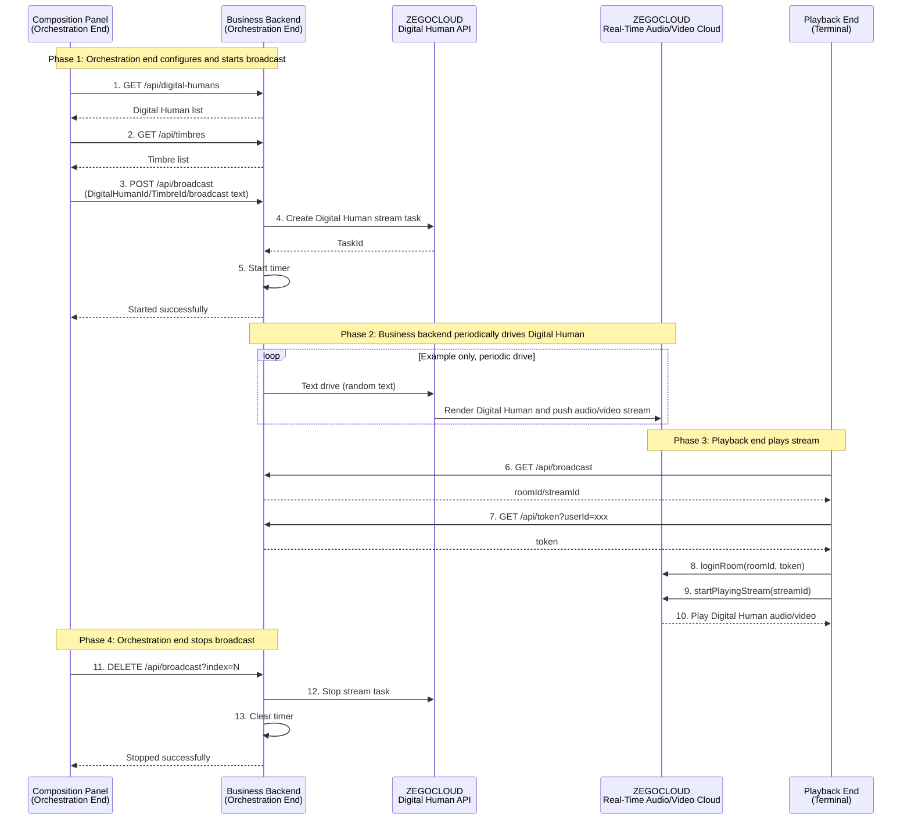

# Implement Digital Human Real-Time Broadcasting

## Introduction

This document describes how to quickly implement Digital Human real-time broadcasting.

Digital Human real-time broadcasting — based on ZEGOCLOUD's self-developed Digital Human AI inference engine, can receive text/audio/video stream input in real-time, quickly generate and output human-like speech, expressions, and movements for Digital Human broadcasting content, achieving low-latency, high-realism real-time information delivery.

Recommended scenarios for Digital Human real-time broadcasting:
- Real-time news broadcasting: For hot news, financial briefings, etc., Digital Humans quickly receive the latest information and deliver oral broadcasts. Fast response, timely updates, 7×24 hours uninterrupted, with multi-language and multi-style switching.
- E-commerce live streaming: Digital Humans serve as virtual hosts, explaining product selling points in real-time, answering user bullet screen questions, introducing product promotion information, enabling 7×24 hours uninterrupted live streaming for scalable, low-cost live commerce operations.
- Real-time sports commentary: 1:1 reproduction of real-person host images, voices, and commentary styles, achieving full-time, multi-event, multi-language real-time commentary coverage, solving the scarcity and high cost of professional commentators and improving event broadcast efficiency.
- Real-time education and tutoring: In online classrooms, K12 tutoring, and vocational training, AI Digital Human teachers explain knowledge points in real-time, sync courseware, answer student questions, supporting a combination of recorded and live interactive sessions for scalable, standardized real-time teaching and Q&A services.
- Enterprise/government information release: Real-time product introductions, important notices, and other information through enterprise public accounts, official websites, and other media for internal employees or the public. Real-time updates of important information for official synchronization, improving information delivery efficiency and reducing offline press conferences and manual broadcasting costs.
- Real-time financial market commentary: Providing investors with 7×24 hours uninterrupted market commentary, reducing professional analyst labor costs, and improving the timeliness and coverage of information services.
- Real-time short video/self-media content creation: Quickly generating quality content such as hot topic interpretations, knowledge popularization, and professional knowledge introductions through Digital Humans, enabling rapid response and scalable production of trending content.
- Tourism scenic spots / museum real-time guided tours: Digital Humans provide real-time explanations of attraction history and culture, artifact backgrounds, tour routes, special experiences, and safety tips through scenic area screens, visitor mobile devices, AR glasses, and other terminals, supporting multi-language and multi-style switching.

## Prerequisites

Before implementing Digital Human real-time broadcasting, please ensure:

- You have created a project in the [ZEGOCLOUD Console](https://console.zegocloud.com) and obtained a valid AppID. For details, refer to [Console - Project Management - Project Information](/console/project-info).
- You have contacted ZEGOCLOUD Technical Support to enable the Digital Human API service and related API permissions.
- The client has integrated the ZEGOCLOUD Express SDK. For details, refer to the integration SDK documentation for each platform ([Web](/real-time-voice-web/quick-start/integrating-sdk), [Android](/real-time-voice-android/quick-start/integrating-sdk), [iOS](/real-time-voice-ios/quick-start/integrating-sdk)).

## Example Code

<CardGroup cols={2}>
  <Card title="Digital Human Real-Time Broadcasting Example Code" href="https://github.com/ZEGOCLOUD/digital-human-quick-start-example/tree/main/digital-human-real-time-broadcasting-scenario" target="_blank">
    Includes server-side and client-side example code.
  </Card>
</CardGroup>

Please refer to [Run Example Code](/aigc-digital-human-server/quick-start/run-example-code) or the example code README to run the example code.

<Video src="https://doc-media.zego.im/core_products/digital-human/zh/server/quick-start/real-time-broadcasting.mp4" />

## Core Architecture

A Digital Human real-time broadcasting system typically consists of three core roles:

### 1. Playback End (Terminal)
- **Function**: Uses the ZEGOCLOUD Express SDK to play stream and play the Digital Human audio/video stream
- **Platform**: Web / Android / iOS, all using Express SDK for stream playing

### 2. Orchestration End (Composition Panel + Business Service)
- **Composition Panel**: Web UI for configuring Digital Human broadcasting content
  - Select Digital Human avatar and timbre
  - Configure broadcast text content
  - Start/stop broadcast tasks
- **Business Service**: Receives composition commands and calls the ZEGOCLOUD Digital Human API to drive the Digital Human

### 3. ZEGOCLOUD Server
- **Digital Human API**: Create Digital Human video stream tasks, drive Digital Human with text/audio, stop Digital Human video stream tasks
- **Real-Time Audio/Video Cloud**: Digital Human audio/video streams are pushed through the ZEGOCLOUD Real-Time Audio/Video Cloud, and the playback end plays stream via the ZEGOCLOUD Express SDK

<Frame width="512" height="auto" caption=""></Frame>

## Business Flow

1. **Orchestration end configuration and startup:**
   - The orchestration end gets the Digital Human list and timbre list, configures broadcast task content, and sends a startup request to the business backend.
   - The business backend calls the ZEGOCLOUD Digital Human API based on the request to create a task, starts text/audio drive, and returns the startup result.

2. **Digital Human drive and streaming:**
   - The business backend continuously calls the Digital Human API for text/audio drive. The Digital Human service generates Digital Human video and continuously pushes audio/video streams to the audio/video cloud.

3. **Playback end stream playing:**
   - The playback end gets the latest broadcast task information (roomId/streamId) and user token.
   - The playback end logs into the room and plays stream to achieve real-time Digital Human audio/video playback.

4. **Orchestration end stops broadcasting:**
   - The orchestration end requests the business backend to stop the specified task. The business backend calls the Digital Human API to stop the task and returns the stop result.



## Implementation Logic

### Implement Orchestration End Business Backend

The business backend provides two types of endpoints, for the orchestration end (composition panel) and the playback end (terminal) respectively:

The orchestration end (composition panel) calls the following endpoints to configure and manage broadcast tasks:

| Endpoint | Method | Request Parameters | Description | Related Digital Human API |
|------|------|---------|------|------------------------|
| `/api/digital-humans` | GET | - | Get Digital Human list | [Get Digital Human List](/aigc-digital-human-server/streaming-apis/digital-human-management/get-digital-human-list) |
| `/api/timbres` | GET | `digitalHumanId` (optional) | Get timbre list | [Get Timbre List](/aigc-digital-human-server/streaming-apis/timbre-management/get-timbre-list) |
| `/api/broadcast` | POST | `digitalHumanId`, `timbreId`, `roomId`, `streamId`, `textPool` | Start broadcast task | [Create Digital Human Video Stream Task](/aigc-digital-human-server/streaming-apis/digital-human-streaming/create-digital-human-stream-task) / [Drive Digital Human with Text](/aigc-digital-human-server/streaming-apis/digital-human-streaming/drive-by-text) |
| `/api/broadcast?index=N` | DELETE | `index` (query parameter) | Stop specified broadcast task | [Stop Digital Human Video Stream Task](/aigc-digital-human-server/streaming-apis/digital-human-streaming/stop-digital-human-stream-task) |

The playback end (terminal) calls the following endpoints to get playback information:

| Endpoint | Method | Request Parameters | Description | Related Digital Human API |
|------|------|---------|------|-----------------------------|
| `/api/broadcast` | GET | - | Get broadcast list information (including roomId/streamId) | Pure business backend logic |
| `/api/token` | GET | `userId` | Get Token for the ZEGOCLOUD client SDK.<br/>Please refer to the [Token Authentication](/real-time-video-ios-oc/communication/using-token-authentication) documentation or [example code](https://github.com/ZEGOCLOUD/digital-human-quick-start-example/blob/main/digital-human-real-time-broadcasting-scenario/server/app/api/token/route.js) to generate a Token | Pure business backend logic|

Please design business backend endpoints based on your actual business needs and implement the necessary business backend endpoints according to the Digital Human API [API Calling Methods](/aigc-digital-human-server/streaming-apis/accessing-server-apis) documentation. Below is example code for calling the Digital Human API:

```javascript
// Get digital human list
// Get digital human list
export const getDigitalHumanList = async (params) => {
  const body = {};
  if (params.inferenceMode !== undefined) {
    body.InferenceMode = params.inferenceMode;
  }
  if (params.fetchMode !== undefined) {
    body.FetchMode = params.fetchMode;
  }
  if (params.offset !== undefined) {
    body.Offset = params.offset;
  }
  if (params.limit !== undefined) {
    body.Limit = params.limit;
  }

  const data = await post("GetDigitalHumanList", body);
  return data;
};


// Send POST request to ZEGO Digital Human API
// Send POST request to ZEGO Digital Human API
const post = async (action, body) => {
  const params = buildCommonParams(action);
  const url = `https://aigc-digitalhuman-api.zegotech.cn/?${params.toString()}`;
  const response = await fetch(url, {
    method: "POST",
    headers: { "Content-Type": "application/json" },
    body: JSON.stringify(body),
  });
  const data = await response.json();
  if (data.Code !== 0) {
    throw new Error(`Digital Human API failed: ${data.Code} ${data.Message}`);
  }
  return data.Data;
};

// Build common API request parameters (including signature)
// Build common API request parameters (including signature)
const buildCommonParams = (action) => {
  const appId = process.env.APP_ID;
  const serverSecret = process.env.SERVER_SECRET || "";
  const signatureNonce = crypto.randomBytes(8).toString("hex");
  const timestamp = Math.floor(Date.now() / 1000);
  // Calculate MD5 signature
  // Calculate MD5 signature
  const signature = crypto
    .createHash("md5")
    .update(`${appId}${signatureNonce}${serverSecret}${timestamp}`)
    .digest("hex");

  return new URLSearchParams({
    Action: action,
    AppId: appId.toString(),
    SignatureNonce: signatureNonce,
    Timestamp: timestamp.toString(),
    Signature: signature,
    SignatureVersion: "2.0",
  });
};
```

### Implement Orchestration End UI

Please refer to the [example code](https://github.com/ZEGOCLOUD/digital-human-quick-start-example/blob/main/digital-human-real-time-broadcasting-scenario/server/app/page.jsx) to implement the orchestration end UI or implement it according to your own business logic.

### Implement Playback End

The playback end uses the ZEGOCLOUD Express SDK for stream playing. For details, refer to the video call implementation documentation for each platform ([Web](/real-time-voice-web/quick-start/implementing-video-call), [Android](/real-time-voice-android/quick-start/implementing-video-call), [iOS](/real-time-voice-ios-oc/quick-start/implementing-video-call)).

Below are core example code snippets for stream playing on each platform. For detailed implementations, refer to the example code ([Web](https://github.com/ZEGOCLOUD/digital-human-quick-start-example/blob/390fff54fbb58f2f3fb5684401ccda4d94d80cbd/digital-human-real-time-broadcasting-scenario/web-react/src/App.jsx#L29), [Android](https://github.com/ZEGOCLOUD/digital-human-quick-start-example/blob/390fff54fbb58f2f3fb5684401ccda4d94d80cbd/digital-human-real-time-broadcasting-scenario/android/app/src/main/java/com/example/digitalhumanquickstartdemo/MainActivity.kt), [iOS](https://github.com/ZEGOCLOUD/digital-human-quick-start-example/blob/390fff54fbb58f2f3fb5684401ccda4d94d80cbd/digital-human-real-time-broadcasting-scenario/ios-oc/ZegoDigitalHumanQuickStart/ZegoDigitalHumanQuickStart/ViewController.m)):

<CodeGroup>

```javascript Web
// Step 1: Get broadcast information
const broadcastRes = await fetch('https://your_server_address/api/broadcast');
const { broadcastList } = await broadcastRes.json();
const { roomId, streamId } = Object.values(broadcastList)[0];

// Step 2: Get Token
const userId = 'terminal_001';
const tokenRes = await fetch(`https://your_server_address/api/token?userId=${userId}`);
const { token } = await tokenRes.json();

// Step 3: Initialize Express SDK
const { ZegoExpressEngine } = await import('zego-express-engine-webrtc');
const engine = new ZegoExpressEngine(appId, "");

// Step 4: Log into RTC room
await engine.loginRoom(roomId, token, {
  userID: userId,
  userName: userId
});

// Step 5: Play Digital Human audio/video stream
const remoteStream = await engine.startPlayingStream(streamId);
const remoteView = engine.createRemoteStreamView(remoteStream);
remoteView.play('remote-video'); // Render to DOM element
```
```java Android
// Step 1: Get broadcast information
// GET https://your_server_address/api/broadcast returns, take the first broadcast task as an example:
// { "roomId": "room_001", "streamId": "stream_001" }

// Step 2: Get Token
// GET https://your_server_address/api/token?userId=xxx
// Response: token

// Step 3: Initialize Express SDK
ZegoEngineProfile profile = new ZegoEngineProfile();
profile.appID = appId;
profile.scenario = ZegoScenario.HIGH_QUALITY_CHATROOM;
ZegoExpressEngine.createEngine(profile, null);

// Step 4: Log into room and play stream
ZegoUser user = new ZegoUser(userId, userId);
ZegoRoomConfig config = new ZegoRoomConfig();
config.token = token;
ZegoExpressEngine.getEngine().loginRoom(roomId, user, config, (errorCode, extendedData) -> {
    if (errorCode == 0) {
        // Use ZegoCanvas to wrap TextureView for rendering
        ZegoCanvas canvas = new ZegoCanvas(findViewById(R.id.remote_video_view));
        ZegoExpressEngine.getEngine().startPlayingStream(streamId, canvas);
    }
});
```
```oc iOS
// Step 1: Get broadcast information
// GET https://your_server_address/api/broadcast returns, take the first broadcast task as an example:
// { "roomId": "room_001", "streamId": "stream_001" }

// Step 2: Get Token
// GET https://your_server_address/api/token?userId=xxx
// Response: token

// Step 3: Initialize Express SDK
ZegoEngineProfile *profile = [[ZegoEngineProfile alloc] init];
profile.appID = (unsigned int)appId;
profile.scenario = ZegoScenarioHighQualityChatroom;
self.expressEngine = [ZegoExpressEngine createEngineWithProfile:profile eventHandler:self];

// Step 4: Log into room and play stream
ZegoUser *user = [[ZegoUser alloc] init];
user.userID = userId;
user.userName = userId;
ZegoRoomConfig *roomConfig = [[ZegoRoomConfig alloc] init];
roomConfig.token = token;
[self.expressEngine loginRoom:roomId user:user config:roomConfig callback:^(int errorCode, NSDictionary *extendedData) {
    if (errorCode == 0) {
        // Use ZegoCanvas to wrap UIView for rendering
        ZegoCanvas *canvas = [ZegoCanvas canvasWithView:self.remoteVideoView];
        [self.expressEngine startPlayingStream:streamId canvas:canvas];
    }
}];
```
</CodeGroup>
