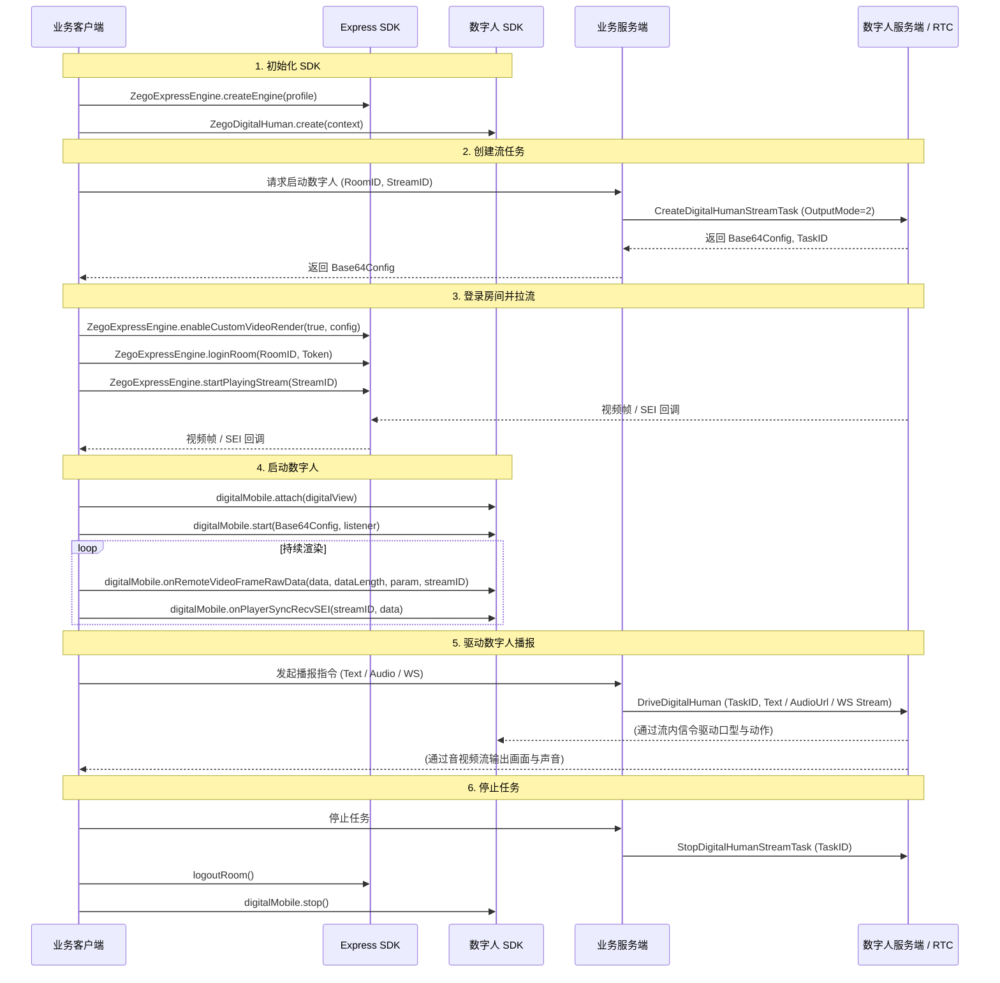
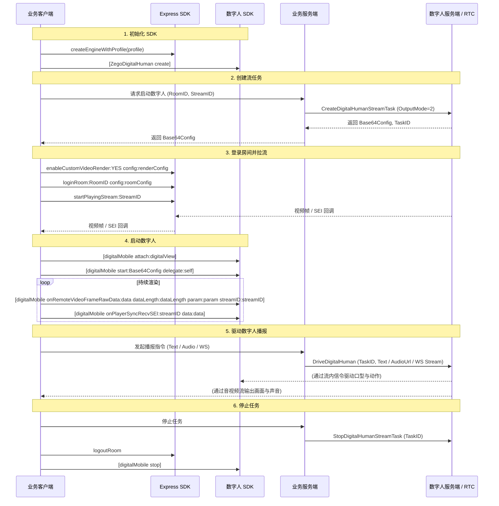
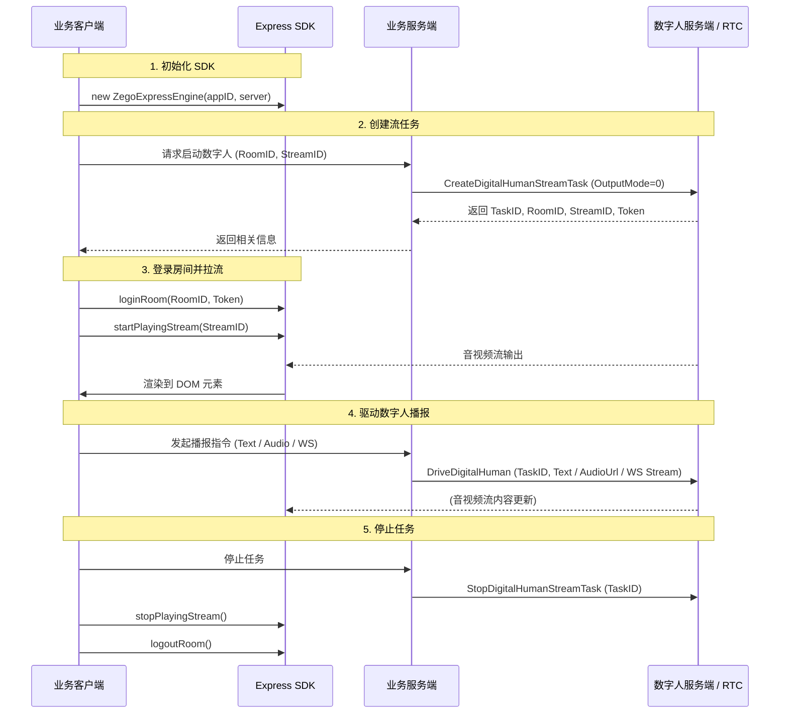

# 实现数字人实时流式输出

---

本文将介绍如何通过 ZEGO SDK 快速实现数字人实时流式输出。

## 功能简介

数字人实时流式输出是指通过服务端创建数字人视频流任务，客户端通过 RTC 协议拉取视频流进行展示的过程。在移动端（Android/iOS），通过数字人 SDK 进行渲染；Web 端，通过 Express SDK 进行渲染。

## 前提条件

在实现数字人功能之前，请确保：
- 已部署数字人服务端，查看服务端 [快速跑通示例代码](/aigc-digital-human-server/quick-start/quick-start-example)，并确保服务端 API 可正常访问。
- 已联系 ZEGO 技术支持开通数字人 PaaS 服务和相关接口的权限。
- 已联系 ZEGO 技术支持创建数字人。
:::if{props.platform=undefined}
- 已根据 [集成 SDK](/aigc-digital-human-android/integrating-sdk) 完成 SDK 的集成和权限配置。
:::
:::if{props.platform="iOS"}
- 已根据 [集成 SDK](/aigc-digital-human-ios/integrating-sdk) 完成 SDK 的集成和权限配置。
:::
:::if{props.platform="Web"}
- 已参考 [集成 SDK](/real-time-voice-web/quick-start/integrating-sdk) 完成 ZEGO Express SDK 的集成。
:::
## 概念解释

在开始集成前，请先了解以下核心概念：

- **数字人实时流式输出**：指通过服务端创建数字人流任务，并驱动数字人生成实时音视频流，客户端通过 RTC 协议拉取并渲染的过程。
- **自定义视频渲染**：ZEGO Express SDK 提供的进阶功能。在数字人场景下，客户端开启此功能以获取原始视频帧数据，透传给数字人 SDK 进行二次处理和渲染。
- **Base64Config**：启动数字人 SDK 所需的核心配置字符串。由业务后台在调用[创建数字人流任务](/aigc-digital-human-server/streaming-apis/digital-human-streaming/create-digital-human-stream-task) API 时获得。
- **SEI**：视频补充增强信息。数字人 SDK 依赖视频流中携带的 SEI 数据来实现数字人动作、口型与音频的精准同步。

## 示例代码

我们提供了一个实现数字人基本流程的示例代码，您可以参考其实现逻辑：

<CardGroup cols={2}>
:::if{props.platform=undefined}
<Card title="Android 示例源码" href="https://github.com/ZEGOCLOUD/digital_human_paas_quick_start/tree/master/Android" target="_blank">
包含初始化、自定义渲染处理、启动数字人等核心逻辑。
</Card>
:::
:::if{props.platform="iOS"}
<Card title="iOS 示例源码" href="https://github.com/ZEGOCLOUD/digital_human_paas_quick_start/tree/master/iOS" target="_blank">
包含初始化、自定义渲染处理、启动数字人等核心逻辑。
</Card>
:::
:::if{props.platform="Web"}
<Card title="Web 示例源码" href="https://github.com/ZEGOCLOUD/digital_human_paas_quick_start/tree/master/Web" target="_blank">
包含初始化、登录房间、拉流渲染等核心逻辑。
</Card>
:::
<Card title="业务后台示例源码" href="https://github.com/ZEGOCLOUD/digital_human_paas_quick_start/tree/master/Server" target="_blank">
包含创建流任务、驱动数字人、停止任务等服务端逻辑。
</Card>
</CardGroup>

## 整体流程描述

实现数字人实时流式输出，需要完成以下步骤：

1. **初始化 SDK**：需要分别初始化 ZEGO Express SDK 和数字人 SDK。
2. **创建流任务**：需要向业务后台发起请求，由后台调用数字人 PaaS API 创建任务并获取 `Base64Config`。
3. **登录房间并拉流**：需要开启**自定义视频渲染**模式，登录 RTC 房间并拉取数字人视频流。
4. **启动数字人**：需要调用数字人 SDK 的 `start` 方法，传入 `Base64Config` 启动渲染引擎。
5. **驱动数字人播报**：需要通过业务后台发送文本或音频指令驱动数字人讲话。
6. **停止任务**：通话结束后，需要停止拉流、登出房间并销毁相关 SDK 实例。

## 实现流程

以下流程图展示了上述步骤的详细交互及 API 调用参数：

:::if{props.platform=undefined}

:::

:::if{props.platform="iOS"}

:::

:::if{props.platform="Web"}

:::

## 实现步骤

### 1 初始化 SDK

:::if{props.platform=undefined}
```java
// 初始化 Express SDK
ZegoEngineProfile profile = new ZegoEngineProfile();
profile.appID = appId; 
profile.scenario = ZegoScenario.HIGH_QUALITY_CHATROOM;
ZegoExpressEngine.createEngine(profile, null);

// 初始化 SDK
IZegoDigitalMobile digitalMobile = ZegoDigitalHuman.create(context);
```
:::

:::if{props.platform="iOS"}
```oc
// 初始化 Express SDK
ZegoEngineProfile *profile = [[ZegoEngineProfile alloc] init];
profile.appID = (unsigned int)appId;
profile.scenario = ZegoScenarioHighQualityChatroom;
[ZegoExpressEngine createEngineWithProfile:profile eventHandler:self];

// 初始化 SDK
self.digitalMobile = [ZegoDigitalHuman create];
```
:::

:::if{props.platform="Web"}
```javascript
// 实例化 ZegoExpressEngine
const zg = new ZegoExpressEngine(appID, server);
```
:::

### 2 创建数字人流任务

业务客户端需要向业务服务端发起请求，由业务服务端调用数字人 PaaS API [创建数字人流任务](/aigc-digital-human-server/streaming-apis/digital-human-streaming/create-digital-human-stream-task)。在该步骤中，**业务服务端**会获得包含 `RoomID`、`Token`、`StreamID` 以及 `Base64Config` 在内的关键信息。


#### 返回字段用途说明

| 字段 | 用途描述 |
| :--- | :--- |
| **RoomID** | 数字人所在的 RTC 房间 ID。客户端登录此房间以拉取数字人的音视频流。 |
| **Token** | 登录 RTC 房间所需的鉴权令牌，用于保障通话安全。 |
| **StreamID** | 数字人推流的唯一标识。客户端根据此 ID 识别并拉取对应的数字人流。 |
| **Base64Config** | **（移动端必备）** 启动配置字符串，用于调用数字人 SDK 的 `start` 接口。 |

:::if{props.platform="undefined|iOS"}
<Warning title="注意">
移动端（Android/iOS）在创建任务时，必须设置 `OutputMode` 为 `2`，以节省流量。
</Warning>
:::


### 3 登录房间并拉流渲染

获取任务信息后，客户端需要登录 RTC 房间并拉取数字人视频流。

:::if{props.platform=undefined}
移动端数字人 SDK 接管视频渲染以实现更好的交互效果。登录成功后，开启 **自定义视频渲染** 模式，并在回调中将视频帧数据透传给数字人 SDK。

```java
// 1. 登录房间
ZegoUser user = new ZegoUser(userId, userName);
ZegoRoomConfig config = new ZegoRoomConfig();
config.token = token; // 从业务后台获取的 Token
ZegoExpressEngine.getEngine().loginRoom(roomId, user, config, (errorCode, extendedData) -> {
    if (errorCode == 0) {
        // 2. 登录成功后，开启自定义渲染
        ZegoCustomVideoRenderConfig renderConfig = new ZegoCustomVideoRenderConfig();
        renderConfig.bufferType = ZegoVideoBufferType.RAW_DATA;
        renderConfig.frameFormatSeries = ZegoVideoFrameFormatSeries.RGB;
        ZegoExpressEngine.getEngine().enableCustomVideoRender(true, renderConfig);

        // 3. 开始拉流
        ZegoExpressEngine.getEngine().startPlayingStream(streamID);
    }
});

// 4. 在自定义渲染回调中透传视频帧与 SEI
ZegoExpressEngine.getEngine().setCustomVideoRenderHandler(new IZegoCustomVideoRenderHandler() {
    @Override
    public void onRemoteVideoFrameRawData(ByteBuffer[] data, int[] dataLength, 
                                         ZegoVideoFrameParam param, String streamID) {
        // 将 Express 视频帧转换为数字人 SDK 所需格式并透传
        IZegoDigitalMobile.ZegoVideoFrameParam dmParam = new IZegoDigitalMobile.ZegoVideoFrameParam();
        dmParam.width = param.width;
        dmParam.height = param.height;
        dmParam.format = IZegoDigitalMobile.ZegoVideoFrameFormat.getZegoVideoFrameFormat(param.format.value());
        for (int i = 0; i < 4; i++) {
            dmParam.strides[i] = param.strides[i];
        }
        digitalMobile.onRemoteVideoFrameRawData(data, dataLength, dmParam, streamID);
    }

    @Override
    public void onPlayerSyncRecvSEI(String streamID, byte[] data) {
        // 透传 SEI 数据以保障音画同步
        digitalMobile.onPlayerSyncRecvSEI(streamID, data);
    }
});
```
:::

:::if{props.platform="iOS"}
移动端数字人 SDK 接管视频渲染以实现更好的交互效果。登录成功后，开启 **自定义视频渲染** 模式，并在回调中将视频帧数据透传给数字人 SDK。

```oc
// 1. 登录房间
ZegoUser *user = [ZegoUser userWithUserID:userID userName:userName];
ZegoRoomConfig *config = [[ZegoRoomConfig alloc] init];
config.token = token; // 从业务后台获取的 Token
[[ZegoExpressEngine sharedEngine] loginRoom:roomID user:user config:config callback:^(int errorCode, NSDictionary *extendedData) {
    if (errorCode == 0) {
        // 2. 登录成功后，开启自定义渲染
        ZegoCustomVideoRenderConfig *renderConfig = [[ZegoCustomVideoRenderConfig alloc] init];
        renderConfig.bufferType = ZegoVideoBufferTypeRawData;
        renderConfig.frameFormatSeries = ZegoVideoFrameFormatSeriesRGB;
        [[ZegoExpressEngine sharedEngine] enableCustomVideoRender:YES config:renderConfig];

        // 3. 开始拉流
        [[ZegoExpressEngine sharedEngine] startPlayingStream:streamID];
    }
}];

// 4. 在自定义渲染回调中透传视频帧与 SEI
- (void)onRemoteVideoFrameRawData:(unsigned char **)data dataLength:(unsigned int *)dataLength param:(ZegoVideoFrameParam *)param streamID:(NSString *)streamID {
    // 将 Express 视频帧转换为数字人 SDK 所需格式并透传
    ZDMVideoFrameParam *dmParam = [[ZDMVideoFrameParam alloc] init];
    dmParam.format = (ZDMVideoFrameFormat)param.format;
    dmParam.width = param.size.width;
    dmParam.height = param.size.height;
    for (int i = 0; i < 4; i++) {
        [dmParam setStride:param.strides[i] atIndex:i];
    }
    [self.digitalMobile onRemoteVideoFrameRawData:data dataLength:dataLength param:dmParam streamID:streamID];
}

- (void)onPlayerSyncRecvSEI:(NSData *)data streamID:(NSString *)streamID {
    // 透传 SEI 数据以保障音画同步
    [self.digitalMobile onPlayerSyncRecvSEI:streamID data:data];
}
```
:::

:::if{props.platform="Web"}
Web 端直接使用 Express SDK 的登录与拉流接口，将流渲染到指定的 DOM 元素上。

```javascript
// 1. 登录房间
await zg.loginRoom(roomID, token, { userID, userName });

// 2. 开始拉流
const remoteStream = await zg.startPlayingStream(streamID);

// 3. 渲染到指定 View
const remoteView = zg.createRemoteStreamView(remoteStream);
remoteView.play("remote-video-container-id");
```
:::

### 4 启动数字人

客户端需要绑定渲染视图，并启动数字人以处理 SEI 数据确保音画同步。

:::if{props.platform=undefined}
调用 `attach` 接口绑定视图，并调用 `start` 接口传入 `Base64Config` 启动数字人。

```java
// 1. 绑定视图
digitalMobile.attach(findViewById(R.id.digital_human_view));
// 2. 启动数字人
digitalMobile.start(base64Config, listener);
```
:::

:::if{props.platform="iOS"}
调用 `attach` 接口绑定视图，并调用 `start` 接口传入 `Base64Config` 启动数字人。同时，处理 SEI 回调：

```oc
// 1. 绑定视图
[self.digitalMobile attach:self.digitalView];
// 2. 启动数字人
[self.digitalMobile start:base64Config delegate:self];

// SEI 处理
- (void)onPlayerSyncRecvSEI:(NSData *)data streamID:(NSString *)streamID {
    [self.digitalMobile onPlayerSyncRecvSEI:streamID data:data];
}
```
:::


:::if{props.platform="Web"}
Web 端由 Express SDK 内部自动处理流数据，无需手动透传 SEI。
:::

### 5 驱动数字人

任务启动后，需要通过业务服务端调用 PaaS API 驱动数字人播报。支持以下驱动方式：

- **文本驱动**：通过 [文本驱动数字人](/aigc-digital-human-server/streaming-apis/digital-human-streaming/drive-by-text) 接口发送文本内容。
- **音频驱动**：通过 [音频驱动数字人](/aigc-digital-human-server/streaming-apis/digital-human-streaming/drive-by-audio) 接口发送音频文件 URL。
- **WebSocket 驱动**：通过 [WebSocket 音频流驱动数字人](/aigc-digital-human-server/streaming-apis/digital-human-streaming/drive-by-ws-stream) 接口实时传输音频数据。

:::if{props.platform=undefined}
```java
// 1. 文本驱动
apiService.driveByText(taskId, new DriveCallback() {
    @Override
    public void onSuccess() {
        // 驱动成功
    }
});

// 2. 音频文件驱动
apiService.driveByAudio(taskId, new DriveCallback() {
    @Override
    public void onSuccess() {
        // 驱动成功
    }
});

// 3. WebSocket 驱动
apiService.driveByWsStreamWithTTS(taskId, new DriveCallback() {
    @Override
    public void onSuccess() {
        // 驱动成功
    }
});
```
:::

:::if{props.platform="iOS"}
```oc
// 1. 文本驱动
[[ZegoAPIService sharedService] driveByText:taskId success:^(NSDictionary *data) {
    // 驱动成功
} failure:nil];

// 2. 音频文件驱动
[[ZegoAPIService sharedService] driveByAudio:taskId success:^(NSDictionary *data) {
    // 驱动成功
} failure:nil];

// 3. WebSocket 驱动
[[ZegoAPIService sharedService] driveByWsStreamWithTTS:taskId success:^(NSDictionary *data) {
    // 驱动成功
} failure:nil];
```
:::

:::if{props.platform="Web"}
```javascript
// 1. 文本驱动
await driveAPI.driveByText(taskId);

// 2. 音频文件驱动
await driveAPI.driveByAudio(taskId);

// 3. WebSocket 驱动
await driveAPI.driveByWsStreamWithTTS(taskId);
```
:::

### 6 停止任务

:::if{props.platform=undefined}
```java
ZegoExpressEngine.getEngine().stopPlayingStream(streamId);
ZegoExpressEngine.getEngine().logoutRoom(roomId);
digitalMobile.stop();
ZegoExpressEngine.destroyEngine(null);
```
:::

:::if{props.platform="iOS"}
```oc
[[ZegoExpressEngine sharedEngine] stopPlayingStream:streamId];
[[ZegoExpressEngine sharedEngine] logoutRoom];
[self.digitalMobile stop];
[ZegoExpressEngine destroyEngine:nil];
```
:::

:::if{props.platform="Web"}
```javascript
zg.stopPlayingStream(streamId);
zg.logoutRoom();
```
:::

## 相关文档

:::if{props.platform=undefined}
- [集成 SDK](/aigc-digital-human-android/integrating-sdk)
:::
:::if{props.platform="iOS"}
- [集成 SDK](/aigc-digital-human-ios/integrating-sdk)
:::
:::if{props.platform="Web"}
- [集成 SDK](/real-time-voice-web/quick-start/integrating-sdk)
:::
- [服务端 API - 创建数字人流任务](/aigc-digital-human-server/streaming-apis/digital-human-streaming/create-digital-human-stream-task)
- [错误码查询](/aigc-digital-human-android/client-sdk/error-code)
