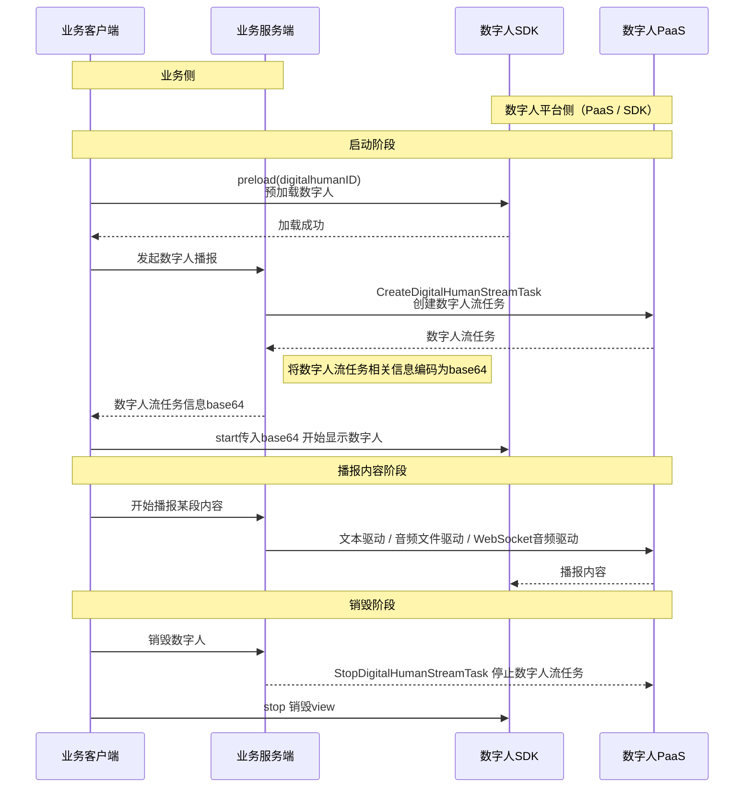

# 概述

- - -
本文档用于说明如何快速接入 数字人客户端SDK 实现数字人实时流式输出。


## 前提条件

- 已在 [ZEGO 控制台](https://console.zego.im/) 创建项目，并申请有效的 AppID 和 AppSign，详情请参考 [控制台 - 项目信息](https://doc-zh.zego.im/article/12107)。
- 已联系 ZEGO 技术支持开通数字人 PaaS 服务和相关接口的权限。
- 已联系 ZEGO 技术支持创建数字人。
:::if{props.platform="undefined|iOS|Flutter"}
- 已从[下载页面](./introduction/download.mdx)- 已联系 ZEGO 技术支持获取针对数字人优化的 ZEGO Express SDK和数字人SDK，并集成到您的项目中。。
:::
:::if{props.platform="Web"}
- 已联系 ZEGO 技术支持获取针对数字人优化的 ZEGO Express SDK，并集成到您的项目中。
:::


## 整体业务流程

:::
## 核心能力实现

### 集成 ZEGO Express SDK

:::if{props.platform=undefined}

请参考 [集成 SDK > 2.2 > 方式2](https://doc-zh.zego.im/article/3575#2) 手动集成 SDK。集成 SDK 后按以下步骤初始化 ZegoExpressEngine。

<div>
<Steps>
<Step title="添加权限声明">
进入 "app/src/main" 目录，打开 "AndroidManifest.xml" 文件，添加权限。
```xml AndroidManifest.xml
<uses-permission android:name="android.permission.ACCESS_NETWORK_STATE" />
<uses-permission android:name="android.permission.INTERNET" />
<uses-permission android:name="android.permission.RECORD_AUDIO" />
```
</Step>
<Step title="运行时申请录音权限">
```java
private final ActivityResultLauncher<String> requestPermissionLauncher = registerForActivityResult(
    new ActivityResultContracts.RequestPermission(), new ActivityResultCallback<Boolean>() {
        @Override
        public void onActivityResult(Boolean isGranted) {
            if (isGranted) {
                // 同意权限
            }
        }
    });
//发起请求
requestPermissionLauncher.launch(Manifest.permission.RECORD_AUDIO);
```
</Step>
<Step title="创建并初始化 ZegoExpressEngine">
```java {3}
ZegoEngineProfile zegoEngineProfile = new ZegoEngineProfile();
zegoEngineProfile.appID = ; // 从即构控制台获取的 appId
zegoEngineProfile.scenario = ZegoScenario.HIGH_QUALITY_CHATROOM;
zegoEngineProfile.application = getApplication();
ZegoExpressEngine.createEngine(zegoEngineProfile, null);
```
</Step>
</Steps>
</div>
:::

:::if{props.platform="iOS"}

请参考 [集成 SDK > 2.2 > 方式三](https://doc-zh.zego.im/article/3574#2_2) 手动集成 SDK。集成 SDK 后按以下步骤初始化 ZegoExpressEngine。

<div>
<Steps>
<Step title="在 Info.plist 文件声明必要的权限">
```xml Info.plist
<?xml version="1.0" encoding="UTF-8"?>
<!DOCTYPE plist PUBLIC "-//Apple//DTD PLIST 1.0//EN" "http://www.apple.com/DTDs/PropertyList-1.0.dtd">
<plist version="1.0">
<dict>
    ...
    <key>UIBackgroundModes</key>
    <array>
        <string>audio</string>
    </array>
    <key>NSMicrophoneUsageDescription</key>
    <string>需要访问麦克风以进行语音聊天</string>
</dict>
</plist>
```
</Step>
<Step title="运行时申请录音权限">
```oc
- (void)requestAudioPermission:(void(^)(BOOL granted))completion {
    /// 需要在项目的 Info.plist 文件中添加麦克风权限的使用说明
    AVAudioSession *audioSession = [AVAudioSession sharedInstance];
    [audioSession requestRecordPermission:^(BOOL granted) {
        dispatch_async(dispatch_get_main_queue(), ^{
            completion(granted);
        });
    }];
}
```
</Step>
<Step title="创建并初始化 ZegoExpressEngine">

```oc {4}
-(void)initZegoExpressEngine{
    ZegoEngineProfile* profile = [[ZegoEngineProfile alloc]init];
    profile.appID = kZegoPassAppId;
    profile.scenario = ZegoScenarioHighQualityChatroom; //设置该场景可以避免申请相机权限，接入方应按自己的业务场景设置具体值

    [ZegoExpressEngine createEngineWithProfile:profile eventHandler:self];
}
```
</Step>
</Steps>
</div>

:::

:::if{props.platform="flutter"}

请参考 [集成 SDK > 2.2 > 方式一](https://doc-zh.zego.im/article/13196#2_2) 手动集成 SDK。集成 SDK 后按以下步骤初始化 ZegoExpressEngine。
> 如果包含web平台,  请参考 [集成 SDK > 3.4](https://doc-zh.zego.im/article/13196#3_3) 手动引入 JS文件。

<div>
<Steps>
<Step title="进入 android/app/src/main 目录，打开 AndroidManifest.xml 文件，添加权限">
```xml AndroidManifest.xml
<uses-permission android:name="android.permission.RECORD_AUDIO" />
<uses-permission android:name="android.permission.MODIFY_AUDIO_SETTINGS" />
<uses-permission android:name="android.permission.INTERNET" />
<uses-permission android:name="android.permission.BLUETOOTH" />
<uses-permission android:name="android.permission.ACCESS_WIFI_STATE" />
<uses-permission android:name="android.permission.ACCESS_NETWORK_STATE" />
```
</Step>
<Step title="进入 ios/Runner 目录，打开 Info.plist 文件，添加权限">
```xml Info.plist
<?xml version="1.0" encoding="UTF-8"?>
<!DOCTYPE plist PUBLIC "-//Apple//DTD PLIST 1.0//EN" "http://www.apple.com/DTDs/PropertyList-1.0.dtd">
<plist version="1.0">
<dict>
    ...
    <key>UIBackgroundModes</key>
    <array>
        <string>audio</string>
    </array>
    <key>NSMicrophoneUsageDescription</key>
    <string>需要访问麦克风以进行语音聊天</string>
</dict>
</plist>
```
</Step>
<Step title="进入 ios 目录，打开 Podfile 文件，添加权限">
```xml Podfile {5-12}
post_install do |installer|
  installer.pods_project.targets.each do |target|
    flutter_additional_ios_build_settings(target)

    # Start of the permission_handler configuration
    target.build_configurations.each do |config|
      config.build_settings['GCC_PREPROCESSOR_DEFINITIONS'] ||= [
        '$(inherited)',
        'PERMISSION_MICROPHONE=1',
      ]
    end
    # End of the permission_handler configuration
  end
end
```
</Step>
<Step title="运行时申请麦克风权限">
```dart
import 'package:permission_handler/permission_handler.dart';

void main() {
  WidgetsFlutterBinding.ensureInitialized();

  Permission.microphone.request().then((status) {
    runApp(const MyApp());
  });
}
```
</Step>
<Step title="创建并初始化 ZegoExpressEngine">
```dart {3}
await ZegoExpressEngine.createEngineWithProfile(
  /// 设置该场景可以避免申请相机权限，接入方应按自己的业务场景设置具体值
  ZegoEngineProfile(ZegoKey.appId, ZegoScenario.HighQualityChatroom),
);
```
</Step>
</Steps>
</div>

:::

:::if{props.platform="Web"}

请参考 [集成 SDK > 方式 1](/real-time-voice-web/quick-start/integrating-sdk#方式-1使用包管理器自动集成推荐) 使用 npm 集成 SDK 3.11.0-aiagent.187 版本。集成 SDK 后按以下步骤初始化 ZegoExpressEngine。

1 实例化 ZegoExpressEngine

2 检查系统要求（WebRTC 支持和麦克风权限）

```javascript {7,9}
import { ZegoExpressEngine } from "zego-express-engine-webrtc";

const appID = 1234567 // 从即构控制台获取
const server = 'xxx' // 从即构控制台获取

// 实例化 ZegoExpressEngine传入appId和server等配置
const zg = new ZegoExpressEngine(appID, server);
// 检查系统要求
const checkSystemRequirements = async () => {
    // 检测是否支持webRTC
    const rtc_sup = await zg.checkSystemRequirements("webRTC");
    if (!rtc_sup.result) {
      // 浏览器不支持webrtc
  }
    // 检测是否开启麦克风权限
    const mic_sup = await zg.checkSystemRequirements("microphone");
    if (!mic_sup.result) {
      // 未开启麦克风权限
  }
}
checkSystemRequirements()
```
:::

:::if{props.platform="undefined"}

### 集成数字人 SDK

<div>
数字人 SDK 已经发布在 maven 仓库，可参考以下代码集成 SDK 进项目。
<Steps>
<Step title="添加 `maven` 配置">
根据您的 Android Gradle 插件版本，选择对应的实现步骤。

<Tabs>
<Tab title="7.1.0 或更高版本">
进入项目的根目录，打开 `settings.gradle` 文件，在 `dependencyResolutionManagement` > `repositories` 中添加 maven 仓库，示例代码如下：
``` groovy {6}
dependencyResolutionManagement {
  repositoriesMode.set(RepositoriesMode.FAIL_ON_PROJECT_REPOS)
  repositories {
      google()
      mavenCentral()
      maven { url 'https://maven.zego.im' }   // <- 添加这行。
  }
}
```
</Tab>
<Tab title="低于 7.1.0 的版本">
进入项目的根目录，打开 `build.gradle` 文件，在 `allprojects`->`repositories` 中添加 maven 仓库，示例代码如下：
```groovy
allprojects {
    repositories {
        google()
        mavenCentral()
        maven { url 'https://maven.zego.im' }   // <- 添加这行。
    }
}
```
</Tab>
</Tabs>
</Step>
<Step title="修改您的 app 级别的 build.gradle 文件">
```groovy
dependencies {
    ...
    // 数字人 SDK 依赖
    implementation "im.zego:digitalmobile:1.3.0.43"
}
```
<Warning title="注意">支持 Android 6.0 (API 23) 及以上版本系统。</Warning>
</Step>
</Steps>
</div>

:::

:::if{props.platform="iOS"}

### 集成数字人 SDK

<div>

<Warning title="注意">支持 iOS 12 及以上版本系统。</Warning>

<Tabs>
<Tab title="使用 Cocoapods 集成">
<Steps>
  <Step title="在 Podfile 中添加依赖">
    ```ruby
    pod 'ZegoDigitalMobile', '>= 1.3.0'
    ```
  </Step>
  <Step title="安装 SDK">
    在项目根目录下执行：
    ```bash
    pod repo update && pod install
    ```
  </Step>
</Steps>
</Tab>
<Tab title="手动集成">
<Steps>
  <Step title="下载最新版本的SDK">
    请下载最新版本的 [SDK](https://artifact-node.zego.cloud/generic/digithuman/public/ZegoDigitalMobile/release/ios/ZegoDigitalMobile.zip?version=1.3.0.53)。
  </Step>
  <Step title="解压SDK">
    将 SDK 包解压至项目目录下，例如 “libs” 文件夹下。
    <Frame width="512" height="auto" caption="">
      
    </Frame>
  </Step>
  <Step>
    选择 “TARGETS > General > Frameworks,Libraries,and Embedded Content” 菜单，添加 ZegoDigitalMobile.xcframework”，将 “Embed” 设置为 “Embed & Sign”。
    <Frame width="512" height="auto" caption="">
      
    </Frame>
  </Step>
</Steps>
</Tab>
</Tabs>

</div>

:::
## 示例代码

:::if{props.platform=undefined}

```java
// ==================== 1. 初始化数字人SDK和视图 ====================
// 创建数字人SDK实例
IZegoDigitalMobile digitalMobile = ZegoDigitalHuman.create(context);

// 获取数字人视图（ZegoDigitalView）
ZegoDigitalView digitalHumanView = findViewById(R.id.digital_human_view);

// 将数字人视图绑定到SDK实例
if (digitalMobile != null && digitalHumanView != null) {
    digitalMobile.attach(digitalHumanView);
}

// ==================== 2. 预加载数字人资源(可选) ====================
// 从服务端获取数字人信息（包含appId、token、digitalHumanId等）
apiService.getDigitalHumanInfo(userId, new DigitalHumanInfoCallback() {
    @Override
    public void onSuccess(ZegoQuickStartDigitalHuman digitalHuman) {
        // 创建认证对象
        long appId = digitalHuman.getAppId();
        String token = digitalHuman.getToken();
        String digitalHumanId = digitalHuman.getDigitalHumanId();
        ZegoDigitalMobileAuth auth = new ZegoDigitalMobileAuth(appId, userId, token);
        
        // 预加载数字人资源
        ZegoDigitalHumanResource.INSTANCE.preload(
            context,
            auth,
            digitalHumanId,
            new ZegoDigitalHumanResource.PreloadCallback() {
                @Override
                public void onSuccess() {
                    // 预加载成功
                }
                
                @Override
                public void onProgress(int progress) {
                    // 预加载进度回调
                }
                
                @Override
                public void onError(int code, String msg) {
                    // 预加载失败
                }
            }
        );
    }
});

// ==================== 3. 创建数字人流任务 ====================
// 构建任务配置
JsonObject taskConfig = new JsonObject();
taskConfig.addProperty("OutputMode", 2);  // 移动端输出模式
taskConfig.addProperty("UserId", userId);  // 用户ID

// 调用服务端API创建任务
apiService.createDigitalHumanStreamTask(taskConfig, new TaskCallback() {
    @Override
    public void onSuccess(JsonObject data) {
        // 提取服务端返回的关键信息
        String taskId = data.get("TaskId").getAsString();
        String base64Config = data.get("Base64Config").getAsString();  // 重要：用于启动数字人
        long appId = Long.parseLong(data.get("AppId").getAsString());
        String roomId = data.get("RoomId").getAsString();
        String streamId = data.get("StreamId").getAsString();
        String token = data.get("Token").getAsString();
        
        // 步骤4: 初始化RTC引擎
        initExpressEngineWithAppId(appId);
        
        // 步骤5: 登录RTC房间
        loginRoom(roomId, userId, token, () -> {
        // 步骤6: 启动数字人（使用服务端返回的base64Config）
        startDigitalHuman(base64Config);
        });
    }
});

// ==================== 4. 初始化RTC引擎 ====================
private void initExpressEngineWithAppId(long appId) {
    ZegoEngineProfile profile = new ZegoEngineProfile();
    profile.appID = appId;
    profile.scenario = ZegoScenario.HIGH_QUALITY_CHATROOM;
    profile.application = getApplication();
    
    // 创建Express引擎
    ZegoExpressEngine.createEngine(profile, new IZegoEventHandler() {
        @Override
        public void onRoomStreamUpdate(String roomID, ZegoUpdateType updateType, 
                                      ArrayList<ZegoStream> streamList, JSONObject extendedData) {
            // 房间流更新回调，开始拉流
            if (updateType == ZegoUpdateType.ADD) {
                for (ZegoStream stream : streamList) {
                    if (stream.streamID.equals(currentStreamId)) {
                        startPlayingStream(stream.streamID);
                        break;
                    }
                }
            }
        }
        
        @Override
        public void onPlayerSyncRecvSEI(String streamID, byte[] data) {
            // 接收SEI数据，传递给数字人SDK
            if (digitalMobile != null) {
                digitalMobile.onPlayerSyncRecvSEI(streamID, data);
            }
        }
    });
}

// ==================== 5. 登录RTC房间 ====================
private void loginRoom(String roomId, String userId, String token, Runnable onSuccess) {
    ZegoRoomConfig roomConfig = new ZegoRoomConfig();
    roomConfig.token = token;
    ZegoUser user = new ZegoUser(userId, userId);
    
    ZegoExpressEngine.getEngine().loginRoom(roomId, user, roomConfig, (errorCode, extendedData) -> {
        if (errorCode == 0) {
            // 登录成功后，启用自定义视频渲染
            enableCustomVideoRender();
            
            if (onSuccess != null) {
                onSuccess.run();
            }
        }
    });
}

// ==================== 6. 启用自定义视频渲染 ====================
private void enableCustomVideoRender() {
    ZegoExpressEngine engine = ZegoExpressEngine.getEngine();
    
    // 配置自定义渲染
    ZegoCustomVideoRenderConfig renderConfig = new ZegoCustomVideoRenderConfig();
    renderConfig.bufferType = ZegoVideoBufferType.RAW_DATA;
    renderConfig.frameFormatSeries = ZegoVideoFrameFormatSeries.RGB;
    renderConfig.enableEngineRender = false;
    
    engine.enableCustomVideoRender(true, renderConfig);
    
    // 设置视频帧回调处理器
    engine.setCustomVideoRenderHandler(new IZegoCustomVideoRenderHandler() {
        @Override
        public void onRemoteVideoFrameRawData(ByteBuffer[] data, int[] dataLength, 
                                             ZegoVideoFrameParam param, String streamID) {
            // 将RTC视频帧转换为数字人SDK格式
            if (streamID.equals(currentStreamId) && digitalMobile != null) {
                IZegoDigitalMobile.ZegoVideoFrameParam sdkParam = 
                    new IZegoDigitalMobile.ZegoVideoFrameParam();
                sdkParam.width = param.width;
                sdkParam.height = param.height;
                sdkParam.rotation = param.rotation;
                // ... 转换format和strides
                
                // 将视频帧传递给数字人SDK
                digitalMobile.onRemoteVideoFrameRawData(data, dataLength, sdkParam, streamID);
            }
        }
    });
}

// ==================== 7. 启动数字人 ====================
private void startDigitalHuman(String base64Config) {
    // 重要：使用服务端返回的base64Config启动数字人
    if (digitalMobile != null && base64Config != null && !base64Config.isEmpty()) {
        digitalMobile.start(base64Config, new IZegoDigitalMobile.ZegoDigitalMobileListener() {
            @Override
            public void onDigitalMobileStartSuccess() {
                // 数字人启动成功
            }
            
            @Override
            public void onSurfaceFirstFrameDraw() {
                // 首帧绘制完成，可以隐藏占位视图
            }
            
            @Override
            public void onError(int errorCode, String errorMsg) {
                // 数字人错误回调
            }
        });
    }
}

// ==================== 8. 驱动数字人 ====================
// 文本驱动
apiService.driveByText(taskId, new CommonCallback() {
    @Override
    public void onSuccess(JsonObject data) {
        // 文本驱动成功
    }
});

// 音频文件驱动
apiService.driveByAudio(taskId, new CommonCallback() {
    @Override
    public void onSuccess(JsonObject data) {
        // 音频驱动成功
    }
});

// WebSocket TTS驱动
apiService.driveByWsStreamWithTTS(taskId, new CommonCallback() {
    @Override
    public void onSuccess(JsonObject data) {
        // WebSocket TTS驱动成功
    }
});

// ==================== 9. 停止任务 ====================
private void stopTask() {
    // 1. 清除自定义视频渲染处理器
    ZegoExpressEngine.getEngine().setCustomVideoRenderHandler(null);
    
    // 2. 停止拉流
    ZegoExpressEngine.getEngine().stopPlayingStream(currentStreamId);
    
    // 3. 退出RTC房间
    ZegoExpressEngine.getEngine().logoutRoom(currentRoomId, (errorCode, extendedData) -> {
        // 4. 停止数字人
        if (digitalMobile != null) {
            digitalMobile.stop();
        }
        
        // 5. 销毁RTC引擎
        ZegoExpressEngine.destroyEngine(() -> {
            // 6. 调用服务端API停止任务
            apiService.stopDigitalHumanStreamTask(taskId, new CommonCallback() {
                @Override
                public void onSuccess(JsonObject data) {
                    // 停止任务成功
                }
            });
        });
    });
}
```

:::

:::if{props.platform="iOS"}

```oc
// ==================== 1. 初始化数字人SDK和视图 ====================
// 创建数字人视图（ZegoDigitalView）
ZegoDigitalView *digitalHumanView = [[ZegoDigitalView alloc] initWithFrame:self.view.bounds];
digitalHumanView.autoresizingMask = UIViewAutoresizingFlexibleWidth | UIViewAutoresizingFlexibleHeight;
[self.view insertSubview:digitalHumanView atIndex:0];

// 创建数字人SDK实例（在启动时创建）
self.digitalMobile = [ZegoDigitalHuman create];
if (self.digitalMobile && digitalHumanView) {
    // 将数字人视图绑定到SDK实例
    [self.digitalMobile attach:digitalHumanView];
}

// ==================== 2. 预加载数字人资源(可选) ====================
// 从服务端获取数字人信息（包含appId、token、digitalHumanId等）
[[ZegoAPIService sharedService] getDigitalHumanInfo:userId success:^(ZegoDigitalHumanInfoModel *digitalHuman) {
    // 创建认证对象
    NSInteger appId = digitalHuman.appId;
    NSString *token = digitalHuman.token;
    NSString *digitalHumanId = digitalHuman.digitalHumanId;
    ZegoDigitalHumanAuth *auth = [[ZegoDigitalHumanAuth alloc] initWithAppID:(unsigned int)appId 
                                                                      userID:userId 
                                                                       token:token];
    
    // 预加载数字人资源
    [[ZegoDigitalHumanResource sharedInstance] preloadWithAuth:auth
                                               digitalHumanId:digitalHumanId
                                                     delegate:self];
} failure:^(NSError *error, NSInteger code, NSString *message) {
    // 预加载失败处理
}];

// 实现 ZegoDigitalHumanResourceDelegate 回调
- (void)onPreloadSuccess:(NSString *)digitalHumanId {
    // 预加载成功
}

- (void)onPreloadProgress:(NSString *)digitalHumanId progress:(float)progress {
    // 预加载进度回调
}

- (void)onPreloadFailed:(NSString *)digitalHumanId 
              errorCode:(NSInteger)errorCode
           errorMessage:(NSString *)errorMessage {
    // 预加载失败
}

// ==================== 3. 创建数字人流任务 ====================
// 构建任务配置
NSDictionary *taskConfig = @{
    @"OutputMode": @(2),  // mobile模式
    @"UserId": userId      // 用户ID，必选
};

// 调用服务端API创建任务
[[ZegoAPIService sharedService] createDigitalHumanStreamTask:taskConfig success:^(NSDictionary *taskData) {
    // 提取服务端返回的关键信息
    NSString *taskId = taskData[@"TaskId"];
    NSString *base64Config = taskData[@"Base64Config"];  // 重要：用于启动数字人
    NSInteger appId = [taskData[@"AppId"] integerValue];
    NSString *roomId = taskData[@"RoomId"];
    NSString *streamId = taskData[@"StreamId"];
    NSString *token = taskData[@"Token"];

    //保存任务信息
    //...
    
    // 步骤4: 初始化RTC引擎
    [self initExpressEngineWithAppId:appId];
    
    // 步骤5: 登录RTC房间
    [self loginRoomWithCompletion:^(BOOL success) {
        if (success) {
            // 步骤6: 启动数字人（使用服务端返回的base64Config）
            [self startDigitalHumanWithConfig:base64Config];
        }
    }];
} failure:^(NSError *error, NSInteger code, NSString *message) {
    // 创建任务失败处理
}];

// ==================== 4. 初始化RTC引擎 ====================
- (void)initExpressEngineWithAppId:(NSInteger)appId {
    // 创建引擎
    ZegoEngineProfile *profile = [[ZegoEngineProfile alloc] init];
    profile.appID = (unsigned int)appId;
    profile.scenario = ZegoScenarioHighQualityChatroom;
    
    [ZegoExpressEngine createEngineWithProfile:profile eventHandler:self];
    self.rtcEngineCreated = YES;
    
    // 启用自定义视频渲染
    ZegoCustomVideoRenderConfig *renderConfig = [[ZegoCustomVideoRenderConfig alloc] init];
    renderConfig.bufferType = ZegoVideoBufferTypeRawData;
    renderConfig.frameFormatSeries = ZegoVideoFrameFormatSeriesRGB;
    renderConfig.enableEngineRender = NO;
    [[ZegoExpressEngine sharedEngine] enableCustomVideoRender:YES config:renderConfig];
    [[ZegoExpressEngine sharedEngine] setCustomVideoRenderHandler:self];
}

// 实现 ZegoEventHandler 回调
- (void)onRoomStreamUpdate:(ZegoUpdateType)updateType
                streamList:(NSArray<ZegoStream *> *)streamList
              extendedData:(NSDictionary *)extendedData
                    roomID:(NSString *)roomID {
    // 房间流更新回调，开始拉流
    if (updateType == ZegoUpdateTypeAdd) {
        for (ZegoStream *stream in streamList) {
            if ([stream.streamID isEqualToString:self.currentStreamId]) {
                [self startPlayingStream:stream.streamID];
                break;
            }
        }
    }
}

- (void)onPlayerSyncRecvSEI:(NSData *)data streamID:(NSString *)streamID {
    // 接收SEI数据，传递给数字人SDK
    if ([streamID isEqualToString:self.currentStreamId] && self.digitalMobile) {
        [self.digitalMobile onPlayerSyncRecvSEI:streamID data:data];
    }
}

// ==================== 5. 登录RTC房间 ====================
- (void)loginRoomWithCompletion:(void(^)(BOOL success))completion {
    // 设置高级配置
    ZegoEngineConfig *engineConfig = [[ZegoEngineConfig alloc] init];
    engineConfig.advancedConfig = @{
        @"set_audio_volume_ducking_mode": @"1",
        @"enable_rnd_volume_adaptive": @"true",
    };
    [ZegoExpressEngine setEngineConfig:engineConfig];
    
    // 配置音频处理
    [[ZegoExpressEngine sharedEngine] setAudioDeviceMode:ZegoAudioDeviceModeGeneral];
    [[ZegoExpressEngine sharedEngine] enableAGC:YES];
    [[ZegoExpressEngine sharedEngine] enableAEC:YES];
    [[ZegoExpressEngine sharedEngine] enableANS:YES];
    [[ZegoExpressEngine sharedEngine] setAECMode:ZegoAECModeAIBalanced];
    [[ZegoExpressEngine sharedEngine] setANSMode:ZegoANSModeMedium];
    
    ZegoRoomConfig *roomConfig = [[ZegoRoomConfig alloc] init];
    roomConfig.isUserStatusNotify = YES;
    roomConfig.token = self.currentToken;
    
    ZegoUser *user = [[ZegoUser alloc] init];
    user.userID = self.currentUserId;
    user.userName = self.currentUserId;
    
    [[ZegoExpressEngine sharedEngine] loginRoom:self.currentRoomId
                                           user:user
                                         config:roomConfig
                                       callback:^(int errorCode, NSDictionary *extendedData) {
        if (errorCode == 0) {
            self.isRoomLogined = YES;
            if (completion) completion(YES);
        } else {
            if (completion) completion(NO);
        }
    }];
}

// ==================== 6. 启用自定义视频渲染 ====================
// 实现 ZegoCustomVideoRenderHandler 协议
- (void)onRemoteVideoFrameRawData:(unsigned char **)data
                       dataLength:(unsigned int *)dataLength
                            param:(ZegoVideoFrameParam *)param
                         streamID:(NSString *)streamID {
    // 将RTC视频帧转换为数字人SDK格式
    if ([streamID isEqualToString:self.currentStreamId] && self.digitalMobile) {
        // 创建ZDMVideoFrameParam
        ZDMVideoFrameParam *dmParam = [[ZDMVideoFrameParam alloc] init];
        dmParam.format = (ZDMVideoFrameFormat)param.format;
        dmParam.width = param.size.width;
        dmParam.height = param.size.height;
        dmParam.rotation = param.rotation;
        
        // 设置步长
        for (int i = 0; i < 4; i++) {
            [dmParam setStride:param.strides[i] atIndex:i];
        }
        
        // 将视频帧传递给数字人SDK
        [self.digitalMobile onRemoteVideoFrameRawData:data
                                            dataLength:dataLength
                                                 param:dmParam
                                              streamID:streamID];
    }
}

// ==================== 7. 启动数字人 ====================
- (void)startDigitalHumanWithConfig:(NSString *)base64Config {
    // 重要：使用服务端返回的base64Config启动数字人
    if (!base64Config || base64Config.length == 0) {
        return;
    }
    
    // 创建数字人SDK实例（如果还未创建）
    if (!self.digitalMobile) {
        self.digitalMobile = [ZegoDigitalHuman create];
        if (self.digitalHumanView) {
            [self.digitalMobile attach:self.digitalHumanView];
        }
    }
    
    // 启动数字人，并设置代理接收回调
    [self.digitalMobile start:base64Config delegate:self];
}

// 实现 ZegoDigitalMobileDelegate 回调
- (void)onDigitalMobileStartSuccess {
    // 数字人启动成功
}

- (void)onSurfaceFirstFrameDraw {
    // 首帧绘制完成，可以隐藏占位视图
}

- (void)onError:(int)errorCode errorMsg:(NSString *)errorMsg {
    // 数字人错误回调
}

// ==================== 8. 驱动数字人 ====================
// 文本驱动
[[ZegoAPIService sharedService] driveByText:taskId success:^(NSDictionary *data) {
    // 文本驱动成功
} failure:^(NSError *error, NSInteger code, NSString *message) {
    // 文本驱动失败
}];

// 音频文件驱动
[[ZegoAPIService sharedService] driveByAudio:taskId success:^(NSDictionary *data) {
    // 音频驱动成功
} failure:^(NSError *error, NSInteger code, NSString *message) {
    // 音频驱动失败
}];

// WebSocket TTS驱动
[[ZegoAPIService sharedService] driveByWsStreamWithTTS:taskId success:^(NSDictionary *data) {
    // WebSocket TTS驱动成功
} failure:^(NSError *error, NSInteger code, NSString *message) {
    // WebSocket TTS驱动失败
}];

// ==================== 9. 停止任务 ====================
- (void)stopTaskAndCleanup {
    // 1. 清除自定义视频渲染处理器
    [[ZegoExpressEngine sharedEngine] setCustomVideoRenderHandler:nil];
    
    // 2. 停止拉流
    if (self.currentStreamId && self.currentStreamId.length > 0) {
        [[ZegoExpressEngine sharedEngine] stopPlayingStream:self.currentStreamId];
    }
    
    // 3. 退出RTC房间
    __weak typeof(self) weakSelf = self;
    if (self.isRoomLogined && self.currentRoomId) {
        [[ZegoExpressEngine sharedEngine] logoutRoomWithCallback:^(int errorCode, NSDictionary *extendedData) {
            __strong typeof(weakSelf) strongSelf = weakSelf;
            if (!strongSelf) return;
            
            strongSelf.isRoomLogined = NO;
            
            // 4. 停止数字人
            [strongSelf stopDigitalHuman];
            
            // 5. 销毁RTC引擎
            if (strongSelf.rtcEngineCreated) {
                [ZegoExpressEngine destroyEngine:^{
                    __strong typeof(weakSelf) strongSelf = weakSelf;
                    if (!strongSelf) return;
                    
                    strongSelf.rtcEngineCreated = NO;
                    
                    // 6. 调用服务端API停止任务
                    [[ZegoAPIService sharedService] stopDigitalHumanStreamTask:strongSelf.currentTaskId
                                                                       success:^(NSDictionary *data) {
                        // 停止任务成功
                    } failure:^(NSError *error, NSInteger code, NSString *message) {
                        // 停止任务失败
                    }];
                }];
            }
        }];
    }
}

- (void)stopDigitalHuman {
    if (self.digitalMobile) {
        [self.digitalMobile stop];
        self.digitalMobile = nil;
    }
}
```

:::

:::if{props.platform="Web"}

```javascript
// ==================== 1. 初始化 ZegoExpressEngine ====================
// 延迟初始化 ZegoExpressEngine（在创建任务时使用返回的 AppId 初始化）
import { ZegoExpressEngine } from 'zego-express-engine-webrtc';

let zg = null;
let currentAppId = null;

// 初始化引擎的函数（延迟初始化）
const initZegoEngine = (appId, server) => {
  // 如果已经初始化且appId相同，直接返回
  if (zg && currentAppId === appId) {
    return zg;
  }
  
  // 初始化新的引擎实例
  zg = new ZegoExpressEngine(Number(appId), server);
  currentAppId = appId;
  
  return zg;
};

// ==================== 2. 获取数字人信息（可选） ====================
// 从服务端获取数字人信息用于占位视图
const getDigitalHumanInfo = async (userId) => {
  try {
    const res = await digitalHumanAPI.getDigitalHumanInfo(userId);
    if (res?.Data) {
      const digitalHuman = res.Data;
      // 更新数字人信息到占位视图
      appConfig.selectedDigitalHuman = {
        DigitalHumanId: digitalHuman.DigitalHumanId,
        Name: digitalHuman.Name,
        AvatarUrl: digitalHuman.AvatarUrl || digitalHuman.CoverUrl
      };
      
      // 保存 AppId 用于后续初始化
      if (res?.Data?.AppId) {
        appConfig.appId = res.Data.AppId;
      }
    }
  } catch (error) {
    console.error("获取数字人信息失败：", error);
  }
};

// ==================== 3. 创建数字人流任务 ====================
// 构建任务配置
const createTask = async () => {
  // 获取或生成 userId
  const userID = userId || `user_${Math.random().toString(36).substr(2, 8)}`;
  
  // Web端传web模式(OutputMode: 1)，传递UserId
  const config = {
    OutputMode: 1,  // 重要：Web端使用web模式
    UserId: userID  // 用户ID，必选
  };
  
  // 调用服务端API创建任务
  const result = await streamAPI.createStreamTask(config);
  
  // 提取服务端返回的关键信息
  const appId = result.Data?.AppId;
  const roomId = result.Data?.RoomId;
  const streamId = result.Data?.StreamId;
  const token = result.Data?.Token;
  const taskId = result.Data?.TaskId;
  
  // 边界检查
  //...
  
  // 步骤4: 使用返回的 AppId 初始化 ZegoExpressEngine
  const server = CONFIG.DEFAULT_SERVER; // 从配置获取 server
  const zgInstance = initZegoEngine(appId, server);
  
  // 步骤5: 使用返回的 token 登录RTC房间
  await loginRoom(zgInstance, roomId, token, userID);
  
  // 步骤6: 监听流更新并拉流
  registerStreamUpdateHandler(zgInstance, streamId);
  
  // 保存任务信息
  taskState.currentTaskId = taskId;
  taskState.currentTask = {
    RoomId: roomId,
    StreamId: streamId,
    UserID: userID,
    Token: token,
    appId,
    server
  };
};

// ==================== 4. 初始化 ZegoExpressEngine（使用返回的 AppId） ====================
// 已在步骤3中通过 initZegoEngine 函数实现
// 使用服务端返回的 AppId 和配置的 server 初始化引擎

// ==================== 5. 登录 RTC 房间 ====================
const loginRoom = async (zgInstance, roomId, token, userID) => {
  const userName = `user_${Math.floor(Math.random() * 10000)}`;
  
  await zgInstance.loginRoom(roomId, token, { userID, userName });
  console.log("[WebRTC] 登录房间成功", roomId, { userID, userName });
  isRoomLogined = true;
};

// ==================== 6. 监听流更新并拉流 ====================
// 注册 roomStreamUpdate 回调，自动拉流并渲染到 DOM
const registerStreamUpdateHandler = (zgInstance, currentStreamId) => {
  // 只注册一次
  if (roomStreamUpdateRegistered) {
    return;
  }
  
  zgInstance.on('roomStreamUpdate', async (roomID, updateType, streamList, extendedData) => {
    console.log('[WebRTC] roomStreamUpdate', { roomID, updateType, streamList });
    
    if (updateType === 'ADD' && streamList.length > 0) {
      // 只拉取第一条流，实际业务建议遍历
      const streamID = streamList[0].streamID;
      
      if (streamID === currentStreamId) {
        try {
          // 开始拉流
          const remoteStream = await zgInstance.startPlayingStream(streamID);
          
          // 创建远程流视图并渲染到 DOM
          // 重要：Web端不需要数字人SDK，直接使用 ZegoExpressEngine 渲染
          const remoteView = zgInstance.createRemoteStreamView(remoteStream, { 
            objectFit: 'contain' 
          });
          
          // 渲染到指定的 DOM 元素（id为 "remote-video"）
          remoteView.play("remote-video");
          
          console.log('[WebRTC] 已拉取并播放远端流', streamID);
          taskState.isStreaming = true;
        } catch (err) {
          console.error('[WebRTC] 拉流失败', err);
        }
      }
    } else if (updateType === 'DELETE') {
      // 停止拉流
      for (const stream of streamList) {
        if (stream.streamID === currentStreamId) {
          zgInstance.stopPlayingStream(stream.streamID);
          taskState.isStreaming = false;
        }
      }
    }
  });
  
  roomStreamUpdateRegistered = true;
};

// ==================== 7. 启动数字人渲染 ====================
// Web端不需要数字人SDK，直接通过 ZegoExpressEngine 拉流渲染
// 在步骤6中已经通过 createRemoteStreamView 和 play 方法实现渲染
// 视频流会自动渲染到 id 为 "remote-video" 的 DOM 元素中

// HTML 模板示例：
// <div id="remote-video" class="remote-video-container"></div>

// ==================== 8. 驱动数字人 ====================
// 文本驱动
const driveByText = async (taskId) => {
  try {
    await driveAPI.driveByText(taskId);
    console.log("文本驱动成功");
  } catch (error) {
    console.error("文本驱动失败", error);
  }
};

// 音频文件驱动
const driveByAudio = async (taskId) => {
  try {
    await driveAPI.driveByAudio(taskId);
    console.log("音频驱动成功");
  } catch (error) {
    console.error("音频驱动失败", error);
  }
};

// WebSocket TTS驱动
const driveByWsStreamWithTTS = async (taskId) => {
  try {
    await driveAPI.driveByWsStreamWithTTS(taskId);
    console.log("WebSocket TTS驱动成功");
  } catch (error) {
    console.error("WebSocket TTS驱动失败", error);
  }
};

// ==================== 9. 停止任务 ====================
const stopTask = async () => {
  if (!taskState.currentTaskId) {
    return;
  }
  
  try {
    // 1. 退出RTC房间
    if (zg && isRoomLogined) {
      zg.logoutRoom();
      isRoomLogined = false;
    }
    
    // 2. 停止拉流
    if (zg && taskState.currentTask?.StreamId) {
      zg.stopPlayingStream(taskState.currentTask.StreamId);
    }
    
    // 3. 调用服务端API停止任务
    await streamAPI.stopStreamTask(taskState.currentTaskId);
    
    // 4. 清理任务状态
    taskState.currentTaskId = null;
    taskState.currentTask = null;
    taskState.isStreaming = false;
    roomStreamUpdateRegistered = false;
    
    console.log("任务已停止");
  } catch (error) {
    console.error("停止任务失败", error);
  }
};
```

:::

## 监听异常回调

:::if{props.platform=undefined}

<Card title="错误码指引" href="/aigc-digital-human-android/client-sdk/error-code" target="_blank">
点击查看监听异常回调指引。监听回调中 Event 为 Exception 的事件。通过 Data.Code 和 Data.Message 可以快速定位问题。
</Card>

:::

:::if{props.platform="iOS"}

<Card title="错误码指引" href="/aigc-digital-human-ios/client-sdk/error-code" target="_blank">
点击查看监听异常回调指引。监听回调中 Event 为 Exception 的事件。通过 Data.Code 和 Data.Message 可以快速定位问题。
</Card>

:::

:::if{props.platform="Web"}

<Card title="错误码指引" href="/aigc-digital-human-web/client-sdk/error-code" target="_blank">
点击查看监听异常回调指引。监听回调中 Event 为 Exception 的事件。通过 Data.Code 和 Data.Message 可以快速定位问题。
</Card>

:::


