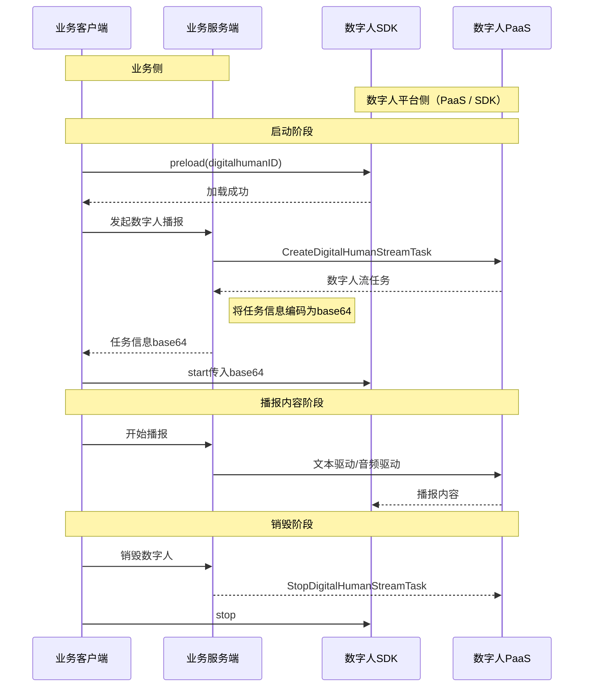
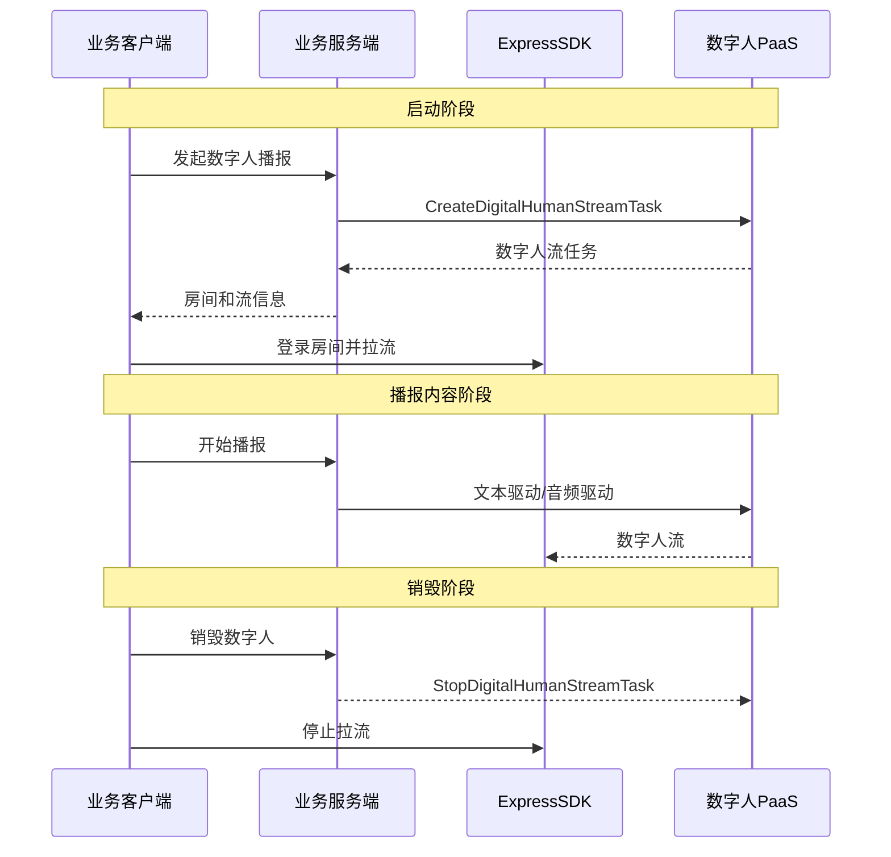

# 实现数字人实时流式输出

---

本文将介绍如何通过 ZEGO SDK 快速实现数字人实时流式输出。

## 功能简介

数字人实时流式输出是指通过服务端创建数字人视频流任务，客户端通过 RTC 协议拉取视频流进行展示的过程。在移动端（Android/iOS），通过数字人 SDK 进行视频帧和 SEI 的解析与交互渲染；在 Web 端，直接通过 Express SDK 进行拉流渲染。

## 前提条件

在实现数字人功能之前，请确保：

- 已在 [ZEGO 控制台](/console/project-info) 创建项目，并申请有效的 AppID 和 AppSign，详情请参考 [控制台 - 项目管理](/console/project-info)。
- 已联系 ZEGO 技术支持开通数字人 PaaS 服务和相关接口的权限。
- 已联系 ZEGO 技术支持创建数字人。
:::if{props.platform=undefined}
- 已根据 [集成 SDK](/aigc-digital-human-android/integrating-sdk) 完成 SDK 的集成和权限配置。
:::
:::if{props.platform="iOS"}
- 已根据 [集成 SDK](/aigc-digital-human-ios/integrating-sdk) 完成 SDK 的集成和权限配置。
:::
:::if{props.platform="Web"}
- 已参考 [集成 SDK](/real-time-voice-web/quick-start/integrating-sdk) 完成 ZEGO Express SDK 的集成。
:::

## 示例代码

我们提供了一个实现数字人基本流程的示例代码，可作为开发中的参考。

:::if{props.platform=undefined}
<Accordion title="实现数字人 Android 示例代码" defaultOpen="false">

```java
// ==================== 1. 初始化数字人SDK和视图 ====================
IZegoDigitalMobile digitalMobile = ZegoDigitalHuman.create(context);
ZegoDigitalView digitalHumanView = findViewById(R.id.digital_human_view);
if (digitalMobile != null && digitalHumanView != null) {
    digitalMobile.attach(digitalHumanView);
}

// ==================== 2. 创建数字人流任务 ====================
// 调用服务端 API 获取 TaskId, Base64Config, RoomId, StreamId, Token 等
apiService.createDigitalHumanStreamTask(taskConfig, new TaskCallback() {
    @Override
    public void onSuccess(JsonObject data) {
        String base64Config = data.get("Base64Config").getAsString();
        String roomId = data.get("RoomId").getAsString();
        String token = data.get("Token").getAsString();
        
        // 初始化 RTC 并登录房间
        initExpressEngine(data.get("AppId").getAsLong());
        loginRoom(roomId, userId, token, () -> {
            // 启动数字人
            digitalMobile.start(base64Config, listener);
        });
    }
});
```

</Accordion>
:::

:::if{props.platform="iOS"}
<Accordion title="实现数字人 iOS 示例代码" defaultOpen="false">

```oc
// ==================== 1. 初始化数字人SDK和视图 ====================
ZegoDigitalView *digitalHumanView = [[ZegoDigitalView alloc] initWithFrame:self.view.bounds];
[self.view insertSubview:digitalHumanView atIndex:0];
self.digitalMobile = [ZegoDigitalHuman create];
[self.digitalMobile attach:digitalHumanView];

// ==================== 2. 创建数字人流任务 ====================
[[ZegoAPIService sharedService] createDigitalHumanStreamTask:taskConfig success:^(NSDictionary *taskData) {
    NSString *base64Config = taskData[@"Base64Config"];
    [self initExpressEngineWithAppId:[taskData[@"AppId"] integerValue]];
    [self loginRoomWithCompletion:^(BOOL success) {
        if (success) {
            // 启动数字人
            [self.digitalMobile start:base64Config delegate:self];
        }
    }];
}];
```

</Accordion>
:::

:::if{props.platform="Web"}
<Accordion title="实现数字人 Web 示例代码" defaultOpen="false">

```javascript
// ==================== 1. 创建任务并初始化引擎 ====================
const result = await streamAPI.createStreamTask(config);
const { AppId, RoomId, StreamId, Token } = result.Data;

const zg = new ZegoExpressEngine(Number(AppId), server);

// ==================== 2. 登录房间并拉流 ====================
await zg.loginRoom(RoomId, Token, { userID, userName });

zg.on('roomStreamUpdate', async (roomID, updateType, streamList) => {
    if (updateType === 'ADD' && streamList[0].streamID === StreamId) {
        const remoteStream = await zg.startPlayingStream(StreamId);
        const remoteView = zg.createRemoteStreamView(remoteStream);
        remoteView.play("remote-video"); // 渲染到 DOM
    }
});
```

</Accordion>
:::

## 实现流程

:::if{props.platform=undefined}

:::

:::if{props.platform="iOS"}

:::

:::if{props.platform="Web"}

:::

## 实现步骤

### 1 初始化 SDK

:::if{props.platform=undefined}
```java
// 初始化 Express SDK
ZegoEngineProfile profile = new ZegoEngineProfile();
profile.appID = appId; 
profile.scenario = ZegoScenario.HIGH_QUALITY_CHATROOM;
ZegoExpressEngine.createEngine(profile, null);

// 创建数字人SDK实例并绑定视图
IZegoDigitalMobile digitalMobile = ZegoDigitalHuman.create(context);
digitalMobile.attach(findViewById(R.id.digital_human_view));
```
:::

:::if{props.platform="iOS"}
```oc
// 初始化 Express SDK
ZegoEngineProfile *profile = [[ZegoEngineProfile alloc] init];
profile.appID = (unsigned int)appId;
profile.scenario = ZegoScenarioHighQualityChatroom;
[ZegoExpressEngine createEngineWithProfile:profile eventHandler:self];

// 创建数字人SDK实例并绑定视图
self.digitalMobile = [ZegoDigitalHuman create];
[self.digitalMobile attach:self.digitalHumanView];
```
:::

:::if{props.platform="Web"}
```javascript
// 实例化 ZegoExpressEngine
const zg = new ZegoExpressEngine(appID, server);
```
:::

### 2 创建数字人流任务

业务客户端向业务服务端发起请求，由业务服务端调用数字人 PaaS API [创建数字人流任务](/aigc-digital-human-server/server-apis/digital-human-streaming/create-digital-human-stream-task)，获取 `RoomID`、`Token`、`StreamID` 等信息。

:::if{props.platform=undefined}
移动端任务需设置 `OutputMode` 为 `2`，并额外获取 `Base64Config` 用于启动数字人。
:::
:::if{props.platform="iOS"}
移动端任务需设置 `OutputMode` 为 `2`，并额外获取 `Base64Config` 用于启动数字人。
:::

### 3 登录房间并拉流渲染

:::if{props.platform=undefined}
由于移动端数字人 SDK 需要接管视频渲染以实现更好的交互效果，因此必须开启 **自定义视频渲染** 模式，并在回调中将视频帧数据透传给数字人 SDK。

```java
// 开启自定义渲染
ZegoCustomVideoRenderConfig renderConfig = new ZegoCustomVideoRenderConfig();
renderConfig.bufferType = ZegoVideoBufferType.RAW_DATA;
renderConfig.frameFormatSeries = ZegoVideoFrameFormatSeries.RGB;
ZegoExpressEngine.getEngine().enableCustomVideoRender(true, renderConfig);

// 视频帧回调透传
ZegoExpressEngine.getEngine().setCustomVideoRenderHandler(new IZegoCustomVideoRenderHandler() {
    @Override
    public void onRemoteVideoFrameRawData(ByteBuffer[] data, int[] dataLength, 
                                         ZegoVideoFrameParam param, String streamID) {
        digitalMobile.onRemoteVideoFrameRawData(data, dataLength, sdkParam, streamID);
    }
});
```
:::

:::if{props.platform="iOS"}
由于移动端数字人 SDK 需要接管视频渲染以实现更好的交互效果，因此必须开启 **自定义视频渲染** 模式，并在回调中将视频帧数据透传给数字人 SDK。

```oc
// 开启自定义渲染
ZegoCustomVideoRenderConfig *renderConfig = [[ZegoCustomVideoRenderConfig alloc] init];
renderConfig.bufferType = ZegoVideoBufferTypeRawData;
renderConfig.frameFormatSeries = ZegoVideoFrameFormatSeriesRGB;
[[ZegoExpressEngine sharedEngine] enableCustomVideoRender:YES config:renderConfig];

// 视频帧回调透传
- (void)onRemoteVideoFrameRawData:(unsigned char **)data dataLength:(unsigned int *)dataLength param:(ZegoVideoFrameParam *)param streamID:(NSString *)streamID {
    [self.digitalMobile onRemoteVideoFrameRawData:data dataLength:dataLength param:dmParam streamID:streamID];
}
```
:::

:::if{props.platform="Web"}
Web 端直接使用 Express SDK 的拉流接口，将流渲染到指定的 DOM 元素上。
```javascript
const remoteStream = await zg.startPlayingStream(streamID);
const remoteView = zg.createRemoteStreamView(remoteStream);
remoteView.play("remote-video-container-id");
```
:::

### 4 启动数字人及 SEI 处理

:::if{props.platform=undefined}
调用 `start` 接口并传入 `Base64Config` 启动数字人。同时，需将 RTC 接收到的 SEI 数据透传给数字人 SDK，以确保音画同步。

```java
digitalMobile.start(base64Config, listener);

// SEI 处理
@Override
public void onPlayerSyncRecvSEI(String streamID, byte[] data) {
    digitalMobile.onPlayerSyncRecvSEI(streamID, data);
}
```
:::

:::if{props.platform="iOS"}
调用 `start` 接口并传入 `Base64Config` 启动数字人。同时，需将 RTC 接收到的 SEI 数据透传给数字人 SDK，以确保音画同步。

```oc
[self.digitalMobile start:base64Config delegate:self];

// SEI 处理
- (void)onPlayerSyncRecvSEI:(NSData *)data streamID:(NSString *)streamID {
    [self.digitalMobile onPlayerSyncRecvSEI:streamID data:data];
}
```
:::

:::if{props.platform="Web"}
Web 端由 Express SDK 内部自动处理流数据，无需手动透传 SEI。
:::

### 5 驱动数字人

任务启动后，通过业务服务端调用 PaaS API 驱动数字人播报。支持文本驱动、音频驱动等方式。

:::if{props.platform=undefined}
```java
// 文本驱动
apiService.driveByText(taskId, "播报文本内容", new DriveCallback() {
    @Override
    public void onSuccess() {
        // 驱动成功
    }
});

// 音频文件驱动
apiService.driveByAudio(taskId, "audio_url", new DriveCallback() {
    @Override
    public void onSuccess() {
        // 驱动成功
    }
});
```
:::

:::if{props.platform="iOS"}
```oc
// 文本驱动
[[ZegoAPIService sharedService] driveByText:taskId text:@"播报文本内容" success:^(NSDictionary *data) {
    // 驱动成功
} failure:nil];

// 音频文件驱动
[[ZegoAPIService sharedService] driveByAudio:taskId audioUrl:@"audio_url" success:^(NSDictionary *data) {
    // 驱动成功
} failure:nil];
```
:::

:::if{props.platform="Web"}
```javascript
// 文本驱动
await driveAPI.driveByText(taskId, "播报文本内容");

// 音频文件驱动
await driveAPI.driveByAudio(taskId, "audio_url");
```
:::

### 6 停止任务

:::if{props.platform=undefined}
```java
ZegoExpressEngine.getEngine().stopPlayingStream(streamId);
ZegoExpressEngine.getEngine().logoutRoom(roomId);
digitalMobile.stop();
ZegoExpressEngine.destroyEngine(null);
```
:::

:::if{props.platform="iOS"}
```oc
[[ZegoExpressEngine sharedEngine] stopPlayingStream:streamId];
[[ZegoExpressEngine sharedEngine] logoutRoom];
[self.digitalMobile stop];
[ZegoExpressEngine destroyEngine:nil];
```
:::

:::if{props.platform="Web"}
```javascript
zg.stopPlayingStream(streamId);
zg.logoutRoom();
```
:::

## 相关文档

:::if{props.platform=undefined}
- [集成 SDK](/aigc-digital-human-android/integrating-sdk)
:::
:::if{props.platform="iOS"}
- [集成 SDK](/aigc-digital-human-ios/integrating-sdk)
:::
:::if{props.platform="Web"}
- [集成 SDK](/real-time-voice-web/quick-start/integrating-sdk)
:::
- [服务端 API - 创建数字人流任务](/aigc-digital-human-server/server-apis/digital-human-streaming/create-digital-human-stream-task)
- [错误码查询](/aigc-digital-human-android/client-sdk/error-code)
