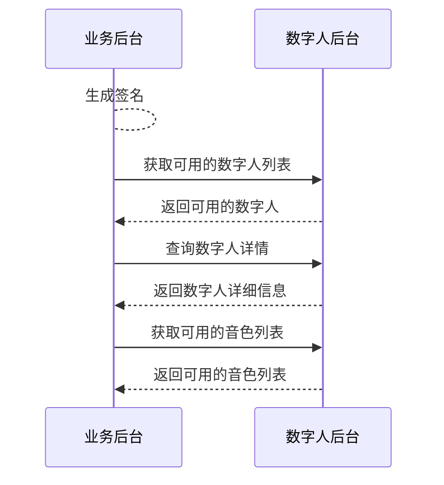

# 查看数字人资产

- - -

## 简介

本文介绍如何基于服务端 API 快速实现查看数字人资产，获取需要的数字人 ID 与音色 ID，用于后续创建视频流任务。
相关概念解释：
- 数字人：您在 ZEGO 所能使用数字人，包括 ZEGO 提供的公共数字人和您在 ZEGO 定制的专属数字人。
- 音色：您在 ZEGO 所能使用的数字人音色，包括 ZEGO 提供的公共音色和您在 ZEGO 定制的专属音色。

<Note title="说明">
如需了解定制数字人和声音的价格，请联系 ZEGO 商务人员。
</Note>

## 前提条件

在查看数字人资产前，请确保：
- 在 [ZEGO 控制台](https://console.zego.im) 创建项目，并申请有效的 AppID，详情请参考 [控制台 - 项目管理 - 项目信息](#12107)。
- 已联系 ZEGO 技术支持开通数字人能力平台服务和相关接口的权限。

## 实现流程

### 1 生成签名

根据 [调用方式](./../server-apis/accessing-server-apis.mdx#签名机制) 的签名机制生成签名，签名需设置在下文请求的公共参数中，ZEGO 服务端在收到请求后将对签名进行验证，以校验请求方的合法性。

### 2 查询数字人列表

调用 [查询数字人列表](./../server-apis/digital-human-management/get-digital-human-list.mdx) 接口获取 AppID 下可用数字人的信息列表，从中选择所需数字人 ID（`DigitalHumanId`）。

### 3 查询数字人详情

调用 [查询数字人信息](./../server-apis/digital-human-management/get-digital-human-info.mdx) 接口，传入所获取的 `DigitalHumanId`，查询该数字人的详细信息，包括该数字人支持的动作列表，以便后续用于 [动作驱动数字人](./../server-apis/digital-human-streaming/do-action.mdx) 。

### 4 查询音色列表

调用 [查询音色列表](./../server-apis/digital-human-management/get-timbre-list.mdx) 接口，传入所获取的 `DigitalHumanId`，查询与数字人关联的音色信息列表，从中选择所需音色 ID（`TimbreId`)，以便后续用于 [创建数字人视频流任务](./../server-apis/digital-human-streaming/create-digital-human-stream-task.mdx)。
