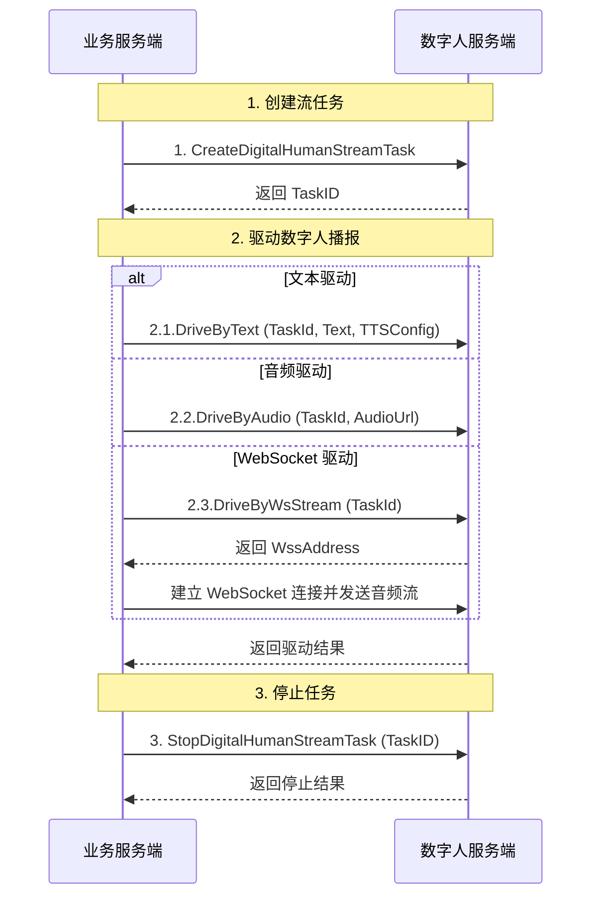

# 实现数字人视频流播报

- - -

## 简介

本文介绍如何在您的业务后台接入数字人后台 API，结合客户端 SDK 实现数字人视频流播报。

## 前提条件

在开始接入数字人视频流播报功能前，请确保：
- 在 [ZEGO 控制台](https://console.zego.im) 创建项目，并申请有效的 AppID，详情请参考 [控制台 - 项目管理 - 项目信息](/console/project-info)。
- 已联系 ZEGO 技术支持开通数字人 API 服务和相关接口的权限。

## 示例代码

我们提供了一个实现数字人服务端基本流程的示例代码，您可以参考其实现逻辑：

<CardGroup cols={2}>
  <Card title="业务后台示例源码" href="https://github.com/ZEGOCLOUD/digital_human_paas_quick_start/tree/master/Server" target="_blank">
    基于 Go 语言实现，包含生成签名、创建流任务、驱动数字人、停止任务等服务端核心逻辑。
  </Card>
</CardGroup>

## 使用场景

本质上，数字人都是由音频驱动（数字人形象跟随音频内容变化产生嘴形、面容、型态自然且持续变化）的。驱动数字人有三种方式。其区别和使用场景如下：
|驱动方式|说明|使用场景|
|:---|:---|:---|
|文本驱动|向数字人后台发送文本，由数字人后台执行文本转语音（TTS）合成语音后驱动数字人播报|适合「无真人原声要求、需高频修改 / 多语种适配、追求极致生产效率」的批量标准化场景。|
|音频驱动|直接使用现有音频文件驱动数字人播报|适合「需保留真人原生表达风格 / 音色、内容定稿无修改、有专属真人 IP / 音色资产」的批量标准化场景|
|WebSocket 驱动|数字人后台返回 WebSocket 连接信息。业务后台通过 WebSocket 实时持续地发送音频数据驱动数字人播报|实时互动场景，如 AI 客服等。推荐结合 ZEGO 实时互动 AI Agent 产品使用，详情可参考[实现数字人视频通话](/aiagent-server/quick-start-with-digital-human)。|

## 实现流程

通常我们需要把这些流程封装成一个业务后台 API，供客户端调用。以我们提供的示例代码为例：

| 步骤                         | 数字人服后台 API                                                                                                                      | 供客户端调用的业务后台 API             | 参考实现文件                         |
| ---------------------------- | ---------------------------------------------------------------------------------------------------------------------------------- | -------------------------------------- | -------------------------------- |
| 1. 创建数字人视频流任务      | [CreateDigitalHumanStreamTask](/aigc-digital-human-server/streaming-apis/digital-human-streaming/create-digital-human-stream-task) | POST /api/CreateDigitalHumanStreamTask | [Server/internal/handler/task.go](https://github.com/ZEGOCLOUD/digital_human_paas_quick_start/blob/90d895e93d16bf8bddf7effe8034ed19d7a724ad/Server/internal/handler/task.go#L42)  |
| 2.1. 文本驱动                | [DriveByText](/aigc-digital-human-server/streaming-apis/digital-human-streaming/drive-by-text)                                     | POST /api/DriveByText                  | [Server/internal/handler/drive.go](https://github.com/ZEGOCLOUD/digital_human_paas_quick_start/blob/90d895e93d16bf8bddf7effe8034ed19d7a724ad/Server/internal/handler/drive.go#L22) |
| 2.2.音频驱动                 | [DriveByAudio](/aigc-digital-human-server/streaming-apis/digital-human-streaming/drive-by-audio)                                   | POST /api/DriveByAudio                 | [Server/internal/handler/drive.go](https://github.com/ZEGOCLOUD/digital_human_paas_quick_start/blob/90d895e93d16bf8bddf7effe8034ed19d7a724ad/Server/internal/handler/drive.go#L109) |
| 2.3. 获取 WebSocket 驱动信息 | [DriveByWsStream](/aigc-digital-human-server/streaming-apis/digital-human-streaming/drive-by-ws-stream)                            | POST /api/DriveByWsStream              | [Server/internal/digitalhuman/ws_driver.go](https://github.com/ZEGOCLOUD/digital_human_paas_quick_start/blob/90d895e93d16bf8bddf7effe8034ed19d7a724ad/Server/internal/digitalhuman/ws_driver.go#L64) |
| 3. 停止数字人视频流任务      | [StopDigitalHumanStreamTask](/aigc-digital-human-server/streaming-apis/digital-human-streaming/stop-digital-human-stream-task)     | POST /api/StopDigitalHumanStreamTask   | [Server/internal/handler/task.go](https://github.com/ZEGOCLOUD/digital_human_paas_quick_start/blob/90d895e93d16bf8bddf7effe8034ed19d7a724ad/Server/internal/handler/task.go#L313)  |

客户端如何调用业务后台 API 请参考客户端快速开始文档：
<CardGroup cols={3}>
<Card title="Android" href="/aigc-digital-human-android/quick-start">
实现数字人视频流播报
</Card>
<Card title="iOS"  href="/aigc-digital-human-ios/quick-start">
实现数字人视频流播报
</Card>
<Card title="Web"  href="/aigc-digital-human-web/quick-start">
实现数字人视频流播报
</Card>
</CardGroup>

### 1 了解如何接入数字人后台 API

请先阅读数字人后台 API [调用方式](/aigc-digital-human-server/streaming-apis/accessing-server-apis) 文档说明。了解请求结构、公共参数概念、签名机制后再进行后续的接入流程。

<Warning title="注意">
- **安全性**：`ServerSecret` 是用于生成签名的重要密钥，**严禁在客户端代码中明文硬编码**，否则可能导致密钥泄露。签名计算逻辑必须在业务服务端完成。
- **时效性**：签名中包含时间戳，请确保业务服务器时间准确（建议同步网络标准时间），否则可能因签名过期导致请求失败。
- **算法一致性**：请严格按照文档要求的算法（SHA256）和参数拼接顺序计算签名，任何字符差异都会导致校验失败。
- **单次有效性**：**每次调用接口时都必须生成新的签名**。严禁重复使用旧签名，否则会导致校验失败。
</Warning>

### 2 创建数字人视频流任务

调用 [查询数字人接口](/aigc-digital-human-server/streaming-apis/digital-human-management/get-digital-human-list)获取数字人列表，选择您需要的数字人 ID 用于创建数字人视频流任务。

调用 [创建数字人视频流任务](../streaming-apis/digital-human-streaming/create-digital-human-stream-task.mdx) 接口，数字人服务端将返回 `TaskID`。

<Note title="说明">
- 该接口仅返回 `TaskID`。
- 如果您在移动端（Android/iOS）创建任务，必须设置 `OutputMode` 为 `2`。
- 该接口需要传入用于客户端通过实时音频（RTC）拉流的 `RoomID` 和 `StreamID`，业务后台需自行维护 `TaskID` 与 `RoomID`、`StreamID` 的对应关系。
</Note>

### 3 驱动数字人说话

任务创建成功后，业务后台调用驱动接口控制数字人播报。支持以下方式：
- **文本驱动**：调用 [DriveByText](../streaming-apis/digital-human-streaming/drive-by-text.mdx) 接口，传入待播报文本及 TTS 配置。
- **音频驱动**：调用 [DriveByAudio](../streaming-apis/digital-human-streaming/drive-by-audio.mdx) 接口，传入音频文件 URL。
- **WebSocket 驱动**：请参考 [使用 WebSocket 驱动数字人播报](/aigc-digital-human-server/quick-start/digital-human-ws-drive)查看详细使用方法。

### 4 停止数字人视频流任务

需要结束任务时，调用 [StopDigitalHumanStreamTask](../streaming-apis/digital-human-streaming/stop-digital-human-stream-task.mdx) 接口释放资源。

<Warning title="注意">
**请务必确保显式停止任务**。如果未及时停止，数字人推流任务将持续运行直到达到最大时长（TTL），这会造成不必要的**并发数占用**和**计费资源浪费**。

您可以调用 [查询数字人视频流任务列表](/aigc-digital-human-server/streaming-apis/digital-human-streaming/query-digital-human-stream-tasks) 接口，确认当前账号下活跃的任务数及明细。
</Warning>

## 监听异常回调

为了实时获取数字人视频流任务及驱动任务的状态（如初始化失败、推流停止、驱动结束等），您可以配置并 [接收回调](../streaming-apis/receiving-callback.mdx)。

通过回调中的 `EventType` 字段区分事件类型：
- **数字人视频流任务状态** (`EventType` 为 3)：可监听任务初始化失败、推流停止等。
- **数字人视频流任务驱动状态** (`EventType` 为 4)：可监听驱动失败、驱动结束等。

详细的回调参数说明请参考 [接收回调](../streaming-apis/receiving-callback.mdx)。

## 相关文档

- [服务端错误码](../streaming-apis/return-codes.mdx)
- [接收回调](../streaming-apis/receiving-callback.mdx)
