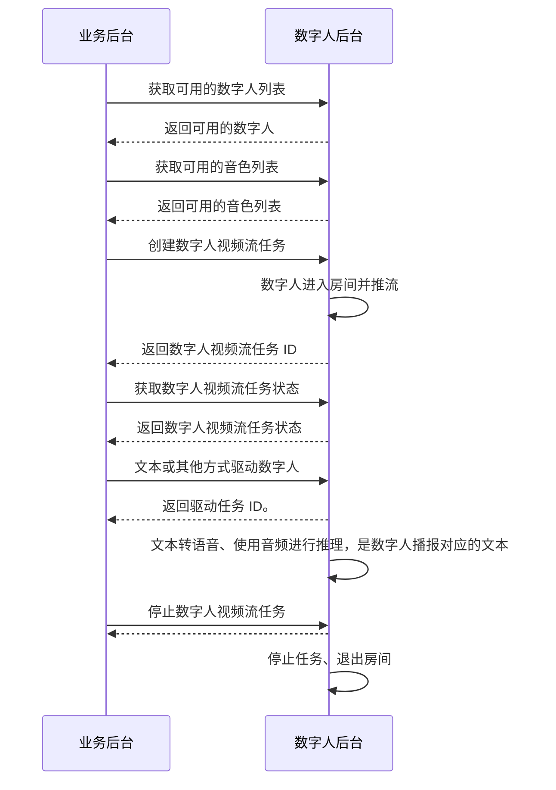

# 视频数字人实时流式

- - -

## 简介

本文介绍如何基于服务端 API 快速实现合成实时流式视频。

<Note title="Note">

流式数字人视频生成与推流需要与 [实时音视频](#195) 搭配使用。
</Note>

## 前提条件

在合成实时流式视频前，请确保：
- 在 [ZEGO 控制台](https://console.zego.im) 创建项目，并申请有效的 AppID，详情请参考 [控制台 - 项目管理 - 项目信息](#12107)。
- 已联系 ZEGO 技术支持开通数字人 PaaS 服务和相关接口的权限。
- 已获取数字人 ID 和音色 ID，详情请参考 [数字人列表](../server-apis/digital-human-management/get-digital-human-list.mdx) [音色列表](../server-apis/digital-human-management/get-timbre-list.mdx)。
- 您的项目已 [集成实时音视频 SDK](#195)。

## 实现流程

### 1 生成签名

根据 [调用方式](#18534#5) 的签名机制生成签名，签名需设置在下文请求的公共参数中，ZEGO 服务端在收到请求后将对签名进行验证，以校验请求方的合法性。

### 2 获取可用的数字人列表

调用 [数字人列表](../server-apis/digital-human-management/get-digital-human-list.mdx) 获取可用的数字人。

### 3 获取可用的音色列表

调用 [音色列表](../server-apis/digital-human-management/get-timbre-list.mdx) 获取音色。

### 4 创建数字人视频流任务

调用 [创建数字人视频流任务](../server-apis/digital-human-streaming/create-digital-human-stream-task.mdx) 创建一个数字人视频流任务，生成数字人实时画面。

### 5 获取数字人视频流任务状态

调用 [获取数字人视频流任务状态](../server-apis/digital-human-streaming/get-digital-human-stream-task-status.mdx) 获取数字人视频流任务状态，如果状态为 `3：推流中` 则表示任务已经正在运行，客户端可以进入房间拉取到数字人的视频流。

### 6 驱动数字人说话

调用 [文本驱动数字人](../server-apis/digital-human-streaming/drive-by-text.mdx) 或者其他驱动接口，驱动数字人说话。

### 7 停止数字人视频流任务

调用 [停止数字人视频流任务](../server-apis/digital-human-streaming/stop-digital-human-stream-task.mdx) 停止数字人视频流任务。
