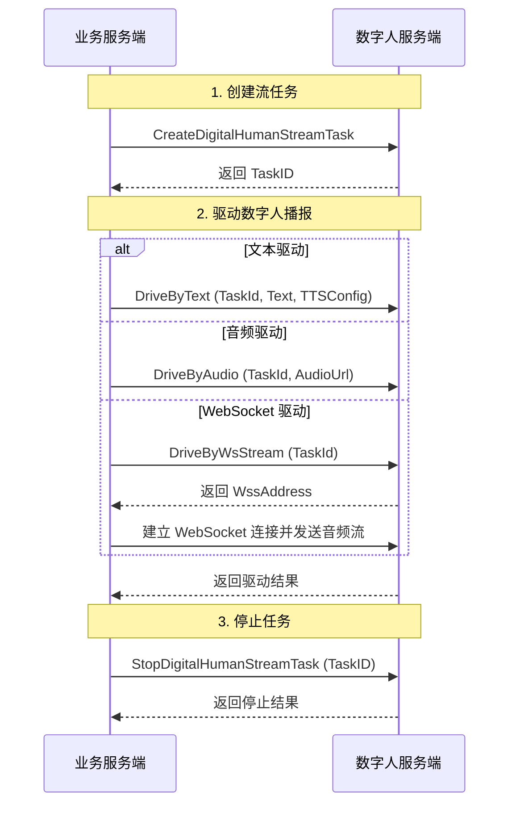

# 快速实现数字人流式播报

- - -

## 简介

本文介绍如何基于服务端 API 快速实现合成实时流式视频。

<Note title="说明">
流式数字人视频生成与推流需要与 [实时音视频](https://doc-zh.zego.im/article/195) 搭配使用。
</Note>

## 前提条件

在合成实时流式视频前，请确保：
- 在 [ZEGO 控制台](https://console.zego.im) 创建项目，并申请有效的 AppID，详情请参考 [控制台 - 项目管理 - 项目信息](https://doc-zh.zego.im/article/12107)。
- 已联系 ZEGO 技术支持开通数字人 API 服务和相关接口的权限。
- 已获取数字人 ID 和音色 ID，详情请参考 [查询数字人资产](./describe-assets.mdx)。
- 您的项目已 [集成实时音视频 SDK](https://doc-zh.zego.im/article/195)。

## 示例代码

我们提供了一个实现数字人服务端基本流程的示例代码，您可以参考其实现逻辑：

<CardGroup cols={2}>
  <Card title="业务后台示例源码" href="https://github.com/ZEGOCLOUD/digital_human_paas_quick_start/tree/master/Server" target="_blank">
    基于 Go 语言实现，包含生成签名、创建流任务、驱动数字人、停止任务等服务端核心逻辑。
  </Card>
</CardGroup>

## 实现流程

### 1 生成签名

根据 [调用方式](../streaming-apis/accessing-server-apis.mdx#签名机制) 的签名机制生成签名，签名需设置在下文请求的公共参数中，ZEGO 服务端在收到请求后将对签名进行验证，以校验请求方的合法性。

<Warning title="注意">
- **安全性**：`ServerSecret` 是用于生成签名的重要密钥，**严禁在客户端代码中明文硬编码**，否则可能导致密钥泄露。签名计算逻辑必须在业务服务端完成。
- **时效性**：签名中包含时间戳，请确保业务服务器时间准确（建议同步网络标准时间），否则可能因签名过期导致请求失败。
- **算法一致性**：请严格按照文档要求的算法（SHA256）和参数拼接顺序计算签名，任何字符差异都会导致校验失败。
- **单次有效性**：**每次调用接口时都必须生成新的签名**。严禁重复使用旧签名，否则会导致校验失败。
</Warning>

### 2 创建数字人视频流任务

调用 [创建数字人视频流任务](../streaming-apis/digital-human-streaming/create-digital-human-stream-task.mdx) 接口，数字人服务端将返回 `TaskID`。

<Note title="说明">
- 该接口仅返回 `TaskID`。
- 如果您是为移动端（Android/iOS）创建任务，必须设置 `OutputMode` 为 `2`。
- 业务侧需自行维护 `TaskID` 与业务参数（如 `RoomID`、`StreamID`）的对应关系。
</Note>

### 3 驱动数字人说话

任务启动后，业务服务端调用驱动接口控制数字人播报。支持以下方式：
- **文本驱动**：调用 [DriveByText](../streaming-apis/digital-human-streaming/drive-by-text.mdx) 接口，传入待播报文本及 TTS 配置。
- **音频驱动**：调用 [DriveByAudio](../streaming-apis/digital-human-streaming/drive-by-audio.mdx) 接口，传入音频文件 URL。
- **WebSocket 音频流驱动**：先调用 [DriveByWsStream](../streaming-apis/digital-human-streaming/drive-by-ws-stream.mdx) 接口获取 WebSocket 地址，再建立连接发送实时音频流。

### 4 停止数字人视频流任务

通话结束后，调用 [StopDigitalHumanStreamTask](../streaming-apis/digital-human-streaming/stop-digital-human-stream-task.mdx) 接口停止推流并释放资源。

<Warning title="注意">
**请务必确保在通话结束后显式停止任务**。如果未及时停止，数字人推流任务将持续运行直到达到最大时长（TTL），这会造成不必要的**并发数占用**和**计费资源浪费**。

您可以调用 [查询正在运行的数字人视频流任务](../streaming-apis/digital-human-streaming/query-digital-human-stream-tasks.mdx) 接口，确认当前账号下活跃的任务数及明细。
</Warning>

## 监听异常回调

为了实时获取数字人视频流任务及驱动任务的状态（如初始化失败、推流停止、驱动结束等），您可以配置并 [接收回调](../streaming-apis/receiving-callback.mdx)。

通过回调中的 `EventType` 字段区分事件类型：
- **数字人视频流任务状态** (`EventType` 为 3)：可监听任务初始化失败、推流停止等。
- **数字人视频流任务驱动状态** (`EventType` 为 4)：可监听驱动失败、驱动结束等。

详细的回调参数说明请参考 [接收回调](../streaming-apis/receiving-callback.mdx)。

## 相关文档

- [服务端错误码](../streaming-apis/return-codes.mdx)
- [接收回调](../streaming-apis/receiving-callback.mdx)
