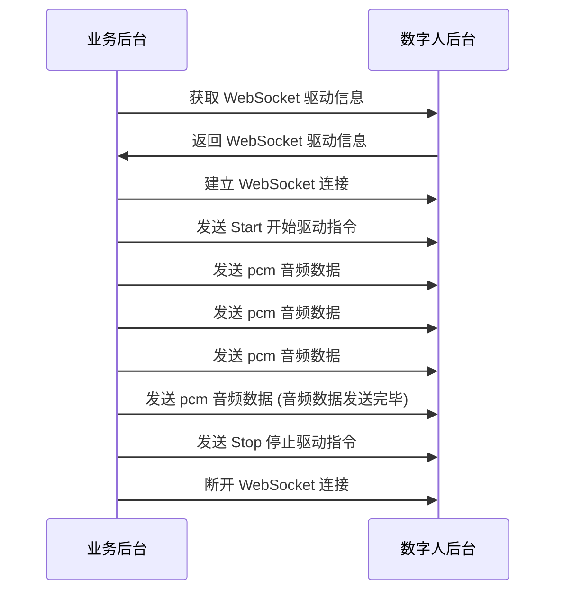

export const DriveIdNote = () => (
  <Note title="说明">请在每次使用 WebSocket 驱动时，都重新调用 DriveByWsStream 接口获取新的 DriveId 。</Note>
);

# WebSocket 驱动数字人说话

- - -

## 简介

本文介绍如何使用 WebSocket 传输 pcm 音频数据驱动数字人说话。

## 前提条件

在使用 WebSokcet 驱动之前，请确保：
- 已创建数字人视频流任务

## 实现流程



### 1 获取 WebSocket 驱动信息

调用 [DriveByWsStream\|_blank](../server-apis/digital-human-streaming/drive-by-ws-stream.mdx) 接口获取 WebSocket 驱动信息，该接口返回 WebSocket 驱动信息，包含 WebSocket 地址（包含鉴权信息）、驱动任务 ID 。

### 2 建立 WebSocket 连接

<Note title="说明">
    对于同一个数字人视频流任务，请不要同时建立多个连接，并在不同的连接上并行发送数据。
</Note>
通过 WebSocket 地址（包含鉴权信息）建立 WebSocket 连接。

### 3 发送 Start 开始驱动指令

WebSocket 连接建立后，通过该连接发送开始驱动指令。协议如下：

#### 请求参数
| 参数               | 类型   | 是否必选 | 描述             |
|------------------|------|------|-------------------------|
| Action      | String | 是    | 固定传：Start  |
| Payload      | Object | 是    | 请求体。         |
| └DriveId      | String   | 是    | 通过 [获取 WebSocket 驱动信息](../server-apis/digital-human-streaming/drive-by-ws-stream.mdx) 接口的响应参数获取。<DriveIdNote /> |
| └SampleRate      | Number  | 否   | 音频采样率，目前支持以下两种采样率：<ul><li>16000Hz</li><li>24000Hz</li></ul> 如果不填，取值为 16000。 |

#### 请求示例
```json
    {
        "Action": "Start",
        "Payload": {
            "DriveId": "xxxxxxxxxxx",
            "SampleRate": 16000
        }
    }
```

### 4 发送 pcm 音频数据

通过 WebSocket 连接发送 pcm 音频数据给数字人服务。
<Note title="说明">
    请发送原生的 pcm 二进制数据。
</Note>

### 5 发送 Stop 停止驱动指令

<Note title="说明">
    如果不及时发送 Stop 指令，数字人后台会误认为还有剩余的 pcm 数据没有被接收到，并等待，导致没有足够的数据进行推理，进而导致数字人卡顿。
</Note>
当 pcm 音频数据发送完毕之后，请及时发送 Stop 指令，避免造成数字人卡顿。协议如下：

#### 请求参数
| 参数               | 类型   | 是否必选 | 描述             |
|------------------|------|------|-------------------------|
| Action      | String | 是    | 固定传：Start  |
| Payload      | Object | 是    | 请求体。         |
| └DriveId      | String   | 是    | 通过 [获取 WebSocket 驱动信息](../server-apis/digital-human-streaming/drive-by-ws-stream.mdx) 接口的响应参数获取。<DriveIdNote /> |

#### 请求示例
```json
    {
        "Action": "Stop",
        "Payload": {
            "DriveId": "xxxxxxxxxxx"
        }
    }
```

### 6 断开 WebSocket 连接

如果后续没有 WebSocket 驱动的请求，请及时断开连接。