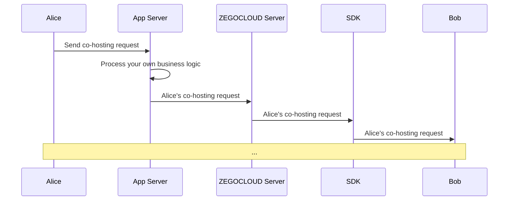

# Implement co-hosting

This doc will introduce how to implement the co-hosting feature in the live streaming scenario.

## Prerequisites

Before you begin, make sure you complete the following:

- Complete SDK integration by referring to **Quick Start** doc.
- Download the [demo](https://github.com/ZEGOCLOUD/zegocloud_sdk_demo_android/tree/master/best_practice) that comes with this doc.
- Activate the **In-app Chat** service.


## Preview the effect

You can achieve the following effect with the [demo](https://github.com/ZEGOCLOUD/zegocloud_sdk_demo_android/tree/master/best_practice) provided in this doc:


|Homepage|Live stream page|Receive co-hosting request|Start co-hosting|
|--- | --- | --- |--- |
|||||


## Understand the tech

### 1. What is roomrequest?

The process of co-hosting implemented based on roomrequest, roomrequest  is a protocol or message to manage communication and connections in networks. ZEGOCLOUD packages all roomrequest capabilities into a SDK, providing you with a readily available real-time roomrequest API.

<Video src="https://www.youtube.com/embed/pfnBmt9FST8"/>

### 2. How to send & receive roomrequest messages through the ZIM SDK interface

The ZIM SDK provides rich functionality for sending and receiving messages, see [Send & Receive messages (roomrequest)](/zim-android/guides/messaging/send-and-receive-messages). And here, you will need to use the customizable roomrequest message: `ZIMCommandMessage`


> Complete demo code for this section can be found at [ZIMService.java](https://github.com/ZEGOCLOUD/zegocloud_sdk_demo_android/tree/master/best_practice/app/src/main/java/com/zegocloud/demo/bestpractice/internal/sdk/zim/ZIMService.java).

(1) Send RoomRequest (`ZIMCommandMessage`) in the room by calling [sendMessage](@sendMessage) with the following:

```java
zim.sendMessage(commandMessage, mRoomID, ZIMConversationType.ROOM, config, new ZIMMessageSentCallback() {
    // ...
    @Override
    public void onMessageSent(ZIMMessage message, ZIMError errorInfo) {
        // ...
    }
});
```

(2) After sending, other users in the room will receive the RoomRequest from the [onReceiveRoomMessage](@onReceiveRoomMessage) callback. You can listen to this callback by following below:


```java
zim.setEventHandler(new ZIMEventHandler() {
    @Override
    public void onReceiveRoomMessage(ZIM zim, ArrayList<ZIMMessage> messageList, String fromRoomID) {
        super.onReceiveRoomMessage(zim, messageList, fromRoomID);

        // ...
    }
});
```


### 3. How to customize business RoomRequest

> Complete demo code for this section can be found at [ZIMService.java](https://github.com/ZEGOCLOUD/zegocloud_sdk_demo_android/tree/master/best_practice/app/src/main/java/com/zegocloud/demo/bestpractice/internal/sdk/zim/ZIMService.java) and [RoomRequest.java](https://github.com/ZEGOCLOUD/zegocloud_sdk_demo_android/tree/master/best_practice/app/src/main/java/com/zegocloud/demo/bestpractice/internal/sdk/zim/RoomRequest.java).

**JSON RoomRequest encoding**

Since a simple `String` itself is difficult to express complex information, RoomRequest can be encapsulated in `JSON` format, making it more convenient for you to organize the protocol content of the RoomRequest.

Taking the simplest JSON RoomRequest as an example: `{"action_type": 10000}`, in such a JSON RoomRequest, you can use the `action_type` field to express different RoomRequest types, such as:

- Sending a  request: `{"action_type": RoomRequestAction.ACTION_REQUEST}`
- Canceling a  request: `{"action_type": RoomRequestAction.ACTION_CANCEL}`
- Accepting a  request: `{"action_type": RoomRequestAction.ACTION_ACCEPT}`
- Rejecting a  request: `{"action_type": RoomRequestAction.ACTION_REJECT}`


In addition, you can also extend other common fields for RoomRequest, such as `senderID` , `receiverID`,`extended_data` :


```java
public class RoomRequest {

    // ...
    public String toString() {
        JSONObject jsonObject = new JSONObject();
        try {
            jsonObject.put("action_type", actionType);
            jsonObject.put("sender_id", sender);
            jsonObject.put("receiver_id", receiver);
            jsonObject.put("extended_data", extendedData);
            jsonObject.put("request_id", requestID);
        } catch (JSONException e) {
            throw new RuntimeException(e);
        }
        return jsonObject.toString();
    }

    // ...
}

public @interface RoomRequestAction {
    int ACTION_REQUEST = 0;
    int ACTION_ACCEPT = 1;
    int ACTION_REJECT = 2;
    int ACTION_CANCEL = 3;
}
```

**JSON RoomRequest decoding**

And users who receive RoomRequest can decode the JSON RoomRequest and know and process specific business logic based on the fields in it, such as:


```java
zim.setEventHandler(new ZIMEventHandler() {
    @Override
    public void onReceiveRoomMessage(ZIM zim, ArrayList<ZIMMessage> messageList, String fromRoomID) {
        super.onReceiveRoomMessage(zim, messageList, fromRoomID);

        for (ZIMMessage zimMessage : messageList) {
            if (zimMessage instanceof ZIMCommandMessage) {
                ZIMCommandMessage commandMessage = (ZIMCommandMessage) zimMessage;
                String message = new String(commandMessage.message, StandardCharsets.UTF_8);
                try {
                    JSONObject jsonObject = new JSONObject(message);
                    if (jsonObject.has("action_type")) {
                        jsonObject.put("message_id", String.valueOf(commandMessage.getMessageID()));
                        if (currentUser != null) {
                            onReceiveRoomRequestMessage(jsonObject);
                        }
                    } else {
                        // ...
                    }
                } catch (JSONException e) {
                     // ...
                }
            }
        }
    }
    // ...
)

// ...
private void onReceiveRoomRequestMessage(JSONObject jsonObject) throws JSONException {
    String sender = jsonObject.getString("sender_id");
    String receiver = jsonObject.getString("receiver_id");
    int actionType = jsonObject.getInt("action_type");
    String extendedData = jsonObject.getString("extended_data");
    String messageID = jsonObject.getString("message_id");
    if (currentUser.userID.equals(receiver)) {
        if (actionType == RoomRequestAction.ACTION_REQUEST) {
            // ...
        } else if (actionType == RoomRequestAction.ACTION_ACCEPT) {
            // ...
        } else if (actionType == RoomRequestAction.ACTION_CANCEL) {
            // ...
        } else if (actionType == RoomRequestAction.ACTION_REJECT) {
            // ...
        }
    }
}
```

**Further extending RoomRequest**

Based on this pattern, when you need to do any protocol extensions in your business, you only need to extend the `extended_data` field of the RoomRequest to easily implement new business logic, such as:

- Muting audience: After receiving the corresponding RoomRequest, the UI blocks the user from sending live bullet messages.
- Sending virtual gifts: After receiving the RoomRequest, show the gift special effects.
- Removing audience: After receiving the RoomRequest, prompt the audience that they have been removed and exit the room.


**Friendly reminder**:
After reading the following text and further understanding the implementation of co-hosting RoomRequest, you will be able to easily extend your live streaming business RoomRequest.

<Note title="Note">

The demo in this document is a pure client API + ZEGOCLOUD solution. If you have your own business server and want to do more logical extensions, you can use our [Server API](/live-streaming-server/api-reference/overview) to pass RoomRequest and combine your server's room business logic to increase the reliability of your app.




</Note>


## Implementation

### Integrate and start to use the ZIM SDK
If you have not used the ZIM SDK before, you can read the following section:

<Accordion title="Import the ZIM SDK" defaultOpen="false">

To import the ZIM SDK, do the following:

1. Set up repositories.

    - If your Android Gradle Plugin is **v7.1.0 or later**: go to the root directory of your project, open the `settings.gradle` file, and add the following line to the `dependencyResolutionManagement`:

        ```groovy
        ...
        dependencyResolutionManagement {
            repositoriesMode.set(RepositoriesMode.FAIL_ON_PROJECT_REPOS)
            repositories {
                maven { url 'https://maven.zego.im' }
                mavenCentral()
                google()
            }
        }
        ```

        <div class="mk-warning">

        If you can not find the above fields in `settings.gradle`, it's probably because your Android Gradle Plugin version is lower than v7.1.0.

        For more details, see [Android Gradle Plugin Release Note v7.1.0](https://developer.android.com/build/releases/past-releases/agp-7-1-0-release-notes#settings-gradle).
        </div>

    - If your Android Gradle Plugin is **earlier than 7.1.0**: go to the root directory of your project, open the `build.gradle` file, and add the following line to the `allprojects`:

        ```groovy
        ...
        allprojects {
            repositories {
                maven { url 'https://maven.zego.im' }
                mavenCentral()
                google()
            }
        }
        ```

2. Declare dependencies:

    Go to the `app` directory, open the `build.gradle` file, and add the following line to the `dependencies`. (**x.y.z** is the SDK version number, to obtain the latest version number, see [Release Notes](!zim-SDKs/Change_Log).

    ```groovy
    ...
    dependencies {
        ...
        implementation 'im.zego:zim:x.y.z'
    }
    ```
</Accordion>

<Accordion title="Create and manage SDK instances" defaultOpen="false">

After successful integration, you can use the Zim SDK like this:

```java
import im.zego.zim.ZIM
```

Creating a ZIM instance is the very first step, an instance corresponds to a user logging in to the system as a client.
```java
ZIMAppConfig appConfig = new ZIMAppConfig();
appConfig.appID = yourAppID;
appConfig.appSign = yourAppSign;
ZIM.create(appConfig, application);
```

</Accordion>


Later on, we will provide you with detailed instructions on how to use the ZIM SDK to develop the call invitation feature.


### Manage multiple SDKs more easily

In most cases, you need to use multiple SDKs together. For example, in the live streaming scenario described in this doc, you need to use the `zim sdk` to implement the co-hosting feature, and then use the `zego_express_engine sdk` to implement the live streaming feature.

If your app has direct calls to SDKs everywhere, it can make the code difficult to manage and troubleshoot. To make your app code more organized, we recommend the following way to manage these SDKs:


<Accordion title="Create a wrapper layer for each SDK so that you can reuse the code to the greatest extent possible." defaultOpen="false">

Create a `ZIMService` class for the `zim sdk`, which manages the interaction with the SDK and stores the necessary data. Please refer to the complete code in [ZIMService.java](https://github.com/ZEGOCLOUD/zegocloud_sdk_demo_android/tree/master/best_practice/app/src/main/java/com/zegocloud/demo/bestpractice/internal/sdk/zim/ZIMService.java).
```java
public class ZIMService {

    // ...

    public void initSDK(Application application, long appID, String appSign) {
        zimProxy.create(application, appID, appSign);
        // ...
    }
}

class ZIMProxy {

    private SimpleZIMEventHandler zimEventHandler;

    public void create(Application application, long appID, String appSign) {
        ZIMAppConfig zimAppConfig = new ZIMAppConfig();
        zimAppConfig.appID = appID;
        zimAppConfig.appSign = appSign;
        ZIM.create(zimAppConfig, application);

        zimEventHandler = new SimpleZIMEventHandler();
        if (getZIM() != null) {
            ZIM.getInstance().setEventHandler(zimEventHandler);
        }
    }

}
```


Similarly, create an `ExpressService` class for the `zego_express_engine sdk`, which manages the interaction with the SDK and stores the necessary data. Please refer to the complete code in [ExpressService.java](https://github.com/ZEGOCLOUD/zegocloud_sdk_demo_android/tree/master/best_practice/app/src/main/java/com/zegocloud/demo/bestpractice/internal/sdk/express/ExpressService.java).

```java
public class ExpressService {

    // ...
    public void initSDK(Application application, long appID, String appSign, ZegoScenario scenario) {
        ZegoEngineConfig config = new ZegoEngineConfig();
        config.advancedConfig.put("notify_remote_device_unknown_status", "true");
        config.advancedConfig.put("notify_remote_device_init_status", "true");
        ZegoExpressEngine.setEngineConfig(config);
        engineProxy.createEngine(application, appID, appSign, scenario);
        // ...
    }
}

class ExpressEngineProxy {

    private SimpleExpressEventHandler expressEventHandler;

    public void createEngine(Application application, long appID, String appSign, ZegoScenario scenario) {
        ZegoEngineProfile profile = new ZegoEngineProfile();
        profile.appID = appID;
        profile.appSign = appSign;
        profile.scenario = scenario;
        profile.application = application;
        expressEventHandler = new SimpleExpressEventHandler();
        ZegoExpressEngine.createEngine(profile, expressEventHandler);
    }
}
```

With the service, you can add methods to the service whenever you need to use any SDK interface.

E.g., easily add the connectUser method to the ZIMService when you need to implement login:

```java
public class ZIMService {
    // ...
    public void connectUser(String userID, String userName, ZIMLoggedInCallback callback) {
        ZIMUserInfo zimUserInfo = new ZIMUserInfo();
        zimUserInfo.userID = userID;
        zimUserInfo.userName = userName;
        zim.login(zimUserInfo, new ZIMLoggedInCallback() {
            @Override
            public void onLoggedIn(ZIMError errorInfo) {
                // ...
            }
        });
    }
}
```

</Accordion>

<Accordion title="After completing the service encapsulation, you can further simplify the code by creating a ZEGOSDKManager to manage these services." defaultOpen="false">

As shown below. Please refer to the complete code in [ZEGOSDKManager.java](https://github.com/ZEGOCLOUD/zegocloud_sdk_demo_android/tree/master/best_practice/app/src/main/java/com/zegocloud/demo/bestpractice/internal/sdk/ZEGOSDKManager.java).

```java
public class ZEGOSDKManager {
    public ExpressService expressService = new ExpressService();
    public ZIMService zimService = new ZIMService();

    private static final class Holder {
        private static final ZEGOSDKManager INSTANCE = new ZEGOSDKManager();
    }

    public static ZEGOSDKManager getInstance() {
        return Holder.INSTANCE;
    }

    public void initSDK(Application application, long appID, String appSign,ZegoScenario scenario) {
        expressService.initSDK(application, appID, appSign,scenario);
        zimService.initSDK(application, appID, appSign);
    }
}
```


In this way, you have implemented a singleton class that manages the SDK services you need. From now on, you can get an instance of this class anywhere in your project and use it to execute SDK-related logic, such as:


- When the app starts up: call `ZEGOSDKManager.getInstance().initSDK(application,appID,appSign);`
- When login : call `ZEGOSDKManager.getInstance().connectUser(userID,userName,callback);`

Later, we will introduce how to add call invitation feature based on this.


</Accordion>

Later, we will introduce how to add co-hosting feature based on this.


### Send & Cancel a co-hosting request

> The implementation of sending and canceling co-hosting requests is similar, with only the type of RoomRequest being different. Here, sending will be used as an example to explain the implementation of the demo.

In the Demo, a request co-host button has been placed in the lower right corner of the `LivePage` as seen from the **audience perspective**. When the button is clicked, the following actions will be executed.

1. Encode the JSON RoomRequest, where the `action_type` is defined as `RoomRequestAction.ACTION_REQUEST` in the demo.


2. Call `sendRoomRequest` to send the RoomRequest. (`sendRoomRequest` simplifies the [sendMessage](https://doc-preview-en.zego.im/article/api?doc=zim_API~java_android~class~ZIM#send-message) interface of `ZIM SDK`.)
  - If the method call is successful: the applying status of the local end (i.e. the audience) will be switched to applying for co-hosting, and the `Request Co-host` button will switch to `Cancel CoHost`.
  - If the method call fails: an error message will be prompted. **In actual app development, you should use a more user-friendly UI to prompt the failure of the co-hosting application.**

```java
@Override
protected void afterClick() {
    super.afterClick();
    // ...
    RoomRequestExtendedData extendedData = new RoomRequestExtendedData();
    extendedData.roomRequestType = RoomRequestType.REQUEST_COHOST;
    ZEGOSDKManager.getInstance().zimService.sendRoomRequest(hostUser.userID, jsonObject.toString(),
        new RoomRequestCallback() {
            @Override
            public void onRoomRequestSend(int errorCode, String requestID) {
                if (errorCode == 0) {
                    mRoomRequestID = requestID;
                }
            }
        });
// ...
}

 public void sendRoomRequest(String receiverID, String extendedData, RoomRequestCallback callback) {
        if (zimProxy.getZIM() == null || currentRoom == null || currentUser == null) {
            return;
        }
        RoomRequest roomRequest = new RoomRequest();
        roomRequest.receiver = receiverID;
        roomRequest.sender = currentUser.userID;
        roomRequest.extendedData = extendedData;
        roomRequest.actionType = RoomRequestAction.ACTION_REQUEST;

        byte[] bytes = roomRequest.toString().getBytes(StandardCharsets.UTF_8);
        ZIMCommandMessage commandMessage = new ZIMCommandMessage(bytes);
        zimProxy.sendMessage(commandMessage, currentRoom.roomID, ZIMConversationType.ROOM, new ZIMMessageSendConfig(),
            new ZIMMessageSentCallback() {
                @Override
                public void onMessageAttached(ZIMMessage message) {

                }

                @Override
                public void onMessageSent(ZIMMessage message, ZIMError errorInfo) {
                    if (errorInfo.code == ZIMErrorCode.SUCCESS) {
                        roomRequest.requestID = String.valueOf(message.getMessageID());
                        roomRequestMap.put(roomRequest.requestID, roomRequest);
                    }
                  // ...
                }
            });
    }

public void updateUI() {
    ZEGOSDKUser localUser = ZEGOSDKManager.getInstance().expressService.getCurrentUser();
    ZIMService zimService = ZEGOSDKManager.getInstance().zimService;
    if (ZEGOLiveStreamingManager.getInstance().isCoHost(localUser.userID)) {
        coHostUI();
    } else if (ZEGOLiveStreamingManager.getInstance().isAudience(localUser.userID)) {
        RoomRequest roomRequest = zimService.getRoomRequestByRequestID(mRoomRequestID);
        if (roomRequest == null) {
            audienceUI();
        } else {
            requestCoHostUI();
        }
    }
}
```

3. Afterwards, the local end (audience end) will wait for the response from the host.
  - If the host rejects the co-host request: the applying status of the local end will be switched to not applying.
  - If the host accepts the co-host request: the co-hosting will start (see the co-hosting section for details on starting and ending co-hosting).


### Accept & Reject the co-hosting request


1. In the demo, when the host receives a co-hosting request RoomRequest, a red dot will appear on the button in the user list, and the host can choose to accept or reject the user's co-hosting request after clicking on the user list.
2. After the host responds, a RoomRequest of acceptance or rejection will be sent. The related logic of sending RoomRequest will not be further described here.

The relevant code snippet is as follows, and the complete code can be found in [RoomRequestButton.java](https://github.com/ZEGOCLOUD/zegocloud_sdk_demo_android/tree/master/best_practice/app/src/main/java/com/zegocloud/demo/bestpractice/components/cohost/RoomRequestButton.java) and [RoomRequestListAdapter](https://github.com/ZEGOCLOUD/zegocloud_sdk_demo_android/tree/master/best_practice/app/src/main/java/com/zegocloud/demo/bestpractice/components/RoomRequestListAdapter.java)


<Accordion title="Code snippet " defaultOpen="false">

1. The code related to displaying the red dot on the user list when a request is received is as follows:

```java
// ...
@Override
public void onInComingRoomRequestReceived(RoomRequest request) {
    checkRedPoint();
}

private void showRedPoint() {
    redPoint.setVisibility(View.VISIBLE);
}

private void hideRedPoint() {
    redPoint.setVisibility(View.GONE);
}

public void checkRedPoint() {
    ZEGOSDKUser localUser = ZEGOSDKManager.getInstance().expressService.getCurrentUser();
    if (ZEGOLiveStreamingManager.getInstance().isHost(localUser.userID)) {
        List<RoomRequest> myReceivedRoomRequests = ZEGOSDKManager.getInstance().zimService.getMyReceivedRoomRequests();
        boolean showRedPoint = false;
        for (RoomRequest roomRequest : myReceivedRoomRequests) {
            String extendedData = roomRequest.extendedData;
            RoomRequestExtendedData data = RoomRequestExtendedData.parse(extendedData);
            if (data != null && data.roomRequestType == roomRequestType) {
                showRedPoint = true;
                break;
            }
        }
        if (showRedPoint) {
            showRedPoint();
        } else {
            hideRedPoint();
        }
    }
}
```

2. In the room request list, host can choose to click accept or reject.

```java
@Override
public void onBindViewHolder(@NonNull ViewHolder holder, int position) {
    // ...

    agree.setOnClickListener(v -> {
        ZEGOSDKManager.getInstance().zimService.acceptRoomRequest(roomRequest.requestID, new RoomRequestCallback() {
            @Override
            public void onRoomRequestSend(int errorCode, String requestID) {

            }
        });
    });

    disagree.setOnClickListener(v -> {
        ZEGOSDKManager.getInstance().zimService.rejectRoomRequest(roomRequest.requestID, new RoomRequestCallback() {
            @Override
            public void onRoomRequestSend(int errorCode, String requestID) {

            }
        });
    });
}
```

</Accordion>

### Start & End co-hosting


<Note title="Note">

The logic after starting co-hosting is the same as [Implementation](../quick-start/implementing-live-streaming.mdx). If you are not familiar with how to publish and play streams and render them, refer to [Implementation](!Low_Latency_Live-LiveStreaming_Quickstart_new).
</Note>


When the audience receives the RoomRequest that the host agrees to co-host, they can become a co-host and start co-host live streaming by calling related methods of `zego_express_engine` for previewing and publishing streams.


<Accordion title="Key code" defaultOpen="false">

> Complete code can be found in [LiveStreamingActivity.java](https://github.com/ZEGOCLOUD/zegocloud_sdk_demo_android/tree/master/best_practice/app/src/main/java/com/zegocloud/demo/bestpractice/activity/LiveStreamingActivity.java) and [ExpressService.java](https://github.com/ZEGOCLOUD/zegocloud_sdk_demo_android/tree/master/best_practice/app/src/main/java/com/zegocloud/demo/bestpractice/internal/sdk/express/ExpressService.java).

```java
public class LiveStreamingActivity extends AppCompatActivity {
    // ...
    @Override
    public void onOutgoingRoomRequestAccepted(RoomRequest request) {
        RoomRequestExtendedData data = RoomRequestExtendedData.parse(extendedData);
        if (data != null && data.roomRequestType == RoomRequestType.REQUEST_COHOST) {
            ExpressService expressService = ZEGOSDKManager.getInstance().expressService;
            ZEGOSDKUser currentUser = expressService.getCurrentUser();
            if (ZEGOLiveStreamingManager.getInstance().isAudience(currentUser.userID)) {
                List<String> permissions = Arrays.asList(permission.CAMERA, permission.RECORD_AUDIO);
                requestPermissionIfNeeded(permissions, new RequestCallback() {

                    @Override
                    public void onResult(boolean allGranted, @NonNull List<String> grantedList,
                        @NonNull List<String> deniedList) {
                        ZEGOLiveStreamingManager.getInstance().startCoHost();
                    }
                });
            }
        }
    }
    // ...
}
```

</Accordion>


### End co-hosting

After the audience ends co-hosting, they need to call relevant methods of `zego_express_engine` to stop previewing and publishing streams. The complete code can be found in the [CoHostButton.java](https://github.com/ZEGOCLOUD/zegocloud_sdk_demo_android/tree/master/best_practice/app/src/main/java/com/zegocloud/demo/bestpractice/components/cohost/CoHostButton.java). And the key code is as follows:

```java
public void endCoHost() {
    removeCoHost(ZEGOSDKManager.getInstance().expressService.getCurrentUser());
    ZEGOSDKManager.getInstance().expressService.openMicrophone(false);
    ZEGOSDKManager.getInstance().expressService.openCamera(false);
    ZEGOSDKManager.getInstance().expressService.stopPreview();
    ZEGOSDKManager.getInstance().expressService.stopPublishingStream();
}
```


<Warning title="Warning">

**Resolution And Pricing Attention!**

Please pay close attention to the relationship between **video resolution and price** when implementing video call, live streaming, and other video scenarios.


**When playing multiple video streams in the same room, the billing will be based on the sum of the resolutions, and different resolutions will correspond to different billing tiers.**


The video streams that are included in the calculation of the final resolution are as follows:

1. Live streaming video view (such as host view, co-host view, PKBattle view, etc.)
2. Video call's video view for each person
3. Screen sharing view
4. Resolution of the cloud recording service
5. Resolution of the Live stream creation

Before your app goes live, please **make sure you have reviewed all configurations and confirmed the billing tiers** for your business scenario to avoid unnecessary losses. For more details, please refer to [Pricing](https://www.zegocloud.com/pricing).

</Warning>


## Conclusion

Congratulations! Hereby you have completed the development of the co-hosting feature.

If you have any suggestions or comments, feel free to share them with us via [Discord](https://discord.gg/EtNRATttyp). We value your feedback.
