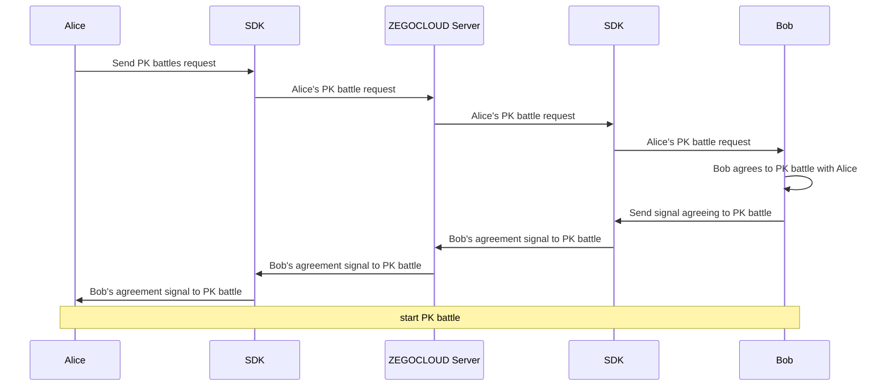

# Implement PK battles


PK battle is a friendly competition between two hosts, showcasing engaging interactions between the hosts for the audience to enjoy.

There are usually two ways to play:

1. **PK battles initiated by hosts through mutual agreement**: Hosts can send PK battle requests to the hosts they want to connect with after starting their own live streams. Once the PK battle request is accepted, both hosts will be connected. Our demo belongs to this type.
2. **PK battles coordinated by the business server**: After the hosts sign up for PK matching, the business server will coordinate the hosts to start the PK battle. The hosts will be connected to each other automatically.

This doc will introduce how to implement the PK battles in the live streaming scenario. 

## Prerequisites

Before you begin, make sure you complete the following:

- Complete SDK integration by referring to **Quick Start** doc.
- Download the [demo](https://github.com/ZEGOCLOUD/zegocloud_sdk_demo_android/tree/master/best_practice) that comes with this doc.
- Please contact technical support to activate the **Stream Mixing** service.
- Activate the **In-app Chat** service.


## Preview the effect

You can achieve the following effect with the [demo](https://github.com/ZEGOCLOUD/zegocloud_sdk_demo_android/tree/master/best_practice
) provided in this doc: 


|Homepage|Livestream page|Receive PK battle request|PK battle|
|--- | --- | --- |--- |
|||||


## Understand the tech

Below is the structure and outline of the content in this doc:


1. [How to send PK battle invitations](#how-to-send-pk-battle-invitations): Explaining the process of utilizing [call invitation (signaling)](/zim-ios/guides/call-invitation-signaling) to send PK invitations.
2. [Stream publishing & playing for PK](#stream-publishing--playing-for-pk): Presenting the framework of the stream publishing & playing solution for PK battles, based on the concept of streams.
3. [Start PK battle - Host logic](#start-pk-battle---host-logic): Providing detailed information about the solution for hosts, including how to interact with other hosts, enable mixed streaming for the audience, and notify the audience when the PK battle starts.
4. [Start PK battle - Audience logic](#start-pk-battle---audience-logic): Explaining the solution details for the audience, including how to watch the interactions between hosts and handle single-stream scenarios.
5. [End PK battle && Quit PK battle](#end-pk-battle--quit-pk-battle): Describing the steps to end a PK session and restore normal single-host live streaming. 
6. [How to detect abnormal situations in a PK battle](#how-to-detect-abnormal-situations-in-a-pk-battle): Including the use of SEI to detect the status of host devices and streaming, handling exceptions such as client disconnections or crashes.
7. [Other features](#other-features): Explains how to detect abnormal situations of PK host through SEI.
8. [FAQs](#faqs): Addressing common questions related to PK battles, such as rendering host sound waves or temporarily muting the other host.


## How to send PK battle invitations

<Note title="Note">

If you are planning to implement the "PK battles coordinated by the business server", ignore this section.

Additionally, if your server does not have a signaling channel to send notifications to the client, we recommend using the `Command message (signaling message)` of the ZIM server API [Send in-room messages](#14007) to achieve this.

</Note>

A similar approach to call invitation is used here to implement PK battle invitations:

Based on the [call invitation (signaling)](/zim-android/guides/call-invitation-signaling) feature provided by the In-app Chat (referred to as ZIM SDK), which provides the capability of call invitation, allowing you to send, cancel, accept, and reject an invitation, you can achieve PK battle invitations, room invitations, and similar functions - you can use the `extendedData` field provided by [ZIMCallInviteConfig](https://docs.zegocloud.com/article/api?doc=zim_API~java_android~struct~ZIMCallInviteConfig), which allows you to customize the type of this invitation, thus achieving different functions.

For example, you can encode the business agreement into JSON and attach it to the `extendedData`:

```json
{
    "room_id": "Room10001",
    "user_name": "Alice",
    "type": "start_pkbattles" // or "video_call" , "voice_call"
}
```

In this way, the receiving user can judge and execute different business logic based on the `type` field after receiving the invitation.


The process of implementing call invitation based on this is as follows: (taking "Alice invites Bob to a PK battle, Bob accepts and connects the PK battle" as an example)




For the specific usage of these interfaces, please refer to [Call invitation (signaling)](/zim-android/guides/call-invitation-signaling).


1. When using this interface to implement PK battle invitations, it is important to note that in the `extendedData` field of the invitation interface, both parties' information needs to be passed:
    A **When initiating a PK battle invitation**, in addition to the mentioned `type`, it is also necessary to pass one's own `roomID` and `userName` to the other party - so that the other party knows the relevant information to start the PK battle logic.
    B **When accepting a PK battle invitation**, similarly, in addition to the `type`, one's own `roomID` and `userName` need to be passed.


2. When inviting for the first time, please call `callInvite` and set it to advanced mode. In this mode, you need to use `callEnd` or `callQuit` to end or quit the PK battle. And you can continue to invite others to join the PK by using `callingInvite`.

```java
/** Send call invitation to users - Advanced mode */
// Send call invitation
List<String> invitees;  // List of invitees
invitees.add("421234");       // ID of the invitee
ZIMCallInviteConfig config = new ZIMCallInviteConfig(); 
config.timeout = 200; // Timeout for invitation in seconds, range 1-600
// mode represents the call invitation mode, ADVANCED represents setting to advanced mode.
config.mode = ADVANCED;

zim.callInvite(invitees, config, new ZIMCallInvitationSentCallback() {
    @Override
    public void onCallInvitationSent(String callID, ZIMCallInvitationSentInfo info, ZIMError errorInfo) {
        // The callID here is generated by the SDK internally to uniquely identify 
        a call invitation after the user initiates a call; 
        // later, when the initiator cancels the call, or the invitee accepts/rejects the call, this callID will be used.
    }
 });
```


For more details on these two aspects, refer to the following sections.


## Stream publishing & playing for PK

Before starting, please make sure you are familiar with the following concepts：

<Accordion title="What is Room/Stream & Stream-Mixing?" defaultOpen="false">

1. What is Room and Stream ?

<Video src="https://www.youtube.com/embed/jV68Rd5RhUc"/>

- ZEGO Express SDK: the real-time Audio and Video Call SDK provided by ZEGOCLOUD. It can help you provide audio and video services that feature convenient access, high-definition and fluency, cross-platform communication, low latency, and high concurrency.
- Stream publishing: the process of publishing the audio and video data streams that are captured and packaged to ZEGOCLOUD real-time audio and video cloud.
- Stream playing: the process of receiving and playing audio and video data streams from ZEGOCLOUD real-time audio and video cloud.
- Room: the service provided by ZEGOCLOUD for organizing user groups and allowing users in the same room to receive and send real-time audio, video, and messages to each other.
     1. Users can publish or play streams only after logging in to a room.
     2. Users can receive notifications about changes (such as users joining or leaving a room, and audio and video stream changes) in the room where they are in.


2. What is Stream-Mixing?

<Video src="https://www.youtube.com/embed/8YJ3kkFQIG0"/>

Through the stream-mixing service, multiple published media streams can compose a single stream , which allows audiences to play just one stream to improve quality and reduce performance cost.

For more details, refer to [stream mixing](/live-streaming-server/api-reference/stream-mixing/start-mix)

</Accordion>

The PK Battles solution requires the use of [stream mixing](/live-streaming-server/api-reference/stream-mixing/start-mix): stream mixing refers to combining multiple streams into one, so that audiences only need to play this stream to watch the footage of multiple hosts. The necessity and significant advantages of using stream mixing are as follows:

   - Necessity: It ensures relatively real-time synchronization of audio and video when audiences watch multiple hosts, avoiding issues where two hosts have inconsistent delays, resulting in a poor interactive experience.
   - Advantages: The client does not need to decode and play multiple streams, which can save bandwidth on the audience's side and prevent overheating on low-end devices, further enhancing the viewing experience for audiences.


Before the PK battle starts, each host will publish a stream, and the audience can directly play the stream of the host. However, after the PK battle starts, the method of playing the stream will change:

1. In addition to publishing their own stream, each host also needs to play the stream of the other host: to achieve real-time audio and video interaction between hosts.
2. The audience temporarily mutes the single stream of the host: using mute can save bandwidth and quickly restore the single stream image of the host after the PK ends.
3. Start mixing the streams of the two hosts together: client or server can be used to manage the mixing, which will be explained in detail later.
4. The audience plays the mixed stream: to watch the interaction between the two hosts.


The above is the basic framework of stream publishing & playing in the PK scenario. In the following sections, we will provide a detailed explanation of this solution based on the logic of the hosts and the audience.


## Start PK battle - Host logic

When the host is ready to start the PK battle, the following operations need to be performed:


### 1. Play the single stream of the each host

Generally, the stream ID is related to the room ID and user ID. For example, in the accompanying demo of this doc, the stream ID rule is `"${roomID}_${userID}_main_host"`. Therefore, you can concatenate each host's stream ID using this rule and then call `startPlayingStream` to play the stream of the opponent. The information of both sides can be obtained from the callback of the invitation interface and the `extendedData` passed between both sides.

> If your PK battle is scheduled and matched by the server and the start PK signal is sent down by the server, you need to include the `userID`, `roomID`, `userName`, and other information of the opponent host when sending the PK start notification to the host on the server side.


### 2. Start the stream mixing task

Stream mixing can be initiated by the client or the server, and you can choose accordingly:

- Initiating stream mixing from the client side has a simpler architecture, but it requires handling client-side issues such as complex network environments and possible abnormal app exits (which will be explained later).
- On the other hand, if stream mixing is initiated from the server side, it is less affected by client-side abnormal situations. However, the interaction between the client and the server is more complex and requires a certain level of server-side development capability.

The accompanying demo of this doc uses the **"Manual stream mixing initiated by the host client"** approach.


#### 2.1 Initiating stream mixing from the client

There are some details to note about the stream mixing parameters:

- **Stream mixing layout**: Usually, during a PK battle, each audience member sees the host of their own room on the left side. Therefore, after the PK starts, stream mixing tasks need to be initiated - that is, each host in each room needs to initiate a stream mixing task. When mixing the streams, each host needs to place their own video on the left side of the stream mixing layout. The `layout` parameter can be referred to in the following code or you can refer to the [Mix the live streams](/live-streaming-server/api-reference/stream-mixing/start-mix) doc for more details on stream mixing layouts.

- **Stream mixing resolution**: Taking the default 540p resolution of the host as an example, each single stream has a resolution of `width=540, height=960`. After combining the two streams side by side, the resolution of the mixed stream should be `width=540*2, height=960`. If you want to lower the resolution of the mixed stream, you can maintain this aspect ratio and reduce the stream mixing resolution, for example, using a `540*480` resolution with `width=540*2/2, height=960/2`. Note that if you need to lower the stream mixing resolution, you also need to make corresponding adjustments to the `layout` parameter. Our demo uses a mixed stream resolution of `width=810 and height=720`.

- **Stream mixing task ID and stream ID**: Usually, each stream mixing task has only one output stream, and the same applies to the PK battle scenario. Therefore, you can use the same ID for both the stream mixing task ID and the stream ID, such as `'${roomID}__mix'`. This makes it easier to manage the stream mixing tasks in the future.

Here is an example code snippet with the complete stream mixing parameters:


```java

public static final int MIX_VIDEO_WIDTH = 720;
public static final int MIX_VIDEO_HEIGHT = 810;
public static final int MIX_VIDEO_BITRATE = 1500;
public static final int MIX_VIDEO_FPS = 15;

private void updatePKMixTask(IZegoMixerStartCallback callback) {
    if (pkBattleInfo != null) {
        List<String> pkUserStreamList = new ArrayList<>();
        for (PKUser pkUser : pkBattleInfo.pkUserList) {
            if (pkUser.getCallUserState() == ZIMCallUserState.ACCEPTED) {
                pkUserStreamList.add(pkUser.getPKUserStream());
            }
        }

        ZegoMixerVideoConfig videoConfig = new ZegoMixerVideoConfig();
        videoConfig.width = MIX_VIDEO_WIDTH;
        videoConfig.height = MIX_VIDEO_HEIGHT;
        videoConfig.bitrate = MIX_VIDEO_BITRATE;
        videoConfig.fps = MIX_VIDEO_FPS;

        MixLayoutProvider mixLayoutProvider = ZEGOLiveStreamingManager.getInstance().getMixLayoutProvider();
        ArrayList<ZegoMixerInput> mixVideoInputs;
        if (mixLayoutProvider == null) {
            mixVideoInputs = getMixVideoInputs(pkUserStreamList, videoConfig);
        } else {
            mixVideoInputs = mixLayoutProvider.getMixVideoInputs(pkUserStreamList, videoConfig);
        }

        if (task == null) {
            String mixStreamID = ZEGOSDKManager.getInstance().expressService.getCurrentRoomID() + "_mix";

            task = new ZegoMixerTask(mixStreamID);
            task.videoConfig = videoConfig;

            task.setInputList(mixVideoInputs);

            ZegoMixerOutput mixerOutput = new ZegoMixerOutput(mixStreamID);
            ArrayList<ZegoMixerOutput> mixerOutputList = new ArrayList<>();
            mixerOutputList.add(mixerOutput);
            task.setOutputList(mixerOutputList);

            task.enableSoundLevel(true);
        } else {
            task.inputList = mixVideoInputs;
        }

        ZEGOSDKManager.getInstance().expressService.startMixerTask(task, new IZegoMixerStartCallback() {
            @Override
            public void onMixerStartResult(int errorCode, JSONObject data) {
                // 1005026 non_exists_stream_list
                if (errorCode == 0) {
                    updatePKRoomAttributes();
                }
                if (callback != null) {
                    callback.onMixerStartResult(errorCode, data);
                }

            }
        });
    }
}
```

In the client-initiated stream mixing approach, it is important to check the error code returned when calling the stream mixing interface at this step. If the error code is not 0, it means that the stream mixing has failed. In this case, appropriate actions should be taken on the client-side, such as retrying the stream mixing task, to ensure the normal progress of the PK battle.

#### 2.2 customize the mix steam layout

If you want to set the layout for mixing the streams, you can customize the layout by using the `setInputList` method of `ZegoMixerTask`. Here we show some simple setting rules. 

For example, if you have two people, you can set the layout to have each person occupying half of the screen. You can set it like this:

```java
private ArrayList<ZegoMixerInput> getMixVideoInputs(List<String> streamList, ZegoMixerVideoConfig videoConfig) {
    ArrayList<ZegoMixerInput> inputList = new ArrayList<>();
    if (streamList.size() == 2) {
        for (int i = 0; i < streamList.size(); i++) {
            int left = (videoConfig.width / streamList.size()) * i;
            int top = 0;
            int right = (videoConfig.width / streamList.size()) * (i + 1);
            int bottom = videoConfig.height;
            ZegoMixerInput input = new ZegoMixerInput(streamList.get(i), ZegoMixerInputContentType.VIDEO,
                new Rect(left, top, right, bottom));
            input.renderMode = ZegoMixRenderMode.FILL;
            inputList.add(input);
        }
    } else {
        //...
    }

    return inputList;
}
```

If you have more than two people, you can set up the layout as you wish. You can set it up like this:

```java
private ArrayList<ZegoMixerInput> getMixVideoInputs(List<String> streamList, ZegoMixerVideoConfig videoConfig) {
    ArrayList<ZegoMixerInput> inputList = new ArrayList<>();
    //...
    if (streamList.size() == 2) {
        for (int i = 0; i < streamList.size(); i++) {
            int left = (videoConfig.width / streamList.size()) * i;
            int top = 0;
            int right = (videoConfig.width / streamList.size()) * (i + 1);
            int bottom = videoConfig.height;
            ZegoMixerInput input = new ZegoMixerInput(streamList.get(i), ZegoMixerInputContentType.VIDEO,
                new Rect(left, top, right, bottom));
            input.renderMode = ZegoMixRenderMode.FILL;
            inputList.add(input);
        }
    } else if (streamList.size() == 3) {
        for (int i = 0; i < streamList.size(); i++) {
            int left, top, right, bottom;
            if (i == 0) {
                left = 0;
                top = 0;
                right = videoConfig.width / 2;
                bottom = videoConfig.height;
            } else if (i == 1) {
                left = videoConfig.width / 2;
                top = 0;
                right = left + videoConfig.width / 2;
                bottom = top + videoConfig.height / 2;
            } else {
                left = videoConfig.width / 2;
                top = videoConfig.height / 2;
                right = left + videoConfig.width / 2;
                bottom = top + videoConfig.height / 2;
            }
            ZegoMixerInput input = new ZegoMixerInput(streamList.get(i), ZegoMixerInputContentType.VIDEO,
                new Rect(left, top, right, bottom));
            input.renderMode = ZegoMixRenderMode.FILL;
            inputList.add(input);
        }
    } else if (streamList.size() == 4 || streamList.size() == 6) {
        int row = 2;
        int maxCellCount = streamList.size() % 2 == 0 ? streamList.size() : (streamList.size() + 1);
        int column = maxCellCount / row;
        int cellWidth = videoConfig.width / column;
        int cellHeight = videoConfig.height / row;
        int left, top, right, bottom;
        for (int i = 0; i < streamList.size(); i++) {
            left = cellWidth * (i % column);
            top = cellHeight * (i < column ? 0 : 1);
            right = left + cellWidth;
            bottom = top + cellHeight;
            ZegoMixerInput input = new ZegoMixerInput(streamList.get(i), ZegoMixerInputContentType.VIDEO,
                new Rect(left, top, right, bottom));
            input.renderMode = ZegoMixRenderMode.FILL;
            inputList.add(input);
        }
    } else if (streamList.size() == 5) {
        for (int i = 0; i < streamList.size(); i++) {
            int left, top, right, bottom;
            if (i == 0) {
                left = 0;
                top = 0;
                right = videoConfig.width / 2;
                bottom = videoConfig.height / 2;
            } else if (i == 1) {
                left = videoConfig.width / 2;
                top = 0;
                right = left + videoConfig.width / 2;
                bottom = top + videoConfig.height / 2;
            } else if (i == 2) {
                left = 0;
                top = videoConfig.height / 2;
                right = left + videoConfig.width / 3;
                bottom = top + videoConfig.height / 2;
            } else if (i == 3) {
                left = videoConfig.width / 3;
                top = videoConfig.height / 2;
                right = left + videoConfig.width / 3;
                bottom = top + videoConfig.height / 2;
            } else {
                left = (videoConfig.width / 3) * 2;
                top = videoConfig.height / 2;
                right = left + videoConfig.width / 3;
                bottom = top + videoConfig.height / 2;
            }
            ZegoMixerInput input = new ZegoMixerInput(streamList.get(i), ZegoMixerInputContentType.VIDEO,
                new Rect(left, top, right, bottom));
            input.renderMode = ZegoMixRenderMode.FILL;
            inputList.add(input);
        }
    } else {
        int row = 3;
        int column = 3;
        int cellWidth = videoConfig.width / column;
        int cellHeight = videoConfig.height / row;
        int left, top, right, bottom;
        for (int i = 0; i < streamList.size(); i++) {
            left = cellWidth * (i % column);
            top = cellHeight * (i < column ? 0 : 1);
            right = left + cellWidth;
            bottom = top + cellHeight;
            ZegoMixerInput input = new ZegoMixerInput(streamList.get(i), ZegoMixerInputContentType.VIDEO,
                new Rect(left, top, right, bottom));
            input.renderMode = ZegoMixRenderMode.FILL;
            inputList.add(input);
        }
    }

    return inputList;
}
```

So the demo has implemented the default layout for mixing streams: when there are 2 people in a PK, it is a side-by-side layout. When there are more than 2 people, the screen will be divided into two or three rows.


If you need a more complex custom layout, please refer to [this complete document on mixing layouts](!Low_Latency_Live-Other_Functions/Stream_Mixing) to understand the way of mixing layouts and use the `ZEGOLiveStreamingManager.setMixLayoutProvider()` in the Demo to modify the layout:

```java
ZEGOLiveStreamingManager.getInstance().setMixLayoutProvider(new MixLayoutProvider() {
    @Override
    public ArrayList<ZegoMixerInput> getMixVideoInputs(List<String> streamList,
        ZegoMixerVideoConfig videoConfig) {
        ArrayList<ZegoMixerInput> inputList = new ArrayList<>();
        // ... your logic
        return inputList;
    }
});
```

#### 2.3 Initiating stream mixing from the server


If you want to manage stream mixing from the server, you need to start these two stream mixing tasks on the server side when the PK battle begins. Refer to the above instructions for setting the stream mixing parameters when initiating from the client.

For details on how to manage stream mixing tasks from the server side, refer to the server-side API:


- Start stream mixing: [Start stream mixing](/live-streaming-server/api-reference/stream-mixing/start-mix), [Callback on stream mixing started](/live-streaming-server/callback/stream-mixing/started)

- Stop stream mixing: [Stop stream mixing](/live-streaming-server/api-reference/stream-mixing/stop-mix), [Callback on stream mixing stopped](/live-streaming-server/callback/stream-mixing/stopped)


<Note title="Note">

- In the server-initiated stream mixing approach, the server needs to use [Callback on logged out room](/live-streaming-server/callback/room/logged-out) to monitor the client status of the host. If the server detects that the host has exited abnormally, it needs to promptly stop the corresponding stream mixing task and send a notification to the host to end the PK battle.

- If your server does not have a signaling channel to send notifications to the client, we recommend using the `Command message (signaling message)` in the [Send in-room messages](/zim-server/messaging/send-room-messages) server-side API of ZIM to achieve this.

</Note>


### 3. Notifying the audience of the start of PK battle


When the PK battle starts, it is necessary to notify the audience that the PK battle has begun. After receiving the notification, the audience can handle the logic of watching the PK. How to notify the audience? We recommend using the [room attribute](/zim-server/messaging/room-properties) feature of the ZIM SDK to achieve this.

<Accordion title="If you haven't used this feature before, you can click here to see an introduction" defaultOpen="false">

This feature allows app clients to set and synchronize custom room attributes in the room. Room attributes are stored on the ZEGOCLOUD server in a Key-Value manner, and the ZEGOCLOUD server handles write conflict arbitration and other issues to ensure data consistency.

At the same time, modifications made by app clients to room attributes are synchronized to all other audiences in the room in real-time through the ZEGOCLOUD server.


> Each room allows a maximum of 20 attributes to be set, with a `key` length limit of 16 bytes and a `value` length limit of 1024 bytes.

</Accordion>

When the PK starts, the host needs to call [setRoomAttributes](/zim-android/client-sdks/api-reference/class#setroomattributes-zim-class) to set the additional attributes of the room, indicating that the room has entered the PK state. It is recommended to include the following information in the room's additional attributes:

1. `host_user_id`: The userID of the host of this room.
2. `request_id`: The requestID of this PK.
3. `pk_users`: Participating anchors in PK.

When setting the room attributes, make sure to set the `isDeleteAfterOwnerLeft` parameter to `false`. This is to prevent the room's additional attributes from being deleted when the host exits the room abnormally, which would cause the PK battle to be unable to be resumed.


Example code snippet for generating room attributes:

```java
    private void updatePKRoomAttributes() {
        HashMap<String, String> hashMap = new HashMap<>();

        if (ZEGOLiveStreamingManager.getInstance().getHostUser() != null) {
            hashMap.put("host_user_id", ZEGOLiveStreamingManager.getInstance().getHostUser().userID);
        }

        hashMap.put("request_id", pkBattleInfo.requestID);

        List<PKUser> acceptedUsers = new ArrayList<>();
        for (PKUser pkUser : pkBattleInfo.pkUserList) {
            if (pkUser.hasAccepted()) {
                acceptedUsers.add(pkUser);
            }
        }
        for (PKUser pkUser : acceptedUsers) {
            for (ZegoMixerInput zegoMixerInput : task.inputList) {
                if (Objects.equals(pkUser.getPKUserStream(), zegoMixerInput.streamID)) {
                    pkUser.rect = zegoMixerInput.layout;
                }
            }
        }
        hashMap.put("pk_users", acceptedUsers.toString());

        ZIMRoomAttributesSetConfig config = new ZIMRoomAttributesSetConfig();
        config.isDeleteAfterOwnerLeft = false;
        ZEGOSDKManager.getInstance().zimService.setRoomAttributes(hashMap, config,
            new ZIMRoomAttributesOperatedCallback() {
                @Override
                public void onRoomAttributesOperated(String roomID, ArrayList<String> errorKeys, ZIMError errorInfo) {

                }
            });
    }
```


After the settings are completed, the audience will receive the [onRoomAttributesUpdated](/zim-android/client-sdks/api-reference/class#onroomattributesupdated) callback. Now let's explain the logic on the audience side.


## Start PK battle - Audience logic


After receiving the [onRoomAttributesUpdated](/zim-android/client-sdks/api-reference/class#onroomattributesupdated)  callback, if the audience finds that there are newly added fields related to PK battle, they can start processing the logic of watching PK.


### 1. Audience needs to play the mixed stream according to the stream ID rule


> In the accompanying demo of this doc, the stream ID rule for mixing streams is `${currentRoomID}__mix`. It is recommended that you also design and use this kind of rule related to the room ID.

The method for playing normal streams and mixed streams is the same. The audience can call `startPlayingStream` to start playing the mixed stream.


There are two details that need to be handled:
1. It is necessary to listen for the [onPlayerStateUpdate](@onPlayerStateUpdate) callback to determine whether the stream playing is successful. If playing the mixed stream fails, the user needs to be prompted with a loading message and corresponding retry logic should be implemented.
2. Since it takes some time to generate the mixed stream, the audience may not be able to play the mixed stream immediately. In order to optimize the user experience and avoid black screens, after playing the mixed stream, it is necessary to listen for the [onPlayerRecvVideoFirstFrame](@onPlayerRecvVideoFirstFrame) and [onPlayerRecvAudioFirstFrame](@onPlayerRecvAudioFirstFrame) callbacks. After receiving either of these callbacks, the mixed stream can be rendered. This can avoid black screens.


### 2. During PK, the audience needs to mute the single stream of the host

Once the audience successfully plays the mixed stream, they can start watching the PK battle. Since the mixed stream already contains the audio and video of both hosts, the audience doesn't need to render the single stream of the host during the PK.


Therefore, the audience can use [mutePlayStreamAudio](@mutePlayStreamAudio) and [mutePlayStreamVideo](@mutePlayStreamVideo) to temporarily stop playing the audio and video of the host's single stream. This can further reduce costs and avoid unnecessary traffic consumption and performance loss on the audience's devices.

> It is not recommended to use [stopPlayingStream](@stopPlayingStream) to stop playing the single stream of the host at this time. If this is done, the audience will need to re-play the stream after the PK ends, and the speed of stream switching will be much slower compared to using `mute`. This will result in a poor user experience.

## End PK battle && Quit PK battle

In the demo, the host can manually click the end button to terminate the PK battle.


When the host clicks the end button, they also need to notify the other host that the PK has ended. This can be achieved by `endPKBattle` method in `ZEGOLivesSreamingManager`.When the other host receives this notification, they also need to handle the logic for ending the PK. The difference between `quitPKBattle` and `endPKBattle` is that the former only allows the player to quit the PK, while the latter will make everyone stop PK.
The following operations need to be performed to end the PK battle:


**Host:**

1. Stop playing the single stream of the other host.
2. End the mixed stream task.
3. Remove the PK-related attributes from the [room attribute](/zim-server/messaging/room-properties).
4. Adjust the UI to return to the state of a single host's live stream.

**Audience:**


When the audience receives the callback [onRoomAttributesUpdated](/zim-android/client-sdks/api-reference/class#onroomattributesupdated) indicating that the PK-related attributes have been removed, they can start handling the following logic:

1. Call [stopPlayingStream](@stopPlayingStream) to stop playing the mixed stream and return to the state of a single host's live stream.
2. Since the audience muted the single stream of the host when the PK started, you need to call [mutePlayStreamAudio](@mutePlayStreamAudio) and [mutePlayStreamVideo](@mutePlayStreamVideo) again to unmute.
3. Adjust the UI to return to the state of a single host's live stream.

## How to detect abnormal situations in a PK battle

By leveraging the periodic sending of SEI messages, it can be treated as a "heartbeat" between clients, and the heartbeat can be used to detect abnormal situations in a PK. Specifically, when SEI messages from the host are not received for a certain period of time, it can be assumed that the host is experiencing an abnormal situation. The logic is as follows:


- After starting the PK, record the start time of the PK and start a 2-second timer (you can adjust the detection interval as needed).
- When receiving SEI messages, record the last time when each host sent an SEI message.
- Each time the timer triggers, check the last received time of the SEI message. If the time difference between the last received time and the current time is greater than a certain duration, such as 5 seconds, it is considered that the host's live streaming is abnormal.

When an abnormality is detected in a host, the demo will render a "host reconnecting" prompt on the host's video screen.

See [PKBattleView.java](https://github.com/ZEGOCLOUD/zegocloud_sdk_demo_android/blob/master/best_practice/app/src/main/java/com/zegocloud/demo/bestpractice/components/cohost/PKBattleView.java)

```java
public void onTimeOut(boolean timeout) {
    if (timeout) {
        connectTipsView.setVisibility(VISIBLE);
    } else {
        connectTipsView.setVisibility(GONE);
    }
}
```

In addition, you also need to define a maximum timeout period. For example, in the Demo, if a PK host has no SEI for more than 60 seconds, all users participating in the PK will remove that exceptional host from the PK.

```java
ZEGOLiveStreamingManager.getInstance().addLiveStreamingListener(new LiveStreamingListener() {
    // ...
    @Override
    public void onPKUserConnecting(String userID, long duration) {
        if (duration >= 60_000) {
            ZEGOSDKUser currentUser = ZEGOSDKManager.getInstance().expressService.getCurrentUser();
            if (!Objects.equals(currentUser.userID, userID)) {
                ZEGOLiveStreamingManager.getInstance().removeUserFromPKBattle(userID);
            } else {
                ZEGOLiveStreamingManager.getInstance().quitPKBattle();
            }
        }
    }
});
```

## Other features

### How to achieve server-side matching.
If you want to challenge a random host to PK, you may need to use the server for matchmaking. For example, the client can send a request to the server, and the server will respond with the user ID of the target host. After receiving this user ID, the client can call the `startPKBattle` function to send an automatic PK request to the target host using this user ID. When using this interface, the host receiving the PK request will automatically agree to start the PK by default.

### How to get the device status of the host

Depending on the specific streaming scenario, different methods are used to obtain the device status.


**Scenario 1: During PK, how do hosts obtain the device status of each other?**

In this scenario, where hosts are streaming and interacting with each other in real-time, you can use [onRemoteCameraStateUpdate](@onRemoteCameraStateUpdate) and [onRemoteMicStateUpdate](@onRemoteMicStateUpdate) to obtain the camera and microphone status of the other host.

It is important to note that this feature needs to be enabled by calling [setEngineConfig](@setEngineConfig) after calling [createEngine](@createEngine). Here is an example of the code:


```java
ZegoEngineConfig config = new ZegoEngineConfig();
config.advancedConfig.put("notify_remote_device_unknown_status", "true");
config.advancedConfig.put("notify_remote_device_init_status", "true");
ZegoExpressEngine.setEngineConfig(config);
```


**Scenario 2: Audience obtaining the device status of the host**

When playing the stream for `Live Streaming` or `Mixed Stream`, it is recommended to use the SEI (Supplemental Enhancement Information) solution to obtain the device status of the host. This includes the following two cases in the PK battle scenario:

1. In PK mode, the audience plays the mixed stream.
2. In non-PK mode, the audience plays the host's single stream.

In this case, the audience cannot receive the callbacks mentioned in "Scenario 1". Therefore, when the host is publishing the stream, they need to update their device status using [sendSEI](https://docs.zegocloud.com/article/api?doc=express_video_sdk_API~java_android~class~ZegoExpressEngine#send-sei), and the playing side will receive the callback [onPlayerRecvSEI](@onPlayerRecvSEI).


<Accordion title="What is SEI?" defaultOpen="false">

<Video src="https://www.youtube.com/embed/Co9IOul5PCw"/>

- For a detailed explanation of the SEI feature, refer to [Convey extra information using SEI](/real-time-video-android-java/communication/sei).

- Additional information about SEI and stream mixing: The mixing server will re-encode the SEI of all input streams into the output mixed stream. Therefore, the SEI information sent by the host can be received by the audience in both rooms and the other host.

</Accordion>


To send SEI, you need to create a timer to periodically send SEI messages. It is recommended to send them every 200ms. In the timer, regularly send the following information to synchronize device status:


```json
{
  "type": 0, // device_state
  "senderID": "myUserID", // Due to the mixing of SEI from multiple streams into the mixed stream, you need to add a senderID identifier in the SEI.
  "cam": false, // true:on, false:off
  "mic": true, // true:on, false:off
}
```

> You can refer to the [relevant code](https://github.com/ZEGOCLOUD/zegocloud_sdk_demo_android/blob/master/best_practice/app/src/main/java/com/zegocloud/demo/bestpractice/internal/ZEGOLiveStreamingManager.java) in the demo for the specific implementation of this part.


<Warning title="Warning">

**Resolution And Pricing Attention!**

Please pay close attention to the relationship between **video resolution and price** when implementing video call, live streaming, and other video scenarios.


**When playing multiple video streams in the same room, the billing will be based on the sum of the resolutions, and different resolutions will correspond to different billing tiers.**


The video streams that are included in the calculation of the final resolution are as follows:

1. Live streaming video view (such as host view, co-host view, PKBattle view, etc.)
2. Video call's video view for each person
3. Screen sharing view
4. Resolution of the cloud recording service
5. Resolution of the Live stream creation

Before your app goes live, please **make sure you have reviewed all configurations and confirmed the billing tiers** for your business scenario to avoid unnecessary losses. For more details, please refer to [Pricing](https://www.zegocloud.com/pricing).

</Warning>


## FAQs

<Accordion title="How to handle the co-hosting feature during a PK battle?" defaultOpen="false">


In most scenarios, co-hosting is not supported during a PK battle. Therefore, if you have implemented the co-hosting feature, you need to consider this:
Once the room enters the PK battle state, all client roles need to temporarily disable all co-hosting-related functionalities.

Here are some specific recommendations:


1. After the host starts the PK, reject all co-hosting requests.
2. If a co-host is currently in the process of co-hosting and receives a notification that the PK has started, automatically terminate the co-hosting session and display a pop-up message to the audience indicating that the room has started the PK and the co-hosting session has ended.
3. During the PK process, hide any entry points related to co-hosting.

</Accordion>


<Accordion title="How to render the sound level of the host?" defaultOpen="false">


However, when the audience plays the mixed stream, the approach is slightly different:

1. When starting the mixing task: set `enableSoundLevel` to `true` so that the mixed stream includes the sound level information of the input streams.
2. When starting the mixing task: assign a `soundLevelID` to each input stream to allow the playing side to determine whose sound level data it is.
3. The stream playing side can listen to [onMixerSoundLevelUpdate](@onMixerSoundLevelUpdate) to receive the sound level data. The `soundLevelID` can be used to determine whose sound level it belongs to.

</Accordion>


<Accordion title="How to temporarily mute the other host during a PK" defaultOpen="false">

During a PK, there may be a need to temporarily mute the audio of the other host. After muting, both the host and the audience in the room will not be able to hear the audio of the other host.


1. The host can mute the audio of the other host's stream using [mutePlayStreamAudio](@mutePlayStreamAudio).
2. To ensure that the audience in the room also cannot hear the audio of the other host, you can update the mixer task by calling [startMixerTask](@startMixerTask) again. Set the `contentType` of the other host's [input stream](https://docs.zegocloud.com/article/api?doc=express_video_sdk_API~java_android~class~ZegoMixerInput) to `ZegoMixerInputContentTypeVideoOnly` (There is no need to call `StopMixerTask`, just call `startMixerTask` directly).

</Accordion>


<Accordion title="How the business server can know the room status?" defaultOpen="false">

After the client successfully initiates the mixing of streams, the client can report to the business server that the room has entered the PK state.

</Accordion>


<Accordion title="Migration Guide: I have already integrated the Demo that only supports 1v1 PK version, how can I upgrade to the latest version?" defaultOpen="false">

You can use [git diff](https://github.com/ZEGOCLOUD/zegocloud_sdk_demo_android/compare/master..pk_1v1)  to view these changes and follow our documentation to check the changes item by item and add them to your project.


1. First, you need to upgrade the SDK version in build.gradle, please use the following or higher version of SDK.

    ```xml
    implementation 'im.zego:zim:2.12.0'
    implementation 'im.zego:express-video:3.10.0'
    ```

2. The `internal` of the demo has been fully upgraded to adapt to the multi-player PK function. This part has undergone significant changes. We recommend that you directly delete the old `internal` folder and copy the new `internal` to your project.

    <Warning title="Warning">

    - We do not recommend making any modifications to the `internal`.

    - However, if you have to modify the code in `internal` for some reason, after copying the new `internal` to your project, you need to apply the changes you made to the old `internal` to the new `internal` as well. This is an inevitable step.

    </Warning>


3. The `components` and `activity` of the demo, as well as the layout files in `res`, have also been upgraded to adapt to the multi-player PK. The changes in this part are relatively small:

    - New files can be directly copied to your project.

    - There are some changes in the old files, and you can refer to git diff to gradually upgrade.

After completing the upgrade, please do comprehensive testing on the new and old functions. If you encounter any suspected bugs during testing, please test our demo directly in the same way to identify whether it is a problem with the demo or an issue introduced by other reasons.

</Accordion>
