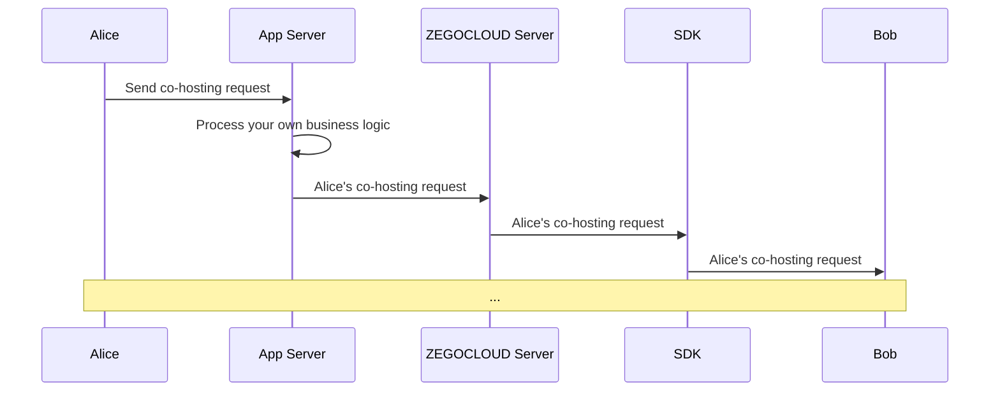

# Implement co-hosting

This doc will introduce how to implement the co-hosting feature in the live streaming scenario. 

## Prerequisites

Before you begin, make sure you complete the following:

- Complete SDK integration by referring to **Quick Start** doc.
- Download the [demo](https://github.com/ZEGOCLOUD/zegocloud_sdk_demo_ios/tree/master/best_practice) that comes with this doc.
- Activate the **In-app Chat** service.


## Preview the effect

You can achieve the following effect with the [demo](https://github.com/ZEGOCLOUD/zegocloud_sdk_demo_ios/tree/master/best_practice) provided in this doc: 


|Homepage|Live stream page|Receive co-hosting request|Start co-hosting|
|--- | --- | --- |--- |
|||||


## Understand the tech

### 1. What is signaling?

The process of co-hosting implemented based on signaling, signaling  is a protocol or message to manage communication and connections in networks. ZEGOCLOUD packages all signaling capabilities into a SDK, providing you with a readily available real-time signaling API.

<Video src="https://www.youtube.com/embed/pfnBmt9FST8"/>


### 2. How to send & receive signaling messages through the ZIM SDK interface

The ZIM SDK provides rich functionality for sending and receiving messages, see [Send & Receive messages (signaling)](/zim-ios/guides/send-and-receive-messages-signaling). And here, you will need to use the customizable signaling message: `ZIMCommandMessage`


> Complete demo code for this section can be found at [ZIMService.swift](https://github.com/ZEGOCLOUD/zegocloud_sdk_demo_ios/blob/master/best_practice/ZegoCloudSDKDemo/Internal/SDK/ZIM/ZIMService.swift).

(1) Send signals (`ZIMCommandMessage`) in the room by calling [sendMessage](/zim-ios/client-sdks/api-reference/protocol#sendmessagemessagetoconversationidconversationtypeconfignotificationcallback-zim-class) with the following:

```swift
let bytes = protocolStr.data(using: .utf8)!
let commandMessage = ZIMCommandMessage(message: bytes)
zim?.sendMessage(commandMessage, toConversationID: roomID, conversationType: .room, config: ZIMMessageSendConfig(), notification: nil, callback: { msg, error in
    
    // ...
    callback?(Int64(error.code.rawValue), error.message)
})
```

(2) After sending, other users in the room will receive the signal from the [receiveRoomMessage](/zim-ios/client-sdks/api-reference/protocol#zimreceiveroommessagefromroomid-zimeventhandler-class) callback. You can listen to this callback by following below:


```swift
extension ZIMService: ZIMEventHandler {
    // ...
    func zim(_ zim: ZIM, receiveRoomMessage messageList: [ZIMMessage], fromRoomID: String) {
        for message in messageList {
            if message.type == .command {
                let commandMessage = message as! ZIMCommandMessage
                let customSignalingJson = String(data: commandMessage.message, encoding: .utf8)!
                //...
             } else {
                 // ..
             }
         }
    }
    // ...
}
```


### 3. How to customize business signals

> Complete demo code for this section can be found at [ZIMService+RoomRequest.swift](https://github.com/ZEGOCLOUD/zegocloud_sdk_demo_ios/blob/master/best_practice/ZegoCloudSDKDemo/Internal/SDK/ZIM/ZIMService%2BRoomRequest.swift)

**JSON signal encoding**

Since a simple `String` itself is difficult to express complex information, signals can be encapsulated in `JSON` format, making it more convenient for you to organize the protocol content of the signals.

Taking the simplest JSON signal as an example: `{"room_request_type": 10000}`, in such a JSON signal, you can use the `room_request_type` field to express different signal types, such as:

- Sending a co-hosting request: `{"room_request_type": 10000}`
- Canceling a co-hosting request: `{"room_request_type": 10001}`
- Rejecting a co-hosting request: `{"room_request_type": 10002}`
- Accepting a co-hosting request: `{"room_request_type": 10003}`


In addition, you can also extend other common fields for signals, such as `senderID` and `receiverID`, such as:


```swift
extension ZIMService {
            
    func sendRoomRequest(_ receiverID: String, extendedData: String, callback: RoomRequestCallback?){
        // ...
    }
}

public class RoomRequest: NSObject, Codable {
    public var requestID : String
    public var actionType: RoomRequestAction
    public var senderID: String
    public var receiverID: String
    public var extendedData: String
    
    init(requestID: String = "", actionType: RoomRequestAction, senderID: String, receiverID: String, extendedData: String = "") {
        self.requestID = requestID
        self.actionType = actionType
        self.senderID = senderID
        self.receiverID = receiverID
        self.extendedData = extendedData
    }
    
    public func jsonString() -> String? {
        let jsonObject: [String: Any] = ["action_type" : actionType.rawValue, "sender_id": senderID, "receiver_id": receiverID, "request_id": requestID, "extended_data": extendedData]
        return jsonObject.jsonString
    }
}

```

**JSON signal decoding**

And users who receive signals can process specific business logic based on the fields in it, such as:


```swift
extension LiveStreamingViewController: ZIMServiceDelegate {
    func onInComingRoomRequestReceived(request: RoomRequest) {
        showReaDot()
    }
    
    func onInComingRoomRequestCancelled(request: RoomRequest) {
        showReaDot()
    }
    
    func onOutgoingRoomRequestAccepted(request: RoomRequest) {
        onReceiveAcceptCoHostApply()
    }
    
    func onOutgoingRoomRequestRejected(request: RoomRequest) {
        onReceiveRefuseCoHostApply()
    }
}
```

**Further extending signals**

Based on this pattern, when you need to do any protocol extensions in your business, you only need to extend the `type` field of the signal to easily implement new business logic, such as:

- Muting audience: After receiving the corresponding signal, the UI blocks the user from sending live bullet messages.
- Sending virtual gifts: After receiving the signal, show the gift special effects.
- Removing audience: After receiving the signal, prompt the audience that they have been removed and exit the room.


**Friendly reminder**: 
After reading the following text and further understanding the implementation of co-hosting signals, you will be able to easily extend your live streaming business signals.

<Note title="Note">

The demo in this document is a pure client API + ZEGOCLOUD solution. If you have your own business server and want to do more logical extensions, you can use our [Server API](#14007) to pass signals and combine your server's room business logic to increase the reliability of your app.


</Note>


## Implementation

### Integrate and start to use the ZIM SDK

If you have not used the ZIM SDK before, you can read the following section:

<Accordion title="Import the ZIM SDK" defaultOpen="false">

Integrate the SDK automatically with Swift Package Manager

1. Open Xcode and click "File > Add Packages..." in the menu bar, enter the following URL in the "Search or Enter Package URL" search box of the "Apple Swift Packages" pop-up window:

    ```markdown
    https://github.com/zegolibrary/zim-ios
    ```

2. Specify the SDK version you want to integrate in "Dependency Rule" (**Recommended**: use the default rule "Up to Next Major Version"), and then click "Add Package" to import the SDK. You can refer to [Apple Documentation](https://developer.apple.com/documentation/xcode/adding-package-dependencies-to-your-app) for more details.

</Accordion>

<Accordion title="Create and manage SDK instances" defaultOpen="false">

After successful integration, you can use the Zim SDK like this: 

```swift
import ZIM
```

Creating a ZIM instance is the very first step, an instance corresponds to a user logging in to the system as a client.
```swift
func initWithAppID(_ appID: UInt32, appSign: String?) {
    let zimConfig: ZIMAppConfig = ZIMAppConfig()
    zimConfig.appID = appID
    zimConfig.appSign = appSign
    self.zim = ZIM.shared()
    if self.zim == nil {
        self.zim = ZIM.create(with: zimConfig)
    }
    self.zim?.setEventHandler(self)
}
```

</Accordion>


Later on, we will provide you with detailed instructions on how to use the ZIM SDK to develop the co-hosting feature. 

### Manage multiple SDKs more easily

In most cases, you need to use multiple SDKs together. For example, in the live streaming scenario described in this doc, you need to use the `zim sdk` to implement the co-hosting feature, and then use the `zego_express_engine sdk` to implement the live streaming feature.

If your app has direct calls to SDKs everywhere, it can make the code difficult to manage and troubleshoot. To make your app code more organized, we recommend the following way to manage these SDKs:


<Accordion title="Create a wrapper layer for each SDK so that you can reuse the code to the greatest extent possible." defaultOpen="false">

Create a `ZIMService` class for the `zim sdk`, which manages the interaction with the SDK and stores the necessary data. Please refer to the complete code in [ZIMService.swift](https://github.com/ZEGOCLOUD/zegocloud_sdk_demo_ios/tree/master/best_practice/ZegoCloudSDKDemo/Internal/SDK/ZIM/ZIMService.swift).
```swift

class ZIMService: NSObject {
    
    // ...
    func initWithAppID(_ appID: UInt32, appSign: String?) {
        let zimConfig: ZIMAppConfig = ZIMAppConfig()
        zimConfig.appID = appID
        zimConfig.appSign = appSign ?? ""
        self.zim = ZIM.shared()
        if self.zim == nil {
            self.zim = ZIM.create(with: zimConfig)
        }
        self.zim?.setEventHandler(self)
    }
    // ...
}
```


Similarly, create an `ExpressService` class for the `zego_express_engine sdk`, which manages the interaction with the SDK and stores the necessary data. Please refer to the complete code in [ExpressService.swift](https://github.com/ZEGOCLOUD/zegocloud_sdk_demo_ios/tree/master/best_practice/ZegoCloudSDKDemo/Internal/SDK/Express/ExpressService.swift).

```swift

class ExpressService: NSObject {
    
    // ...
    public func initWithAppID(appID: UInt32, appSign: String) {
        let profile = ZegoEngineProfile()
        profile.appID = appID
        profile.appSign = appSign
        profile.scenario = .broadcast
        ZegoExpressEngine.createEngine(with: profile, eventHandler: self)
    }
    // ...
}
```

With the service, you can add methods to the service whenever you need to use any SDK interface.

E.g., easily add the connectUser method to the ZIMService when you need to implement login:


```swift
class ZIMService: NSObject {

    // ...
    func connectUser(userID: String, userName: String, token: String?, callback: CommonCallback?) {
        let user = ZIMUserInfo()
        user.userID = userID
        user.userName = userName
        userInfo = user
        zim?.login(with: user, token: token ?? "") { error in
            callback?(Int64(error.code.rawValue), error.message)
        }
    }
}
```

</Accordion>

<Accordion title="After completing the service encapsulation, you can further simplify the code by creating a ZEGOSDKManager to manage these services." defaultOpen="false">

As shown below. Please refer to the complete code in [ZegoSDKManager.swift](https://github.com/ZEGOCLOUD/zegocloud_sdk_demo_ios/tree/master/best_practice/ZegoCloudSDKDemo/Internal/ZegoSDKManager.swift).

```swift
class ZegoSDKManager: NSObject {
    
    static let shared = ZegoSDKManager()
    
    var expressService = ExpressService.shared
    var zimService = ZIMService.shared
    
    func initWithAppID(_ appID: UInt32, appSign: String) {
        expressService.initWithAppID(appID, appSign: appSign)
        zimService.initWithAppID(appID, appSign: appSign)
    }

}
```


In this way, you have implemented a singleton class that manages the SDK services you need. From now on, you can get an instance of this class anywhere in your project and use it to execute SDK-related logic, such as:


- When the app starts up: call `ZegoSDKManager.shared.initWithAppID(appID,appSign);` 
- When starting a livestream: call `ZegoSDKManager.shared.loginRoom(roomID,scenario,callback);`
- When ending a livestream: call `ZegoSDKManager.shared.logoutRoom();`


</Accordion>

Later, we will introduce how to add co-hosting feature based on this. 


### Send & Cancel a co-hosting request 

> The implementation of sending and canceling co-hosting requests is similar, with only the type of signal being different. Here, sending will be used as an example to explain the implementation of the demo.

In the Demo, a request co-host button has been placed in the lower right corner of the `LivePage` as seen from the **audience perspective**. When the button is clicked, the following actions will be executed.

1. Encode the JSON signal, where the `room_request_type` is defined as `applyCoHost` in the demo.


2. Call `sendRoomRequest` to send the signal. (`sendRoomRequest` simplifies the [`sendMessage`](https://docs.zegocloud.com/article/api?doc=zim_API~objectivec_ios~protocol~ZIM#send-message-message-to-conversation-id-conversation-type-config-notification-callback) interface of `ZIM SDK`.)
  - If the method call is successful: the applying status of the local end (i.e. the audience) will be switched to applying for co-hosting, and the `Request Co-host` button will switch to `Cancel CoHost`.
  - If the method call fails: an error message will be prompted. **In actual app development, you should use a more user-friendly UI to prompt the failure of the co-hosting application.**

```swift

@IBAction func coHostAction(_ sender: UIButton) {
        //...
        let requestType: RoomRequestType = sender.isSelected ? .applyCoHost : .cancelCoHostApply
        let commandDict: [String: AnyObject] = ["room_request_type": requestType.rawValue as AnyObject]
        if requestType == .applyCoHost {
            ZegoSDKManager.shared.zimService.sendRoomRequest(receiverID, extendedData: commandDict.jsonString) { code, message, messageID in
                //...
            }
        } else {
            let roomRequest: RoomRequest? = ZegoSDKManager.shared.zimService.roomRequestDict[mRoomRequest?.requestID ?? ""]
            guard let roomRequest = roomRequest else { return }
            ZegoSDKManager.shared.zimService.cancelRoomRequest(roomRequest) { code, message, messageID in
                //...
            }
        }
    }

```

3. Afterwards, the local end (audience end) will wait for the response from the host.
  - If the host rejects the co-host request: the applying status of the local end will be switched to not applying.
  - If the host accepts the co-host request: the co-hosting will start (see the co-hosting section for details on starting and ending co-hosting).


### Accept & Reject the co-hosting request 


1. In the demo, when the host receives a co-host request signal, a confirmation dialog box will pop up and wait for the host to choose to accept or reject.
2. After the host responds, a signal of acceptance or rejection will be sent. The related logic of sending signals will not be further described here.

The relevant code snippet is as follows, and the complete code can be found in [ApplyCoHostListViewController.swift](https://github.com/ZEGOCLOUD/zegocloud_sdk_demo_ios/tree/master/best_practice/ZegoCloudSDKDemo/ViewControllers/ApplyCoHostListViewController.swift)

<Accordion title="Code snippet" defaultOpen="false">


```swift
func onInComingRoomRequestReceived(request: RoomRequest) {
    tableView.reloadData()
}

func onInComingRoomRequestCancelled(request: RoomRequest) {
    tableView.reloadData()
}

func agreeCoHostApply(request: RoomRequest) {
    let roomRequest: RoomRequest? = ZegoSDKManager.shared.zimService.roomRequestDict[request.requestID]
    guard let roomRequest = roomRequest else { return }
    ZegoSDKManager.shared.zimService.acceptRoomRequest(roomRequest) { code, message, messageID in
        //...
        self.tableView.reloadData()
    }
}

func disAgreeCoHostApply(request: RoomRequest) {
    let roomRequest: RoomRequest? = ZegoSDKManager.shared.zimService.roomRequestDict[request.requestID]
    guard let roomRequest = roomRequest else { return }
    ZegoSDKManager.shared.zimService.rejectRoomRequest(roomRequest) { code, message, messageID in
        //...
        self.tableView.reloadData()
    }
}

```


</Accordion>

### Start & End co-hosting 


<Note title="Note">

The logic after starting co-hosting is the same as [Implementation](!Low_Latency_Live-LiveStreaming_Quickstart_new). If you are not familiar with how to publish and play streams and render them, refer to [Implementation](!Low_Latency_Live-LiveStreaming_Quickstart_new).
</Note>


When the audience receives the signal that the host agrees to co-host, they can become a co-host and start co-host live streaming by calling related methods of `zego_express_engine` for previewing and publishing streams.


<Accordion title="Key code" defaultOpen="false">

> Complete code can be found in [LiveStreamingViewController.swift](https://github.com/ZEGOCLOUD/zegocloud_sdk_demo_ios/tree/master/best_practice/ZegoCloudSDKDemo/ViewControllers/LiveStreamingViewController.swift) and [ExpressService+Stream.swift](https://github.com/ZEGOCLOUD/zegocloud_sdk_demo_ios/tree/master/best_practice/ZegoCloudSDKDemo/Internal/SDK/Express/ExpressService%2BStream.swift).

```swift
func addCoHost(_ streamID: String, _ userID: String, _ userName: String, isMySelf: Bool = false) {
    // ...    

    let videoView = VideoView()
    videoView.update(userID, userName)
    coHostVideoViews.append(videoView)
    if isMySelf {
        ZegoSDKManager.shared.expressService.startPublishingStream(liveManager.getCoHostMainStreamID())
        ZegoSDKManager.shared.expressService.startPreview(videoView.renderView,viewMode: .aspectFill)
    } else {
        ZegoSDKManager.shared.expressService.startPlayingStream(videoView.renderView, streamID: streamID)
    }

    // ...
}
```

</Accordion>


### End co-hosting 

After the audience ends co-hosting, they need to call relevant methods of `zego_express_engine` to stop previewing and publishing streams. The complete code can be found in the [endCoHostAction](https://github.com/ZEGOCLOUD/zegocloud_sdk_demo_ios/blob/master/best_practice/ZegoCloudSDKDemo/ViewControllers/LiveStreamingViewController.swift). And the key code is as follows: 

```swift
@IBAction func endCoHostAction(_ sender: UIButton) {
    let localUserID = ZegoSDKManager.shared.expressService.currentUser!.id
    ZegoSDKManager.shared.expressService.stopPublishLocalVideo()
    ZegoSDKManager.shared.expressService.stopPreview()
    coHostVideoViews.forEach( { $0.removeFromSuperview() } )
    coHostVideoViews = coHostVideoViews.filter({ $0.userID != localUserID })
    updateCoHostConstraints()
    coHostButton.isHidden = false
    endCoHostButton.isHidden = true
    
    flipButton.isHidden = true
    micButton.isHidden = true
    cameraButton.isHidden = true
    flipButtonConstraint.constant = 16;
}
```


<Warning title="Warning">

**Resolution And Pricing Attention!**

Please pay close attention to the relationship between **video resolution and price** when implementing video call, live streaming, and other video scenarios.


**When playing multiple video streams in the same room, the billing will be based on the sum of the resolutions, and different resolutions will correspond to different billing tiers.**


The video streams that are included in the calculation of the final resolution are as follows:

1. Live streaming video view (such as host view, co-host view, PKBattle view, etc.)
2. Video call's video view for each person
3. Screen sharing view
4. Resolution of the cloud recording service
5. Resolution of the Live stream creation

Before your app goes live, please **make sure you have reviewed all configurations and confirmed the billing tiers** for your business scenario to avoid unnecessary losses. For more details, please refer to [Pricing](https://www.zegocloud.com/pricing).

</Warning>

## Conclusion

Congratulations! Hereby you have completed the development of the co-hosting feature. 

If you have any suggestions or comments, feel free to share them with us via [Discord](https://discord.gg/EtNRATttyp). We value your feedback.
