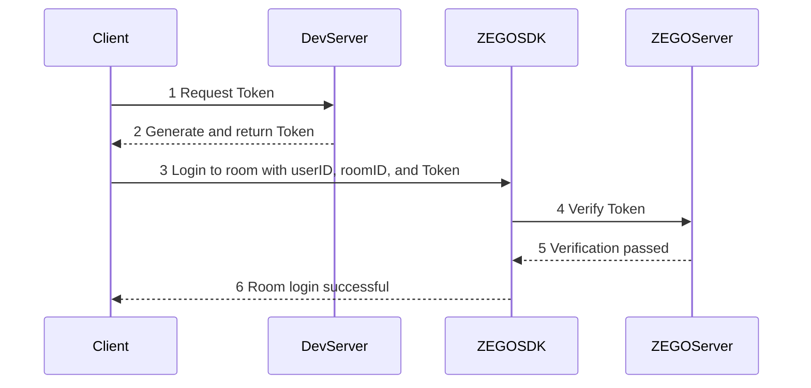
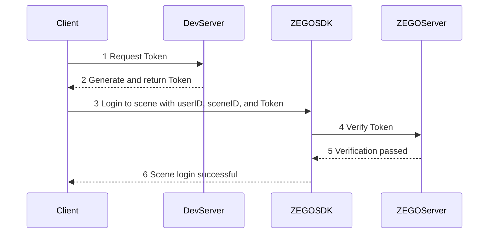

# Using Token Authentication

---

## Introduction

Authentication is the process of verifying whether a user has permission to access the system, to avoid security risks caused by missing or improper access control. ZEGO authenticates users through Token (including Basic Token and Privilege Token).


|Authentication Method|Description|Use Cases|
|-|-|-|
|[Basic Token](/real-time-video-android-java/communication/using-token-authentication)|Developers must include a Token parameter when logging into a room to verify user legitimacy.|Basic Token is the fundamental capability of Token, used for simple permission verification scenarios. In most cases, generating this Token is sufficient.|
|[Privilege Token](/real-time-video-android-java/communication/using-token-authentication)|To further improve security, Room ID and Stream ID privilege bits are exposed, allowing verification of the Room ID for login and Stream ID for publishing.|Common use cases for Room ID and Stream ID privilege bits include:<ul><li>Distinguishing between regular and premium rooms, requiring control over non-premium users entering premium rooms.</li><li>In voice chat rooms or live streaming shows, ensuring that publishing users match on-mic users to prevent "ghost mic" phenomenon, where users hear audio from someone not on-mic.</li><li>In speaking games like Werewolf, preventing the app from being cracked by hackers who could log in with other user IDs to the same room and access game information for cheating, affecting normal users' experience.</li></ul>|


## Prerequisites

<Warning title="Warning">
- Only ZEGO Express SDK version 2.17.0 and later supports Token authentication as described in this document.
- If you have integrated a ZEGO Express SDK version earlier than 2.17.0 (using AppSign authentication) and want to upgrade to version 2.17.0 with Token authentication, please refer to the [How to upgrade from AppSign authentication to Token authentication](/faq/express-token-upgrade) document for more information about AppSign and Token authentication.
</Warning>


## Process Overview

#### Scenario 1: Login Room Scenario

When using Token authentication, developers need to generate a Token first, then carry the Token to log in to a room. The ZEGO server verifies users with the Token.

The following describes the process using Token to determine whether a user can log in to a room:


{/*
<Frame width="512" height="auto" caption=""></Frame>
*/}

1. The client initiates a Token request.
2. The Token is generated on the developer's server and returned to the client.
3. The client carries the obtained Token along with userID and roomID to log in to the corresponding room.
4. The ZEGO SDK automatically sends the Token to the ZEGO server for verification.
5. The ZEGO server returns the verification result to the ZEGO SDK.
6. The ZEGO SDK returns the verification result directly to the client. Clients without permission will fail to log in.

#### Scenario 2: Login to a Large-Scale Audio/Video Range Scene

 <Accordion title="Generate Token and login to a large-scale audio/video range scene" defaultOpen="false">
When using Token authentication, developers need to generate a Token first, then carry the Token to log in to a scene. The ZEGO server verifies users with the Token.

The following describes the process using Token to determine whether a user can log in to a scene:


{/*
<Frame width="512" height="auto" caption=""></Frame>
*/}

1. The client initiates a Token request.
2. The Token is generated on the developer's server and returned to the client.
3. The client carries the obtained Token along with userID and sceneID to log in to the corresponding scene.
4. The ZEGO SDK automatically sends the Token to the ZEGO server for verification.
5. The ZEGO server returns the verification result to the ZEGO SDK.
6. The ZEGO SDK returns the verification result directly to the client. Clients without permission will fail to log in.
</Accordion>


## Generate and Use Token

This section describes in detail how developers can generate Tokens on the server, how to use Tokens, and how to handle Token expiration.

### 1 Get AppID and ServerSecret

To generate a Token, you need the unique identifier AppID and the ServerSecret of your project. Please obtain them from the "Project Information" section in [Console - Project Management](/console/project-info).

After obtaining the AppID and ServerSecret, developers can generate Tokens on their server according to their business needs. The client sends a Token request to the developer's server, and the developer's server generates the Token and returns it to the client.


### 2 Generate Token on the Server

import GenerateTemporaryToken from '/snippets/common/en/token/generate-temporary-token.mdx'

<GenerateTemporaryToken />

ZEGO provides an open-source zego_server_assistant plugin on GitHub/Gitee. Please use the "token04" version in the plugin to generate Tokens. The plugin supports Go, C++, Java, Objective-C, Python, PHP, .NET, and Node.js:

<table>
  <tbody><tr>
    <th rowspan="2">Language</th>
    <th rowspan="2">Supported version</th>
    <th rowspan="2">Core function</th>
    <th rowspan="2">Code base</th>
    <th colspan="2">Sample code</th>
  </tr>
  <tr>
    <th>User identity Token</th>
    <th>User privilege Token</th>
  </tr>
  <tr>
    <td>Go</td>
    <td>Go 1.14.15 or later</td>
    <td>GenerateToken04</td>
    <td><ul><li><a target="_blank" href="https://github.com/ZEGOCLOUD/zego_server_assistant/blob/master/token/go/src/token04">GitHub</a></li></ul></td>
    <td><ul><li><a target="_blank" href="https://github.com/ZEGOCLOUD/zego_server_assistant/blob/master/token/go/sample/sample.go">GitHub</a></li></ul></td>
    <td><ul><li><a target="_blank" href="https://github.com/ZEGOCLOUD/zego_server_assistant/blob/master/token/go/sample/sample-for-rtcroom.go">GitHub</a></li></ul></td>
  </tr>
  <tr>
    <td>C++</td>
    <td>C++ 11&nbsp; or later</td>
    <td>GenerateToken04</td>
    <td><ul><li><a target="_blank" href="https://github.com/ZEGOCLOUD/zego_server_assistant/blob/master/token/c%2B%2B">GitHub</a></li></ul></td>
    <td colspan="2"><ul><li><a target="_blank" href="https://github.com/ZEGOCLOUD/zego_server_assistant/blob/master/token/c%2B%2B/sample/demo/main.cc">GitHub</a></li></ul></td>
  </tr>
  <tr>
    <td>Java</td>
    <td>Java 1.8&nbsp; or later</td>
    <td>generateToken04</td>
    <td><ul><li><a target="_blank" href="https://github.com/ZEGOCLOUD/zego_server_assistant/blob/master/token/java/token04">GitHub</a></li></ul></td>
    <td><ul><li><a target="_blank" href="https://github.com/ZEGOCLOUD/zego_server_assistant/blob/master/token/java/token04/src/im/zego/serverassistant/sample/Token04SampleBase.java">GitHub</a></li></ul></td>
    <td><ul><li><a target="_blank" href="https://github.com/ZEGOCLOUD/zego_server_assistant/blob/master/token/java/token04/src/im/zego/serverassistant/sample/Token04SampleForRtcRoom.java">GitHub</a></li></ul></td>
  </tr>
  <tr>
    <td>Python</td>
    <td>Python 3.6.8&nbsp; or later</td>
    <td>generate_token04</td>
    <td><ul><li><a target="_blank" href="https://github.com/ZEGOCLOUD/zego_server_assistant/blob/master/token/python/token04">GitHub</a></li></ul></td>
    <td><ul><li><a target="_blank" href="https://github.com/ZEGOCLOUD/zego_server_assistant/blob/master/token/python/token04/test/base_sample.py">GitHub</a></li></ul></td>
    <td><ul><li><a target="_blank" href="https://github.com/ZEGOCLOUD/zego_server_assistant/blob/master/token/python/token04/test/rtcroom_sample.py">GitHub</a></li></ul></td>
  </tr>
  <tr>
    <td>PHP</td>
    <td>PHP 7.1 or later</td>
    <td>generateToken04</td>
    <td><ul><li><a target="_blank" href="https://github.com/ZEGOCLOUD/zego_server_assistant/blob/master/token/php/token04">GitHub</a></li></ul></td>
    <td><ul><li><a target="_blank" href="https://github.com/ZEGOCLOUD/zego_server_assistant/blob/master/token/php/token04/test/test.php">GitHub</a></li></ul></td>
    <td><ul><li><a target="_blank" href="https://github.com/ZEGOCLOUD/zego_server_assistant/blob/master/token/php/token04/test/testForRtcRoom.php">GitHub</a></li></ul></td>
  </tr>
  <tr>
    <td>.NET</td>
    <td>.NET Framework 3.5&nbsp; or later</td>
    <td>GenerateToken04</td>
    <td><ul><li><a target="_blank" href="https://github.com/ZEGOCLOUD/zego_server_assistant/blob/master/token/.net">GitHub</a></li></ul></td>
    <td colspan="2"><ul><li><a target="_blank" href="https://github.com/ZEGOCLOUD/zego_server_assistant/blob/master/token/.net/demo/WindowsFormsApp1/Form1.cs">GitHub</a></li></ul></td>
  </tr>
  <tr>
    <td>Node.js</td>
    <td>Node.js 8&nbsp; or later</td>
    <td>generateToken04</td>
    <td><ul><li><a target="_blank" href="https://github.com/ZEGOCLOUD/zego_server_assistant/blob/master/token/nodejs">GitHub</a></li></ul></td>
    <td><ul><li><a target="_blank" href="https://github.com/ZEGOCLOUD/zego_server_assistant/blob/master/token/nodejs/sample/sample-base.js">GitHub</a></li></ul></td>
    <td><ul><li><a target="_blank" href="https://github.com/ZEGOCLOUD/zego_server_assistant/blob/master/token/nodejs/sample/sample-rtc-room.js">GitHub</a></li></ul></td>
  </tr>
</tbody></table>

Taking Go as an example, developers can follow these steps to use zego_server_assistant to generate a Token:

1. Use the command `git clone https://github.com/zegoim/zego_server_assistant` to obtain the dependency package.
2. In your code, import the plugin via `import "github.com/zegoim/zego_server_assistant/token/go/src/token04"`.
3. Call the GenerateToken04 method provided by the plugin to generate a Token.


<Warning title="Warning">


The Range Scene module does not yet support Privilege Token.
</Warning>

<a id="tab_item1"></a>
<Tabs>
<Tab title="Generate Basic Token">
When generating a Basic Token, pass an empty string for the "payload" field. The sample code is as follows:

```go
package main
import (
    "fmt"
    "github.com/zegoim/zego_server_assistant/token/go/src/token04"
)
/*
Sample code for generating a Basic Token
*/
func main() {
    var appId uint32 = 1    // Numeric ID assigned by Zego, unique identifier for each developer
    userId := "demo"   // User ID
    serverSecret := "fa94dd0f974cf2e293728a526b028271"  // AES encryption key used when obtaining the token
    var effectiveTimeInSeconds int64 = 3600    // Valid duration of the token, in seconds
    var payload string = ""   // Token authentication extension, leave empty for Basic Token
    // Generate token
    token, err := token04.GenerateToken04(appId, userId, serverSecret, effectiveTimeInSeconds, payload)
    if err != nil {
	fmt.Println(err)
	return
    }
    fmt.Println(token)
}
```
</Tab>
<Tab title="Generate Privilege Token">

import PrivilegeContent from '/core_products/real-time-voice-video/en/snippets/privilege-token.mdx'

<PrivilegeContent />

</Tab>
</Tabs>

<Warning title="Warning">

When running the Token generation Java source code, if you encounter a "java.security.InvalidKeyException:illegal Key Size" exception, please refer to the [related FAQ document](/faq/java-token-key-size-error) for a solution.
</Warning>


### 3 Use Token

#### Scenario 1: Login Room Scenario

The user carries the obtained Token along with user and roomID information to log in to the corresponding room through the [loginRoom](@loginRoom) interface.

<Warning title="Warning">

The userID used when calling the [loginRoom](@loginRoom) interface to log in must be the same as the userID used when "Generating Token on the Server".
</Warning>

:::if{props.platform="android|undefined"}
```java
String roomID = "xxx" // The ID of the room to log in to
ZegoUser user = new ZegoUser("xxxx");
ZegoRoomConfig config = new ZegoRoomConfig();
config.token = "xxxxxxxxxx"; // Obtain from the developer's server
engine.loginRoom(roomID, user, config);
```
:::

:::if{props.platform="oc"}
```objc
NSString *roomID = @"xxx"; // The ID of the room to log in to
ZegoUser *user = [ZegoUser userWithUserID:@"xxxx"];
ZegoRoomConfig *config = [[ZegoRoomConfig alloc] init];
config.token = @"xxxxxxxx"; // Obtain from the developer's server

[[ZegoExpressEngine sharedEngine] loginRoom:roomID user:user config:config];
```
:::

:::if{props.platform="cpp"}
```cpp
std::string roomID = 'xxx'; // The ID of the room to log in to
ZegoUser user;
user.userID = 'xxxx';
user.userName = 'xxxx';
ZegoRoomConfig config;
config.token = 'xxxxxxxxxx' // Obtain from the developer's server
engine->loginRoom(roomID, user, config);
```
:::

:::if{props.platform="web"}
```javascript
let roomID = 'xxx' // The ID of the room to log in to
let token = 'xxxxxxxxxx' // Obtain from the developer's server
let user = {userID : 'xxxx'} // Unique user identifier in the room
let loginResult = await zg.loginRoom(roomID, token, user) // Log in to the room
```
:::

:::if{props.platform="c#"}
```cs
string roomID = "xxx"; // The ID of the room to log in to
ZegoUser user = new ZegoUser();
user.userID = "xxxx";
user.userName = "xxxx";
ZegoRoomConfig config = new ZegoRoomConfig();
config.token = "xxxxxxxxxx"; // Obtain from the developer's server
engine.LoginRoom(roomID, user, config);
```
:::

:::if{props.platform="electron"}
```js
zgEngine.loginRoom('roomID', { userID: 'zego', userName: zego}, config = {token: 'xxxx'});
```
:::

:::if{props.platform="flutter"}
```dart
var config = ZegoRoomConfig.defaultConfig();
config.token = 'your_token';
var user = ZegoUser('your_userID', 'your_userName');
ZegoExpressEngine.instance.loginRoom('your_roomID', user, config: config);
```
:::

:::if{props.platform="cocos"}
```ts
let roomConfig = new ZegoRoomConfig()
roomConfig.token = 'xxxxxxxx' // Obtain from the developer's server

// Log in to the room
this.engine.loginRoom('your_room_id', new ZegoUser('user_id'), roomConfig)
```
:::

:::if{props.platform="rn"}
```javascript
let roomID = "xxx" // The ID of the room to log in to
let user = {userID: "xxxx", userName: "xxxx"};
let roomConfig = {token: "xxxxxxxxxx"}; // Obtain from the developer's server
ZegoExpressEngine.instance().loginRoom(roomID, user, config);
```
:::

If developers need to modify privilege bits after logging in to a room, they can also call the [renewToken](@renewToken) interface to update the Token. After the update, it will affect the permission for the next room login and stream publishing. Previously successful room logins and stream publishing will not be affected.


:::if{props.platform="android|undefined"}
```java
String token = getToken(); // Re-obtain Token from the developer's server
engine.renewToken(roomID, token);
```
:::

:::if{props.platform="oc"}
```objc
NSString *token = [MyToken getToken]; // Re-obtain Token from the developer's server
[[ZegoExpressEngine sharedEngine] renewToken:token roomID:roomID];
```
:::

:::if{props.platform="cpp"}
```cpp
std::string token = getToken(); // Re-obtain Token from the developer's server
engine->renewToken(token);
```
:::

:::if{props.platform="web"}
```javascript
let token = await getToken(); // Re-obtain Token from the developer's server
zg.renewToken(token);
```
:::

:::if{props.platform="c#"}
```cs
string token = getToken(); // Re-obtain Token from the developer's server
engine.RenewToken(token);
```
:::

:::if{props.platform="electron"}
```js
zgEngine.renewToken(roomID = 'roomID', token = 'xxxx');
```
:::

:::if{props.platform="flutter"}
```dart
ZegoExpressEngine.instance.renewToken('your_roomID', 'new_token');
```
:::

:::if{props.platform="cocos"}
```ts
let token = 'xxxxxxxx' // Re-obtain Token from the developer's server
this.engine.renewToken('your_room_id', token)
```
:::

:::if{props.platform="rn"}
```javascript
let token = getToken(); // Re-obtain Token from the developer's server
ZegoExpressEngine.instance().renewToken(roomID, token);
```
:::

#### Scenario 2: Login to a Large-Scale Audio/Video Range Scene

<Accordion title="Use Token to login to a large-scale audio/video range scene" defaultOpen="false">
The user carries the obtained Token along with user and sceneID information to log in to the corresponding scene.

<Warning title="Warning">


The userID used when calling the [loginScene](@loginScene) interface to log in must be the same as the userID used when "Generating Token on the Server".
</Warning>

:::if{props.platform="android|undefined"}
```java
long sceneID = 123L; // The ID of the scene to log in to
ZegoUser user = new ZegoUser("xxxx");
ZegoSceneParam config = new ZegoSceneParam();
param.sceneID = sceneID;
param.user = user;
param.token = @"xxxxxxxx"; // Obtain from the developer's server

rangeScene.loginScene(param, new IZegoRangeSceneLoginSceneCallback() {
    @Override
    public void onLoginSceneCallback(int errorCode, ZegoSceneConfig config) {
    }
});
```
:::

:::if{props.platform="oc"}
```objc
long long sceneID = 123; // The ID of the scene to log in to
ZegoUser *user = [ZegoUser userWithUserID:@"xxxx"];
ZegoSceneParam *param = [[ZegoSceneParam alloc] init];
param.sceneID = sceneID;
param.user = user;
param.token = @"xxxxxxxx"; // Obtain from the developer's server

[rangeScene loginScene:param callback:^(int errorCode, ZegoSceneConfig * _Nonnull config) {}];
```
:::

:::if{props.platform="cpp"}
```cpp
long long sceneID = 123; // The ID of the scene to log in to
ZegoUser user;
user.userID = 'xxxx';
user.userName = 'xxxx';
ZegoSceneParam param;
param.sceneID = sceneID;
param.user = user;
param.token = @"xxxxxxxx"; // Obtain from the developer's server

rangeScene->loginScene(param, [](int errorCode, const ZegoSceneConfig &config) {});
```
:::
</Accordion>

### 4 Token Expiration Handling

<Warning title="Warning">

Token expiration may cause issues such as abnormal publishing and playing. Please strictly follow the instructions below to handle expired Tokens promptly.
</Warning>

#### Scenario 1: Login Room Scenario

30 seconds before Token expiration, the SDK will notify through the [onRoomTokenWillExpire](@onRoomTokenWillExpire) callback. After Token expiration, attempting to log in to a room will result in error code `1002078` (Token expired) received through `onDebugError` or `onRoomStateChanged`.

After receiving the Token-about-to-expire callback or the Token expired error code, developers need to obtain a new valid Token from their server and call the SDK's [renewToken](@renewToken) interface to update the Token.

If you have integrated **ZEGO Express SDK version 2.17.0 or later**, and do not call the [renewToken](@renewToken) interface to update the Token after it expires, the following behavior will occur when the permission expires:
  - Users who have already logged in will not be kicked out of the room.
  - Currently successful publishing and playing will not be affected. However, after stopping publishing, you will not be able to publish again unless you update the Token.


<Note title="Note">
ZEGO also provides another Token expiration handling mode, which can be configured by contacting ZEGO technical support:
  - Users who have already logged in will be kicked out of the room, and they can only log in again after updating the Token.
  - Currently successful publishing will be stopped.
</Note>


:::if{props.platform="android|undefined"}
```java
@Override
public void onRoomTokenWillExpire(String roomID, int remainTimeInSecond){
    String token = getToken(); // Re-obtain Token from the developer's server
    engine.renewToken(roomID, token);
}
```
:::

:::if{props.platform="oc"}
```objc
- (void)onRoomTokenWillExpire:(int)remainTimeInSecond roomID:(NSString *)roomID {
    NSString *token = [MyToken getToken]; // Re-obtain Token from the developer's server

    [[ZegoExpressEngine sharedEngine] renewToken:token roomID:roomID];
}
```
:::

:::if{props.platform="cpp"}
```cpp
void onRoomTokenWillExpire(const std::string& /*roomID*/, int /*remainTimeInSecond*/) override {
    std::string token = getToken(); // Re-obtain Token from the developer's server
    engine->renewToken(roomID, token);
}
```
:::

:::if{props.platform="web"}
```javascript
zg.on('tokenWillExpire',(roomID: string)=>{
    let token = await getToken(); // Re-obtain Token from the developer's server
    zg.renewToken(token);
});
```
:::

:::if{props.platform="c#"}
```cs
void OnRoomTokenWillExpire(string roomID, int remainTimeInSecond){
    string token = getToken(); // Re-obtain Token from the developer's server
    engine.RenewToken(roomID, token);
}
```
:::

:::if{props.platform="electron"}
```js
zgEngine.on("onRoomTokenWillExpire", res=>
{
    zgEngine.renewToken(roomID = TheRoomID, token = 'xxxx');
});
```
:::

:::if{props.platform="flutter"}
```dart
ZegoExpressEngine.onRoomTokenWillExpire = (String roomID, int remainTimeInSecond) {
    String token = getToken(); // Re-obtain Token from the developer's server
    ZegoExpressEngine.instance.renewToken(roomID, token);
  };
```
:::

:::if{props.platform="cocos"}
```ts
onRoomTokenWillExpire(roomID: string, remainTimeInSecond: number): void {
  let token = 'xxxxxxxx' // Re-obtain Token from the developer's server
  this.engine.renewToken('your_room_id', token)
}
```
:::

:::if{props.platform="rn"}
```javascript
ZegoExpressEngine.instance().on("roomTokenWillExpire", (roomID, remainTimeInSecond)=>{
    let token = getToken(); // Re-obtain Token from the developer's server
    ZegoExpressEngine.instance().renewToken(roomID, token);
});
```
:::

#### Scenario 2: Range Scene Module

<Accordion title="Token expiration handling in a large-scale audio/video range scene" defaultOpen="false">
:::if{props.platform="oc"}
30 seconds before Token expiration, the SDK will notify through the [rangeScene](/real-time-video-ios-oc/client-sdk/api-reference/class#rangescenetokenwillexpire-zegorangesceneeventhandler-class) callback. After Token expiration, attempting to log in to a room will result in error code `1002078` (Token expired) received through `onDebugError` or `onRoomStateChanged`.

After receiving the Token-about-to-expire callback or the Token expired error code, developers need to obtain a new valid Token from their server and call the SDK's [renewToken](@renewToken) interface to update the Token. If not handled, the Token expiration mechanism is as follows:
:::

:::if{props.platform="android|undefined"}
30 seconds before Token expiration, the SDK will notify through the [onSceneTokenWillExpire](@onSceneTokenWillExpire) callback. After Token expiration, attempting to log in to a room will result in error code `1002078` (Token expired) received through `onDebugError` or `onRoomStateChanged`.

After receiving the Token-about-to-expire callback or the Token expired error code, developers need to obtain a new valid Token from their server and call the SDK's [renewToken](@renewToken) interface to update the Token. If not handled, the Token expiration mechanism is as follows:
:::

:::if{props.platform="cpp"}
30 seconds before Token expiration, the SDK will notify through the [onSceneTokenWillExpire](@onSceneTokenWillExpire) callback. After Token expiration, attempting to log in to a room will result in error code `1002078` (Token expired) received through `onDebugError` or `onRoomStateChanged`.

After receiving the Token-about-to-expire callback or the Token expired error code, developers need to obtain a new valid Token from their server and call the SDK's [renewToken](@renewToken) interface to update the Token. If not handled, the Token expiration mechanism is as follows:
:::

- Users who have already logged in will not be kicked out of the scene.
- Currently successful publishing and playing will not be affected, but the user's next publishing or playing operation will be affected.


:::if{props.platform="android|undefined"}
```java
public void onSceneTokenWillExpire(ZegoRangeScene rangeScene, int remainTimeInSecond) {
    super.onSceneTokenWillExpire(rangeScene, remainTimeInSecond);
    String token = getToken(); // Re-obtain Token from the developer's server
    // Switch threads before calling renewToken
    rangeScene.renewToken(token);
}
```
:::

:::if{props.platform="oc"}
```objc
- (void)rangeScene:(ZegoRangeScene *)rangeScene tokenWillExpire:(int)remainTimeInSecond {
    NSString *token = [MyToken getToken]; // Re-obtain Token from the developer's server
    // Switch threads before calling renewToken
    [rangeScene renewToken:token];
}
```
:::

:::if{props.platform="cpp"}
```cpp
void RangeScene::onSceneTokenWillExpire(IZegoRangeScene *rangeScene, int remainTimeInSecond) {
    std::string token = getToken(); // Re-obtain Token from the developer's server
    // Switch threads before calling renewToken
    rangeScene->renewToken(token);
}
```
:::
</Accordion>

## Other

<Accordion title="Generate and use Token on the client (not recommended)" defaultOpen="false">
If you are unable to deliver Tokens from the server during development, you can temporarily generate Tokens using client-side code, and complete the integration with the server later.

<Warning title="Warning">

- Do not generate Tokens on the client when your app goes live, otherwise your ServerSecret will be exposed to risk.
- For security, it is strongly recommended to generate Tokens on the server, otherwise there is a risk of ServerSecret being stolen.
</Warning>


The following table lists the language-specific reference information for generating Tokens on the client using the zego_server_assistant plugin:

<table>
  <tbody><tr>
    <th>Language</th>
    <th>Supported version</th>
    <th>Core function</th>
    <th>Description</th>
  </tr>
  <tr>
    <td>C++</td>
    <td>C++ 11 or later</td>
    <td>GenerateToken04</td>
    <td><ul><li><a target="_blank" href="https://github.com/ZEGOCLOUD/zego_server_assistant/blob/master/token/c%2B%2B">GitHub</a></li></ul></td>
  </tr>
  <tr>
    <td>Java</td>
    <td>Java 1.8 or later</td>
    <td>generateToken04</td>
    <td><ul><li><a target="_blank" href="https://github.com/ZEGOCLOUD/zego_server_assistant/blob/master/token/java/token04">GitHub</a></li></ul></td>
  </tr>
</tbody></table>

To generate Tokens on the client, please refer to [Use Token](#3-use-token).

If the Token expires, please refer to [Token Expiration Handling](#4-token-expiration-handling).
</Accordion>

## API Reference

| Method | Description |
|-------|--------|
| [loginRoom](@loginRoom) | Login to a room |
| [renewToken](@renewToken) | Update Token |
| [onRoomTokenWillExpire](@onRoomTokenWillExpire) | Token expiration callback |


## Related Documents

[How to prevent ghost mic or room bombing in audio/video interactions?](/faq/room-bombing-prevention)
