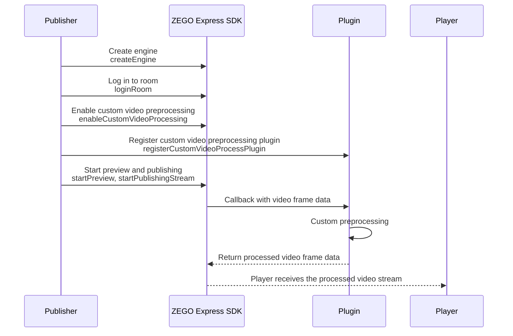

# Custom Video Preprocessing

- - -

## Overview

Video preprocessing is a process between capture and encoding. After capturing video data yourself or obtaining video data captured by the SDK, if the built-in basic beauty filter and watermark features of ZEGO Express SDK cannot meet your needs (for example, the beauty effect does not meet expectations), you can use other video processing SDKs (such as ZegoEffects SDK) to apply special processing to the video, such as beauty filters, watermarks, or stickers. This process is called custom video preprocessing.

Compared with custom video capture, custom video preprocessing does not require you to manage device input sources. You only need to operate on the raw data output by ZEGO Express SDK and then send it back to ZEGO Express SDK.

## Use Cases

- **Custom beauty effects**: You need to use a third-party beauty SDK for advanced beauty features.
- **Video filters**: You need to add filters, stickers, or special effects to the video.
- **Video watermarks**: You need to add custom watermarks to the video.
- **Video cropping or rotation**: You need to crop or rotate the video before publishing the stream.

## Prerequisites

Before implementing custom video preprocessing, make sure that:

- You have created a project in the [ZEGOCLOUD Console](https://console.zegocloud.com) and obtained a valid AppID and AppSign. For details, see [Console - Project Information](/console/project-info).
- You have integrated ZEGO Express SDK in your project and implemented basic audio and video publishing and playing. For details, see [Quick Start - Integration](/real-time-video-electron-js/quick-start/integrating-sdk) and [Quick Start - Implementing the Process](/real-time-video-electron-js/quick-start/implementing-video-call).

## Implementation

The workflow and API calls for custom video preprocessing are as follows:



<Steps>
  <Step title="Initialize the SDK">
    For details, see "Create Engine" and "Log in to Room" in [Quick Start - Implementing the Process](/real-time-video-electron-js/quick-start/implementing-video-call).
  </Step>
  <Step title="Enable custom video preprocessing">
    Before starting preview and publishing, call the [enableCustomVideoProcessing](@enableCustomVideoProcessing) API to enable custom video preprocessing.

    ```js
    // Enable custom video preprocessing
    zgEngine.enableCustomVideoProcessing(true, ZegoPublishChannel.Main);
    ```
  </Step>
  <Step title="Register the custom video preprocessing plugin">
    Call the [registerCustomVideoProcessPlugin](@registerCustomVideoProcessPlugin) API to register the compiled custom video preprocessing plugin with the SDK.

    ```js
    // Import the custom video preprocessing plugin
    var ZegoVideoPreProcess = require("./ZegoExpressVideoPreProcess.node");

    // Register the custom video preprocessing plugin
    zgEngine.registerCustomVideoProcessPlugin(ZegoVideoPreProcess.getEffectsHandler(), ZegoPublishChannel.Main);
    ```
  </Step>
  <Step title="Start preview and publishing">
    After enabling custom video preprocessing and registering the plugin, you can start preview and publishing.

    ```js
    zgEngine.startPreview();
    zgEngine.startPublishingStream(streamID);
    ```
  </Step>
  <Step title="Player plays the processed video stream">
    The player calls the [startPlayingStream](@startPlayingStream) API to play the video stream that has undergone custom preprocessing.

    ```js
    zgEngine.startPlayingStream(streamID, {
        canvas: remoteCanvas
    });
    ```
  </Step>
</Steps>

## Developing a Custom Video Preprocessing Plugin

ZEGO provides a project template for custom video preprocessing plugins. You can develop your own video preprocessing plugin based on this template.

### How the Plugin Works

After capturing video data, the SDK calls the `processImageData` method in your registered plugin and passes the video frame data to you. You perform custom processing (such as beauty filters, filters, etc.) on the video data in this method, and then the SDK encodes and sends the processed data.

### Plugin Development Steps

1. **Get the plugin template**

   <Card title="zego-express-electron-customio-plugin" href="https://artifact-demo.zego.im/core_products/real-time-voice-video/zh/electron-js/video/zego-express-electron-customio-plugin.zip" target="_blank" >
   Download the plugin project template
   </Card>

   You can refer to the `zego-express-video-process-plugin` project structure in the template to create your own video preprocessing plugin project.

2. **Implement the ZegoEffectsHandler interface**

   Implement the `ZegoEffectsHandler` interface in the C++ source file. The SDK passes raw video frame data through the `processImageData` method of this interface:

   ```cpp
   #pragma once

   #include <node_api.h>
   #include "ZegoEffectsHandler.h"
   #include <iostream>

   // Implement the ZegoEffectsHandler interface
   class MyEffectsHandler : public ZegoEffectsHandler
   {
   public:
       void processImageData(unsigned char *data, unsigned int data_length, int width, int height) override
       {
           // Perform custom preprocessing on the video frame data here
           // For example: beauty filters, filters, watermarks, etc.
           printf("processImageData-> data_length: %d\n", data_length);
           printf("processImageData-> width: %d, height: %d\n", width, height);
       }
   };

   // Create a global instance
   MyEffectsHandler g_effects_handler;
   ```

3. **Expose the effects handler instance**

   Expose the effects handler instance to the JavaScript layer through the Node API:

   ```cpp
   // Define the native method GetEffectsHandler to obtain the effects handler instance
   napi_value GetEffectsHandler(napi_env env, napi_callback_info info)
   {
       napi_status status;
       napi_value result;
       status = napi_create_int64(env, (int64_t)&g_effects_handler, &result);
       if(status != napi_ok )
       {
           printf("napi_create_int64 error --- \r\n");
           return nullptr;
       }
       return result;
   }

   // env: the current JavaScript context
   // exports: equivalent to the current file's module.exports, which is an empty object before initialization
   napi_value Init(napi_env env, napi_value exports)
   {
       napi_status status;
       napi_property_descriptor desc ={ "getEffectsHandler", 0, GetEffectsHandler, 0, 0, 0, napi_default, 0 };
       status = napi_define_properties(env, exports, 1, &desc);
       return exports;
   }

   // Register the current module
   NAPI_MODULE(NODE_GYP_MODULE_NAME, Init)
   ```

4. **Compile the plugin**

   Use `node-gyp` to compile and generate the `.node` file:

   ```bash
   # Install dependencies
   npm install nan
   npm install -g node-gyp

   # Compile for Windows (64-bit)
   set x64=true & set plugin_version="1.0.0" & node-gyp rebuild --target=<Electron_version> --arch=x64 --dist-url=https://atom.io/download/electron

   # Compile for macOS
   export plugin_version="1.0.0" && node-gyp rebuild --target=<Electron_version> --arch=x64 --dist-url=https://atom.io/download/electron
   ```

   After successful compilation, copy the generated `.node` file to your project directory and import it in JavaScript using `require`.

## Notes

1. The [enableCustomVideoProcessing](@enableCustomVideoProcessing) API must be called before [startPreview](@startPreview) or [startPublishingStream](@startPublishingStream). If you need to modify the configuration, call [logoutRoom](@logoutRoom) to log out of the room first; otherwise, the changes will not take effect.
2. The callback function should be as efficient as possible. Avoid time-consuming operations that may cause video frame buildup and affect publishing quality.
3. Do not modify the width and height parameters of the video frame in the callback, as this may cause publishing abnormalities.

## Related APIs

| API | Description |
|-----|------|
| [enableCustomVideoProcessing](@enableCustomVideoProcessing) | Enable or disable custom video preprocessing |
| [registerCustomVideoProcessPlugin](@registerCustomVideoProcessPlugin) | Register a custom video preprocessing plugin |
