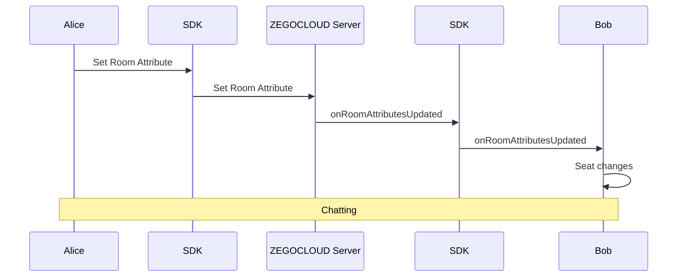
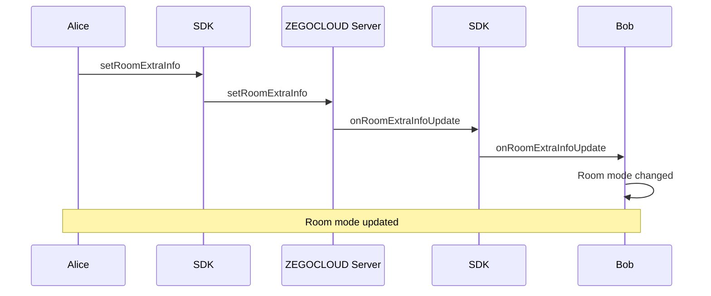
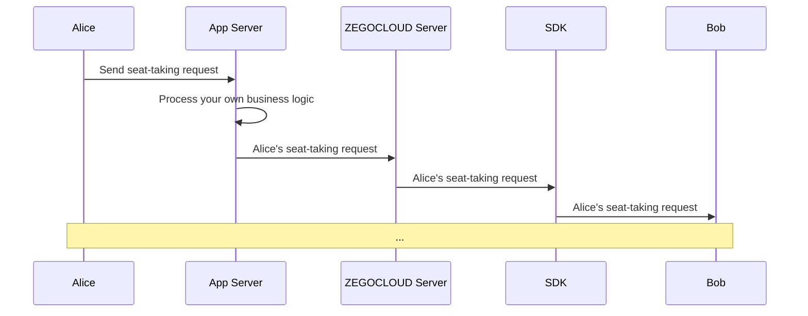

# Implement a live audio room

---

This doc will introduce how to implement a live audio room. 

## Prerequisites

Before you begin, make sure you complete the following:

- Complete SDK integration by referring to **Quick Start** doc.
- Download the [demo](https://github.com/ZEGOCLOUD/zegocloud_sdk_demo_flutter/tree/master/best_practices) that comes with this doc.
- Activate the **In-app Chat** service.


## Preview the effect

You can achieve the following effect with the [demo](https://github.com/ZEGOCLOUD/zegocloud_sdk_demo_flutter/tree/master/best_practices) provided in this doc: 

|Home Page|Host Page|Audience Page|Audience taps the speaker seat|Host check the requests|
|--- | --- | --- |--- |--- |
||||||


> The host can tap the **Lock icon** on the lower right to change the room mode. 
> - Free mode: Audience became the speaker once click the speaker seat. 
> - Request mode: Auidence has to wait for the host to agree with the seat-taking request that is triggered by clicking the speaker seat. 


## Understand the tech

The usage of basic SDK functions has been introduced by [Quick start](../quick-start/quick-start.mdx). If you are not familiar with the concept of stream publishing/playing, please read the document carefully again.

In a live audio room:

- All the audience can start playing streams after entering the room to listen to the speakers on the speaker seat in the room.
- Speaker starts publishing streams after they are on the speaker seat to transmit local audio to the audience in the room.

### How to manage speaker seats

In addition to implementing the above logic, the live audio room also needs to manage speaker seats. The speaker seat management function can usually be implemented using the [Manage room user attributes](/zim-flutter/guides/room/room-user-attributes) feature of the ZIM SDK. 

This feature allows app clients to set and synchronize custom room attributes in the room. Room attributes are stored on the ZEGOCLOUD server in a Key-Value manner, and the ZEGOCLOUD server handles write conflict arbitration and other issues to ensure data consistency. 

At the same time, modifications made by app clients to room attributes are synchronized to all other audiences in the room in real time through the ZEGOCLOUD server. 

> Each room allows a maximum of 20 attributes to be set, with a `key` length limit of 16 bytes and a `value` length limit of 1024 bytes.


Taking Alice takes speaker seat as an example, the process is as follows:




**Using Room Attributes to represent Speaker Seats:**

You can use the speaker seat number in the live audio room as the key of the room attribute and use `userID` as the value of the room attribute to represent the speaker seat status of the room.

> For example, if the user with userID "user123" is on the No.0 speaker seat and the user with userID "user456" is on the No.1 speaker seat, then the room attribute is represented as follows:

```json
{
  "0":"user123", // Indicates te user123 is on the NO.0 speaker seat 
  "1":"user456", // Indicates te user456 is on the NO.1 speaker seat 
}
```

**The design of the room attribute feature can solve some common problems in speaker seat management in live audio room scenario:**

<table>
<tbody><tr>
<th>Feature</th>
<th>Description</th>
<th>Usage</th>
</tr>
<tr>
<td>Owner</td>
<td>The first audience to set a key will become the owner of that key. By default, the key can only be modified by the owner.</td>
<td>Can be used to avoid conflicts when grabbing the speaker seat.</td>
</tr>
<tr>
<td>Automatic Deletion</td>
<td>When setting KV, the key can be configured as "automatically deleted after the owner leaves the room".</td>
<td>Can be used to achieve the function of "automatic update of speaker seat when speaker gets offline", avoiding the problem of speaker seat disorder due to app client disconnection.</td>
</tr>
<tr>
<td>Forced Modification</td>
<td>Supports ignoring the owner and forcefully modifying KV.</td>
<td>Can be used to achieve the function of "Host forcefully remove the audience from speaker seat".&nbsp;</td>
</tr>
<tr>
<td>Combined Operations</td>
<td>Multiple operations on different KVs can be combined into one combined operation to avoid conflicts caused by other users operating related KVs.</td>
<td>Can be used to achieve the function of changing the speaker seat.</td>
</tr>
</tbody></table>


### How to manage room mode

In the live audio room app, you may need to support the host to modify the room mode:

1. Free mode: Audience became the speaker once click the speaker seat. 
2. Request mode: Auidence has to wait for the host to agree with the seat-taking request that is triggered by clicking the speaker seat. 


The room mode is implemented using the [`setRoomExtraInfo`](/unique-api/express-video-sdk/en/dart_flutter/zego_express_engine/ZegoExpressEngineRoom/setRoomExtraInfo.html). `RoomExtraInfo` is similar to the above `RoomAttribute`, also stored on the ZEGOCLOUD server, but the usage of `RoomExtraInfo` is simpler: 
There are no complex parameters, only support for setting a key-value string (key maximum 10 bytes, value maximum 128 bytes), which is more suitable for simple business operations bound to the room, such as room mode, room announcements, etc.

You can encapsulate any business field into the JSON protocol and set it to `RoomExtraInfo` to implement business logic such as room mode.


> When the host calls the [`setRoomExtraInfo`](/unique-api/express-video-sdk/en/dart_flutter/zego_express_engine/ZegoExpressEngineRoom/setRoomExtraInfo.html) method, the in-room users can receive the set `RoomExtraInfo` via [`onRoomExtraInfoUpdate`](/unique-api/express-video-sdk/en/dart_flutter/zego_express_engine/ZegoExpressEngine/onRoomExtraInfoUpdate.html).





### How to request to take a speaker seat using signaling in request mode 

### 1. What is signaling?


The process of co-hosting seat-taking request implemented based on signaling, signaling  is a protocol or message to manage communication and connections in networks. ZEGOCLOUD packages all signaling capabilities into a SDK, providing you with a readily available real-time signaling API.

<Video src="https://www.youtube.com/embed/pfnBmt9FST8"/>

### 2. How to send & receive signaling messages through the ZIM SDK interface

The ZIM SDK provides rich functionality for sending and receiving messages, see [Send & Receive messages (signaling)](/zim-flutter/guides/messaging/send-and-receive-messages). And here, you will need to use the customizable signaling message: `ZIMCommandMessage`


> Complete demo code for this section can be found at [zego_zim_service.dart](https://github.com/ZEGOCLOUD/zegocloud_sdk_demo_flutter/blob/master/best_practices/lib/internal/sdk/zim/zim_service.dart).

(1) Send signals (`ZIMCommandMessage`) in the room by calling [`sendMessage`](https://pub.dev/documentation/zego_zim/latest/zego_zim/ZIM/sendMessage.html) with the following:

```dart
ZIM.getInstance()!.sendMessage(
      ZIMCommandMessage(message: Uint8List.fromList(utf8.encode(signaling))),
      currentRoomID!,
      ZIMConversationType.room,
      ZIMMessageSendConfig(),
    );
```

(2) After sending, other users in the room will receive the signal from the [onReceiveRoomMessage](https://pub.dev/documentation/zego_zim/latest/zego_zim/ZIMEventHandler/onReceiveRoomMessage.html) callback. You can listen to this callback by following below:


```dart
void initEventHandle() {
  // ...
  ZIMEventHandler.onReceiveRoomMessage = onReceiveRoomMessage;
}

final onRoomCommandReceivedEventStreamCtrl = StreamController<OnRoomCommandReceivedEvent>.broadcast();
void onReceiveRoomMessage(_, List<ZIMMessage> messageList, String fromRoomID) {
  for (var element in messageList) {
    if (element is ZIMCommandMessage) {
      final message = utf8.decode(element.message);
      debugPrint('onRoomCommandReceivedEventStreamCtrl: $message');
      onRoomCommandReceivedEventStreamCtrl
              .add(OnRoomCommandReceivedEvent(sender, message));
    } else if (element is ZIMTextMessage) {
      debugPrint('onReceiveRoomTextMessage: ${element.message}');
    }
  }
}
```

<Note title="Note">
In the above code, a commonly used [`StreamController`](https://api.dart.dev/stable/dart-async/StreamController-class.html) in Flutter has been declared, and the `onReceiveRoomMessage` event is distributed through the [`StreamController.add()`](https://api.dart.dev/stable/dart-async/StreamController/add.html) method. Other parts of the app's code can listen to the distributed events through the [`StreamController.stream.listen()`](https://api.dart.dev/stable/dart-async/Stream/listen.html) method.

If you are not familiar with this, you can refer to this Dart tutorial: [Asynchronous programming: Streams](https://dart.dev/tutorials/language/streams)
</Note>


(3) Then in the [`AudioRoomPage`](https://github.com/ZEGOCLOUD/zegocloud_sdk_demo_flutter/blob/master/best_practices/lib/pages/audio_room/audio_room_page.dart), you can use the above [`StreamController`](https://api.dart.dev/stable/dart-async/StreamController-class.html) to listen for custom signals in the room.

The key code is as follows:

```dart
class _AudioRoomPageState extends State<AudioRoomPage> {
  List<StreamSubscription<dynamic>?> subscriptions = [];

  // ...

  @override
  void initState() {
    super.initState();

    subscriptions.addAll([
      ZEGOSDKManager.instance.zimService.onRoomCommandReceivedEventStreamCtrl.stream.listen(OnRoomCommandReceived),
    ]);
    // ...
  }

  void OnRoomCommandReceived(OnRoomCommandReceivedEvent event) {
    // ...
  }

  @override
  void dispose() {
    super.dispose();
    for (final subscription in subscriptions) {
      subscription?.cancel();
    }
  }

  @override
  Widget build(Object context) {
    // ...
  }
}
```


### 3. How to customize business signals

> Complete demo code for this section can be found at [zego_zim_service.dart](https://github.com/ZEGOCLOUD/zegocloud_sdk_demo_flutter/blob/master/best_practices/lib/internal/sdk/zim/zim_service_room_request.dart) and [live_page.dart](https://github.com/ZEGOCLOUD/zegocloud_sdk_demo_flutter/blob/master/best_practices/lib/pages/audio_room/audio_room_page.dart).

**JSON signal encoding**

Since a simple `String` itself is difficult to express complex information, signals can be encapsulated in `JSON` format, making it more convenient for you to organize the protocol content of the signals.

Taking the simplest JSON signal as an example: `{"room_request_type": 10000}`, in such a JSON signal, you can use the `room_request_type` field to express different signal types, such as:

- Sending a seat-taking request: `{"room_request_type": 10000}`
- Canceling a seat-taking request: `{"room_request_type": 10001}`
- Rejecting a seat-taking request: `{"room_request_type": 10002}`
- Accepting a seat-taking request: `{"room_request_type": 10003}`


In addition, you can also extend other common fields for signals, such as `senderID` and `receiverID`, such as:


```dart
final signaling = jsonEncode({
  'type': RoomRequestType.audienceApplyToBecomeCoHost,
  'senderID': ZEGOSDKManager.instance.localUser!.userID,
  'receiverID': getHostUser()?.userID ?? '',
});
```

**JSON signal decoding**

And users who receive signals can decode the JSON signal and know and process specific business logic based on the fields in it, such as:


```dart
void onInComingRoomRequest(OnInComingRoomRequestReceivedEvent event) {
  
}

void onOutgoingRoomRequestAccepted(OnOutgoingRoomRequestAcceptedEvent event) {
  for (final seat in ZegoLiveAudioRoomManager.shared.seatList) {
    if (seat.currentUser.value == null) {
      ZegoLiveAudioRoomManager.shared.takeSeat(seat.seatIndex).then((value) {
        openMicAndStartPublishStream();
      });
      break;
    }
  }
}

void onOutgoingRoomRequestRejected(OnOutgoingRoomRequestRejectedEvent event) {
  isApplyStateNoti.value = false;
  myRoomRequest = null;
}
```

**Further extending signals**

Based on this pattern, when you need to do any protocol extensions in your business, you only need to extend the `room_request_type` field of the signal to easily implement new business logic, such as:

- Muting audience: After receiving the corresponding signal, the UI blocks the user from sending live bullet messages.
- Sending virtual gifts: After receiving the signal, show the gift special effects.
- Removing audience: After receiving the signal, prompt the audience that they have been removed and exit the room.


**Friendly reminder**: 
After reading the following text and further understanding the implementation of seat-taking request signals, you will be able to easily extend your business signals.

<Note title="Note">
The demo in this document is a pure client API + ZEGOCLOUD solution. If you have your own business server and want to do more logical extensions, you can use our [Server API](/real-time-video-server/api-reference/overview) to pass signals and combine your server's room business logic to increase the reliability of your app.

</Note>


## Implementation


Based on the above technical principles, we will explain the implementation details of the live audio room solution to you in detail.

### Integrate and start to use the ZIM SDK

If you have not used the ZIM SDK before, you can read the following section:

<Accordion title="Add the ZIM SDK dependency" defaultOpen="false">


Run the following command in your project root directory:

```bash
flutter pub add zego_zim
flutter pub get
```

</Accordion>

<Accordion title="Use the ZIM SDK" defaultOpen="false">


After successful integration, you can use the ZIM SDK like this: 

```dart
import 'package:zego_zim/zego_zim.dart';
```

Creating a ZIM instance is the very first step, an instance corresponds to a user logging in to the system as a client.
```dart
ZIM.create(
  ZIMAppConfig()
    ..appID = appID
    ..appSign = appSign,
);
```

</Accordion>


Later on, we will provide you with detailed instructions on how to use the ZIM SDK to develop the live audio room feature. 


### Manage multiple SDKs more easily

In most cases, you need to use multiple SDKs together. For example, in the live streaming scenario described in this doc, you need to use the `zim sdk` to implement the speaker seat management feature, and then use the `zego_express_engine sdk` to implement the live streaming feature.

If your app has direct calls to SDKs everywhere, it can make the code difficult to manage and troubleshoot. To make your app code more organized, we recommend the following way to manage these SDKs:


<Accordion title="Create service classes for SDK management" defaultOpen="false">


Create a `ZIMService` class for the `zim sdk`, which manages the interaction with the SDK and stores the necessary data. Please refer to the complete code in [zim_service.dart](https://github.com/ZEGOCLOUD/zegocloud_sdk_demo_flutter/blob/master/best_practices/lib/internal/sdk/zim/zim_service.dart).
```dart
class ZIMService {
  // ...
  Future<void> init({required int appID, String? appSign}) async {
    initEventHandle();
    ZIM.create(
      ZIMAppConfig()
        ..appID = appID
        ..appSign = appSign ?? '',
    );
  }
  // ...
}
```


Similarly, create an `ExpressService` class for the `zego_express_engine sdk`, which manages the interaction with the SDK and stores the necessary data. Please refer to the complete code in [zego_express_service.dart](https://github.com/ZEGOCLOUD/zegocloud_sdk_demo_flutter/blob/master/best_practices/lib/internal/sdk/express/express_service.dart).

```dart
class ExpressService {

  // ...  
  Future<void> init({
    required int appID,
    String? appSign,
    ZegoScenario scenario = ZegoScenario.Broadcast,
  }) async {
    initEventHandle();
    final profile = ZegoEngineProfile(appID, scenario, appSign: appSign);
    await ZegoExpressEngine.createEngineWithProfile(profile);
  }
  // ...  
}
```

With the service, you can add methods to the service whenever you need to use any SDK interface.

E.g., easily add the connectUser method to the ZIMService when you need to implement login:

```dart
class ZIMService {
  // ...
  Future<void> connectUser(String userID, String userName, {String? token}) async {
    ZIMUserInfo userInfo = ZIMUserInfo();
    userInfo.userID = userID;
    userInfo.userName = userName;
    zimUserInfo = userInfo;
    await ZIM.getInstance()!.login(userInfo, token);
  }
  // ...
}
```

</Accordion>

<Accordion title="Create a singleton manager for SDK services" defaultOpen="false">


As shown below. Please refer to the complete code in [zego_sdk_manager.dart](https://github.com/ZEGOCLOUD/zegocloud_sdk_demo_flutter/blob/master/best_practices/lib/zego_sdk_manager.dart).

```dart
class ZEGOSDKManager {
  ZEGOSDKManager._internal();
  factory ZEGOSDKManager() => instance;
  static final ZEGOSDKManager instance = ZEGOSDKManager._internal();

  ExpressService expressService = ExpressService.instance;
  ZIMService zimService = ZIMService.instance;

  Future<void> init(int appID, String? appSign) async {
    await expressService.init(appID: appID, appSign: appSign);
    await zimService.init(appID: appID, appSign: appSign);
  }

  Future<void> connectUser(String userID, String userName, {String? token}) async {
    await expressService.connectUser(userID, userName, token: token);
    await zimService.connectUser(userID, userName, token: token);
  }
  // ...
}
```


In this way, you have implemented a singleton class that manages the SDK services you need. From now on, you can get an instance of this class anywhere in your project and use it to execute SDK-related logic, such as:


- When the app starts up: call `ZEGOSDKManager.instance.init(appID,appSign);` 
- when logging into the room: call `ZEGOSDKManager.instance.loginRoom(roomID);`
- when logging out of the room: call `ZEGOSDKManager.instance.logoutRoom();`

</Accordion>

Later, we will introduce how to add live audio room feature based on this. 


### Speaker seat management

Later, we will introduce how to add the speaker seat management feature based on that. 

#### Take a speaker seat

- For an audience to take a speaker seat, call the [`setRoomAttributes`](https://pub.dev/documentation/zego_zim/latest/zego_zim/ZIM/setRoomAttributes.html) and set the speaker seat number as the key and the audience's userID as the attribute value in the room's additional attributes. If the setting is successful, the audience member has successfully taken a speaker seat and can start publishing streams.

Sample code:

```dart

Future<ZIMRoomAttributesOperatedCallResult?> takeSeat(int seatIndex) async {
  final attributes = {seatIndex.toString(): ZEGOSDKManager.instance.currentUser?.userID ?? ''};
  ZIMRoomAttributesOperatedCallResult? result = await ZEGOSDKManager.instance.zimService.setRoomAttributes(
      attributes,
      isForce: false,
      isUpdateOwner: true,
      isDeleteAfterOwnerLeft: true,
    );
  // ...
  return result;
}
```

The complete reference code can be found at [room_seat_service.dart](https://github.com/ZEGOCLOUD/zegocloud_sdk_demo_flutter/blob/master/best_practices/lib/internal/business/audio_room/room_seat_service.dart).

**Instructions for grabbing the speaker seat:** When taking the speaker seat, set the `isForce` attribute of `ZIMRoomAttributesSetConfig` to false. When multiple audiences try to take the same speaker seat at the same time, the server will receive the first request and return a successful response, setting the owner of that key to the user who made the request. Subsequent modification requests from other users will fail.


#### Leave the speaker seat

- For a speaker to leave the speaker seat, call the [`deleteRoomAttributes`](https://pub.dev/documentation/zego_zim/latest/zego_zim/ZIM/deleteRoomAttributes.html) to delete the speaker seat number that the speaker was using, and stop publishing streams.

Sample code:

```dart
Future<ZIMRoomAttributesOperatedCallResult?> leaveSeat(int seatIndex) async {
  ZIMRoomAttributesOperatedCallResult? result =
      await ZEGOSDKManager.instance.zimService.deleteRoomAttributes([seatIndex.toString()]);
  // ...
  return result;
}
```

The complete reference code can be found at [room_seat_service.dart](https://github.com/ZEGOCLOUD/zegocloud_sdk_demo_flutter/blob/master/best_practices/lib/internal/business/audio_room/room_seat_service.dart).


#### Remove a speaker


When the host needs to remove a speaker from the speaker seat, call the [`deleteRoomAttributes`](https://pub.dev/documentation/zego_zim/latest/zego_zim/ZIM/deleteRoomAttributes.html), and set the `isForce` field of `ZIMRoomAttributesDeleteConfig` to true, to force clear the room attributes of the corresponding speaker seat, thereby removing the speaker from the seat.


```dart
Future<ZIMRoomAttributesOperatedCallResult?> removeSpeakerFromSeat(String userID) async {
  for (var seat in seatList) {
    if (seat.currentUser.value?.userID == userID) {
      ZIMRoomAttributesOperatedCallResult? result = await leaveSeat(seat.seatIndex);
      return result;
    }
  }
  return null;
}
```

The complete reference code can be found at [room_seat_service.dart](https://github.com/ZEGOCLOUD/zegocloud_sdk_demo_flutter/blob/master/best_practices/lib/internal/business/audio_room/room_seat_service.dart).

#### Changing speaker seat

> Ignore this section if you are not going to implement the seat changing function.

When a speaker switches from one seat to another, for example, Speaker A switches from the No.2 seat to the No.3 seat, he needs to first delete the room attribute corresponding to the No.2 seat (to leave No.2 seat), and then set the value of the room attribute corresponding to No.3 seat to their own userID (to take No.3 seat). This process involves two steps. Consider the following extreme situation:

When Speaker A has just completed the first step (deleting the room attribute corresponding to the No.2 seat and leaving the No.2 seat), User B takes the No.3 seat ahead of Speaker A, causing Speaker A to successfully leave the No.2 seat but fail to take the No.3 seat.

In this situation, Speaker A loses the speaker seat, which obviously does not meet expectations.


**To handle this situation, you need to prevent other users from operating on the relevant speaker seats before Speaker A completes the two-step operation. This can be achieved using the feature of combined operations:** 

```dart
// 1. Start the combined operations.
ZIMRoomAttributesBatchOperationConfig config = ZIMRoomAttributesBatchOperationConfig();
config.isForce = true;
config.isDeleteAfterOwnerLeft = false;
config.isUpdateOwner = false;
ZIM.getInstance()!.beginRoomAttributesBatchOperation(mRoomID, config);


// 2. Operation 1: leave the No.2 seat
List<String> keys = ['3'];
ZIMRoomAttributesDeleteConfig config = new ZIMRoomAttributesDeleteConfig();
zim.deleteRoomAttributes(keys, mRoomID, config, callback);
ZIMRoomAttributesDeleteConfig config = ZIMRoomAttributesDeleteConfig();
config.isForce = true;
ZIMRoomAttributesOperatedCallResult result = await ZIM
          .getInstance()!
          .deleteRoomAttributes(keys, mRoomID, config);

// 3. Operation 2: take the No.3 seat
String key = '2';
String value = localUser.userID;
Map<String, String> attributes = {};
attributes[key] = value;
ZIMRoomAttributesSetConfig config = ZIMRoomAttributesSetConfig();
config.isForce = false;
config.isDeleteAfterOwnerLeft = true;
ZIMRoomAttributesOperatedCallResult result = await ZIM.getInstance()!.setRoomAttributes(attributes, mRoomID, config);


// 4. End the combined operations.
ZIM.getInstance()!.endRoomAttributesBatchOperation(mRoomID);
```

<Accordion title="Complete reference code for switching seats" defaultOpen="false">

The complete reference code is as follows:

```dart
Future<ZIMRoomAttributesBatchOperatedResult?> switchSeat(int fromSeatIndex, int toSeatIndex) async {
  if (!isBatchOperation) {
    ZEGOSDKManager.instance.zimService.beginRoomPropertiesBatchOperation();
    isBatchOperation = true;
    tryTakeSeat(toSeatIndex);
    leaveSeat(fromSeatIndex);
    ZIMRoomAttributesBatchOperatedResult? result =
        await ZEGOSDKManager.instance.zimService.endRoomPropertiesBatchOperation();
    isBatchOperation = false;
    return result;
  }
  return null;
}
```

</Accordion>


### Room mode

We define the room mode as follows:

|   | Free mode | Request mode |
|---|---|---|
|roomExtraInfo|`{"lockseat":false}`|`{"lockseat":true}`|


The host can call the [`setRoomExtraInfo`](/unique-api/express-video-sdk/en/dart_flutter/zego_express_engine/ZegoExpressEngineRoom/setRoomExtraInfo.html)  to switch between the Free mode and the Request mode.

```dart
Future<ZegoRoomSetRoomExtraInfoResult> lockSeat() async {
  roomExtraInfoDict['lockseat'] = !isLockSeat.value;
  final dataJson = jsonEncode(roomExtraInfoDict);

  ZegoRoomSetRoomExtraInfoResult result =
      await ZEGOSDKManager.instance.expressService.setRoomExtraInfo(roomKey, dataJson);
  if (result.errorCode == 0) {
    isLockSeat.value = !isLockSeat.value;
  }
  return result;
}
```

The complete reference code can be found at [live_audio_room_manager.dart](https://github.com/ZEGOCLOUD/zegocloud_sdk_demo_flutter/blob/master/best_practices/lib/live_audio_room_manager.dart)


### Request to take a speaker seat using signaling in request mode 

#### Send & Cancel a seat-taking request 

> The implementation of sending and canceling seat-taking requests is similar, with only the type of signal being different. Here, sending will be used as an example to explain the implementation of the demo.

In the Demo, a seat-taking request button has been placed in the lower right corner of the `LivePage` as seen from the **audience perspective**. When the button is clicked, the following actions will be executed.

1. Encode the JSON signal, where the `room_request_type` is defined as `RoomRequestType.audienceApplyToBecomeCoHost` in the demo.


2. Call `sendRoomRequest` to send the signal. (`sendRoomRequest` simplifies the [`sendMessage`](https://pub.dev/documentation/zego_zim/latest/zego_zim/ZIM/sendMessage.html) interface of `ZIM SDK`.)
  - If the method call is successful: the applying status of the local end (i.e. the audience) will be switched to applying for take a seat, and the `seat-taking request` button will switch to `Cancel Take Seat`.
  - If the method call fails: an error message will be prompted. **In actual app development, you should use a more user-friendly UI to prompt the failure of the seat-taking request.**

```dart
// request take seat button UI
Widget requestTakeSeatButton() {
  return SizedBox(
    width: 120,
    height: 30,
    child: OutlinedButton(
      onPressed: () {
        if (!isApplyStateNoti.value) {
          // send take seat request
          final senderMap = <String, dynamic>{};
          senderMap['room_request_type'] =
              RoomRequestType.audienceApplyToBecomeCoHost;
          ZEGOSDKManager.instance.zimService
              .sendRoomRequest(
                  ZegoLiveAudioRoomManager
                          .shared.hostUserNoti.value?.userID ??
                      '',
                  jsonEncode(senderMap))
              .then((value) {
            isApplyStateNoti.value = true;
            myRoomRequest = ZEGOSDKManager.instance.zimService
                .getRoomRequestByRequestID(value.requestID);
          });
        } else {
          // cancel the take seat request
          final roomRequest = ZEGOSDKManager.instance.zimService
              .getRoomRequestByRequestID(myRoomRequest?.requestID ?? '');
          if (roomRequest != null) {
            ZEGOSDKManager.instance.zimService
                .cancelRoomRequest(roomRequest)
                .then((value) {
              isApplyStateNoti.value = false;
              myRoomRequest = null;
            });
          }
        }
      },
      child: ValueListenableBuilder<bool>(
        valueListenable: isApplyStateNoti,
        builder: (context, isApply, _) {
          return Text(
            isApply ? 'cancel apply' : 'apply take seat',
            style: const TextStyle(
              fontSize: 10,
              color: Colors.black,
            ),
          );
        },
      ),
    ),
  );
}
```


The complete reference code can be found at [audio_room_page.dart](https://github.com/ZEGOCLOUD/zegocloud_sdk_demo_flutter/blob/master/best_practices/lib/pages/audio_room/audio_room_page.dart)

3. Afterwards, the local end (audience end) will wait for the response from the host.
  - If the host rejects the seat-taking request: the applying status of the local end will be switched to not applying.
  - If the host accepts the seat-taking request: the audience became a speaker, and can start publishing streams.


#### Accept & Reject the seat-taking request 


1. In the demo, when the host receives a seat-taking request signal, the audience who requested will show in the request list, the host can check the list and choose to accept or reject the audience's seat-taking request after clicking on the request list.
2. After the host responds, a signal of acceptance or rejection will be sent. The related logic of sending signals will not be further described here.

The relevant code snippet is as follows, and the complete code can be found in [audio_room_page.dart](https://github.com/ZEGOCLOUD/zegocloud_sdk_demo_flutter/blob/master/best_practices/lib/pages/audio_room/audio_room_page.dart)


<Accordion title="Handle seat-taking requests" defaultOpen="false">


Add the audience to the request list after receiving his seat-taking request and In the user list, the host can choose to click accept or reject.

```dart
Widget memberItemListView() {
  return ValueListenableBuilder(
    valueListenable: ZEGOSDKManager.instance.zimService.roomRequestMapNoti,
    builder: (context, requestList, _) {
      return ListView.builder(
        itemBuilder: (BuildContext context, int index) {
          return requestMemberItemView(requestList.values.toList()[index]);
        },
        itemCount: requestList.length,
      );
    },
  );
}

Widget requestMemberItemView(RoomRequest request) {
  return Container(
    height: 40,
    color: Colors.white,
    child: Stack(
      children: [
        Positioned(
          top: 5,
          left: 10,
          child: Center(
            child: Text(
              ZEGOSDKManager.instance.getUser(request.senderID)?.userName ??
                  '',
              style: const TextStyle(color: Colors.black, fontSize: 12),
              textAlign: TextAlign.center,
            ),
          ),
        ),
        Positioned(
          top: 5,
          right: 10,
          child: SizedBox(
            width: 100,
            height: 30,
            child: OutlinedButton(
              onPressed: () => ZEGOSDKManager.instance.zimService
                  .rejectRoomRequest(request),
              child: const Text('reject'),
            ),
          ),
        ),
        Positioned(
          top: 5,
          right: 120,
          height: 30,
          child: SizedBox(
            width: 100,
            child: OutlinedButton(
              onPressed: () => ZEGOSDKManager.instance.zimService
                  .acceptRoomRequest(request),
              child: const Text('accept'),
            ),
          ),
        ),
        Container(
          height: 0.5,
          color: Colors.black,
        ),
      ],
    ),
  );
}
```

</Accordion>

## FAQs

<Accordion title="How to determine if the remote microphone device is working normally" defaultOpen="false">

You can listen to the [`onRemoteMicStateUpdate`](/unique-api/express-video-sdk/en/dart_flutter/zego_express_engine/ZegoExpressEngine/onRemoteMicStateUpdate.html) callback notification of Express SDK to determine whether the microphone device of the remote publishing stream device is working normally or turned off, and preliminarily understand the cause of the device problem according to the corresponding state.


<Warning title="Warning">This callback will not be triggered when the remote stream is played from the CDN.</Warning>


</Accordion>


<Accordion title="How to get the sound level of the speaker's voice" defaultOpen="false">

You can listen to the [`onRemoteSoundLevelUpdate`](/unique-api/express-video-sdk/en/dart_flutter/zego_express_engine/ZegoExpressEngine/onRemoteSoundLevelUpdate.html) callback notification of Express SDK to get the sound level of the speaker's voice. 


</Accordion>


## Conclusion

Congratulations! Hereby you have completed the development of the live audio room feature. 

If you have any suggestions or comments, feel free to share them with us via [Discord](https://discord.gg/EtNRATttyp). We value your feedback.
