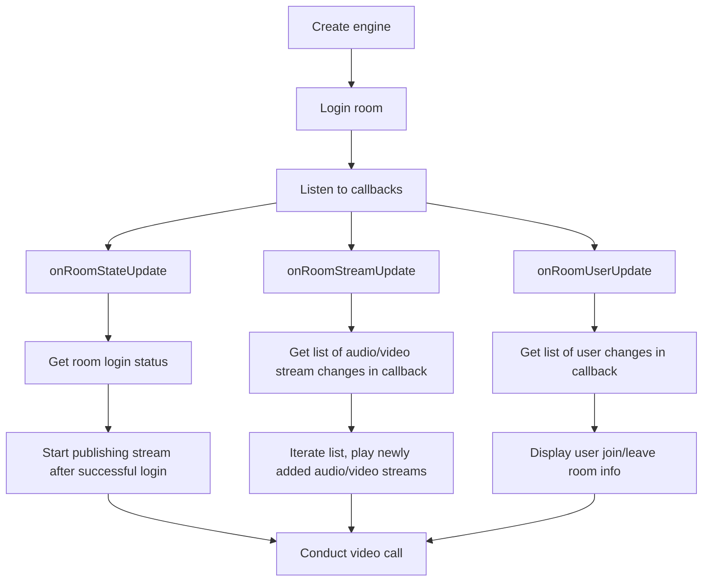
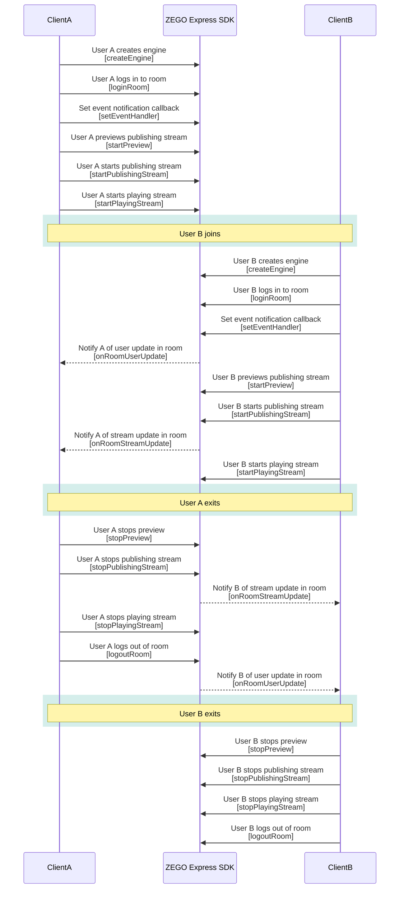

# Multi-Person Video Call

- - -

## Feature Overview

<Warning title="Warning">


This document applies to the following platforms: Android, iOS, Windows.

</Warning>


This document demonstrates how to use ZEGO Express SDK to build a multi-person audio and video call scenario, that is, to implement many-to-many real-time audio and video interaction. Users can make real-time audio and video calls with other users in the room, and publish and play streams with each other. This scenario can be used for multi-person real-time video chat, video conferencing, etc.

<Frame width="512" height="auto" caption=""></Frame>


## Prerequisites

Before applying the multi-person audio and video call scenario, ensure:

- You have integrated ZEGO Express SDK in your project and implemented basic real-time audio and video features. For details, please refer to [Quick Start - Integrating SDK](/real-time-video-flutter/quick-start/integrating-sdk) and [Quick Start - Implementing Video Call](/real-time-video-flutter/quick-start/implementing-video-call).
- You have created a project in the [ZEGOCLOUD Console](https://console.zegocloud.com) and applied for a valid AppID and AppSign. For details, please refer to [Console - Project Information](/console/project-info).


## Usage Steps

This section introduces how to use ZEGO Express SDK to implement multi-person video calls.

- The flow chart for multi-person video calls is as follows:


{/*
<Frame width="512" height="auto" caption=""></Frame>
*/}

- The API call sequence diagram is as follows:


{/*
<Frame width="512" height="auto" caption=""></Frame>
*/}

<Note title="Note">


  ZEGO Express SDK supports multi-person video calls. The above sequence diagram takes real-time video calls between 2 room members as an example. It is recommended that developers refer to the above process to design their own multi-person real-time video call scenarios.

</Note>


### Create Engine

Define the SDK engine object, call the [createEngineWithProfile](https://www.zegocloud.com/unique-api/express-video-sdk/en/dart_flutter/zego_express_engine/ZegoExpressEngine/createEngineWithProfile.html) method, pass the applied AppID and AppSign to the parameters "appID" and "appSign", and create an engine singleton object.

```dart
// Obtain through official website registration, format is 123456789
int appID = appID;
// 64 characters, obtain through official website registration, format is "0123456789012345678901234567890123456789012345678901234567890123"
String appSign = appSign;
// General scenario access
ZegoScenario scenario = ZegoScenario.General;

var profile = ZegoEngineProfile(appID, scenario, appSign: appSign);

// Create engine
ZegoExpressEngine.createEngineWithProfile(profile);
// When using real-time audio and video SDK for audio-only scenarios, you can disable the camera, which will not require camera permissions and publish video streams
// ZegoExpressEngine.instance.enableCamera(false);
```


### Enable Room User Change Notification

Developers need to set "isUserStatusNotify" in [ZegoRoomConfig](https://www.zegocloud.com/unique-api/express-video-sdk/en/dart_flutter/zego_express_engine/ZegoRoomConfig-class.html) to "true" when each user logs in to the room, to receive callback notifications for other users entering and leaving the room.

```dart
var RoomConfig = ZegoRoomConfig.defaultConfig();
RoomConfig.isUserStatusNotify = true;
// Login room
ZegoExpressEngine.instance.loginRoom(roomID, user, config: RoomConfig);
```

### Preview Your Own View and Publish to Remote

After the user calls [loginRoom](https://www.zegocloud.com/unique-api/express-video-sdk/en/dart_flutter/zego_express_engine/ZegoExpressEngineRoom/loginRoom.html), they can call the [startPublishingStream](https://www.zegocloud.com/unique-api/express-video-sdk/en/dart_flutter/zego_express_engine/ZegoExpressEnginePublisher/startPublishingStream.html) method, pass "streamID", and publish their audio and video stream to the ZEGO audio and video cloud. You can know whether publishing is successful through the callback [onPublisherStateUpdate](https://www.zegocloud.com/unique-api/express-video-sdk/en/dart_flutter/zego_express_engine/ZegoExpressEngine/onPublisherStateUpdate.html).

If you want to see your own view, you can call the [startPreview](https://www.zegocloud.com/unique-api/express-video-sdk/en/dart_flutter/zego_express_engine/ZegoExpressEnginePublisher/startPreview.html) method to set the preview view and start local preview.

"streamID" is generated locally by you, but you need to ensure: Under the same AppID, "streamID" is globally unique. If under the same AppID, different users each publish a stream with the same "streamID", the user who publishes later will fail to publish.


```dart
// Perform preview and publish
// If using real-time audio and video SDK or audio and video scenarios, viewID is an int data, developers can obtain it through SDK's createCanvasView
ZegoExpressEngine.instance.startPreview(canvas: ZegoCanvas(viewID));
// If using real-time audio SDK or audio-only scenarios, no need to pass canvas parameter
// ZegoExpressEngine.instance.startPreview();
// The publishing user's local StreamID
ZegoExpressEngine.instance.startPublishingStream("YOUR_STREAM_ID");
```

### Play Audio and Video Streams

**Play Other Users' Audio and Video**

When making video calls, we need to play other users' audio and video.

[onRoomStreamUpdate](https://www.zegocloud.com/unique-api/express-video-sdk/en/dart_flutter/zego_express_engine/ZegoExpressEngine/onRoomStreamUpdate.html): When other users in the same room publish audio and video streams to the ZEGO audio and video cloud, you will receive notifications of new audio and video streams in this callback.

In this callback, you can call [startPlayingStream](https://www.zegocloud.com/unique-api/express-video-sdk/en/dart_flutter/zego_express_engine/ZegoExpressEnginePlayer/startPlayingStream.html), pass "streamID" to play the user's audio and video. You can know whether playing is successful by listening to the [onPlayerStateUpdate](https://www.zegocloud.com/unique-api/express-video-sdk/en/dart_flutter/zego_express_engine/ZegoExpressEngine/onPlayerStateUpdate.html) callback.

**Display User Join/Leave Room Information**

The [onRoomUserUpdate](https://www.zegocloud.com/unique-api/express-video-sdk/en/dart_flutter/zego_express_engine/ZegoExpressEngine/onRoomUserUpdate.html) callback can be used to monitor user changes in the room. When other users in the room enter or exit, this callback will be triggered.

<Warning title="Warning">


When the number of people in the room exceeds 500, the [onRoomUserUpdate](https://www.zegocloud.com/unique-api/express-video-sdk/en/dart_flutter/zego_express_engine/ZegoExpressEngine/onRoomUserUpdate.html) callback is not guaranteed to be effective. If your business scenario involves rooms with more than 500 people, you should not rely on this callback to design business logic. If you need to use this callback when the room has more than 500 people, please contact ZEGOCLOUD Technical Support.


</Warning>


Code example:

```dart
ZegoExpressEngine.onRoomUserUpdate = (String roomID, ZegoUpdateType updateType, List<ZegoUser> userList) {
     // Room user change callback, actual business process needs to be designed by developers as needed
     if(updateType == ZegoUpdateType.Add){
         // When "updateType" is "Add", users can process users in userList
         for(ZegoUser user : userList){
             // user joined room
         }
     }else{
         // When "updateType" is "Delete", users can process users in userList
         for(ZegoUser user : userList){
             // user left room
         }
     }
};

ZegoExpressEngine.onRoomStateUpdate = (String roomID, ZegoRoomState state, int errorCode, Map<String, dynamic> extendedData) {
    // Room state callback
    if(state == ZegoRoomState.Connected){
        // Can be designed according to actual business
    }
};

ZegoExpressEngine.onRoomStreamUpdate = (String roomID, ZegoUpdateType updateType, List<ZegoStream> streamList, Map<String, dynamic> extendedData) {
    // Stream change callback

    // Update UI or perform other operations here
    if(updateType == ZegoUpdateType.Add){
        // When "updateType" is "Add", users can play each audio and video stream in streamList to display the views and sounds of other users in the room
        for(ZegoStream stream : streamList){
            // Play stream
            // viewID is an int data, the viewID here is not the same as the preview viewID, you need to obtain a new one through SDK's createCanvasView; when displaying multi-person video, developers need to create and use different viewIDs to carry different audio and video stream views to ensure that different users' videos do not overlap; the sample code here will overwrite the currently playing view
            ZegoExpressEngine.instance.startPlayingStream(stream.streamID, canvas: ZegoCanvas(viewID));
            // If using real-time audio SDK or audio-only scenarios, no need to pass canvas parameter
            // ZegoExpressEngine.instance.startPlayingStream(stream.streamID);
        }
    }else{
        // When "updateType" is "Delete", users can stop playing the corresponding audio and video streams
        for(ZegoStream stream : streamList){
            // Stop playing stream
            ZegoExpressEngine.instance.stopPlayingStream(stream.streamID);
        }
    }
};
```

### Stop Video Call

During the call, if users in the room need to end the call, please refer to [Quick Start - Implementing Video Call](/real-time-video-flutter/quick-start/implementing-video-call) to complete the related operations in sequence.
