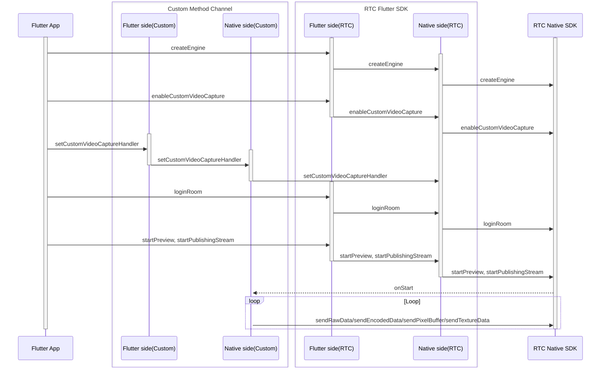

# Custom Video Capture

- - -

## Feature Overview

Custom Video Capture refers to the functionality where developers capture video themselves and provide video data to ZEGO Express SDK, which then performs encoding and publishing. When users enable custom video capture, by default, ZEGO Express SDK will render the local preview on the publishing end, so users don't need to handle rendering themselves.

It is recommended to use SDK's custom video capture functionality when the following situations occur in your business:

- Your app uses a third-party beauty vendor's beauty SDK, which can directly integrate with ZEGO Express SDK's custom video capture functionality. The third-party beauty SDK is responsible for video data capture and pre-processing, while ZEGO Express SDK is responsible for video data encoding and pushing audio/video streams to the ZEGO cloud.
- During live streaming, you need to use additional camera features that conflict with ZEGO Express SDK's default video capture logic, causing the camera to not work properly. For example, you need to record short videos in the middle of live streaming.
- Live streaming non-camera captured data. For example, local video file playback, screen sharing, game live streaming, etc.


## Prerequisites

Before implementing custom video capture, please refer to the [Writing platform-specific code (Plugin implementation)](https://docs.flutter.cn/platform-integration/platform-channels) documentation to create platform channels.


## Usage Steps

The custom video capture usage flow is as follows:

1. Create ZegoExpressEngine engine.
2. Call the `enableCustomVideoCapture` interface to enable custom video capture functionality.
3. Set up custom video capture callback object and implement the corresponding method `setCustomVideoCaptureHandler`.
4. Log in to the room and start publishing, you will receive a custom video capture callback notification to start capturing.
5. On the Native end (iOS and Android), call the send video frame method to provide video frame data to the SDK.
6. Stop publishing, you will receive a custom video capture callback notification to stop capturing.

The API call sequence diagram is as follows, where Native refers to iOS and Android ends:



<Warning title="Note">


- Do not call the `destroyEngine` interface on the Native end (iOS or Android), otherwise it will cause functional abnormalities.
- This document only explains how to enable custom video capture on the Flutter end. For advanced features, please refer to [iOS Custom Video Capture](/real-time-video-ios-oc/video/custom-video-capture) and [Android Custom Video Capture](/real-time-video-android-java/video/custom-video-capture) documentation.


</Warning>


### 1 Enable Custom Video Capture Functionality

Call the [ZegoCustomVideoCaptureConfig](https://doc-zh.zego.im/unique-api/express-video-sdk/zh/dart_flutter/zego_express_engine/ZegoCustomVideoCaptureConfig-class.html) interface to create a custom video capture object, set the [bufferType](https://doc-zh.zego.im/unique-api/express-video-sdk/zh/dart_flutter/zego_express_engine/ZegoCustomVideoCaptureConfig/bufferType.html) property to provide the video frame data type to the SDK, and call the [enableCustomVideoCapture](https://doc-zh.zego.im/unique-api/express-video-sdk/zh/dart_flutter/zego_express_engine/ZegoExpressEngineCustomVideoIO/enableCustomVideoCapture.html) interface to enable custom video capture functionality.


```dart
// Select RawData type video frame data
ZegoCustomVideoCaptureConfig config =
    ZegoCustomVideoCaptureConfig(ZegoVideoBufferType.RawData);
ZegoExpressEngine.instance.enableCustomVideoCapture(
    true,
    config: config,
    channel: ZegoPublishChannel.Main);
```

### 2 Set Custom Video Capture Callback

1. Add the `setCustomVideoCaptureHandler` interface in the Flutter layer, and call the Native layer through `MethodChannel`.

    ```dart
    // Needs to be implemented by the developer
    class ExpressTestImpl {
      final MethodChannel _channel =
          MethodChannel('plugins.zego.im/zego_express_test_demo');

      // Implement Flutter calling Native interface
      Future<void> setCustomVideoCaptureHandler() async {
        await _channel.invokeMethod('setCustomVideoCaptureHandler');
      }
    }
    ```

2. Implement the `setCustomVideoCaptureHandler` interface capability in the Native layer.

<Accordion title="Android Example" defaultOpen="false">
```java
    // CustomVideoCapture.java
    // Implement IZegoFlutterCustomVideoCaptureHandler
    public class CustomVideoCapture implements IZegoFlutterCustomVideoCaptureHandler {
        @SuppressLint("StaticFieldLeak") private static CustomVideoCapture instance;

        public static CustomVideoCapture getInstance() {
            if (instance == null) {
                synchronized (CustomVideoCapture.class) {
                    if (instance == null) {
                        instance = new CustomVideoCapture();
                    }
                }
            }
            return instance;
        }

        @Override
        public void onStart(ZGFlutterPublishChannel channel) {

        }

        @Override
        public void onStop(ZGFlutterPublishChannel channel) {

        }

        @Override
        public void onEncodedDataTrafficControl(ZGFlutterTrafficControlInfo trafficControlInfo,
                                                ZGFlutterPublishChannel channel) {

        }
    }
    ```

    ```java
    // ExpressTestPlugin.java
    // methodChannel example
    public class ExpressTestPlugin implements FlutterPlugin, MethodChannel.MethodCallHandler {

        private MethodChannel methodChannel;

        @Override
        public void onAttachedToEngine(@NonNull FlutterPluginBinding binding) {
            methodChannel = new MethodChannel(binding.getBinaryMessenger(), "plugins.zego.im/zego_express_test_demo");
            methodChannel.setMethodCallHandler(this);
        }

        @Override
        public void onDetachedFromEngine(@NonNull FlutterPluginBinding binding) {
            methodChannel.setMethodCallHandler(null);
        }

        @Override
        public void onMethodCall(@NonNull MethodCall call, @NonNull MethodChannel.Result result) {
            switch (call.method) {
                case "setCustomVideoCaptureHandler": {
                    ZegoCustomVideoCaptureManager.getInstance().setCustomVideoCaptureHandler(CustomVideoCapture.getInstance());
                    result.success(true);
                    break;
                }
            }
        }
    }
    ```
</Accordion>

    <Accordion title="iOS Example" defaultOpen="false">
```objc
    // CustomVideoCapture.h
    @interface CustomVideoCapture : NSObject <ZegoFlutterCustomVideoCaptureHandler>

    /// Get the custom video capture manager instance
    + (instancetype)sharedInstance;

    @end
    ```

    ```objc
    // CustomVideoCapture.m
    @interface CustomVideoCapture()

    @end

    @implementation CustomVideoCapture

    + (instancetype)sharedInstance {
        static CustomVideoCapture *instance = nil;
        static dispatch_once_t onceToken;
        dispatch_once(&onceToken, ^{
            instance = [[CustomVideoCapture alloc] init];
        });
        return instance;
    }

    #pragma mark ZegoFlutterCustomVideoCaptureHandler
    - (void)onStart:(ZGFlutterPublishChannel)channel {
    }

    - (void)onStop:(ZGFlutterPublishChannel)channel {
    }

    - (void)onEncodedDataTrafficControl:(ZGFlutterTrafficControlInfo *)trafficControlInfo channel:(ZGFlutterPublishChannel)channel {
    }

    @end
    ```

    ```objc
    // ZegoExpressTestPlugin.h
    // methodChannel example
    @interface ZegoExpressTestPlugin : NSObject<FlutterPlugin>

    @end
    ```

    ```objc
    // ZegoExpressTestPlugin.m
    // methodChannel example
    @interface ZegoExpressTestPlugin ()

    @property (nonatomic, weak) id<FlutterPluginRegistrar> registrar;

    @property (nonatomic, strong) FlutterMethodChannel *methodChannel;

    @end

    @implementation ZegoExpressTestPlugin

    + (void)registerWithRegistrar:(NSObject<FlutterPluginRegistrar>*)registrar {
        ZegoExpressTestPlugin *instance = [[ZegoExpressTestPlugin alloc] init];

        instance.registrar = registrar;

        FlutterMethodChannel *methodChannel = [FlutterMethodChannel
          methodChannelWithName:@"plugins.zego.im/zego_express_test_demo"
                binaryMessenger:[registrar messenger]];
        [registrar addMethodCallDelegate:instance channel:methodChannel];
        instance.methodChannel = methodChannel;
    }

    - (void)detachFromEngineForRegistrar:(NSObject<FlutterPluginRegistrar>*)registrar {
        [_methodChannel setMethodCallHandler:nil];
        _methodChannel = nil;
        _registrar = nil;
    }

    #pragma mark - Handle Method Call

    - (void)handleMethodCall:(FlutterMethodCall*)call result:(FlutterResult)result {
        SEL selector = NSSelectorFromString([NSString stringWithFormat:@"%@:result:", call.method]);

        // Handle unrecognized method
        if (![self respondsToSelector:selector]) {
            result(@(false));
            return;
        }

        NSMethodSignature *signature = [self methodSignatureForSelector:selector];
        NSInvocation* invocation = [NSInvocation invocationWithMethodSignature:signature];

        invocation.target = self;
        invocation.selector = selector;
        [invocation setArgument:&call atIndex:2];
        [invocation setArgument:&result atIndex:3];
        [invocation invoke];
    }

    - (void)setCustomVideoCaptureHandler:(FlutterMethodCall*)call result:(FlutterResult)result {
        [[ZegoCustomVideoCaptureManager sharedInstance] setCustomVideoCaptureHandler:[CustomVideoCapture sharedInstance]];
        result(@(true));
    }

    @end
    ```
</Accordion>


3. Call `ExpressTestImpl.setCustomVideoCaptureHandler` to set the custom video capture callback.

    ```dart
    ExpressTestImpl.instance.setCustomVideoCaptureHandler();
    ```

### 3 Follow-up Operations

This document only explains how to enable custom video capture on the Flutter end. For advanced features, please refer to [iOS Custom Video Capture](/real-time-video-ios-oc/video/custom-video-capture) and [Android Custom Video Capture](/real-time-video-android-java/video/custom-video-capture) documentation.
