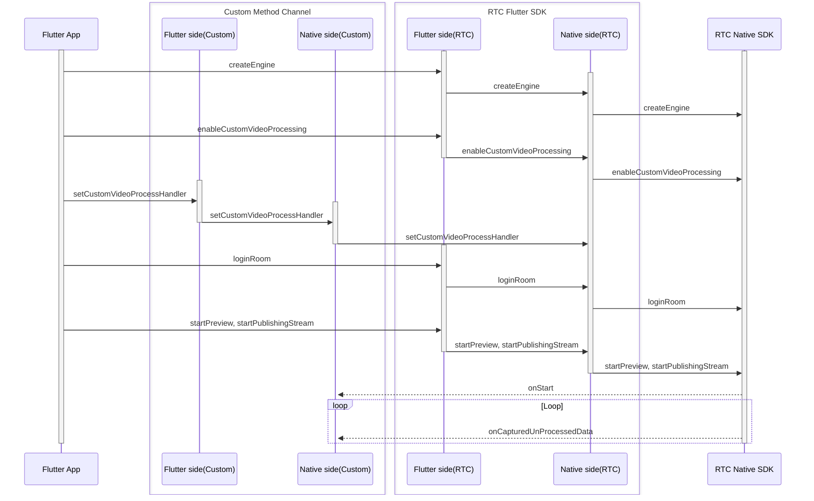

# Custom Video Preprocessing

- - -

## Feature Overview

Video preprocessing is a process between capture and encoding. Developers can capture video data themselves and perform video preprocessing after obtaining the video data captured by the SDK through the SDK's built-in basic beauty effects and watermark features. If the SDK cannot meet the developer's needs (for example, the beauty effect cannot achieve the expected result), they can also use ZEGO Effects SDK to perform special processing on the video, such as beauty effects, adding accessories, etc. This process is custom video preprocessing.

<Frame width="512" height="auto" caption=""></Frame>

Compared with custom video capture, the advantage of custom video preprocessing is that developers do not need to manage device input sources. They only need to operate on the original data provided by ZEGO Express SDK and then send it back to ZEGO Express SDK.

<Note title="Note">
For more complex scenarios, such as wanting to blend layers through camera images, it is recommended that developers use the [Custom Video Capture](/real-time-video-flutter/video/custom-video-capture) feature to implement, which has more room for performance optimization.
</Note>


## Prerequisites

Before performing custom video preprocessing, please refer to the [Writing Platform-Specific Code (Plugin Implementation)](https://docs.flutter.cn/platform-integration/platform-channels) document to create a platform channel.

## Usage Steps

The process and interface calls for custom video preprocessing are as follows:



<Warning title="Note">


- Do not call the `destroyEngine` interface on the Native side (iOS or Android), otherwise it will cause functional abnormalities.
- This document only explains how to enable custom video preprocessing on the Flutter side. For advanced features, please refer to [iOS Custom Video Preprocessing](/real-time-video-ios-oc/video/custom-video-preprocessing) and [Android Custom Video Preprocessing](/real-time-video-android-java/video/custom-video-preprocessing) documents.

</Warning>


### Set Custom Video Preprocessing Configuration

Create a custom video preprocessing [ZegoCustomVideoProcessConfig](https://www.zegocloud.com/docs/unique-api/express-video-sdk/en/dart_flutter/zego_express_engine/ZegoCustomVideoProcessConfig-class.html) object and set the [bufferType](https://www.zegocloud.com/docs/unique-api/express-video-sdk/en/dart_flutter/zego_express_engine/ZegoCustomVideoCaptureConfig/bufferType.html) property to provide the video frame data type to the Express SDK.
Before starting preview and publishing, call the [enableCustomVideoProcessing](https://www.zegocloud.com/docs/unique-api/express-video-sdk/en/dart_flutter/zego_express_engine/ZegoExpressEngineCustomVideoIO/enableCustomVideoProcessing.html) interface to enable the custom video preprocessing feature.

```dart
ZegoCustomVideoProcessConfig config =
    ZegoCustomVideoProcessConfig(ZegoVideoBufferType.RawData);
ZegoExpressEngine.instance.enableCustomVideoProcessing(
    true, config,
    channel: ZegoPublishChannel.Main);
```

### Set Custom Video Preprocessing Callback

1. Add a `setCustomVideoProcessHandler` interface in the Flutter layer and call the Native layer through `MethodChannel`.

```dart
// Implemented by the developer
class ExpressTestImpl {
  final MethodChannel _channel =
      MethodChannel('plugins.zego.im/zego_express_test_demo');

  // Implement Flutter calling Native interface
  Future<void> setCustomVideoProcessHandler() async {
    await _channel.invokeMethod('setCustomVideoProcessHandler');
  }
}
```

2. Implement the `setCustomVideoProcessHandler` interface capability in the Native layer.

<Accordion title="Android Example" defaultOpen="false">
```java
    // CustomVideoProcess.java
    // Implement IZegoFlutterCustomVideoProcessHandler
    public class CustomVideoProcess implements IZegoFlutterCustomVideoProcessHandler {
        @SuppressLint("StaticFieldLeak")
        private static CustomVideoProcess instance;

        public static CustomVideoProcess getInstance() {
            if (instance == null) {
                synchronized (CustomVideoProcess.class) {
                    if (instance == null) {
                        instance = new CustomVideoProcess();
                    }
                }
            }
            return instance;
        }

        @Override
        public void onStart(ZGFlutterPublishChannel channel) {
        }

        @Override
        public void onStop(ZGFlutterPublishChannel channel) {
        }

        @Override
        public void onCapturedUnprocessedTextureData(int textureID, int width, int height, long referenceTimeMillisecond, ZGFlutterPublishChannel channel) {
        }

        @Override
        public void onCapturedUnprocessedRawData(ByteBuffer data, int[] dataLength, ZGFlutterVideoFrameParam param, long referenceTimeMillisecond, ZGFlutterPublishChannel channel) {
        }

        @Override
        public SurfaceTexture getCustomVideoProcessInputSurfaceTexture(int width, int height, ZGFlutterPublishChannel channel) {
        }
    }
    ```

    ```java
    // ExpressTestPlugin.java
    // methodChannel example
    public class ExpressTestPlugin implements FlutterPlugin, MethodChannel.MethodCallHandler {

        private MethodChannel methodChannel;

        @Override
        public void onAttachedToEngine(@NonNull FlutterPluginBinding binding) {
            methodChannel = new MethodChannel(binding.getBinaryMessenger(), "plugins.zego.im/zego_express_test_demo");
            methodChannel.setMethodCallHandler(this);
        }

        @Override
        public void onDetachedFromEngine(@NonNull FlutterPluginBinding binding) {
            methodChannel.setMethodCallHandler(null);
        }

        @Override
        public void onMethodCall(@NonNull MethodCall call, @NonNull MethodChannel.Result result) {
            switch (call.method) {
                case "setCustomVideoProcessHandler": {
                    ZegoCustomVideoProcessManager.getInstance().setCustomVideoProcessHandler(CustomVideoProcess.getInstance());
                    result.success(true);
                    break;
                }
            }
        }
    }
    ```
</Accordion>

    <Accordion title="iOS Example" defaultOpen="false">
```objc
    // CustomVideoProcess.h
    @interface CustomVideoProcess : NSObject <ZegoFlutterCustomVideoProcessHandler>

    /// Get the custom video capture manager instance
    + (instancetype)sharedInstance;

    @end
    ```

    ```objc
    // CustomVideoProcess.m
    @interface CustomVideoProcess()

    @end

    @implementation CustomVideoProcess

    + (instancetype)sharedInstance {
        static CustomVideoProcess *instance = nil;
        static dispatch_once_t onceToken;
        dispatch_once(&onceToken, ^{
            instance = [[CustomVideoProcess alloc] init];
        });
        return instance;
    }

    - (void)onStart:(ZGFlutterPublishChannel)channel {
    }

    - (void)onStop:(ZGFlutterPublishChannel)channel {
    }

    - (void)onCapturedUnprocessedCVPixelBuffer:(CVPixelBufferRef)buffer
                                     timestamp:(CMTime)timestamp
                                       channel:(ZGFlutterPublishChannel)channel {
    }

    @end
    ```

    ```objc
    // ZegoExpressTestPlugin.h
    // methodChannel example
    @interface ZegoExpressTestPlugin : NSObject<FlutterPlugin>

    @end
    ```

    ```objc
    // ZegoExpressTestPlugin.m
    // methodChannel example
    @interface ZegoExpressTestPlugin ()

    @property (nonatomic, weak) id<FlutterPluginRegistrar> registrar;

    @property (nonatomic, strong) FlutterMethodChannel *methodChannel;

    @end

    @implementation ZegoExpressTestPlugin

    + (void)registerWithRegistrar:(NSObject<FlutterPluginRegistrar>*)registrar {
        ZegoExpressTestPlugin *instance = [[ZegoExpressTestPlugin alloc] init];

        instance.registrar = registrar;

        FlutterMethodChannel *methodChannel = [FlutterMethodChannel
          methodChannelWithName:@"plugins.zego.im/zego_express_test_demo"
                binaryMessenger:[registrar messenger]];
        [registrar addMethodCallDelegate:instance channel:methodChannel];
        instance.methodChannel = methodChannel;
    }

    - (void)detachFromEngineForRegistrar:(NSObject<FlutterPluginRegistrar>*)registrar {
        [_methodChannel setMethodCallHandler:nil];
        _methodChannel = nil;
        _registrar = nil;
    }

    #pragma mark - Handle Method Call

    - (void)handleMethodCall:(FlutterMethodCall*)call result:(FlutterResult)result {
        SEL selector = NSSelectorFromString([NSString stringWithFormat:@"%@:result:", call.method]);

        // Handle unrecognized method
        if (![self respondsToSelector:selector]) {
            result(@(false));
            return;
        }

        NSMethodSignature *signature = [self methodSignatureForSelector:selector];
        NSInvocation* invocation = [NSInvocation invocationWithMethodSignature:signature];

        invocation.target = self;
        invocation.selector = selector;
        [invocation setArgument:&call atIndex:2];
        [invocation setArgument:&result atIndex:3];
        [invocation invoke];
    }

    - (void)setCustomVideoProcessHandler:(FlutterMethodCall*)call result:(FlutterResult)result {
        [[ZegoCustomVideoProcessManager sharedInstance] setCustomVideoProcessHandler:[CustomVideoProcess sharedInstance]];
        result(@(true));
    }

    @end
    ```
</Accordion>


3. Call `ExpressTestImpl.setCustomVideoProcessHandler` to set the custom video preprocessing callback.
    ```dart
    ExpressTestImpl.instance.setCustomVideoProcessHandler();
    ```

### Subsequent Operations

This document only explains how to enable custom video preprocessing on the Flutter side. For advanced features, please refer to [iOS Custom Video Preprocessing](/real-time-video-ios-oc/video/custom-video-preprocessing) and [Android Custom Video Preprocessing](/real-time-video-android-java/video/custom-video-preprocessing) documents.
