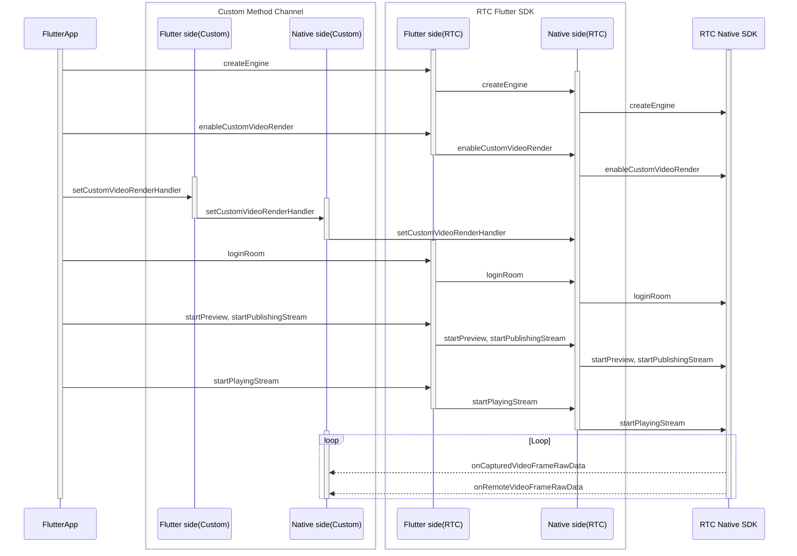

# Custom Video Rendering

- - -

## Feature Overview

Custom video rendering refers to the SDK providing video frame data for local preview and remote stream playing to the outside for users to render themselves.

When the following situations occur in the developer's business, it is recommended to use the SDK's custom video rendering feature:

- The app uses a cross-platform UI framework (e.g., Qt requires interfaces with complex hierarchical relationships to achieve high-experience interaction) or game engines (e.g., Unity, Unreal Engine, Cocos, etc.).
- The app needs to obtain video frame data captured or played by the SDK for special processing.

## Prerequisites

Before implementing the custom video rendering feature, please refer to the [Writing Platform-Specific Code (Plugin Implementation)](https://docs.flutter.cn/platform-integration/platform-channels) document to create a platform channel.

## Usage Steps

The sequence diagram of API interface calls is as follows, where Native is iOS and Android:



<Warning title="Note">
- Do not call the `destroyEngine` interface on the Native side (iOS or Android), otherwise it will cause functional abnormalities.
- This document only explains how to enable custom video rendering on the Flutter side. For advanced features, please refer to [iOS Custom Video Rendering](/real-time-video-ios-oc/video/custom-video-rendering) and [Android Custom Video Rendering](/real-time-video-android-java/video/custom-video-rendering) documents.
</Warning>


### 1 Set Custom Video Rendering Configuration

Create a [ZegoCustomVideoRenderConfig](https://www.zegocloud.com/docs/unique-api/express-video-sdk/en/dart_flutter/zego_express_engine/ZegoCustomVideoRenderConfig-class.html) object and configure custom video rendering parameters. Call the [enableCustomVideoRender](https://www.zegocloud.com/docs/unique-api/express-video-sdk/en/dart_flutter/zego_express_engine/ZegoExpressEngineCustomVideoIO/enableCustomVideoRender.html) interface to enable the custom video rendering feature.


```dart
ZegoCustomVideoRenderConfig config = ZegoCustomVideoRenderConfig(
    ZegoVideoBufferType.RawData,
    ZegoVideoFrameFormatSeries.RGB,
    false);
await ZegoExpressEngine.instance
    .enableCustomVideoRender(true, config);
```

### 2 Set Custom Video Rendering Callback

1. Add a `setCustomVideoRenderHandler` interface in the Flutter layer and call the Native layer through `MethodChannel`.

    ```dart
    // Needs to be implemented by the developer
    class ExpressTestImpl {
      final MethodChannel _channel =
          MethodChannel('plugins.zego.im/zego_express_test_demo');

      // Implement Flutter calling Native interface
      Future<void> setCustomVideoRenderHandler() async {
        await _channel.invokeMethod('setCustomVideoRenderHandler');
      }
    }
    ```

2. Implement the `setCustomVideoRenderHandler` interface capability in the Native layer.

<Accordion title="Android Example" defaultOpen="false">
```java
    // CustomVideoRender.java
    // Implement IZegoFlutterCustomVideoRenderHandler
    public class CustomVideoRender implements IZegoFlutterCustomVideoRenderHandler {
        @SuppressLint("StaticFieldLeak")
        private static volatile CustomVideoRender instance;

        private CustomVideoRender() {}

        public static CustomVideoRender getInstance() {
            if (instance == null) {
                synchronized (CustomVideoRender.class) {
                    if (instance == null) {
                        instance = new CustomVideoRender();
                    }
                }
            }
            return instance;
        }

        @Override
        public void onCapturedVideoFrameRawData(ByteBuffer[] data, int[] dataLength, ZGFlutterVideoFrameParam param, ZGFlutterVideoFlipMode flipMode, ZGFlutterPublishChannel channel) {
        }

        @Override
        public void onRemoteVideoFrameRawData(ByteBuffer[] data, int[] dataLength, ZGFlutterVideoFrameParam param, String streamID) {
        }

        @Override
        public void onRemoteVideoFrameEncodedData(ByteBuffer data, int dataLength, ZGFlutterVideoEncodedFrameParam param, long referenceTimeMillisecond, String streamID) {
        }
    }
    ```

    ```java
    // ExpressTestPlugin.java
    // methodChannel example
    public class ExpressTestPlugin implements FlutterPlugin, MethodChannel.MethodCallHandler {

        private MethodChannel methodChannel;

        @Override
        public void onAttachedToEngine(@NonNull FlutterPluginBinding binding) {
            methodChannel = new MethodChannel(binding.getBinaryMessenger(), "plugins.zego.im/zego_express_test_demo");
            methodChannel.setMethodCallHandler(this);
        }

        @Override
        public void onDetachedFromEngine(@NonNull FlutterPluginBinding binding) {
            methodChannel.setMethodCallHandler(null);
        }

        @Override
        public void onMethodCall(@NonNull MethodCall call, @NonNull MethodChannel.Result result) {
            switch (call.method) {
                case "setCustomVideoRenderHandler": {
                    ZegoCustomVideoRenderManager.getInstance().setCustomVideoRenderHandler(CustomVideoRender.getInstance());
                    result.success(true);
                    break;
                }
            }
        }
    }
    ```
</Accordion>

    <Accordion title="iOS Example" defaultOpen="false">
```objc
    // CustomVideoRender.h
    @interface CustomVideoRender : NSObject <ZegoFlutterCustomVideoRenderHandler>

    /// Get the custom video render manager instance
    + (instancetype)sharedInstance;

    @end
    ```

    ```objc
    // CustomVideoRender.m
    @interface CustomVideoRender()

    @end

    @implementation CustomVideoRender

    + (instancetype)sharedInstance {
        static CustomVideoRender *instance = nil;
        static dispatch_once_t onceToken;
        dispatch_once(&onceToken, ^{
            instance = [[CustomVideoRender alloc] init];
        });
        return instance;
    }

    #pragma mark ZegoFlutterCustomVideoRenderHandler
    - (void)onCapturedVideoFrameRawData:(unsigned char *_Nonnull *_Nonnull)data
                             dataLength:(unsigned int *)dataLength
                                  param:(ZGFlutterVideoFrameParam *)param
                               flipMode:(ZGFlutterVideoFlipMode)flipMode
                                channel:(ZGFlutterPublishChannel)channel {
    }

    - (void)onRemoteVideoFrameRawData:(unsigned char *_Nonnull *_Nonnull)data
                           dataLength:(unsigned int *)dataLength
                                param:(ZGFlutterVideoFrameParam *)param
                             streamID:(NSString *)streamID {
    }

    - (void)onCapturedVideoFrameCVPixelBuffer:(CVPixelBufferRef)buffer
                                        param:(ZGFlutterVideoFrameParam *)param
                                     flipMode:(ZGFlutterVideoFlipMode)flipMode
                                      channel:(ZGFlutterPublishChannel)channel {
    }

    - (void)onRemoteVideoFrameCVPixelBuffer:(CVPixelBufferRef)buffer
                                      param:(ZGFlutterVideoFrameParam *)param
                                   streamID:(NSString *)streamID {
    }

    - (void)onRemoteVideoFrameEncodedData:(unsigned char *_Nonnull)data
                               dataLength:(unsigned int)dataLength
                                    param:(ZGFlutterVideoEncodedFrameParam *)param
                 referenceTimeMillisecond:(unsigned long long)referenceTimeMillisecond
                                 streamID:(NSString *)streamID {
    }

    @end
    ```

    ```objc
    // ZegoExpressTestPlugin.h
    // methodChannel example
    @interface ZegoExpressTestPlugin : NSObject<FlutterPlugin>

    @end
    ```

    ```objc
    // ZegoExpressTestPlugin.m
    // methodChannel example
    @interface ZegoExpressTestPlugin ()

    @property (nonatomic, weak) id<FlutterPluginRegistrar> registrar;

    @property (nonatomic, strong) FlutterMethodChannel *methodChannel;

    @end

    @implementation ZegoExpressTestPlugin

    + (void)registerWithRegistrar:(NSObject<FlutterPluginRegistrar>*)registrar {
        ZegoExpressTestPlugin *instance = [[ZegoExpressTestPlugin alloc] init];

        instance.registrar = registrar;

        FlutterMethodChannel *methodChannel = [FlutterMethodChannel
          methodChannelWithName:@"plugins.zego.im/zego_express_test_demo"
                binaryMessenger:[registrar messenger]];
        [registrar addMethodCallDelegate:instance channel:methodChannel];
        instance.methodChannel = methodChannel;
    }

    - (void)detachFromEngineForRegistrar:(NSObject<FlutterPluginRegistrar>*)registrar {
        [_methodChannel setMethodCallHandler:nil];
        _methodChannel = nil;
        _registrar = nil;
    }

    #pragma mark - Handle Method Call

    - (void)handleMethodCall:(FlutterMethodCall*)call result:(FlutterResult)result {
        SEL selector = NSSelectorFromString([NSString stringWithFormat:@"%@:result:", call.method]);

        // Handle unrecognized method
        if (![self respondsToSelector:selector]) {
            result(@(false));
            return;
        }

        NSMethodSignature *signature = [self methodSignatureForSelector:selector];
        NSInvocation* invocation = [NSInvocation invocationWithMethodSignature:signature];

        invocation.target = self;
        invocation.selector = selector;
        [invocation setArgument:&call atIndex:2];
        [invocation setArgument:&result atIndex:3];
        [invocation invoke];
    }

    - (void)setCustomVideoRenderHandler:(FlutterMethodCall*)call result:(FlutterResult)result {
        [[ZegoCustomVideoRenderManager sharedInstance] setCustomVideoRenderHandler:[CustomVideoRender sharedInstance]];
        result(@(true));
    }

    @end
    ```
</Accordion>


3. Call `ExpressTestImpl.setCustomVideoRenderHandler` to set the custom video rendering callback.
    ```dart
    ExpressTestImpl.instance.setCustomVideoRenderHandler();
    ```

### 3 Subsequent Operations

This document only explains how to enable custom video rendering on the Flutter side. For advanced features, please refer to [iOS Custom Video Rendering](/real-time-video-ios-oc/video/custom-video-rendering) and [Android Custom Video Rendering](/real-time-video-android-java/video/custom-video-rendering) documents.
