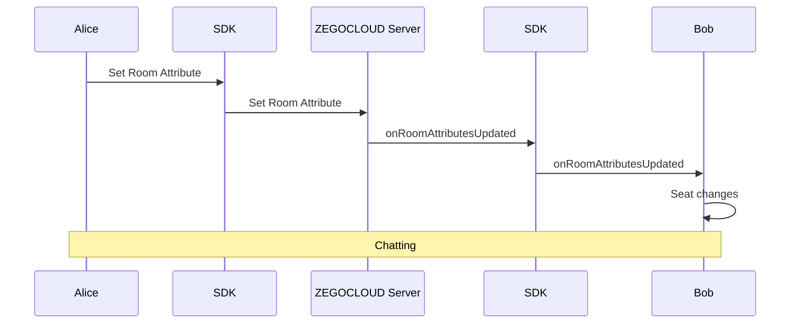
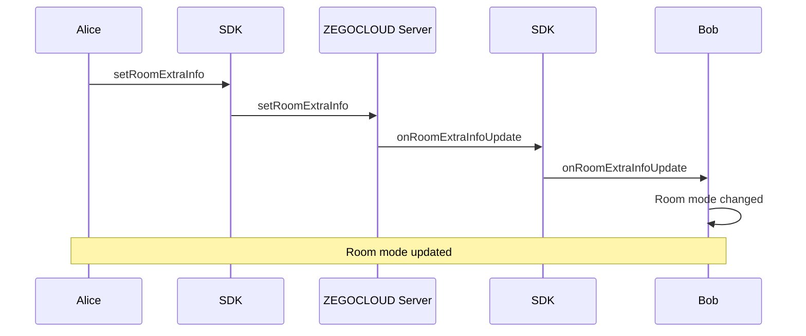
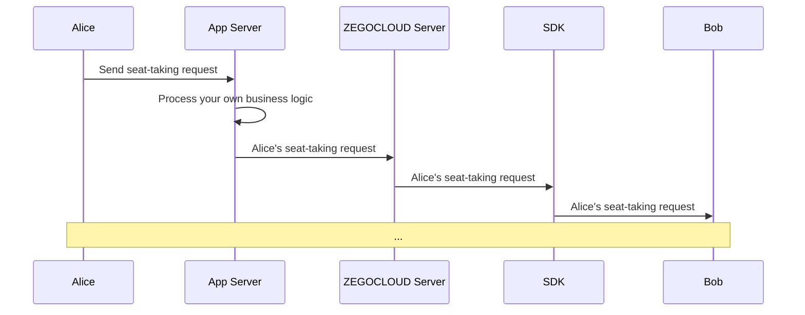

# Implement a live audio room

This doc will introduce how to implement a live audio room. 

## Prerequisites

Before you begin, make sure you complete the following:

- Complete SDK integration by referring to [**Quick Start**](../quick-start/implementing-video-call.mdx) doc.
- Download the [demo](https://github.com/ZEGOCLOUD/zegocloud_sdk_demo_ios/tree/master/best_practice) that comes with this doc.
- Activate the **In-app Chat** service.


## Preview the effect

You can achieve the following effect with the [demo](https://github.com/ZEGOCLOUD/zegocloud_sdk_demo_ios/tree/master/best_practice) provided in this doc: 

|Home Page|Host Page|Audience Page|Audience taps the speaker seat|Host check the requests|
|--- | --- | --- |--- |--- |
||||||


> The host can tap the **Lock icon** on the lower right to change the room mode. 
> - Free mode: Audience became the speaker once click the speaker seat. 
> - Request mode: Auidence has to wait for the host to agree with the seat-taking request that is triggered by clicking the speaker seat. 


## Understand the tech

The usage of basic SDK functions has been introduced by [Quick start](../quick-start/implementing-video-call.mdx). If you are not familiar with the concept of stream publishing/playing, please read the document carefully again.

In a live audio room:

- All the audience can start playing streams after entering the room to listen to the speakers on the speaker seat in the room.
- Speaker starts publishing streams after they are on the speaker seat to transmit local audio to the audience in the room.

### How to manage speaker seats

In addition to implementing the above logic, the live audio room also needs to manage speaker seats. The speaker seat management function can usually be implemented using the [room attribute](/zim-ios/guides/room/room-properties) feature of the ZIM SDK. 

This feature allows app clients to set and synchronize custom room attributes in the room. Room attributes are stored on the ZEGOCLOUD server in a Key-Value manner, and the ZEGOCLOUD server handles write conflict arbitration and other issues to ensure data consistency. 

At the same time, modifications made by app clients to room attributes are synchronized to all other audiences in the room in real time through the ZEGOCLOUD server. 

> Each room allows a maximum of 20 attributes to be set, with a `key` length limit of 16 bytes and a `value` length limit of 1024 bytes.


Taking Alice takes speaker seat as an example, the process is as follows:




**Using Room Attributes to represent Speaker Seats:**

You can use the speaker seat number in the live audio room as the key of the room attribute and use `userID` as the value of the room attribute to represent the speaker seat status of the room.

> For example, if the user with userID "user123" is on the No.0 speaker seat and the user with userID "user456" is on the No.1 speaker seat, then the room attribute is represented as follows:

```json
{
  "0":"user123", // Indicates te user123 is on the NO.0 speaker seat 
  "1":"user456", // Indicates te user456 is on the NO.1 speaker seat 
}
```

**The design of the room attribute feature can solve some common problems in speaker seat management in live audio room scenario:**

<table>
<tbody><tr>
<th>Feature</th>
<th>Description</th>
<th>Usage</th>
</tr>
<tr>
<td>Owner</td>
<td>The first audience to set a key will become the owner of that key. By default, the key can only be modified by the owner.</td>
<td>Can be used to avoid conflicts when grabbing the speaker seat.</td>
</tr>
<tr>
<td>Automatic Deletion</td>
<td>When setting KV, the key can be configured as "automatically deleted after the owner leaves the room".</td>
<td>Can be used to achieve the function of "automatic update of speaker seat when speaker gets offline", avoiding the problem of speaker seat disorder due to app client disconnection.</td>
</tr>
<tr>
<td>Forced Modification</td>
<td>Supports ignoring the owner and forcefully modifying KV.</td>
<td>Can be used to achieve the function of "Host forcefully remove the audience from speaker seat".&nbsp;</td>
</tr>
<tr>
<td>Combined Operations</td>
<td>Multiple operations on different KVs can be combined into one combined operation to avoid conflicts caused by other users operating related KVs.</td>
<td>Can be used to achieve the function of changing the speaker seat.</td>
</tr>
</tbody></table>


### How to manage room mode

In the live audio room app, you may need to support the host to modify the room mode:

1. Free mode: Audience became the speaker once click the speaker seat. 
2. Request mode: Auidence has to wait for the host to agree with the seat-taking request that is triggered by clicking the speaker seat. 


The room mode is implemented using the [`setRoomExtraInfo`](@setRoomExtraInfo). `RoomExtraInfo` is similar to the above `RoomAttribute`, also stored on the ZEGOCLOUD server, but the usage of `RoomExtraInfo` is simpler: 
There are no complex parameters, only support for setting a key-value string (key maximum 10 bytes, value maximum 128 bytes), which is more suitable for simple business operations bound to the room, such as room mode, room announcements, etc.

You can encapsulate any business field into the JSON protocol and set it to `RoomExtraInfo` to implement business logic such as room mode.


> When the host calls the [`setRoomExtraInfo`](@setRoomExtraInfo) method, the in-room users can receive the set `RoomExtraInfo` via [`onRoomExtraInfoUpdate`](@onRoomExtraInfoUpdate).





### How to request to take a speaker seat using signaling in request mode 

#### 1. What is signaling?


The process of co-hosting seat-taking request implemented based on signaling, signaling  is a protocol or message to manage communication and connections in networks. ZEGOCLOUD packages all signaling capabilities into a SDK, providing you with a readily available real-time signaling API.

<Video src="https://www.youtube.com/embed/pfnBmt9FST8"/>

#### 2. How to send & receive signaling messages through the ZIM SDK interface

The ZIM SDK provides rich functionality for sending and receiving messages, see [Send & Receive messages (signaling)](/zim-ios/guides/send-and-receive-messages-signaling). And here, you will need to use the customizable signaling message: `ZIMCommandMessage`


> Complete demo code for this section can be found at [ZIMService+Room.swift](https://github.com/ZEGOCLOUD/zegocloud_sdk_demo_ios/tree/master/best_practice/ZegoCloudSDKDemo/Internal/SDK/ZIM/ZIMService%2BRoomRequest.swift).

(1) Send signals (`ZIMCommandMessage`) in the room by calling [`sendMessage`](@sendMessage) with the following:

```swift
zim?.sendMessage(commandMessage, toConversationID: currentRoom.baseInfo.roomID, conversationType: .room, config: ZIMMessageSendConfig(), notification: nil, callback: { message, errorInfo in
    // ...
})
```

(2) After sending, other users in the room will receive the signal from the [onReceiveRoomMessage](@onReceiveRoomMessage) callback. You can listen to this callback by following below:


```swift
func initWithAppID(_ appID: UInt32, appSign: String?) {
    let zimConfig: ZIMAppConfig = ZIMAppConfig()
    zimConfig.appID = appID
    zimConfig.appSign = appSign ?? ""
    self.zim = ZIM.shared()
    if self.zim == nil {
        self.zim = ZIM.create(with: zimConfig)
    }
    self.zim?.setEventHandler(self)
}

func zim(_ zim: ZIM, receiveRoomMessage messageList: [ZIMMessage], fromRoomID: String) {
    //...
}
```


#### 3. How to customize business signals

> Complete demo code for this section can be found at [ZIMService.swift](https://github.com/ZEGOCLOUD/zegocloud_sdk_demo_ios/tree/master/best_practice/ZegoLiveStreamingPkbattlesDemo/Internal/SDK/ZIM/ZIMService%2BRoomRequest.swift).

**JSON signal encoding**

Since a simple `String` itself is difficult to express complex information, signals can be encapsulated in `JSON` format, making it more convenient for you to organize the protocol content of the signals.

Taking the simplest JSON signal as an example: `{"room_request_type": 10000}`, in such a JSON signal, you can use the `room_request_type` field to express different signal types, such as:

- Sending a seat-taking request: `{"room_request_type": 10000}`
- Canceling a seat-taking request: `{"room_request_type": 10001}`
- Rejecting a seat-taking request: `{"room_request_type": 10002}`
- Accepting a seat-taking request: `{"room_request_type": 10003}`


In addition, you can also extend other common fields for signals, such as `senderID` and `receiverID`, such as:


```swift

extension ZIMService {
            
    func sendRoomRequest(_ receiverID: String, extendedData: String, callback: RoomRequestCallback?){
        // ...
    }
}

public class RoomRequest: NSObject, Codable {
    public var requestID : String
    public var actionType: RoomRequestAction
    public var senderID: String
    public var receiverID: String
    public var extendedData: String
    
    init(requestID: String = "", actionType: RoomRequestAction, senderID: String, receiverID: String, extendedData: String = "") {
        self.requestID = requestID
        self.actionType = actionType
        self.senderID = senderID
        self.receiverID = receiverID
        self.extendedData = extendedData
    }
    
    public func jsonString() -> String? {
        let jsonObject: [String: Any] = ["action_type" : actionType.rawValue, "sender_id": senderID, "receiver_id": receiverID, "request_id": requestID, "extended_data": extendedData]
        return jsonObject.jsonString
    }
}
```

**JSON signal decoding**

And users who receive signals can decode the JSON signal and know and process specific business logic based on the fields in it, such as:


```swift
func zim(_ zim: ZIM, receiveRoomMessage messageList: [ZIMMessage], fromRoomID: String) {
    for message in messageList {
        if message.type == .command {
            let commandMessage: ZIMCommandMessage = message as! ZIMCommandMessage
            let signaling: String = String(data: commandMessage.message, encoding: .utf8) ?? ""
            let messageDict: [String: AnyObject] = convertStringToDictionary(text: message) ?? [:]
            if messageDict.keys.contains("action_type") && userInfo != nil {
                let sender = messageDict["sender_id"] as! String
                let receiver = messageDict["receiver_id"] as! String
                let extendedData: String = messageDict["extended_data"] as? String ?? ""
                let actionType: RoomRequestAction = RoomRequestAction(rawValue: messageDict["action_type"] as! UInt) ?? .request
                if userInfo?.userID == receiver {
                    switch actionType {
                        case .request:
                            //...
                            for delegate in zimEventHandlers.allObjects {
                                delegate.onInComingRoomRequestReceived?(request: roomRequest)
                            }
                        case .accept:
                            //...
                            for delegate in zimEventHandlers.allObjects {
                                delegate.onOutgoingRoomRequestAccepted?(request: roomRequest)
                            }
                        case .reject:
                            //...
                            for delegate in zimEventHandlers.allObjects {
                                    delegate.onOutgoingRoomRequestRejected?(request: roomRequest)
                                }
                        case .cancel:
                            //...
                            for delegate in zimEventHandlers.allObjects {
                                delegate.onInComingRoomRequestCancelled?(request: roomRequest)
                            }
                        }
                }
            }
            //...
        }
    }
    //...
}
```

**Further extending signals**

Based on this pattern, when you need to do any protocol extensions in your business, you only need to extend the `type` field of the signal to easily implement new business logic, such as:

- Muting audience: After receiving the corresponding signal, the UI blocks the user from sending live bullet messages.
- Sending virtual gifts: After receiving the signal, show the gift special effects.
- Removing audience: After receiving the signal, prompt the audience that they have been removed and exit the room.


**Friendly reminder**: 
After reading the following text and further understanding the implementation of seat-taking request signals, you will be able to easily extend your live audio room business signals.

<Note title="Note">

The demo in this document is a pure client API + ZEGOCLOUD solution. If you have your own business server and want to do more logical extensions, you can use our [Server API](#implementation) to pass signals and combine your server's room business logic to increase the reliability of your app.



</Note>


## Implementation


Based on the above technical principles, we will explain the implementation details of the live audio room solution to you in detail.

### Integrate and start to use the ZIM SDK

If you have not used the ZIM SDK before, you can read the following section:

<Accordion title="Integrate the ZIM SDK with Swift Package Manager" defaultOpen="false">


Integrate the SDK automatically with Swift Package Manager

1. Open Xcode and click "File > Add Packages..." in the menu bar, enter the following URL in the "Search or Enter Package URL" search box of the "Apple Swift Packages" pop-up window:

    ```markdown
    https://github.com/zegolibrary/zim-ios
    ```

2. Specify the SDK version you want to integrate in "Dependency Rule" (**Recommended**: use the default rule "Up to Next Major Version"), and then click "Add Package" to import the SDK. You can refer to [Apple Documentation](https://developer.apple.com/documentation/xcode/adding-package-dependencies-to-your-app) for more details.

</Accordion>

<Accordion title="Use the ZIM SDK" defaultOpen="false">


After successful integration, you can use the Zim SDK like this: 

```swift
import ZIM
```

Creating a ZIM instance is the very first step, an instance corresponds to a user logging in to the system as a client.
```swift
func initWithAppID(_ appID: UInt32, appSign: String?) {
    let zimConfig: ZIMAppConfig = ZIMAppConfig()
    zimConfig.appID = appID
    zimConfig.appSign = appSign
    self.zim = ZIM.shared()
    if self.zim == nil {
        self.zim = ZIM.create(with: zimConfig)
    }
    self.zim?.setEventHandler(self)
}
```

</Accordion>


Later on, we will provide you with detailed instructions on how to use the ZIM SDK to develop the live audio room feature. 

### Manage multiple SDKs more easily

In most cases, you need to use multiple SDKs together. For example, in the live streaming scenario described in this doc, you need to use the `zim sdk` to implement the speaker seat management feature, and then use the `zego_express_engine sdk` to implement the live streaming feature.

If your app has direct calls to SDKs everywhere, it can make the code difficult to manage and troubleshoot. To make your app code more organized, we recommend the following way to manage these SDKs:


<Accordion title="Create service classes for SDK management" defaultOpen="false">


Create a `ZIMService` class for the `zim sdk`, which manages the interaction with the SDK and stores the necessary data. Please refer to the complete code in [ZIMService.swift](https://github.com/ZEGOCLOUD/zegocloud_sdk_demo_ios/blob/master/best_practice/ZegoCloudSDKDemo/Internal/SDK/ZIM/ZIMService.swift).
```swift

class ZIMService: NSObject {
    
    // ...
    func initWithAppID(_ appID: UInt32, appSign: String?) {
        let zimConfig: ZIMAppConfig = ZIMAppConfig()
        zimConfig.appID = appID
        zimConfig.appSign = appSign ?? ""
        self.zim = ZIM.shared()
        if self.zim == nil {
            self.zim = ZIM.create(with: zimConfig)
        }
        self.zim?.setEventHandler(self)
    }
    // ...
}
```


Similarly, create an `ExpressService` class for the `zego_express_engine sdk`, which manages the interaction with the SDK and stores the necessary data. Please refer to the complete code in [ExpressService.swift](https://github.com/ZEGOCLOUD/zegocloud_sdk_demo_ios/tree/master/best_practice/ZegoCloudSDKDemo/Internal/SDK/Express/ExpressService.swift).

```swift

class ExpressService: NSObject {
    
    // ...
    public func initWithAppID(appID: UInt32, appSign: String) {
        let profile = ZegoEngineProfile()
        profile.appID = appID
        profile.appSign = appSign
        profile.scenario = .broadcast
        ZegoExpressEngine.createEngine(with: profile, eventHandler: self)
    }
    // ...
}
```

With the service, you can add methods to the service whenever you need to use any SDK interface.

E.g., easily add the connectUser method to the ZIMService when you need to implement login:


```swift
class ZIMService: NSObject {

    // ...
    func connectUser(userID: String, userName: String, token: String?, callback: CommonCallback?) {
        let user = ZIMUserInfo()
        user.userID = userID
        user.userName = userName
        userInfo = user
        zim?.login(with: user, token: token ?? "") { error in
            callback?(Int64(error.code.rawValue), error.message)
        }
    }
}
```

</Accordion>

<Accordion title="Create a singleton manager for SDK services" defaultOpen="false">


As shown below. Please refer to the complete code in [ZegoSDKManager.swift](https://github.com/ZEGOCLOUD/zegocloud_sdk_demo_ios/tree/master/best_practice/ZegoCloudSDKDemo/Internal/ZegoSDKManager.swift).

```swift
class ZegoSDKManager: NSObject {
    
    static let shared = ZegoSDKManager()

    var expressService = ExpressService.shared
    var zimService = ZIMService.shared
    
    func initWithAppID(_ appID: UInt32, appSign: String) {
        expressService.initWithAppID(appID, appSign: appSign)
        zimService.initWithAppID(appID, appSign: appSign)
    }

}
```


In this way, you have implemented a singleton class that manages the SDK services you need. From now on, you can get an instance of this class anywhere in your project and use it to execute SDK-related logic, such as:


- When the app starts up: call `ZegoSDKManager.shared.initWithAppID(appID,appSign);` 
- When starting a livestream: call `ZegoSDKManager.shared.loginRoom(roomID,scenario,callback);`
- When ending a livestream: call `ZegoSDKManager.shared.logoutRoom();`


</Accordion>

Later, we will introduce how to add live audio room feature based on this. 

### Speaker seat management

Later, we will introduce how to add the speaker seat management feature based on that. 

#### Take a speaker seat

- For an audience to take a speaker seat, call the [`setRoomAttributes`](@setRoomAttributes) and set the speaker seat number as the key and the audience's userID as the attribute value in the room's additional attributes. If the setting is successful, the audience member has successfully taken a speaker seat and can start publishing streams.

Sample code:

```swift
func takeSeat(seatIndex: Int, callback: ZIMRoomAttributesOperatedCallback?) {
    guard let localUser = ZegoSDKManager.shared.currentUser else { return }
    ZegoSDKManager.shared.zimService.setRoomAttributes("](seatIndex)", value: localUser.id) { roomID, errorKeys, errorInfo in
        //...
        guard let callback = callback else { return }
        callback(roomID,errorKeys,errorInfo)
    }
}
```

The complete reference code can be found at [RoomSeatService.swift](https://github.com/ZEGOCLOUD/zegocloud_sdk_demo_ios/tree/master/best_practice/ZegoCloudSDKDemo/Internal/Business/AudioRoom/RoomSeatService.swift)

**Instructions for grabbing the speaker seat:** When taking the speaker seat, set the `isForce` attribute of `ZIMRoomAttributesSetConfig` to false. When multiple audiences try to take the same speaker seat at the same time, the server will receive the first request and return a successful response, setting the owner of that key to the user who made the request. Subsequent modification requests from other users will fail.


#### Leave the speaker seat

- For a speaker to leave the speaker seat, call the [`deleteRoomAttributes`](@deleteRoomAttributes) to delete the speaker seat number that the speaker was using, and stop publishing streams.

Sample code:

```swift
func leaveSeat(seatIndex: Int, callback: ZIMRoomAttributesOperatedCallback?) {
    ZegoSDKManager.shared.zimService.deletedRoomAttributes(["](seatIndex)"]) { roomID, errorKeys, errorInfo in
        //...
        guard let callback = callback else { return }
        callback(roomID,errorKeys,errorInfo)
    }
}

```

The complete reference code can be found at [RoomSeatService.swift](https://github.com/ZEGOCLOUD/zegocloud_sdk_demo_ios/tree/master/best_practice/ZegoCloudSDKDemo/Internal/Business/AudioRoom/RoomSeatService.swift)


#### Changing speaker seat

> Ignore this section if you are not going to implement the seat changing function.

When a speaker switches from one seat to another, for example, Speaker A switches from the No.2 seat to the No.3 seat, he needs to first delete the room attribute corresponding to the No.2 seat (to leave No.2 seat), and then set the value of the room attribute corresponding to No.3 seat to their own userID (to take No.3 seat). This process involves two steps. Consider the following extreme situation:

When Speaker A has just completed the first step (deleting the room attribute corresponding to the No.2 seat and leaving the No.2 seat), User B takes the No.3 seat ahead of Speaker A, causing Speaker A to successfully leave the No.2 seat but fail to take the No.3 seat.

In this situation, Speaker A loses the speaker seat, which obviously does not meet expectations.


**To handle this situation, you need to prevent other users from operating on the relevant speaker seats before Speaker A completes the two-step operation. This can be achieved using the feature of combined operations:** 

```swift
// 1. Start the combined operations.
let config = ZIMRoomAttributesBatchOperationConfig()
config.isForce = false
config.isDeleteAfterOwnerLeft = true
config.isUpdateOwner = true
zim?.beginRoomAttributesBatchOperation(with: roomID, config: config)


// 2. Operation 1: leave the No.2 seat
let keys: [String] = ["](3)"]
let config = ZIMRoomAttributesDeleteConfig()
config.isForce = true
zim?.deleteRoomAttributes(by: keys, roomID: roomID, config: config, callback: { roomID, errorKeys, errorInfo in
    if errorInfo.code == .success {
        var temKeys: [String] = keys
        if !errorKeys.isEmpty {
            temKeys.removeAll { el in
                errorKeys.contains { k in
                    el == k
                }
            }
        }
        for key in keys {
            self.inRoomAttributsDict.removeValue(forKey: key)
        }
    }
    callback(roomID,errorKeys,errorInfo)
})

// 3. Operation 2: take the No.3 seat
let key: String = "](2)";
let value: String = localUser.userID;
ZIMRoomAttributesSetConfig config = new ZIMRoomAttributesSetConfig()
config.isDeleteAfterOwnerLeft = true;
config.isUpdateOwner = true;
config.isForce = false;
zim?.setRoomAttributes([key: value], roomID: roomID, config: config, callback: { roomID, errorKeys, errorInfo in
    //...
    callback(roomID,errorKeys,errorInfo)
})


// 4. End the combined operations.
zim?.endRoomAttributesBatchOperation(with: roomID, callback: callback)
```

<Accordion title="Complete reference code for switching seats" defaultOpen="false">

The complete reference code is as follows:

```swift
func switchSeat(fromSeatIndex: Int, toSeatIndex: Int, callback: ZIMRoomAttributesBatchOperatedCallback?) {
    if !batchOperation {
        ZegoSDKManager.shared.zimService.beginRoomPropertiesBatchOperation()
        batchOperation = true
        tryTakeSeat(seatIndex: toSeatIndex, callback: nil)
        leaveSeat(seatIndex: fromSeatIndex, callback: nil)
        ZegoSDKManager.shared.zimService.endRoomPropertiesBatchOperation { roomID, errorInfo in
            self.batchOperation = false
            guard let callback = callback else { return }
            callback(roomID, errorInfo)
        }
    }
}
```

</Accordion>


### Room mode

We define the room mode as follows:

|   | Free mode | Request mode |
|---|---|---|
|roomExtraInfo|`{"lockseat":false}`|`{"lockseat":true}`|


The host can call the [`setRoomExtraInfo`](@setRoomExtraInfo)  to switch between the Free mode and the Request mode.

```swift
func lockSeat(_ lock: Bool) {
    roomExtraInfoDict.updateValue(lock as AnyObject, forKey: "lockseat")
    ZegoSDKManager.shared.expressService.setExpressRoomExtraInfo(key: KEY, value: roomExtraInfoDict.jsonString)
}
```

The complete reference code can be found at [ZegoLiveAudioRoomManager.swift](https://github.com/ZEGOCLOUD/zegocloud_sdk_demo_ios/tree/master/best_practice/ZegoCloudSDKDemo/ZegoLiveAudioRoomManager.swift)


### Request to take a speaker seat using signaling in request mode 

#### Send & Cancel a seat-taking request 

> The implementation of sending and canceling seat-taking requests is similar, with only the type of signal being different. Here, sending will be used as an example to explain the implementation of the demo.

In the Demo, a seat-taking request button has been placed in the lower right corner of the `LivePage` as seen from the **audience perspective**. When the button is clicked, the following actions will be executed.

1. Call `sendRoomRequest` to send the signal. (`sendRoomRequest` simplifies the [`sendMessage`](@sendMessage) interface of `ZIM SDK`.)
  - If the method call is successful: the applying status of the local end (i.e. the audience) will be switched to applying for take a seat, and the `seat-taking request` button will switch to `Cancel Take Seat`.
  - If the method call fails: an error message will be prompted. **In actual app development, you should use a more user-friendly UI to prompt the failure of the seat-taking request.**

2. Call `cancelRoomRequest` to send the signal. (`cancelRoomRequest` simplifies the [`sendMessage`](@sendMessage) interface of `ZIM SDK`.)
  - If the method call is successful: the applying status of the local end (i.e. the audience) will be switched to apply for take a seat, and the `seat-taking request` button will switch to `apply become speaker`.
  - If the method call fails: an error message will be prompted. **In actual app development, you should use a more user-friendly UI to prompt the failure of the seat-taking request.**

```swift
@IBAction func applyBecomeSpeaker(_ sender: Any) {
    if !isApply {
        if let host = audioRoomManager.getHostUser() {
            let commandDict: [String: AnyObject] = ["room_request_type": RoomRequestType.applyCoHost.rawValue as AnyObject]
            ZegoSDKManager.shared.zimService.sendRoomRequest(host.id, extendedData: commandDict.jsonString) { code, message, messageID in
                //...
            }
        }
    } else {
        if let _ = audioRoomManager.getHostUser() {
            let roomRequest: RoomRequest? = ZegoSDKManager.shared.zimService.getRoomRequestByRequestID(
                myRoomRequest?.requestID ?? "");
            guard let roomRequest = roomRequest else { return }
            ZegoSDKManager.shared.zimService.cancelRoomRequest(roomRequest) { code, message, messageID in
                //...
            }
        }
    }
    isApply = !isApply
}

// update UI
var isApply: Bool = false {
    didSet {
        if isApply {
            applyBecomeSpeakerButton.setTitle("Cancel Apply", for: .normal)
        } else {
            applyBecomeSpeakerButton.setTitle("ApplyBecomeSpeaker", for: .normal)
        }
    }
}
```

The complete reference code can be found at [RoomSeatService.swift](https://github.com/ZEGOCLOUD/zegocloud_sdk_demo_ios/tree/master/best_practice/ZegoCloudSDKDemo/Internal/Business/AudioRoom/RoomSeatService.swift)

3. Afterwards, the local end (audience end) will wait for the response from the host.
  - If the host rejects the seat-taking request: the applying status of the local end will be switched to not applying.
  - If the host accepts the seat-taking request: the audience became a speaker, and can start publishing streams.


#### Accept & Reject the seat-taking request 


1. In the demo, when the host receives a seat-taking request signal, the audience who requested will show in the request list, the host can check the list and choose to accept or reject the audience's seat-taking request after clicking on the request list.
2. After the host responds, a signal of acceptance or rejection will be sent. The related logic of sending signals will not be further described here.

The relevant code snippet is as follows, and the complete code can be found in [RoomSeatService.swift](https://github.com/ZEGOCLOUD/zegocloud_sdk_demo_ios/tree/master/best_practice/ZegoCloudSDKDemo/Internal/Business/AudioRoom/RoomSeatService.swift)


<Accordion title="Handle seat-taking requests" defaultOpen="false">


1. Add the audience to the request list after receiving his seat-taking request. 

```swift
class ApplyCoHostListViewController: UIViewController {
    var requestList: [RoomRequest] {
        get {
                var array: [RoomRequest] = []
                ZegoSDKManager.shared.zimService.roomRequestDict.forEach { (_ , request) in
                    array.append(request)
                }
                return array
            }
    }

    @IBOutlet weak var tableView: UITableView! {
        didSet {
            tableView.delegate = self
            tableView.dataSource = self
            tableView.separatorStyle = .none
            tableView.backgroundColor = UIColor.darkGray
            tableView.register(UINib(nibName: "CoHostTableViewCell", bundle: nil), forCellReuseIdentifier: "CoHostCell")
        }
    }

    override func viewDidLoad() {
        super.viewDidLoad()
        // Do any additional setup after loading the view.
        ZegoSDKManager.shared.zimService.addZIMEventHandler(self)
    }
}

extension ApplyCoHostListViewController: UITableViewDelegate, UITableViewDataSource, CoHostTableViewCellDelegate, ZIMServiceDelegate {
    func tableView(_ tableView: UITableView, numberOfRowsInSection section: Int) -> Int {
        return requestList.count
    }

    func tableView(_ tableView: UITableView, cellForRowAt indexPath: IndexPath) -> UITableViewCell {
        let cell: CoHostTableViewCell = tableView.dequeueReusableCell(withIdentifier: "CoHostCell") as! CoHostTableViewCell
        cell.delegate = self
        //...
        return cell
    }

    func onInComingRoomRequestReceived(request: RoomRequest) {
        tableView.reloadData()
    }

    func onInComingRoomRequestCancelled(request: RoomRequest) {
        tableView.reloadData()
    }

    func onActionAcceptIncomingRoomRequest(errorCode: UInt, request: RoomRequest) {
        tableView.reloadData()
    }
    
    func onActionRejectIncomingRoomRequest(errorCode: UInt, request: RoomRequest) {
        tableView.reloadData()
    }
}


```

2. In the user list, the host can choose to click accept or reject.

```swift
extension ApplyCoHostListViewController: CoHostTableViewCellDelegate {
    func agreeCoHostApply(request: RoomRequest) {
        let roomRequest: RoomRequest? = ZegoSDKManager.shared.zimService.roomRequestDict[request.requestID]
        guard let roomRequest = roomRequest else { return }
        ZegoSDKManager.shared.zimService.acceptRoomRequest(roomRequest) { code, message, messageID in
            if code != 0 {
                self.view.makeToast("send custom signaling protocol Failed: ](code)", position: .center)
            }
            self.tableView.reloadData()
        }
    }

    func disAgreeCoHostApply(request: RoomRequest) {
        let roomRequest: RoomRequest? = ZegoSDKManager.shared.zimService.roomRequestDict[request.requestID]
        guard let roomRequest = roomRequest else { return }
        ZegoSDKManager.shared.zimService.rejectRoomRequest(roomRequest) { code, message, messageID in
            if code != 0 {
                self.view.makeToast("send custom signaling protocol Failed: ](code)", position: .center)
            }
            self.tableView.reloadData()
        }
    }
}

```

</Accordion>

## FAQs

<Accordion title="How to determine if the remote microphone device is working normally" defaultOpen="false">

You can listen to the [`onRemoteMicStateUpdate`](@onRemoteMicStateUpdate) callback notification of Express SDK to determine whether the microphone device of the remote publishing stream device is working normally or turned off, and preliminarily understand the cause of the device problem according to the corresponding state.


<Warning title="Warning">This callback will not be triggered when the remote stream is played from the CDN.</Warning>


</Accordion>


<Accordion title="How to get the sound level of the speaker's voice" defaultOpen="false">

You can listen to the [`onRemoteSoundLevelUpdate`](@onRemoteSoundLevelUpdate) callback notification of Express SDK to get the sound level of the speaker's voice. 


</Accordion>


## Conclusion

Congratulations! Hereby you have completed the development of the live audio room feature. 

If you have any suggestions or comments, feel free to share them with us via [Discord](https://discord.gg/EtNRATttyp). We value your feedback.
