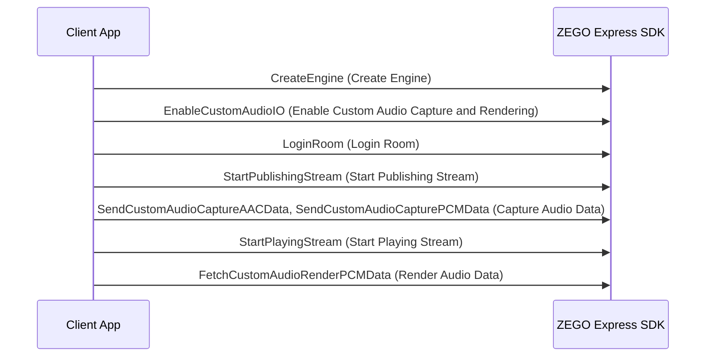

# Custom Audio Capture and Rendering
- - -

## Function Overview

### Custom Audio Capture

In the following scenarios, it is recommended to use the custom audio capture function:

- Developers need to obtain captured input from existing audio streams, audio files, or customized capture systems and hand it over to the SDK for transmission.
- Developers have their own requirements for special audio effect processing on PCM input sources, and after audio effect processing, input it to the SDK for transmission.

### Custom Audio Rendering

When developers have their own rendering requirements, such as special application or processing of the captured raw PCM data before rendering, it is recommended to use the SDK's custom audio rendering function.

<Warning title="Warning">


Audio capture and rendering are divided into 3 situations:

- Internal capture, internal rendering
- Custom capture, custom rendering
- Custom capture, internal rendering

Please choose the appropriate audio capture and rendering method according to your business scenario.

</Warning>


## Prerequisites

Before implementing custom audio capture and rendering, please ensure:

- You have created a project in [ZEGOCLOUD Console](https://console.zegocloud.com) and applied for valid AppID and AppSign. For details, please refer to [Console - Project Information](/console/project-info).
- You have integrated ZEGO Express SDK in the project and implemented basic audio and video streaming functions. For details, please refer to [Quick Start - Integration](/real-time-video-u3d-cs/quick-start/integrating-sdk) and [Quick Start - Implementation](/real-time-video-u3d-cs/quick-start/implementing-video-call).


## Usage Steps

The following is the API interface call sequence diagram:



### 1 Initialize SDK

Please refer to "Create Engine" in [Quick Start - Implementation](/real-time-video-u3d-cs/quick-start/implementing-video-call).

### 2 Enable Custom Audio Capture and Rendering

<Warning title="Warning">


[EnableCustomAudioIO](@EnableCustomAudioIO) needs to be called before [StartPublishingStream](@StartPublishingStream), [StartPlayingStream](@StartPlayingStream), [StartPreview](@StartPreview), [CreateMediaPlayer](@CreateMediaPlayer), [CreateAudioEffectPlayer](@CreateAudioEffectPlayer), and [CreateRealTimeSequentialDataManager](@CreateRealTimeSequentialDataManager) to take effect.

</Warning>


You can call [ZegoCustomAudioConfig](@-ZegoCustomAudioConfig) to set `sourceType = ZegoAudioSourceType.Custom`, and then call the [EnableCustomAudioIO](@EnableCustomAudioIO) interface to enable the custom audio IO function.

```cs
// Set audio source to custom capture and rendering
ZegoCustomAudioConfig config = new ZegoCustomAudioConfig();
config.sourceType = ZegoAudioSourceType.Custom;
engine.EnableCustomAudioIO(true, config);
```

### 3 Login to Room and Publish/Play Stream

Please refer to "Login Room", "Publish Stream", and "Play Stream" in [Quick Start - Implementation](/real-time-video-u3d-cs/quick-start/implementing-video-call).

### 4 Capture Audio Data

Open the audio capture device and pass the captured audio data to the engine through [SendCustomAudioCaptureAACData](@SendCustomAudioCaptureAACData) or [SendCustomAudioCapturePCMData](@SendCustomAudioCapturePCMData).

<Note title="Note">


When using the [SendCustomAudioCaptureAACData](@SendCustomAudioCaptureAACData) or [SendCustomAudioCapturePCMData](@SendCustomAudioCapturePCMData) interface to capture audio, the final ByteBuffer type must be directBuffer (not this type by default), that is, it needs to be initialized through the `allocateDirect` method, otherwise it cannot be used normally.

</Note>


### 5 Render Audio Data

Use [FetchCustomAudioRenderPCMData](@FetchCustomAudioRenderPCMData) to get audio data from the engine, and then play it through the rendering device after getting the audio data.

## FAQ

1. **Timing for calling custom audio capture and rendering related interfaces?**

    - [EnableCustomAudioIO](@EnableCustomAudioIO): Should be called before starting the engine, that is, before starting preview and streaming.
    - [SendCustomAudioCaptureAACData](@SendCustomAudioCaptureAACData)/[SendCustomAudioCapturePCMData](@SendCustomAudioCapturePCMData): Should be called after starting preview and publishing stream. If called before starting preview and publishing stream, the SDK will directly discard the received data.
    - [FetchCustomAudioRenderPCMData](@FetchCustomAudioRenderPCMData): Should be called after calling start playing stream. All data obtained before starting to play stream is invalid muted data.

2. **Frequency of calling custom audio capture and rendering related interfaces?**

    The optimal way is to drive according to the clock of the physical audio device, call [SendCustomAudioCaptureAACData](@SendCustomAudioCaptureAACData) and [SendCustomAudioCapturePCMData](@SendCustomAudioCapturePCMData) when the physical capture device captures data; call [FetchCustomAudioRenderPCMData](@FetchCustomAudioRenderPCMData) when the physical rendering device needs data.

    If there is no specific physical device to drive in the developer's actual scenario, it is recommended to call the above interfaces once every 10 ms to 20 ms.

3. **When calling [FetchCustomAudioRenderPCMData](@FetchCustomAudioRenderPCMData), if the SDK internal data is less than "dataLength", how does the SDK handle it?**

    When "param" is filled in normally, if the SDK internal data is less than "dataLength", the insufficient remaining length will be filled with muted data.
